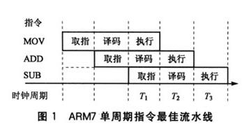

---
tags:
  - todo
---

# 手写 SIMD 向量化

> todo：
    1. 看完全方位介绍，了解寄存器 + SIMD 的工作方式

> 参考博客：
[基础知识-了解SIMD](http://satanwoo.github.io/2019/12/01/SIMD-1/)
[intel SIMD 指令手册](https://www.intel.com/content/www/us/en/docs/intrinsics-guide/index.html#techs=AVX&ig_expand=156,257)
[查看代码的汇编代码(godbolt)](https://godbolt.org/)
[SIMD全方位介绍（不会就看这个）](https://blog.csdn.net/qq_32916805/article/details/117637192)
[](https://blog.csdn.net/zyl910/article/details/7490598)

## 基础知识

*SIMD 优化原理*：当我们无法缩短指令的执行周期缩短的时候，利用 SIMD 技术，则可以在相同的执行周期内完成更多的数据处理



*常见SIMD指令集*：

- MMX 并行计算 64bit 的数据。
- SSE 并行计算 128bit 的数据。
- AVX 并行计算 256bit 的数据。
- AVX512 并行计算 512bit 的数据。

> 每一代的指令集都是对上一代兼容的，支持上一代的指令，也可以使用上一代的寄存器。但是 **不同代际的指令不要混用** ，每次状态切换将消耗 50-80 个时钟周期，会拖慢程序的运行速度。

*SIMD指令集与CPU的兼容状态*：


> 补充芝士：
[SIMD全方位介绍（不会就看这个）](https://blog.csdn.net/qq_32916805/article/details/117637192)
[](https://blog.csdn.net/zyl910/article/details/7490598)


## 指令命名规则

以加法命令为例：

```cpp
__m256d _mm256_add_pd (__m256d a, __m256d b)
```

1. 数据类型 `__m256d`：
    1. `256` ：向量包含 256 bit
    2. `d`： 向量中元素数据类型为 double（其他数据类型还有 `s`-单精度浮点数，`i`-整数）
    3. 由 `256` 和 `d` 可知一个向量中包含 4 个 double
2. 函数名 `_mm256_add_pd`：
    1. `mm256` ：使用 256 bit 的寄存器
    2. `add` ：函数功能是执行加法
    3. `pd`：结果是

> 补充材料：
[常见缩写含义&变量命名规范](https://blog.csdn.net/zyl910/article/details/7490598)

## 常用 SIMD 指令

[中文文档方便查表](https://www.cnblogs.com/walker-lin/p/11354687.html)

### load

```cpp

```


### calculate

```cpp

```

### store

```cpp
void _mm256_store_ps (float * mem_addr, __m256 a)
```

### others

```cpp

```

## 使用方法

*编译指令*：

```shell
-mavx2 # AVX2
-mfma # FMA
```

*头文件*：

```cpp
#include <smmintrin.h>
#include <emmintrin.h>
#include <immintrin.h>
```