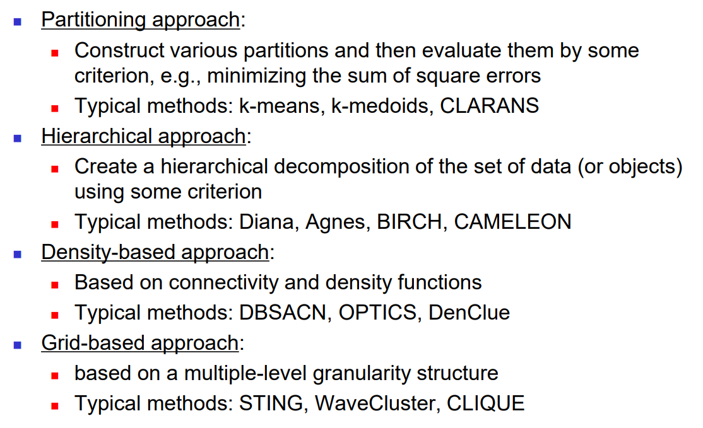
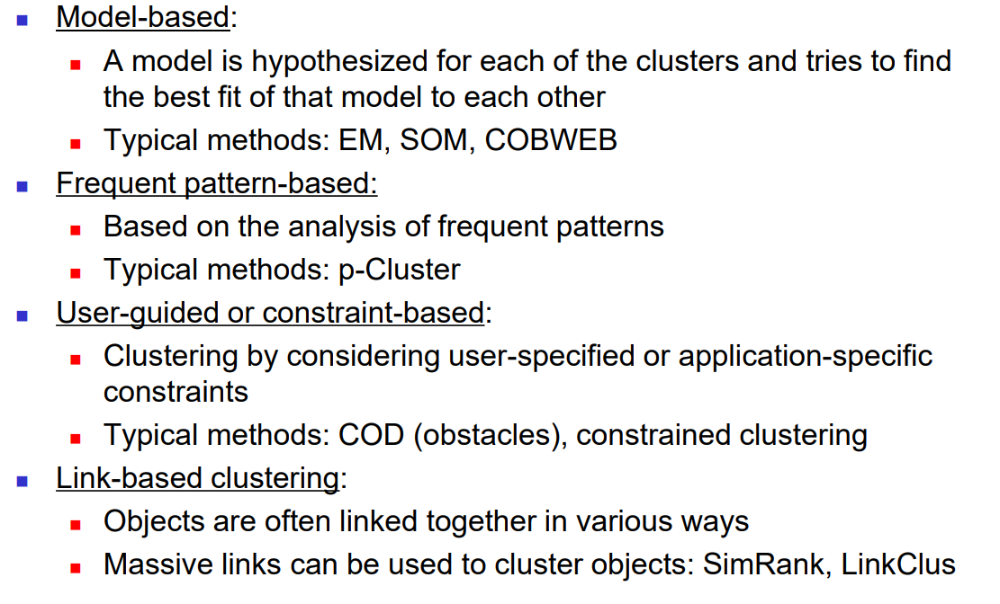

# 数据挖掘导论

[TOC]

## week 1

相对比较水的课，除了代码之外不要花额外的精力。

参考 [cc98 上这篇回忆帖](https://www.cc98.org/topic/5643195)，成绩组成只包含 4 次小作业和 1 次大作业，等着做作业就可以了。

## HW1

- 找数据集
    - [Kaggle UCI ML Drug Review dataset](https://www.kaggle.com/datasets/jessicali9530/kuc-hackathon-winter-2018/)
- 预处理
    - 如数据清洗、补全、降噪、降维、离散化等
    - data cleaning for incomplete data: ignore / fill in null / fill in mean, etc.
    - data cleaning for noisy data: binning or regression to smoothen data, clustering to find outliers
    - dimensionality reduction: PCA
    - data discretization: binning, histogram, cluster analysis(K-means, etc.)
- 可视化
    - 如箱线图、QQ图、Histogram 等
    - 从 ppt no.2 第 11 页开始介绍了数据的一些统计性质
    - ppt no.2 page 14 boxplot analysis, 参考这篇 [python boxplot](https://www.machinelearningplus.com/plots/python-boxplot/)，介绍了分别用 pandas、matplotlib、seaborn 打印 boxplot，用 seaborn 同时打印 histogram & density plot，用 saeborn 同时打印 boxplot & scatter plot，用 seaborn 打印 violin plot
    - ppt no.2 page 19 histogragh, quantile plot, q-q plot
    - ppt no.2 还讲了不少其他可视化方法
    - ppt no.3 chi-square method 展示两个 attribute 之间的相关性
- 分析 & 报告

---

参考：

- [kaggle starter code](https://www.kaggle.com/code/toiyeuem/starter-uci-ml-drug-review-dataset-08ecc634-6): 其中有三种可视化方法，rating 的 histogram，rating & useful count 的 correlation matrix，uniqueID & rating & usefulCount 的 scatter & density plot
- [kaggle DRUGS visual analysis](https://www.kaggle.com/code/umairziact/drugs-reviews-visual-analysis): 预处理部分发现只有 condition 会出现 null、condition 出现频率统计、rating & useful count 散点图、review wordcloud、满分 rating 最多的药统计、低分 rating 最多的药统计、birth control 评价最高的 10 种药

---

计划：

- 预处理
    - 合并 train 和 test dataset
    - 预处理部分发现只有 condition 会出现 null，选择舍弃这部分数据
    - 给 condition 和 drug name 都做一个编号
- 可视化
    - rating 的 histogram
    - birth control 类别中评价最高的 10 种药，再搞一个箱线图展示这些药的评分分布 -> 高分并不意味着药一定好，看下评分的分布更有利于判断
    - condition & drug & rating & usefulCount 的 scatter & density plot 和 correlation map -> 发现 rating 和 usefulCount 之间具有一定的相关性

---

互评：我评的 5 份作业里，数据预处理都做得挺好的，可以参考。

## HW2

背景知识补全：

- 聚类算法 [常用聚类算法 - 知乎 (zhihu.com)](https://zhuanlan.zhihu.com/p/104355127)  
    - kmeans
- 适合做聚类算法的数据集：[一些用于聚类和分类问题的数据集_聚类和分类融合的数据-CSDN博客](https://blog.csdn.net/shengchaohua163/article/details/81630166)
    - what can I use?
- 分类器 [【总结】机器学习中的15种分类算法 - 知乎 (zhihu.com)](https://zhuanlan.zhihu.com/p/670580110)
    - 决策树
    - 朴素贝叶斯
    - rule-based
    - what else?
- 分类器的性能指标 [机器学习-理解Accuracy，Precision，Recall, F1 score以及sklearn实现 - 知乎 (zhihu.com)](https://zhuanlan.zhihu.com/p/405658103)
    - t 检验 
      - [一文详解t检验 - 知乎 (zhihu.com)](https://zhuanlan.zhihu.com/p/138711532)：理论
      - [t检验比较两种算法的性能_优化算法t检验-CSDN博客](https://blog.csdn.net/zyxhangiian123456789/article/details/86089872)：t-test 在模型性能比较中的应用，大致流程
      - [Python实现t-test（T检验）_python t-test-CSDN博客](https://blog.csdn.net/m0_59773145/article/details/119257810)：python 实现
    - accuracy
    - precision
    - recall
    - F1-score
    - what else?

、

实现计划：

- [鸢尾花三种聚类算法（K-means,AGNES,DBScan）的python实现_鸢尾花聚类三种-CSDN博客](https://blog.csdn.net/weixin_42134141/article/details/80413598)：用他的可视化，聚类算法代码抄前面那篇
- [鸢尾花（IRIS）数据集分类（PyTorch实现）_基于pytorch的iris数据集分类-CSDN博客](https://blog.csdn.net/qq_45152498/article/details/128990009)：分类器直接抄
- 

## HW3

背景知识补全：

- 频繁模式 frequent pattern 
    - [【数据挖掘】频繁模式挖掘及Python实现_def rulefromconseq(freqset, h, supportdata, brl, m-CSDN博客](https://blog.csdn.net/weixin_56516468/article/details/121479149)，看前面的基础部分
    - frequent itemset
    - frequent subsequence
    - frequent substructure
    
- 频繁模式挖掘算法
    - [【数据挖掘】频繁模式挖掘及Python实现_def rulefromconseq(freqset, h, supportdata, brl, m-CSDN博客](https://blog.csdn.net/weixin_56516468/article/details/121479149)，介绍了 Apriori 和 FP-Growth，文字看不懂了直接看代码
    - Apriori
    - FP-growth
    - ECLAT

- Interestingness 指标
    - 卡方(chi-square)：[卡方检验 （Chi-square test / Chi-square goodness-of-fit test)-CSDN博客](https://blog.csdn.net/zfcjhdq/article/details/83512680) 这篇介绍原理，[【卡方检验（Chi-Squared Test）的原理简介】_chisquare test-CSDN博客](https://blog.csdn.net/weixin_43837522/article/details/135503845) 这篇介绍 python 实现
    - lift：参考 FP 的 ppt 56 页开始
    - Imbalance Ratio：参考 FP ppt 63 页开始
    - etc

实现计划：

- 使用数据集 [Bank Marketing Dataset (kaggle.com)](https://www.kaggle.com/datasets/janiobachmann/bank-marketing-dataset)，[这是对于每列的含义的介绍](https://archive.ics.uci.edu/dataset/222/bank+marketing)，
- 首先进行预处理，把 balance 等 int 属性值的数据做一个直方图，然后离散化为几个级别，[参考 starter code](https://archive.ics.uci.edu/dataset/222/bank+marketing)
- 实现 aprioro 算法得到 frequent itemset
- 然后把 deposit 作为结果得到 association rules
- 实现 chi-square, lift & imbalance ratio，分析 association rules 的可信度，
- 分析结果
