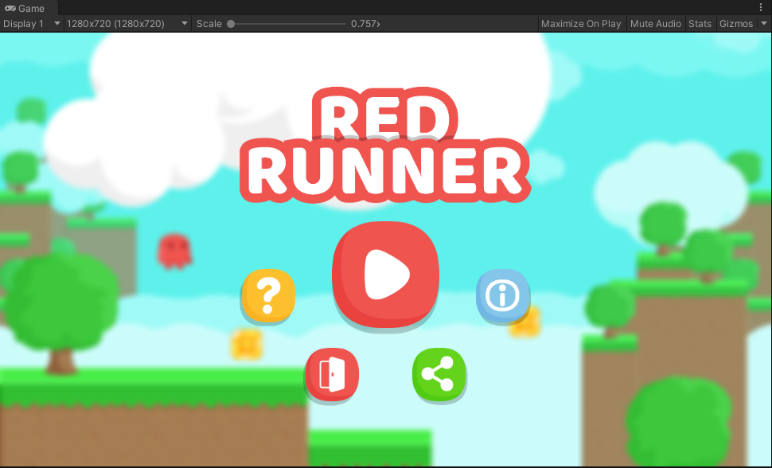
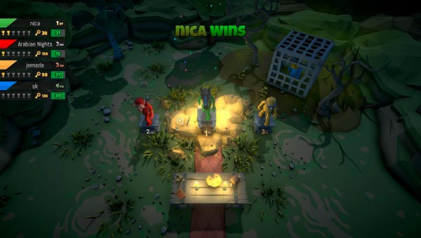
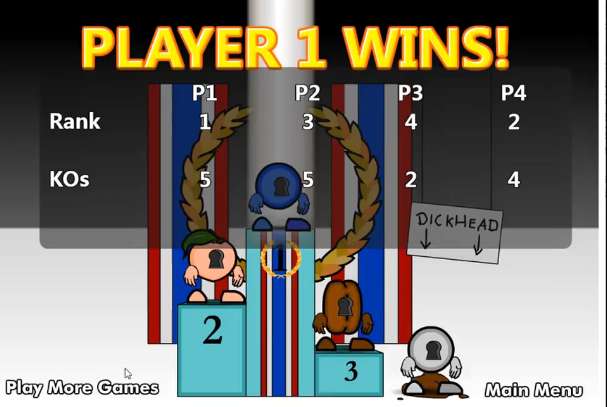

# 计算机游戏程序设计

[TOC]

## week 1

能找到的资料比较少，看起来是用 ue 或者 unity 制作游戏。如果有时间的话可以先学学这两个东西。

- [youtube 上的零基础入门游戏开发教程](https://www.youtube.com/playlist?list=PLFt_AvWsXl0fnA91TcmkRyhhixX9CO3Lw)
- [Code Monkey 的基础教程](https://www.youtube.com/playlist?list=PLzDRvYVwl53vxdAPq8OznBAdjf0eeiipT)
- [reddit 上关于如何入门 unity 的讨论](https://www.reddit.com/r/Unity3D/comments/1221rm9/whats_the_best_way_to_learn_unity_in_2023/)，与很多有用的资源
- [unity 官方教程](https://learn.unity.com/)，看起来做的还是挺全的

成绩组成：

- 书面作业 2 个，40%
- 大作业开发一个小型游戏，60%

[课程主页](http://10.76.1.181/courses/game/2024cs/)

## game technique report

大致方向：2d 游戏技术

上课的内容：

- 地图的创建与显示
    - 地图类型
        - 固定地图：切小块 & 填充地形
        - 滚屏地图：屏幕仅显示固定地图的一部分，例如 clipmap
        - 多层次地图：多层地图运动速度不同，实现伪 3d
        - 菱形地图：表达 2.5d，例如部落冲突
    - 地形生成方法
        - block 边缘：透明度混合，例如草地的土地之间的边界
- 颜色混合与半透明
    - 调色板的设计
        - 挑战：将真实世界颜色压缩到 256 色，有些边界会消失，玩家之间难以区分
        - 方案：通过主色系区别土地、角色等，然后在主色系上拓展颜色，最终确定调色板
    - 图像混合
        - 前景和后景的遮挡关系
        - AlphaBlending 系数调参：例如线对后景的遮挡
    - 其他：通过对比突出建筑的大
- 精灵动画
    - 逐帧动画
    - 前景是图像，背景对应的部分是透明的 -> 使用掩码实现
    - 双缓冲机制：后台计算图像，前台仅做图像替换，避免出现闪烁
- 碰撞检测
    - 常见方法
        - 区域检测：用盒子包围图像，随着算力提升可以增加盒子数量
        - 碰撞点检测
        - 颜色检测：用掩码判断
    - 考虑性能
- 图像操作
    - 例如 warp，DIP 的东西
    - 有现有工具

具体方向：Unity 2d 刚体物理系统

## 大作业

### 初步资料查询

- [unity essential](https://learn.unity.com/pathway/unity-essentials?uv=2021.3)
- [官方素材库](https://assetstore.unity.com/?category=templates&free=true&orderBy=1)：free template
- [平台跳跃小游戏](https://learn.unity.com/project/ping-tai-you-xi-microgame)：有些可以魔改的
- [unity junior programmer pathway](https://learn.unity.com/learn/pathway/junior-programmer)：后面应该无法避免要写一点 script，所以有必要知道代码怎么写
- [unity 2d shooting tutorial](https://www.youtube.com/watch?v=wkKsl1Mfp5M&ab_channel=Brackeys)：讲了怎么设置 ShootingPoint，然后写 bullet 发射和造成伤害的 script
- [2d 平台游戏武器设计](https://www.youtube.com/watch?v=BivL-AsKc3U&ab_channel=Bardent)

### 2d 平台射击小游戏

- [这个教程](https://space.bilibili.com/688712780/channel/collectiondetail?sid=937002&spm_id_from=333.788.0.0)，可以当做一个 outline，要素齐全，但是没解说看着很费劲。
- [Unity 合作](https://blog.csdn.net/weixin_43925843/article/details/124248450)

目前还有啥可以做的：

1. 生命值系统
2. 地图边界：子弹触碰消失，Player 触碰死亡
3. 多玩家
4. 多武器，子弹数量，推力
5. 开始游戏界面：按攻击键启用角色 & 选择武器
6. 找素材换贴图
7. 物品拾取
8. 摄像头移动 & 视角跟踪
9. 背景音乐 & 发射子弹、子弹命中、受伤死亡音效
10. npc 控制（ai？）

### 2.5d 射击游戏

资料：

- [基础教程](https://www.bilibili.com/video/BV1xW41197HX/?p=14&vd_source=fc5d7f6ebecaa54cb57d884a9e457b94)：这个挺细的可以看看
- [2.5d 教程](https://www.bilibili.com/video/BV1Mv421C7TU/?spm_id_from=333.337.search-card.all.click&vd_source=fc5d7f6ebecaa54cb57d884a9e457b94)：他要做的东西和我们类似，可以参考
- [地图素材](https://assetstore.unity.com/packages/3d/props/skull-platform-105664)
- [角色素材](https://assetstore.unity.com/packages/3d/characters/robots/robot-hero-pbr-hp-polyart-106154)
- fuse + mixamo 制作 3d 模型

注意：

1. 注意修改保存到哪个场景里了，hierarchy 面板里有当前场景名字，assets 里面后缀 .unity 的文件就是场景。导入文件看起来没东西的时候找到场景点击打开
2. 项目文件中的 Library 文件夹是 unity 打开项目时会自动生成的，`.gitignore` 中写上 `Library/` 不要上传

分工：

- [x] 新建项目 & 人物、地图、飞行物素材
- [x] 游戏场景搭建 & 人物8方向移动 & 转向控制
- [x] 第二次
    - [x] 角色脚本里加一个血量值
    - [x] 站在岩浆上每秒掉血
    - [x] 按攻击键发射火球
    - [x] 整合脚本 & 复用
    - [x] 发射动画
    - [x] 飞行物保持水平方向恒定速度，竖直方向和地面保持固定距离
    - [x] 火球和角色碰撞后产生爆炸效果、角色击退并扣血
    - [x] 血量值归零之后角色倒地沉到场景下面
- [x] 第三次
    - 岩浆上做一点燃烧效果
    - 角色站在岩浆上起火（比上一个燃烧效果大一点）
    - 改角色颜色或者换其他模型，区分两个角色
    - 生命值 ui，显示在人物头上
- [x] 第四次
    - 开始游戏 scene：显示游戏名字 “岩浆射击” & “press any button to start game”，背景放我们的地图加上模糊效果，参考 
    - 选择玩家 scene：
        - 点击开始游戏之后取消模糊，摄像头拉近到祭坛上，角色出现（先就直接从地里升上来吧之后再改）
        - 给键位提示以及“按 f/ctrl/... 启用角色”的提示，点击对应攻击键启用角色（角色做跳跃动作）
        - 在头上显示准备或者未准备，再次按攻击键准备游戏，所有玩家准备的时候倒计时 3 秒进入游戏
    - 游戏结算 scene：只剩最后一个人活着的时候显示 “P1/P2 Win”，然后跳转到结算界面，参考  
    - 给游戏加一个倒计时，时间耗尽也进入结算
- [ ] 精修一次
    - [ ] 角色出现可以加上素材里的几个 circle 动画
    - [ ] 在选择角色阶段可以自由移动和攻击，死了会在初始点重生
    - [ ] 所有玩家准备之后，角色从当前位置走到开始游戏的位置并恢复血量，然后开始游戏
    - [ ] 角色自动控制脚本，在开始界面的时候背景上角色在自动战斗，也可以启用人机
    - [ ] 解决角色 idle 的时候动画不连续的问题，看起来一抽一抽的
    - [ ] 同时跑动和攻击，试一下动画 blending
    - [ ] 限制只有不在 attack 状态时才能进行 attack
    - [ ] attack 动作有前摇，发射物也需要延迟一段时间出现
    - [ ] 发射物动画后面有一段不需要，怎么只播放前一半（重要）
    - [ ] 击退时间、击退的时候禁用控制、攻击速度 & 限制压起身
- 后续
    - 角色特性
        - 移速快
        - 血量高
        - 质量大（击退效果弱）
        - 攻速快
    - 新模式：道具赛
        - 随机产生回血圈
        - 随机掉陨石击退
        - 大炮圈
        - 随机武器 or buff
- [x] 第五次
    - 改衣服颜色创建新角色
    - 改选角色 scene，四个角色可选，P1 P2 不能重复，使用左右键切换角色，屏幕下方分左右介绍角色特性
    - 改游戏 scene，进入 scene 的时候实例化选择的两个角色，角色头上显示 P1 P2
    - 修目前发现的 bug
- [x] 第六次
    - 选人界面加上角色描述，上次讨论的角色特性是
        - 移速快
        - 血量高
        - 质量大（击退效果弱）
        - 攻速快
    - 选人界面给 P1 加上操作提示：ad 切换角色，s 准备，进入游戏之后 wasd+f 控制。P2 同理
    - 选人界面显示 P1 和 P2 是否已准备
    - 在 GamePlay Manager 中修改角色特性，现在是只修改了 material
    - 结算界面的 play again 跳转到最开始的开始游戏界面，不要直接跳转到游戏界面
- [x] 第七次
    - 进入游戏界面之后倒计时 3 秒再开始游戏
    - 游戏测试 & 修改，目前找到的一些
        - 空气墙，防止角色走出屏幕。现在被打出左右边界既不会死也走不回来
        - 倒地期间的硬直还没做，禁用键盘控制，设定硬直时间
        - 限制攻击速度（或者可以做长按连发）
        - etc
- [x] 第八次
    - 继续改游戏内容
        - 飞行物会消失
        - 人物从前面或者后面走上祭坛，容易穿模
    - 音乐 & 音效
        - [ ] 进入游戏场景之后的战斗 bgm
        - [ ] 倒计时音效
        - [ ] 攻击音效
        - [ ] 击倒音效
- [x] 第九次：先做一个随机掉落陨石的效果
    - 在选角色之后新增一个 scene，选择是否启用每个效果
        - 可以把选择角色的 scene 抄过来，把角色模型换成效果的模型，比如选是否要启用陨石就放个陨石的模型在那里（在素材里有）
        - 这个 scene 里只有 P1 操作，ad 选择，w 启用或者不启用，s 确定进入游戏
        - 然后原来选择角色的两团火，可以一个表示当前在选，一个表示启用
    - 游戏界面的陨石效果：
        - 随机产生坐标，先在地上显示一个圈
        - 延迟一段时间之后陨石下坠
        - 到达地面产生爆炸效果
        - 检测 Player 位置，击退 & 扣血
    - 看看还会不会有穿模的问题
- [x] 第十次
    - [x] 选效果界面修 bug
        - 多次按 s 会重复显示
        - 再次按 s 取消选中
    - 游戏界面
        - [x] 角色会穿过掩体（调低人物速度解决）
        - [x] 加移动速度的那个角色会撞到自己打出去的子弹（调低人物速度解决）
        - [x] 减速效果调试
        - [x] 地图效果出现前给一个提示（比如闪烁），过几秒之后产生效果
        - [x] 陨石 & debuff：加大范围、可以同时存在多个、加强伤害和减速效果
        - [x] 两个角色同时死了会显示两个结算页面
        - [ ] 加强人物的击退效果
    - 导出 & 演示
- [x] 展示 ppt
    - 1 页背景 & 设定
    - 1 页主要玩法
    - 1 页介绍选人
    - 1 页介绍选地图效果
    - 1 页组员贡献
- [ ] 最后的琐事
    - [x] 【hy】改 ppt：加上游戏特色（简单欢乐、完整性好、探索策略） & 一些细节介绍（地图效果的具体设计、数值设计和调整的过程）
    - [x] 【fzh】改 ppt：加上分模块介绍整个工程（场景跳转和参数传递、角色控制、地图效果控制 etc）
    - [x] 【wyy】改 ppt：一页 ppt 写下怎么用粒子效果做火焰的
    - [x] 【wyy】第三方资产说明文档
    - [x] 【wyy】录一个 gameplay 视频
    - [x] 【hxm & cyx】等 ppt 改完之后整理补充成设计 & 开发文档
    - [x] 【fzh】打分的情况

---

p.s. 最终提交要求：

@所有人 请在下周日6月23日23:59之前将期末大作业发送到作业邮箱。

具体应包含
1. 游戏相关设计与开发文档，完善后的报告ppt。
2. 游戏完整工程文件（可编译执行，视容量大小可另附网盘链接）。
3. 录制的游戏gameplay视频，展示游戏完整流程。
4. 对于游戏中使用第三方资产、工程的说明。
5. 组内同学详细分工的说明。
6. 展示当天对其他小组的评分（10分制，每个成员一份）

以上内容每个小组仅需发送一份
邮件标题按照：小组序号-小组代表名字-游戏名称，进行命名