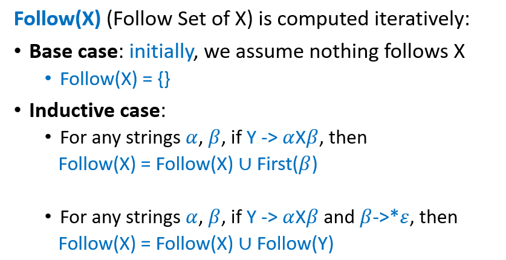

# 编译原理

[TOC]

## week 1

这门课咸鱼暄做过朋辈辅学，真的可以让我省下很多整理的时间，感谢 xyx！

- [笔记](https://www.yuque.com/xianyuxuan/coding/compiler)
- [朋辈辅学录播](https://space.bilibili.com/18777618/channel/collectiondetail?sid=288316&ctype=0)

还有一篇 [助教的学习建议](https://www.cc98.org/topic/5641876)，在听课或者写大程感到迷茫的时候可以去看，里面有推荐别的参考资料。

成绩组成：

- 作业 10%
- quiz 10%
- 期中考 15%
- lab x 5 25%
- 期末考 40%

## week 2

咸鱼暄：

- 大部分内容 & 提纲
- 习题解答

cms 的 ppt：

- DFA 的最小化（chapter 2 ppt 68-71）

## week 3 Parser

### LL(1)

- 计算 Nullable Sets：
- 计算 First Sets：
- 计算 Follow Sets：
- 通过上面 3 个 Sets 计算 Parsing Table：
- 如果发现不是 LL(1)，想要改成 LL(1) 

p.s. ppt 上和 xyx 笔记上有一点不同，ppt 上多一个 Nullable Set，而笔记上是把 Nullable Set 合并到 First Set 里面了。 LL(1) 之前的其他部分可以看 xyx 

### LL(0)

==todo==

## week 4 Parser

表达能力 

### LR(1)

一般是直接构造 DFA 了

- 先算出 First Set
- Closure 确定哪些 item 在同一个 state 里 
- Goto 确定状态转移 
- Reduce 确定哪些 item 可以 reduce 
- 然后画状态图，下面是一个例子 
- 然后做 parsing table，下面是一个例子 
- 在做 parsing 的时候维护一个 state stack。可以选择也维护一个 symbol stack，这是可以省略的但是在手算的时候更方便一点
    - shift 和 goto 操作就往 state stack 里面 push 一个 state，往 symbol stack 里面 push 一个 symbol
    - reduce 的时候，production 右边有多少 symbol 就 pop 多少个 state 和 symbol。state stack 和 symbol stack 中元素数量始终差 1。

### LALR(1)

在 LR(1) 的基础上，合并除了 lookahead symbol 之外完全相同的状态，合并方法就是直接把 parsing table 里面的两行并在一起，在下面的图中就是相同颜色的状态合并。但是可能产生 reduce-reduce conflict 

### LR(0)

### SLR

## 实验

### lab0 配置实验环境

这次准备使用 Ubuntu 虚拟机进行实验。

参考资料：

- [实验指导](https://accsys.pages.zjusct.io/accipit/environment/)
- [VMWare 安装 Ubuntu 虚拟机教程](https://blog.csdn.net/qq_43374681/article/details/129248167)
- [gitlab 课程仓库](https://accsys.pages.zjusct.io/accipit/environment/)

一些问题：

- `pkexec` 命令表示使用 root 运行指令，`pkexec chmod 444 /etc/sudoers` 在 `sudo su -` 不能运行的时候救命用
- 虚拟机输入法？搜索引擎搜索“Ubuntu22.04-添加中文输入法”
- 虚拟机共享文件夹？[除了在 VMWare 里设置之外还要再加一步](https://blog.csdn.net/weixin_54051652/article/details/128316296)
- gcc 怎么选择版本？[使用 update-alternatives 工具](https://www.jianshu.com/p/f66eed3a3a25)，[具体原理](https://askubuntu.com/questions/233190/what-exactly-does-update-alternatives-do)，[使用 apt-cache search 工具搜索现有版本](https://www.jianshu.com/p/b6e24ebd53ef)
- git 的配置使用？[看这个](https://blog.csdn.net/beishanyingluo/article/details/107451921)

网络相关问题：

- [找不到 ens33 网卡](https://blog.csdn.net/qq_41969790/article/details/103222251)，每次重启之后 `sudo dhclient ens33` 重置网卡设置即可
- 虚拟机怎么连接校网？
    - `ping 10.10.0.21` ping 浙大内网的 DNS 服务器，发现 ping 得通
    - `nslookup office.ckc.zju.edu.cn` 发现无法找到 DNS 项，使用的 DNS 服务器是 `127.0.0.53`
    - `nslookup courses.zju.edu.cn` 发现无法找到 DNS 项，使用的 DNS 服务器是 `127.0.0.53`
    - `nslookup courses.zju.edu.cn 10.10.0.21` 使用浙大内网的 DNS 服务器来查找 ip 地址，发现可以找到
    - `sudo nano /etc/resolv.conf` 修改 nameserver 为浙大内网的 DNS 服务器就行了。但是 `resolv.conf` 是系统生成的临时文件，重启会被覆写，所以要上校网的时候还要重新修改一下配置
    - 搜索“校网内网原理”“VMWare Ubuntu 虚拟机设置代理”等关键词了解更多
    - 偶然发现 [Ubuntu 申请使用浙大校网](https://blog.csdn.net/qq_24118527/article/details/88323889)

### lab1 词法分析 & 语法分析

#### 实验课

讲到的资料：

0. [所有参考资料 repo](https://git.zju.edu.cn/accsys)
1. [SysY 语言规范](https://accsys.pages.zjusct.io/accipit/appendix/sysy-spec/): SysY 是我们要编译的语言。其中“文法定义”部分给出的 CFG 是实现 parser 的标准。
2. [SysY 运行时库](https://accsys.pages.zjusct.io/accipit/appendix/sysy-runtime/): SysY 语言能不加声明直接调用运行时库中的函数。在 lexer 或者 parser 中需要进行标注。
    - 方法一：lexer 前的预处理，把函数定义拼接到源代码上，类似 include 的预处理
    - 方法二：parser 中给系统函数特殊的 tag
3. [用 rust 实现的参考编译器](https://git.zju.edu.cn/accsys/accsys-rs)：可以作为参考，比如 lexer 的规则感觉可以直接参考代码。
4. [用 C++ 实现编译器的模板](https://git.zju.edu.cn/accsys/accsys-cmake-template)：可以直接在这个基础上改，有 flex 和 bison 的 starter code，然后用 CMake 编译。lexer 用 flex 生成，parser 用 bison 生成。
    - 其中还有 template 魔法的 starter code

其他参考资料：

1. [lex, flex, yacc, bison 扫盲](https://zhuanlan.zhihu.com/p/659845972)
2. [xyx 推荐的 lex 和 yacc 博客](https://blog.csdn.net/weixin_44007632/article/details/108666375)

tips：

1. 选择 parser 的实现方法
    1. parser combinator
    2. parser generator
2. cmake template 的使用
    1. `cmake -B build` 生成 compiler 源代码
    2. `cmake --build build` 生成 compiler 可执行文件
    3. `./build/compiler` 手动输入语句，ctrl + D 结束
3. 使用 gcc sanitizer 进行 debug
4. [这样测试](https://accsys.pages.zjusct.io/accipit/syntax/#_4)，注意要 `python >= 3.10`

#### 计划

先看南大的文档，然后把 parser 写了。