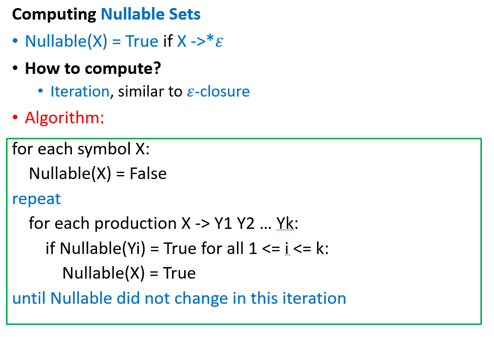
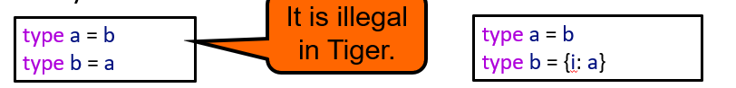

# 编译原理

[TOC]

## week 1 intro

这门课咸鱼暄做过朋辈辅学，感谢 xyx！

- [笔记](https://www.yuque.com/xianyuxuan/coding/compiler)
- [朋辈辅学录播](https://space.bilibili.com/18777618/channel/collectiondetail?sid=288316&ctype=0)

还有一篇 [助教的学习建议](https://www.cc98.org/topic/5641876)，在听课或者写大程感到迷茫的时候可以去看，里面有推荐别的参考资料。

成绩组成：

- 作业 10%
- quiz 10%
- 期中考 15%
- lab x 5 25%
- 期末考 40%

## week 2 Lexer

咸鱼暄：

- 大部分内容 & 提纲
- 习题解答

cms 的 ppt：

- DFA 的最小化（chapter 2 ppt 68-71）

---

手算 Lexer 大致流程：

- 根据需求写出 REX
- 讲 REX 转换成 NFA 
- NFA 转 DFA 
- DFA 最小化  

## week 3 Parser Top-down

### 理论知识

- CFG
- leftmost derivation: 每一次选取最左边的非终结符进行拓展
- ambiguity: 有多种 leftmost derivation 就叫有二义性 
- recursive descent parsing: 是一种 Top-down 分析，从上到下从左到右，包含递归和回溯，例子 
- left-recursive: 会让递归下降陷入死循环的 CFG 就是左递归的
    - LL 不能 parse left-recursive
    - LR 可以 parse left-recursive
    - left-recursive 可以用来解决 ambiguity 中的 associativity 问题（结合性问题）
- right sentential form: 最右推导中的每个中间串都称作右句型
    - p.s. shift-reduce analysis 是 rightmost derivation 的逆过程
    - 如何得到：做一遍最右推导，得到的中间结果都是
- viable prefix: shift-reduce analysis 推导目标串的过程中所有分析栈中的符号序列都称作右句型的可行前缀
    - 如何得到：做一遍 Bottom-up parsing，栈里面出现过的都是
- xyx 笔记里的习题

### LL(1)

- 计算 Nullable Sets：
- 计算 First Sets：
- 计算 Follow Sets：
- 通过上面 3 个 Sets 计算 Parsing Table：对于每一条 production 
- LL(1) parsing table 长这样，如果一个格子里有超过 1 条 production，说明不是 LL(1)
- 如果发现不是 LL(1)，想要改成 LL(1)，有两种情况
    - 第一种是 left factoring，就是 RHS 有相同的前缀 
    - 第二种是 left recursive，就是经过一系列推导之后 RHS 的最左端是 LHS 

p.s. ppt 上和 xyx 笔记上有一点不同，ppt 上多一个 Nullable Set，而笔记上是把 Nullable Set 合并到 First Set 里面了。 LL(1) 之前的其他部分可以看 xyx 
p.s. LL(1) parsing 的操作叫 generate & accept

## week 4 Parser Bottom-up

表达能力 

### LR(1)

和 LR(0) 的区别是 item 里多了一个 lookahead symbol，lookahead symbol 的含义如下

一般是直接构造 DFA 了

- 先算出 First Set
- Closure 确定哪些 item 在同一个 state 里 
- Goto 确定状态转移 
- Reduce 确定哪些 item 可以 reduce 
- 然后画状态图，下面是一个例子 
- 然后做 parsing table，下面是一个例子 
- 在做 parsing 的时候维护一个 state stack。可以选择也维护一个 symbol stack，这是可以省略的但是在手算的时候更方便一点
    - shift 和 goto 操作就往 state stack 里面 push 一个 state，往 symbol stack 里面 push 一个 symbol
    - reduce 的时候，production 右边有多少 symbol 就 pop 多少个 state 和 symbol。state stack 和 symbol stack 中元素数量始终差 1。

### LALR(1)

在 LR(1) 的基础上，合并除了 lookahead symbol 之外完全相同的状态，合并方法就是直接把 parsing table 里面的两行并在一起，在下面的图中就是相同颜色的状态合并。但是可能产生 **reduce-reduce conflict**

- 例子：LALR 会合并两个状态，导致读到 `ac.d` 的时候判断不了该用 `A->c` 还是用 `B->c` 来 reduce，画一下图更清楚
    ```
    S' → S
    S  → aAd | bBd | aBe | bAe
    A  → c
    B  → c
    ```
- 注意只可能产生 reduce-reduce conflict，不可能产生 shift-reduce conflict，因为如果 LALR(1) 有 shift-reduce conflict 那他原来的 LR(1) 也肯定有


### LR(0)

- 算法

- DFA 长下面这样
- LR(0) Parsing Table 长下面这样
- 可能会产生 **shift-reduce conflict**，但是不会有 shift-shift conflict 因为每个状态 shift 之后只会到特定一个状态，不会有 reduce-reduce conflict 否则这个语法是 ambiguous 的 

### SLR

SLR 是在 LR(0) 的基础上删掉一些 reduce 操作，用来减少 shift-reduce conflict，算法如下

## week 5 Parser Yacc

看 ppt，考试不怎么考

## week 6 Abstract Syntax

- ppt 和 xyx 的笔记都看
- 内容有：在 parse 的过程中做语义分析，concrete parse tree 和 abstract syntax tree, error positions
- abstract syntax tree 就是在 parse tree 的基础上做一个简化，去除冗余，减少语义分析的复杂度，看 ppt 15 和 16
- abstract syntax tree 很像 xyx 笔记里的 Associated Dependency Graph，笔记可以作为一个补充

## week 7 Semantic Analysis Symbol Table

- 主要看 ppt
- bindings
- symbol table: is also called environment,E.g. σ0 = {g ↦ string, a ↦ int}，用哈希表实现
    - Bindings in the right-hand table override those in the left.
- functional st: 保留原表，新建新表，但是空间开销大。也可以用 BST 实现，每次进入新 environment 只要新建根节点且复制一条链就可以了 
- imperative st: 在原表上修改，需要维护一个 undo stack 或相同功能的东西支持回退
- multiple st: several active environments at once
- Tiger 的实现：symbol class + imperative symbol table + new-scope marker + auxiliary stack(or a prevtop value in each symbol)
- 然后讲了 Tiger 的 type 语法，之后再来看

## week 8 Semantic Analysis Type Checking

- 主要看 ppt
- 主要内容：就讲每个部分怎么 check
- Type-Checking expressions：比如说一个加法算符左右都必须是数字
- Type-Checking declarations
    - Variable declarations：例如 var x := exp 或者 var x : type-id := exp
    - Type declarations：形如 type type-id = ty
    - Function declarations：形如 function id (tyfields) : type-id = exp
    - Recursive declarations：例如 type list = {first: int, rest: list}，解决方法是先把所有 header都放到 table 里，处理 mutually recursive function 也是一样的方法 
        - 但是不能有循环定义 

## week 9 chapter 7 Intermediate Representation 中间代码生成

- Three Address Code
- IR Tree
    - T_exp 
    - T_stm 
- translation into IR Tree
    - expressions
        - 有返回值的: Ex -> T_exp
        - 没返回值的: Nx -> T_stm
        - 返回布尔值的: Cx -> T_stm + a pair of destination address
        - toEx 的实现
    - variable: InFrame(k) & InReg(t)
    - array variable: 关注高级语言对于数组的实现
    - structured L-value: 就是赋值语句的左边不是一个简单的 variable 而是一个 struct 或者整个 array，解决方法是给 MEM 加一个 S 参数表示取出的内存大小
    - subscripting & field selection: Pascal 里面如果数组名单独出现是表示整个数组的，可以做整个数组的赋值，所以需要判断数组名出现的时候表示什么含义 
    - arithmetic: unary negation 不能很好地用树状语言表示
    - conditionals: 讲了一种 Cx 嵌套的优化，看 ppt55
    - while loop: 为了实现 break 功能，需要有一个额外的变量存储 break 之后要跳转到哪里
    - for loop
    - function call: 注意函数的 static link，就是为了实现函数的嵌套定义，指向上层函数的指针。可以作为一个隐含的参数传递，不写也算对
    - declarations
        - variable
        - function: prologue & epilogue


## week 10 chapter 8 blocks & traces 中间代码优化

- 总体过程
  - IR tree -> 删去 SEQ & ESEQ -> a list of canonical tree (规范树)
  - -> 划分 block ，保证内部没有跳转，只有一个入口和一个出口 -> a set of basic blocks
  - -> 把 block 的出口和入口连起来 -> a set of traces
- canonical tree
  - 定义和性质 
  - 第一步是消除 ESEQ。commute 就是判断 ESEQ 中的 s 会不会影响到其他的 e，因为很多信息需要到运行时才知道，所以编译的时候判断 commute 只用非常 naive 的方法  
  - 转换算法的总体思路就是把 ESEQ 往树的上层换，因为程序的最顶层是 T_stm，所以换到顶层了 ESEQ 就可以变成 SEQ 了。转换算法步骤分为 extraction 和 insertion 两步，先把子表达式拆开，然后再把 ESEQ 前面的 statement 插入到某个位置。具体的转换算法就要看具体问题了，下面是几个比较常见的 transformation rules 
  - 第二步是 CALL 上层只能是 EXP 或者 MOVE，这么做的原因是所有 CALL 的返回值都会存在同一个寄存器里，需要防止覆盖 
  - 第三步是消除 SEQ，方法就是把所有 SEQ 节点去掉，剩下的子树按顺序排
- basic blocks
  - blocks & traces 的主要目的：机器不支持 CJUMP 这样的双目标地址跳转，所以把 CJUMP 的 false label 直接放到 block 后面
  - 
  - 
- traces
  - 要求：每个 block 在且仅在一个 trace 中；CJUMP 和它的 false label 相连；总 traces 数量最少
  - 算法： 
  - 最后就是优化 trace 之间  的顺序，减少非条件跳转的数量


## week 11 chapter 9 Instruction Selection


- 局部最优和全局最优
- 在 CISC(complex instruction set computer) 中，局部最优和全局最优相差较大。在 RISC 中，两者相差较小，可以用局部最优的算法


举个例子：


- 全局最优算法：
  - 树形 DP，每个节点记录子树最小代价、使用的 tree pattern
  - instruction emission：递归
- (to be continued)


## 实验

### lab0 配置实验环境

这次准备使用 Ubuntu 虚拟机进行实验。

参考资料：

- [实验指导](https://accsys.pages.zjusct.io/accipit/environment/)
- [VMWare 安装 Ubuntu 虚拟机教程](https://blog.csdn.net/qq_43374681/article/details/129248167)
- [AccSys · GitLab (zju.edu.cn)](https://git.zju.edu.cn/accsys)

一些问题：

- `pkexec` 命令表示使用 root 运行指令，`pkexec chmod 444 /etc/sudoers` 在 `sudo su -` 不能运行的时候救命用
- 虚拟机输入法？搜索引擎搜索“Ubuntu22.04-添加中文输入法”
- 虚拟机共享文件夹？[除了在 VMWare 里设置之外还要再加一步](https://blog.csdn.net/weixin_54051652/article/details/128316296) `sudo vmhgfs-fuse .host:/ /mnt/hgfs -o allow_other`
- gcc 怎么选择版本？[使用 update-alternatives 工具](https://www.jianshu.com/p/f66eed3a3a25)，[具体原理](https://askubuntu.com/questions/233190/what-exactly-does-update-alternatives-do)，[使用 apt-cache search 工具搜索现有版本](https://www.jianshu.com/p/b6e24ebd53ef)
- git 的配置使用？[看这个](https://blog.csdn.net/beishanyingluo/article/details/107451921)

网络相关问题：

- [找不到 ens33 网卡](https://blog.csdn.net/qq_41969790/article/details/103222251)，每次重启之后 `sudo dhclient ens33` 重置网卡设置即可
- 虚拟机怎么连接校网？
    - `ping 10.10.0.21` ping 浙大内网的 DNS 服务器，发现 ping 得通
    - `nslookup office.ckc.zju.edu.cn` 发现无法找到 DNS 项，使用的 DNS 服务器是 `127.0.0.53`
    - `nslookup courses.zju.edu.cn` 发现无法找到 DNS 项，使用的 DNS 服务器是 `127.0.0.53`
    - `nslookup courses.zju.edu.cn 10.10.0.21` 使用浙大内网的 DNS 服务器来查找 ip 地址，发现可以找到
    - `sudo nano /etc/resolv.conf` 修改 nameserver 为浙大内网的 DNS 服务器就行了。但是 `resolv.conf` 是系统生成的临时文件，重启会被覆写，所以要上校网的时候还要重新修改一下配置
    - 搜索“校网内网原理”“VMWare Ubuntu 虚拟机设置代理”等关键词了解更多
    - 偶然发现 [Ubuntu 申请使用浙大校网](https://blog.csdn.net/qq_24118527/article/details/88323889)


### lab1 词法分析 & 语法分析

#### 实验课

讲到的资料：

0. [所有参考资料 repo](https://git.zju.edu.cn/accsys)
1. [SysY 语言规范](https://accsys.pages.zjusct.io/accipit/appendix/sysy-spec/): SysY 是我们要编译的语言。其中“文法定义”部分给出的 CFG 是实现 parser 的标准。
2. [SysY 运行时库](https://accsys.pages.zjusct.io/accipit/appendix/sysy-runtime/): SysY 语言能不加声明直接调用运行时库中的函数。在 lexer 或者 parser 中需要进行标注。
    - 方法一：lexer 前的预处理，把函数定义拼接到源代码上，类似 include 的预处理
    - 方法二：parser 中给系统函数特殊的 tag
3. [用 rust 实现的参考编译器](https://git.zju.edu.cn/accsys/accsys-rs)：可以作为参考，比如 lexer 的规则感觉可以直接参考代码。
4. [用 C++ 实现编译器的模板](https://git.zju.edu.cn/accsys/accsys-cmake-template)：可以直接在这个基础上改，有 flex 和 bison 的 starter code，然后用 CMake 编译。lexer 用 flex 生成，parser 用 bison 生成。
    - 其中还有 template 魔法的 starter code

其他参考资料：

1. [lex, flex, yacc, bison 扫盲](https://zhuanlan.zhihu.com/p/659845972)
2. [xyx 推荐的 lex 和 yacc 博客](https://blog.csdn.net/weixin_44007632/article/details/108666375)

tips：

1. 选择 parser 的实现方法
    1. parser combinator
    2. parser generator
2. cmake template 的使用
    1. `cmake -B build` 生成 compiler 源代码
    2. `cmake --build build` 生成 compiler 可执行文件
    3. `./build/compiler` 手动输入语句，ctrl + D 结束
3. 使用 gcc sanitizer 进行 debug
4. [这样测试](https://accsys.pages.zjusct.io/accipit/syntax/#_4)，注意要 `python >= 3.10`

### lab3 中间代码生成

todo: 

- [ ] 编译 lab1 & lab2 代码
  - [x] 看懂 src 代码流程：lab1 的 `yyparse()` 结束之后会生成语法树，保存在 `struct TreeExpr* root` 中。 lab2 对于 lab3 的任务没有影响。
  - [x] test 代码流程：lab1 & lab2 只测试 compiler 的返回值的正确性，也就是能够判断是否编译错误即可
  - [ ] CMakeList 含义
- [ ] 合并源仓库 lab3 新增内容
  - [ ] 源仓库里提供了 lab3 相关代码，看下讲解视频有哪些是可以用的
  - [ ] 看下 CMakeList 的变化
  - [ ] test.py 需要加入 lab3 测试
- [ ] 

---

资料：

- OS 文档里的 GDB 调试命令 
  - `layout src`  显示源码
  - `step` 进入函数
  - `set args ../tests/lab1/add.sy` 添加可执行参数的运行参数，启动 gdb 的时候参数只能包含需要调试的程序名 `gdb ./compiler`
  - `show args` 查看运行参数

---

问题：

- 合并两个没有 fork 关系的 repo，两边的 commit 都会保留。而 git 的回退只能回到某个 commit，所以想要回到合并之前的版本就很困难了
- 

---

记录（免得忘了我改了哪些了）：

- CMakeList 启用了调试参数

## 考试

期中考之后发现复习过程中遗漏的点： ==todo==

1. error recovery 一点都没看，Burke-Fisher 方法是什么东西
2. introduction 章节整理一下，比如前中后端分别怎么划分
3. LL(1) 语法分析过程，语法分析栈是什么东西
4. 图片太小了，word 把 5 列调成 4 列，然后有些图片可以改成文字
5. Yacc/Bison 遇到 shift-reduce conflict 的时候默认操作是什么，感觉得看别人的整理或者历年题

考完懒得搞了，之后考试之前再搞