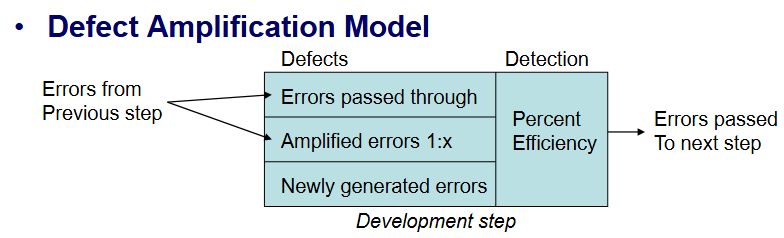

# 软件工程

[TOC]

## week 1

分数组成：

- quiz 20%
    - 就是点名，每次 5 分
- project 40%
    - 教学服务系统（选课系统），应用 chatgpt 等其他东西
    - [时间线](http://121.42.201.251/se/?switch=3)
- 期末考 40%
    - 有题库，题很多，要提前复习

[课程网站](http://121.42.201.251/se/)

## 大作业

### 第一次开工

- [notion 文档](https://www.notion.so/e2ec1de75ab842d8be485f58d83d3601?v=32fb56905d394a038bb781ec5072d902)：目前有需求文档，后续应该也会写在这里

---

后端代码：

- 华子挂了一个 mysql database 在他服务器上 10v4.zju.yusux.xyz 33306
    - 默认 MySQL 数据库用户名 SE，密码 se123456，可以新创建一个管理员用户，用于项目的测试
    - 最新的数据库字段说明在 doc/ 文件夹下
- 下载破解 IDEA，[看这个](https://www.quanxiaoha.com/idea-pojie/idea-pojie-20241.html#%E6%BF%80%E6%B4%BB%E8%A1%A5%E4%B8%81%E4%B8%8B%E8%BD%BD%E5%9C%B0%E5%9D%80)
- 先要“用 IDEA 创建 springboot 项目”，[看这个](https://blog.csdn.net/weixin_62645763/article/details/136426504)
    - 后面发现自己创建的项目和统一的版本和依赖不一样，所以导入项目即可
- 然后“IDEA springboot 连接 mysql 数据库”，[看这个](https://blog.csdn.net/dc_young/article/details/132141166)
- [x] 然后先写 login
    -  `/login`: 接受登录信息，返回管理员后台认证情况
    - 想用 IDEA copilot 插件，但发现试用期之前用过了，并且没有搞学生认证
    - EasyCode 插件快速生成，或者 [这个用 POJO 生成的](https://blog.csdn.net/lp2388163/article/details/86480480)
    - [看这个](https://blog.csdn.net/weixin_44043758/article/details/118367899)，这个是不带 token 的版本，但是讲了项目结构很好
    - [这个](https://blog.csdn.net/mr_accompany/article/details/104159436) 代码写得好
    - [这个](https://blog.csdn.net/javaeEEse/article/details/123181235) 讲了 token 验证的流程和一些原理性的东西，介绍了 JWT 比较容易懂
- 然后再做其他的
    - [x] `/getCourse`: 接受课程名称、课程代号、教师名称等信息，并根据接受的信息进行课程的查找
    - [x] `/delCourse`: 接受课程唯一 ID，若存在该课程，则根据该 ID 对课程进行删除
- [ ] 最后做一下测试
    - 第一次登录，在 token 持续时间内登录
    - 在没有登录的情况下使用其他需要权限的功能，是否会被拦截

一些问题：

- 首先解决 cannot find symbol，学一下 maven 然后看看自己新建的 project pom.xml 有没有什么不一样
    - 发现是使用的依赖不一样，仓库里的工程使用 lombok 没有 jakarta，所以需要适应一下他依赖的包及其代码习惯

### 合并代码 & 测试

- [用 postman 调试](https://blog.csdn.net/falmelast/article/details/127052443)
- git 新建分支并同步到远程仓库（搜这个名字随便看一篇就行）
- 本地建立 mysql 数据库调试

## 考试

- 多选题 10 x 2，多选一个扣 0.5，很多选 3 个选项
- 是非题 10 x 1
- 简答题 3 个每个 6-8 分
    - 一个计算题
        - ch20 缺陷放大和消除的费用计算  & defect density 错误行数除 1000
        - ch21 Availability=MTTF/(MTTF+MTTR)
        - ch23
            - 独立路径数量=环复杂度=V(G)=封闭区域数量P+1
            - boundary value analysis
        - ch35 Risk Exposure=概率乘以花费
    - 一个设计测试用例（上课举的例子） ch23
        - white box
            - basic path test
        - black box
            - 等价类划分 & 边界值分析
    - 还有一个随缘
        - UI 设计原则：以用户为中心、减少用户记忆负担、保持接口一致
- 最后一个大题（50 分）
    - 给一个场景，做
        - 需求分析
        - 设计: data/class design, architectural design, interface design, component-level design
        - 测试: 
            - 测试策略:
                - unit test
                - integration test
                - high-order test: validation test, system test, alpha/beta test, recovery test, security test, stress test, performance test
            - 测试方法
    - 554：
        - 5 个流程: communication, planing, modeling, construction, deployment
        - 5 个等级of CMMI: Incomplete, performaed, managed, defined, quantitatively managed, optimizaed
        - 4 种需求分析方法(build analysis model): scenario-based(use-case diagram, activity diagram, swim-lane diagram), class-based(class diagram, CRC model), behavioral models(state diagram, sequence diagram), flow-oriented(data flow diagram)
        - 4 种 process 架构:
            - Linear process flow: 瀑布模型
            - Iterative process flow: 增量过程模型、RAD 模型
            - Evolutionary process flow: 原型模型、螺旋模型
            - Parallel process flow: 协同开发模型
        - 能说出每个流程的重要性
    - risk 相关
        - risk mitigation monitoring & management: 什么风险？多少概率？多大影响(1-5)？怎么避免风险、监控风险、应急计划？