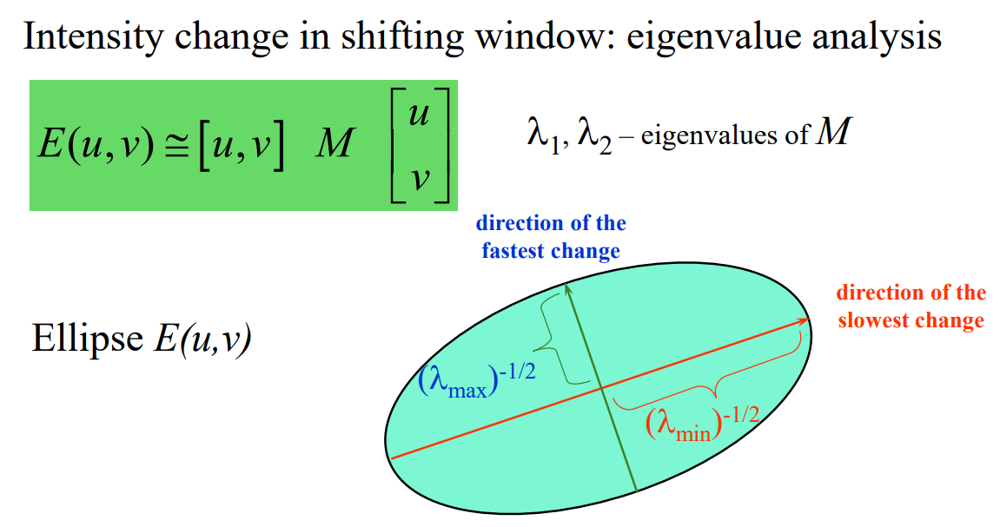
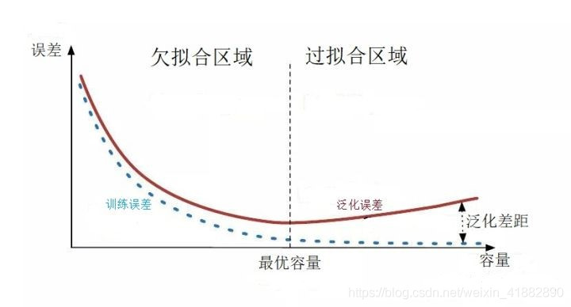

# 计算机视觉

[TOC]

## chapter 1 intro

### 课程相关

1. 参考书
    - [Computer Vision: Algorithms and Applications](http://szeliski.org/Book/)
    - computer vision: a modern approach
    - computer vision: models, learning and inference
1. 分数组成
    - 50% 编程作业
        - 迟交计 80% 分数
    - 50% 期末闭卷考试
        - 期末会有一节课划考点范围，复习以 ppt 为主
1. 编程作业提交内容
    - 源程序
    -  可执行文件
    - 实验报告：+说明算法为什么好

### CV 介绍

如何了解最新成果？

- 会议：CVPR, ICCV, ECCV, AAAI, IJCAI, etc.
- 计算机领域：会议 > 期刊

CV 能干什么？

- Image Inpainting: 去除图像上方的字幕
- Image Dehazing: 图像去雾, Kaiming He et al, CVPR 2009
- Style Transfer: 改变图像风格，图生图
- Image Stitching: 经典问题，拼图（应用：全景照片、谷歌街景）
- Image Segmentation: 图像分割（应用：抠图, Segment Anything）
- Saliency Detection: 显著性检测，检测图像中首先吸引人注意力的部分
- Face/Human/Pedestrian/Object Detection
- Human Pose Estimation
- Object Tracking: 跟踪多个移动的物体
- Object Categorization
- Image QA: 与自然语言处理结合
- Kinect Sensor: 微软推出的深度相机，可以用于体感游戏
- AR glasses: Microsoft Hololens, Rokid
- VR glasses
- self-driving cars: 特斯拉走的是纯视觉的路线，抛弃了雷达
- 月球车 & 火星车

### OpenCV Tutorial

- [vscode + opencv 环境配置](https://zhuanlan.zhihu.com/p/402378383)
- [opencv 官网 tutorial](https://docs.opencv.org/4.x/d9/df8/tutorial_root.html)
- 教材：《Learning OpenCV3》
- 推荐在 b 站上找教程看

## chapter 2 Edge Detection

### HW 1 Canny Edge Detection

### 环境配置

首先安装 MinGW 环境，[参考这个博客](https://blog.csdn.net/qq_44032231/article/details/118035879)

然后安装 OpenCV 环境，[参考这个博客](https://zhuanlan.zhihu.com/p/402378383)

运行时出现了一些问题，[参考这个解决方案](https://blog.csdn.net/agassy/article/details/50492413)。

- 首先发现报错路径下的 dll 文件是存在的，把 dll 文件复制 exe 文件同目录下之后，报错中找到的 dll 也是复制之后的 dll。说明不是环境配置问题，而是 dll 本身的版本问题。
- 然后在 [这个 issue](https://github.com/HaohuaLv/OpenCV4.7_MinGW_build_with_contrib/issues/1) 里面找到了一样的问题，于是重装 MinGW 8.1.0 版本
- 安装过程中又遇到 sourceForge 安装失败的问题，[参考这个博客](https://blog.csdn.net/yellow_hill/article/details/124314331)
- 编译过程中发现 win32 thread 有些东西没有定义，编译不通过，于是重装 posix thread，[参考这个回答](https://stackoverflow.com/questions/14191566/c-mutex-in-namespace-std-does-not-name-a-type)

终于好了！有一点不太方便的就是每次新建一个项目，都要配置一下 C\C++ Configuration，加上这个 include 目录 `F:\\programfiles2023\\MinGW\\mingw64\\include`，目前没有找到全局配置的方法，可以以后看看。

### 算法实现

[Load & Display Image Tutorial](https://www.opencv-srf.com/2017/11/load-and-display-image.html)

[Gaussian Blur Tutorial](https://www.opencv-srf.com/2018/03/gaussian-blur.html)

[opencv cv::Mat::type 对照表](https://stackoverflow.com/questions/10167534/how-to-find-out-what-type-of-a-mat-object-is-with-mattype-in-opencv)，size & channel & type 是非常重要的参数，在处理图像之前最好先清楚这些数据

c++ atan 返回的是 `[-pi/2,+pi/2]` 之间的弧度值

终于他妈的做完了，已经三点钟了，没想到这个东西这么花时间。

## chapter 3 直线 & 曲线 & Hough 变换

1. [Hough 变换直线检测：原理](https://zhuanlan.zhihu.com/p/77196434)
1. [Hough 变换直线检测：代码](https://zhuanlan.zhihu.com/p/97564482)
1. [Hough 变换圆检测：原理](https://blog.csdn.net/sw3300255/article/details/82798005)

## chapter 4 Image Feature

### content

1. feature detection：角点检测
1. feature description：特征匹配

### Harris Corner Detection

1. [哈里斯角点检测：结合这篇博客看 ppt](https://www.itheima.com/news/20210604/112429.html#:~:text=Harris%E8%A7%92%E7%82%B9%E6%A3%80%E6%B5%8B%E7%9A%84%E6%80%9D%E6%83%B3%E6%98%AF%E9%80%9A%E8%BF%87%E5%9B%BE%E5%83%8F%E7%9A%84%E5%B1%80%E9%83%A8%E7%9A%84%E5%B0%8F%E7%AA%97%E5%8F%A3%E8%A7%82%E5%AF%9F%E5%9B%BE%E5%83%8F%EF%BC%8C%E8%A7%92%E7%82%B9%E7%9A%84%E7%89%B9%E5%BE%81%E6%98%AF%E7%AA%97%E5%8F%A3%E6%B2%BF%E4%BB%BB%E6%84%8F%E6%96%B9%E5%90%91%E7%A7%BB%E5%8A%A8%E9%83%BD%E4%BC%9A%E5%AF%BC%E8%87%B4%E5%9B%BE%E5%83%8F%E7%81%B0%E5%BA%A6%E7%9A%84%E6%98%8E%E6%98%BE%E5%8F%98%E5%8C%96%EF%BC%8C%E5%A6%82%E4%B8%8B%E5%9B%BE%E6%89%80%E7%A4%BA%EF%BC%9A%20%E5%B0%86%E4%B8%8A%E8%BF%B0%E6%80%9D%E6%83%B3%E8%BD%AC%E6%8D%A2%E4%B8%BA%E6%95%B0%E5%AD%A6%E5%BD%A2%E5%BC%8F%EF%BC%8C%E5%8D%B3%E5%B0%86%E5%B1%80%E9%83%A8%E7%AA%97%E5%8F%A3%E5%90%91%E5%90%84%E4%B8%AA%E6%96%B9%E5%90%91%E7%A7%BB%E5%8A%A8%20%28u%2Cv%29,%28u%2C%20v%29%20%E5%B9%B6%E8%AE%A1%E7%AE%97%E6%89%80%E6%9C%89%E7%81%B0%E5%BA%A6%E5%B7%AE%E5%BC%82%E7%9A%84%E6%80%BB%E5%92%8C%EF%BC%8C%E8%A1%A8%E8%BE%BE%E5%BC%8F%E5%A6%82%E4%B8%8B%EF%BC%9A)
1. [哈里斯角点检测 & SIFT](https://zhuanlan.zhihu.com/p/354749490)：哈里斯角点检测的公式推导 & 算法流程非常详细
1. Harris-Laplace 解决了 Harris 对尺度敏感的问题，学的时候再找博客

### SIFT

#### 原理

1. [哈里斯角点检测 & SIFT](https://zhuanlan.zhihu.com/p/354749490): 后半段在讲 SIFT 原理
1. [SIFT 原理](https://blog.csdn.net/qq_40369926/article/details/88597406): 稍微详细点，搭配上面的博客一起看

#### 实现

1. [SIFT 特征点检测 + 匹配](https://blog.csdn.net/sxf1061700625/article/details/124263819): 使用了暴力匹配 & KNN 两种匹配方式
1. [SIFT 展示特征点](https://blog.csdn.net/m0_38007695/article/details/115524748): 前面都不用看，就看最后的 demo，有用大小不同的圆同时展示特征点和特征点尺度

### RANSAC

只用了解原理，实现只要直接调用 findHomography 函数就行了。

1. [RNASAC 拟合单应性矩阵](https://blog.csdn.net/H19981118/article/details/122014318): 重点看里面拟合直线 & 单应性矩阵的部分

### 单应性矩阵 & 图像透视变换

1. [opencv findHomography 用法](https://blog.csdn.net/fengyeer20120/article/details/87798638): 给出两组点对（比如 SIFT 等方法粗匹配的点对），使用选定的方法（比如 RANSAC），得到最优的单应性矩阵
1. [opencv warpPerspective 用法 & demo](https://blog.csdn.net/weixin_42905141/article/details/100745097): 已知单应性矩阵，进行透视变换。里面还有单应性矩阵的公式。
1. [完整的 demo](https://blog.csdn.net/czl389/article/details/60325970): 实现参考这个。从匹配开始，遍历匹配拿到两组点对，然后分别使用 findHomography 和 warpPerspective 两个函数得到拼接的结果
1. [demo 展示 RANSAC 前后的匹配质量](https://blog.csdn.net/H19981118/article/details/122014318): 可以参考这篇博客中对 drawMatches 的应用

### 寻找最佳接缝 & 图像拼接

1. [多幅图像拼接成一幅图像，附带简单的寻找接缝](https://blog.csdn.net/czl389/article/details/60572159): 这篇主要是看他，已经有图像、mask、怎么把一堆图片放到一张图片上去
1. [看 2.6 节拼缝计算 & 图像融合](https://zhuanlan.zhihu.com/p/71777362): 用的是 opencv 里的 seamFinder 和 Blender。Blender 可以直接把一堆图片变成一张

### 其他参考

1. [高斯金字塔下采样、上采样方法](https://www.cnblogs.com/wj-1314/p/11981974.html)

## chapter 5 & lab2 图像拼接

大致流程：

1. SIFT 特征点检测、特征子计算、特征匹配
1. RANSAC 筛选匹配点并获取单应性矩阵，使用单应性矩阵对图像进行透视变换
1. 寻找最佳接缝 & image blending

## chapter 6 & lab3 Eigen Face

阅读 slides 的时候参考的博客：

1. [知乎 - 理解傅里叶变换](https://www.zhihu.com/question/22085329/answer/774074211)
1. [知乎 - DCT 离散余弦变换](https://zhuanlan.zhihu.com/p/85299446)
1. [什么是基函数和基图像](https://blog.csdn.net/dugudaibo/article/details/78701487)

关于傅里叶变换可以多看看知乎上的文章，试图理解一下。PCA 已经忘得一干二净了，之后有空真的也可以看一下。

---

python 环境配置参考的博客：

1. [python 项目自动生成环境配置文件requirements.txt](https://blog.csdn.net/pearl8899/article/details/113877334)
1. [python opencv 环境配置教程](https://blog.csdn.net/qq_43605229/article/details/114572661)
1. [python wheel 文件下载网站](https://www.lfd.uci.edu/~gohlke/pythonlibs/)
1. [解决安装opencv-python后ImportError: No module named cv2错误](https://blog.csdn.net/weixin_43748316/article/details/120968044)
1. [命令行中 python 版本和 conda 环境中 python 版本不同](https://blog.csdn.net/weixin_43325818/article/details/119339084)：问题是环境变量顺序，会优先使用大环境中的 python，而不是 conda 环境里的 python

---

编写程序参考的博客：

1. [真正的英雄！](https://github.com/Ugenteraan/Face-Recognition-Eigenface-Scratch)
1. [matplotlib 画图和保存本地](https://blog.csdn.net/qq153471503/article/details/107319641)
1. [实验原理就抄这个啦](https://www.geeksforgeeks.org/ml-face-recognition-using-eigenfaces-pca-algorithm/)
1. 图像几何变换
    1. [图像绕定点旋转、图像平移、图像裁剪](https://blog.csdn.net/zh_jessica/article/details/77946346)
    1. [图像定点不动缩放](https://zhuanlan.zhihu.com/p/421887857)
1. json 相关
    1. [读取和保存 json](https://blog.csdn.net/leviopku/article/details/103773219)
    1. [字典元素的读取](https://blog.csdn.net/eacxzm/article/details/79832156)

## 复习

下面是 pg 复习课给的大纲，整理了其中一部分内容，懒得继续了。复习主要看 zjf 的整理。

### 引言

1. 视觉法则：格式塔法则 [博客](https://www.woshipm.com/pd/4522365.html)
    1. law of proximity: 距离接近的事物会被分到一组 
    2. law of similarity: 相似的事物会被分到一组 
    3. law of continuity: 会把一些零散的事物看成是连续的 
    4. law of symmetry: 容易把复杂图像感知成对称、简单的
    5. law of common fate: 以相同速度朝相同方向移动的事物会被分到一组
    6. law of closure: 人眼会把不完整的事物自动补全 
    

### 边缘

1. 为什么会有边缘(origin of edges)
    1. surface normal discontinuity: 表面法线不连续产生边界
    2. depth discontinuity: 遮挡产生边界
    3. surface color discontinuity: 不同的颜色之间产生边界
    4. illumination discontinuity: 光照产生阴影，阴影产生边界
    - 
2. 边缘检测算子 *（看 ppt）*
    - 模板卷积：会计算
    - 一阶: roberts(2x2), sobel(3x3), prewitt(3x3)
    - 二阶: laplacian, LoG
    - G 的作用: 平滑去噪，避免求二阶导之后噪音过于明显
    - 二阶算子边缘条件: 二阶导零点，并在一阶导极大值点上
3. Canny 边缘检测 *（看实验报告）*
    1. 用高斯滤波器平滑图像．
    2. 用一阶偏导有限差分计算梯度幅值和方向.
    3. 对梯度幅值进行非极大值抑制（NMS）：非极大值像素梯度抑制起到将边缘“瘦身”的作用。其基本方法是将当前像素梯度模长与沿正负梯度方向上的相邻像素的梯度模长进行比较，若其最大（即为极值），则保留该像素为边缘点，若不是最大，则对其进行抑制，不将其作为边缘点。为了简化计算，把梯度方向离散到 8 个方向上。
    4. 用双阈值算法检测和连接边缘．
        - 梯度强度低于低阈值的像素点被抑制，不作为边缘点
        - 高于高阈值的像素点被定义为强边缘，保留为边缘点
        - 处于高低阈值之间的定义为弱边缘，只要 8 个邻域像素中一个为强边缘像素点，则该弱边缘就可以保留为强边缘，即真实边缘点
        - 高阈值的作用是区分边缘和背景，低阈值的作用是平滑和连接边缘

### 曲线 & Hough 变换

*（看 ppt 或者 [博客](https://zhuanlan.zhihu.com/p/203292567)）*

- 霍夫变换拟合直线 
- 霍夫变换拟合圆 

### 局部特征

*（看 ppt）*

- 公式推导 
- 理解 $\lambda_{max}$ 和 $\lambda_{min}$   

### 图像拼接

1. 两张图像自动拼接的基本步骤 *（看实验报告）*
    1. 用 SIFT 提取特征点
    1. 计算 SIFT 特征子
    1. 用 least square 等方法粗匹配特征点对（至少 3 个，因为 homography 有 6 个变量，每个点对能提供 2 个方程） 
    1. 用 RANSAC 精选特征点对
    1. 计算 homography 矩阵
    1. 用 homography 对图像进行变换
    1. blending
2. RANSAC *（随便找篇博客看看）*
    1. 解决的问题：存在 **“外点”** 情况下的模型参数拟合问题
    2. 求解直线拟合问题的基本步骤
        1. 随机选择 data 中 **2 个以上** 的点，计算直线参数 k 和 b
        2. 遍历 data 中所有点，如果和直线距离不超过 t，认为是“内点”，否则认为是“外点”，比较并保留内点最多的答案
        3. 对于所有“内点”，再用最小二乘法拟合一个新的模型
        4. 重复执行 2-3 步，直到“内点”占比大于 $\varepsilon$ 或者循环次数达到上限 m，就退出循环
    3. 优缺点
        - 优点：
            1. 是一个普适的方法，可以应用于很多问题
            2. 实现简单
        - 缺点：
            1. 只能解决外点数量不多的情况。但是很多实际问题会有很多外点，所以需要使用投票策略或者霍夫变换
    4. 核心思想：如果外点被选入了模型，数量更多的内点会消除它的影响
    5. 计算 k 次采样之后成功的概率
        - 假设内点概率为 p，选择 n 个点全是内点的概率是 $p^n$，选择 n 个点至少有 1 个外点的概率是 $1-p^n$
        - 迭代 k 次，每次都至少有一个外点的概率是 $(1-p^n)^k$
        - 只要过程中某一次迭代结果中没有任何外点，就是找到了正确答案，所以得到正确答案的概率是 $1-(1-p^n)^k$
3. 图像金字塔 *（）*
    1. 拉普拉斯金字塔：如何理解？从频率角度看是什么？
    2. 高斯金字塔：如何理解？从尺度角度看是什么？

### 主元分析 & 人脸识别

*(看实验报告)*

- 能量的含义？
- DCT 的基是不变的，但是 PCA 的基是根据数据选定的
- 哪些数据适合用 Eigen-X 方法建模？（感觉像考题）

### 光流 Optical Flow

*（看[博客](https://blog.csdn.net/qq_41368247/article/details/82562165)和zjf笔记）*
- 解决什么问题？
- 光流的三个基本假设
- 对于一个点的约束等式，需要会自己推导
- 哪些位置的光流比较可靠

### 物体识别

1. 基本任务：单一物体检测、分类、事件识别、图像分割等。
2. 挑战因素 or 影响因素
    1. 视角
    2. 光照
    3. 尺度
    4. 扭曲：成像过程中产生的扭曲
    5. 遮挡
    6. 背景杂斑：目标周围的相似目标
    7. 类内方差
3. bias vs variance
    - 
4. overfit vs underfit [博客](https://blog.csdn.net/weixin_41882890/article/details/107008400)
    - 

---

*（剩下的看zjf笔记）*

### 深度学习

- 
- 

---

- 计算
    1. 计算图：正向传播 & 反向传播
    2. CNN 的
        - 权重数 = 卷积核大小 x 卷积核个数
        - 参数个数 = 权重数 + 卷积核个数（如果有 bias 的话）
        - feature map 大小：考虑原图大小，卷积核大小，padding，stride
        - 连接数 = feature map 大小 x 参数个数
- 关于 self-attention 机制，可以看 [这篇博客](https://zhuanlan.zhihu.com/p/410776234)

### 相机模型

- 关于其次坐标的一些理解 [博客](https://blog.csdn.net/baidu_35536188/article/details/109735600) *（剩下的看 ppt）*
- 关于外参： *（看 计算机视觉复习笔记.pdf）*
- 相机定标：[博客](https://blog.csdn.net/qq_42118719/article/details/112347552)，了解即可

---

- 
- 
- 

### 立体视觉

- 三角测量法 [博客](https://zhuanlan.zhihu.com/p/484509910)
- ICP(iterative closest point): [博客](https://blog.csdn.net/qq_41685265/article/details/107140349) 了解即可

---

- 
- 

