# OS

[TOC]

## chapter 1 intro

1. grading
    - 50% 期末考
    - 50% project
1. resources
    - [实验文档](https://zju-sec.github.io/os23fall-stu/)
    - [找到一个前人的实验报告](https://oe-heart.github.io/categories/%E8%AF%BE%E7%A8%8B%E7%AC%94%E8%AE%B0/%E6%93%8D%E4%BD%9C%E7%B3%BB%E7%BB%9F%E5%AE%9E%E9%AA%8C/)，思考题可以参考，实在不行的时候可以抄抄

---

什么是操作系统？resource abstractor & allocator 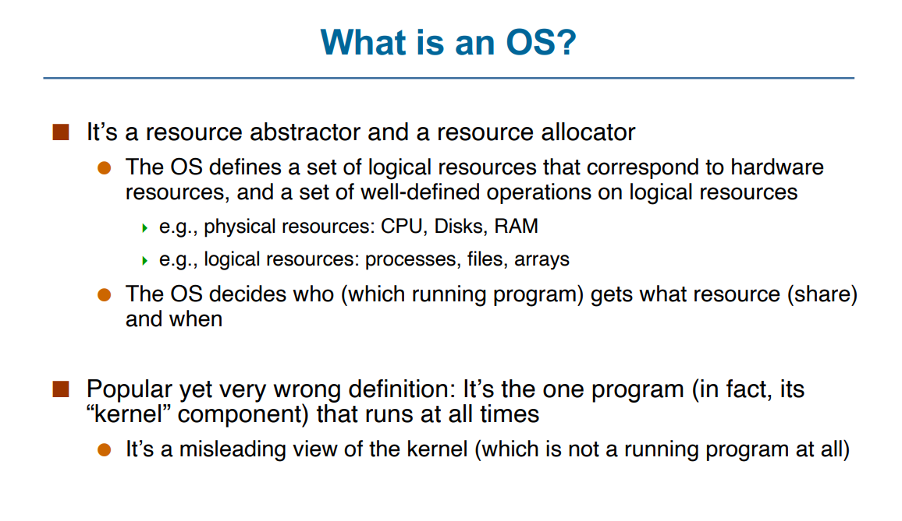

如何实现这两个功能？引入 mode 的概念，最简单的就是区分两个 mode，有一部分指令是 priviledged 或者说 protected 的，需要在 kernel mode 下才能执行。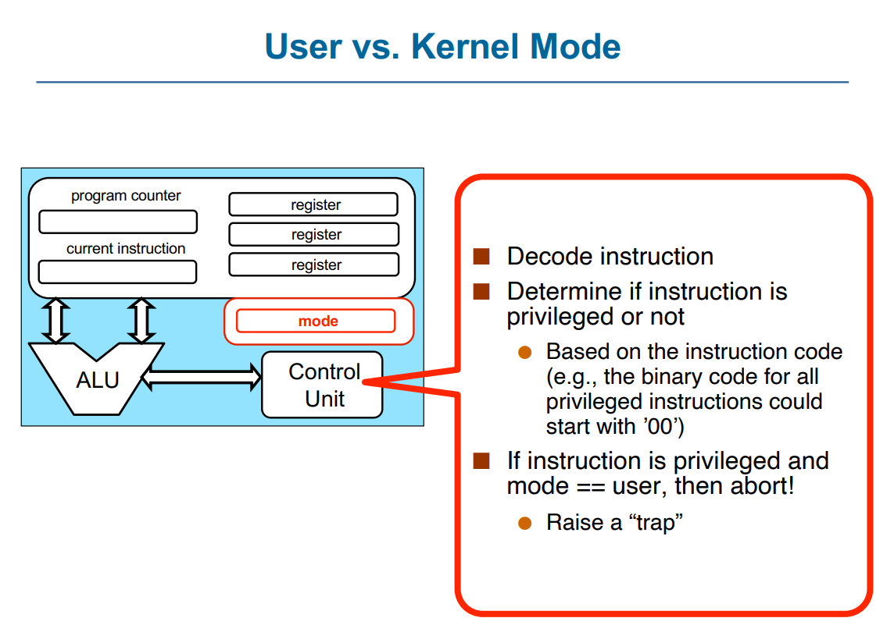

操作系统是怎么运行的？引入 control flow 的概念。对于操作系统 control flow 最简单的理解，就是一个大的 while 循环，每个循环判断当前应该做什么事情。更严谨的定义是 In computer science, control flow (or flow of control) is the order in which individual statements, instructions or function calls of an program are executed. 

引入后面很重要的 OS event 概念，event 是 control flow 中一种特殊的改变，event 分为 interrupt 和 exception 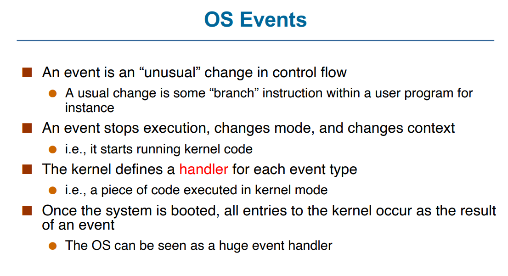

mode 之间如何切换？除了 interrupt 和 exception 之外，User 还可以主动使用 system call 进入 kernel mode。 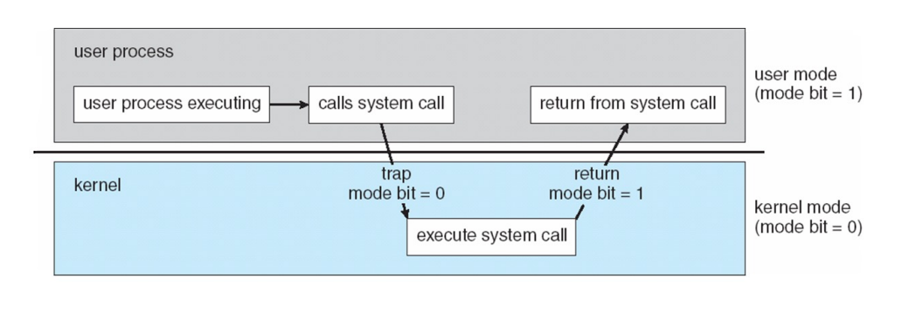

最后再加一个小配件 timer，定期引发中断，给 cpu 一个时间的概念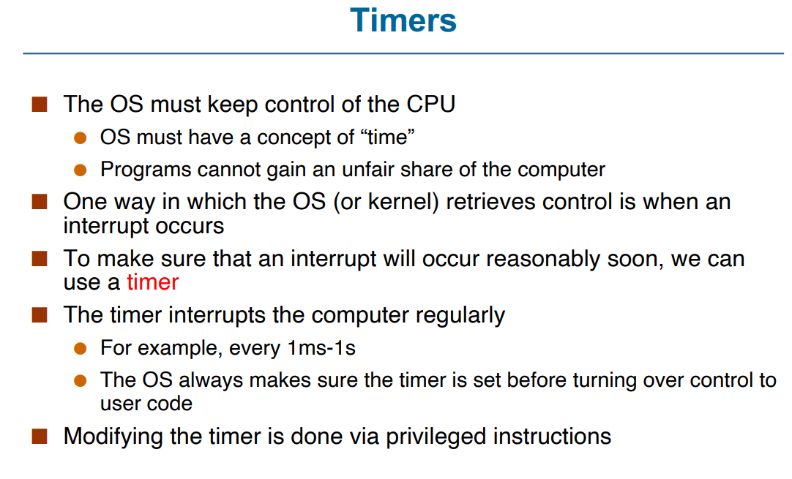

OS 主要提供的服务，后面也主要讲这些内容。 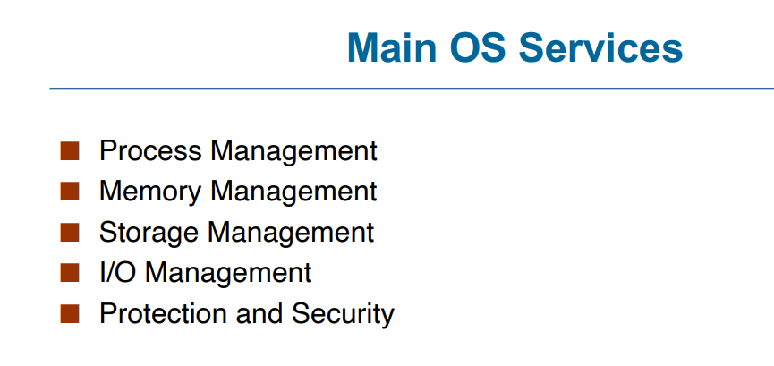

## chapter 2 OS structures

### contents

目录：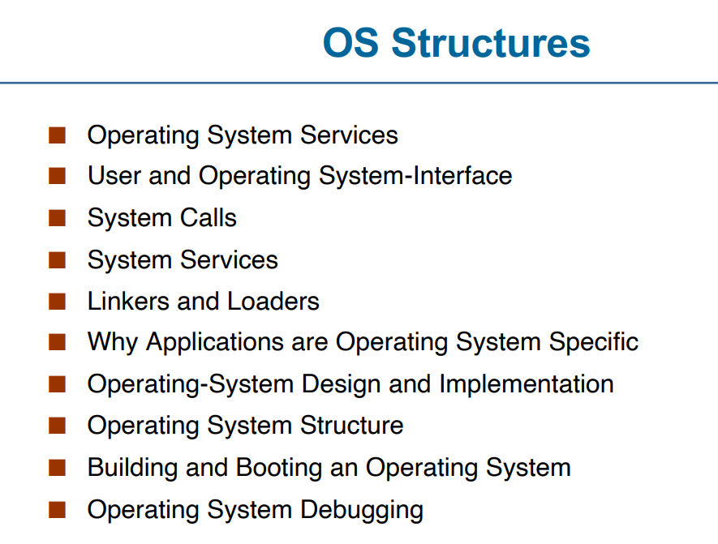

主要内容：

1. system calls
1. linkers and loaders

---

### system call

syscall 一般都会被包装成更 high-level 的 API，然后再被程序调用。举个例子，printf 就是用 write syscall 实现的 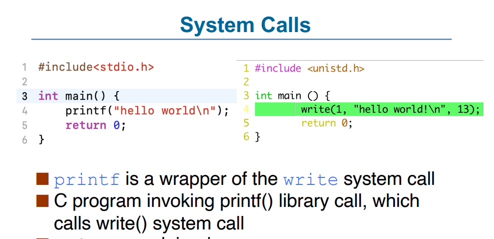

可以在 ubuntu 中用 `man 2 write` 查看 write 的用法，2 表示要找的指令是 system call，可以使用 `man 2 write | vim -` 在 vim 中打开，方便查找。

在 x86_64 中 write 的 syscall 编号如下，我们想 dump 可执行文件出来，看看 C 语言程序是怎么调用 write 的 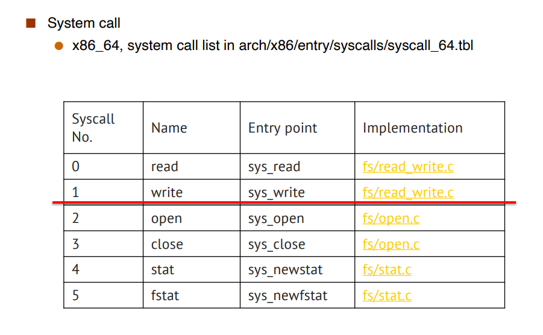

```shell
gcc -static hello.c -o hello.static
objdump -d hello.static | vim - # objdump 是 linux 下的反汇编工具，-d 是反汇编代码段
/main> # 在 vim 中搜索 main 函数的位置
```

经过追踪应该可以看到程序在 user space 里调用 syscall 之前做了一些什么：

1. main 调用了 __libc_write 函数，这是 C 对于这个 syscall 的包装
1. 然后在函数内部设置了 syscall 编号，并呼叫 syscall 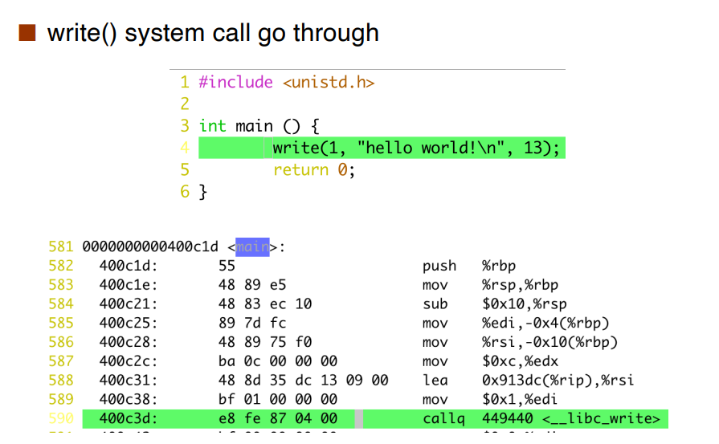 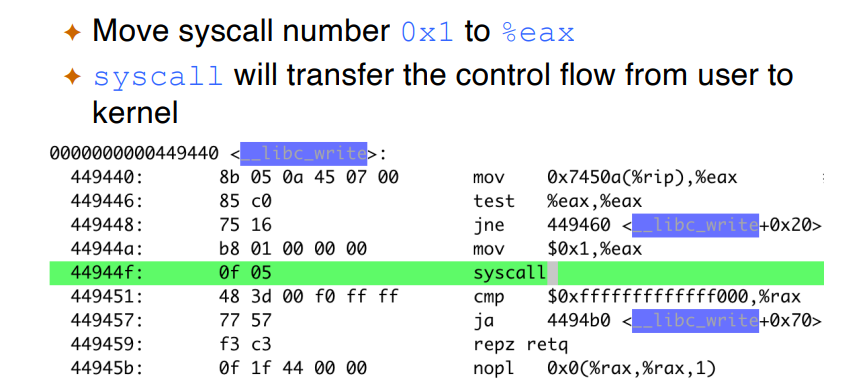

然后进入到 kernel space，执行以下操作 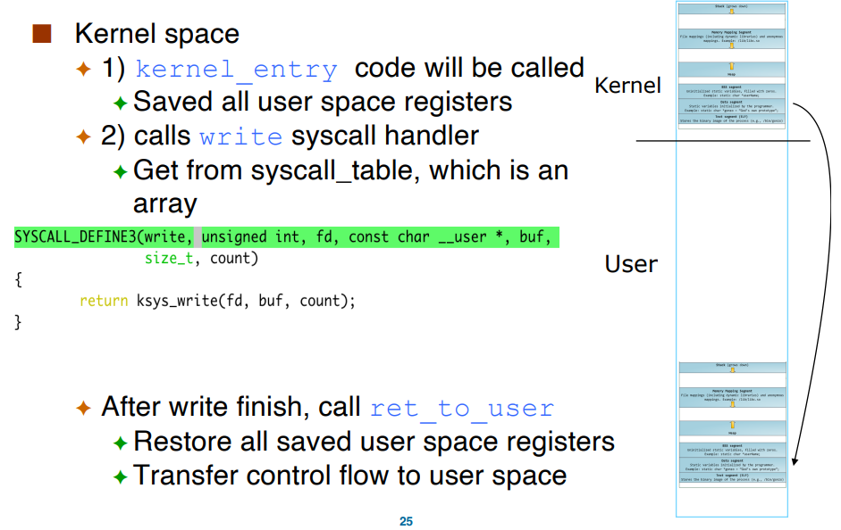

p.s. 可以通过 [bootlin](https://elixir.bootlin.com/linux/latest/source) 查看 linux 源代码，比如搜索 `ksys_write` 或者 `STSCALL_DEFINE3` 这些函数

最后总结一下，调用的大致逻辑如下图：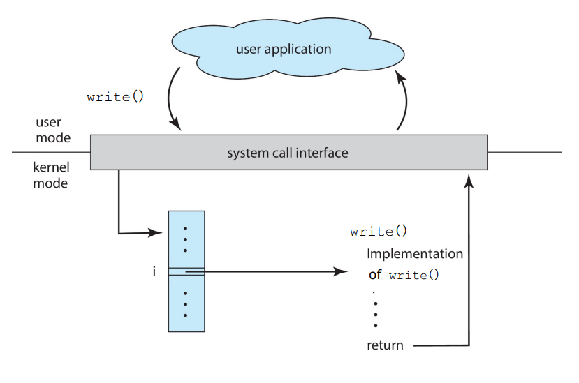

但由此也引出了有关 syscall implementation 的一些问题：kernel_entry 是什么？syscall_table 是什么？ret_to_user 是怎么实现的？

### syscall table

首先看 syscall table

```shell
sudo apt install silversearcher-ag # 下载文本搜索工具
cd linux-6.6-rc2 # 进入 linux 目录
ag sys_call_table # 查找当前文件夹中包含的 sys_call_table
```

查找 [bootlin](https://elixir.bootlin.com/linux/latest/source) 发现 x86 的 sys_call_table 定义在 `./arch/x86/um/sys_call_table_64.c` 中

```c
const sys_call_ptr_t sys_call_table[] ____cacheline_aligned = {
#include <asm/syscalls_64.h>
};
```

我们想要通过 C 语言的预处理，展开头文件和宏，看到 sys_call_table 究竟长什么样。

```shell
sudo apt install libelf-dev # 安装生成 .i 预处理文件的必要的库
make ./arch/x86/um/sys_call_table_64.i # 必须在 linux 根目录下执行，使用根目录下的 makefile
/sys_call_table[ # 这样可以快速定位到数组
```

然后发现有一个数组，包含所有的 syscall 的名字 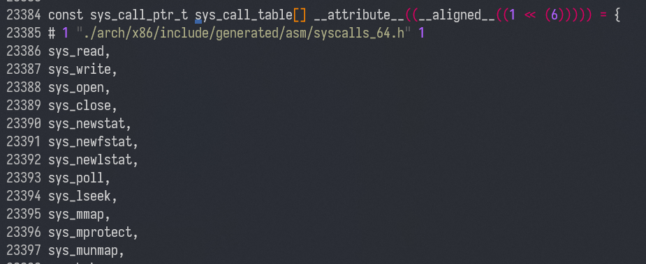

x86 下生成的预处理文件不太好看，arm64 下的 sys_call_table 通过 `make ./arch/arm64/kernel/sys.i` 生成和查看，需要 cross-compile toolchain，有编号会好看很多 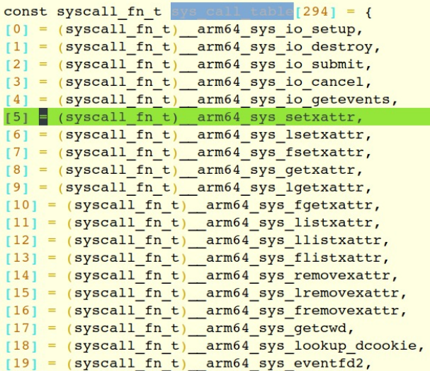

也可以发现不同架构下的 sys_call_table 不一样，可以使用的 syscall 也不一样。

### an example of syscall

以文件拷贝为例，看看使用文件系统需要用到的 syscall。我们会用到 `strace` 和 `time` 两个命令

```shell
strace cp hello_world.c hello_world_copy.c # 显示 cp 执行过程中的 syscall
strace cp hello_world.c hello_world_copy.c 2>&1 | wc -l # 显示 syscall 的数量，x86 下是 178 个
time strace cp hello_world.c hello_world_copy.c 2>&1 | wc -l # 显示时间
```

time 中的三个时间，分别是实际总时间，user mode 总时间（并行的时间相加），kernel mode 总时间（并行的时间相加）。比如 `ag start_kernel` 发现后两个时间加起来比第一个大，说明 ag 支持并行查找

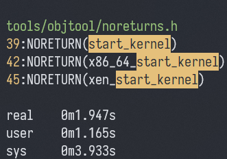

补充一下：syscall 传参的三种方式

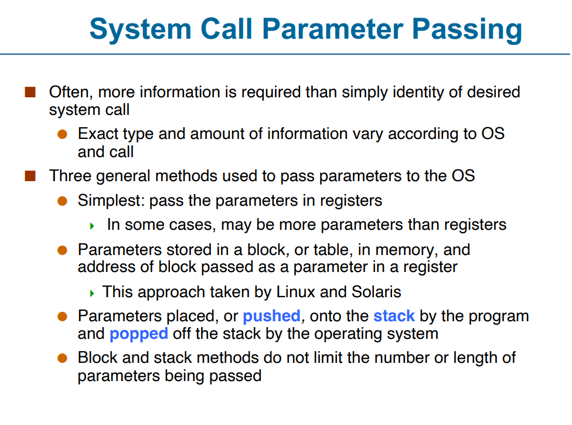

### linkers & loaders & ELF

编译的大致流程如下，可以看到 linker 和 loader 所处的位置和作用。

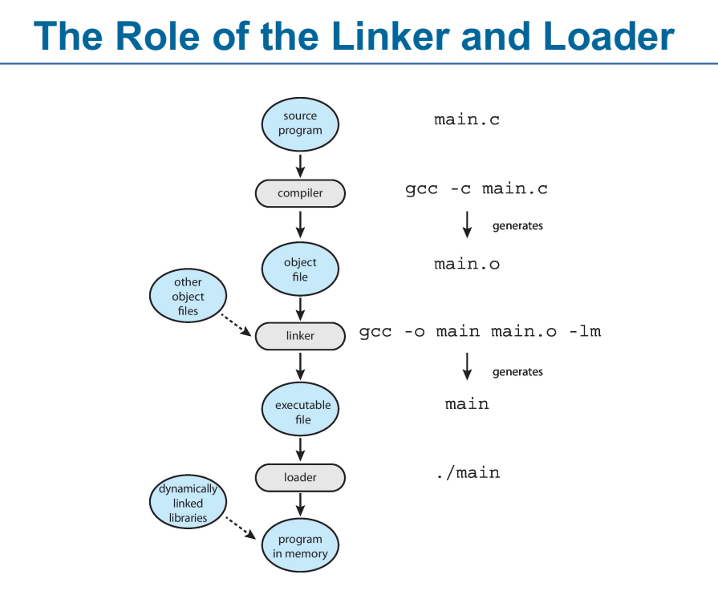

先来看看可执行可链接文件 ELF 是个什么东西

```shell
gcc hello_world.c
file a.out # 查看文件类型，发现是 ELF
readelf -S a.out # 查看 ELF 文件，-S 查看所有 section header
```

可以看到 dump 出来有 text 段、data 段、rodata 段等等。static variable 放在 data 或者 bss 段，static const variable 放在 rodata 段，const 放在 data 段。

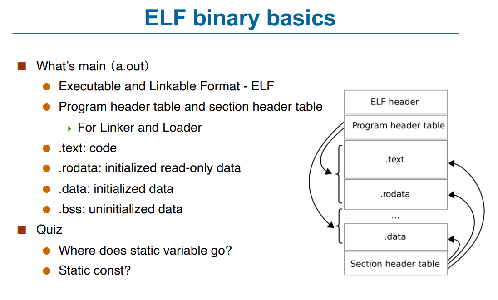

### static link vs dynamic link

然后继续看 linker，link 有两种方式。static link 的优点在于运行不用依赖外部库，缺点在于文件会非常大。来看看两种链接方式生成的 ELF 大小差多少。

```shell
gcc -static hello_world.c -o a.static
gcc hello_world.c -o a.dynamic
ll -h # 查看当前目录下的所有文件，显示详细信息
```

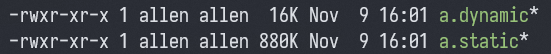

还有一个区别在于 static link 产生的 ELF 没有 .interp 段，但是 dynamic link 产生的是有的。使用 `readelf -p .interp a.dynamic` 查看 interp 段。

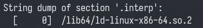

发现里面存的是 loader，loader 负责帮助 ELF 进行 lib call

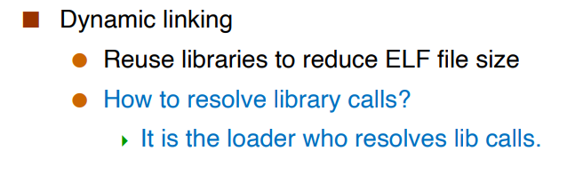

### run ELF

现在来看 ELF 是怎么 run 起来的。

#### memory mapping

首先要把 ELF 文件放到内存中。这三个问题的答案简单来说就是都是操作系统干的。

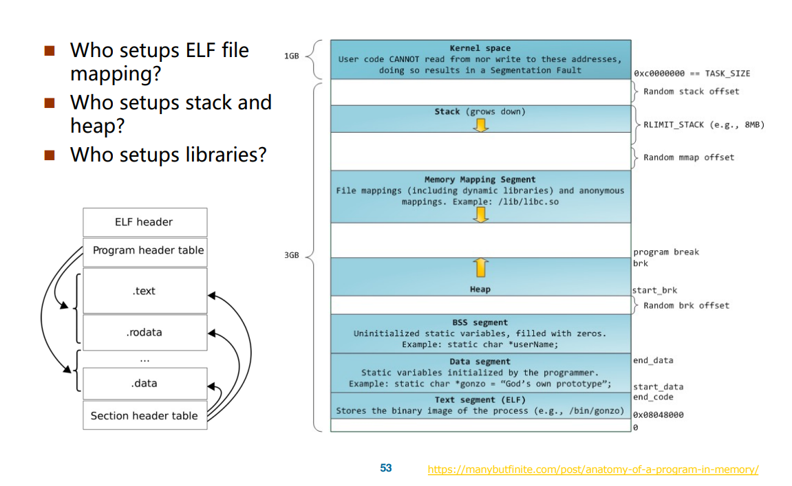

可以使用 `cat /proc/self/maps` 查看这条命令自己（cat）的内存映射情况

```shell
561543b33000-561543b35000 r--p 00000000 08:20 1283                       /usr/bin/cat
561543b35000-561543b39000 r-xp 00002000 08:20 1283                       /usr/bin/cat
561543b39000-561543b3b000 r--p 00006000 08:20 1283                       /usr/bin/cat
561543b3b000-561543b3c000 r--p 00007000 08:20 1283                       /usr/bin/cat
561543b3c000-561543b3d000 rw-p 00008000 08:20 1283                       /usr/bin/cat
5615457c4000-5615457e5000 rw-p 00000000 00:00 0                          [heap]
7fc9a04cb000-7fc9a04ed000 rw-p 00000000 00:00 0
7fc9a04ed000-7fc9a0544000 r--p 00000000 08:20 21261                      /usr/lib/locale/C.utf8/LC_CTYPE
7fc9a0544000-7fc9a0545000 r--p 00000000 08:20 21268                      /usr/lib/locale/C.utf8/LC_NUMERIC
7fc9a0545000-7fc9a0546000 r--p 00000000 08:20 21272                      /usr/lib/locale/C.utf8/LC_TIME
7fc9a0546000-7fc9a0547000 r--p 00000000 08:20 21260                      /usr/lib/locale/C.utf8/LC_COLLATE
7fc9a0547000-7fc9a0548000 r--p 00000000 08:20 21266                      /usr/lib/locale/C.utf8/LC_MONETARY
7fc9a0548000-7fc9a0549000 r--p 00000000 08:20 21265                      /usr/lib/locale/C.utf8/LC_MESSAGES/SYS_LC_MESSAGES
7fc9a0549000-7fc9a054a000 r--p 00000000 08:20 21270                      /usr/lib/locale/C.utf8/LC_PAPER
7fc9a054a000-7fc9a054b000 r--p 00000000 08:20 21267                      /usr/lib/locale/C.utf8/LC_NAME
7fc9a054b000-7fc9a054c000 r--p 00000000 08:20 21259                      /usr/lib/locale/C.utf8/LC_ADDRESS
7fc9a054c000-7fc9a054d000 r--p 00000000 08:20 21271                      /usr/lib/locale/C.utf8/LC_TELEPHONE
7fc9a054d000-7fc9a054e000 r--p 00000000 08:20 21263                      /usr/lib/locale/C.utf8/LC_MEASUREMENT
7fc9a054e000-7fc9a0551000 rw-p 00000000 00:00 0
7fc9a0551000-7fc9a0579000 r--p 00000000 08:20 29495                      /usr/lib/x86_64-linux-gnu/libc.so.6
7fc9a0579000-7fc9a070e000 r-xp 00028000 08:20 29495                      /usr/lib/x86_64-linux-gnu/libc.so.6
7fc9a070e000-7fc9a0766000 r--p 001bd000 08:20 29495                      /usr/lib/x86_64-linux-gnu/libc.so.6
7fc9a0766000-7fc9a076a000 r--p 00214000 08:20 29495                      /usr/lib/x86_64-linux-gnu/libc.so.6
7fc9a076a000-7fc9a076c000 rw-p 00218000 08:20 29495                      /usr/lib/x86_64-linux-gnu/libc.so.6
7fc9a076c000-7fc9a0779000 rw-p 00000000 00:00 0
7fc9a0779000-7fc9a0780000 r--s 00000000 08:20 29761                      /usr/lib/x86_64-linux-gnu/gconv/gconv-modules.cache
7fc9a0780000-7fc9a0782000 rw-p 00000000 00:00 0
7fc9a0782000-7fc9a0784000 r--p 00000000 08:20 28367                      /usr/lib/x86_64-linux-gnu/ld-linux-x86-64.so.2
7fc9a0784000-7fc9a07ae000 r-xp 00002000 08:20 28367                      /usr/lib/x86_64-linux-gnu/ld-linux-x86-64.so.2
7fc9a07ae000-7fc9a07b9000 r--p 0002c000 08:20 28367                      /usr/lib/x86_64-linux-gnu/ld-linux-x86-64.so.2
7fc9a07b9000-7fc9a07ba000 r--p 00000000 08:20 21262                      /usr/lib/locale/C.utf8/LC_IDENTIFICATION
7fc9a07ba000-7fc9a07bc000 r--p 00037000 08:20 28367                      /usr/lib/x86_64-linux-gnu/ld-linux-x86-64.so.2
7fc9a07bc000-7fc9a07be000 rw-p 00039000 08:20 28367                      /usr/lib/x86_64-linux-gnu/ld-linux-x86-64.so.2
7ffffc163000-7ffffc185000 rw-p 00000000 00:00 0                          [stack]
7ffffc1c0000-7ffffc1c4000 r--p 00000000 00:00 0                          [vvar]
7ffffc1c4000-7ffffc1c6000 r-xp 00000000 00:00 0                          [vdso]
```

可以发现：

1. heap 在低地址，stack 在高地址
1. heap 和 stack 背后没有文件，称为 anonymous mapping
1. 地址最低的几个段对应 text 段（`r-xp`）、rodata 段（`r--p`）、data 段（`rw-p`），通过读写权限来判断

#### running

内存映射结束之后就要开始运行程序了。

```shell
strace ./a.static
strace ./a.dynamic
```

发现 dynamic link 的 ELF 调用的 syscall 多很多。但是共性的有 execve, brk, write。其中 execve 用于启动一个程序的运行。 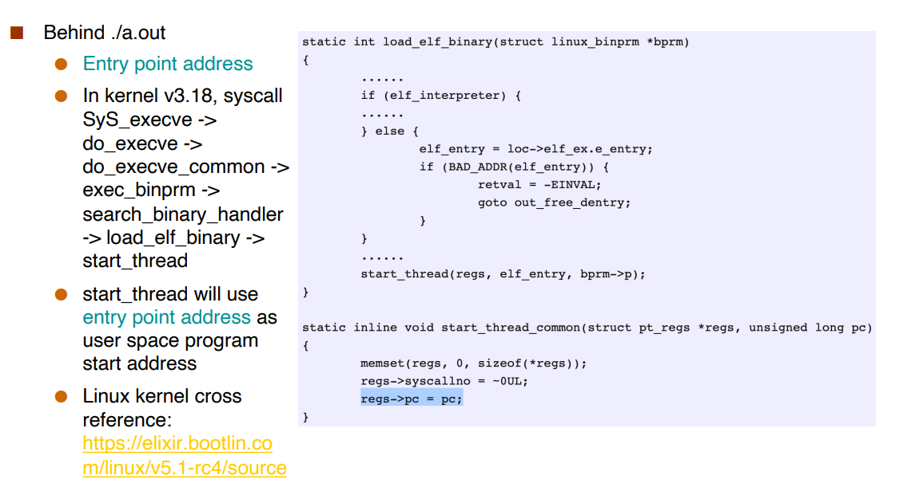

其中需要用到 entry point address，先以 static link ELF 为例，这个数据可以使用 `readelf -h a.static` 查看,-h 表示查看 ELF header。 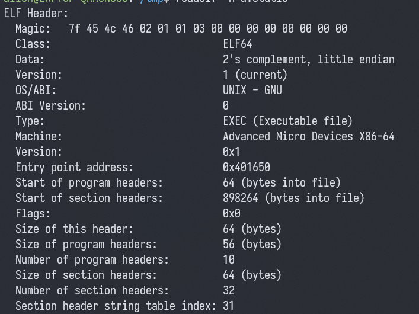

然后查看 ELF 文件的 entry point address 处是什么，`objdump -d a.static | vim -`

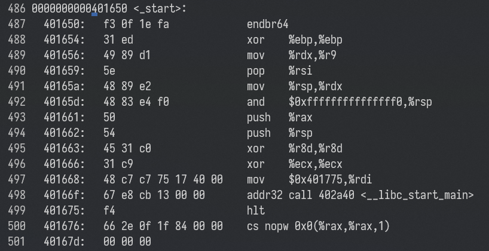

发现不是 main 函数，而是 `_start`，其中还有一个函数 `__libc_start_main`，前者会处理命令行参数等，后者会将控制流交给程序本身。

静态链接程序运行流程如下图

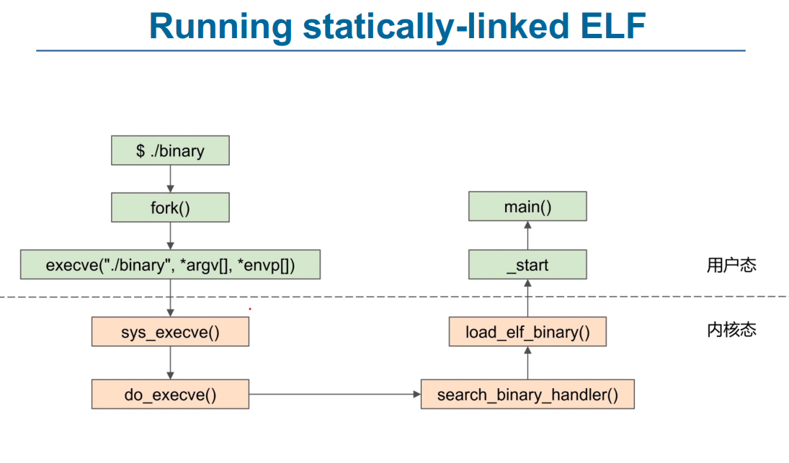

### memory mapping (cont.)

在了解了一些 syscall 之后来回答上面的三个问题：

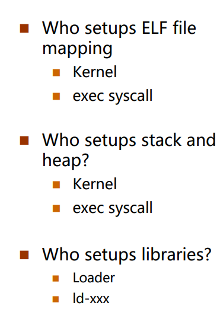

然后再看下 hello_world 跑起来之后的 memory mapping 是怎么样的。首先在程序里加上一个死循环，保证进程一直存在，然后

```shell
./a.static # 运行程序
pgrep a.static # 查看进程号
cat /proc/9285/maps # 查看内存映射
```

这是显示出来的 static link 产生的 ELF 的内存映射，发现非常简洁并且没有 loader

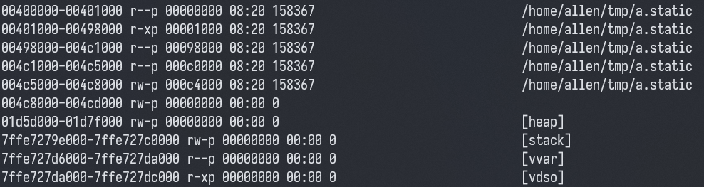

#### running (cont.)

然后来看 dynamic linked ELF 的运行流程。区别有：

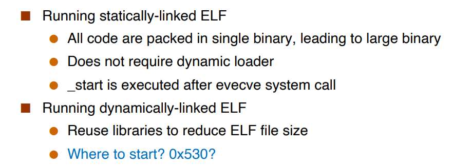

1. memory mapping 方面，dynamic 有 .interp 段存放的 interpreter 来 resolve 还未解析的符号，map 完了之后还有很多 ld 在内存中
1. running 方面，需要 dynamic loader 辅助运行
1. running 方面，execve 之后不是运行 _start，而是运行 interpreter

第一条：

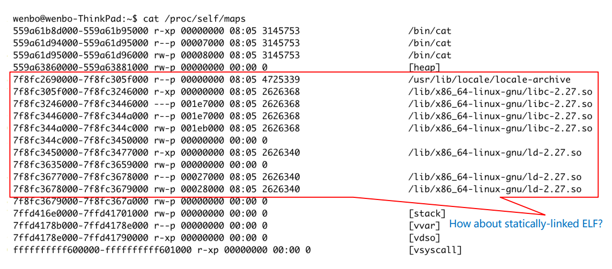

第二条：

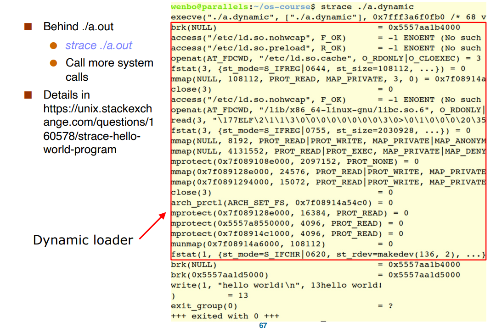

(cont.)整体运行流程比 static 多了一步 loader

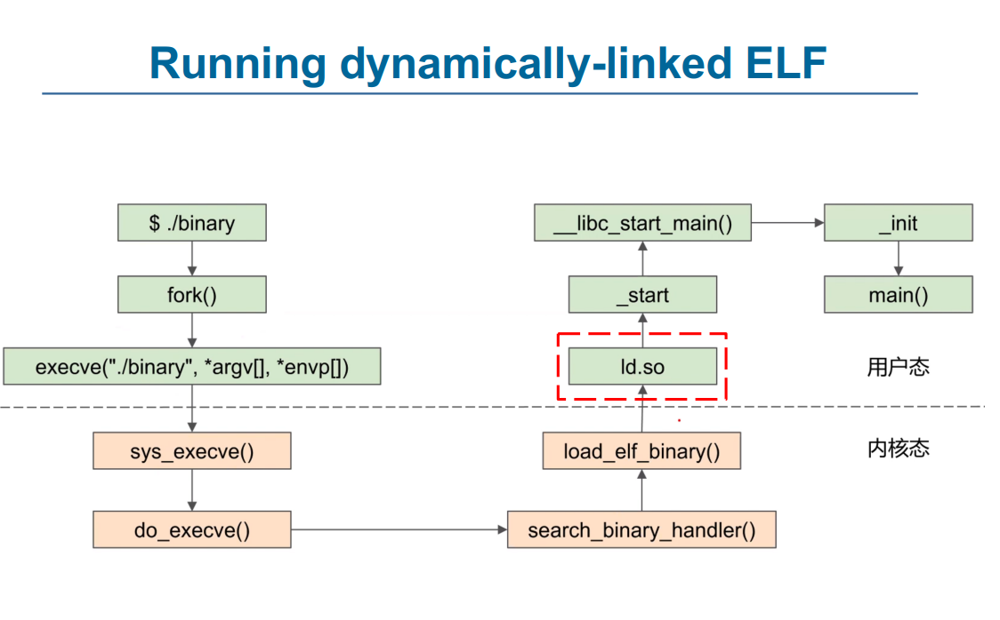

第三条：因为没有一堆库，所以 entry point address 小了很多。

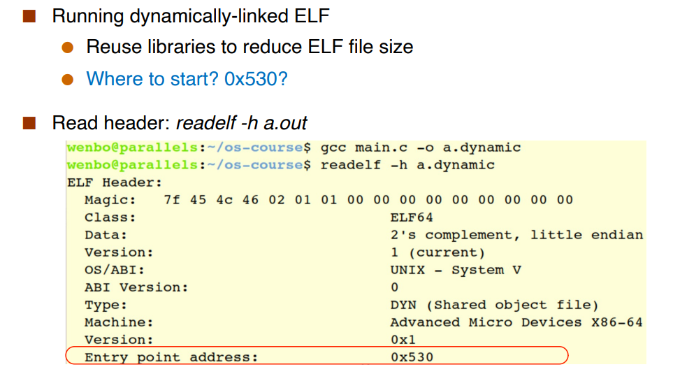

(cont.)load_elf_binary 中有这么一个分支，如果是动态链接，则 entry point 变为 loader 的地址。

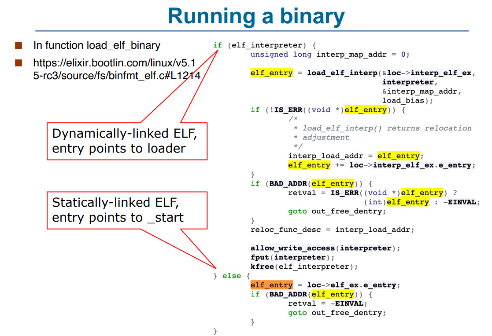

讲的稍微有点乱，但是大概有感觉了。补充一下 loader 的作用是把存放在硬盘上的程序加载到内存中进行运行，因为动态链接的程序没有把这些要用的东西全准备好。

### others

之后有空看看：

1. CSAPP：[知乎-关于阅读 CSAPP 的建议](https://www.zhihu.com/question/20402534)
1. [bootlin](https://elixir.bootlin.com/linux/latest/source): 查看 linux 源代码
1. [interactive linux map](https://makelinux.github.io/kernel/map/): 查看 linux 内核内容
1. 《人月神话》：“软件工程”概念的开创者

---

policy vs mechanism 策略 vs 机制

前者是“要不要”，后者是“怎么做”

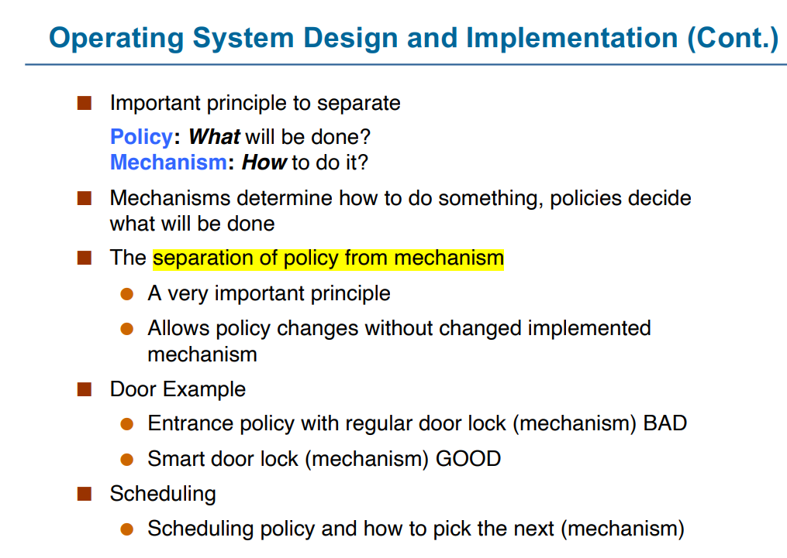

---

现在用什么语言实现操作系统？

```shell
sudo apt install cloc # 下载源文件统计工具 cloc
cloc . # 在 linux 根目录下进行统计
```

结果如下：

```shell
   88292 text files.
   87220 unique files.
   18432 files ignored.

github.com/AlDanial/cloc v 1.90  T=202.10 s (357.2 files/s, 174343.4 lines/s)
---------------------------------------------------------------------------------------
Language                             files          blank        comment           code
---------------------------------------------------------------------------------------
C                                    33108        3364442        2627387       17395225
C/C++ Header                         23909         716470        1379449        7142782
Assembly                              1346          49334         103851         474861
reStructuredText                      3381         167540          69513         457616
JSON                                   585              2              0         387710
YAML                                  3715          68506          17203         323410
Bourne Shell                           990          30989          21120         121334
make                                  2924          11203          12126          52096
SVG                                     74             90           1171          48177
Python                                 197           9599           8404          47971
Perl                                    69           7569           5174          37706
SWIG                                     1           6691              0          17152
Rust                                    60           1409           9001           8623
DOS Batch                             1660            175              0           7343
yacc                                    10            710            412           4953
PO File                                  6            948           1088           3733
lex                                     10            360            312           2202
C++                                      7            336            127           1800
Bourne Again Shell                      57            392            310           1619
awk                                     12            195            118           1076
D                                       10              0              0            707
CSV                                     10             74              0            658
Glade                                    1             58              0            603
NAnt script                              2            151              0            535
Cucumber                                 1             34             58            198
TeX                                      1              6             74            156
TNSDL                                    2             33              0            140
CSS                                      3             41             60            136
Windows Module Definition                2             15              0            113
m4                                       1             15              1             95
Clojure                                 33              0              0             75
XSLT                                     5             13             26             61
MATLAB                                   1             17             37             35
Markdown                                 1              9              0             27
vim script                               1              3             12             27
Ruby                                     1              4              0             25
INI                                      2              2              0             11
HTML                                     1              1              5             10
sed                                      1              2              5              5
TOML                                     1              1              9              2
---------------------------------------------------------------------------------------
SUM:                                 72201        4437439        4257053       26541008
---------------------------------------------------------------------------------------
```

---

操作系统架构

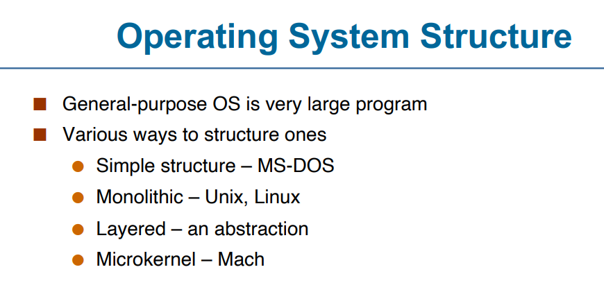

引入概念：layer

引入概念：微内核 microkernel，稳定但是太慢了

---

OS 哲学：debugging > coding

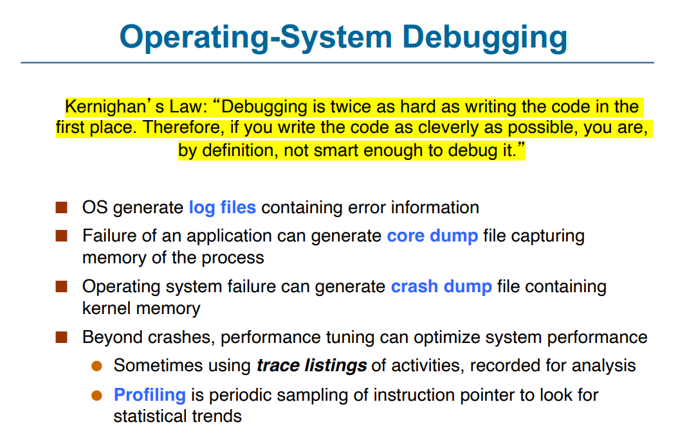

- debug 可以用 printk 打 log 输出调试，gdb 很好但是其实没什么人用。
- 没有 reproduce 就没有 debug

## week 3 Process

### Process Concept

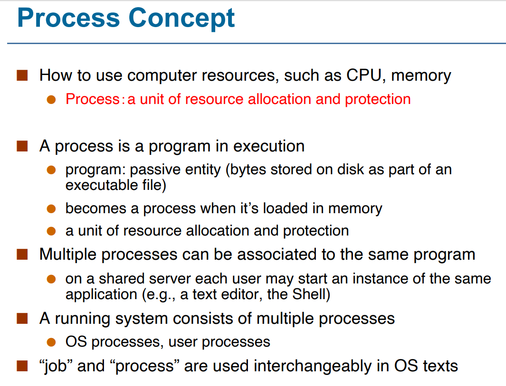

补充 & 重点

- 重要概念：process 是资源分配 & 保护的单位
- process vs program 概念辨析
- 手机黑屏的时候也有几百个进程存在（运行、sleep，或者 interrupted）

那么 process 除了包含 program 之外还包含什么呢？

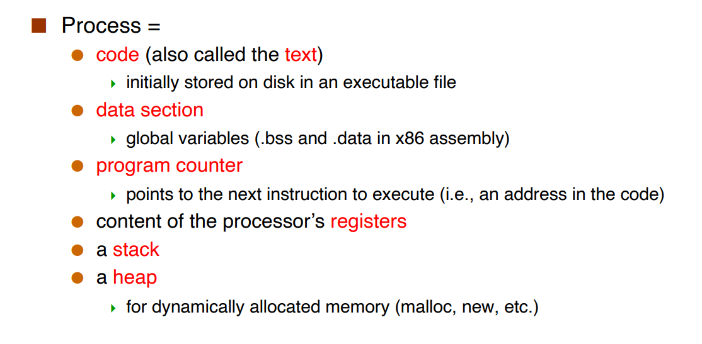


具体讲一下其中的栈。

- 每个 process 都会有一个 runtime stack
- stack 和 heap 可以理解为 OS 分配给 process 的草稿纸
- 同一个 program 产生的两个 process 的“草稿纸”可能不一样，取决于程序运行到哪里了

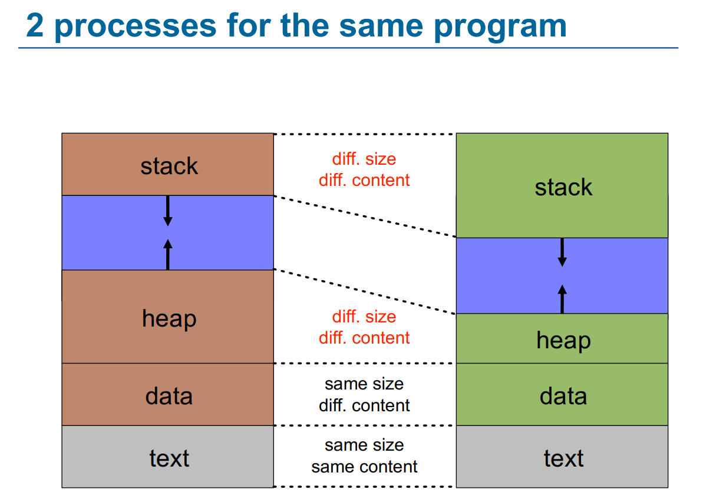

OS 负责启动新的 process，在 UNIX 中启动新进程的 syscall 是 fork

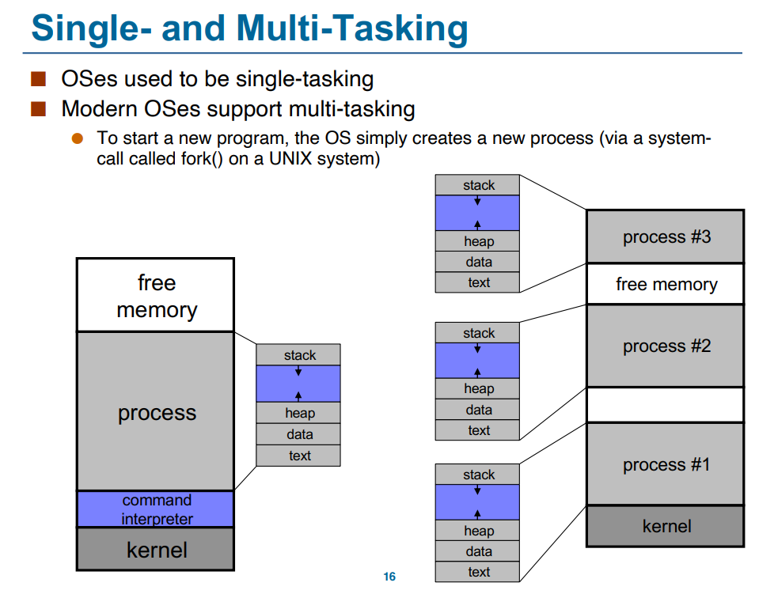

### Process Control Block(PCB)

PCB 是什么？存了哪些东西？什么时候生成，什么时候释放，存放在哪里？

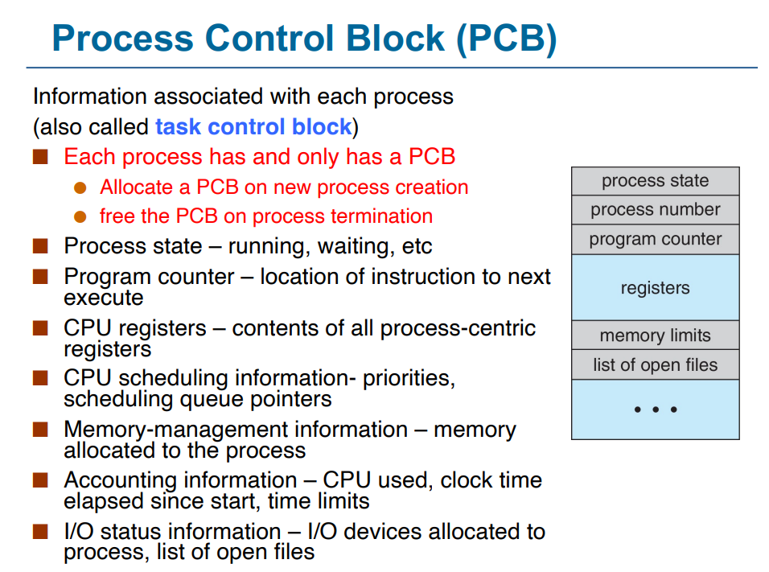

- PCB 存在内存上
- task_struct: linux 中的 PCB

### Process State

总共五个状态（**申老板：这个图很关键！**） 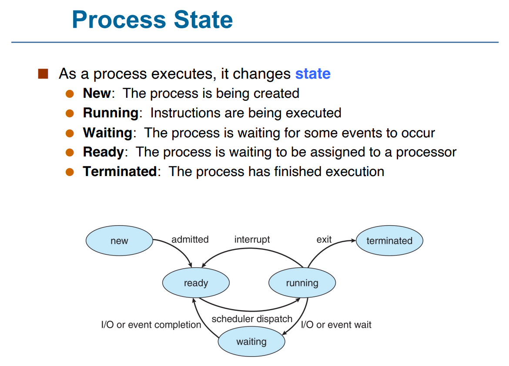

#### Process Creation

Process 的创建是一个树形结构，每个 process 除了有 pid 之外还有 ppid 存父亲节点的 pid。1 号进程是大部分进程的父亲。

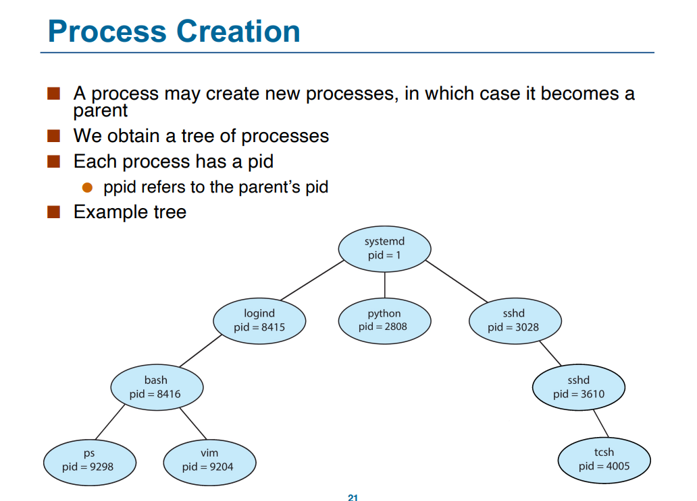

Process 创建的过程中，父亲有两种行为，继续执行或者等儿子运行完，儿子的内容有两种可能性，拷贝父亲或者生成一个全新的。

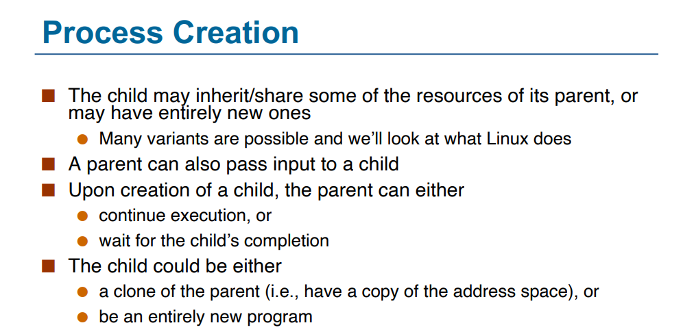

通过 `strace ./a.static` 发现第一个 syscall 是 `execve("./a.static", ["./a.static"], 0x7ffec9c2fdb0 /* 28 vars */) = 0`，execve 就是用一个与父亲无关的程序去覆盖刚 fork 出来的进程。但是 strace 不能跟踪 fork，因为 strace 本身也是 fork 出来的。

#### fork

fork: create a new process

- child 是 parent 的一个拷贝，即内存中所有数据全部复制一份。但是两者 pid 不一样，且 fork 之后就分家了，没有任何关系。
- fork 函数的返回值：parent 返回 child 的 pid，child 返回 0。怎么实现的？
- fork 完之后 parent 和 child 都从 fork 之后继续运行
- fork 之后一定要进行错误检查 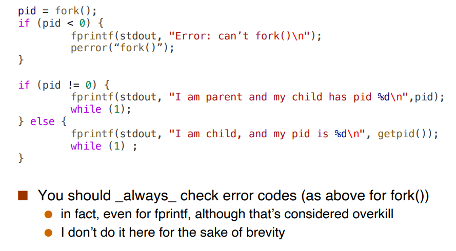
- p.s. getpid() 和 getppid() 是两个 syscall，用于获取当前进程编号和父亲编号

看一个 fork 的例子，理解 fork 的功能 

再看一个例子，这个例子说明 parent 和 child 使用不同的两片内存。 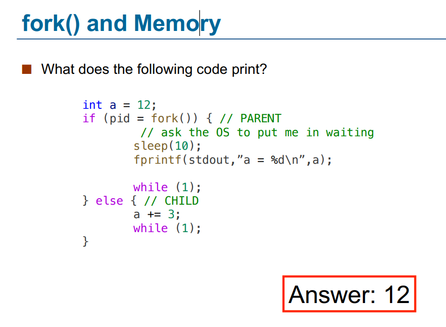

再看一个稍微复杂一点的例子，答案是 12 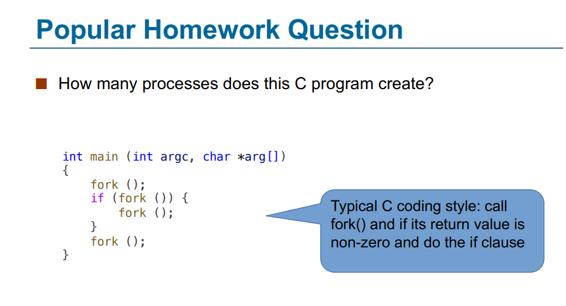

#### exec

之前有用 `strace ./a.static` 看过 execve 的调用，现在可以知道 fork 和 execve 的顺序 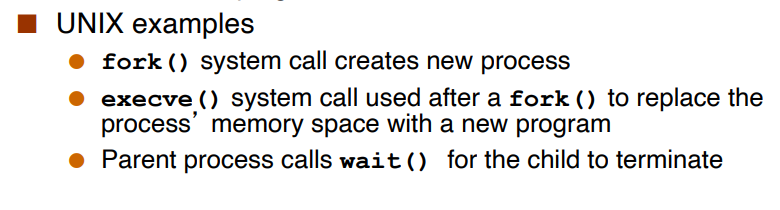

然后看看 execve 具体是个什么东西，需要哪些参数 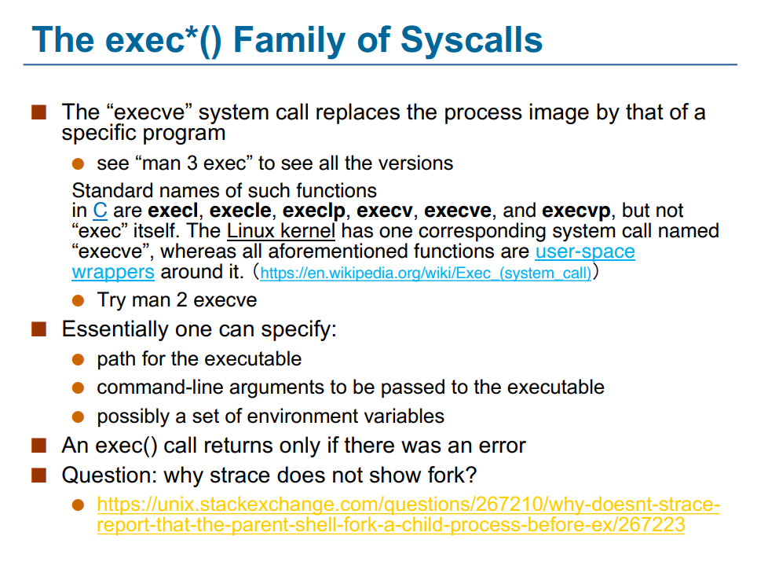

- 通过 `man man` 可以看到，`man 3` 表示查看 library call，意思是 exec 不是一条命令，而是一类命令，一个 library。这些命令都是 execve 的包装。

举个例子，fork 和 execve 的用法 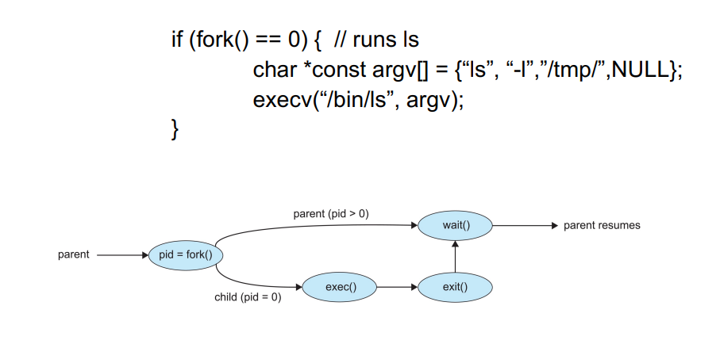

fork & execve 配合的好处和坏处 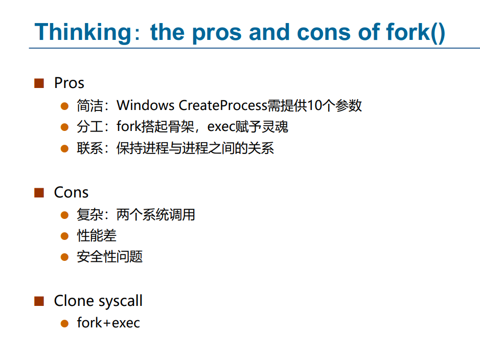

---

再看一个 demo

1. `exec_callee.c`
1. `exec_nofork.c` 不 fork 子进程，execv 会直接覆盖当前进程。注意：
	1. pid 是相同的，没有创建新进程
	1. execv 之后的代码没有被执行，因为整个程序已经被新程序覆盖了
1. `exec_main.c` fork 了子进程并 execv 子进程

#### Process Termination & signals

结束进程的几种方法：

1. exit() syscall 结束自己
1. kill() syscall 结束别人，kill 会使用到一些称为 signal 的终止信号

p.s. wait() & waitpid() syscall: wait 等待任意一个进程结束，waitpid 等待指定的进程结束。父亲进程可以选择等待儿子 terminate 之后自己再执行。

`kill -l` 可以查看所有的 signal

```shell
 1) SIGHUP       2) SIGINT       3) SIGQUIT      4) SIGILL       5) SIGTRAP
 6) SIGABRT      7) SIGBUS       8) SIGFPE       9) SIGKILL     10) SIGUSR1
11) SIGSEGV     12) SIGUSR2     13) SIGPIPE     14) SIGALRM     15) SIGTERM
16) SIGSTKFLT   17) SIGCHLD     18) SIGCONT     19) SIGSTOP     20) SIGTSTP
21) SIGTTIN     22) SIGTTOU     23) SIGURG      24) SIGXCPU     25) SIGXFSZ
26) SIGVTALRM   27) SIGPROF     28) SIGWINCH    29) SIGIO       30) SIGPWR
31) SIGSYS      34) SIGRTMIN    35) SIGRTMIN+1  36) SIGRTMIN+2  37) SIGRTMIN+3
38) SIGRTMIN+4  39) SIGRTMIN+5  40) SIGRTMIN+6  41) SIGRTMIN+7  42) SIGRTMIN+8
43) SIGRTMIN+9  44) SIGRTMIN+10 45) SIGRTMIN+11 46) SIGRTMIN+12 47) SIGRTMIN+13
48) SIGRTMIN+14 49) SIGRTMIN+15 50) SIGRTMAX-14 51) SIGRTMAX-13 52) SIGRTMAX-12
53) SIGRTMAX-11 54) SIGRTMAX-10 55) SIGRTMAX-9  56) SIGRTMAX-8  57) SIGRTMAX-7
58) SIGRTMAX-6  59) SIGRTMAX-5  60) SIGRTMAX-4  61) SIGRTMAX-3  62) SIGRTMAX-2
63) SIGRTMAX-1  64) SIGRTMAX
```

其中比如说，ctrl+C 中断一个程序，就是给程序发 SIGINT 信号。

signal 是可以被 handle 的，看下面这个程序，就是给 SIGINT 信号重新设置了一个 handler，这个程序无法被 ctrl+C 杀死，但是还是可以通过 `kill pid` 杀死。

```c
#include <signal.h>
#include <stdio.h>
#include <stdlib.h>
#include <sys/types.h>
#include <unistd.h>

void handler(int sig) {
  fprintf(stdout,"I don't want to die!\n");
  return;
}

int main(int argc, char **argv)
{
	if (signal(SIGINT, handler) == SIG_ERR) {
		perror("signal()");
	}
	while (1) ; // infinite loop
}
```

handle signal 的具体做法 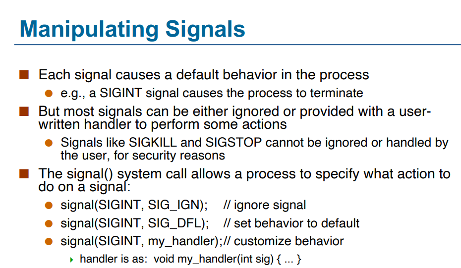

#### zombie process

僵尸进程：fork 产生的 child 结束之后无法释放自己的 PCB，如果 parent 死循环了 PCB 资源就一直无法被回收利用，child 就成为 zombie 了

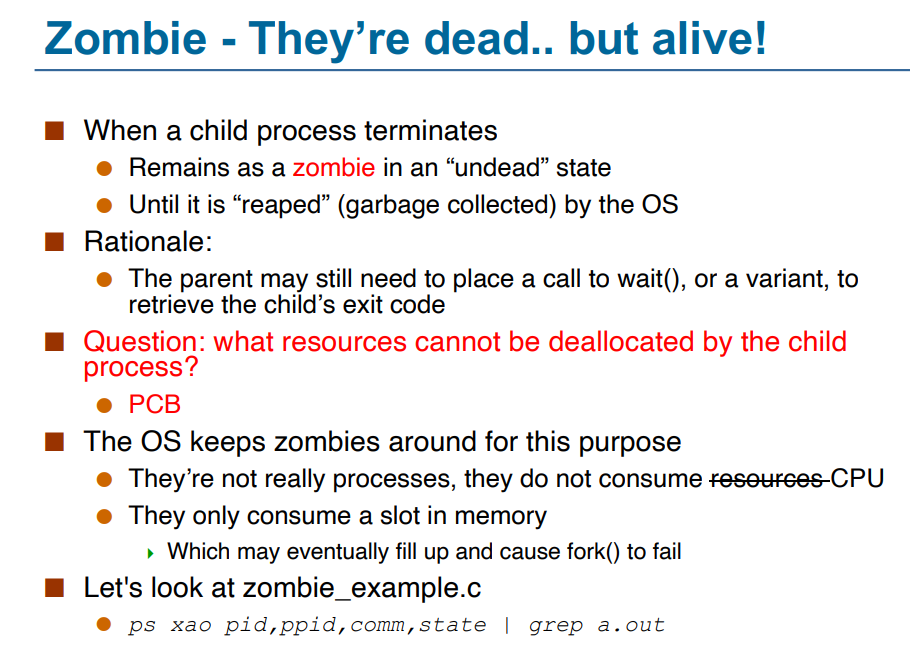

看下面的 zombie_example.c

```c
#include <signal.h>
#include <stdio.h>
#include <stdlib.h>
#include <sys/types.h>
#include <unistd.h>

int main(int argc, char **argv)
{
	pid_t pid;

	pid = fork();

	if (pid < 0) {
		fprintf(stderr,"Error: can't fork a process\n");
		perror("fork()");
		exit(1);
	} else if (pid) { // I am the parent
		// infinite loop
		while (1);
	} else {  // I am the child and I exit right away
		exit(0);
	}
}
```

然后运行这个程序，并通过 ps 查看程序运行状态

```shell
gcc zombie_example.c
./a.out
ps xao pid,ppid,comm,state | grep a.out
```

发现子进程的状态是 Z，就是 zombie

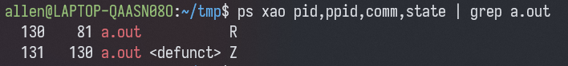

怎么避免产生僵尸进程？根本解决办法就是父亲在 fork 之后再 wait 一下。一个更方便的解决方法是给 SIGCHILD 信号一个 handler，在 handler 中 wait，这样所有子进程和子进程的子进程都会被回收。

关于 SIGCHILD 信号，子进程终止时会向父进程发送 SIGCHLD 信号，告知父进程回收自己。

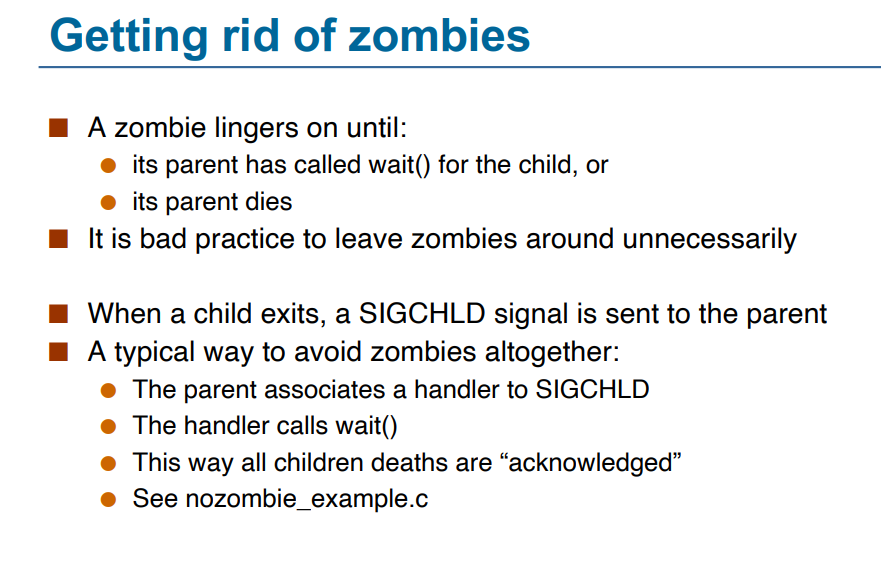

看这个 nozombie_example.c

```c
#include <signal.h>
#include <stdio.h>
#include <stdlib.h>
#include <sys/types.h>
#include <unistd.h>
#include <sys/wait.h>

void handler_sigchld(int sig) 
{
	pid_t pid;
	int status;

	fprintf(stdout,"In handler_sigchld()\n");
	pid = wait(&status);
	if (pid == -1) {
		perror("wait()");
	} else {
		fprintf(stdout,"Killing zombie %d (which exited with code %d)\n",
				pid, WEXITSTATUS(status));
	}
	return;
}


int main(int argc, char **argv)
{
	pid_t pid;

	pid = fork();

	signal(SIGCHLD, handler_sigchld);

	if (pid < 0) {
		fprintf(stderr,"Error: can't fork a process\n");
		perror("fork()");
		exit(1);
	} else if (pid) { // I am the parent
		// infinite loop
		while (1);
	} else {  // I am the child and I exit after sleeping 2 seconds
		sleep(2);
		exit(42);
	}
}
```

输出：

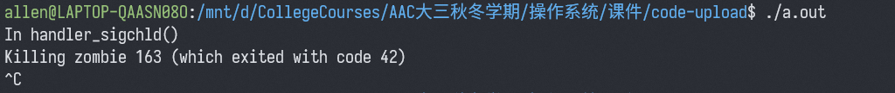

#### orphan

父亲进程结束了，子进程就变成 orphan。一般情况下 orphan 会被 1 号进程收养，但是在高版本的 Ubuntu 下收养 orphan 的进程变成 systemd，不是 1 号进程了。

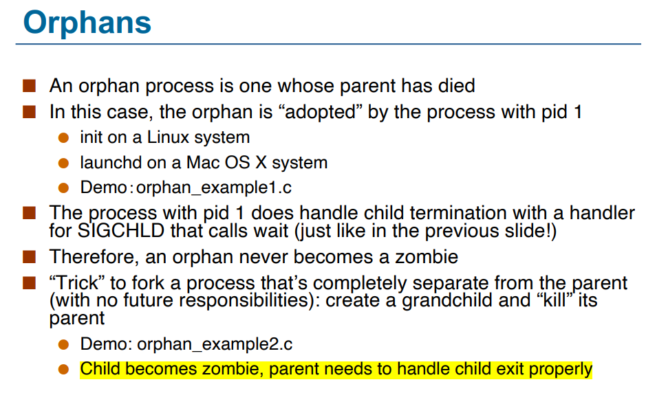

然后来看一下 orphan_example2.c

```c
#include <signal.h>
#include <stdio.h>
#include <stdlib.h>
#include <unistd.h>


int main(int argc, char **argv)
{
	pid_t pid;

	pid = fork();

	if (pid < 0) {
		fprintf(stderr,"Error: can't fork a process\n");
		perror("fork()");
		exit(1);

	} else if (pid) { // I am the parent and I do whatever

		while(1) ; // infinite loop

	} else {  // I am the child
		pid_t pid;

		fprintf(stderr,"I am the child and my pid is: %d\n",getpid());

		// forking a grandchild
		pid = fork();

		if (pid < 0) {
			fprintf(stderr,"Error: can't fork a process\n");
			perror("fork()");
			exit(1);
		} 

		if (pid == 0) {  // grandchild
			fprintf(stderr,"I am the grandchild and my parent's pid is: %d\n",
					getppid());
			sleep(2);
			fprintf(stderr,"I am the grandchild and my parent's pid is: %d\n",
					getppid());
			exit(0);
		} else { // child
			sleep(1);
			exit(0);
		}
	}
}
```

输出的结果是：


可以看到 child 进程结束之后，grandchild 的父亲发生了改变，但是它的父亲也没有变成 1，我们可以看一下 pid=80 的是一个什么进程 `ps xao pid,ppid,comm,state | grep 80`

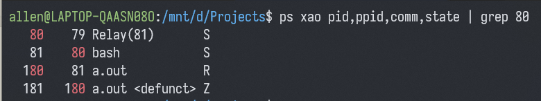

发现是一个叫 Relay(81) 的东西，是 bash 的父进程。版本不一样差别还是挺大的只能说。

这里其实有一个 trick 就是只要 fork child 和 grandchild，然后 kill 掉 child，就可以创建一个和自身完全没有关系的新进程，这样 grandchild 就不可能变成 zombie 了。

### Process Scheduling

#### intro

现在来讲剩下的三个状态。

想要解决的问题：假如 CPU 只有一个核和一组寄存器，则同一时间 running 状态的进程只能有一个，但是 ready 和 waiting 可以有很多进程，我们想要组织这些进程使得 cpu performance 最好

解决办法是使用队列。ready queue: 每个 cpu 一个。waiting queue: 每个 event 一个。实现的数据结构是 list，在每个 PCB(linux 中的 task_struct 结构体) 中都会定义两个指针，分别指向队列里上一个和下一个 PCB，减去偏移量强转成 task_struct 就可以得到对应的 PCB 了。

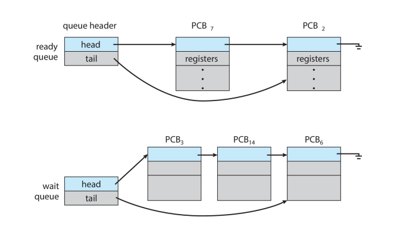

非常重要的图，scheduling 的图示，说明了两种 queue 是如何运作的

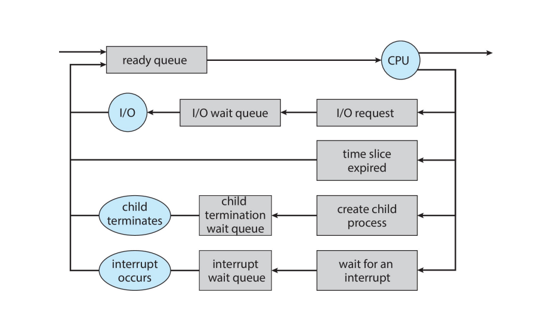

一些情况：

- 如果一个进程已经跑满了分配给它的时间，就会重新回到 ready queue 里
- fork 了一个新的进程，child 会被放在 ready queue 里。parent 如果在 wait，则会在 child terminate wait queue 里

#### context switch

当 running 的进程需要切换成另一个，我们就需要做 context switch，其大致流程如下

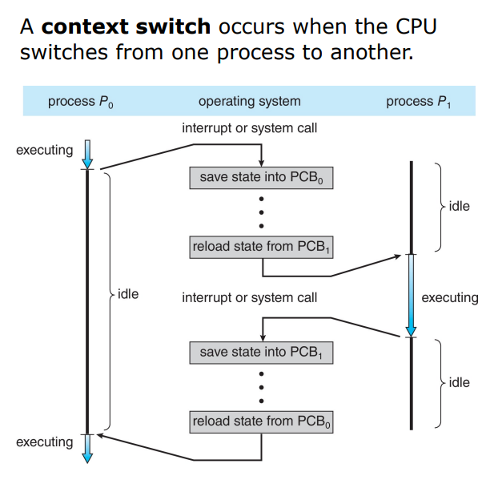

主要是存储寄存器值，以及页表之类在 cpu 内部的信息。context switch 是 pure overhead 的，频繁调用，且完全无用，所以代码要尽可能地简单

#### context switch 核心代码 cpu_switch_to

接下来来看 context switch 的核心代码：cpu_switch_to

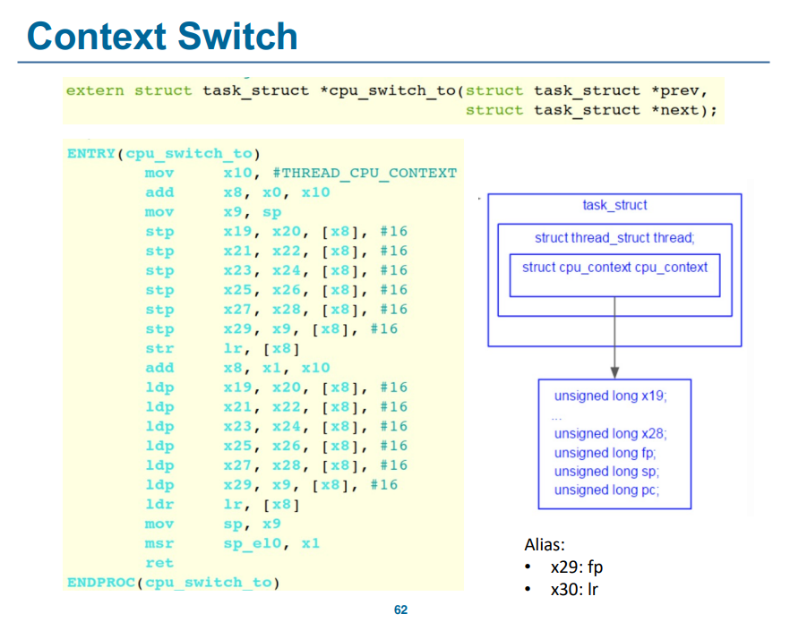

在 bootlin 上找到的 arm64 的 cpu_switch_to 和上面的代码非常相似，它的注释也提供了一些信息

```c
/*
 * Register switch for AArch64. The callee-saved registers need to be saved
 * and restored. On entry:
 *   x0 = previous task_struct (must be preserved across the switch)
 *   x1 = next task_struct
 * Previous and next are guaranteed not to be the same.
 *
 */
```

从头到尾梳理一遍：

1. x10 是 cpu_context 的偏移地址
1. x0 是 previous task_struct 的地址
1. x8 = x0 + x10 是 previous task_struct 的 cpu_context 的地址
1. x9 暂存 sp
1. stp 和 str 依次把所有的 callee-saved register 存到内存（PCB 里面的一块）中，callee-saved register 包含 x19-x28 和 fp, sp, lr
1. x8 = x1 + x10 是 next task_struct 的 cpu_context 的地址
1. ldp 和 ldr 依次把所有的 callee-saved register 从内存中取出来，此时 lr 已经指向 next task 的下一条指令位置
1. x9 赋值给 sp，现在 sp 指向 next task 的栈顶
1. ret 返回到 next task 的下一条指令位置继续执行

总结一下，主要包含三个切换：

1. 执行流的切换
1. 栈的切换
1. context 的切换

补充一些必要的知识：

- stp, str 和 ldp, ldr 会递增地址，所以图中的代码实际上是在连续的内存中存储数据
- stp 和 ldr 是一次存取两个寄存器
- x0 存储函数的第一个参数，x1 存储第二个参数
- lr=x30: link register 存储函数的返回地址
- fp=x29 是一个类似链表的东西，用于给栈分片，在递归调用函数的时候方便 backtrace
- sp=x31 指向栈顶
- 其他 caller-saved register 存在哪里？cpu_switch_to 的 caller 负责压到栈里，cpu_switch_to 不管

下面是进程内核栈的 memory layout（每个进程都有一个 PCB 和一个进程内核栈）

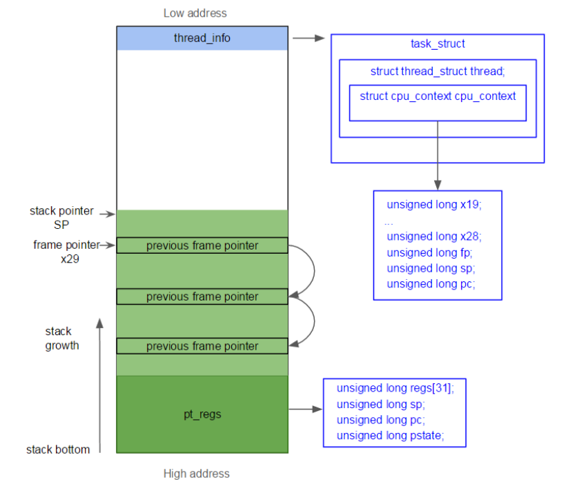

可以发现：

1. 栈最初分配的一块空间就是给进程存储寄存器值的，caller 可以把 caller-saved register 值放在这些空间里
1. thread_info 存在于整个内核栈的最小地址处，指向 PCB

#### context switch 在不同 mode 下的表现

kernel mode to kernel mode:

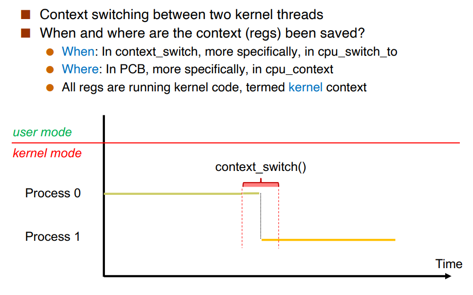

user mode to user mode:

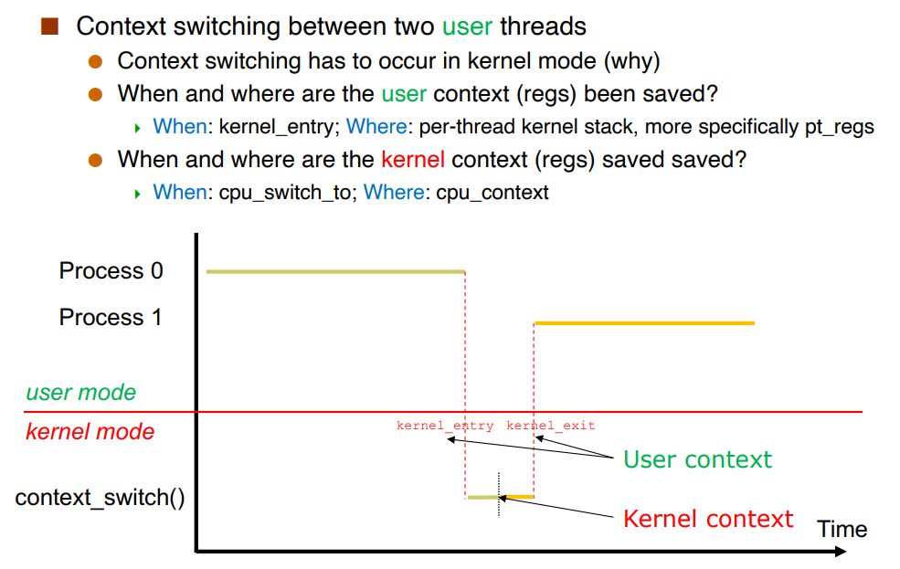

需要两个新的宏：

1. kernel_entry：把所有寄存器值都存到内核栈的 pt_regs 区域里，保证进入 kernel mode 前所有寄存器都是 clean 的
1. kernel_exit：反向操作

p.s. 这俩操作会把所有寄存器都存到内核栈的 pt_regs 里，而 cpu_switch_to 是把部分寄存器存到 PCB 中的 cpu_context 中，存的位置是不一样的。

什么是 user context 和 kernel context？我们来看 fork 能给 parent 和 child 返回两个不同的值这个现象

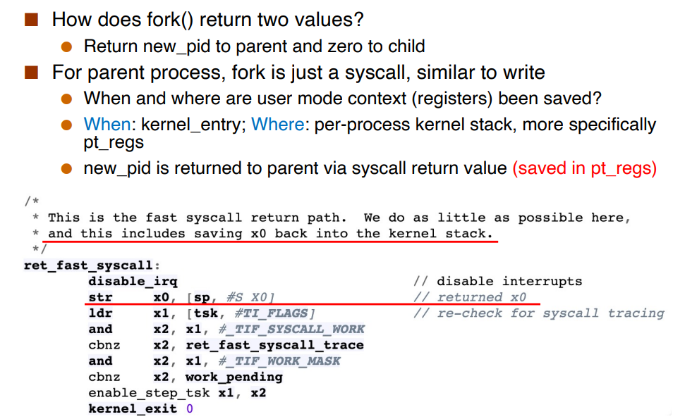

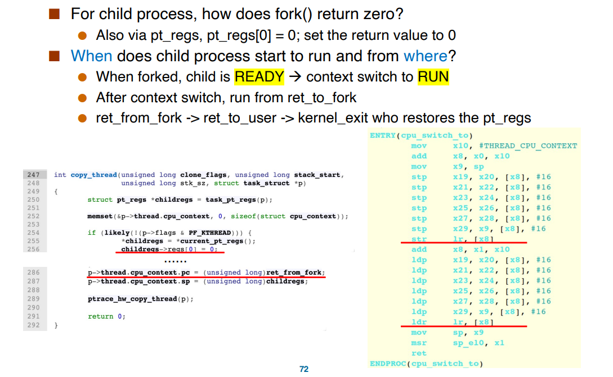

fork 结束之后 pc 会跳到 **ret_from_fork** 这个函数，然后再跳到 **ret_to_user**，再到 kernel_exit，然后回到 user mode 继续运行

### others

之后有空看看：

1. [离谱的 C 代码比赛](https://www.ioccc.org/)
1. linux process scheduling 相关代码的发展

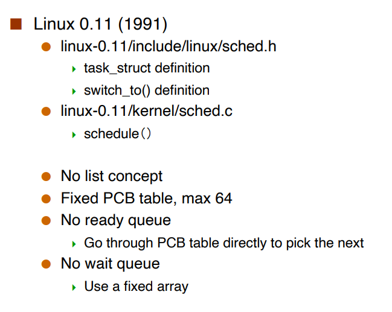

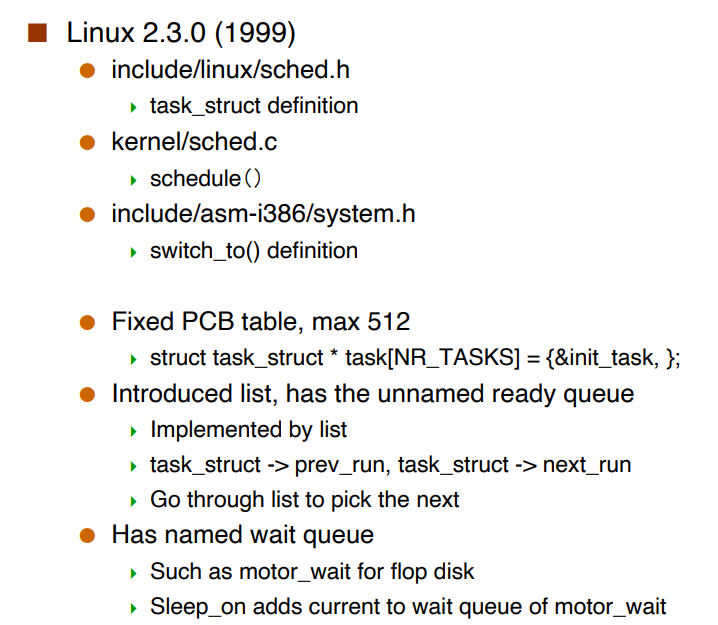

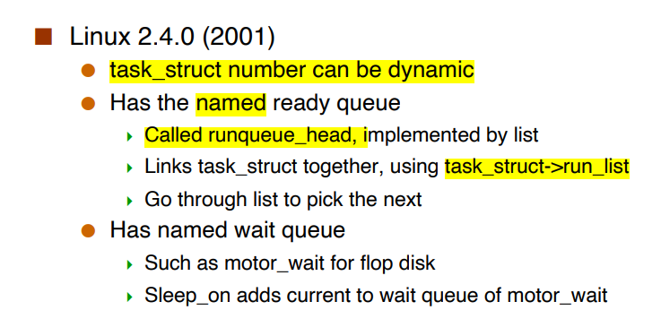

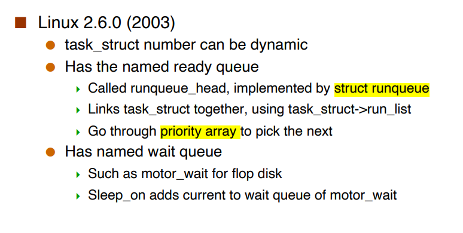

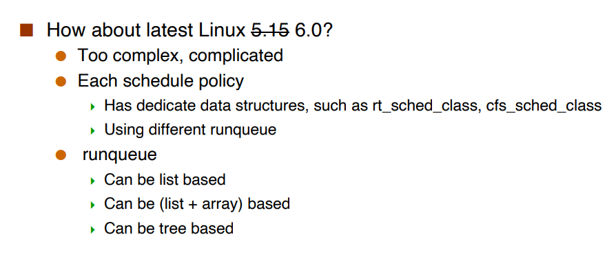

## week 4 Inter-Process Communication(IPC)

### intro

- 进程：隔离程度好，但吃内存且很慢。可以做到让每个进程只使用四个 syscall， read write sigret exit，保证安全。
- 线程：共用资源，但是隔离程度差。

为什么需要 IPC？因为 process 之间隔离性太好了，所以需要 IPC 进行通信。IPC 对于微内核来说非常重要，是微内核的效率瓶颈。

举个例子：chrome 不同的 tab 拥有不同的进程，所以吃内存且慢也可以解释了。

IPC 的方法，常用的有 5 种：

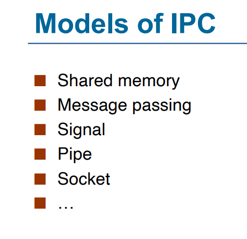

其中 shared memory 和 message passing 的内存结构：

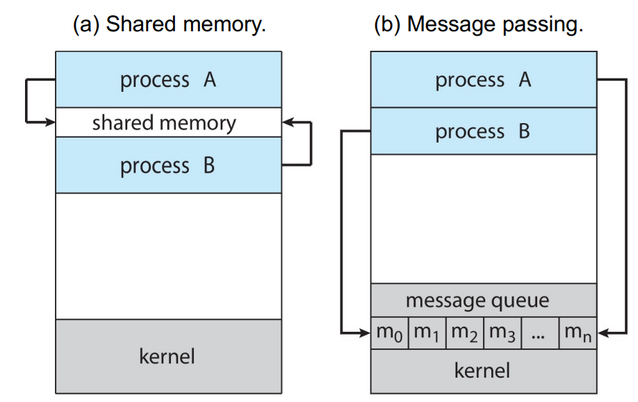

下面分别介绍

### shared memory

适合用于大量数据的共享，实现方法就是内存重新映射。

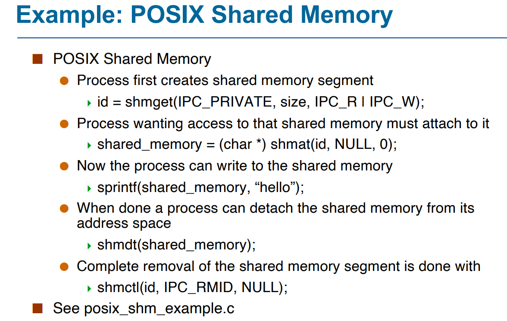

1. shmget：在内存中申请一片共享内存，可以在 `/proc/xxxx/maps` 中看到这片申请的空间
1. shmat：attach 连接到一片已存在的共享内存
1. shmdt：detach 断开连接

运行 posix_shm_example.c 并使用 `ipcs -a` 查看所有 shared memory。发现问题就是所有人都可以看到谁在共享内存，并且只要 shmat 就可以查看和修改，所以很不安全。

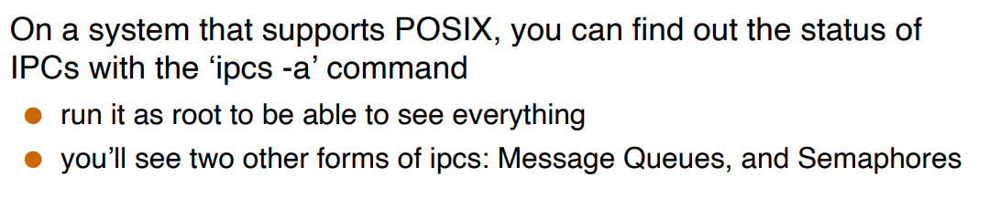

p.s. [posix 是什么？](https://zhuanlan.zhihu.com/p/392588996)

### message passing

#### intro

message passing 常用于分布式计算


---

首先需要建立 **link**，link 是一个抽象的概念，可以有很多种实现方式。

然后有两个基本操作：

1. **send**
1. **recv**

有了上述的 link, send & recv 就可以完成 message passing 了，那么如何自己实现 message passing 呢？可以非常简单：

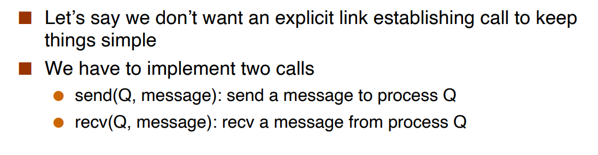

#### link

link 的实现有以下这些分类：

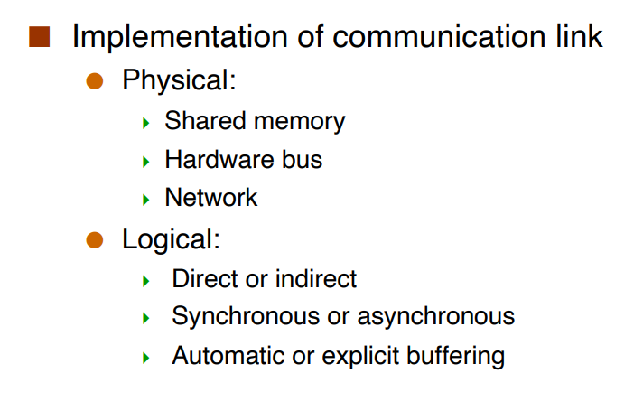

---

direct vs indirect：

- 前者必须指定通信的对象
- 后者通过 attach 到 mailbox(port) 进行通信

如果有多个进程连接到了相同的 mailbox，又会出现问题，发送到 mailbox 的信息由谁来接收。对于这个问题还是有很多解决方案。

---

Synchronous vs asynchronous：

- 前者等待 send 的信息被接收，或者 recv 到信息之后再执行其后的代码
- 后者则是 non-blocking 的，在 send 之后马上执行后面的代码，recv 不会等待，如果当前没有信息则用 null 代替

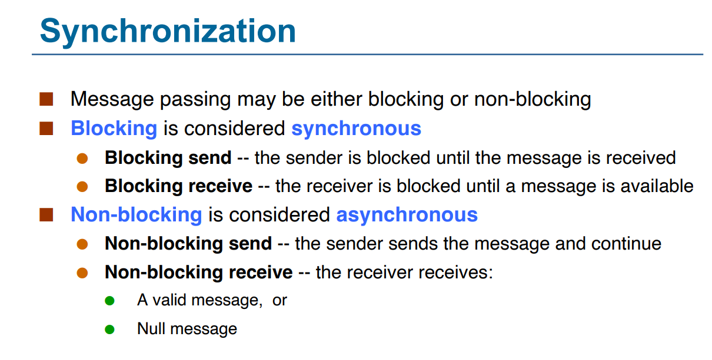

---

是否有 buffer，即信息是否能被暂存，能暂存多少

### pipes

ordinary pipe vs named pipe:

- 前者只能在 parent process 和 child process 之间通信
- 后者不要求通信的两个进程之间有特定关系

ordinary pipe 看 `pipe.c` 这个 demo，父进程向子进程发送字符。linux shell 中的 `ls | grep pipe` 此类命令也是用 pipe 实现的，ls 进程会创建一个 pipe 并 fork 一个新进程，新进程被 execve 成 grep 之后双方就可以通信了，ls 的输出会被写入 pipe 变成 grep 的输入。

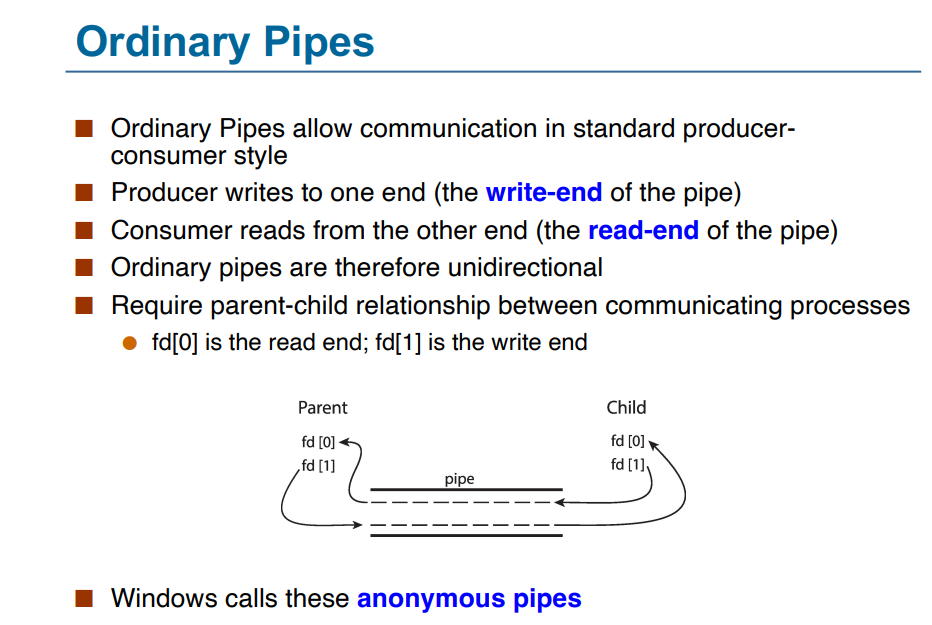

named pipe 看 `named_pipe_read.c` 和 `named_pipe_write.c` 两个代码组成的 demo

UNIX 中的 pipe 是 mono-directional 单向的，比如 `ls -R | grep foo | grep -v bar | wc -l`

### 其他

- signals
- client-server
	- e.g. socket，在计网中学
	- RPC, remote process calls，例如 java 的 RMI 就是 JVM 之间的 RPC

## week 5 thread

### 介绍 thread

#### 定义 & 概念

motivation: 如何让 process 跑的更快？multiple execution units!

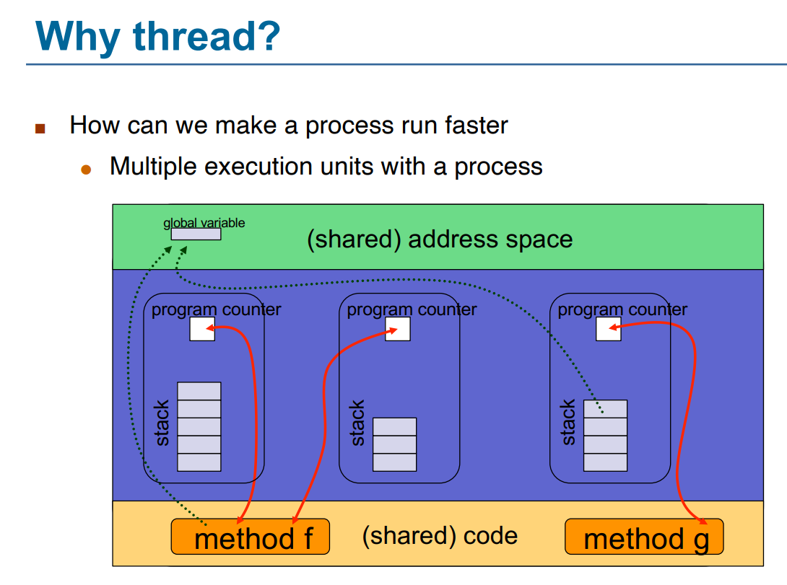

每个 thread 独有的部分：PC & register & stack。其他都共享。
- address space 简单来说就是指内存，比如 code 和 global variable 都存在 address space 中
- 每个 thread 有 kernel stack 和 user stack。其中 kernel stack 有大小限制，超过限制产生 kernel stack overflow；但 user stack 是 unbounded 的，内存有多大他就可以开多大

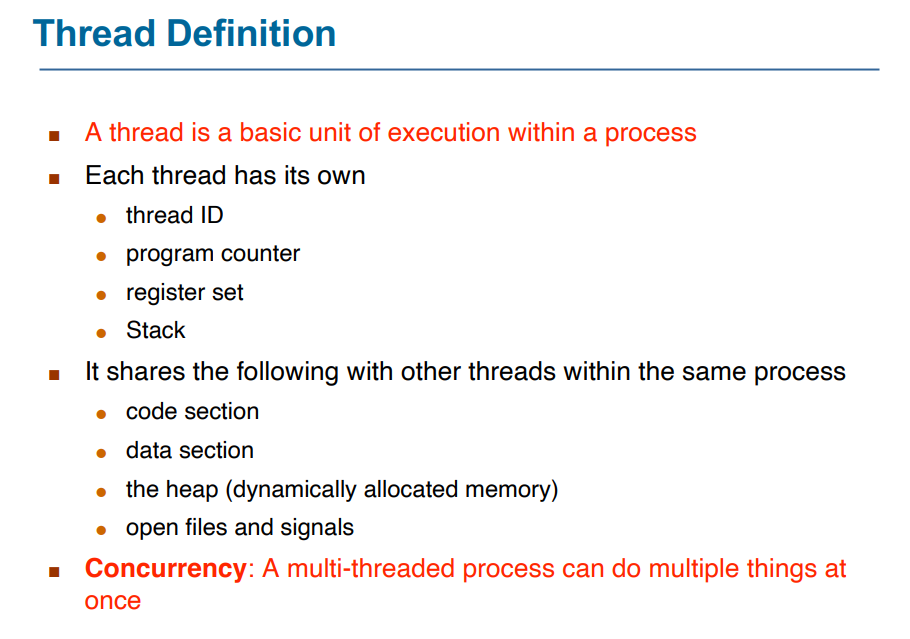

虽然共享 code，但是每个线程运行的代码不一定相同

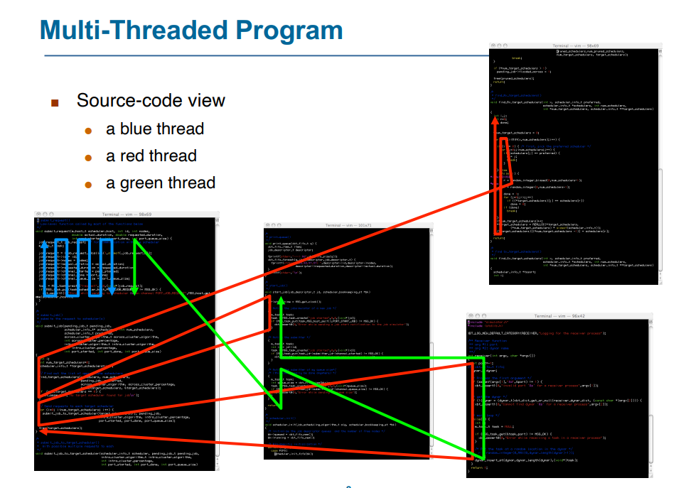

#### 优缺点

thread 的优势：主要是快，线程间切换不需要 flush cache，因为 code 和 data 是共享的，context switch 之后很多需要用到的东西已经在 cache 中了，即 cache 还是“热”的
- 例如 NGINX 通过使用 thread pool 把效率提升了 9 倍

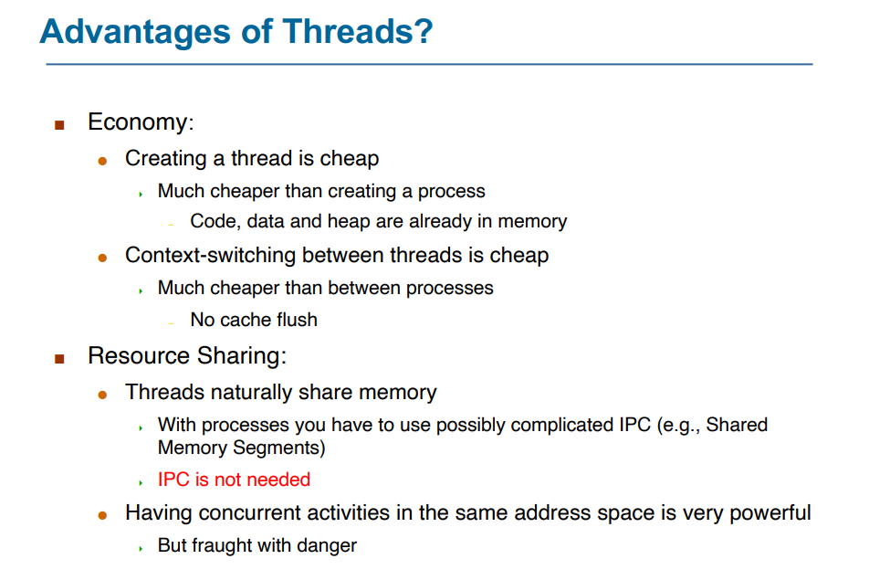

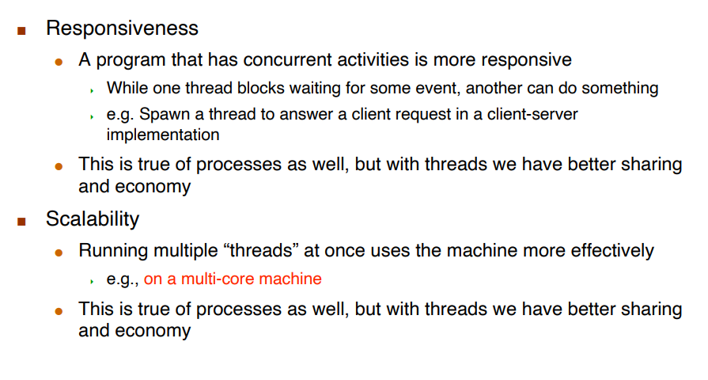

thread 的缺点：主要是隔离性太差了，所以一个线程 fail 了或者被攻击了，整个进程就 fail 了或者都被攻击了。而且 debug 之类的变得更复杂了。

---

现在在 linux 中看看线程是什么。使用 `ps -eLf`，其中 LWP(light weight process) 就是 linux 中的线程

#### user thread & kernel thread

user thread vs kernel thread:

- 前者只在 user space 中被支持，kernel space 中不知道有这些线程存在
- 后者在 kernel space 中被支持。有一些实现 kernel thread 的模型
	- many-to-one
	- one-to-one
	- many-to-many
	- two-level

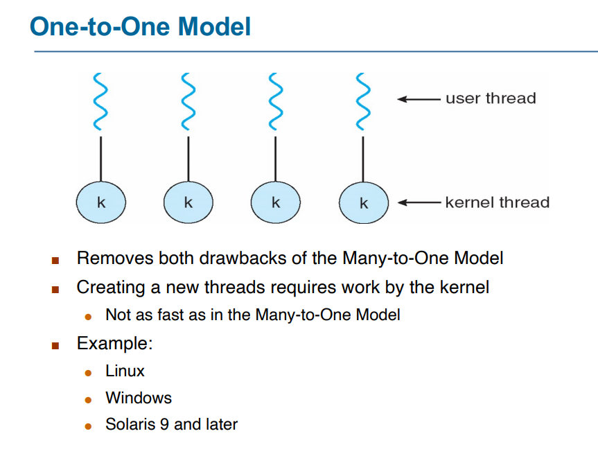

#### thread API(library)

各种语言及其 thread 库，其中 JAVA 的 thread 是使用起来比较方便的

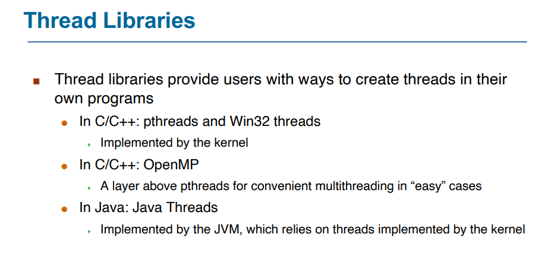

pthread = posix thread

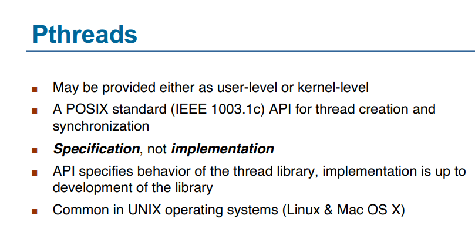

看看 pthread 的编程习惯：
- pthread_attr_init 初始化
- pthread_create 创建线程
- pthread_join 等待线程结束

p.s. 命名习惯，linux 中使用小写 + 下划线命名

```c
#include <pthread.h>
#include <stdio.h>
#include <stdlib.h>
int sum;                   /* this data is shared by the thread(s) */

/* The thread will execute in this function */
void *runner(void *param)
{
    int i, upper = atoi(param);
    sum = 0;
    for (i = 1; i <= upper; i++){
        sum += 1;
    }
    pthread_exit(0);
}

int main(int arge, char *argv[])
{
    pthread_t tid;        /* the thread identifier */
    pthread_attr_t attr; /* set of thread attributes */

    /* set the default attributes of the thread */ 
    pthread_attr_init(&attr);

    /* create the thread */ 
    pthread_create(&tid, &attr, runner, argv[1]);

    /* wait for the thread to exit */ 
    pthread_join(tid, NULL);

    printf("sum = %d\n", sum);
}
```

### thread issues

引入 thread 之后，原来的一些功能需要重新声明一下

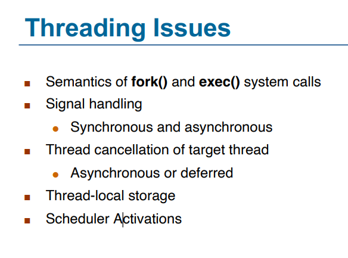

#### fork & exec

1. 第一种可能性：fork 出来的新进程只包含执行 fork 的那一个线程
1. 第二种可能性：fork 出来的出来的新进程包含原进程的所有线程

exec 的概念没什么好界定的，就是把所有线程都覆盖了

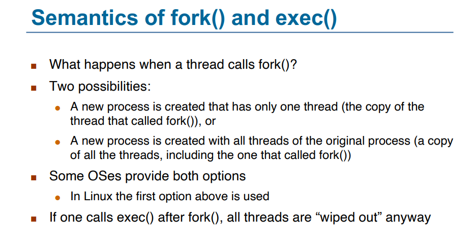

#### safe thread cancellation

1. 禁用 Off：cancellation remains pending until thread enables it
1. 异步 Asynchronous：线程 A 结束线程 B，B 马上响应
1. 延迟	Deferred：需要设置检查点，线程仅在 cancellation point 检查是否要 cancel，否则 cancel 信号持续 pending

p.s. On Linux systems, thread cancellation is handled through signals

thread 会产生很多难以 reroduce 的 bug

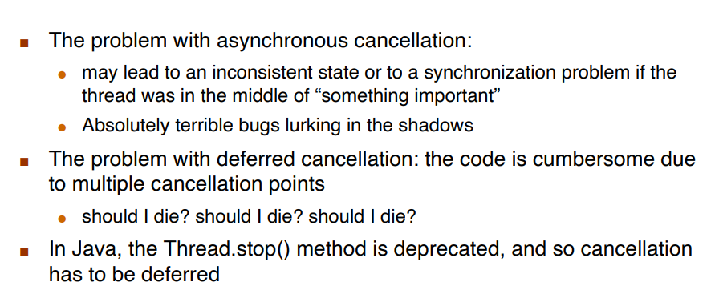

### thread 具体例子

#### windows thread

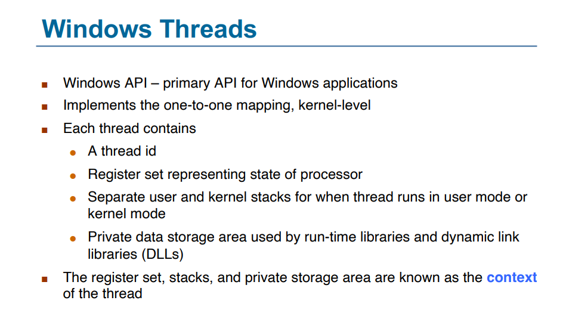

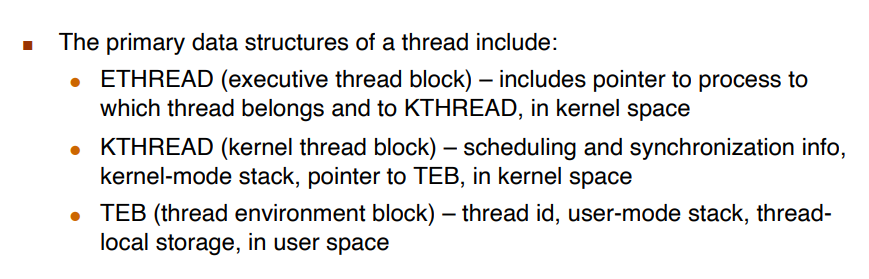

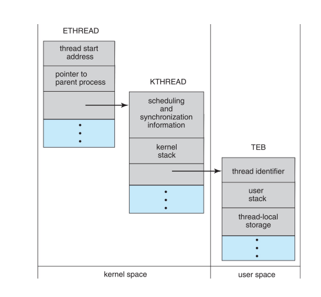

#### linux thread

##### LWP & clone

在 linux 中，thread = LWP(light weight process), clone() syscall 用于父线程创建子线程，`man clone` 查看他的定义

```shell
int clone(int (*fn)(void *), void *stack, int flags, void *arg, ...
			/* pid_t *parent_tid, void *tls, pid_t *child_tid */ );
```

其中有 flag 这个选项，用于控制 clone 的行为。可以发现在 linux 中，各个线程之间不一定会共享 address space，而是受 flag 控制

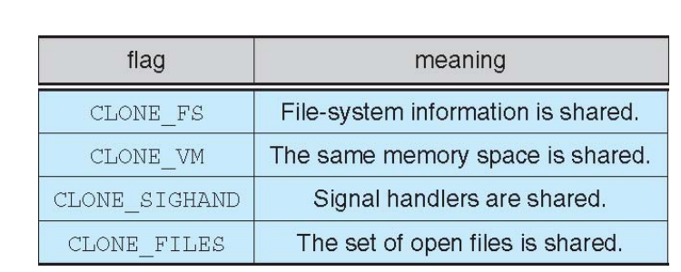

然后看 demo `clone.c`，buf 是一个局部变量，如果 `./a.out vm` 运行程序，则父线程和子线程会共享内存空间，子线程对 buf 的修改会体现在父线程中；反之则不会，有点像 fork 的效果。


##### task_struct 的新含义

task_struct 用来存储 process 和 thread 这两者都可以，linux 不区分 PCB 和 TCB(thread control block)。

linux 中的 multi-threaded：

1. 使用 struct list_head thread_group 连接所有的 thread
1. process 的 pid 就是 leading thread 的 pid。如果 leading thread fail 了，则整个 process 也 fail

例子：A 进程有 A1, A2, A3 三个线程，则有

- 3 个 task_struct
- 3 个 user stack & 3 个 kernel stack

##### 验证 thread 的实现

用代码验证 shared & not shared 的部分，看 `hello_lkm` 文件夹中的 demo：

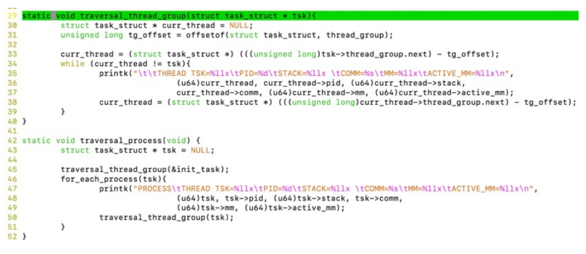

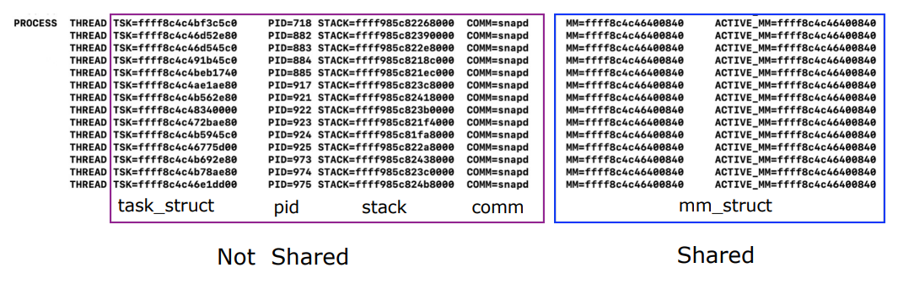

想要运行这个 demo 需要 [参考这篇博客编译一个新的内核](https://blog.csdn.net/weixin_45668903/article/details/128019077)。原因是，WSL2的内核是修改过的，无法使用 ubuntu上游的内核头文件和modules文件

p.s. mm_struct 中 mm = memory management，一般代表一个地址空间

p.s. `/proc` 是一个 in-memory file system，只存在于内存中，保存机器运行时的一些状态，关机后不再存在。

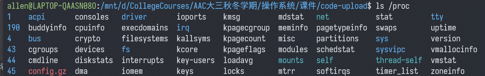

##### 如何理解一个 task

user thread 和 kernel thread 使用 one-to-one mapping，算作同一个 task

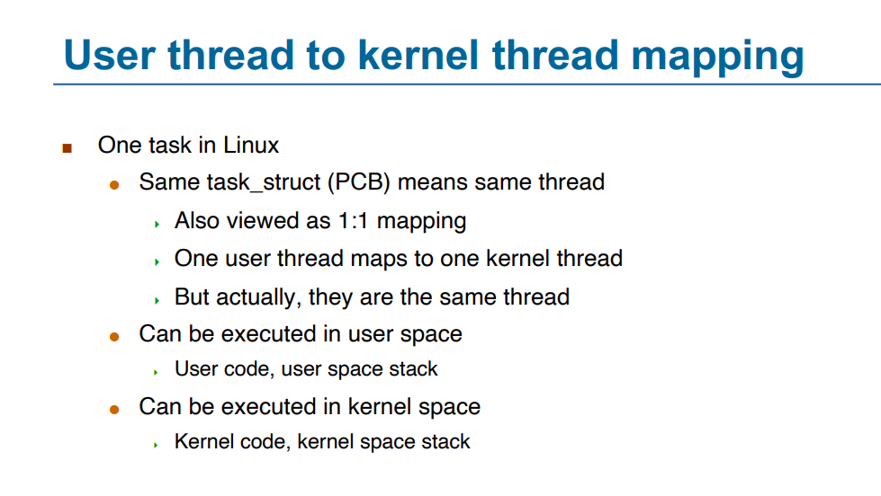

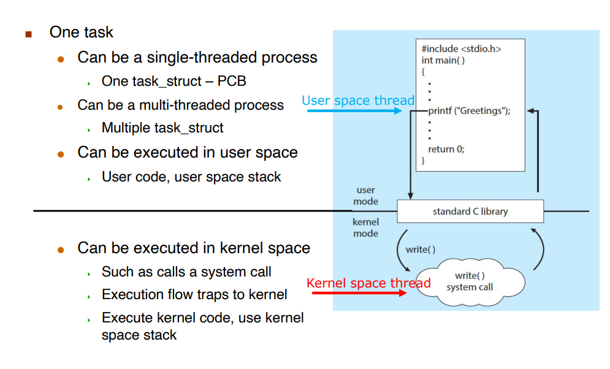

## week 6 CPU Scheduling

### intro

#### definition

scheduling definition: The decisions made by the OS to figure out which ready processes/threads should run and for how long

#### policy vs mechanism trailer

还会讨论 scheduling 的：

- policy: 不能让 CPU 去等待 I/O 设备，比如去硬盘中存取时，CPU 需要切换到其他进程执行以增加负荷
- mechanism: dispatcher latency 即 shceduling mechanism 消耗的时间必须非常少

p.s. 还会讨论为什么要把 policy 和 mechanism 分开讨论

p.s.s. dispatch 就是之前的 context switch，dispatcher latency 就是 context switch 消耗的时间 

#### I/O bound process vs CPU bound process

- I/O bound process: 更多地占用 I/O 时间，等待 I/O 响应，例如手机发送消息，就是等待网卡
- CPU bound process: 更多地占用 CPU 时间，例如渲染视频

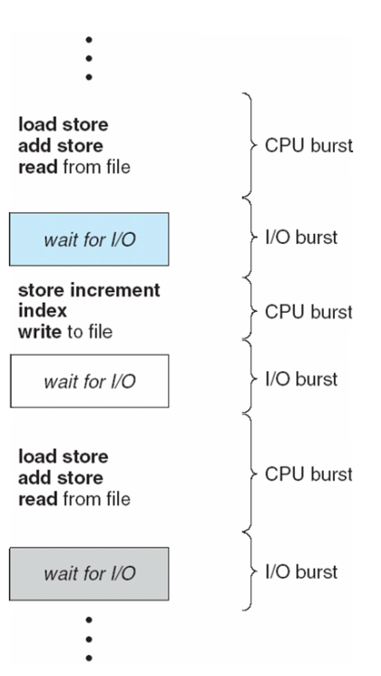

#### Non-preemptive scheduling vs Preemptive scheduling

scheduling policy 的一种分类方式：

- non-preemptive: 非抢占式, a process holds the CPU until it is willing to give it up, 即等待进程自己让出 CPU 控制权
- preemptive: 抢占式， a process can be preempted even though it could have happily continued executing

一般来说操作系统都是抢占式的，CPU 需要有足够的控制权

#### 什么时候需要 scheduling

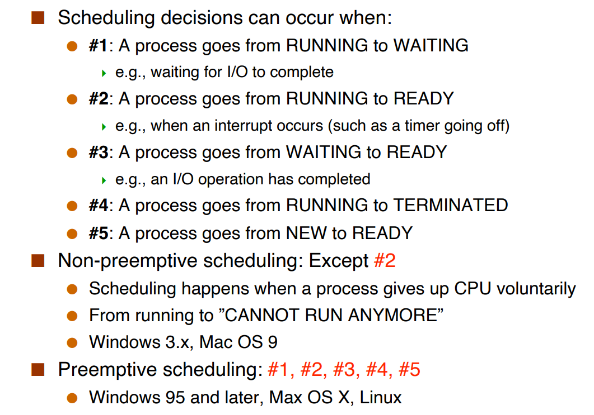

重新复习一下 process state，还有 ready queue & waiting queue:

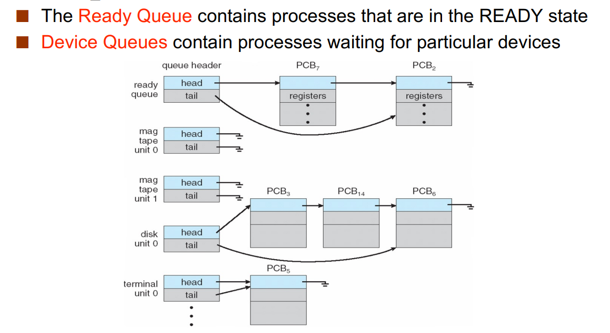

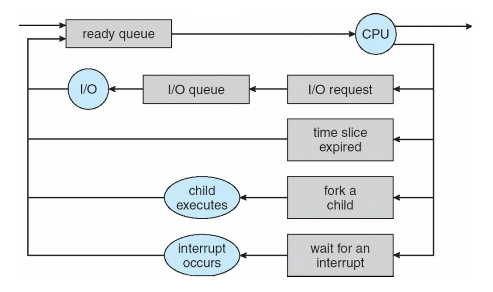

#### scheduling 的目标

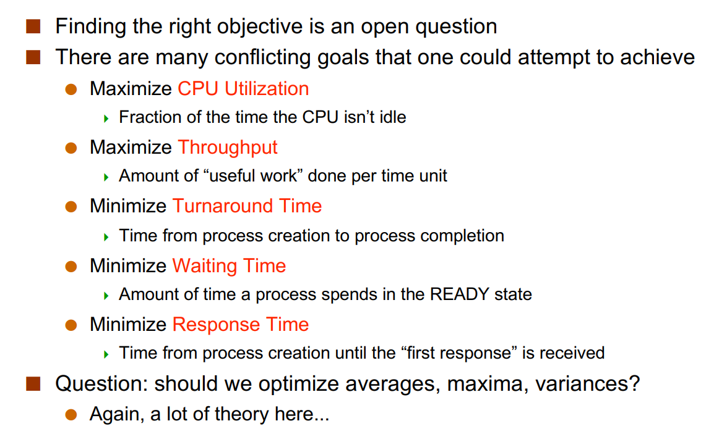

其中的部分目标是自相矛盾的，比如 response time 和 throughput 就矛盾。

比如 linux 基本是用于服务器，所以对 linux 来说 throughput 会比 responsiveness 更重要。但是 android 基于 linux 开发，所以导致 android 有时候反应比较慢，这个问题从操作系统层面就已经出现了

### 六种经典 scheduling algorithm

#### First-Come, First-Served Scheduling

三个考点：

- Gantt chart
- Waiting time = start time – arrival time
- Turnaround time = finish time – arrival time

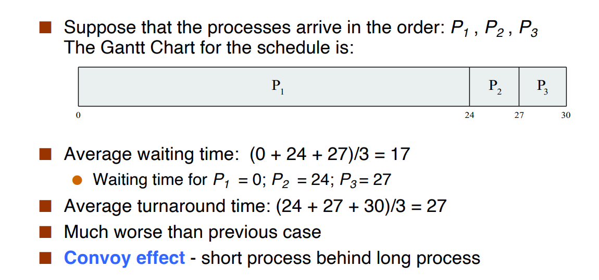

发现问题就是，如果 long job arrives first，则 waiting time 和 turnaround time 会变得很大

#### Shortest-Job-First Scheduling

非抢占式例子：

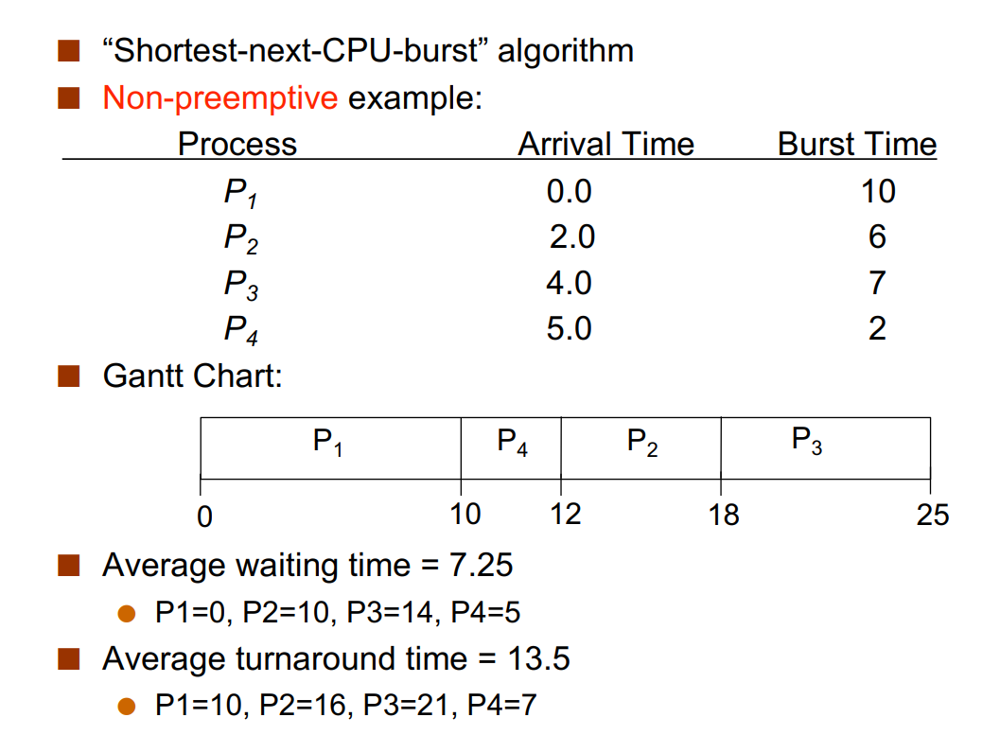

抢占式例子：
- waiting time = finish time - arrival time - burst time

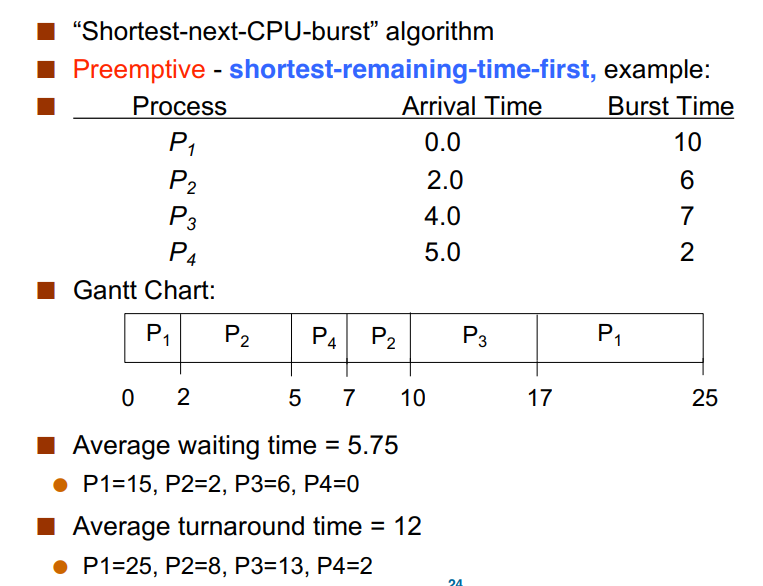

问题：不能提前知道 burst duration，只能尝试拟合

#### Round-Robin Scheduling 

算法是这样的：


举个例子：

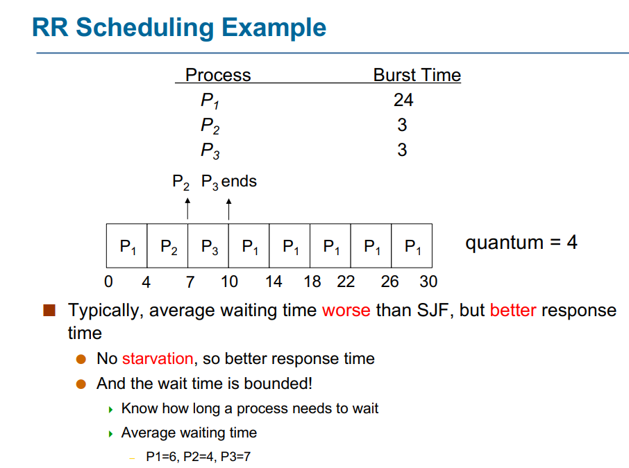

- 优点：response time 更短；no starvation, 即不会有进程被别的进程 block 住，总是会被执行
- 缺点：更长的等待时间

其中有一个 trade-off, 即 time quantum 的选取

- large quantum: longer response time
- short quantum: more context switch -> lower throughput

#### Priority Scheduling 

简单粗暴，谁优先级大就谁先做。注意到 SJF 其实也是一种 priority scheduling

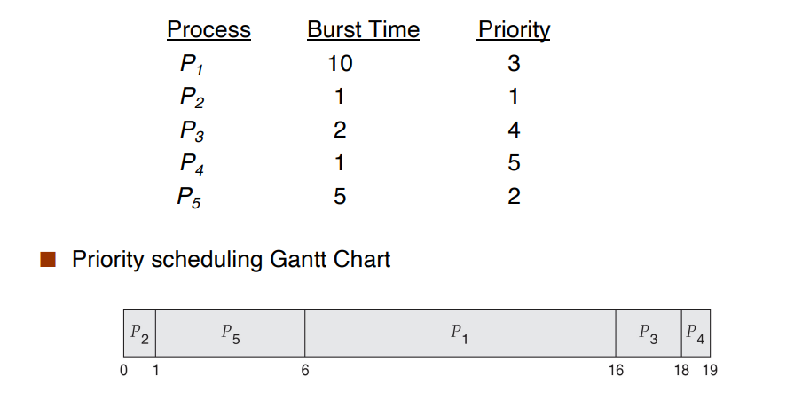

priority scheduling with round robin, 就是如果优先级相同，就使用 RR

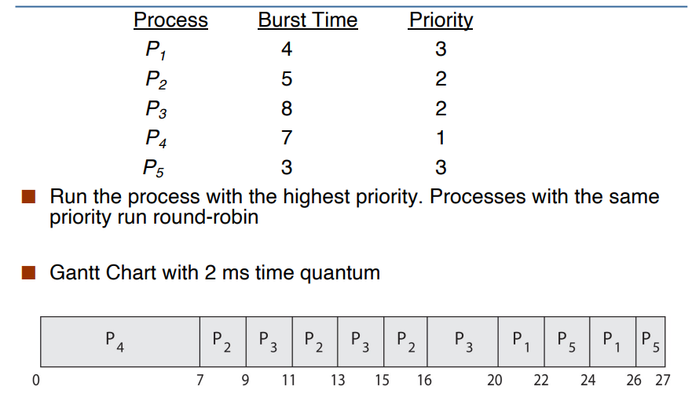

问题：starvation

Textbook anecdote/rumor: “When they shut down the IBM 7094 at MIT in 
1973, they found a low-priority process that had been submitted in 1967 
and had yet to run.”

#### Multilevel Queue Scheduling

也有 priority 的概念，但是用 multiple queue 来实现

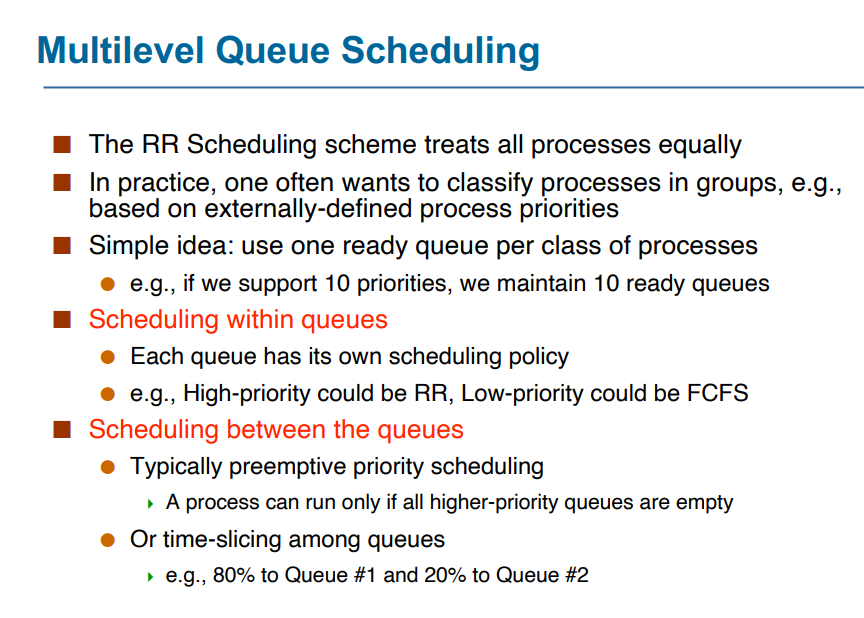

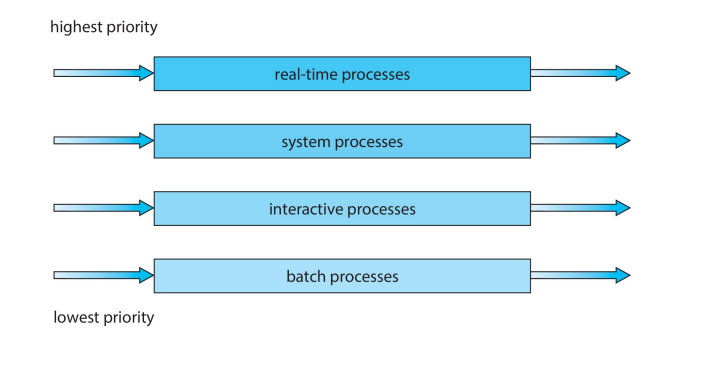

#### Multilevel Feedback Queue Scheduling

不同的 queue 之间可以互相隔离，也可以互相转移。比如下面的例子，如果一个 process 在第一个 queue 中执行并未结束，则可以大致认为它是 CPU bound 的，放入低优先级的 queue；如果它在第二个 queue 中仍未执行完，则放入更低优先级的第三个 queue

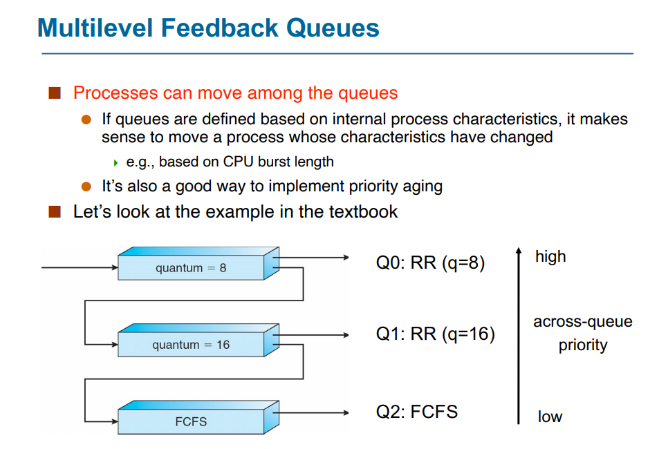

(to be continued)

## 后续

**后面就没有听课了，都是期末考之前速成的，所以这份笔记大概也算是废了。**

### 补天参考

1. [博子复习课](https://classroom.zju.edu.cn/livingroom?course_id=52800&sub_id=1027202&tenant_code=112&sub_public=1)：但是智云容易抽风
1. [咸鱼暄的速成课](https://space.bilibili.com/18777618/channel/collectiondetail?sid=801384)：和笔记是配套的，可以参考
1. [咸鱼暄的提纲 & 笔记](https://xuan-insr.github.io/%E6%A0%B8%E5%BF%83%E7%9F%A5%E8%AF%86/os/15_review/)
1. [修佬的笔记](https://note.isshikih.top/cour_note/D3QD_OperatingSystem/Unit2-Part1/#%E7%AB%9E%E6%80%81%E6%9D%A1%E4%BB%B6)：写的相对更多，但是文字会更亲切易懂一点，感觉更适合用语言形式表述而不是文字形式
1. hjh 的 A4 纸：可以作为提纲，但有很多没用的东西，有些补充的也可以再加上去
1. jjm 的小测和练习题 & 博子的作业题 & 两份不知来源的练习题 & 2020 的期末考回忆：优先刷 jjm 的题，作为出卷人更有参考价值
1. [jjm 的复习课](https://classroom.zju.edu.cn/livingroom?course_id=54447&sub_id=1026918&room_id=442&tenant_code=112&sub_public=1) & 说是看过试卷的老师 xyj 划的重点
1. [21-22 OS 回忆卷](https://www.cc98.org/topic/5236920)
1. [22-23 OS 回忆卷](https://www.cc98.org/topic/5507220)

### jjm 复习课的考纲

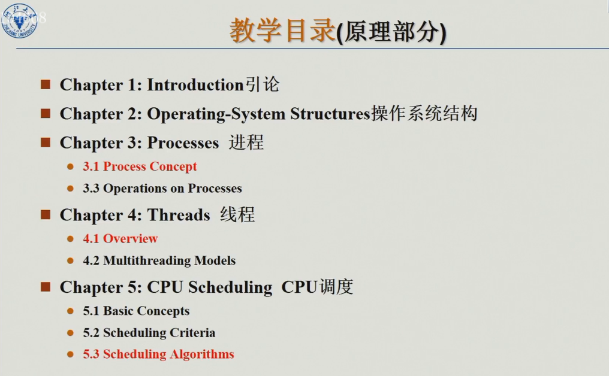
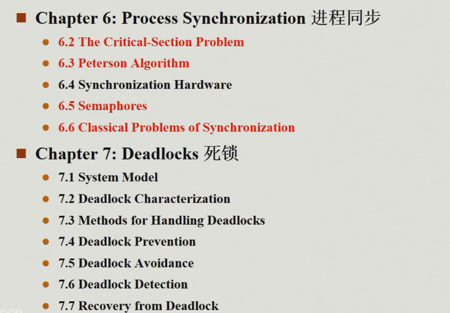
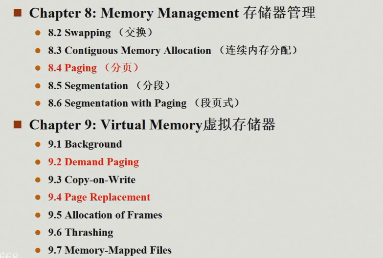
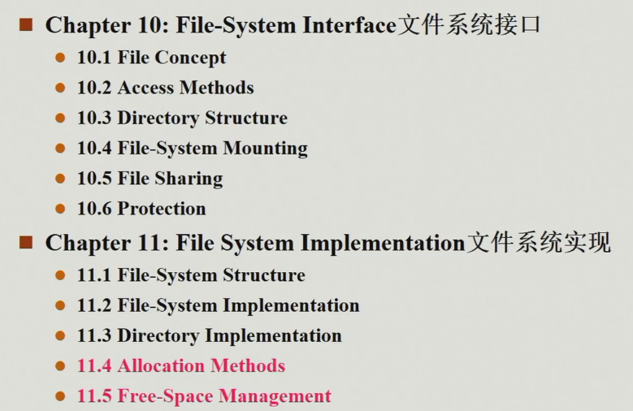
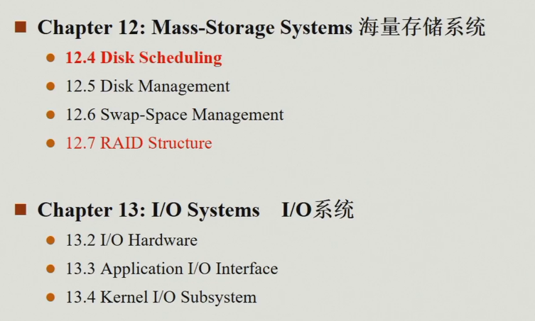

1. 四组算法：CPU scheduling 的算法，page replacement 的算法，disk allocation 的策略，free space management 的算法
	- 需要找几个题练练手
	- 需要整理到 A4 纸上去
1. 博子说四个大题的考点：scheduling，synchronization，memory，file system

### jjm 作业小测查漏补缺

#### test 1

1. The context-switch causes overhead by OS. The action affects many objects, but      is not included. 
	- global variable
	- memory
	- 选择 global variable，意思应该是没有修改全局变量，但是 PCB 是在 memory 上的，所以 memory 算是被影响了
1. 若⼀个⽤户进程通过read系统调⽤读取⼀个磁盘⽂件中的数据，则下列关于此过程的叙述中，正确的是___。
	Ⅰ. 若该⽂件的数据不在内存，则该进程进⼊等待状态
	Ⅱ.请求read系统调⽤会导致CPU从⽤户态切换到核⼼态
	Ⅲ. read系统调⽤的参数应包含⽂件的名称
	- 第三项注意，虽然不记得 read 的具体参数是什么，但是系统调用还包含文件名就有点太扯了。实际上是用 buffer 地址加长度来标识要读的文件的

#### test 2

1. While a process is blocked on a semaphore's queue, it is engaged in busy waiting.
	- F
	- 为什么不在 busy waiting？busy waiting 的前提是占用时间片，但是在队列里的进程处于 waiting 状态，不算 busy waiting
1. Suppose a shared printer is printing my job currently.While the printer is in use, you seek to print your job. Under any of the modern OS’s which of the following events are likely to happen :
	- your job will be spooled for printing in the order it arrived
	- 意思是 FCFS 用的更广泛吧，新任务排队等待
1. Which of the following scheduling algorithms is based on time-sharing（分时）system?: 
	- Round-Robin scheduling
	- 什么是 time-sharing system？应该是指单核 CPU，把不同时间片分给不同进程来执行，所以需要 RR 来防止 starvation

#### test 3

1. A computer system has a device with n mutually exclusiveinstances. Three concurrent processes require 3,4 and 5 instances. To ensuredeadlock not to occur, what is the minimum number n?
	- 极端状态下：进程1(3台)：申请到2台，无法工作；进程2(4台)：申请到3台，无法工作；进程3(5台)：申请到4台，无法工作；所以只要有 10 台就肯定不会死锁
1. 总体上说，请求分页(demand-paging)是个很好的虚拟内存管理策略。但是，有些程序设计技术并不适合于这种环境。例如，_________。
	- 二分法搜索
	- 按需调页被提出的前提是程序运行的局部性原理。不需要的页会被替换成需要的页。对二分法来说反而会增加磁盘 IO 的次数
1. 时钟（CLOCK）置换算法
	- FIFO 和 SCR(second chance replacement) 的改进
	- 当内存中无对应数据时，访问位为0即可置换之后再变换访问位，访问位为1不置换仍然变换访问位然后指针下移。
	- 当内存中有对应数据时，对应数据访问位改写为 1，指针不变

#### test 4

1. Consider a file system on a disk that has both logical and physical block sizes of 512bytes. Assume that the information about each file is already in memory.Suppose we use indexed allocation and are currently at the 10th logical block.If we want to access the 3rd logical block, how many disk blocks should we access? 
	- already in memory，所以不需要 disk IO 了
1. Contiguous allocation of files is not good for files that change in size because:
	- the files need to be moved around when they grow in size.
	- 连续分配，链表分配，索引分配，是 file allocation 的三种策略，考虑的是怎么把文件分配到磁盘的 block 上去
1. 下列选项中，可能导致当前进程 P阻塞(等待)的事件是
	Ⅰ.  进程 P申请临界资源
	Ⅱ. 进程 P从磁盘读数据
	Ⅲ.系统将 CPU 分配给⾼优先权的进程
	- 注意区分 waiting 和 ready！CPU scheduling 之后进程会到 ready queue 里面，而不是 waiting queue
1. 下列优化⽅法中，可以提⾼⽂件访问速度的是（    ）。
	Ⅰ. 提前读                                      Ⅱ. 为⽂件分配连续的簇
	Ⅲ. 延迟写                                    Ⅳ.采⽤磁盘⾼速缓存
	- 全部都是
	- 需要注意第二条，同一个文件分配在连续的区域里，又因为程序运行也有局部性，会频繁访问相近的块，seeking time 就减少了
1. 下列选项中，可⽤于⽂件系统管理空闲磁盘块的数据结构是
	I. 位图                Ⅱ. 索引节点       Ⅲ. 空闲磁盘块链    Ⅳ. ⽂件分配表(FAT)
	- 答案是 1 3 4
1. 若多个进程共享同⼀个⽂件F，则下列叙述中，正确的是（    ）。
	- 各进程只能⽤“读”⽅式打开⽂件F
	- 这句话是错的。虽然不能同时有两个进程读和写同一个文件，但是一个文件可以被两个进程分别以读和写的方式打开，只是说要尽可能避免这种情况就是了


## lab 记录

### lab0

之后有空看看：

1. [计算机教育中缺失的一课](https://missing-semester-cn.github.io/)
1. [100个gdb小技巧](https://wizardforcel.gitbooks.io/100-gdb-tips/content/)

### lab1

#### 内核引导

RISCV 汇编入门参考：

1. [常见寄存器 + 栈指针操作](https://blog.csdn.net/m0_62730135/article/details/126799687)
1. [汇编指示符 + 伪指令 + 内核启动的例子](https://lgl88911.github.io/2021/02/28/RISC-V%E6%B1%87%E7%BC%96%E5%BF%AB%E9%80%9F%E5%85%A5%E9%97%A8/)

编译命令：

1. `make all`: 编译
1. `make run`: 运行内核
1. `make debug`: 可以使用 gdb 远程调试，参考 lab0

#### 时钟中断

RISCV CSR 参考：

1. [CSR 名字 & 各比特介绍](https://blog.csdn.net/Pandacooker/article/details/116423306)
1. [CSR 指令作用介绍](https://blog.csdn.net/humphreyandkate/article/details/112941145)

有不明白的命令可以直接在手册里搜索，比如 rdtime

[RISCV 调用 C 函数](https://zhuanlan.zhihu.com/p/261294574)

#### 其他

之后有空看看：

1. [跟我一起写 Makefile 吧](https://seisman.github.io/how-to-write-makefile/introduction.html#id1)

### lab2

[riscv ISA 速查](https://msyksphinz-self.github.io/riscv-isadoc/html/index.html)

