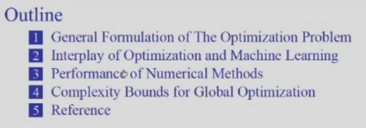
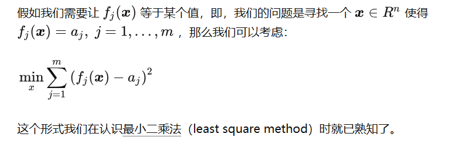

# 优化

[TOC]

## week 1 intro

参考资料：

1. 智云在这里 [网址](https://classroom.zju.edu.cn/livingroom?course_id=53564&sub_id=917363&tenant_code=112&sub_public=1)
1. ppt
1. [贺老师的专栏](https://www.zhihu.com/column/c_1676006565717573634)
1. [第二节智云的前 13 分钟串讲了第一节课的内容](https://classroom.zju.edu.cn/livingroom?course_id=53564&sub_id=917365&tenant_code=112)

讲了这些东西：

1. 首先讲的是优化问题的一般形式，然后对优化问题进行了几个维度的分类，最后举了几个实例。 x 是变量，即函数的参数，例如 $y=x_1a+x_2$，a 和 y 才是自变量和因变量
1. 优化和机器学习的关系
1. 数值方法的性能

## 期末

速成的话贺老师博客和 ppt 结合看就行了，重点是光滑优化和凸优化基础，对定义和性质有基础的了解就差不多了。然后有基础知识之后去做论文翻译作业，除了证明之外的大头还是很容易看懂的，证明我估计我把整门课都认真学完了也看不懂所以直接放弃。