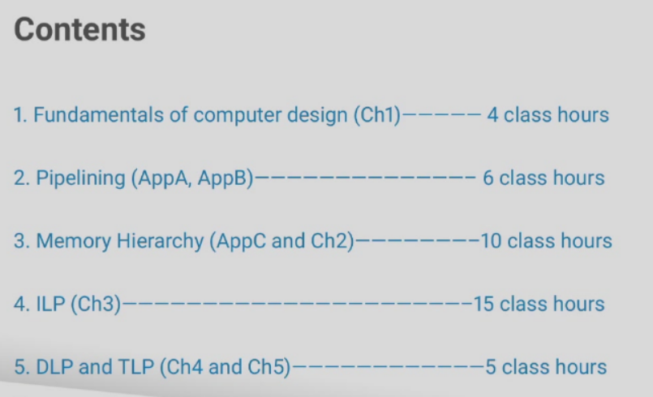
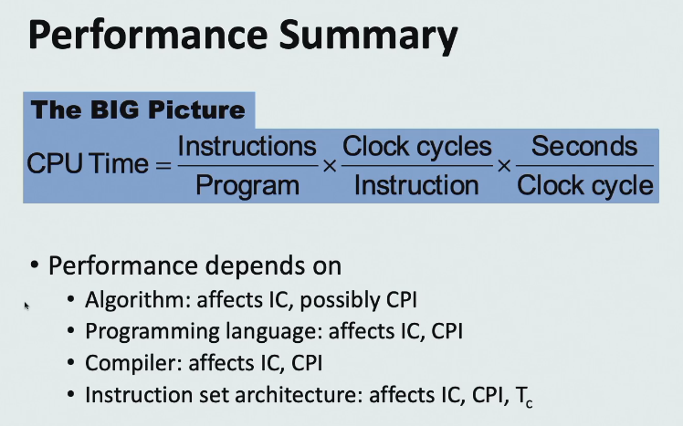
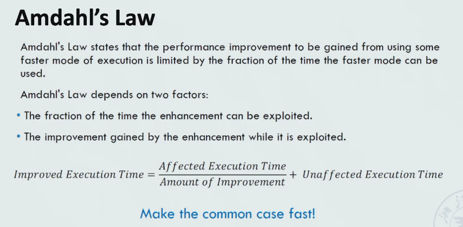
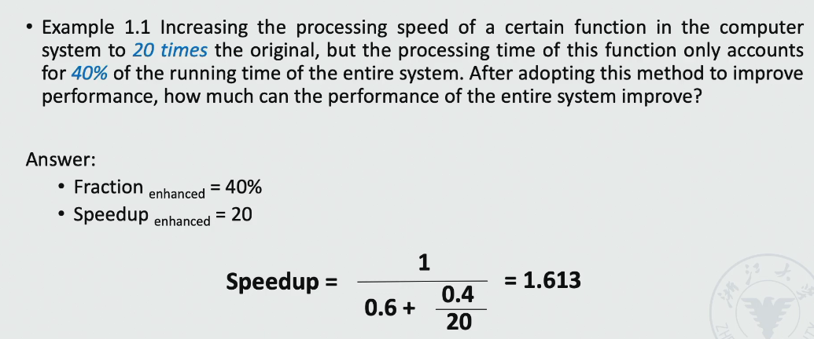
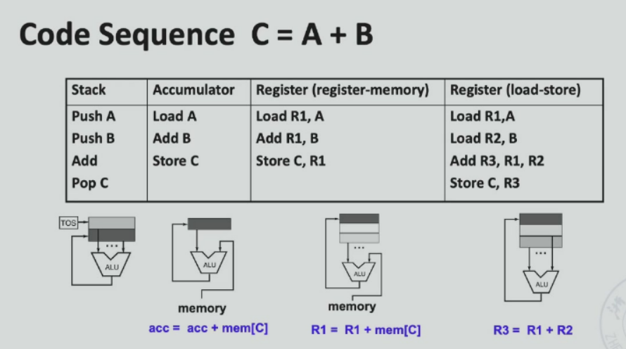
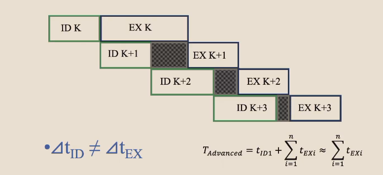
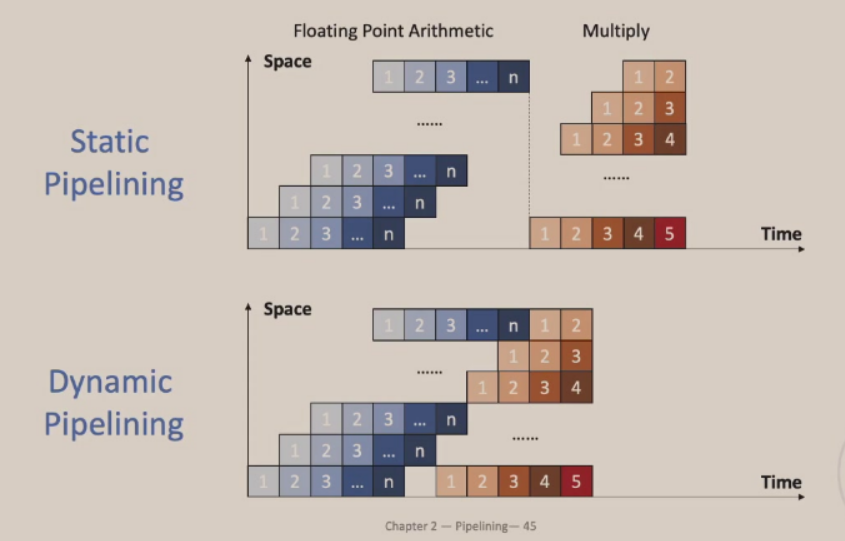

# 体系结构

[TOC]

## week1 intro

1. 分数构成
    - 期末考 40%
    - 平时分 60%
        - 作业 6%
        - pre 6%
        - Project 48% [实验文档](https://zju-arch.pages.zjusct.io/arch-fa23/)
1. 课程内容 

## week2

### part 1 Performance

主要讲的内容，量化研究方法 quantitative approaches。其中主要讲两个公式：cpu 性能公式 + 阿姆达尔公式

1. cpu 性能公式和计组里讲的一样，注意三个影响因素 Instruction Count, Clock cycle Per Instruction 和 Clock Rate 

2. 一句话概括 Amdahl's Law: Make the common case fast。还有一个重要概念加速比，加速比与两个因素相关：局部加速比，加速部分占总时间的比例 

从 Amdahl 定律看整体加速的困难 

3. 八个重要的设计思想，和计组讲的一样。本课程重点关注的两点：处理器的并行 & 存储的结构。

### part 2 ISA

ISA = Instruction Set Architecture，是程序员能看懂的最底层的语言。

cr 姐姐的建议：一定要看 RISCV 的官方手册。可以看指令规范、操作数、寻址模式、特权等等，多看就知道该看什么了。

General Purpose Register 通用寄存器是 ISA 中重要的一部分，每个 ISA 设计的 GPR 数量也不一样。汇编程序有四种常见的结构，平常用的结构是 load-store 结构，但是其他结构也要了解。 

### part 3 Pipelining

流水线的性能评估？

主要思想：buffer

流水线的发展过程：

1. 单过程重叠：分三个阶段 IF, ID, EX，只有 IF 和 EX 重叠
1. 多过程重叠：IF 合并到 ID 中
1. 使用 buffer 平滑不同指令不同阶段之间的时间差异 

新概念：

1. 单功能流水线 & 多功能流水线
1. 多功能流水线又可以分成 静态流水线 & 动态流水线 
1. 线性 & 非线性 nonlinear：同一个部件是否使用多次
1. ordered & disordered 顺序和乱序：指令执行顺序不一样

### lab 1 

