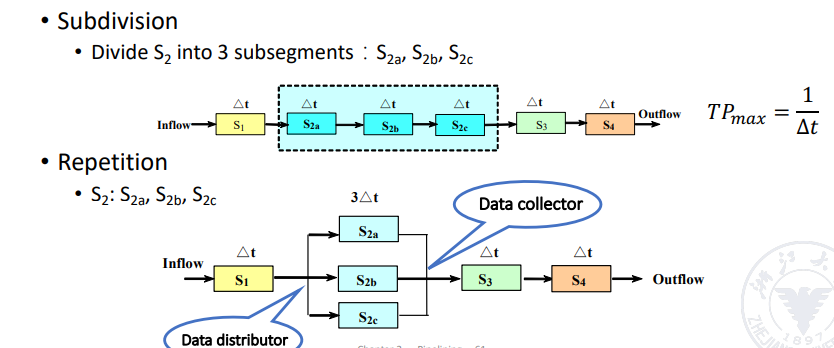
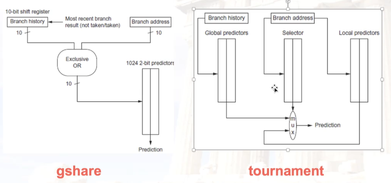

# 体系结构

[TOC]

## week1 intro

1. 分数构成
    - 期末考 40%
    - 平时分 60%
        - 作业 6%
        - pre 6%
        - Project 48% [实验文档](https://zju-arch.pages.zjusct.io/arch-fa23/)
1. 课程内容 
    1. Fundamentals of computer design (Ch1)————— 4 class hours
    2. Pipelining (AppA, AppB)—————————————– 6 class hours
    3. Memory Hierarchy (AppC and Ch2)———————–10 class hours
    4. ILP (Ch3)—————————————————————–15 class hours
    5. DLP and TLP (Ch4 and Ch5)————————————5 class hours

---

主要是概论，介绍体系结构这个学科学什么 & 研究什么。

冯诺依曼结构：程序 = 数据

## week2

### part 1 Performance

主要讲的内容，量化研究方法 quantitative approaches。其中主要讲两个公式：cpu 性能公式 + 阿姆达尔公式

1. cpu 性能公式和计组里讲的一样，注意三个影响因素 Instruction Count, Clock cycle Per Instruction 和 Clock Rate 

2. 一句话概括 Amdahl's Law: Make the common case fast。还有一个重要概念加速比，加速比与两个因素相关：局部加速比，加速部分占总时间的比例 

从 Amdahl 定律看整体加速的困难 

3. 八个重要的设计思想，和计组讲的一样。本课程重点关注的两点：处理器的并行 & 存储的结构。

### part 2 ISA

ISA = Instruction Set Architecture，是程序员能看懂的最底层的语言。

cr 姐姐的建议：一定要看 RISCV 的官方手册。可以看指令规范、操作数、寻址模式、特权等等，多看就知道该看什么了。

General Purpose Register(GPR) 通用寄存器是 ISA 中重要的一部分，每个 ISA 设计的 GPR 数量也不一样。汇编程序有四种常见的结构，平常用的结构是 load-store 结构，但是其他结构也要了解。 

### part 3 Pipelining

流水线的性能评估？

主要思想：buffer

流水线的发展过程：

1. 单过程重叠：分三个阶段 IF, ID, EX，只有 IF 和 EX 重叠
1. 多过程重叠：IF 合并到 ID 中
1. 使用 buffer 平滑不同指令不同阶段之间的时间差异 

新概念：

1. 单功能流水线 & 多功能流水线
1. 多功能流水线又可以分成 静态流水线 & 动态流水线
    - 静态流水线：必须一个功能不再占用资源了才能做下一个
    - 动态流水线：可以交叉
    
1. 线性 & 非线性 nonlinear：同一个部件是否使用多次
1. ordered & disordered 顺序和乱序：指令执行顺序不一样

## week 3

### pipelining(cont.)

#### part 1 pipeline performance

##### 1. 吞吐量

吞吐量 = 指令数 / 总时间

TPmax 和实际的 TP 之间的关系

瓶颈(bottleneck) 就是流水线中延迟最大的段。瓶颈对吞吐率的影响

瓶颈的解决办法：
1. 细分
1. 并行

并行的时序图，看起来跟原本常识中还是有一定的差异的，实现起来应该也稍微麻烦一点。

##### 2. 加速比

加速比 = 加速前的时间 / 加速后的时间

##### 3. 效率

从计算机固件的角度看，流水线处理过程中，计算资源被占用的时间

在时序图中看，就是被色块覆盖的块面积 / 时空总面积

##### 举个例子：向量点积

`Vector A(a1,a2,a3,a4)` 点乘 `Vector B(b1,b2,b3,b4)`

使用静态双功能流水线 (static dual function pipeline)，注意“静态”的含义

如果是动态流水线，并且已知每个段的延迟

##### Discussion: 流水线段数？

当每段的时间过于小的时候，用于实现流水线的硬件带来的开销就不能忽略不计了。

#### part 2 pipeline hazard

##### dependecies

1. data dependencies

---

2. name dependencies

指令相关性是程序的固有属性，**可能**会造成数据冲突。

name dependencies 在顺序流水线中没有问题，在乱序流水线中才会出问题。

显然不相关但用了同样的寄存器，可以用重命名的方法解决。重命名可以由程序员、编译器，或者执行器完成。

---

3. control dependencies

分支跳转导致的下一条指令 PC 的不确定。在程序执行中出现的非常频繁

##### hazard

hazard 分为三种：

在 Data Hazard 中，又分为三种情况。在乱序中需要考虑，所以才提出这几个分类，顺序流水线中不用考虑后两种：

调度是乱序的前身。这里的调度是编译器做的事情，是**静态**的，把没有冲突的指令提前到前面来做，可以减少几个 stall 的时间。

注意**静态**和**动态**之间的区别。

分支预测试解决 control hazard 的方法，分为静态和动态两种。虽然静态的不怎么讨论，但是静态也可以根据人类智慧设置各种策略来提高准确率。

曾经有一种类似静态分支预测的结构，delay slot，就是如果 branch hazard 造成 stall 了，就挑一条指令来把这段 stall 的填上。但是在动态分支预测准确率提升，以及多发射等方法出现之后，delay slot 慢慢就变成累赘所以就去掉了。

##### Dynamic Branch Prediction

Branch History Table (BHT): 有 1-bit 和 2-bit

Branch Target Buffer (BTB)，设计思路类似于快表(TLB)

把 BHT 和 BTB 结合起来，处理流程就是

可以参考 lab 3

## 期末复习

### crjj 的复习课

takeaway:

1. 8 Great Ideas
1. trade-off!
1. ISA 设计原则

考试复习：

1. CPU 性能公式 & Amdahl's Law（肯定会考）
1. ISA 的类型（例如 load-store 类型）
1. pipeline hazard 及其解决方法 & 软流水
    - WAW
    - RAW
    - WAR
    - name dependency: 怎么重命名
1. memory hierarchy（综合题，肯定会考）
    - 存储结构的四个问题: block placement, block identification, block replacement, write strategy（选择题）
    - cache 性能分析: AMAT(average memory access time), 怎么改进(reduce miss rate, reduce miss penalty, reduce hit time)（选择题）
    - cache 设计: mapping rules, access method, replacement algo, write strategy
    - virtual memory: page table walk 类似操作系统
    - TLB 的结构
    - address translation: TLB 怎么差查，L1 cache 怎么查，怎么转换物理地址，L2 cache 怎么查
1. 乱序 or 动态调度 or ILP(instruction level parallelism)（肯定会考）
    - scoreboard
    - Tomasulo: 通过保留栈完成重命名
1. DLP(data level parallelism) & TLP(thread level parallelism)
    - SISD(single instruction stream & multiple data stream)
    - SIMD: 向量运算
    - MISD
    - MIMD: 概念需要关注
        - cache consistency
        - cache coherence 缓存一致性协议，目的是保持缓存和内存(cache & main memory)的一致
            - NUMA 上的 directory protocol
            - UMA 上的 snoopy coherence protocol
        - cache 架构
            - UMA = SMP(symmetric (shared-memory) multiprocessors)
            - NUMA = DMP(distributed shared-memory multiprocessors)

### ILP

重点：

- scoreboard: [博客](https://zhuanlan.zhihu.com/p/496078836)
    - RO 阶段结束之后改写 Rj 和 Rk
- tomasulo: [博客](https://zhuanlan.zhihu.com/p/499978902)
- tomasulo + ROB: [博客](https://zhuanlan.zhihu.com/p/501631371)
    - 一旦指令进入 write 阶段，其他指令就可以得到他的 value。可以在被依赖指令进入 write 阶段的同时，依赖指令进入 exec 阶段
- (m, n) 预测器: [博客](https://blog.csdn.net/xiaowei_cqu/article/details/9455515)

---

不太重点：

- scoreboard with explicit rename
- 动态分支预测
    - (m, n) 预测器: [博客](https://blog.csdn.net/xiaowei_cqu/article/details/9455515)
    - tournament predictor: global + local + selector(也是一个分支预测器)
    - gshare 
    - tagged hybrid predictor

### TLP & DLP

重点：

1. MSI: [博客](https://blog.csdn.net/violet_echo_0908/article/details/78839692)
1. MESI: [前置知识，引入](https://cloud.tencent.com/developer/article/2197853)，[具体介绍](https://zhuanlan.zhihu.com/p/351550104)
1. MOSI: 看复习整理 pdf
1. MOESI: [博客](https://blog.csdn.net/luolaihua2018/article/details/129369336)
1. directory protocol: [博客](https://blog.csdn.net/luolaihua2018/article/details/129369336)