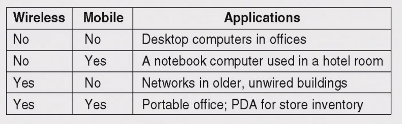
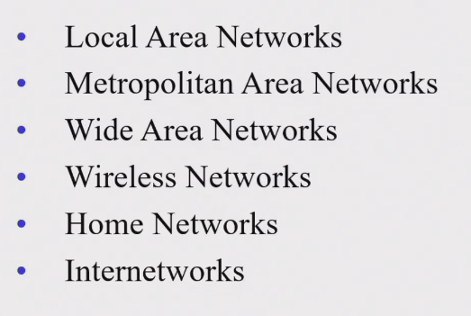
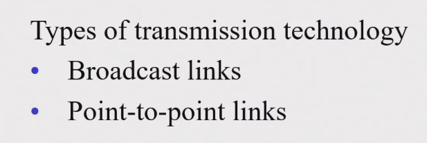
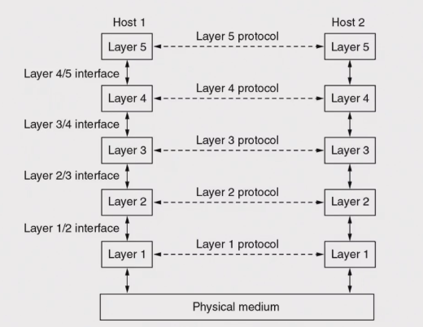
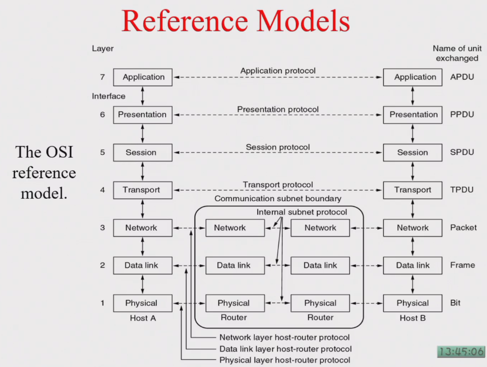
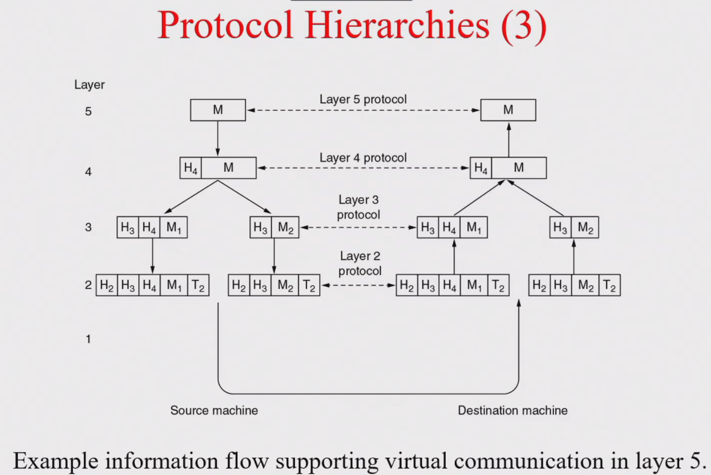
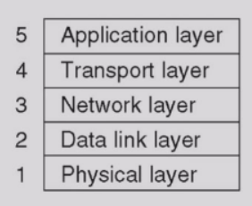
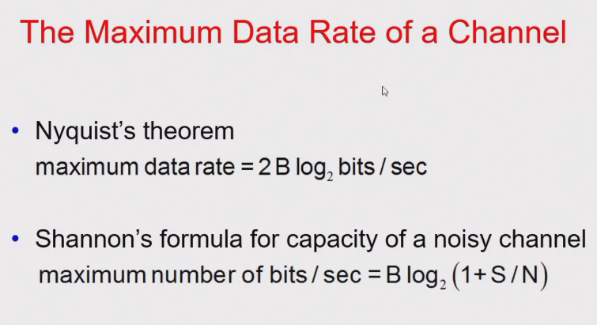

# 计网

[TOC]

## intro

1. 邮箱：huangzq@zju.edu.cn
1. 作业有专门的提交网站 [这个](http://10.214.0.253/network/exercise/)
    - 用户名是学号，密码是学号后四位

## Week 1

1. 历史：计算机 + 通信
1. 定义：自制的计算机系统之间的互联
1. 目的：共享资源 & 通信
1. 本质：请求 & 相应
1. 模型：
    1. Client-Server: 硬盘服务器 -> 文件服务器 -> application server
    1. peer-to-peer:

## Week 2

前情提要:

1. 网络使用者的分类：
1. 网络的第一种分类（按地理范围 + 技术）：
    - 传输技术：WAN 以点对点为主，LAN 使用广播为主 
    - 网络拓扑结构：LAN 有 bus, star, tree, ring；WAN 强调去中心化
1. 网络的第二种分类（按用途）
    - 边缘网
    - 接入网：宽带接入，无线接入（比如 wifi）
    - 核心网：数据中心网络，CDN(Content Delivery Network)
    - 转发网：运营商之间 transit
1. 网络的例子
    1. ARPANET
    1. Internet：分层次，无中心
1. 网络协议 protocol
    - protocol hierarchies: 分层次 
    - the OSI reference model 
        1. physical 物理层：目的是将不同的物理介质转换为统一的比特流
        1. data link 数据链路层：在物理上直接相邻的两个节点之间，给网络层提供面向帧的、基本无错的服务。有了数据链路层之后相邻节点就能以帧为单位通信。
        1. network 网络层：目的是不直接相连的两个节点之间可以通信，功能有路由选择、转发 or 中继、网络互联
        1. transport 运输层：提供端对端的通讯方式，可以避免经过通信子网
        1. session 会话层：管理通讯模式（单工、双工、半双工），同步点管理（将会话分段）
        1. presentation 表示层：抽象语法和传送语法之间的转化（垂直方向 & 水平方向），例如传输数据大小端的选择、浮点数的表示方式，解决不同计算机之间“异构”的问题
        1. application 应用层：例如 http, ftp, smtp
        - 一般来说，下三层叫低层，与通讯相关；上四层叫高层，与 N2N 通信有关
        - 明确了三个概念：service / interface / protocol

---

本节内容之一，绪论：

1. 继续讲网络协议体系结构，在发送包过程中各个层对包进行的修改 
    - 新概念：协议栈
1. 计网需要考虑的其他技术：
    1. Addressing
    1. Error Control
    1. Flow Control
    1. Multiplexing 多路
    1. Routing
1. 两个重要概念
    - connection-oriented 面向连接的通信过程：连接的建立 + 数据传输 + 连接的释放。建立连接之后可以重复发送信息，就像电话打通了可以说很多话。
    - connectionless 无连接：类比邮局平信，每一封信都是独立的需要写明地址，每一封信可能走不同的线路；即只有数据通信阶段，且顺序不能保证。
    - 之后遇到网络结构，都需要判断他是面向连接还是无连接
1. TCP/IP: 以 TCP 和 IP 为主的一个协议组，ARPANET 使用 TCP/IP 体系结构，美国人开发的协议组，最终成功应用在互联网上。
    - 五个层次： 会话层和表示层并入应用层
1. 标准化，三个制定标准的主体：
    1. 电信公司
    1. 标准化组织：例如 ITU(international telecommunication union)，有 ITU-T 标准；ISO 国际标准化组织
    1. 互联网世界：W3C(world wide web cobnsortium)

---

本节内容之二，物理层：

总共有两块内容，

1. 数据通讯的理论基础
1. 物理层的连接

先讲第一块，通信的理论基础。

1. 数据通信方法
    1. 基带信号 baseband
        - 形状：方波信号
        - 傅里叶变换：物理介质导致信号传输有频率限制，比如 4000Hz 以上的分量无法传输，会导致传输信号形状不同。需要解决的问题就是仅用低频部分，让接收方能够区分 0 和 1。
    1. 脉冲通讯
1. 信号传输率理论 
    1. Nyquist 定理：**在无噪声环境下**，如果信号的最大频率是 B（最大频率受物理介质限制，跟上面说的是一样的），则每秒最多采样 2B 个**符号**，再多也表达不出来
        - 注意是符号而不是比特，一个符号是多少比特不确定，计算的是波特率，单位是波特或者 symbol/s
    1. 香农定理：在有噪声的环境下，最高频率 B，信噪比 S/N，可以得到每秒最多传输多少比特。由香农定理可知，提升传输速率有两条路径，提高信噪比或者提高带宽（例如扩频通信）

然后讲第二块，物理连接。物理连接有一些构成方式：

1. 最简单的物理连接，点对点用一根线连接，分析数据流动
1. 大宽带的光纤，单用户浪费，怎么多用户复用
1. 基于网络通信基础设施，运行物理层点对点应用

## Week 3

继续讲物理层，物理连接的构成方式的第一种，点对点直接连接：

简单来说，点对点连接可以有下面两种分类，电子 vs 光学，有线 vs 无线，所以至少就有四种线的分类

1. 电子 + 有线
    - 双绞线 twisted pair
    - 同轴电缆 coaxial cable，应用于有线电视
    - 电力线 power line，好处在于不用再额外布线，问题在于很难提高带宽
1. 光学 + 有线
    - 光纤 fiber cable。优点是抗干扰能力强，便宜。缺点是容易断，在中间插钢丝增强硬度。
        - 分类：单模 vs 多模。单模就是只能同时通一束光，多模就是多束光。单模的衰减更少一点
        - 光源：半导体激光器 vs LED
1. 无线
    - 电磁频谱
    - 微波。视距通讯，是有方向的通信。微波接力，通常 50 公里一个基站。容易受天气的影响，