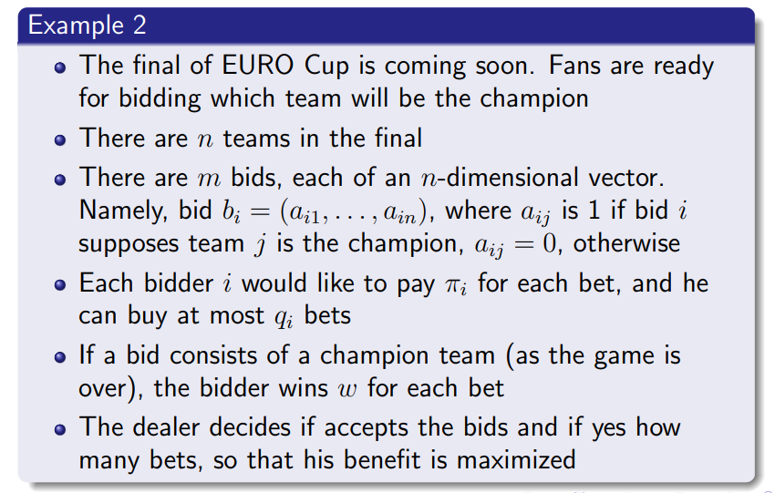

# 运筹学

[TOC]

## note

### week 1 Intro

参考哪些资料补课：

1. [去年的智云](https://classroom.zju.edu.cn/coursedetail?course_id=46028&tenant_code=112)
1. 主要看去年的智云 + 去年的 ppt + 今年助教发的笔记
1. [某个大佬的博客](https://bebinca.github.io/)：除了运筹学之外还有 OS 和 CV 的复习整理

---

主要讲了哪些内容：

1. 运筹学研究的方向 
1. 课程任务要求 
    - 期末联系 50%
    - 作业 20%
    - 课堂表现 10%
    - 论文选读 + 课程报告 20%：分组完成，论文池选读，写报告，可 pre
    - presentation 10% bonus
1. 复习一下 ADS 的内容：language problem instance 可计算之类的概念，还有 P 和 NP，证明 NPC 问题
1. 组合优化：基础可行解集是有限的，哈密尔顿圈是组合优化
    - 离散优化：包含整数规划 & 组合规划
1. 局部最优 vs 全局最优，邻域 & 精确邻域，证明最小生成树换一条边是精确邻域

### week 2 Linear Programming

参考哪些资料补课：

1. [前年的智云](https://classroom.zju.edu.cn/livingroom?course_id=30673&sub_id=449256&tenant_code=112)
1. 主要看前年的智云 + ppt + 助教笔记

主要讲了哪些内容：从优化问题到线性规划（从抽象到具体）

1. 优化问题基本模型 
1. 先从最简单的线性规划开始考虑 
    - 证明线性规划只需要考虑有限个点上的可行解，就可以把线性规划转化为组合优化问题
1. 再从最简单的局部最优开始考虑
    - 邻域的定义和例子。邻域是一个可行集到可行集的幂集的映射，同一个可行集上可以定义多种不同的邻域。最小生成树的一种邻域是，加一条边成环，再在环上去掉一条边生成的新树的集合。 
    - 局部最优，全局最优，精确邻域的定义 
1. 补充一点凸优化相关的定义，线性规划是特殊的凸规划
    - 凸组合和凸集的定义。凸组合就是两点连线段。凸组合的概念可以拓展到 n 个点，就是 n 个点带权求和，系数之和为 1。凸集合满足任意两点的凸组合仍在集合内。线性规划的可行集是凸集。 
    - 凸函数的定义 
        - 定义在凸集上，凸组合的函数值不超过函数值的凸组合，就是凸函数
        - 凸函数的支撑集是凸集（显然？）
        - 同理可以定义凹函数，函数的相反数是凸函数的，就是凹函数
        - 线性函数同时是凸函数和凹函数。线性规划是一种特殊的凸规划
    - 凸规划 
        - 凸规划就是在凸集上 **最小化** 一个凸函数。如果要最大化的话就得是一个凹函数。
        - 凸函数的支撑集是凸集这个性质可以用于定义可行集
        - 性质：凸规划有精确邻域（局部最小等于全局最小） 
        - 线性规划是一种特殊的凸规划
1. 正式开始讲线性规划
    - LP formulation 
    - 用矩阵乘法的形式表达 
    - 再举个例子。在这个例子中关注怎么把实际问题写成优化的形式，如何把非线性规划转化成线性规划的形式
        - 本题的策略是最保守的策略，要求在最坏条件下收益最好，所以式子里有个 max 
        - 如何把非线性的 max 去掉？方法是引入一个新的变量 y，让他大于取 max 的所有项 
    - 再举个例子。工作台和钻头分别只能水平移动和垂直移动，且速度恒定。怎么规划路线能最快完成打孔任务。因为每两个点之间的最优路线都可以贪心地决定，所以相当于在一张完全图上做旅行商问题。 
    - 再举个例子：最大流。从终点到起点连一条虚拟边，则虚拟边上的流量就是总流量，即优化目标 

---

开始讲另一部分：线性规划的单纯形法，重新发现二十世纪十大算法之一

1. 线性规划基本模型 
    - 如何把小于等于号的形式转化为等号的形式？引入松弛变量，$x_1+x+2\leq 10$ 转化为 $x_1+x_2+y=10, y\geq 0$
1. 线性规划基本原理
    - 极点的定义：凸集中的点，不是凸集中任意两个 **不同** 点的 **严格** 凸组合（严格凸组合就是线段去掉端点）
    - 线性规划的最优解一定在极点处取得。使用反证法（不严格的证明），如果最优解 x 能用其他两个不同的点 y 和 z 严格凸组合得到，根据凸函数的性质，凸组合的函数值不超过函数值的凸组合，所以 y 和 z 必须也是最优解。x, y, z 的直线可以一直延伸到凸集边界，最终找到一个极点。
    - 基本原理的代数表达 
        - 前提假设：假设有 n 个变量，m 个约束（方程）。假设 m 小于等于 n，否则一定有冗余的方程，假设我们已经处理过了。
        - 如何得到基可行解？从 n 个列中挑出线性无关的 m 个，组成基矩阵。这个满秩的矩阵构成的方程一定有唯一解，如果这个解 **满足非负条件**，就是基可行解。
        - 基可行解的数量：最多 $C(n, m)$ 个
1. 单纯形法
    - 性质：因为线性规划是一种凸优化，所以可以局部搜索 local search，找到局部最优就是全局最优。

## week 3 线性规划基本原理 & 单纯形法

这节课上了，主要参考我的课程笔记

## week 4 单纯形表 & 对偶理论

参考：

1. ppt 强对偶定理的证明
1. week2 slides 单纯形表
1. [去年的第三节智云](https://classroom.zju.edu.cn/livingroom?course_id=30673&sub_id=449260&tenant_code=112)：包含强对偶定理的证明 + 对偶单纯形法
1. [去年的第二节智云](https://classroom.zju.edu.cn/livingroom?course_id=30673&sub_id=449256&tenant_code=112)：包含单纯形表

## week 5 对偶单纯形法 & 原始对偶方法

参考：

1. [今年的第五节智云](https://classroom.zju.edu.cn/livingroom?course_id=53067&sub_id=909290&tenant_code=112)：没声音，但是笔记可以参考这节课的板书
1. [去年的第三节智云](https://classroom.zju.edu.cn/livingroom?course_id=30673&sub_id=449260&tenant_code=112)：最后讲了对偶单纯形法
1. week 5 slides 对偶单纯形法
1. [去年的第四节智云](https://classroom.zju.edu.cn/livingroom?course_id=30673&sub_id=449274&tenant_code=112)：从开头开始讲原始对偶方法
1. week 5 slides 原始对偶方法

## week 6 整数线性规划

## week 7 ILP 基本算法 & LP-based 近似算法

1. [Gomory 割平面法](https://www.zhihu.com/tardis/zm/art/417036254?source_id=1005) 介绍了割平面法实际上是一个迭代算法，并给出了一个 Gomory 割平面法的例子

## week 8 原始对偶近似算法

- [前年的智云](https://classroom.zju.edu.cn/livingroom?course_id=30673&sub_id=449283&tenant_code=112)，包含原始对偶近似算法，主要在讲

## week 9 集合覆盖问题 + 贪心算法

- [前年的智云](https://classroom.zju.edu.cn/livingroom?course_id=30673&sub_id=449449&tenant_code=112)，讲贪心算法
- [前年的智云](https://classroom.zju.edu.cn/livingroom?course_id=30673&sub_id=449452&tenant_code=112)，从秩商分析式开始讲

## homework

### bonus 1 minimum spanning tree

参考资料：

1. [MST property & lemma](https://gtl.csa.iisc.ac.in/dsa/node182.html)
    - MST property: 最短边一定包含在至少一个最小生成树里。用反证法即可。
    - MST lemma: 如果一个边集是最小生成树的子集，就说这个边集 promising。对 promising 的边集缩点，在新图上选权值最小的边加入边集，新边集仍旧是 promising 的。用数学归纳法证明。

证明局部最优也有类似 MST property：局部最优一定包含至少一条边权最小的边

---

TA solution: 

