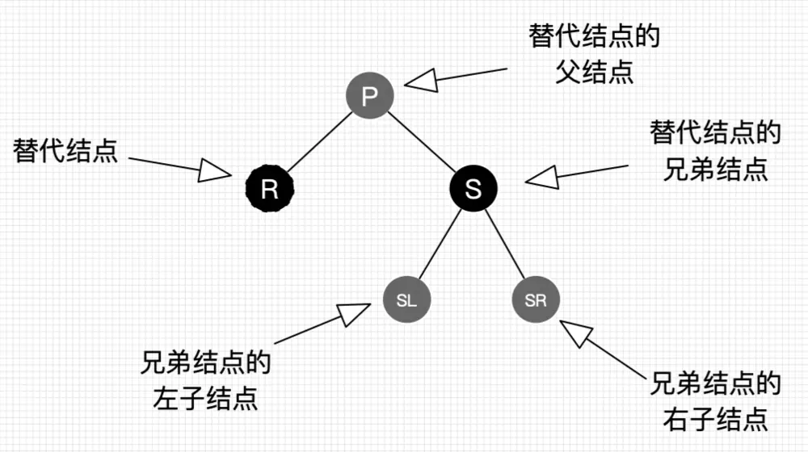
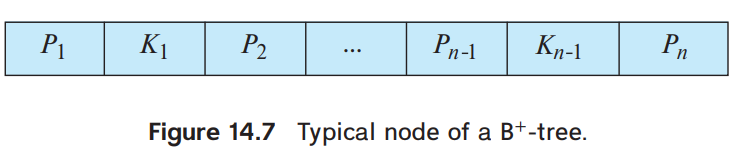
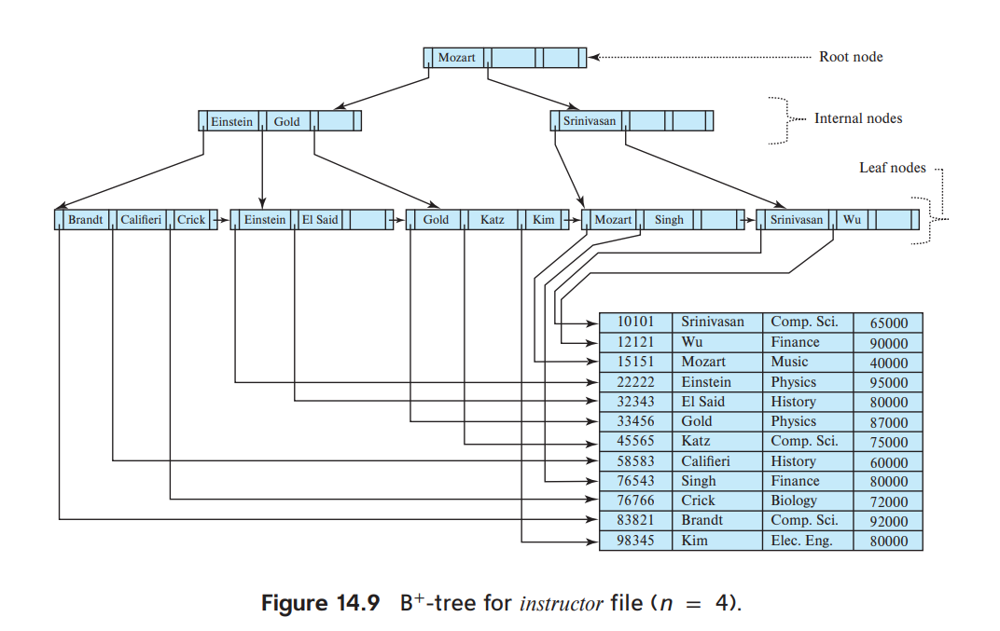
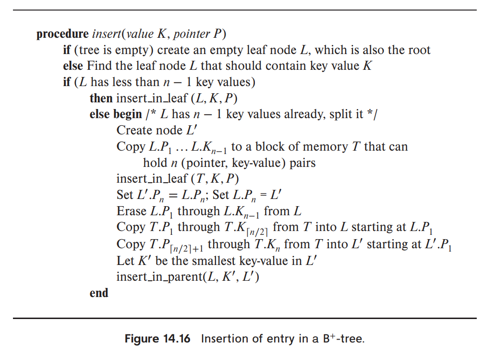
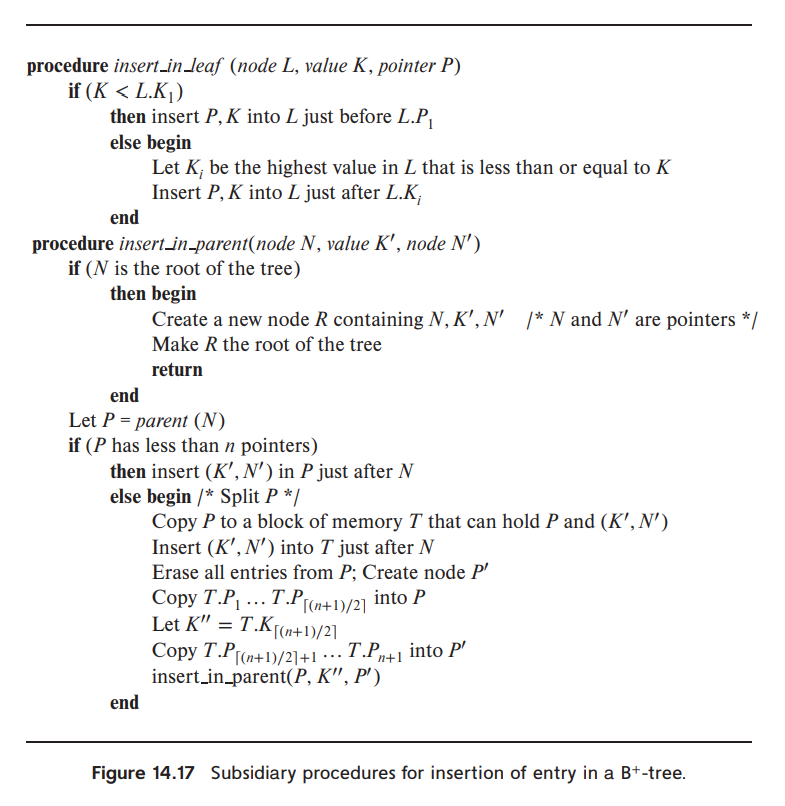
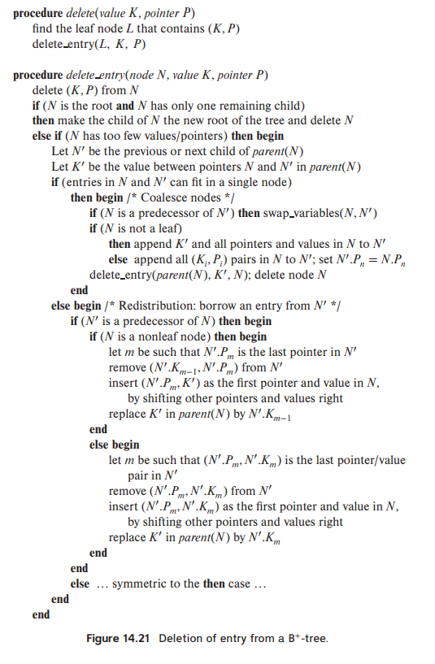
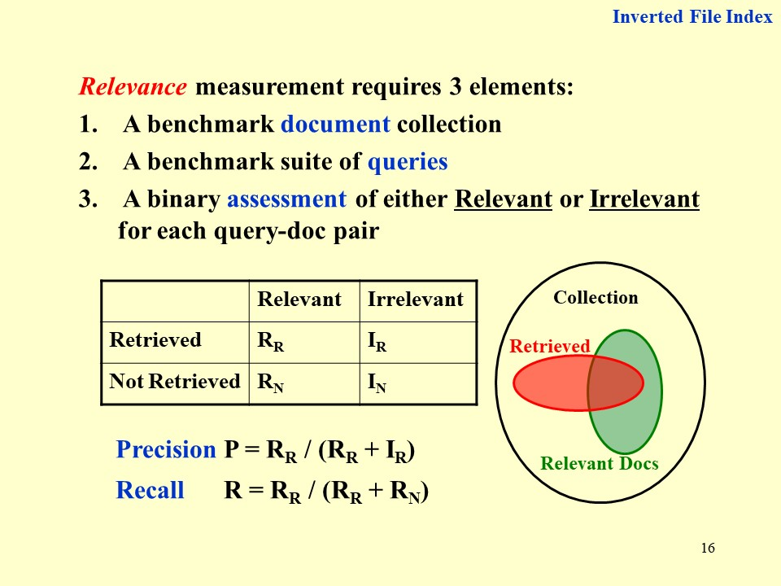

# 高级数据结构

[TOC]

## intro

1. 评分标准
    - Homework（作业） 10%
    - Discussion（讨论） 10%  
    - Research Project（大程） 30%
    - Mid Exam（期中）10%
    - Final Exam（期末） 40%
    - 期中的 10 分 = max(期中考卷面分, 期末考卷面分)
    - 平时分不能超过 60 分
2. project
    - Done in groups of 3
    - choose 2 out of 8 topics
    - Reports (14 points and 10 points, respectively)
    - In-class presentation (10~15 minutes, 6 points)
    - If there are many volunteers, at most 3 groups will be chosen to give presentations
    - For those groups not to give presentations, each will gain bonus points = report points / 10
3. Lab report
    - 模块：可以用 FDS 的模板，开头加一块 summary
    - 内容：图表(e.g. table of running time)需要注记和解读，伪代码需要自然语言解释
    - 报告：重点在于 project 中的发现，激情！
4. 参考资料
    - [Algorithms Visualization](https://www.cs.usfca.edu/~galles/visualization/Algorithms.html)

## AVL Tree

- 性质：递归地定义
- 高度：O(logn)，用斐波那契数列证明（令深度为 h 的 AVL）
- 每个节点记录：子树深度，balance value(左子树深度 - 右子树深度)
- insertion & rebalance
    - zig-zig: single-rotation，两个点旋转
    - zig-zag: double-rotation，三个点旋转
    - 证明：最多需要旋转一次。因为对 u 旋转之后 u 的深度和插入之前一样，再往上不需要修改子树深度和 balance value。
- deletion：也是旋转
    - 证明：最多需要旋转 O(logn) 次。即构造一个路径上每个节点都需要旋转的例子。 ==快来把这个写了==

e.g. Insert 2, 1, 4, 5, 9, 3, 6, 7 into an initially empty AVL tree. 把树画出来。

手算技巧：单旋就挑两个节点交换位置，双旋就挑三个节点交换位置，然后子树（单旋 3 个，双旋 4 个）按照原来从左到右的顺序挂在旋转的节点下面，不用模拟旋转过程，速度快很多。

e.g. 实现 AVL 树

1. 每个节点存 lson 和 rson，不用存 father。
2. 所有涉及到改变树结构的函数都返回子树根节点，否则指向子树的指针无法在子树内修改。
3. 用结构体表示节点，用指针构建树结构。新建节点不能用构造函数，需要在外部函数中 malloc。

e.g. 优化 first fit [装箱问题](https://blog.csdn.net/weixin_43886592/article/details/107581653)

维护一棵 BST，key 值为箱子编号，每个节点维护一个值，表示子树中节点的最大剩余空间。查找 O(logn)，更新 O(logn)

## Splay Tree

### 操作

把插入、查找的节点(x)都旋转到根

- x 的父亲是根：single-rotation
- x 有父亲(p)和祖父(g)
    - zig-zig：2 * single-rotation（先对 p 和 g 做单旋，再对 x 和 p 做单旋）
    - zig-zag：double-rotation

### 复杂度证明

> 参考资料： 1. [oi-wiki](https://oi-wiki.org/ds/splay/#splay-%E6%93%8D%E4%BD%9C%E7%9A%84%E6%97%B6%E9%97%B4%E5%A4%8D%E6%9D%82%E5%BA%A6)
> 2. 课程文件夹：Splay均摊分析_王灿.pdf

定义势能函数 $$\Phi=\sum_{i=1}^n \log S(i)$$

其中 $S(i)$ 是 $i$ 节点子树中的节点个数。想法是：势能得与树的高度有关，但是如果直白地用每个节点的子树高度当做势能函数，单次操作将会影响到

==还没写完==

## Amortized Analysis(均摊分析)

### aggregate analysis(聚类分析)

n 次操作的 worst-case 复杂度为 T(n)，则单次操作 worst-case 复杂度为 T(n)/n

e.g. multi-pop：一个栈，三个操作 push, pop, multi-pop（弹出 k 个元素）。n 个 multi-pop 的复杂度为 O(n)，1 个 multi-pop 均摊复杂度为 O(1)。

### accounting method(记账方法)

对不同操作赋予不同费用(amortized cost)，赋予某些操作的费用可能多于或少于其实际代价，但是总费用要求不小于实际代价。

摊还价值大于实际价值的部分叫 credit，可以看成往银行里存钱；摊还价值小于实际价值的部分会把 credit 取出来抵用。最后保证银行账户没有透支，则摊还分析的复杂度一定是实际复杂度的一个上界。

e.g. multi-pop: push 操作 2 费，pop 和 multi-pop 0 费。总复杂度最多 O(2n)=O(n)。

### potential method(势能分析)

给数据结构定义一个势能 $\Phi$ ，摊还代价等于实际代价加上第 i 次操作带来的势能变化 $$\hat{c_i}=c_i+\Phi(D_i)-\Phi(D_{i-1})$$

所以总摊还代价表示为总实际代价加上势能变化 $$\sum\hat{c_i}=\sum c_i+\Phi(D_n)-\Phi(D_0)$$

只要满足势能变化非负的条件 $\Phi(D_n)-\Phi(D_0)\geq 0$，就可以用摊还代价确定实际代价的上界。

e.g. multi-pop: 栈的势能定义为内部元素个数。所以摊还代价 push 2 费，pop 和 multi-pop 0 费。

#### e.g. Dynamic Table

情景：当表满了之后，新建一个 2 倍大的表并复制所有内容。当表只有 1/2 满时新建一个 1/2 大的表并复制所有内容。

设计 potential function 为两倍的当前表内元素个数，减去表的大小 $$\Phi=2T.num-T.size$$

初始状态 $\Phi$ 为 0，刚扩张表时 $\Phi$ 为 2，之后每插入一个元素 $\Phi$ 加 2。

首先，可以保证势能永远非负。

其次，对于不产生表扩张的操作，其摊还价值为 $$\hat{c_i}=c_i+\Phi(D_i)-\Phi(D_{i-1})=1+2=3$$

对于产生表扩张的操作，其摊还价值为 $$\hat{c_i}=c_i+\Phi(D_i)-\Phi(D_{i-1})=(1+2n)+2-2n=3$$

所以总复杂度为 $O(1)$

## Red-black Tree

[参考博客：简书 - 30张图带你彻底理解红黑树](https://www.jianshu.com/p/e136ec79235c/)

[wikipedia: 红黑树](https://en.wikipedia.org/wiki/Red%E2%80%93black_tree)

### 定义

- 二叉查找树
- 节点染红色或黑色，根黑色，external node 黑色
- 如果一个节点是红色的，他的儿子都是黑色的
    - 推论 *（不是基本定义）* ：不存在两个相邻的红节点
- 对于树上的任意节点 u，从 u 到以 u 为根的子树中的叶子的所有路径上，黑色节点的个数相同
    - 推论 *（不是基本定义）* ：如果一个结点存在黑子结点，那么该结点肯定有两个子结点

### 复杂度

- 定义：internal node 树上的实际节点，external node 虚拟叶子节点（空节点）
- 定义：uncle 节点为和父节点拥有同一个父亲的节点
- 定义：black height bh(x) 为从 x 到子树中任意叶子的路径上黑色节点个数
- Lemma：A red-black tree with N internal nodes has height at most 2ln(N +1).
    - 证明：若根节点 black height 为 n，则黑节点个数为 $2^n-1$，整棵树节点最少为 $N=2^n-1$。对于任意红节点，其父节点一定为黑节点，所以红节点个数小于等于整棵树节点数的一半，所以树深度最大为 $h=2n$。由此可以得出 $h_{max}=2\log_2(N+1)$

### 操作

#### 三种基本操作

- 左旋
- 右旋
- 变色

#### Insert

- 情景 1 空树：插入黑节点
- 情景 2 插入节点的父节点为黑节点：插入红节点
- 情景 3 插入节点的父节点为红节点
    - 推论：一定存在祖父，且祖父为黑色
    - 情景 3.1：uncle 存在并为红节点，父亲和 uncle 变黑，祖父变红，然后把祖父作为新插入的节点往上递归。如果祖父是根则直接把祖父变黑，**这是唯一一个会增加树的 black height 的操作**
    - 情景 3.2：uncle 不存在或为黑节点
        - 情景 3.2.1 zig-zig：把父亲变成黑色，祖父变成红色，做一次单旋
        - 情景 3.2.2 zig-zag：把插入节点变成黑色，祖父变成红色，做一次双旋

#### Delete

- 情景 1 删除节点没有儿子：直接删除，自平衡的情景包含在情景 2 中
- 情景 2 删除节点只有一个儿子：用儿子代替删除节点
    - 情景 2.1 删除节点是红节点：black height 不变，仍旧平衡
    - 情景 2.2 删除节点是黑节点（先假设删除节点是其父节点的左子结点，右子节点同理，只要把整棵子树对称过来看就行） 
        - 情景 2.2.1 S 是红节点
            - 性质 1：P 一定为黑节点
            - 性质 2：因为 P 的左子树中有至少 1 个黑节点（R），所以右子树中也至少有 1 个黑节点，所以 S 一定有儿子。因为 S 是红节点，只有一个儿子的情况不存在，所以 S 的左右儿子 SL SR 都为黑节点。
            - 操作：P 变红，S 变黑，对 P 做一次左旋。*整棵子树 bh 减一，需要继续向上迭代。*
        - 情景 2.2.2 S 是黑节点
            - 情景 2.2.2.1 SR 是红节点：S 变成 P 的颜色，P 变成黑色，SR 变成黑色，对 P 做一次左旋。*整棵子树 bh 减一，需要继续向上迭代。*
            - 情景 2.2.2.2 SL 是红节点 SR 是黑节点：SL 变成黑节点，S 变成红节点，对 S 进行一次右旋，转化为 2.2.2.1 的情景
            - 情景 2.2.2.3 SL 和 SR 都是黑色节点：直接把 S 变成红色。如果 P 是红色节点，则把 P 变成黑色；如果 P 是黑色节点，则 *整棵子树 bh 减一，需要继续向上迭代*，把 P 当做删除节点。
- 情景 3 删除节点有两个儿子：用后继节点代替删除节点，后继节点的右儿子代替后继节点（其中后继节点是右子树中权值最小的点，把后继节点换成前驱节点也一样）
    - **性质：在仅考虑树结构的情况下，替换操作相当于删除替换节点的操作**，所以情景 3 可以转化为情景 2

e.g. 空红黑树，依次插入 41; 38; 31; 12; 19; 8，下面哪个不对？

A.38 is the root
B.19 and 41 are siblings, and they are both red
C.12 and 31 are siblings, and they are both black
D.8 is red

#### 实现

- 节点存储结构：father, lson, rson, data, color
- 基础功能：
    1. 查找节点
    2. 查找后继节点
    3. 左单旋、右单旋、左右双旋、右左双旋
    4. 判断节点是其父亲的左儿子还是右儿子
- 插入删除功能：需要在上述细分情景的基础上再分左右

e.g. AVL Tree & red-black tree 插入、删除操作的最大旋转次数

## B+ Tree

### 定义

B+ Tree of order M：

- 根：是叶子，或者有 2 到 M 个儿子
- 非根非叶子节点：有 $\lceil \frac{M}{2}\rceil$ 到 M 个儿子
- 叶子节点：所有叶子深度相同

p.s. B+ tree of order 4 is called 2-3-4 tree, B+ tree of order 3 is called 2-3 tree.

M 的大小选择：

M = node size / (key size + pointer size)

node size 一般设置为 disk node 的大小，常见为 4kB。

### 树结构

树节点的作用：

- 非叶子节点：索引（子树中的最小值拿上来做索引）
- 叶子节点：存储权值（每个叶子 $\lceil \frac{M-1}{2}\rceil$ 到 M-1 个权值）*（ppt 上以及习题中：每个叶子 $\lceil \frac{M}{2}\rceil$ 到 M 个权值）*

树节点的结构：

1. M 个指针和 M-1 个键值。在非叶子节点，Ki 存 Pi+1 指向的子树中的最小键值。在叶子节点中，Ki 存 Pi 指向的文件的键值，PM 指向下一个叶子节点（便于对文件进行顺序处理）。
2. 指向父亲的指针

### 操作

[B 树和 B+ 树](https://www.cnblogs.com/nullzx/p/8729425.html)

1. 查找
    1. 单点查找
        - 操作：在节点内进行顺序查找（因为磁盘 IO 已经是线性的了，再用二分也改变不了复杂度）
        - 复杂度: 树深度 $O(\frac{\log N}{\log M})$, 总复杂度 $O(M\frac{\log N}{\log M})$
    2. 区间查找
        - 操作：用单点查找找到不小于查找下界的最小 key 值，然后向后做顺序查找。
2. 插入
    - 操作：
        1. 查找到叶子节点
        2. 如果节点中元素没有过多，则直接插入 key 值，否则在临时节点 T 中进行插入操作
        3. 如果节点内元素过多，则进行分裂操作
            - 叶子节点：如果节点内元素个数等于 M，把当前节点分裂成 $\lceil \frac{M}{2}\rceil$ 和 $\lfloor \frac{M}{2}\rfloor$ 两个节点
            - 非叶子节点：如果节点内指针个数等于 M+1，把当前节点分裂成包含 $\lceil \frac{M+1}{2}\rceil$ 个指针和包含 $\lfloor \frac{M+1}{2}\rfloor$ 个指针的两个节点
        4. 把右边节点的最小值插入父节点，并重复分裂步骤，直到有一个节点不需要分裂，或者将根节点分裂成两个，并新建一个根节点。
    - 复杂度： $O(M\frac{\log N}{\log M})$
3. 删除
    - 操作：
        1. 查找到叶子节点，删除 key 值。如果节点中键值没有过少，结束删除过程。
        2. 如果节点中键值过少，则判断是否可以和前驱节点或者后继节点合并成一个节点
            1. 可以合并（规定两个节点中靠前的为 N，靠后的为 M）
                - 非叶子节点：把所有键值和指针都存到 N 里，此时有两个指针中间缺少键值，把父亲节点中用于区分 N 和 M 的键值填入其中。删除 M，递归删除父亲节点中指向 M 的指针和父亲节点中用于区分 N 和 M 的键值。
                - 叶子节点：把所有键值和指针都存到 N 里，删除 M，处理一下指针，递归删除父亲节点中指向 M 的指针和父亲节点中用于区分 N 和 M 的键值
            2. 不能合并（规定做删除的节点是 N，前驱或者后继节点是 N'）
                - 非叶子节点：
                    - N' 是前驱节点：
                    - N' 是后继节点：
                - 叶子节点：
                    - N' 是前驱节点：
                    - N' 是后继节点：
            3. 当前节点是根节点，并且存了一个指针：删除当前节点，把儿子提上来当根节点

p.s. 操作的时间复杂度没有降低，但是单次操作磁盘 IO 的次数降低为 $\lceil\frac{\log N}{\log M}\rceil-1$，减一是因为根节点一般存放在 buffer 中不需要反复读取。

e.g. 如果我们的 B+ 树一个节点可以存储 1000 个键值，那么 3 层 B+ 树可以存储 1000×1000×1000=10 亿个数据。一般根节点是常驻内存的，所以一般我们查找 10 亿数据，只需要 2 次磁盘 IO。

e.g. 向空的 2-3 树插入 3, 1, 4, 5, 9, 2, 6, 8, 7, 0，下面哪个不对？

A. 7 and 8 are in the same node
B. the parent of the node containing 5 has 3 children
C. the first key stored in the root is 6
D. there are 5 leaf nodes

### 实现

1. 基础功能函数
    - FindKey: 找到权值 key 应该出现的叶子节点
        - FindRange: 区间查找，返回键值、指针集合
    - FindRef: 找到父节点中指向自己的指针编号
        - FindPrev: 找到当前节点的前驱节点
        - FindNext: 找到当前节点的后继节点
        - FindDiff: 找到父节点中，用于区分当前节点和后继节点的键值
2. 拓展功能函数
    - Insert
        - InsertInLeaf: 在叶子节点中插入一个键值、指针对
        - InsertInParent: 在非叶子节点中插入一个键值、指针对，递归向上
    - Delete
        - DeleteEntry: 递归向上的删除函数

## Inverted Index 倒排索引

[CSDN 大佬的 ADS 笔记](https://blog.csdn.net/Woolseyyy/article/details/51559937)

搜索引擎的构建

- 爬虫：获取信息
- 索引：存储和查找信息
    - 词法分析：存储短语 or 单词？
    - word stemming：英语的拼写错误、时态和数的变化，中文的简体繁体
    - stop words：如何对 stop words 进行搜索？
    - indexing method: hash（不擅长范围查找）, search tree, etc
    - dynamic indexing: 管理索引的增加和删改，参考 git 的版本控制
    - 分布式存储：document-partitioned, term-partitioned
    - 内存管理, compression
    - threshold: 只考虑权重考前的 n 个文档，只考虑搜索语句中出现频率较小的短语
    - page rank 算法, semantic web
- 排序：显示信息

搜索引擎的性能测试

- 相关性
    - 已知数据集 document，一系列 query；对于每个 query 和 document 的组合，已知他们的关系是 relevant 还是 irrelevant（类似于监督学习的数据标签）。对搜索引擎进行测试，对于每个 query 和 document 的组合，有搜到(retriecved)和没搜到(not retrieved)两种情况。于是可以列出如下 2*2 表格。 
    - precision $P = R_R / (R_R + I_R)$ 搜到的结果中有多少相关
    - recall $R = R_R / (R_R + R_N)$ 相关的结果中有多少被搜到
    - accuracy $A=(R_R+I_N)/(R_R+I_R+R_N+I_N)$ 有多少结果和标签匹配
- 搜索速度(how fast it search, hwo fast it index)
- 耗费资源

==课堂互动：F，T，F，precision 和 recall 怎么选择==