# 高级数据结构

[TOC]

## intro

1. 评分标准
    - Homework（作业） 10%
    - Discussion（讨论） 10%  
    - Research Project（大程） 30%
    - Mid Exam（期中）10%
    - Final Exam（期末） 40%
    - 期中的 10 分 = max(期中考卷面分, 期末考卷面分)
    - 平时分不能超过 60 分
2. project
    - Done in groups of 3
    - choose 2 out of 8 topics
    - Reports (14 points and 10 points, respectively)
    - In-class presentation (10~15 minutes, 6 points)
    - If there are many volunteers, at most 3 groups will be chosen to give presentations
    - For those groups not to give presentations, each will gain bonus points = report points / 10
3. Lab report
    - 模块：可以用 FDS 的模板，开头加一块 summary
    - 内容：图表(e.g. table of running time)需要注记和解读，伪代码需要自然语言解释
    - 报告：重点在于 project 中的发现，激情！
4. 参考资料
    - [Algorithms Visualization](https://www.cs.usfca.edu/~galles/visualization/Algorithms.html)
    - [卷卷的博客](https://zhoutimemachine.github.io/2023/01/18/2023/ads-hw-review/)
5. 一些复习策略：
    - 程序填空 & 函数题 -> ppt 上的代码实现
    - 注意 ppt 上的定义 & 重视课上小测中对定义的描述
    - 数据结构所有操作必须非常熟练

## 考前回看

1. AVL 空树树高一般认为是 -1
1. 左偏树 npl 一般认为是 -1

## AVL Tree

[图解](https://www.jianshu.com/p/6988699625d5)

- 定义：平衡因子 balance factor 为**左子树**的高度减去**右子树**的高度
- 性质：递归地定义，所有结点的**平衡因子的绝对值都不超过 1** 的二叉树。
- 高度：O(logn) 用斐波那契数列证明
    - 令深度为 h 的 AVL **最小**节点总数为 N(h)
    - $n_h = n_{h-1} + n_{h-2} + 1$ 根节点的左右子树深度最多可以相差 1
- 每个节点记录：子树深度，balance factor(左子树深度 - 右子树深度)
- 操作：旋转，命名为 **LL, RR, LR, RL**，根据从旋转根节点到最深的节点（新插入的节点）的路径前两步往哪个方向走命名。
- insertion & rebalance
    - zig-zig: single-rotation，两个点旋转
    - zig-zag: double-rotation，三个点旋转
    - 证明：最多需要旋转一次。因为对 u 旋转之后 u 的深度和插入之前一样，再往上不需要修改子树深度和 balance value。
    - 复杂度：$O(\log n)$ 得从插入节点往根节点找哪个节点不平衡了
- deletion：
    - 操作：把需要删除的节点用前驱结点或者后继节点替换，直到替换到叶子节点。删除叶子节点。再通过旋转平衡整棵二叉树。或者把要删除的节点旋转到叶子上，然后再删除。
    - 证明：最多需要旋转 **O(logn)** 次。不知道结论正不正确，甚至没有一个标准的删除流程。

---

看看例题：

e.g. Insert 2, 1, 4, 5, 9, 3, 6, 7 into an initially empty AVL tree. 把树画出来。

手算技巧：单旋就挑两个节点交换位置，双旋就挑三个节点交换位置，然后子树（单旋 3 个，双旋 4 个）按照原来从左到右的顺序挂在旋转的节点下面，不用模拟旋转过程，手算速度会快很多。

e.g. 实现 AVL 树

1. 每个节点存 lson 和 rson，不用存 father。
2. 所有涉及到改变树结构的函数都返回子树根节点，否则指向子树的指针无法在子树内修改。
3. 用结构体表示节点，用指针构建树结构。新建节点不能用构造函数，需要在外部函数中 malloc。

e.g. 优化 first fit [装箱问题](https://blog.csdn.net/weixin_43886592/article/details/107581653)

维护一棵 BST，key 值为箱子编号，每个节点维护一个值，表示子树中节点的最大剩余空间。查找 O(logn)，更新 O(logn)

## Splay Tree

### 操作

把插入、查找、删除的节点都旋转到根

- x 的父亲是根：single-rotation
- x 有父亲(p)和祖父(g)
    - zig-zig：2 * single-rotation（先对 p 和 g 做单旋，再对 x 和 p 做单旋）
    - zig-zag：double-rotation

**tips. Splay 和 AVL 操作上的区别：单次旋转还是两次旋转**

---

做个例题：

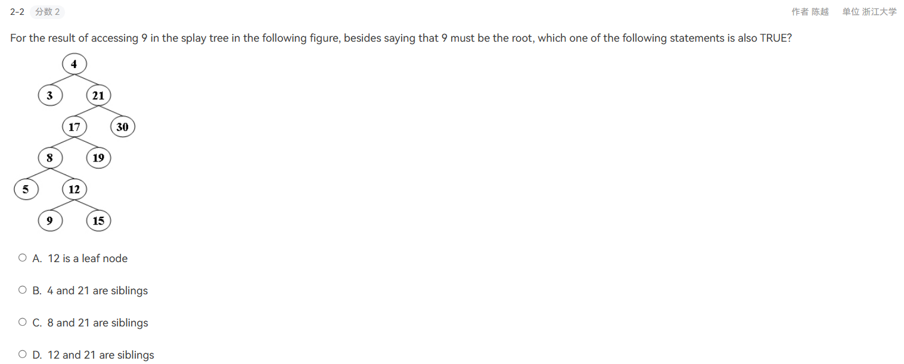

### 复杂度证明

> 参考资料： 1. [oi-wiki](https://oi-wiki.org/ds/splay/#splay-%E6%93%8D%E4%BD%9C%E7%9A%84%E6%97%B6%E9%97%B4%E5%A4%8D%E6%9D%82%E5%BA%A6)
> 2. 课程文件夹：Splay均摊分析_王灿.pdf

定义势能函数 $$\Phi=\sum_{i=1}^n \log S(i)$$

其中 $S(i)$ 是 $i$ 节点子树中的节点个数。想法是：势能得与树的高度有关，但是如果直白地用每个节点的子树高度当做势能函数，单次操作将会影响到

==还没写完==

## Amortized Analysis(均摊分析)

### aggregate analysis(聚类分析)

n 次操作的 worst-case 复杂度为 T(n)，则单次操作 worst-case 复杂度为 T(n)/n

e.g. multi-pop：一个栈，三个操作 push, pop, multi-pop（弹出 k 个元素）。n 个 multi-pop 的复杂度为 O(n)，1 个 multi-pop 均摊复杂度为 O(1)。

### accounting method(记账方法)

对不同操作赋予不同费用(amortized cost)，赋予某些操作的费用可能多于或少于其实际代价，但是总费用要求不小于实际代价。

摊还价值大于实际价值的部分叫 credit，可以看成往银行里存钱；摊还价值小于实际价值的部分会把 credit 取出来抵用。最后保证银行账户没有透支，则摊还分析的复杂度一定是实际复杂度的一个上界。

e.g. multi-pop: push 操作 2 费，pop 和 multi-pop 0 费。总复杂度最多 O(2n)=O(n)。

### potential method(势能分析)

给数据结构定义一个势能 $\Phi$ ，摊还代价等于实际代价加上第 i 次操作带来的势能变化 $$\hat{c_i}=c_i+\Phi(D_i)-\Phi(D_{i-1})$$

所以总摊还代价表示为总实际代价加上势能变化 $$\sum\hat{c_i}=\sum c_i+\Phi(D_n)-\Phi(D_0)$$

只要满足势能变化非负的条件 $\Phi(D_n)-\Phi(D_0)\geq 0$，就可以用摊还代价确定实际代价的上界。

e.g. multi-pop: 栈的势能定义为内部元素个数。所以摊还代价 push 2 费，pop 和 multi-pop 0 费。

#### e.g. Dynamic Table

情景：当表满了之后，新建一个 2 倍大的表并复制所有内容。当表只有 1/2 满时新建一个 1/2 大的表并复制所有内容。

设计 potential function 为**两倍**的当前表内元素个数，减去表的大小 $$\Phi=2T.num-T.size$$

这里设计两倍的目的是保证任意时刻使能都是非负的。初始状态 $\Phi$ 为 0，刚扩张表时 $\Phi$ 为 2，之后每插入一个元素 $\Phi$ 加 2。

其次，对于不产生表扩张的操作，其摊还价值为 $$\hat{c_i}=c_i+\Phi(D_i)-\Phi(D_{i-1})=1+2=3$$

对于产生表扩张的操作，假设扩张前表大小为 n。其实际价值为复制 n 个元素，加上插入一个元素。其摊还价值为 $$\hat{c_i}=c_i+(\Phi(D_i)-\Phi(D_{i-1}))=(1+n)+(2-n)=3$$

所以总复杂度为 $O(1)$

## Red-black Tree

[参考博客：简书 - 30张图带你彻底理解红黑树](https://www.jianshu.com/p/e136ec79235c/)

[wikipedia: 红黑树](https://en.wikipedia.org/wiki/Red%E2%80%93black_tree)

### 定义

- 二叉查找树
- 节点染红色或黑色，根黑色，external node 黑色
- 如果一个节点是红色的，他的儿子都是黑色的
    - 推论 *（不是基本定义）* ：不存在两个相邻的红节点
- 对于树上的任意节点 u，从 u 到以 u 为根的子树中的叶子的所有路径上，黑色节点的个数相同
    - 推论 *（不是基本定义）* ：如果一个结点存在黑子结点，那么该结点肯定有两个子结点

### 复杂度

- 定义：internal node 树上的实际节点，external node 虚拟叶子节点（空节点）
- 定义：uncle 节点为和父节点拥有同一个父亲的节点
- 定义：**black height bh(x)** 为从 x 到子树中任意叶子的路径上黑色节点个数
- Lemma：A red-black tree with N internal nodes has height at most 2ln(N +1).
    - 证明：若根节点 black height 为 n，则其左右儿子的 black height 都为 n-1，以此类推则黑节点个数为 $2^n-1$，整棵树节点最少为 $N\geq 2^n-1$，即 $n\leq \log_2(N+1)$。对于任意红节点，其父节点一定为黑节点，所以从根到任意叶子的路径上红节点数量不会超过黑节点数量，所以树深度最大为 $h \leq 2n$。由此可以得出 $h \leq 2\log_2(N+1)$，即 $h=O(\log N)$

### 操作

#### 三种基本操作

- 左旋
- 右旋
- 变色

#### Insert

先默认插入的是一个红节点，然后分以下情况：

- 情景 1 空树：红节点变黑节点
- 情景 2 插入节点的父节点为黑节点：红节点不变，已经平衡
- 情景 3 插入节点的父节点为红节点（**看父亲的兄弟**）
    - 推论：一定存在祖父，且祖父为黑色
    - 情景 3.1：uncle 存在并为红节点，父亲和 uncle 变黑，祖父变红，然后把祖父作为新插入的节点往上递归。如果祖父是根则直接把祖父变黑，**这是唯一一个会增加树的 black height 的操作**
    - 情景 3.2：uncle 不存在或为黑节点
        - 情景 3.2.1 zig-zig：把父亲变成黑色，祖父变成红色，做一次单旋
        - 情景 3.2.2 zig-zag：把插入节点变成黑色，祖父变成红色，做一次双旋（或者理解成对父亲做一次单旋，变成 3.2.1 的情况）
        - 总之就是把插入节点 R，父亲节点 P，祖父节点 G 旋转成平衡的，然后把根变成黑色，剩下两个儿子变成红色。

#### Delete

首先是替换策略：

- 情景 1 删除节点没有儿子：直接删除，自平衡的情景包含在情景 2 中
- 情景 2 删除节点只有一个儿子：用儿子替换删除节点，然后递归删除儿子节点
- 情景 3 删除节点有两个儿子：用后继节点代替删除节点，后继节点的右儿子代替后继节点（其中后继节点是右子树中权值最小的点，把后继节点换成前驱节点也一样）
    - **性质：在仅考虑树结构的情况下，替换操作相当于删除替换节点的操作**，所以情景 3 可以转化为情景 2

---

通过一系列替换，删除节点一定是叶子节点，然后再实施删除策略。但因为删除是一个递归的过程，所以在删除策略中不能默认删除节点是叶子节点，而是有两种情况：

1. 删除一个叶子节点，需要平衡
1. 子树的根节点 black height 减一，需要平衡

两者的实际效果类似，处理方法也差不多：

- 情景 1 删除节点是红节点：black height 不变，仍旧平衡
- 情景 2 删除节点是黑节点（先假设删除节点是其父节点的左子结点，右子节点同理，只要把整棵子树对称过来看就行）（比较难记忆，可以只记旋转的方式，转完之后怎么调整颜色其实凭感觉也能调出来） 
    - 情景 2.1 S 是黑节点（**分类讨论 SL 和 SR 的颜色**）
        - 情景 2.1.1 SR 是红节点
            - 性质：P 和 SL 的颜色随意，可以设为 X 和 Y
            - 操作：对 P 做一次左旋，交换 P 和 S 的颜色，把 SR 设成黑色。
        - 情景 2.1.2 SL 是红节点 SR 是黑节点
            - 性质：P 颜色随意，可以设为 X
            - 操作：对 S 进行一次右旋，交换 SL 和 S 的颜色，转化为 2.1.1 的情景
        - 情景 2.1.3 SL 和 SR 都是黑色节点：直接把 S 变成红色。如果 P 是红色节点，则把 P 变成黑色；如果 P 是黑色节点，则 *整棵子树 bh 减一，需要继续向上迭代*。
    - 情景 2.2 S 是红节点
        - 性质 1：P 一定为黑节点
        - 性质 2：因为 P 的左子树中有至少 1 个黑节点（R），所以右子树中也至少有 1 个黑节点，所以 S 一定有儿子。因为 S 是红节点，只有一个儿子的情况不存在，所以 S 的左右儿子 SL SR 都为黑节点。
        - 操作：对 P 做一次左旋，然 后交换 P 和 S 的颜色（P 变成红色，S 变成黑色），转化成 2.1.3 情景。

---

做点例题：

e.g. 空红黑树，依次插入 41; 38; 31; 12; 19; 8，下面哪个不对？

A.38 is the root
B.19 and 41 are siblings, and they are both red
C.12 and 31 are siblings, and they are both black
D.8 is red

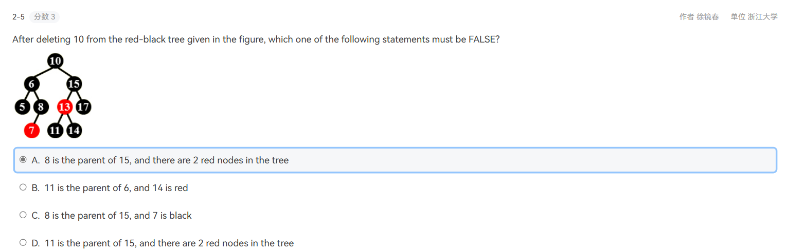

#### 实现

- 节点存储结构：father, lson, rson, data, color
- 基础功能：
    1. 查找节点
    2. 查找后继节点
    3. 左单旋、右单旋、左右双旋、右左双旋
    4. 判断节点是其父亲的左儿子还是右儿子
- 插入删除功能：需要在上述细分情景的基础上再分左右

e.g. AVL Tree & red-black tree 插入、删除操作的最大旋转次数

## B+ Tree

### 定义

B+ Tree of order M：

- 根：是叶子，或者有 2 到 M 个儿子
- 非根非叶子节点：有 $\lceil \frac{M}{2}\rceil$ 到 M 个儿子
- 叶子节点：所有叶子深度相同

p.s. B+ tree of order 4 is called 2-3-4 tree, B+ tree of order 3 is called 2-3 tree.

M 的大小选择：

M = node size / (key size + pointer size)

node size 一般设置为 disk node 的大小，常见为 4kB。

### 树结构

树节点的作用：

- 非叶子节点：索引（子树中的最小值拿上来做索引）
- 叶子节点：存储权值（每个叶子 $\lceil \frac{M-1}{2}\rceil$ 到 M-1 个权值）*（ppt 上以及习题中：每个叶子 $\lceil \frac{M}{2}\rceil$ 到 M 个权值）* **注意考试使用的定义和实际使用中的定义有所不同**

树节点的结构：

1. M 个指针和 M-1 个键值。在非叶子节点，Ki 存 Pi+1 指向的子树中的最小键值。在叶子节点中，Ki 存 Pi 指向的文件的键值，PM 指向下一个叶子节点（便于对文件进行顺序处理）。
2. 指向父亲的指针


### 操作

[B 树和 B+ 树](https://www.cnblogs.com/nullzx/p/8729425.html)

1. 查找
    1. 单点查找
        - 操作：在节点内进行顺序查找（因为磁盘 IO 已经是线性的了，再用二分也改变不了复杂度）（二分还是有用的）
        - 复杂度: 树深度 $O(\frac{\log N}{\log M})$, 总复杂度 $O(M\frac{\log N}{\log M})$
    2. 区间查找
        - 操作：用单点查找找到不小于查找下界的最小 key 值，然后向后做顺序查找。
2. 插入
    - 操作：
        1. 查找到叶子节点
        2. 如果节点中元素没有过多，则直接插入 key 值，否则在临时节点 T 中进行插入操作
        3. 如果节点内元素过多，则进行分裂操作（一般规定左边多右边少）
            - 叶子节点：如果节点内元素个数等于 M，把当前节点分裂成 $\lceil \frac{M}{2}\rceil$ 和 $\lfloor \frac{M}{2}\rfloor$ 两个节点
            - 非叶子节点：如果节点内指针个数等于 M+1，把当前节点分裂成包含 $\lceil \frac{M+1}{2}\rceil$ 个指针和包含 $\lfloor \frac{M+1}{2}\rfloor$ 个指针的两个节点
        4. 把右边节点的最小值插入父节点，并重复分裂步骤，直到有一个节点不需要分裂，或者将根节点分裂成两个，并新建一个根节点。
    - 复杂度： $O(M\frac{\log N}{\log M})$
3. 删除
    - 操作：
        1. 查找到叶子节点，删除 key 值。如果节点中键值没有过少，结束删除过程。
        2. 如果节点中键值过少，则判断是否可以和前驱节点或者后继节点合并成一个节点
            1. 可以合并（规定两个节点中靠前的为 N，靠后的为 M）（可以合并就一定合并，不能合并再考虑向兄弟借）
                - 非叶子节点：把所有键值和指针都存到 N 里，此时有两个指针中间缺少键值，把父亲节点中用于区分 N 和 M 的键值填入其中。删除 M，递归删除父亲节点中指向 M 的指针和父亲节点中用于区分 N 和 M 的键值。
                - 叶子节点：把所有键值和指针都存到 N 里，删除 M，处理一下指针，递归删除父亲节点中指向 M 的指针和父亲节点中用于区分 N 和 M 的键值
            2. 不能合并，则找 **同父的** 左右兄弟（规定做删除的节点是 N，前驱或者后继节点是 N'）
                - 非叶子节点：（假设在以下情况下，右边要向左边借一个指针）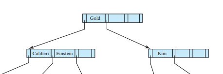 那么操作是：把Einstein 送到父节点上 Gold 的位置，把 Gold 替换下来放到右边的节点，然后再把左边节点最后的指针送到右边去。可以看成是啊把左边的所有键值和指针、父节点的键值、右边的所有键值和指针排成一个序列，然后在 Einstein 的位置重新切一刀分成两半。
                - 叶子节点：
                    - N' 是前驱节点：N' 给 N 一个键值对，把父亲节点中用于区分 N 和 N' 的 key 修改成 N 中新的最小值
                    - N' 是后继节点：N' 给 N 一个键值对，把父亲节点中用于区分 N 和 N' 的 key 修改成 N' 中新的最小值
            3. 当前节点是根节点，并且存了一个指针：删除当前节点，把儿子提上来当根节点

p.s. 操作的时间复杂度没有降低，但是单次操作磁盘 IO 的次数降低为 $\lceil\frac{\log N}{\log M}\rceil-1$，减一是因为根节点一般存放在 buffer 中不需要反复读取。

e.g. 如果我们的 B+ 树一个节点可以存储 1000 个键值，那么 3 层 B+ 树可以存储 1000×1000×1000=10 亿个数据。一般根节点是常驻内存的，所以一般我们查找 10 亿数据，只需要 2 次磁盘 IO。

e.g. 向空的 2-3 树插入 3, 1, 4, 5, 9, 2, 6, 8, 7, 0，下面哪个不对？

A. 7 and 8 are in the same node
B. the parent of the node containing 5 has 3 children
C. the first key stored in the root is 6
D. there are 5 leaf nodes

### 实现

1. 基础功能函数
    - FindKey: 找到权值 key 应该出现的叶子节点
        - FindRange: 区间查找，返回键值、指针集合
    - FindRef: 找到父节点中指向自己的指针编号
        - FindPrev: 找到当前节点的前驱节点
        - FindNext: 找到当前节点的后继节点
        - FindDiff: 找到父节点中，用于区分当前节点和后继节点的键值
2. 拓展功能函数
    - Insert
        - InsertInLeaf: 在叶子节点中插入一个键值、指针对
        - InsertInParent: 在非叶子节点中插入一个键值、指针对，递归向上
    - Delete
        - DeleteEntry: 递归向上的删除函数

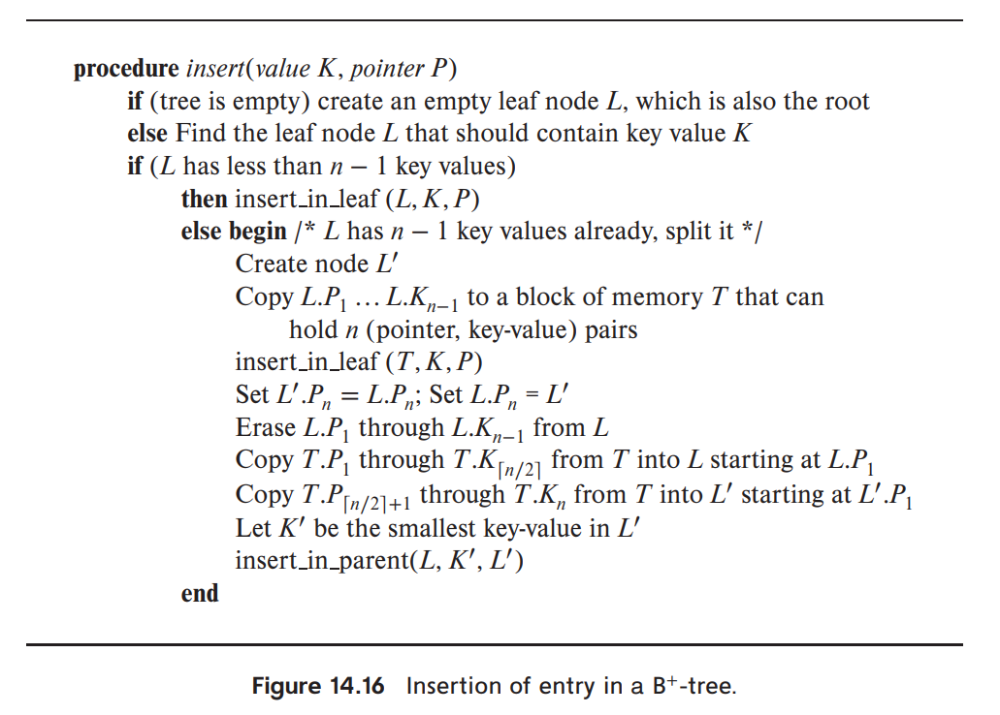

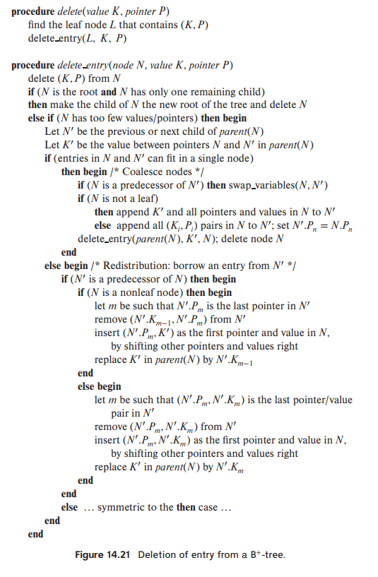

## Inverted Index 倒排索引

[CSDN 大佬的 ADS 笔记](https://blog.csdn.net/Woolseyyy/article/details/51559937)

搜索引擎的构建

- 爬虫：获取信息
- 索引：存储和查找信息
    - 词法分析：存储短语 or 单词？
    - **word stemming**：英语的拼写错误、时态和数的变化，中文的简体繁体
    - **stop words**：去除过于常用的词
        - 拓展问题：如何对 stop words 进行搜索？
    - indexing method: hash（不擅长范围查找）, search tree, etc
    - dynamic indexing: 管理索引的增加和删改，参考 git 的版本控制
    - 分布式存储：document-partitioned, term-partitioned
    - 内存管理, compression
    - threshold: 只考虑权重考前的 n 个文档，只考虑搜索语句中出现频率较小的短语
    - page rank 算法, semantic web
- 排序：显示信息

搜索引擎的性能测试

- **相关性**
    - 已知数据集 document，一系列 query；对于每个 query 和 document 的组合，已知他们的关系是 relevant 还是 irrelevant（类似于监督学习的数据标签）。对搜索引擎进行测试，对于每个 query 和 document 的组合，有搜到(retriecved)和没搜到(not retrieved)两种情况。于是可以列出如下 2*2 表格。 
    - precision $P = R_R / (R_R + I_R)$ **搜到的结果中有多少相关**
    - recall $R = R_R / (R_R + R_N)$ **相关的结果中有多少被搜到**
    - accuracy $A=(R_R+I_N)/(R_R+I_R+R_N+I_N)$ **所有结果中有多少和标签匹配**
- 搜索速度(how fast it search, hwo fast it index)
- 耗费资源


### project 1 Roll Your Own Search Engine

资源：

1. [莎士比亚全集](http://shakespeare.mit.edu/)
2. [莎士比亚语言研究以及其他信息](https://www.bardweb.net/index.html)
3. 

todo:

- [x] 爬虫

戏剧的格式：

```json
{
    "key": 0,
    "type": "play",
    "name": "All's Well That Ends Well",
    "act": 1,
    "scene": 1,
    "url": "http://shakespeare.mit.edu/allswell/allswell.1.1.html",
    "content": "..."
}
```

诗歌的格式：

```json
{
    "key": 12345,
    "type": "poetry",
    "name": "Sonnet I",
    "url": "http://shakespeare.mit.edu/Poetry/sonnet.I.html",
    "content": "..."
}
```

整个文件的格式：

```json
[{}, {}, {}, {}, ...]
```

- [x] 读取 json 文件 [jsoncpp](https://www.cnblogs.com/tocy/p/json-intro_jsoncpp-lib.html)
- [x] 大小写 + stemming + stop words 处理 [停用词库](https://www.ranks.nl/stopwords) [NLTK 停用词库](https://gist.github.com/sebleier/554280)
- [x] 倒排索引 class 的基本功能函数
- [x] 生成倒排索引

封装格式：(`InvertedIndex.h`)

```cpp
#include <vector>
#include <string>

using namespace std;

class InvertedIndex{
private:
	
	class InvertedIndexData{
	public:
		string word;
		int tot_freq;
		vector<pair<int, int> > freq;
	};
	
	InvertedIndexData * head;
	
public:
	
	void Insert(int doc, string word);
	int Query_WordCount(string word);
};
```

- [x] 存储倒排索引
- [x] 读取倒排索引

存储文件的格式：

```json
[
    {
        "word": "prince",
        "tot_freq": 123,
        "freq": [
            [0, 123],
            [2, 456],
            ...
        ]
    },
    ...
]
```

- [x] 处理查询语句
    - [x] 测试：threshold
    - [x] 查询 stop word 怎么处理？ to be or not to be
- [x] 性能检测：怎么生成查询 & 标签？
- [ ] 优化：分布式存储(500 000 files and 400 000 000 distinct words)
- [x] 优化：stemmer 包含引号的单词和缩写 `'bout=about` `they're = they are` （莎士比亚）


## Leftist Heap 

[参考博客：有合并的图示](https://zhuanlan.zhihu.com/p/38035946)

背景和思路：

- 中文名：左偏树、左偏堆、左堆
- 特点：满足堆的所有性质 + $O(\log N)$ 合并
- 实现思路：使堆“不平衡”

定义和性质：

- 定义：**npl(X), Null Path Length**, X 到 NULL 的**最短**路径，**假设 NULL 节点的 NPL 是 -1**
- 性质：左子树的 npl 大于等于右子树
- 定义：右路径，从根开始一直找右儿子得到的路径
- 定理：左偏树的右路径上有 r 个节点，整棵树的节点个数至少有 $2^r-1$
    - 证明：数学归纳法。如果根节点的 npl 是 r，则右子树的 npl 是 r-1，左子树的 npl 大于等于 r-1
- 推论：右路径长度 $O(\log N)$

**合并**算法实现：（递归，小根堆）

1. `H_ret = Merge(H1->Right, H2)` 小的节点作为根节点，小的节点右子树和另一棵树合并 **（如果其中至少有一个节点是 NULL 就结束递归，和斜堆有区别）**
1. `Attach(H_ret, H1->Right)`
1. `Swap(H1->Left, H1->Right)` 如果左子树 npl 小于右子树，即不满足左偏树的性质，则交换左右子树
1. `Update(H1->npl)` 最后记得更新 npl

插入算法实现：相当于和一个只有一个节点的堆合并

删除根节点实现：相当于左儿子和右儿子合并

**$O(N)$ 建堆**：两两合并，做 $\log N$ 次，复杂度 $O(N)$

---

做点例题：

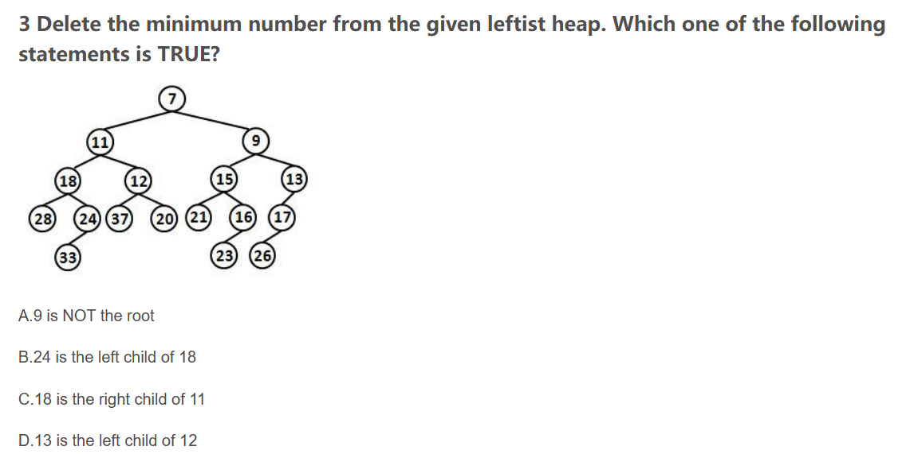

## Skew Heap

[参考文章，证明很详细](https://www.cnblogs.com/HachikoT/p/16951306.html)

[左倾树和斜堆做题！](https://blog.csdn.net/HGGshiwo/article/details/115060750)

[Skew Heap Visualization!](https://www.cs.usfca.edu/~galles/visualization/SkewHeap.html)

定义和性质：

- 中文名：斜堆
- 优点：不需要额外空间

**合并算法：**

1. 如果一个空斜堆与一个非空斜堆合并，**交换非空斜堆的左右节点，向下递归（保证非空堆右路径上所有重节点都变成轻节点，和左倾树不一样）** ，然后返回非空堆的堆顶。
1. 如果两个斜堆都非空，那么比较两个根结点，将较小的根结点的**右孩子**对应的子堆和另一个堆去合并，合并得到的新子堆的根结点作为新的右孩子，然后交换根节点的左右儿子。
    - 如果先交换后合并，可以做到非递归。修改为：“如果两个斜堆都非空，那么比较两个根结点，将较小的根结点的**右孩子**对应的子堆和另一个堆去合并，合并得到的新子堆的根结点作为新的**左孩子**。”

tips. 
- 最后一步交换很关键，对于一个结点来说，合并的数据总是交替地插入自己的左边和右边，那么高度是不是就可以控制住了呢?
- 为了保证“非空堆右路径上所有重节点都变成轻节点”这个性质，**合并中两棵树的右路径上的所有节点必须都做过一次旋转**

复杂度证明：（摊还分析）

- 定义 **heavy node**：右子树节点个数大于左子树节点个数（不能相等）
- 定义势能函数：$\Phi(D_i)$ 为整棵树中 heavy node 的个数
- 定义 $l_a, h_a, l_b, h_b$：a 树右路径上的轻节点个数、重节点个数，b 树右路径上的轻节点个数、重节点个数
- 证明：

合并的实际开销为 a 和 b 树的右路径长度之和：$$c_i=l_a+h_a+l_b+h_b$$

然后考虑合并产生的势能变化。

- 在合并过程中轻重会变化的，只有右路径上的节点。因为只有右路径上的节点会产生合并操作
- 对于右路径中的重节点，因为合并在右子树发生，并且会把右子树交换到左子树，所以合并后左子树一定比右子树重，所以变成轻节点。
- 对于右路径中的轻节点，可能变成重节点或者轻节点，但右路径中的轻节点个数小于 $\log N$ 个。因为轻节点左子树比右子树重，轻节点的子树大小一定大于等于右儿子的两倍。

综上，势能变化 $$\Delta\Phi\leq l_a+l_b-h_a-h_b$$

所以摊还价值为
$$
\begin{align*}
\hat c_i&=\Delta\Phi + c_i\notag \\
&\leq 2(l_a+l_b)\notag \\
&\leq 2\log N\notag \\
\end{align*}
$$

考虑初始势能和最终势能 $\Phi(0)\leq N, \Phi(M)\leq N$

所以 M 次合并操作的复杂度为

$$
\begin{align*}
\sum_{i=1}^M c_i&=\sum_{i=1}^M \hat c_i + \Phi(0)-\Phi(M)\\
&\leq 2M\log N + N \\
&= O(M\log N)
\end{align*}
$$

---

例题 1：判断 The result of inserting keys 1 to $2^{k−1}$ for any k>0 in order into an initially empty skew heap is always a full binary tree.

数学归纳法。给满二叉树的每条边编号，往右走的为 0，往左走的为 1,。然后给叶子节点编号为从根走到叶子的路径上边的编号组合。例如从根走右右左左，则编号为 0011。

则插入第 2 到 3 个节点的顺序为 0, 1；插入第 4 到 7 个节点的顺序为 00, 10, 01, 11；第 8 到 15 个节点的顺序为 000, 100, 010, 110, 001, 101, 011, 111。

可以看出插入深度为 k 的满二叉树，相当于以右左右左的顺序依次插入深度为 k-1 的右子树和左子树。

结论：**从小到大插入节点会构造一颗满二叉树，从大到小插入节点会构造一条往左延伸的链**

---

例题 2：斜堆的右路径长度 worst-case 是 $O(N)$ 的

最坏情况的构造方法，依次插入：5, 6, 4, 7, 3, 8, 2, 9 ... 右路径长度为 $\frac{N}{2}$（记忆方法：依次插入最小、最大、最小、最大 ......）

---

例题 3：skew heap 的合并操作示例

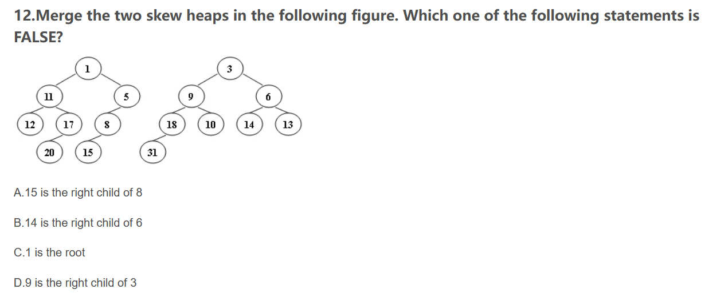

## Bionomial Queue 二项队列

### 定义

1. binomial queue
1. binomial tree
1. subtree

### 性质

[二项队列的性质 参考博客](https://blog.csdn.net/xitie8523/article/details/94467442)

- bionomial queue 是 bionomial tree 构成的森林
- bionomial tree $B_k$ 高为 $k$
- $B_k$ 是由两棵 $B_{k-1}$ 组成的，方式为让 $B_{k-1,1}$ 的根成为 $B_{k-1,2}$ 的根的儿子
- $B_k$ 有 $2^k$ 个节点
- $B_k$ 深度为 $d$ 的节点有 $\tbinom{k}{d}$ 个
    - 证明：$\tbinom{k}{d}=\tbinom{k-1}{d} + \tbinom{k-1}{d-1}$

### 操作

1. 查找最小值：查找每个 root
1. 合并：二进制加法 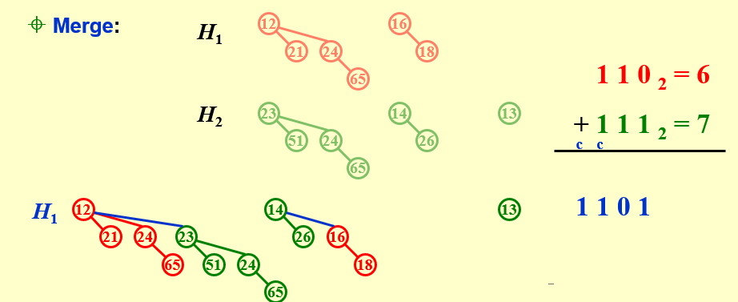
1. 插入：相当于和一个节点的二项队列合并
1. 删除最小值：一颗 bionomial tree $B_k$ 去掉根节点之后会变成 k 个子树，组成一个二项队列。原来的二项队列去掉 $B_k$ 之后也是一个二项队列。然后将这两个二项队列合并。 

e.g. n 个节点的 bionomial queue 由哪几颗 bionomial tree 组成？

二进制分解

e.g. 这个 decreasing 记一下，考试要考 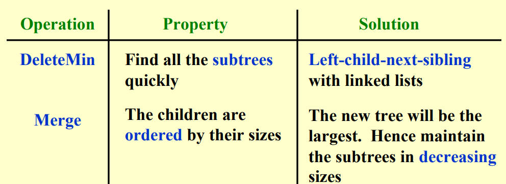

### 复杂度

[二项队列的操作 参考博客](https://zhuanlan.zhihu.com/p/72854813)

Insert 均摊 O(1) 证明：

1. $\sum_{i=0}^{k} \frac{N}{2^i}\cdot i < 2N$
1. accounting method: 每个点 2 块钱，一块钱插入的时候花掉了，另一块钱存在他所在的树上。这么做可以保证每棵树都存了一块钱，在合并两棵树的时候花掉原来存着的钱中的一块，把另一块钱存在新合成的树上。

### 实现

每个节点存左儿子和右兄弟

```c
typedef struct BinNode *Position;
typedef struct Collection *BinQueue;
typedef struct BinNode *BinTree;  /* missing from p.176 */

// binomial tree 节点类型
struct BinNode 
{ 
	ElementType	    Element;
	Position	    LeftChild;
	Position 	    NextSibling;
};

// binomial queue 类型
struct Collection 
{ 
	int	    	CurrentSize;  /* total number of nodes */ // 记忆这个概念
	BinTree	TheTrees[ MaxTrees ];
};

BinTree CombineTrees( BinTree T1, BinTree T2 )
{  /* merge equal-sized T1 and T2 */
	if ( T1->Element > T2->Element )
		/* attach the larger one to the smaller one */
		return CombineTrees( T2, T1 );
	/* insert T2 to the front of the children list of T1 */
	T2->NextSibling = T1->LeftChild;
	T1->LeftChild = T2;
	return T1;
}

BinQueue  Merge( BinQueue H1, BinQueue H2 )
{	BinTree T1, T2, Carry = NULL; 	
	int i, j;
	if ( H1->CurrentSize + H2-> CurrentSize > Capacity )  ErrorMessage();
	H1->CurrentSize += H2-> CurrentSize;
	for ( i=0, j=1; j<= H1->CurrentSize; i++, j*=2 ) {
	    T1 = H1->TheTrees[i]; T2 = H2->TheTrees[i]; /*current trees */
        // 把 T1 T2 和 Carry 三棵树合并到 H1->TheTrees[i] 上
	    switch( 4*!!Carry + 2*!!T2 + !!T1 ) { 
		case 0: /* 000 */
	 	case 1: /* 001 */  break;	
		case 2: /* 010 */  H1->TheTrees[i] = T2; H2->TheTrees[i] = NULL; break;
		case 4: /* 100 */  H1->TheTrees[i] = Carry; Carry = NULL; break;
		case 3: /* 011 */  Carry = CombineTrees( T1, T2 );
			            H1->TheTrees[i] = H2->TheTrees[i] = NULL; break;
		case 5: /* 101 */  Carry = CombineTrees( T1, Carry );
			            H1->TheTrees[i] = NULL; break;
		case 6: /* 110 */  Carry = CombineTrees( T2, Carry );
			            H2->TheTrees[i] = NULL; break;
		case 7: /* 111 */  H1->TheTrees[i] = Carry; 
			            Carry = CombineTrees( T1, T2 ); 
			            H2->TheTrees[i] = NULL; break;
	    } /* end switch */
	} /* end for-loop */
	return H1;
}

ElementType  DeleteMin( BinQueue H )
{	BinQueue DeletedQueue; 
	Position DeletedTree, OldRoot;
	ElementType MinItem = Infinity;  /* the minimum item to be returned */	
	int i, j, MinTree; /* MinTree is the index of the tree with the minimum item */

	if ( IsEmpty( H ) )  {  PrintErrorMessage();  return –Infinity; }

    // 先 findMin 找到最小值
	for ( i = 0; i < MaxTrees; i++) {
	    if( H->TheTrees[i] && H->TheTrees[i]->Element < MinItem ) { 
		MinItem = H->TheTrees[i]->Element;  MinTree = i;    } /* end if */
	}

    // 然后在原树中删除最小值所在树
	DeletedTree = H->TheTrees[ MinTree ];  
	H->TheTrees[ MinTree ] = NULL;   /* Step 2: remove the MinTree from H => H’ */ 
	OldRoot = DeletedTree;   /* Step 3.1: remove the root */ 
	DeletedTree = DeletedTree->LeftChild;   free(OldRoot);

    // 然后用最小值所在树的子树构造一个新的 binomial queue
	DeletedQueue = Initialize();
	DeletedQueue->CurrentSize = ( 1<<MinTree ) – 1;  // 这个计算公式重要，MinTree 存储的是删除的 binomial tree 的编号，其中有 2^MinTree 个节点，去掉了一个根之后剩下 2^MinTree-1 个节点构成 binomial queue

    // 下面是依次把 DeletedTree 中的子树取出来放到 DeletedQueue 中
	for ( j = MinTree – 1; j >= 0; j--) {  
	    DeletedQueue->TheTrees[j] = DeletedTree;
	    DeletedTree = DeletedTree->NextSibling;
	    DeletedQueue->TheTrees[j]->NextSibling = NULL;
	}

    // 减去 DeletedTree 的大小
	H->CurrentSize -= DeletedQueue->CurrentSize + 1;

    // 把新构造出来的两棵树合并了
	H = Merge( H, DeletedQueue ); /* Step 4: merge H’ and H” */ 
	return MinItem;
}
```

## backtracking 搜索剪枝

### turnpike reconstruction problem 

- 问题描述：给定 $\frac{N(N-1)}{2}$ 个距离，在数轴上构造一堆一维的点 $0=x_1<x_2<...<x_n$ 使得其两两距离为给定的距离 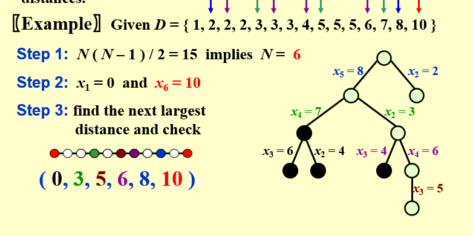
- turnpike 搜索复杂度分析 $O(2^nn\log n)$，$2^n$ 是搜索，$n\log n$ 是二分查找比较距离矩阵的包含

[TODO] 看代码，算法流程

```c
bool Reconstruct ( DistType X[ ], DistSet D, int N, int left, int right )
{ /* X[1]...X[left-1] and X[right+1]...X[N] are solved */
    bool Found = false;
    if ( Is_Empty( D ) )
        return true; /* solved */
    D_max = Find_Max( D );
    /* option 1：X[right] = D_max */
    /* check if |D_max-X[i]| \in D is true for all X[i]’s that have been solved */
    OK = Check( D_max, N, left, right ); /* pruning */
    if ( OK ) { /* add X[right] and update D */
        X[right] = D_max;
        for ( i=1; i<left; i++ )  Delete( |X[right]-X[i]|, D);
        for ( i=right+1; i<=N; i++ )  Delete( |X[right]-X[i]|, D);
        Found = Reconstruct ( X, D, N, left, right-1 );
        if ( !Found ) { /* if does not work, undo */
            for ( i=1; i<left; i++ )  Insert( |X[right]-X[i]|, D);
            for ( i=right+1; i<=N; i++ )  Insert( |X[right]-X[i]|, D);
        }
    }
    /* finish checking option 1 */
    if ( !Found ) { /* if option 1 does not work */
        /* option 2: X[left] = X[N]-D_max */
        OK = Check( X[N]-D_max, N, left, right );
        if ( OK ) {
            X[left] = X[N] – D_max;
            for ( i=1; i<left; i++ )  Delete( |X[left]-X[i]|, D);
            for ( i=right+1; i<=N; i++ )  Delete( |X[left]-X[i]|, D);
            Found = Reconstruct (X, D, N, left+1, right );
            if ( !Found ) {
                for ( i=1; i<left; i++ ) Insert( |X[left]-X[i]|, D);
                for ( i=right+1; i<=N; i++ ) Insert( |X[left]-X[i]|, D);
            }
        }
        /* finish checking option 2 */
    } /* finish checking all the options */
    
    return Found;
}
```

### tic-tac-toe

- 问题描述：走井字棋
- tic-tac-toe 中的 potential win 含义是：用某种棋子把整个盘面铺满，能找到的不同的三连棋的个数。
- goodness 用 $f(P)$ 来定量描述

比如下面这个例子，人是红色方，电脑是蓝色方。人的 potential win 是 4，电脑的 potential win 是 6。


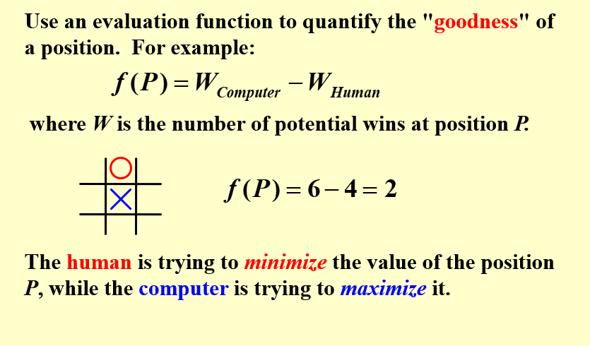

### $\alpha$-$\beta$ 剪枝

- 使用场景：minimax 搜索
- $\alpha$-$\beta$ 剪枝算法描述：
    - $\alpha$: 如果 min 层的值已经小于他父亲 max 层的值，舍去他剩下的子树
    - $\beta$: 如果 max 层的值已经大于他父亲 min 层的点，舍去他剩下的子树。
    - 记忆：父亲和祖父商量，把儿子给丢了(bushi)

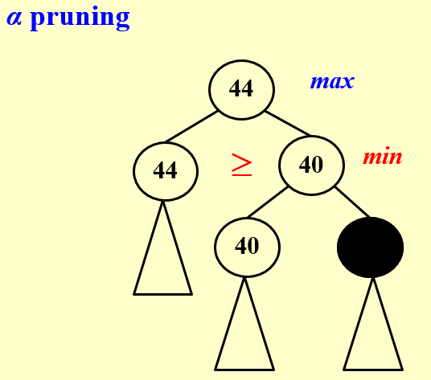

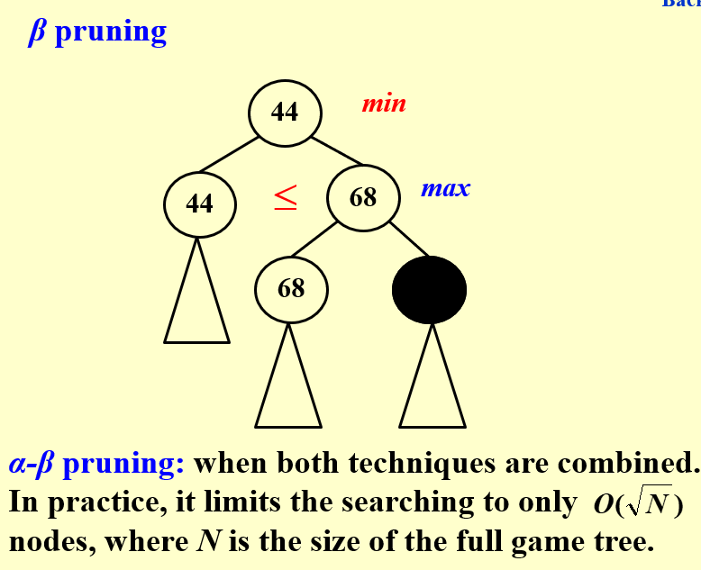

### Project 3 To Buy or not to Buy

1. 一种简化问题的想法：把每个 string 看成 62 维向量，选一些向量相加，结果必须每个维度都不小于目标向量，并且和目标向量的曼哈顿距离最近。
1. 最优性剪枝：目标是使总 bead 数最少，搜索过程中总 bead 数必须小于任何一个可行解
    - 如何快速找到一个接近最优解的可行解
    - 迭代加深
    - 二分
1. 搜索顺序：优先搜索 bead 更多的 string，减少搜索层数。

---

任务：

1. 朴素的搜索
1. 优化后的搜索
1. 随机数据：
    - 目标很大，可选的很小
    - 目标很小，可选的很大
    - 两个都很大
1. 检测运行时间并输出到 csv 或者 xlsx 形成表格（+ excel2latex 插件转换为 latex 表格）

接口：

search_1.h

```cpp
#pragma once

// 定义在 main 函数中的常量
extern const int BeadN;

/*
 * 第 1 种搜索算法的主函数
 * Para1 target: 目标串中每种珠子的个数，规定编号 0 - 9 代表数字 0 - 9，编号 10 - 35 代表小写字母 a - z，36 - 51 代表大写字母 A - Z
 * para2 item_cnt: 可以购买的串的个数
 * para3 item: 每个可以购买的串中每种珠子的个数，格式同上
 * RetVal: 如果不存在可行解返回 -1，否则返回结果的珠子个数
 */
int search_1(int target[BeadN], int item_cnt, int item[][BeadN]);
```

init.h

```cpp
#pragma once

// 定义在主程序中的常量
extern const int StringN;
extern const int BeadN;

/*
 * 初始化函数
 * para1 s_tar: 目标串的输入字符串，以 \0 结尾
 * para2 item_cnt: 可以购买的串的个数
 * para3 s_item: 可以购买的串的输入字符串，每个都以 \0 结尾
 * Para4 target: 目标串中每种珠子的个数，规定编号 0 - 9 代表数字 0 - 9，编号 10 - 35 代表小写字母 a - z，36 - 51 代表大写字母 A - Z
 * para5 item: 每个可以购买的串中每种珠子的个数，格式同上
 */
void init(char s_tar[StringN], int item_cnt, char s_item[][StringN], int target[BeadN], int item[][BeadN]);
```

---

resources：

- C++ 使用 xlnt 库操作 excel 表格，[仓库地址](https://github.com/tfussell/xlnt)，[中文简明文档](https://www.cpp-prog.com/%E7%BC%96%E7%A8%8B/xlnt/)
    - [vcpkg 官方文档](https://github.com/microsoft/vcpkg/blob/master/README_zh_CN.md)：clone repo，下载脚本
    - [vcpkg 换源](https://zhuanlan.zhihu.com/p/383683670)
    - [vcpkg 配置](https://zhuanlan.zhihu.com/p/447391308)：设置默认 x64
    - [vcpkg+vscode+CMake 工程](https://zhuanlan.zhihu.com/p/430835667)：配置 VSCode CMake 插件，新建 CMake 项目的流程
    - [vcpkg+vscode 开发环境配置](https://zhuanlan.zhihu.com/p/350194582)：安装库和综合的指令
    - [CMake 教程](https://zhuanlan.zhihu.com/p/500002865)
- python 操作 excel: xlwings [官方文档](https://docs.xlwings.org/zh_CN/latest/quickstart.html)

## divide & conquer 分治

### 计算分治复杂度的三种方法

1. 数学归纳法
1. 分治树法
1. 主定理

### 主定理

- [参考博客1](https://www.cnblogs.com/erro/p/12249033.html)：有分治树的图，有详细证明，但是没有讨论带 log 的情况
- [wiki](https://en.wikipedia.org/wiki/Master_theorem_(analysis_of_algorithms))：所有情况的详细讨论 & 解释
- 参考：补充阅读 - 主定理证明

#### 主定理记忆

- $c_{crit}=\log_ba$ 对数和底别搞反了。
- 然后**一定要会画分治树**，把分治树的顶层和底层比一下就知道要用哪个公式了
- 最后记一下 -1 这个分界点

---

看个例子，用分治树来解这道题：

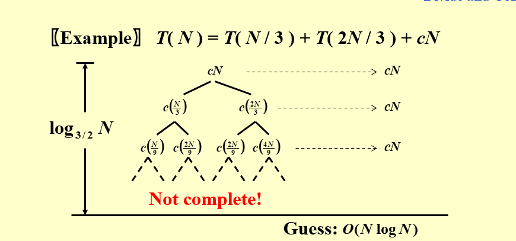

因为每层都是 N 个元素，附加复杂度还是线性的，所以只要算分治树上所有节点个数之和就行了。

#### 主定理详细阐述


主定理的含义：分治算法的复杂度分为两部分，分治过程中产生的附加时间 $\sum f(\frac{n}{b^i})$，和分治树叶子节点返回需要的时间 $\Theta(n^{\log_b a})$，主定理的分情况讨论就是在讨论这两部分谁花的时间更多，谁就决定时间复杂度的上界。

#### 主定理证明

1. 叶子主导的情况

$$
\begin{aligned}
    \sum_{i=0}^{\log_bn-1}a^i\Big(\frac{n}{b^i}\Big)^{\log_ba-\varepsilon} &= n^{\log_ba-\varepsilon}\sum_{i=0}^{\log_bn-1}\Big(\frac{ab^\varepsilon}{b^{\log_ba}}\Big)^i\\
    &= n^{\log_ba-\varepsilon}\sum_{i=0}^{\log_bn-1}(b^\varepsilon)^i\\
    &= n^{\log_ba-\varepsilon}\frac{(b^\varepsilon)^{\log_bn}-1}{b^\varepsilon-1}\\
    &= n^{\log_ba-\varepsilon}\frac{n^\varepsilon-1}{b^\varepsilon-1} \\
    &= n^{\log_ba}\frac{n^\varepsilon-1}{n^{\varepsilon}(b^\varepsilon-1)}\\
    &< n^{\log_ba}
\end{aligned}
$$

所以

$$
\begin{aligned}
    T(n)&=\Theta(n^{\log_ba})+O\Big(\sum_{i=0}^{\log_bn-1}a^i\Big(\frac{n}{b^i}\Big)^{\log_ba-\varepsilon}\Big)\\
    &=\Theta(n^{\log_ba})+O(n^{\log_ba})\\
    &=\Theta(n^{\log_ba})
\end{aligned}
$$

参考博客里有个指数 i 没有删掉。

2. 叶子和非叶子平等的情况，只证明不带 log 的部分，带 log 的暂时不会证明，就先背一背吧

$$
\begin{aligned}
    &\sum_{i=0}^{\log_bn-1}a^i\Big(\frac{n}{b^i}\Big)^{\log_ba}\\
    =& n^{\log_ba}\sum_{i=0}^{\log_bn-1}\Big(\frac{a}{b^{\log_ba}}\Big)^i\\
    =& n^{\log_ba}\sum_{i=0}^{\log_bn-1}1\\
    =& n^{\log_ba}\log n\\
\end{aligned}
$$

所以

$$
\begin{aligned}
    T(n)&=\Theta(n^{\log_ba})+\Theta\Big(\sum_{i=0}^{\log_bn-1}a^i\Big(\frac{n}{b^i}\Big)^{\log_ba}\Big)\\
    &=\Theta(n^{\log_ba}\log n)
\end{aligned}
$$

3. 非叶子占主导地位

把前面的证明小于换成大于，$O$ 换成 $\Omega$ 就可以了，可以看成是其他所有时间加起来还比不过根节点一个点的时间复杂度。

#### 举例：最近点对问题

[参考博客](https://blog.csdn.net/sinat_35678407/article/details/82874216)：有画图和复杂度证明，比较详细

#### 分治算法设计

看个例子：

还有这种算法设计的题目想不出来就是想不出来（虽然不是 DP 但是不知道放在哪里好）：

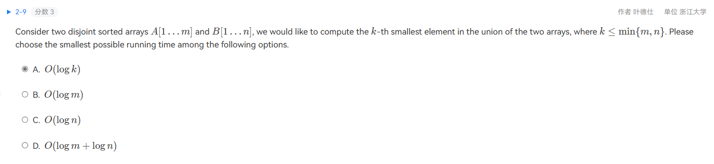

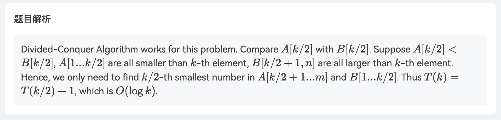

## 动态规划 DP

1. [背包九讲](https://zhuanlan.zhihu.com/p/139368825)
1. [环形 dp](https://www.cnblogs.com/chdy/p/10618969.html)

tips. 小题的关注点：更新 dp 数组的顺序问题

看两个题目：

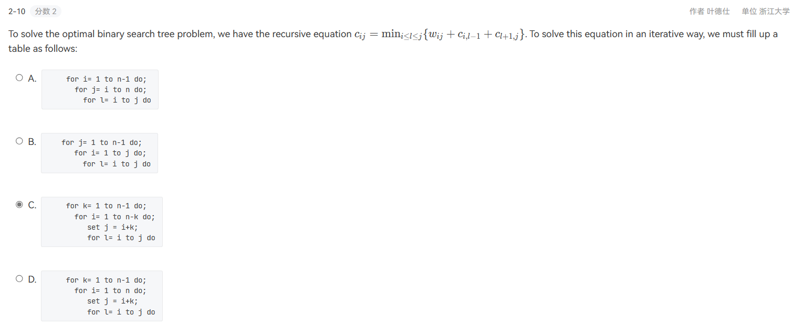

## 贪心 Greedy

### 线段覆盖问题

题目描述：

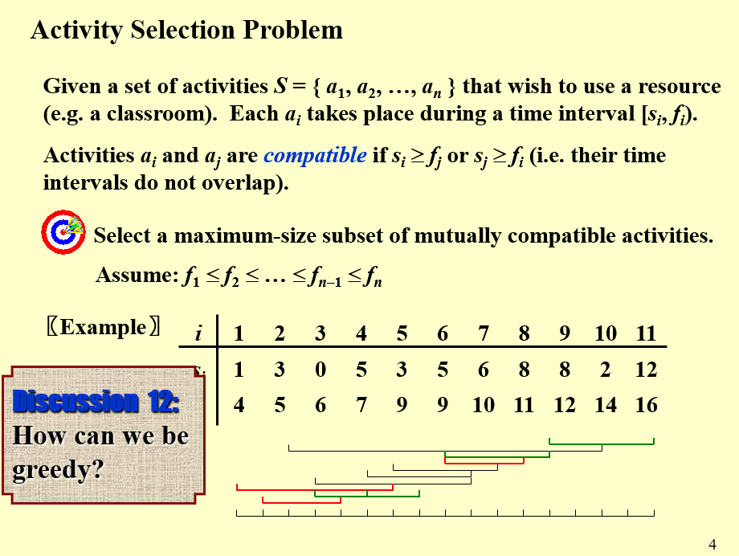

- 算法：选不重叠的线段中结束时间最早的
- 证明：
    - 正确性：算法给出的线段互不相交
    - 最优性：证明任何一个子集中，最早结束的线段一定被包含在某个最优解集合中 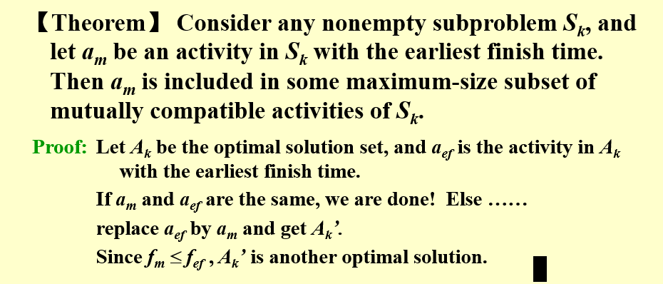
- 复杂度：$O(n\log n)$ 排完序就是线性的

### 哈夫曼编码

- [图解哈夫曼编码](https://blog.csdn.net/fx677588/article/details/70767446)
- 贪心算法：维护一个小根堆，每次把出现频率最小的两个节点取出来，合并，然后再放回去

做个例题：


## NP Completeness

### Decidability

Undecidable problems are problems that cannot be solved by a computer in finite amount of time.

不可解问题：

1. 停机问题（逻辑上证明不可解）[知乎](https://www.zhihu.com/question/20081359/answer/162329455)
1. 3x+1 问题，克拉茨问题（还没证明出来），[陶哲轩证明“绝大多数正整数”](https://zhuanlan.zhihu.com/p/97346612)

### P & NP & NP-complete & NP-hard

- deterministic turing machine: executes one instruction at each point in time. Then depending on the instruction, it goes to the next unique instruction.
- nondeterministic turing machine: free to choose its next step from a finite set. And if one of these steps leads to a solution, it will always choose the correct one.

---

- decision problem: 回答 "yes" or "no"
- optimization problem: 输出最优解, can be related to a decision problem using the form of "Is x an optimal answer."
- search problem: 要输出答案或者 "no solution"
- counting problem

e.g. SHORTEST-PATH problem relates to PATH problem: given a directed graph G, vertices u and v, and an integer k, does a path exist from u to v consisting of at most k edges?

---

- P: polynomimal-time, 多项式时间求解
- NP: nondeterministic polynomial-time, 非确定图灵机多项式时间求解，即多项式时间验证
- NP-complete: 两个性质，第一个是必须是一个 NP 问题，第二个是 has the property that any problem in NP can be polynomially reduced to it. ( 证明 P=NP 即找出 NP-complete 的多项式时间解 )
    - e.g. Hamiltonian cycle problem & traveling salesman problem: NP-complete
    - e.g. 最早证明的 NP-complete 问题——逻辑电路问题
    - SAT: Input a boolean expression and ask if it has an assignment to the variables that gives the expression a value of 1
- NP-hard: 所有 NP 问题都能规约到的问题，但不一定是 NP 问题
    - NP-hard 包含 NPC

- co-NP: 问题的补问题是 NP 问题（co-NP 和 NP 不是等价关系，为啥，我也不知道）

[Matrix67 讲 P, NP, NPC, NPhard](http://www.matrix67.com/blog/archives/105)
[知乎：证明 SAT 问题是 NP-complete 问题](https://zhuanlan.zhihu.com/p/73234959)
[CSDN: 证明 NP-complete 的方法](https://blog.csdn.net/Cplus_ruler/article/details/112390803)

e.g. 背包问题不是 P 问题，因为 $O(NW)$ W 不是输入的多项式。

e.g. 证明问题 X 是 NP-complete 问题

1. 证明 X 是 NP 问题
1. 证明 NP-complete 问题 Y 可以规约到 X，即 $Y\leq_P X$

举个例子：把汉密顿环问题规约到旅行商问题。

解决方法：把汉密顿环问题条件中 E 包含的边边权设置为 1，其余没有的边边权设置为 2，构造一个完全图。汉密顿环有解，等价于在这个新的完全图上，旅行商问题有 total cost 小于等于汉密顿环中点个数 |V| 的解。


e.g. P=NP 对于密码学的冲击

---

SAT: 求一组 $\{l_{ij}\}$ 使得 $F(X)=\wedge_{i=1}^m( \vee_{j=1}^n l_{ij})=1$

#### Formal-language Framework

- problem instances set I: problem 的实例，可以当成是输入, the input will be encoded as a binary string
- problem solutions S: 答案
- abstract problem Q: 输入到答案的映射

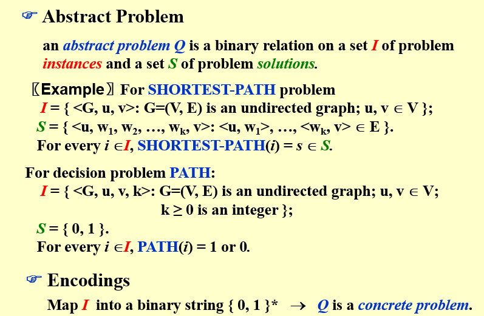

---

- language: 对于 decision problem 来说，language 就是能让问题 Q 的答案为 yes 的输入的集合
    - 直观理解：language 就是问题

- algorithm & problem：都是从输入到输出的映射，但是 problem Q 可以看成是标准答案，而 Algorithm 是自己想的，需要用 problem Q 来检验正确性
- algorithm A decides language L: 正确的要输出正确，错误的要输出错误，两者缺一不可
    - accept 和 reject 表示一个用来解决 decision problem 的算法拿到输入 X 之后输出是正确还是错误。是算法 A 和字符串 X 之间的关系
    - decide：是算法 A 和 language L 之间的关系


e.g. 用 formal language 定义 P 问题（见上面的截图）：P 问题是一堆 language 的集合，这些 language 都有一个多项式复杂度算法 A，A decide L

e.g. 用 formal language 定义 NP 问题
- 首先定义什么是验证算法 verification algorithm：就是以原问题的输入 x 和输出 y 为输入，验证 y 是不是 x 条件下的问题的一个解
    - 看 SAT 的例子，certificate 就是一组解
- 能在多项式时间验证的问题是 NP 问题（从这里可以看出，NP 问题并不要求多项式时间验证某个输出不是问题的解，只需要多项式时间验证某个输出是解就行了）

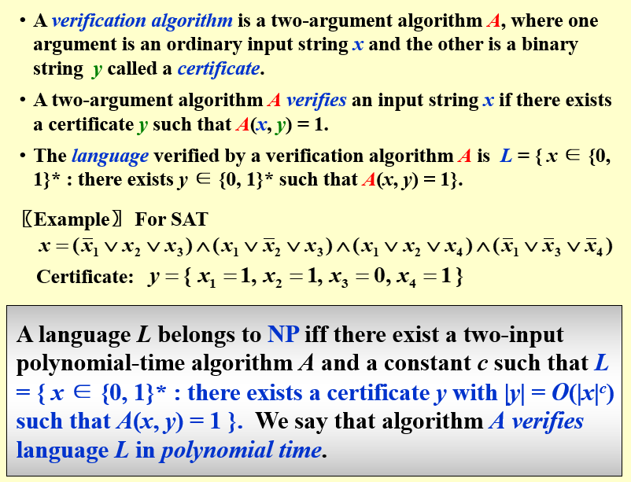

#### reduction

直观上的理解：A 能规约到 B，则 B 应该是比 A 难的。

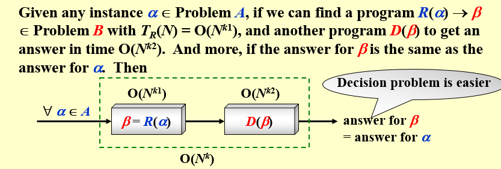

formal language 的定义：


[对规约概念的理解](https://zhuanlan.zhihu.com/p/194313998)

e.g. 把 clique 问题多项式规约到 vertex cover problem，说明后者是 NPC 问题
- clique: 是否存在一个大小为 K 的点集，其中每两个点之间都有连边（即是否存在一个大小为 k 的完全子图）
- vertex cover problem: 能否选出一个大小最大为 K 的点集，使得所有边都至少有一个点在点集里
- 规约方法：G 上大小为 K 的 clique 问题可以规约为 -> $\overline{G}$ 上大小为 |V|-K 的 vertex cover 问题

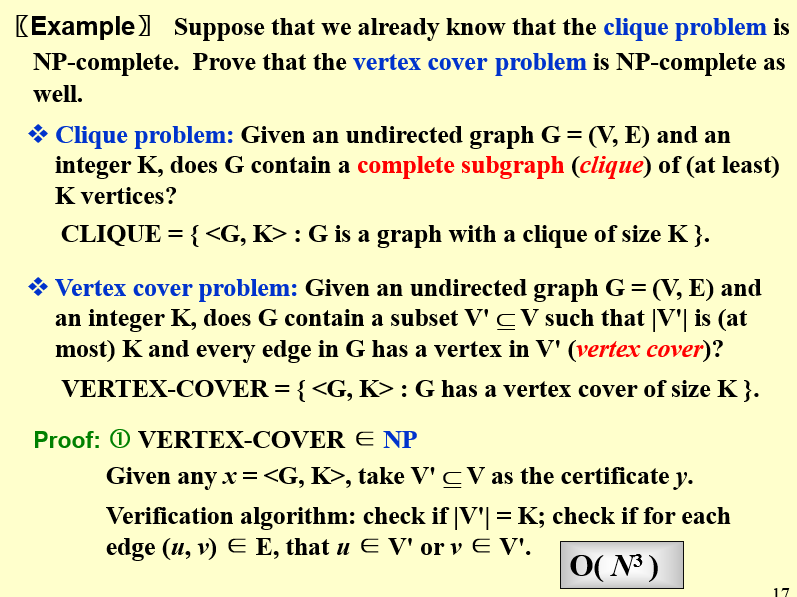


e.g. 3-SAT 可以规约到 CLIQUE，说明后者是 NPC 问题
- 3-SAT：SAT 问题每个 clause 中都有且仅有 3 个 literal

解法是每个 literal 建对应一个点，构造一个 3k 个点的图。同一个 clause 里的点互相不连边，不同 clause 之间除了 $x_i$ 和 $\overline{x_i}$ 不连边之外，其他都连边。在构造的图中选取一个大小为 K 的 clique，相当于在每个 clause 中选一个 literal 为 1，但是不能 $x_i$ 和 $\overline{x_i}$ 同时为 1。

- 理解 - 连边的含义：表示两个 literal 可以兼容
- 大小为 k 的 clique 的含义：k 个 literal 两两兼容，构成 3-SAT 问题的一组解

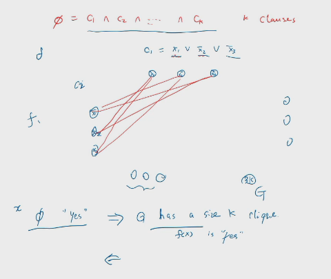

## 近似算法

### 定义

目标：

1. Correctness
1. General-purpose
1. Efficiency

---

- approxiamation ratio: 评价近似算法的结果，$C \leq \alpha C^{*}$
  - 其中 C 是近似解，C* 是最优解

- PTAS(polynomial-time approximation scheme): 在输入 N 的多项式时间内求解
- FPTAS(fully polynomial-time approximation scheme)：在输入 N 和 $\frac{1}{\epsilon}$ 的多项式时间内求解，其中 $1+\varepsilon$ 是近似比。

---

性质：

- 求 approxiamation ratio(minimization problem)：因为精确最优解求不出来，所以需要估计最优解的一个下界，总而得到近似比的上界
    -  $\alpha=\sup_I \frac{C(I)}{OPT(I)}\leq\sup_I \frac{C(I)}{C^*(I)}$，其中 $OPT(I)$ 是理论上的最优解，$C^*(I)$ 是 $OPT(I)$ 的一个**下界**
    - for optimization problem: $\alpha=\sup_I \max\{\frac{C(I)}{C^*(I)}, \frac{C^*(I)}{C(I)}\}$
    
- FPTAS 一定是 PTAS

---

例题：

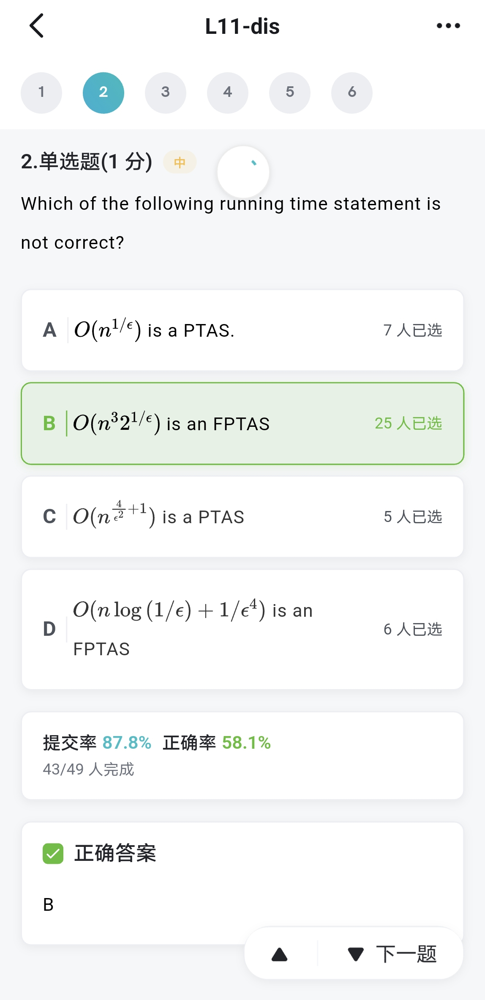

### Bin Packing

#### 问题条件

一堆物体 $\{a_k\}$，箱子大小 L 为给定值。最少需要几个箱子才能把所有物体都装进去。

#### Bin Packing 是 NP-Complete 问题

证明是 NPC：Partition 可以规约到 Bin Packing

什么是 partition 问题？给出一堆数字，把这些数字分成 A 和 B 两个集合，要求 A 中所有数字的和等于 B 中所有数字的和

一个 $\{a_k\}$ 集合的 partition 问题可以转化成，把 $\{a_k\}$ 放到大小为 $\frac{\sum a_k}{2}$ 的箱子里。如果 bin packing 问题的解等于 2，则 partition 问题有解，否则无解

#### 离线算法

1. Next Fit:  Place each item in a single bin until an item does not fit in. When an item doesn’t fit, **close it** and opens a new one.
1. Best Fit: Try to place an item in the **fulles**t bin that can accommodate it. If there is no such bin, open a new one.
1. First Fit: Try to place an item in the **first** bin that accommodates it. If no such bin is found, open a new one.
1. First Fit Decreasing: Same as FF after sorting the items by decreasing order.

---

例题：

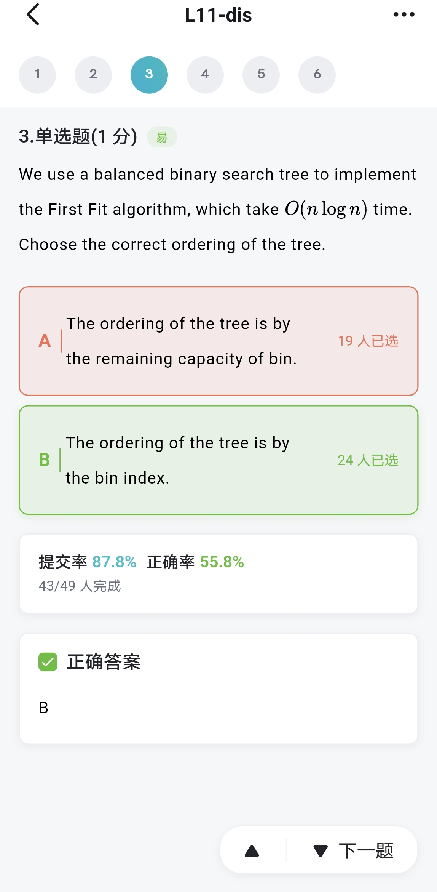

#### 证明 NF 算法的近似比上界

证明 $\alpha\leq 2$：

**相邻两个箱子合并，体积一定大于 1。**如果 NF 用了 2M 个箱子，那么最优解一定大于等于 M+1 ；如果 NF 用了 2M+1 个箱子，那么最优解一定大于等于 M+1 个箱子。

所以 $\alpha \leq \frac{2M+1}{M+1} \leq 2$

---

举例说明 2 是一个 tight 的上界：

物体体积依次为: $\frac{1}{2}, \varepsilon, \frac{1}{2}, \varepsilon, \ldots$，总共有 4N 个物体

如果用 NF 做，则每个箱子里放的都是 $\frac{1}{2}, \varepsilon$，答案为 2N

最优解为所有 $\frac{1}{2}$ 两两一组，所有 $\varepsilon$ 放在一个箱子里，答案为 N+1

在 N 趋向于正无穷的时候，近似比趋向于 2

#### 证明在线算法的近似比下界

证明 $\alpha \geq \frac{5}{3}$

简单版：对于任何一种在线算法，都可以构造一个长度为 5 的序列，使得这种在线算法结果为 5，但是最优解小于等于 3；或者构造一个长度为 6 的序列，使得这种在线算法结果为 5，但是最优解为 4。

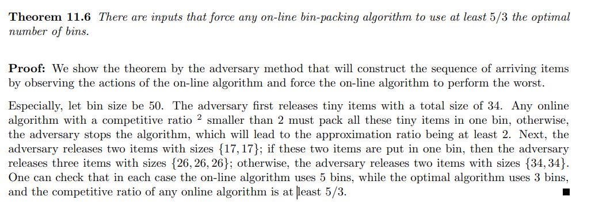

#### 不可近似性 Inapproximability

证明 Bin Packing 不存在 $(1.5-\epsilon)-$approxiamation 的近似算法。

**反证法。**

假设存在 $(1.5-\epsilon)-$approxiamation 算法 ALG。对于一个 partition 问题，令箱子容量为所有物体总体积的一半，转化为一个 Bin Packing 问题。partition 问题有解当且仅当 ALG 的解为 2。因为如果 ALG 的解大于等于 3，精确解就一定严格大于 2，导致 partition 问题无解。

但是 partition 问题是一个 NPC 问题，所以 Bin Packing 是否存在 $(1.5-\epsilon)-$approxiamation 可以规约为 P 是否等于 NP。

（如果假设 P 不等于 NP，则可以说明 Bin Packing 不存在 $(1.5-\epsilon)-$approxiamation）

### KnapSack 背包问题

#### 难度

0/1 背包是 NP-hard：Partition 是 0/1 背包的一种特殊情况

0/1 背包问题描述：有一堆物体，每个物体有体积和权值，给定一个体积为 V 的背包，

#### 贪心算法及其近似比

第一种：按照性价比从大到小选

第二种：按照价值从大到小选

第三种：前两种算法都做一遍，选一个更优的

---

证明第三种 (modified greedy) 的近似比小于等于 2

先找最优解的下界：按照性价比选，如果最后一个放不下了，就切一部分放进去刚好把背包填满，这样的解一定不差于最优解。

令放入最后一个切了一部分的物体之前，背包中的价值为 x，最后放入的为 y，我们有 $OPT\leq x+y,ALG\geq x,ALG\geq y$，即 $ALG \geq \max(x, y) \geq \frac{1}{2}(x+y) \geq \frac{1}{2}OPT$，注意这是个求最大值的问题，所以近似比是 $\frac{OPT}{ALG}\leq 2$

### Load Balancing

#### 定义

问题：只有 n 个箱子，一堆物体，怎么放能够使装物体体积最大的箱子中物体体积最小

难度：partition 问题可以规约为 n=2 的 Load balancing 问题，是 NP-hard

#### 贪心算法

贪心算法：放在当前体积最小的箱子里

定理：近似比等于 $2-\frac{1}{m}$

证明分两步，首先证明近似比小于等于 $2-\frac{1}{m}$，然后证明存在一种最坏情况使得近似比刚好等于 $2-\frac{1}{m}$。

先找最优解下界：$OPT \geq \max \{\max_i a_i, \frac{\sum a_i}{m}\}$

然后假设**总体积最大的箱子**中放最后一个物体之前，箱子中总体积是 x，最后一个物体体积是 y。代入上面的式子估计最优解下界 $OPT\geq \max\{y, \frac{mx+y}{m}\}$

所以 $ALG = x+y = (x+\frac{y}{m}) + (1-\frac{1}{m})y\leq OPT+(1-\frac{1}{m})OPT=(2-\frac{1}{m})OPT$

---

然后构造这么一种情况

m 个箱子，先放了 (m-1)*m 个体积为 1 的物体，最后再放入一个体积为 m 的物体。

贪心算法的解是 2m-1，最优解是 m，近似比为 $2-\frac{1}{m}$

#### LPT 贪心

算法：把所有的物体按照体积从大到小排序，然后再做贪心。

证明 $y \leq \frac{1}{3}OPT$

### K-center

问题描述：给定二维平面上的一些点，要求找出 k 个中心点，使得所有点到最近的中心点的距离的最大距离最小（距离可以有不同的定义）

例题：考察 lecture note 中 11.4.1 节的定理

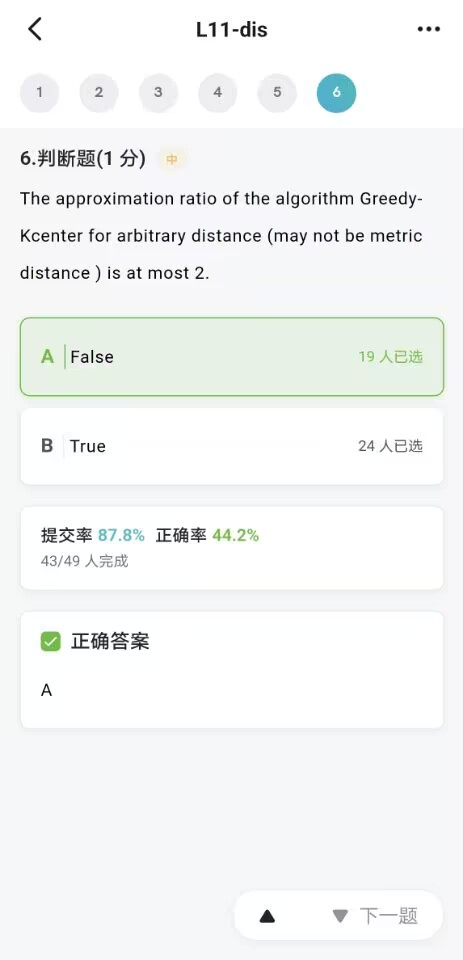

## 局部搜索 Local Search

### 定义和使用场景

- 使用场景：已知一个**可行解**（可能是由近似算法得到的），使用局部搜索寻找可行解的**改进方案**。
- Local：定义 neighbor relation，不断在 neighborhood 中搜索更优的解，直到达到局部极值或者超出迭代次数（具体算法框架如下）

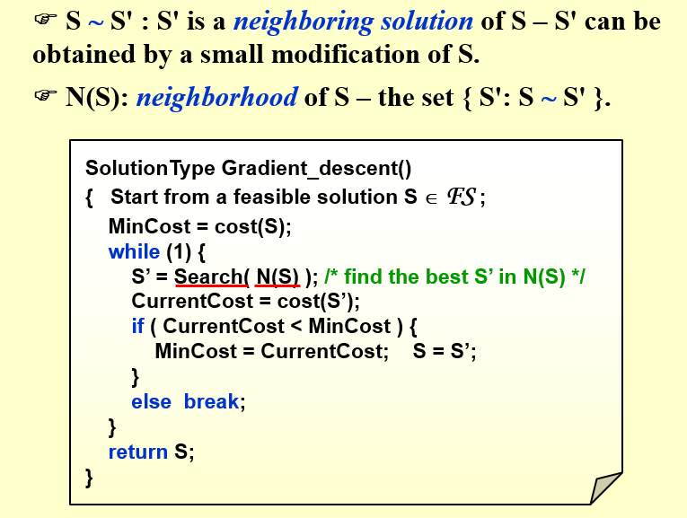

### Vertex Cover

把 decision problem 改写成 optimization problem 的形式：

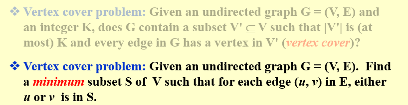

- 初始可行解：S=V
- 迭代寻找更优的 neighbor：每次从 S 中删除一个点
    - 问题 1：如何寻找 neighbor？对于 TSP 问题，可以选出两条边四个点，将平行的边换成交叉的边，即改变了路线的顺序
    - 问题 2：如何评估 neighbor 之间的优劣，选择更优的 neighbor 方向？
    - 问题 3：如何跳出局部最优点？使用模拟退火算法

### 模拟退火

- 温度越高，越容易选择上坡；温度越低，越接近梯度下降
- 降温方法？

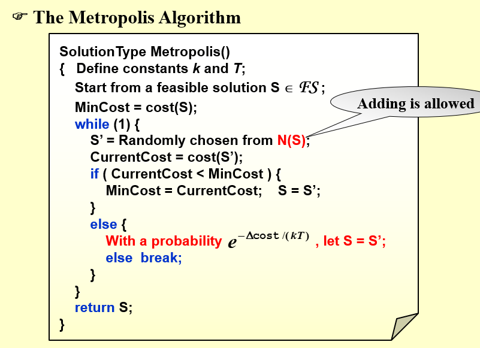

### Hopfield Neural Networks 霍普菲尔德神经网络

问题描述：

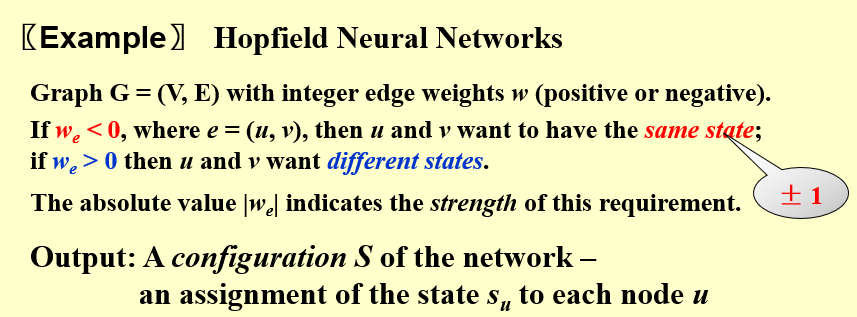

量化定义一个 configuration 的好差程度：

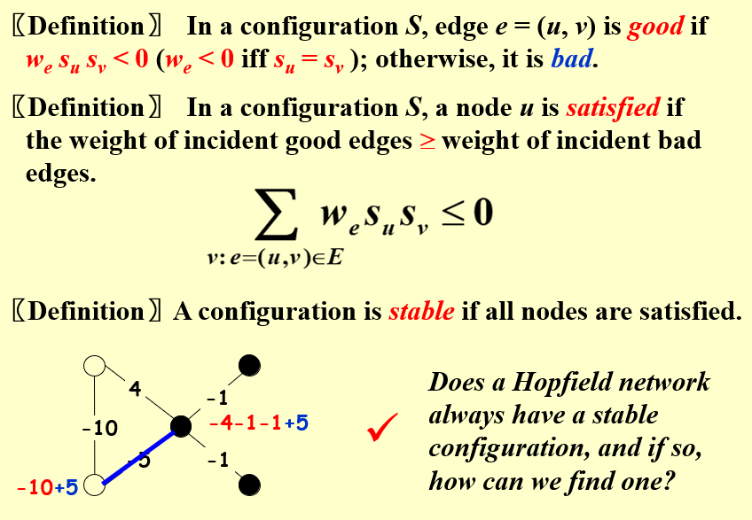

做个例题理解一下 satisfied 和 unsatisfied 的定义：

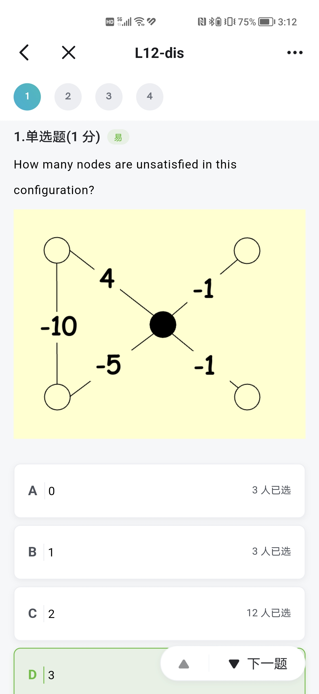

如何找到更好的 neighbor：翻转一个 unsatisfied 的点
- 由此产生的问题：算法会终止吗？

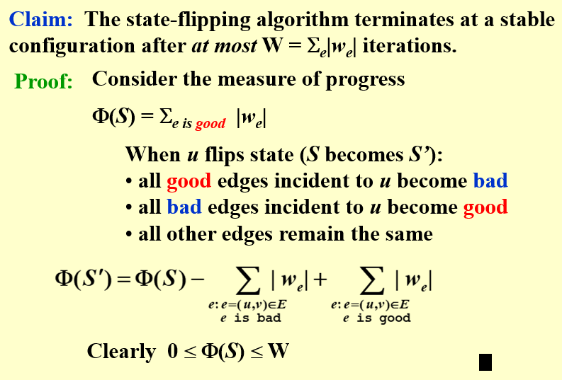

简单理解就是，我们知道最优解的一个下界，即所有边都为 good 的情况；我们也知道局部搜索保证每次迭代一定会更优，否则算法就停下来了。所以局部搜索一定会在有限步达到最优解或者提前停下。

### Maximum Cut 最大割

问题描述以及应用：给定一张图，要求把所有点分到两个集合中，使得跨越两个集合的连边边权总和最大

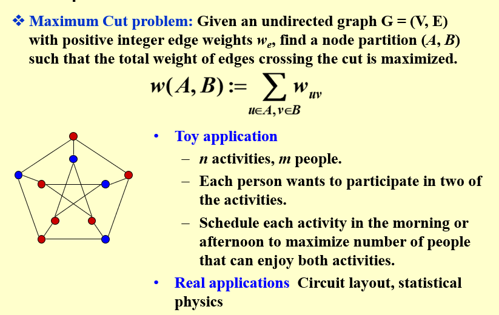

- 初始可行解：随便找一个分割
- 如何找到更好的 neighbor：把某个点变换阵营
- 算法是否会终止？会。因为每次迭代割都会增加，最大不会超过所有边的权重之和
- 局部极值有多好？下面证明一下

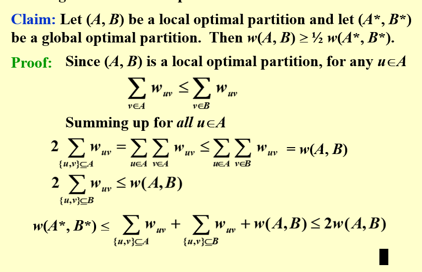

1. 为什么 $\forall u\in A, \sum_{v\in A}w_{uv}\leq \sum_{v\in B}w_{uv}$ ? 如果不满足这个性质，把 u 换到 B 里一定可以获得一个更大的割
1. 然后就是把最优解放缩到所有边权之和

---

最大割相关的近似算法：（有空可以看看）

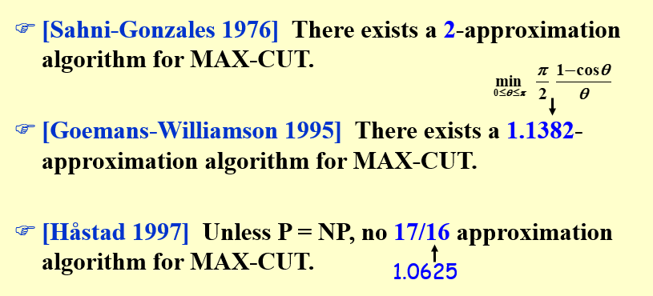

### Local Search 的优化策略

证明以最大割为例

1. big-improvement-flip

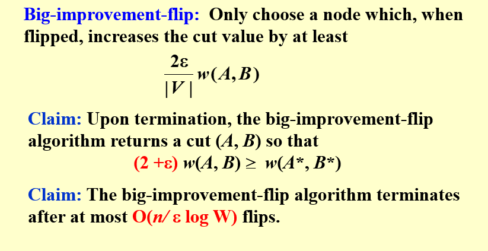

证明中把 $\varepsilon$ 前面那个 2 去掉，毫无意义，看着实在太难受了。

证明：$\forall u\in A, \sum_{v\in A}w_{uv}\leq \sum_{v\in B}w_{uv}$ 这个结论换成

$$
\forall u\in A, \sum_{v\in A}w_{uv}\leq \sum_{v\in B}w_{uv}+\frac{\varepsilon}{n}w(A,B)
$$

所以有

$$2\sum_{\{u,v\}\in A}w_{uv}=\sum_{u\in A}\sum_{v\in A}w_{uv}\leq \sum_{u\in A}\sum_{v\in B}w_{uv}+\frac{\varepsilon}{n}\sum_{u\in A}w(A,B)$$

另一边也同理，

$$
2\sum_{\{u,v\}\in B}w_{uv}=\sum_{u\in B}\sum_{v\in B}w_{uv}\leq \sum_{u\in B}\sum_{v\in A}w_{uv}+\frac{\varepsilon}{n}\sum_{u\in B}w(A,B)
$$

两式相加，后面那项刚好有 n 个 $w(A,B)$ 累加，和分母的 n 抵消掉，

$$
2(\sum_{\{u,v\}\in A}w_{uv}+\sum_{\{u,v\}\in B}w_{uv})\leq (2+\varepsilon)w(A,B)
$$

所以最后公式就变成了

$$
w(A*,B*)\leq (2+\frac{\varepsilon}{2})w(A,B)
$$

证明：每次 flip 至少增加 $1+\frac{\varepsilon}{n}$ 倍，又因为 $(1+\frac{\varepsilon}{n})^{\frac{n}{\varepsilon}}\geq 2$，所以经过 $\frac{n}{\varepsilon}$ 次翻转之后，价值一定会翻一倍。所以最终复杂度为 $O(\frac{n}{\varepsilon}\log W)$。

2. k-flip：在最大割问题中，就是相邻 k 次翻转的点互不相同

## 随机算法 Randomized Algorithms

对什么做随机？
1. 随机输入：可以测试平均情况下的效率
1. 随机算法：
    - 以大概率给出正确解 (Monte-Carlo)
    - 总是能得到正确解，在期望下时间复杂度低 (Las Vegas Algorithm)

### The Hiring Problem

目标：雇佣到的价值最大的人价值尽量大

#### Naive solution in randomized input case

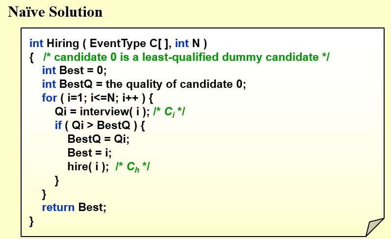

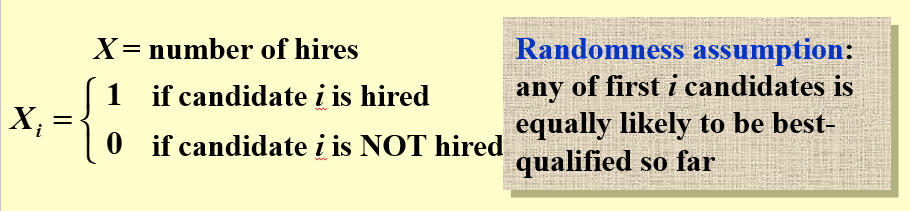

$$E(X)=E(\sum_{i=1}^n X_i)=\sum_{i=1}^n E(X_i)=\sum_{i=1}^n\frac{1}{i}=\ln N+O(1)$$

#### 离线随机算法

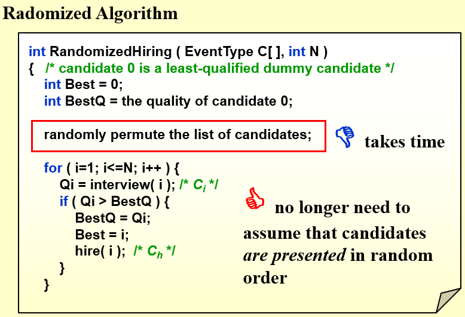

解决 naive 算法对输入的要求

#### 只雇佣一个人的在线算法

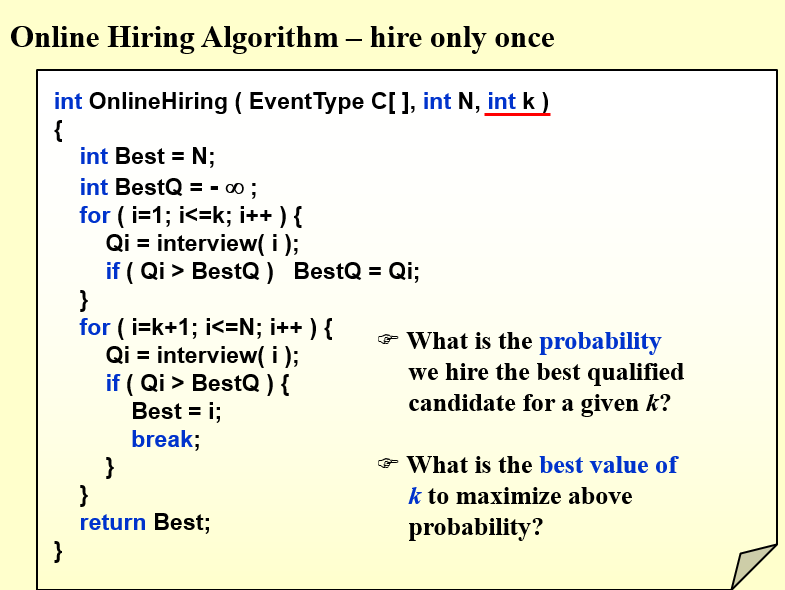

前 k 个人用于估算平均水平。

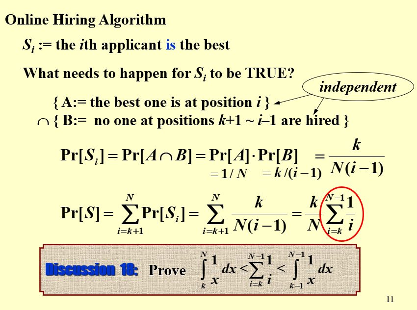

$\frac{k}{i-1}$ 的解释：假设是每个人成为最大的概率相等，所以前 i-1 个人中最大出现在前 k 个的概率就是 $\frac{k}{i-1}$

然后用公式估算出 Pr[S] 的范围

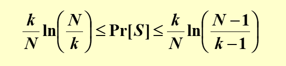

对 $f(k)=\frac{k}{N}\ln(\frac{N}{k})$ 求导，发现 $k=\frac{N}{e}$ 的时候取到最大值

### 快速排序

pivot 的选取方法不同将导致算法效率不同

#### central splitter

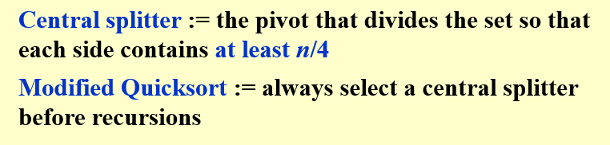

如何选 pivot：保证选取的 pivot 一定在原序列的 25% 到 75% 位置

如何找 central splitter：随机找一个数，用 $O(N)$ 线性扫描判断这个数是不是 central splitter。期望通过 2 次线性扫描找到 central splitter。

假设在第 $X$ 次找到 central splitter，易知 $X\sim GE(\frac{1}{2})$ 服从几何分布，$E(X)=\frac{x}{(1-x)^2}=2$，所以找 central splitter 是 $O(N)$ 的

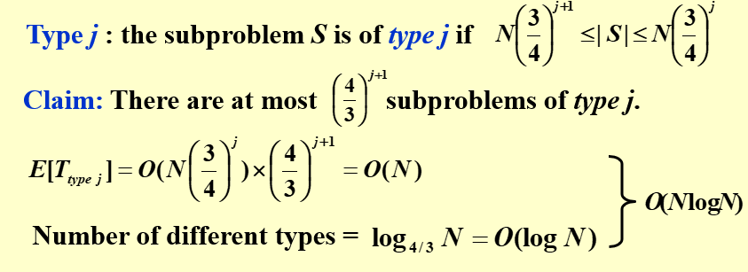

注意：$O(N\log N)$ 是期望复杂度

#### Randomized Quicksort

如何选 pivot：随机选择

如何近似计算复杂度：用比较次数表示时间复杂度。

假设 $X$ 是总的比较次数，$X_{ij}$ 是 i 和 j 交换的次数，其中下标满足 $a_1\leq a_2\leq ... \leq a_N$。

$a_i$ 和 $a_j,i<j$ 在两种情况下会交换：
1. $a_i$ 被选为 pivot，并且此时 $a_j$ 和 $a_i$ 在同一个子序列中
1. $a_j$ 被选为 pivot，并且此时 $a_i$ 和 $a_j$ 在同一个子序列中

$a_i$ 和 $a_j$ 在同一个子序列中，当且仅当 $a_i, a_{i+1}, ..., a_{j-1}, a_j$ 都没有被选做 pivot，否则这两个元素会被分到两个不同的子序列中。**所以 $X_{ij}=1$ 等价于“在 $a_i, a_{i+1}, ..., a_{j-1}, a_j$ 中第一个被取走的元素是 $a_i$ 或者 $a_j$”**，其概率为 $P(X_{ij})=\frac{2}{j-i+1}$，所以

$$E(X)=\sum_{i=1}^{n-1}\sum_{j=i+1}^{n}E(X_{ij})=\sum_{i=1}^{n-1}\sum_{j=i+1}^{n}\frac{2}{j-i+1}=2\sum_{i=1}^{n-1}\sum_{j=2}^{n-i+1}\frac{1}{j}=O(N\log N)$$

### 最大割问题

随机算法：每个点分别以 $\frac{1}{2}$ 的概率分配到两个点集中。

证明： $E[w(A, B)] \geq \frac{OPT}{2}$

假设 $X_{uv}=1/0$ 表示 u 和 v 不在 / 在同一个集合中。$E(X_{uv})=P(X_{uv})=\frac{1}{2}\cdot\frac{1}{2}+\frac{1}{2}\cdot\frac{1}{2}=\frac{1}{2}$，总共就四种等概率的情况，其中两种是在同一个集合中，两种是不在同一个集合中。所以

$$E[w(A, B)]=\frac{\sum e}{2}\geq \frac{OPT}{2}$$

### 最大 3-SAT 问题

问题：要求 $c_1\wedge c_2\wedge ...\wedge c_k$ 尽量多的子句为真

随机算法：每个随机变量都以 $\frac{1}{2}$ 的概率为真或者假。

结论：
1. 为真的子句数量期望值为 $\frac{7}{8}k$
1. $P(X\geq \frac{7}{8}k)\geq \frac{1}{8k}$

证明结论1：每个子句都以 $1-\frac{1}{2}^3=\frac{7}{8}$ 的概率为真，虽然不同子句之间不独立，但是期望的线性性永远满足，期望相加即可。

证明结论2：

设 $P_i$ 表示有 i 个子句为真的概率

$$
\begin{align*}
\frac{7}{8}k=E(X)&=\sum_{i=1}^{\lceil\frac{7}{8}k\rceil-1}i\cdot P_i+\sum_{i=\lceil\frac{7}{8}k\rceil}^{k}i\cdot P_i\\
&\leq (\frac{7}{8}k-\frac{1}{8}) \sum_{i=1}^{\lceil\frac{7}{8}k\rceil-1} P_i + k \sum_{i=\lceil\frac{7}{8}k\rceil}^{k} P_i\\
&\leq (\frac{7}{8}k-\frac{1}{8}) \cdot 1 + k \sum_{i=\lceil\frac{7}{8}k\rceil}^{k} P_i
\end{align*}
$$

其中 $\frac{7}{8}k-\frac{1}{8}\geq \lceil\frac{7}{8}k\rceil-1$ 是因为 k 是正整数，$\lceil\frac{7}{8}k\rceil\leq \frac{7}{8}k+\frac{7}{8}$

## Parallel Algorithms 并行算法

### Parallel Random Access Machine (PRAM)

意思就是一块内存支持多端口并行读写

类似于数据库的并发控制，PRAM 也可以有多种锁的机制：
1. Exclusive-Read Exclusive-Write (EREW)
1. Concurrent-Read Exclusive-Write (CREW)
1. Concurrent-Read Concurrent-Write (CRCW)

---

举个例子：求序列和，假设有足够多的核可以使用

并行计算的结构如下。PRAM model 的做法是第一个单位时间先并行把第一层 $B(0,i)$ 都算完，然后第二个单位时间再用一半的核去做第二层的计算，第三个单位时间以此类推。

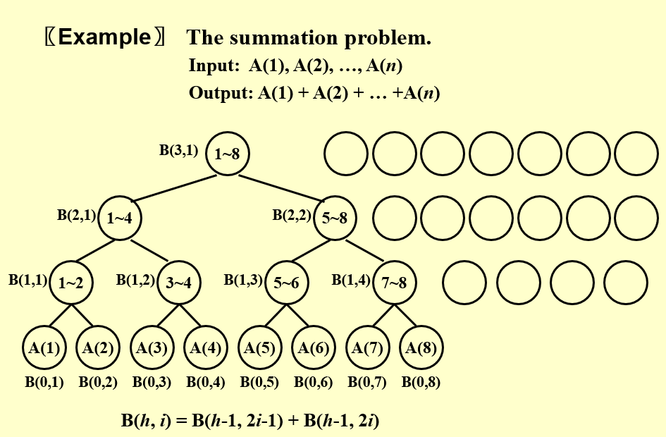

伪代码如下：

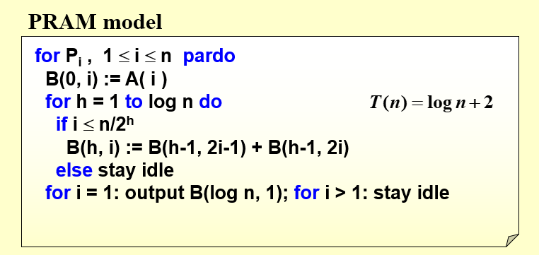

其缺陷主要在于这句 `stay idle`，表示只用部分的核，其他核等待。越到后面就有越多的核是弃用的，导致总体效率不高。

### Work-Depth (WD)

WD 的做法是：仍旧使用 PRAM 的树结构，但是从下到上，从左到右扫描所有树节点，只要有核空下来了并且节点的前驱节点都算完了，就让这个核去做下一个节点的计算。

WD 的扫描顺序相当于 DAG 的其中一种拓扑排序。WD 可以保证核的使用率一直处在一个较高的水平。

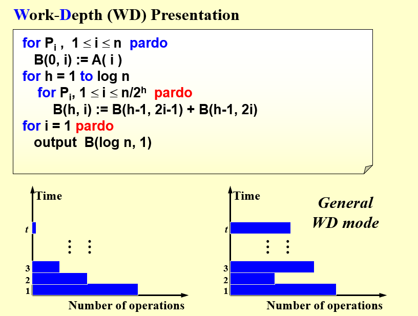

---

性能评价指标：
1. work load $W$
1. worst-case running time
    - $T_1$: 只有一个核，$T_1=W$
    - $T_p$: 表示使用 p 个核的时候的最坏运行时间
    - $T_{\infty}$: 有足够多的核可供使用

然后有一个性质：$$T_p=\frac{W}{p}+T_{\infty}$$

推导很简单，假设有无穷多个核的时候，每个单位时间执行了 $w_i$ 的 work load，如果只有 p 个核，那么 $$T_p=\sum_{i=1}^{T_{\infty}}\lceil\frac{w_i}{p}\rceil\leq\sum_{i=1}^{T_{\infty}}(\frac{w_i}{p}+1)=\frac{W}{p}+T_{\infty}$$

这个性质对于 PRAM 和 WD 都成立。且在表达式中 $\frac{W}{p}$ 是 dominate 的。

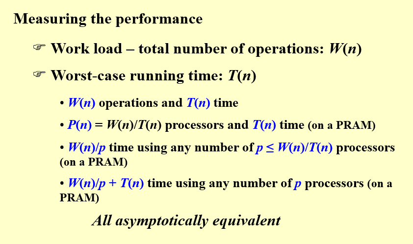

### 举例：前缀和

算法是从下往上算 B，再从上往下算 C。其中 B 就和前面求和一样，是整棵子树所有叶子节点的权值和。而 C 是从 0 到子树中最右的叶子的前缀和。

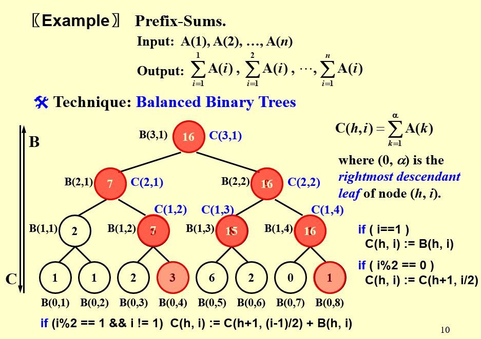

伪代码长这样：

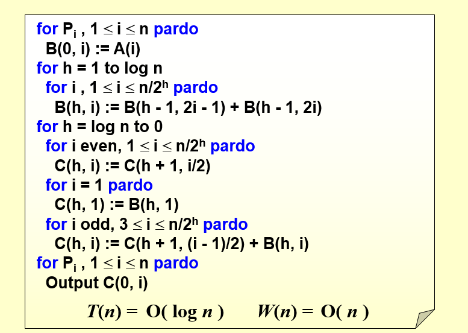

### 举例：合并序列

这张图里有：
1. 问题描述
1. 简化问题的假设（assume）
1. 解决问题的思路：partition

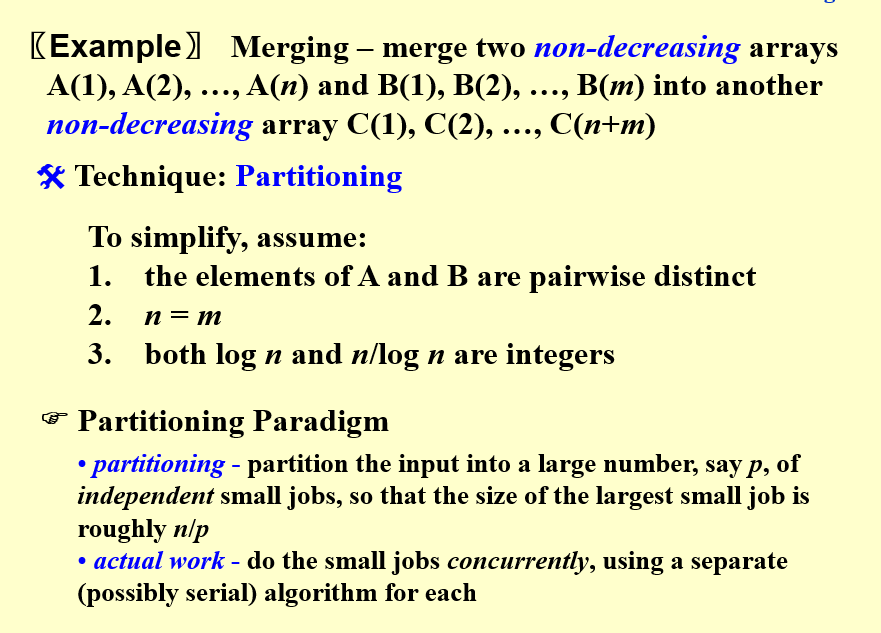

---

把 merging 问题转化为 ranking 问题：

先假设我们知道 $RANK(i,A)$ 和 $RANK(i,B)$，只要 $O(1)$ 就可以合并

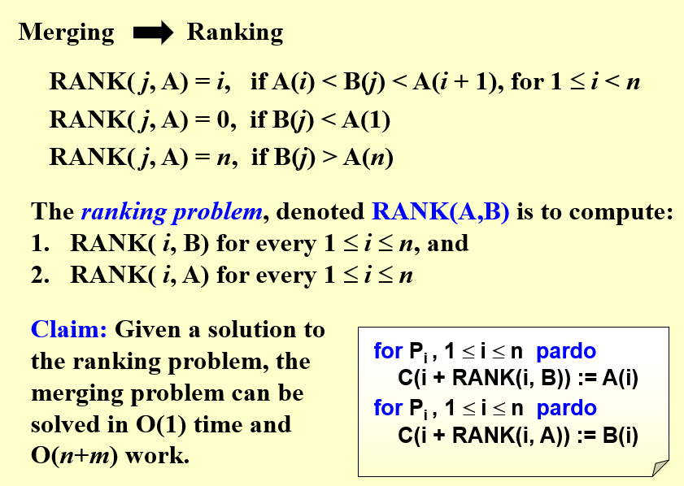

---

然后来计算 $RANK$，naive 的思路是用二分查找，虽然 work load 增加了，但是 running time 减少了

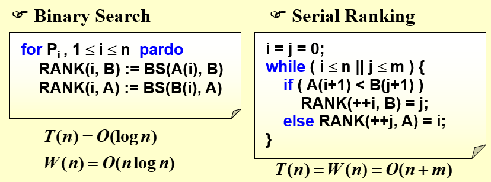

---

parallel ranking

1. 先从上下两个序列都选出部分节点进行线性的排序。
1. 因为红线和蓝线不会交叉，我们分出了 p 个子问题。使用线性扫描，并行解决这些子问题。

可以在图片右边看到两个过程的 T 和 W

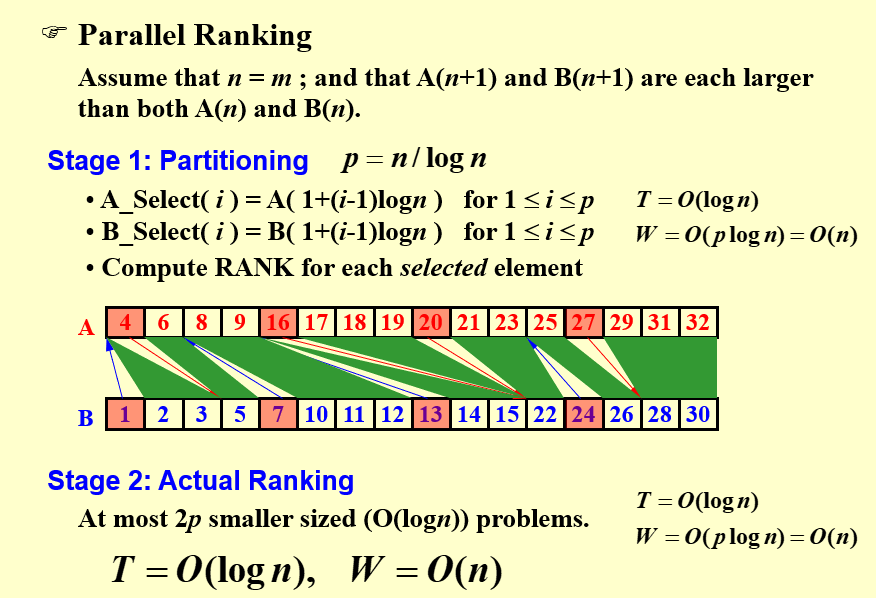

---

> [TODO] 用主定理计算 T(n)=T(n/2)+O(log n) 的时间复杂度

使用 parallel merging 的归并排序，$T(n)=O(\log^2 n)$, $W(n)=O(n\log n)$

### 举例：求最值

第一种算法：和序列和类似的
第二种算法：两两比较，虽然增加了 work load，但是减少了运行时间
- 怎么解决写冲突：允许并行写，因为我们只需要 $B(i)=0$ 的那个元素为 0，其他不为 0，具体是什么值并不关心。

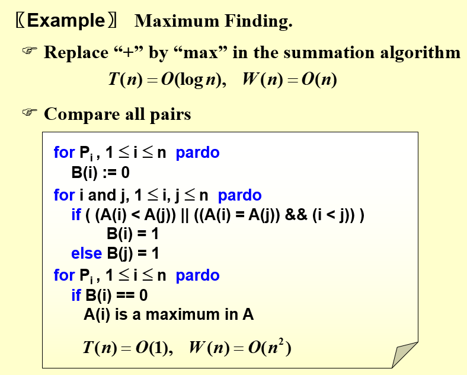

---

第三种算法：递归

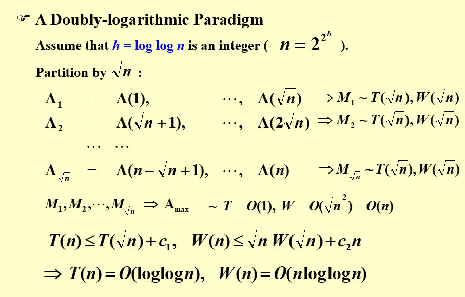

> [TODO] 用主定理计算一下

$T(n)$ 的推导：可以使用递归树简单理解

$W(n)$ 的推导：换元，套主定理

---

第四种算法：还是递归，但是换了个更优的分割

分成 h 个子问题并行求解，最后再用 $O(h)$ 的时间串行把所有答案合并起来。

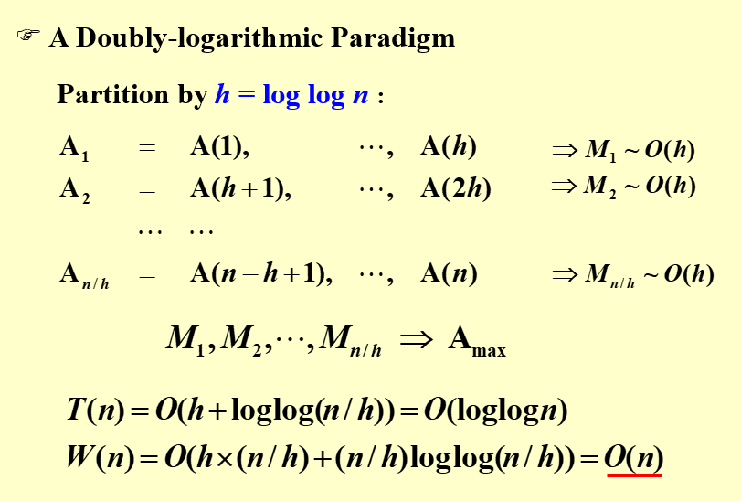

---

第五种算法：random sampling

算法流程：
1. 先随机选 $n^{\frac{7}{8}}$ 个元素出来
1. partition 成 $n^{\frac{3}{4}}$ 个小块，每块大小为 $n^{\frac{1}{8}}$，块内使用两两比较的算法，得到 $n^{\frac{3}{4}}$ 个结果
1. 再把这 $n^{\frac{3}{4}}$ 个结果 partition 成 $n^{\frac{1}{2}}$ 个小块，块内使用两两比较的算法，每块 $n^{\frac{1}{4}}$ 个结果
1. 最后得到的 $n^{\frac{1}{2}}$ 个结果再用两两比较的算法合并起来

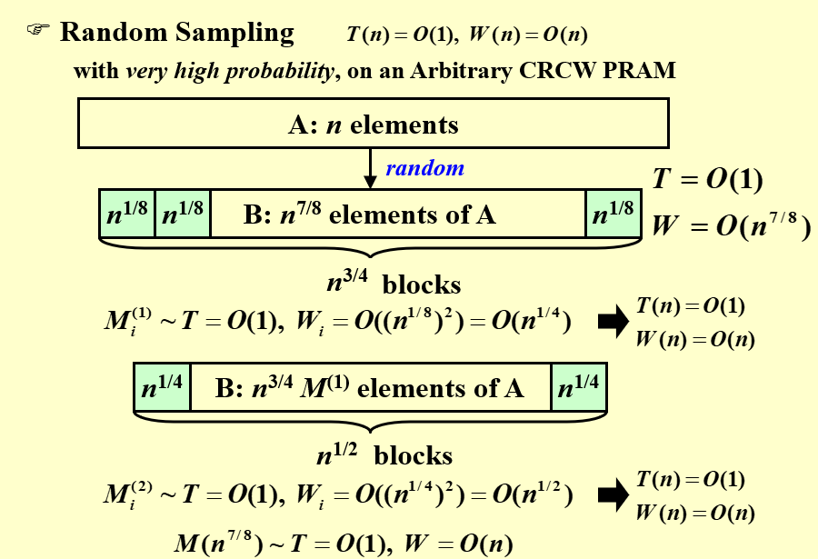

定理的意思是：多重复几次算法流程，较大概率给出正确解

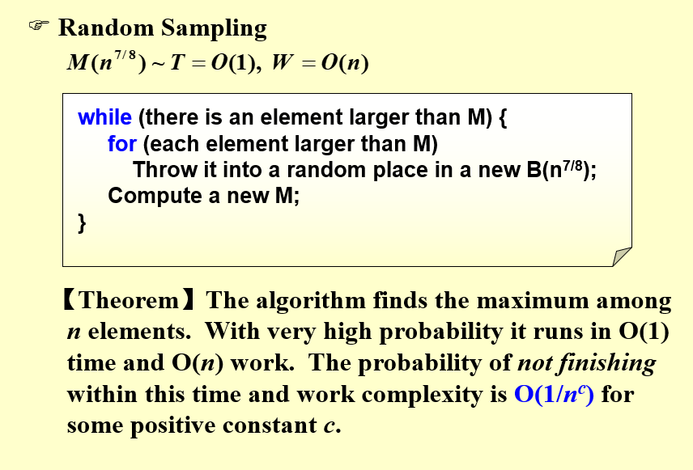

## external sorting 外部排序

### 考点总结

1. run & pass & tape 概念
1. uneven split 斐波那契数列
1. 计算 number of passes & number of runns
1. replacement selection 生成超过内存大小的 run
1. 哈夫曼树合并不同长度的 run

### 问题条件 & 基本算法

条件：

1. 数据 > 内存容量
1. 存储介质为磁带，只支持顺序读写，但磁带有多个
1. 内存一次只能排序三个数据

概念：

1. run: 一段被排好的数据（在图中一个 run 的长度为 M=3）
1. pass: 把磁带从头到尾读一遍（在图中第一个 pass 把 T1 中的数据）

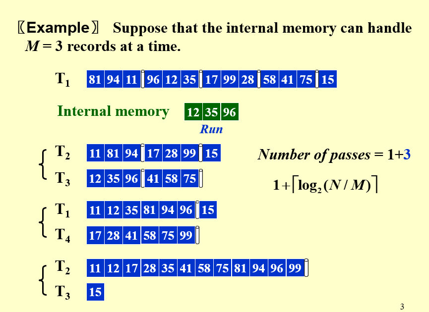

number of passes 怎么计算？
1. 1 是把原数据划分成初始的 run
1. 后面的 log 是把小 run 合并成大 run

### 优化 pass 数量：k-way merge

要求：
1. 2k 个磁带
1. 能排序 k 个数据的内存

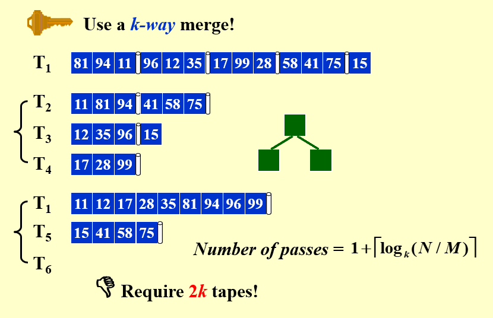

### 优化磁带个数：unevenly split

要求：只用 3 个磁带

基本算法中 merge 的结果分别写到两个磁带中，为了减少磁带数量，可以先写到一个磁带里，再花一个 pass 读到两个磁带里。

---

再优化：

如果 number of runs 是一个斐波那契数 $f(n)$，则分到两个磁带中，run 的个数分别是 $f(n-1)$ 和 $f(n-2)$。

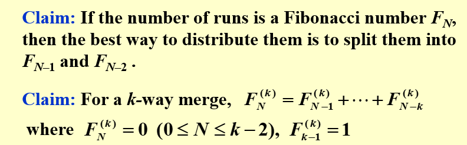

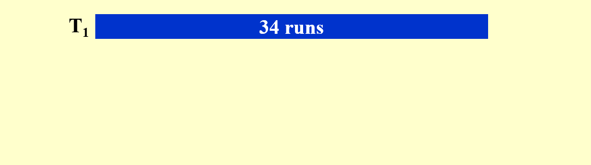

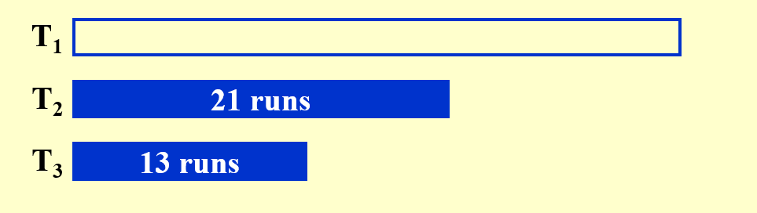

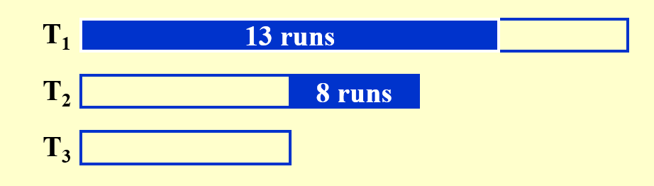

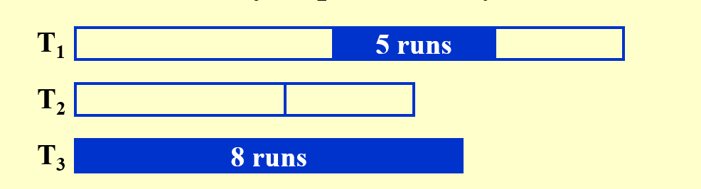

---

再优化：

3-way merge 怎么应用上面的 uneven split？

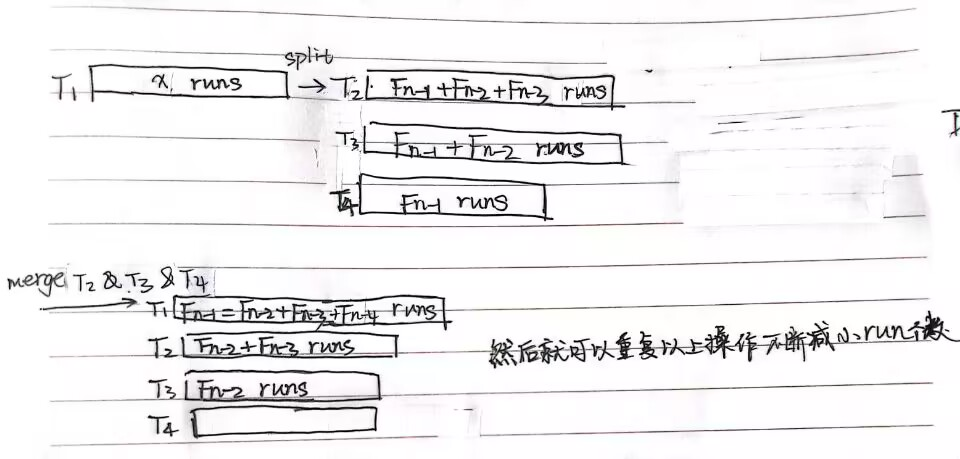

### i/o buffer

基本想法：2 个 input buffer，1 个 output buffer，就可以满足 2-way merge 的需求

减少 CPU 和磁盘读写的等待：4 个 input buffer，2 个 output buffer

支持 k-way merge：2k 个 input buffer，2 个 output buffer

内存大小有限，buffer 越多，block 越少。

### 优化 run 的长度: replacement selection

在内存中维护一个小根堆，每次把堆顶放到 run 里，再读入一个数据。如果读入的数字小于 run 里最大的数字，就把这个数字冻结（放在内存里但是不放在堆里，堆大小减一）。

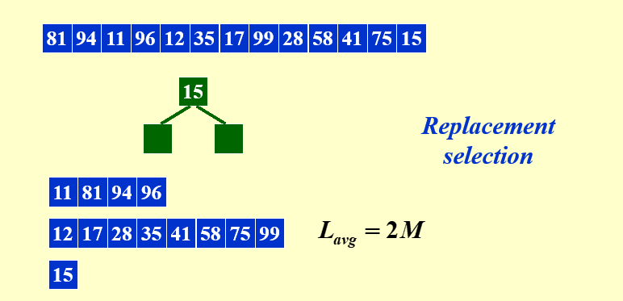

如果原序列已经接近有序，则效果会比较好。

### 不同长度的 run 合并，最小化复杂度：哈夫曼树

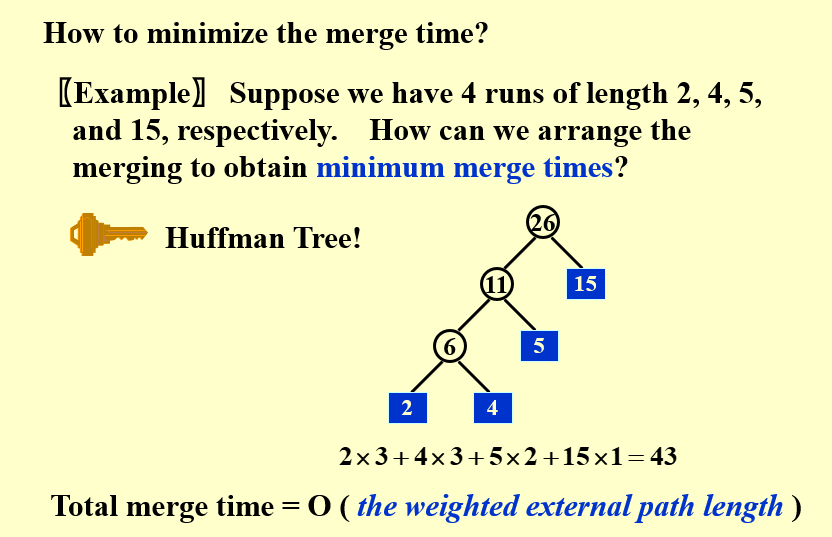


## 错题整理

### AVL

1. 依次插入 `42, 26, 8, 70, 102, 56, 2`，经过几次旋转分别是什么旋转？

答案：LL, RR, RL, LL

考察 AVL 树的旋转操作。

2. 

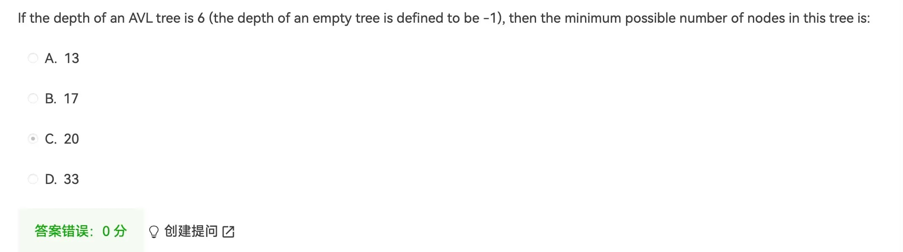


### 摊还分析

1. 

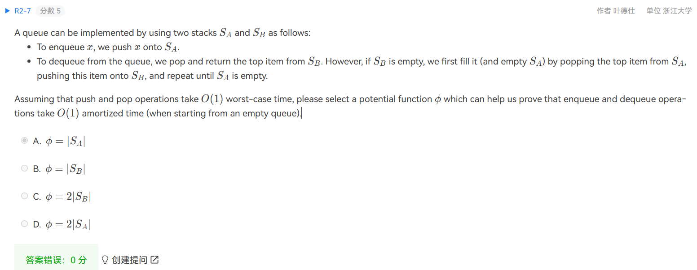

注意出栈和入栈都算一次操作，所以要两倍。

**摊还分析做题策略：** 先把每个操作的实际复杂度算出来，对于复杂度高的操作，通过势能方法或者记账方法降低其均摊价值。

势能分析的势能函数设置，目标是通过降低势能的方法，把单次复杂度很大的操作，复杂度减到和摊还复杂度相等。

### 红黑树

1. 


第一空：Right **大小写** 搞错了。

第二空：`IsRBTree(T->Left) && IsRBTree(T->Right)` 注意递归定义的数据结构不出意外肯定要 **递归地判断**，不然这里为什么不直接写一个 else

### B+ Tree

1. 


考定义，注意节点的儿子或元素个数**下限**。


### Inverted Index

1. 

When evaluating the performance of data retrieval, it is important to measure the relevancy of the answer set.

F

区分 data retrieval 和 information retrieval，前者是从数据库中取数据，强调速度。


2. 

Relevance quality of a returned document is judged against all the query terms in the given query.

F

不是所有 term 都比较，需要去除 stop words


### 斜堆

1. 依次插入 1 to $2^{k−1}$，得到的树是什么形状？反过来插得到的是什么形状？

从小到大插，一定是插入到右路径的最底下，然后整条右路径翻转。从大到小插，一定是插在根的位置，再把整条链旋转到左边。

### binomial queue

1. To implement a binomial queue, the subtrees of a binomial tree are linked in increasing sizes.

False. 

### 主定理

1. 

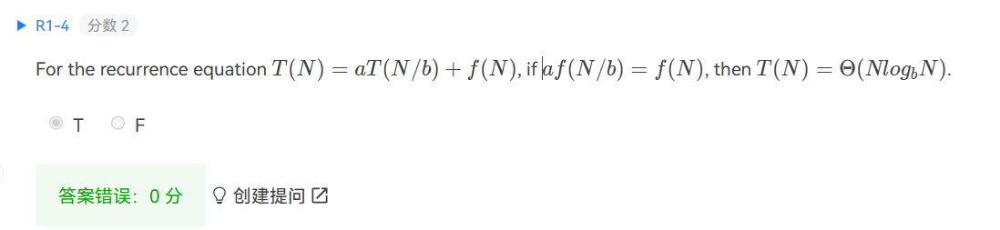

主定理背公式

2. 

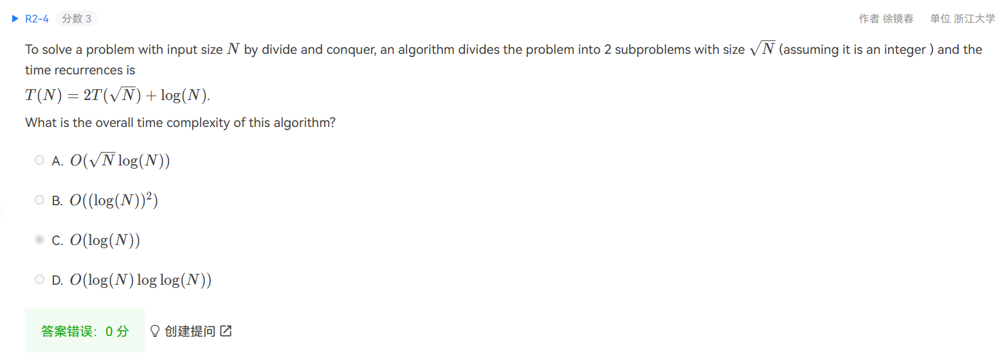

考察公示变形，令 $x=\log N$，令 $T(N)=T(e^x)=F(x)$

### $\alpha-\beta$ 剪枝

1. 描述：什么情况下会进行剪枝？

2. 


### 贪心

1. The encoding of a symbol a is a prefix of that of another symbol b iff the node labeled a is an ancestor of the node labeled b.

True。

### NP-completeness

1. 

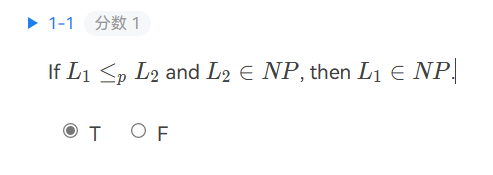

规约说明了 L1 比 L2 简单，所以 L1 一定也是一个 NP 问题。

但是不能说明 L1 是否是 P 问题。这就是 P=NP 要解决的问题了（喜

2. 


注意 C 选项，Q 不是 P 说明了 NPC 也不是 P，所以所有 NP 问题都不是 P 问题。可以使用反证法，如果 NPC 是 P 那么所有的 NP 问题都是 P 问题，和 Q 不是 P 问题矛盾。


### 近似算法

1. 

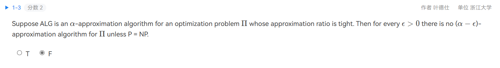

近似算法可能有很多种，tight 仅说明对于本算法 $\alpha$ 是上确界（构造一组输入使近似比恰好为 $\alpha$），但并不能说明不存在别的算法近似效果比当前算法好

2. 

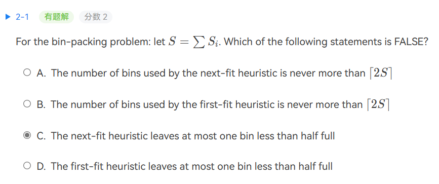

A 跟证明 NF 是 2-approximation 思路差不多。因为 NF 相邻两个 bin 的总体积之和一定大于 1，所以如果有 N 个 bin，总体积 $S \geq \lfloor \frac{N}{2}\rfloor$

B 跟上面一样证明

C 因为一旦放不下就会被永久舍弃，所以可以构造这么一个序列 `{0.4, 0.7, 0.4}` 这就有两个不到一半的

D 只要有两个不到一半的就一定会被合并

3. 

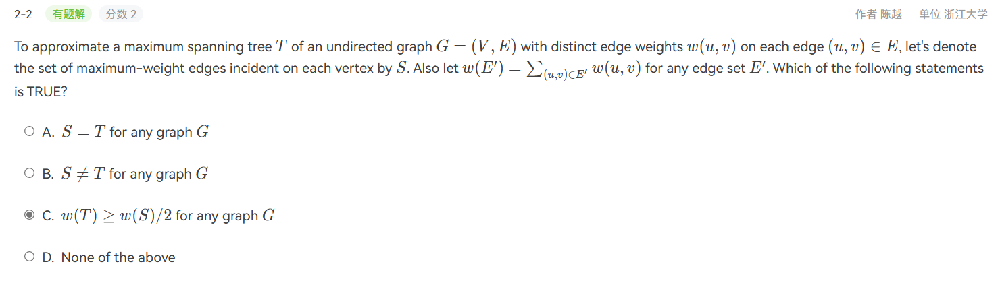

A + B 两种情况都有可能出现。
- 如果原图是一条链，且每条边长度单调，那么有 S=T
- 如果原图有两条没有公共点的边，且他们的权值都大于所有其他边，那么 $|S|\leq |V|-2<|V|-1=|T|$，显然两者不可能相等

C 

1. $S\subseteq T$。可以使用反证法，如果有边 e 是点 s 的最大边，但是不在树上，加上 e 构成的环上与 s 相连的另一条边是 d，那么用 e 换 d 一定能得到一棵更大的树。
2. $|T - S|\leq |V|/2 \leq |S|$。因为每条边最多是两个点的最大边，所以 $|S|\geq |V|/2$，根据结论 1 可知 $|T-S|=|V|-1-|S|\leq |V|/2\leq |S|$
3. $\forall d, e\in T-S, d\neq e$，a，b 分别是最大生成树上 d, e 连接的两个点中深度更大的点，则 a 和 b 的最大边不是同一条。用反证法证明，因为 a 和 b 是树上两条不同的边的更深的节点，所以 a 和 b 之间的边不是树边，但是 a 和 b 的连线是一条最大边，根据结论1，必须是一条树边。矛盾。
4. 对于 T-S 中的任意一条边 $e_i, 1\leq i\leq m$，可以在 S 中找到两两不同的 $d_i, 1\leq i\leq m$ 使得 $\forall i, e_i\leq d_i$。构造 $\{d_i\}$ 的方法就是对于每条 $e_i$ 取其深度较深点的最大边作为 $d_i$。
5. $w(T-S)\leq w(S)$。由结论 4 得到。
6. 最终，$w(T)=w(T-S)+w(S)\leq 2w(S)$

---

4. 

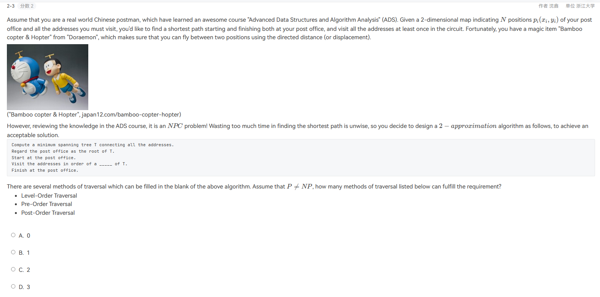

性质：首先，因为这里使用欧式距离，我们有三角形两边之和大于第三边的性质，即 $w(a, b)\leq w(a, c, d, ..., b)$，假如 a 和 b 在树上没有连边，可以看成是走树上的路径从 a 到 b

pre-order: 假设最小生成树的所有边权之和为 T，则最优解 $OPT > T$，而先序遍历最坏情况下就是每条边走两次——下一次上一次，得到的答案是 $PRE\leq 2T$，所以是一个 2-approximation

post-order: 同上

level-order: 构造这么一种情况，所有地点都处在一条直线上，而起点位于中间。那么构造出的生成树也是一条链，但是 level-order traversal 会导致 post officer 在 post office 两边左右横跳，显然结果可以超过两倍的最优解。

---

5. 

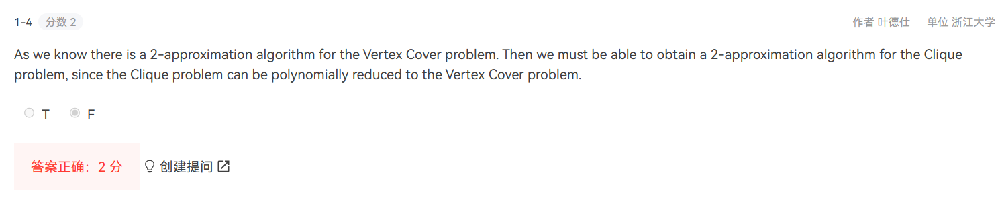

多项式规约对近似比没有约束。Clique 的大小和 Vertex Cover 的大小相加等于图上总点数，规约产生的 Clique 的近似比与图的总点数相关，并不是常数。

### Local Search

1. 

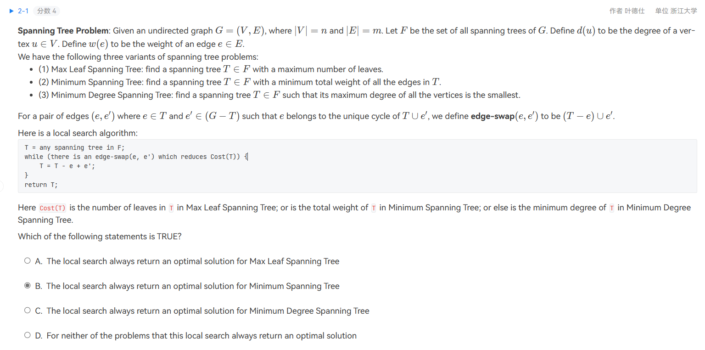

A. 构造一种情况，单次换边不能得到更优解，但是多次换边可以

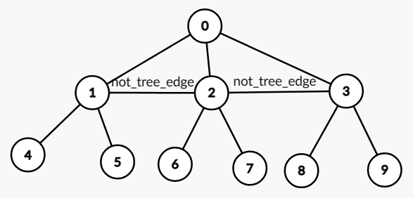

C. 还是构造单次换边不能得到更优解，但是多次换边可以的情况。local search 找不到最优解的原因就在于跳不出局部最值，利用这一特点去构造。在 minimum degree 中，只要有两个点卡住最大度数且彼此间没有连边，就一定不可能只换一条边得到更优解。


---

2. 

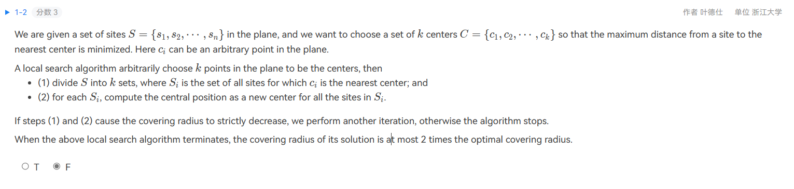

有一个非常简单的反例：n 个点分布在圆周上，k=n，初始 k 个中心点都选在圆心上。初始状态就是局部最优，答案为圆的半径，但是显然最优解是 0。

这题的难点是看出结论不对，然后往找反例的方向去思考。如果想着证明这条结论那就没救了。

### 随机算法

1. 

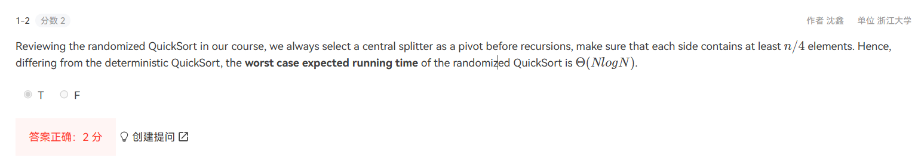

注意：**worst case expected running time** 的含义，对于每一个输入有一个 expected running time，然后在所有输入的 expected running time 里取最大的就是 worst case expected running time

---

2. 

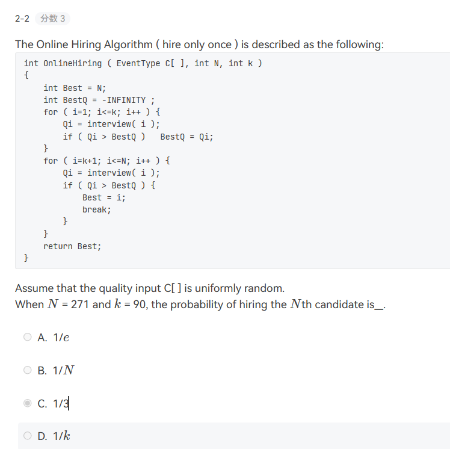

P(雇佣第 N 个人) = P(前 N-1 个人中的最大值是前 k 个人中的一个) = $\frac{k}{N-1}=\frac{1}{3}$

### external sorting

1. 

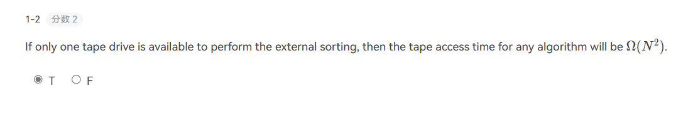

每读或者写一个数据都得绕磁带一圈，假设每个算法至少得把所有的数据读出来一次，所以就是 $\Omega(N^2)$，big omega 表示下界。