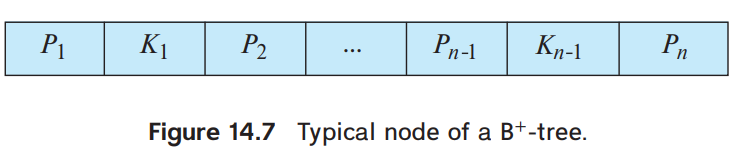

# 高级数据结构

[TOC]

## intro

1. 评分标准
    - Homework（作业） 10%
    - Discussion（讨论） 10%  
    - Research Project（大程） 30%
    - Mid Exam（期中）10%
    - Final Exam（期末） 40%
    - 期中的 10 分 = max(期中考卷面分, 期末考卷面分)
    - 平时分不能超过 60 分
2. project
    - Done in groups of 3
    - choose 2 out of 8 topics
    - Reports (14 points and 10 points, respectively)
    - In-class presentation (10~15 minutes, 6 points)
    - If there are many volunteers, at most 3 groups will be chosen to give presentations
    - For those groups not to give presentations, each will gain bonus points = report points / 10
3. Lab report
    - 模块：可以用 FDS 的模板，开头加一块 summary
    - 内容：图表(e.g. table of running time)需要注记和解读，伪代码需要自然语言解释
    - 报告：重点在于 project 中的发现，激情！
4. 参考资料
    - [Algorithms Visualization](https://www.cs.usfca.edu/~galles/visualization/Algorithms.html)
    - [卷卷的博客](https://zhoutimemachine.github.io/2023/01/18/2023/ads-hw-review/)
5. 一些复习策略：
    - 程序填空 & 函数题 -> ppt 上的代码实现
    - 注意 ppt 上的定义 & 重视课上小测中对定义的描述
    - 数据结构所有操作必须非常熟练

## AVL Tree

[图解](https://www.jianshu.com/p/6988699625d5)

- 性质：递归地定义，所有结点的**平衡因子的绝对值都不超过 1** 的二叉树。
- 高度：O(logn)，用斐波那契数列证明（令深度为 h 的 AVL）
- 每个节点记录：子树深度，**balance value(左子树深度 - 右子树深度)**
- 操作：旋转，命名为 **LL, RR, LR, RL**，根据从旋转根节点到最深的节点的路径前两步往哪个方向走命名。
- insertion & rebalance
    - zig-zig: single-rotation，两个点旋转
    - zig-zag: double-rotation，三个点旋转
    - 证明：最多需要旋转一次。因为对 u 旋转之后 u 的深度和插入之前一样，再往上不需要修改子树深度和 balance value。
- deletion：也是旋转
    - 证明：最多需要旋转 O(logn) 次。即构造一个路径上每个节点都需要旋转的例子。 ==快来把这个写了==

e.g. Insert 2, 1, 4, 5, 9, 3, 6, 7 into an initially empty AVL tree. 把树画出来。

手算技巧：单旋就挑两个节点交换位置，双旋就挑三个节点交换位置，然后子树（单旋 3 个，双旋 4 个）按照原来从左到右的顺序挂在旋转的节点下面，不用模拟旋转过程，速度快很多。

e.g. 实现 AVL 树

1. 每个节点存 lson 和 rson，不用存 father。
2. 所有涉及到改变树结构的函数都返回子树根节点，否则指向子树的指针无法在子树内修改。
3. 用结构体表示节点，用指针构建树结构。新建节点不能用构造函数，需要在外部函数中 malloc。

e.g. 优化 first fit [装箱问题](https://blog.csdn.net/weixin_43886592/article/details/107581653)

维护一棵 BST，key 值为箱子编号，每个节点维护一个值，表示子树中节点的最大剩余空间。查找 O(logn)，更新 O(logn)

## Splay Tree

### 操作

把插入、查找的节点(x)都旋转到根

- x 的父亲是根：single-rotation
- x 有父亲(p)和祖父(g)
    - zig-zig：2 * single-rotation（先对 p 和 g 做单旋，再对 x 和 p 做单旋）
    - zig-zag：double-rotation

**tips. Splay 和 AVL 操作上的区别：单次旋转还是两次旋转**

### 复杂度证明

> 参考资料： 1. [oi-wiki](https://oi-wiki.org/ds/splay/#splay-%E6%93%8D%E4%BD%9C%E7%9A%84%E6%97%B6%E9%97%B4%E5%A4%8D%E6%9D%82%E5%BA%A6)
> 2. 课程文件夹：Splay均摊分析_王灿.pdf

定义势能函数 $$\Phi=\sum_{i=1}^n \log S(i)$$

其中 $S(i)$ 是 $i$ 节点子树中的节点个数。想法是：势能得与树的高度有关，但是如果直白地用每个节点的子树高度当做势能函数，单次操作将会影响到

==还没写完==

## Amortized Analysis(均摊分析)

### aggregate analysis(聚类分析)

n 次操作的 worst-case 复杂度为 T(n)，则单次操作 worst-case 复杂度为 T(n)/n

e.g. multi-pop：一个栈，三个操作 push, pop, multi-pop（弹出 k 个元素）。n 个 multi-pop 的复杂度为 O(n)，1 个 multi-pop 均摊复杂度为 O(1)。

### accounting method(记账方法)

对不同操作赋予不同费用(amortized cost)，赋予某些操作的费用可能多于或少于其实际代价，但是总费用要求不小于实际代价。

摊还价值大于实际价值的部分叫 credit，可以看成往银行里存钱；摊还价值小于实际价值的部分会把 credit 取出来抵用。最后保证银行账户没有透支，则摊还分析的复杂度一定是实际复杂度的一个上界。

e.g. multi-pop: push 操作 2 费，pop 和 multi-pop 0 费。总复杂度最多 O(2n)=O(n)。

### potential method(势能分析)

给数据结构定义一个势能 $\Phi$ ，摊还代价等于实际代价加上第 i 次操作带来的势能变化 $$\hat{c_i}=c_i+\Phi(D_i)-\Phi(D_{i-1})$$

所以总摊还代价表示为总实际代价加上势能变化 $$\sum\hat{c_i}=\sum c_i+\Phi(D_n)-\Phi(D_0)$$

只要满足势能变化非负的条件 $\Phi(D_n)-\Phi(D_0)\geq 0$，就可以用摊还代价确定实际代价的上界。

e.g. multi-pop: 栈的势能定义为内部元素个数。所以摊还代价 push 2 费，pop 和 multi-pop 0 费。

#### e.g. Dynamic Table

情景：当表满了之后，新建一个 2 倍大的表并复制所有内容。当表只有 1/2 满时新建一个 1/2 大的表并复制所有内容。

设计 potential function 为两倍的当前表内元素个数，减去表的大小 $$\Phi=2T.num-T.size$$

初始状态 $\Phi$ 为 0，刚扩张表时 $\Phi$ 为 2，之后每插入一个元素 $\Phi$ 加 2。

首先，可以保证势能永远非负。

其次，对于不产生表扩张的操作，其摊还价值为 $$\hat{c_i}=c_i+\Phi(D_i)-\Phi(D_{i-1})=1+2=3$$

对于产生表扩张的操作，其摊还价值为 $$\hat{c_i}=c_i+\Phi(D_i)-\Phi(D_{i-1})=(1+2n)+2-2n=3$$

所以总复杂度为 $O(1)$

## Red-black Tree

[参考博客：简书 - 30张图带你彻底理解红黑树](https://www.jianshu.com/p/e136ec79235c/)

[wikipedia: 红黑树](https://en.wikipedia.org/wiki/Red%E2%80%93black_tree)

### 定义

- 二叉查找树
- 节点染红色或黑色，根黑色，external node 黑色，**红色节点间不能有边连接**
- 如果一个节点是红色的，他的儿子都是黑色的
    - 推论 *（不是基本定义）* ：不存在两个相邻的红节点
- 对于树上的任意节点 u，从 u 到以 u 为根的子树中的叶子的所有路径上，黑色节点的个数相同
    - 推论 *（不是基本定义）* ：如果一个结点存在黑子结点，那么该结点肯定有两个子结点

### 复杂度

- 定义：internal node 树上的实际节点，external node 虚拟叶子节点（空节点）
- 定义：uncle 节点为和父节点拥有同一个父亲的节点
- 定义：**black height bh(x)** 为从 x 到子树中任意叶子的路径上黑色节点个数
- Lemma：A red-black tree with N internal nodes has height at most 2ln(N +1).
    - 证明：若根节点 black height 为 n，则黑节点个数为 $2^n-1$，整棵树节点最少为 $N=2^n-1$。对于任意红节点，其父节点一定为黑节点，所以红节点个数小于等于整棵树节点数的一半，所以树深度最大为 $h=2n$。由此可以得出 $h_{max}=2\log_2(N+1)$

### 操作

#### 三种基本操作

- 左旋
- 右旋
- 变色

#### Insert

- 情景 1 空树：插入黑节点
- 情景 2 插入节点的父节点为黑节点：插入红节点
- 情景 3 插入节点的父节点为红节点
    - 推论：一定存在祖父，且祖父为黑色
    - 情景 3.1：uncle 存在并为红节点，父亲和 uncle 变黑，祖父变红，然后把祖父作为新插入的节点往上递归。如果祖父是根则直接把祖父变黑，**这是唯一一个会增加树的 black height 的操作**
    - 情景 3.2：uncle 不存在或为黑节点
        - 情景 3.2.1 zig-zig：把父亲变成黑色，祖父变成红色，做一次单旋
        - 情景 3.2.2 zig-zag：把插入节点变成黑色，祖父变成红色，做一次双旋

#### Delete

- 情景 1 删除节点没有儿子：直接删除，自平衡的情景包含在情景 2 中
- 情景 2 删除节点只有一个儿子：用儿子代替删除节点
    - 情景 2.1 删除节点是红节点：black height 不变，仍旧平衡
    - 情景 2.2 删除节点是黑节点（先假设删除节点是其父节点的左子结点，右子节点同理，只要把整棵子树对称过来看就行） 
        - 情景 2.2.1 S 是红节点
            - 性质 1：P 一定为黑节点
            - 性质 2：因为 P 的左子树中有至少 1 个黑节点（R），所以右子树中也至少有 1 个黑节点，所以 S 一定有儿子。因为 S 是红节点，只有一个儿子的情况不存在，所以 S 的左右儿子 SL SR 都为黑节点。
            - 操作：P 变红，S 变黑，对 P 做一次左旋。*整棵子树 bh 减一，需要继续向上迭代。*
        - 情景 2.2.2 S 是黑节点
            - 情景 2.2.2.1 SR 是红节点：S 变成 P 的颜色，P 变成黑色，SR 变成黑色，对 P 做一次左旋。*整棵子树 bh 减一，需要继续向上迭代。*
            - 情景 2.2.2.2 SL 是红节点 SR 是黑节点：SL 变成黑节点，S 变成红节点，对 S 进行一次右旋，转化为 2.2.2.1 的情景
            - 情景 2.2.2.3 SL 和 SR 都是黑色节点：直接把 S 变成红色。如果 P 是红色节点，则把 P 变成黑色；如果 P 是黑色节点，则 *整棵子树 bh 减一，需要继续向上迭代*，把 P 当做删除节点。
- 情景 3 删除节点有两个儿子：用后继节点代替删除节点，后继节点的右儿子代替后继节点（其中后继节点是右子树中权值最小的点，把后继节点换成前驱节点也一样）
    - **性质：在仅考虑树结构的情况下，替换操作相当于删除替换节点的操作**，所以情景 3 可以转化为情景 2

e.g. 空红黑树，依次插入 41; 38; 31; 12; 19; 8，下面哪个不对？

A.38 is the root
B.19 and 41 are siblings, and they are both red
C.12 and 31 are siblings, and they are both black
D.8 is red

#### 实现

- 节点存储结构：father, lson, rson, data, color
- 基础功能：
    1. 查找节点
    2. 查找后继节点
    3. 左单旋、右单旋、左右双旋、右左双旋
    4. 判断节点是其父亲的左儿子还是右儿子
- 插入删除功能：需要在上述细分情景的基础上再分左右

e.g. AVL Tree & red-black tree 插入、删除操作的最大旋转次数

## B+ Tree

### 定义

B+ Tree of order M：

- 根：是叶子，或者有 2 到 M 个儿子
- 非根非叶子节点：有 $\lceil \frac{M}{2}\rceil$ 到 M 个儿子
- 叶子节点：所有叶子深度相同

p.s. B+ tree of order 4 is called 2-3-4 tree, B+ tree of order 3 is called 2-3 tree.

M 的大小选择：

M = node size / (key size + pointer size)

node size 一般设置为 disk node 的大小，常见为 4kB。

### 树结构

树节点的作用：

- 非叶子节点：索引（子树中的最小值拿上来做索引）
- 叶子节点：存储权值（每个叶子 $\lceil \frac{M-1}{2}\rceil$ 到 M-1 个权值）*（ppt 上以及习题中：每个叶子 $\lceil \frac{M}{2}\rceil$ 到 M 个权值）* **注意考试使用的定义和实际使用中的定义有所不同**

树节点的结构：

1. M 个指针和 M-1 个键值。在非叶子节点，Ki 存 Pi+1 指向的子树中的最小键值。在叶子节点中，Ki 存 Pi 指向的文件的键值，PM 指向下一个叶子节点（便于对文件进行顺序处理）。
2. 指向父亲的指针




### 操作

[B 树和 B+ 树](https://www.cnblogs.com/nullzx/p/8729425.html)

1. 查找
    1. 单点查找
        - 操作：在节点内进行顺序查找（因为磁盘 IO 已经是线性的了，再用二分也改变不了复杂度）
        - 复杂度: 树深度 $O(\frac{\log N}{\log M})$, 总复杂度 $O(M\frac{\log N}{\log M})$
    2. 区间查找
        - 操作：用单点查找找到不小于查找下界的最小 key 值，然后向后做顺序查找。
2. 插入
    - 操作：
        1. 查找到叶子节点
        2. 如果节点中元素没有过多，则直接插入 key 值，否则在临时节点 T 中进行插入操作
        3. 如果节点内元素过多，则进行分裂操作
            - 叶子节点：如果节点内元素个数等于 M，把当前节点分裂成 $\lceil \frac{M}{2}\rceil$ 和 $\lfloor \frac{M}{2}\rfloor$ 两个节点
            - 非叶子节点：如果节点内指针个数等于 M+1，把当前节点分裂成包含 $\lceil \frac{M+1}{2}\rceil$ 个指针和包含 $\lfloor \frac{M+1}{2}\rfloor$ 个指针的两个节点
        4. 把右边节点的最小值插入父节点，并重复分裂步骤，直到有一个节点不需要分裂，或者将根节点分裂成两个，并新建一个根节点。
    - 复杂度： $O(M\frac{\log N}{\log M})$
3. 删除
    - 操作：
        1. 查找到叶子节点，删除 key 值。如果节点中键值没有过少，结束删除过程。
        2. 如果节点中键值过少，则判断是否可以和前驱节点或者后继节点合并成一个节点
            1. 可以合并（规定两个节点中靠前的为 N，靠后的为 M）
                - 非叶子节点：把所有键值和指针都存到 N 里，此时有两个指针中间缺少键值，把父亲节点中用于区分 N 和 M 的键值填入其中。删除 M，递归删除父亲节点中指向 M 的指针和父亲节点中用于区分 N 和 M 的键值。
                - 叶子节点：把所有键值和指针都存到 N 里，删除 M，处理一下指针，递归删除父亲节点中指向 M 的指针和父亲节点中用于区分 N 和 M 的键值
            2. 不能合并（规定做删除的节点是 N，前驱或者后继节点是 N'）
                - 非叶子节点：
                    - N' 是前驱节点：
                    - N' 是后继节点：
                - 叶子节点：
                    - N' 是前驱节点：
                    - N' 是后继节点：
            3. 当前节点是根节点，并且存了一个指针：删除当前节点，把儿子提上来当根节点

p.s. 操作的时间复杂度没有降低，但是单次操作磁盘 IO 的次数降低为 $\lceil\frac{\log N}{\log M}\rceil-1$，减一是因为根节点一般存放在 buffer 中不需要反复读取。

e.g. 如果我们的 B+ 树一个节点可以存储 1000 个键值，那么 3 层 B+ 树可以存储 1000×1000×1000=10 亿个数据。一般根节点是常驻内存的，所以一般我们查找 10 亿数据，只需要 2 次磁盘 IO。

e.g. 向空的 2-3 树插入 3, 1, 4, 5, 9, 2, 6, 8, 7, 0，下面哪个不对？

A. 7 and 8 are in the same node
B. the parent of the node containing 5 has 3 children
C. the first key stored in the root is 6
D. there are 5 leaf nodes

### 实现

1. 基础功能函数
    - FindKey: 找到权值 key 应该出现的叶子节点
        - FindRange: 区间查找，返回键值、指针集合
    - FindRef: 找到父节点中指向自己的指针编号
        - FindPrev: 找到当前节点的前驱节点
        - FindNext: 找到当前节点的后继节点
        - FindDiff: 找到父节点中，用于区分当前节点和后继节点的键值
2. 拓展功能函数
    - Insert
        - InsertInLeaf: 在叶子节点中插入一个键值、指针对
        - InsertInParent: 在非叶子节点中插入一个键值、指针对，递归向上
    - Delete
        - DeleteEntry: 递归向上的删除函数


## Inverted Index 倒排索引

[CSDN 大佬的 ADS 笔记](https://blog.csdn.net/Woolseyyy/article/details/51559937)

搜索引擎的构建

- 爬虫：获取信息
- 索引：存储和查找信息
    - 词法分析：存储短语 or 单词？
    - word stemming：英语的拼写错误、时态和数的变化，中文的简体繁体
    - stop words：如何对 stop words 进行搜索？
    - indexing method: hash（不擅长范围查找）, search tree, etc
    - dynamic indexing: 管理索引的增加和删改，参考 git 的版本控制
    - 分布式存储：document-partitioned, term-partitioned
    - 内存管理, compression
    - threshold: 只考虑权重考前的 n 个文档，只考虑搜索语句中出现频率较小的短语
    - page rank 算法, semantic web
- 排序：显示信息

搜索引擎的性能测试

- 相关性
    - 已知数据集 document，一系列 query；对于每个 query 和 document 的组合，已知他们的关系是 relevant 还是 irrelevant（类似于监督学习的数据标签）。对搜索引擎进行测试，对于每个 query 和 document 的组合，有搜到(retriecved)和没搜到(not retrieved)两种情况。于是可以列出如下 2*2 表格。 
    - precision $P = R_R / (R_R + I_R)$ **搜到的结果中有多少相关**
    - recall $R = R_R / (R_R + R_N)$ **相关的结果中有多少被搜到**
    - accuracy $A=(R_R+I_N)/(R_R+I_R+R_N+I_N)$ **所有结果中有多少和标签匹配**
- 搜索速度(how fast it search, hwo fast it index)
- 耗费资源


### project 1 Roll Your Own Search Engine

资源：

1. [莎士比亚全集](http://shakespeare.mit.edu/)
2. [莎士比亚语言研究以及其他信息](https://www.bardweb.net/index.html)
3. 

todo:

- [x] 爬虫

戏剧的格式：

```json
{
    "key": 0,
    "type": "play",
    "name": "All's Well That Ends Well",
    "act": 1,
    "scene": 1,
    "url": "http://shakespeare.mit.edu/allswell/allswell.1.1.html",
    "content": "..."
}
```

诗歌的格式：

```json
{
    "key": 12345,
    "type": "poetry",
    "name": "Sonnet I",
    "url": "http://shakespeare.mit.edu/Poetry/sonnet.I.html",
    "content": "..."
}
```

整个文件的格式：

```json
[{}, {}, {}, {}, ...]
```

- [x] 读取 json 文件 [jsoncpp](https://www.cnblogs.com/tocy/p/json-intro_jsoncpp-lib.html)
- [x] 大小写 + stemming + stop words 处理 [停用词库](https://www.ranks.nl/stopwords) [NLTK 停用词库](https://gist.github.com/sebleier/554280)
- [x] 倒排索引 class 的基本功能函数
- [x] 生成倒排索引

封装格式：(`InvertedIndex.h`)

```cpp
#include <vector>
#include <string>

using namespace std;

class InvertedIndex{
private:
	
	class InvertedIndexData{
	public:
		string word;
		int tot_freq;
		vector<pair<int, int> > freq;
	};
	
	InvertedIndexData * head;
	
public:
	
	void Insert(int doc, string word);
	int Query_WordCount(string word);
};
```

- [x] 存储倒排索引
- [x] 读取倒排索引

存储文件的格式：

```json
[
    {
        "word": "prince",
        "tot_freq": 123,
        "freq": [
            [0, 123],
            [2, 456],
            ...
        ]
    },
    ...
]
```

- [x] 处理查询语句
    - [x] 测试：threshold
    - [x] 查询 stop word 怎么处理？ to be or not to be
- [x] 性能检测：怎么生成查询 & 标签？
- [ ] 优化：分布式存储(500 000 files and 400 000 000 distinct words)
- [x] 优化：stemmer 包含引号的单词和缩写 `'bout=about` `they're = they are` （莎士比亚）


## Leftist Heap 

[参考博客：有合并的图示](https://zhuanlan.zhihu.com/p/38035946)

背景和思路：

- 中文名：左偏树、左偏堆、左堆
- 特点：满足堆的所有性质 + $O(\log N)$ 合并
- 实现思路：使堆“不平衡”

定义和性质：

- 定义：npl(X), Null Path Length, X 到 NULL 的最短路径
- 性质：左子树的 npl 大于等于右子树
- 定义：右路径，从根开始一直找右儿子得到的路径
- 定理：左偏树的右路径上有 r 个节点，整棵树的节点个数至少有 $2^r-1$
    - 证明：数学归纳法。如果根节点的 npl 是 r，则右子树的 npl 是 r-1，左子树的 npl 大于等于 r-1
- 推论：右路径长度 $O(\log N)$

合并算法实现：（递归，小根堆）

1. `H_ret = Merge(H1->Right, H2)` 小的节点作为根节点，小的节点右子树和另一棵树合并 **（如果其中至少有一个节点是 NULL 就结束递归，和斜堆有区别）**
1. `Attach(H_ret, H1->Right)`
1. `Swap(H1->Left, H1->Right)` 如果左子树 npl 小于右子树，即不满足左偏树的性质，则交换左右子树
1. `Update(H1->npl)` 最后记得更新 npl

插入算法实现：相当于和一个只有一个节点的堆合并

删除根节点实现：相当于左儿子和右儿子合并

$O(N)$ 建堆：两两合并，做 $\log N$ 次，复杂度 $O(N)$

## Skew Heap

[参考文章，证明很详细](https://www.cnblogs.com/HachikoT/p/16951306.html)

[左倾树和斜堆做题！](https://blog.csdn.net/HGGshiwo/article/details/115060750)

[Skew Heap Visualization!](https://www.cs.usfca.edu/~galles/visualization/SkewHeap.html)

定义和性质：

- 中文名：斜堆
- 优点：不需要额外空间

**合并算法：**

1. 如果一个空斜堆与一个非空斜堆合并，**交换非空斜堆的左右节点，向下递归（保证非空堆右路径上所有重节点都变成轻节点，和左倾树不一样）** ，然后返回非空堆的堆顶。
1. 如果两个斜堆都非空，那么比较两个根结点，将较小的根结点的**右孩子**对应的子堆和另一个堆去合并，合并得到的新子堆的根结点作为新的右孩子，然后交换根节点的左右儿子。（如果先交换后合并，可以做到非递归）

tips. 
- 最后一步交换很关键，对于一个结点来说，合并的数据总是交替地插入自己的左边和右边，那么高度是不是就可以控制住了呢?
- 为了保证“非空堆右路径上所有重节点都变成轻节点”这个性质，合并中两棵树的右路径上的所有节点必须都做过一次旋转

复杂度证明：（摊还分析）

- 定义 heavy node：右子树节点个数大于左子树节点个数（不能相等）
- 定义势能函数：$\Phi(D_i)$ 为整棵树中 heavy node 的个数
- 定义 $l_a, h_a, l_b, h_b$：a 树右路径上的轻节点个数、重节点个数，b 树右路径上的轻节点个数、重节点个数
- 证明：

合并的实际开销为 a 和 b 树的右路径长度之和：$$c_i=l_a+h_a+l_b+h_b$$

然后考虑合并产生的势能变化。

- 在合并过程中轻重会变化的，只有右路径上的节点。因为只有右路径上的节点会产生合并操作
- 对于右路径中的重节点，因为合并在右子树发生，并且会把右子树交换到左子树，所以合并后左子树一定比右子树重，所以变成轻节点。
- 对于右路径中的轻节点，可能变成重节点或者轻节点，但右路径中的轻节点个数小于 $\log N$ 个。因为轻节点左子树比右子树重，轻节点的子树大小一定大于等于右儿子的两倍。

综上，势能变化 $$\Delta\Phi\leq l_a+l_b-h_a-h_b$$

所以摊还价值为
$$
\begin{align*}
\hat c_i&=\Delta\Phi + c_i\notag \\
&\leq 2(l_a+l_b)\notag \\
&\leq 2\log N\notag \\
\end{align*}
$$

考虑初始势能和最终势能 $\Phi(0)\leq N, \Phi(M)\leq N$

所以 M 次合并操作的复杂度为

$$
\begin{align*}
\sum_{i=1}^M c_i&=\sum_{i=1}^M \hat c_i + \Phi(0)-\Phi(M)\\
&\leq 2M\log N + N \\
&= O(M\log N)
\end{align*}
$$

e.g. The result of inserting keys 1 to $2^{k−1}$ for any k>0 in order into an initially empty skew heap is always a full binary tree.

数学归纳法。给满二叉树的每条边编号，往右走的为 0，往左走的为 1,。然后给叶子节点编号为从根走到叶子的路径上边的编号组合。例如从根走右右左左，则编号为 0011。

则插入第 2 到 3 个节点的顺序为 0, 1；插入第 4 到 7 个节点的顺序为 00, 10, 01, 11；第 8 到 15 个节点的顺序为 000, 100, 010, 110, 001, 101, 011, 111。

可以看出插入深度为 k 的满二叉树，相当于以右左右左的顺序依次插入深度为 k-1 的右子树和左子树。

**从小到大插入节点会构造一颗满二叉树，从大到小插入节点会构造一条往左延伸的链**

e.g. 斜堆的右路径长度是 $\Omega(N)$ 的

依次插入：6, 5, 4, 7, 3, 8, 2, 9 ... 右路径长度为 $\frac{N}{2}$

## Bionomial Queue 二项队列

### 定义

1. binomial queue
1. binomial tree
1. subtree

### 性质

[二项队列的性质 参考博客](https://blog.csdn.net/xitie8523/article/details/94467442)

- bionomial queue 是 bionomial tree 构成的森林
- bionomial tree $B_k$ 高为 $k$
- $B_k$ 是由两棵 $B_{k-1}$ 组成的，方式为让 $B_{k-1,1}$ 的根成为 $B{k-1,2}$ 的根的儿子
- $B_k$ 有 $2^k$ 个节点
- $B_k$ 深度为 $d$ 的节点有 $\tbinom{k}{d}$ 个
    - 证明：$\tbinom{k}{d}=\tbinom{k-1}{d} + \tbinom{k-1}{d-1}$


e.g. n 个节点的 bionomial queue 由哪几颗 bionomial tree 组成？

二进制分解

e.g. 两棵 bionomial queue 合并？

二进制加法

### 操作

[二项队列的操作 参考博客](https://zhuanlan.zhihu.com/p/72854813)

Insert 均摊 O(1) 证明：

1. $\sum_{i=0}^{k} \frac{N}{2^i}\cdot i < 2N$
1. accounting method: 每个点 2 块钱，一块钱插入的时候花掉了，另一块钱存在他所在的树上。这么做可以保证每棵树都存了一块钱，在合并两棵树的时候花掉原来存着的钱中的一块，把另一块钱存在新合成的树上。

### 实现

每个节点存左儿子和右兄弟

```c
typedef struct BinNode *Position;
typedef struct Collection *BinQueue;
typedef struct BinNode *BinTree;  /* missing from p.176 */

struct BinNode 
{ 
	ElementType	    Element;
	Position	    LeftChild;
	Position 	    NextSibling;
} ;

struct Collection 
{ 
	int	    	CurrentSize;  /* total number of nodes */
	BinTree	TheTrees[ MaxTrees ];
} ;

```

## backtracking 搜索剪枝

- turnpike 搜索复杂度分析 $O(2^nn\log n)$，$2^n$ 是搜索，$n\log n$ 是二分查找比较距离矩阵的包含
- tic-tac-toe 中的 potential win 含义是：用某种棋子把整个盘面铺满，能找到的不同的三连棋的个数。


- $\alpha$-$\beta$ 剪枝算法描述：如果 min 层的值已经小于他父亲 max 层的值，舍去他剩下的子树。如果 max 层的值已经大于他父亲 min 层的点，舍去他剩下的子树。


### Project 3 To Buy or not to Buy

1. 一种简化问题的想法：把每个 string 看成 62 维向量，选一些向量相加，结果必须每个维度都不小于目标向量，并且和目标向量的曼哈顿距离最近。
1. 最优性剪枝：目标是使总 bead 数最少，搜索过程中总 bead 数必须小于任何一个可行解
    - 如何快速找到一个接近最优解的可行解
    - 迭代加深
    - 二分
1. 搜索顺序：优先搜索 bead 更多的 string，减少搜索层数。

---

任务：

1. 朴素的搜索
1. 优化后的搜索
1. 随机数据：
    - 目标很大，可选的很小
    - 目标很小，可选的很大
    - 两个都很大
1. 检测运行时间并输出到 csv 或者 xlsx 形成表格（+ excel2latex 插件转换为 latex 表格）

接口：

search_1.h

```cpp
#pragma once

// 定义在 main 函数中的常量
extern const int BeadN;

/*
 * 第 1 种搜索算法的主函数
 * Para1 target: 目标串中每种珠子的个数，规定编号 0 - 9 代表数字 0 - 9，编号 10 - 35 代表小写字母 a - z，36 - 51 代表大写字母 A - Z
 * para2 item_cnt: 可以购买的串的个数
 * para3 item: 每个可以购买的串中每种珠子的个数，格式同上
 * RetVal: 如果不存在可行解返回 -1，否则返回结果的珠子个数
 */
int search_1(int target[BeadN], int item_cnt, int item[][BeadN]);
```

init.h

```cpp
#pragma once

// 定义在主程序中的常量
extern const int StringN;
extern const int BeadN;

/*
 * 初始化函数
 * para1 s_tar: 目标串的输入字符串，以 \0 结尾
 * para2 item_cnt: 可以购买的串的个数
 * para3 s_item: 可以购买的串的输入字符串，每个都以 \0 结尾
 * Para4 target: 目标串中每种珠子的个数，规定编号 0 - 9 代表数字 0 - 9，编号 10 - 35 代表小写字母 a - z，36 - 51 代表大写字母 A - Z
 * para5 item: 每个可以购买的串中每种珠子的个数，格式同上
 */
void init(char s_tar[StringN], int item_cnt, char s_item[][StringN], int target[BeadN], int item[][BeadN]);
```

---

resources：

- C++ 使用 xlnt 库操作 excel 表格，[仓库地址](https://github.com/tfussell/xlnt)，[中文简明文档](https://www.cpp-prog.com/%E7%BC%96%E7%A8%8B/xlnt/)
    - [vcpkg 官方文档](https://github.com/microsoft/vcpkg/blob/master/README_zh_CN.md)：clone repo，下载脚本
    - [vcpkg 换源](https://zhuanlan.zhihu.com/p/383683670)
    - [vcpkg 配置](https://zhuanlan.zhihu.com/p/447391308)：设置默认 x64
    - [vcpkg+vscode+CMake 工程](https://zhuanlan.zhihu.com/p/430835667)：配置 VSCode CMake 插件，新建 CMake 项目的流程
    - [vcpkg+vscode 开发环境配置](https://zhuanlan.zhihu.com/p/350194582)：安装库和综合的指令
    - [CMake 教程](https://zhuanlan.zhihu.com/p/500002865)
- python 操作 excel: xlwings [官方文档](https://docs.xlwings.org/zh_CN/latest/quickstart.html)

## divide & conquer 分治

### 主定理

- [参考博客1](https://www.cnblogs.com/erro/p/12249033.html)：有分治树的图，有详细证明，但是没有讨论带 log 的情况
- [wiki](https://en.wikipedia.org/wiki/Master_theorem_(analysis_of_algorithms))：所有情况的详细讨论 & 解释
- 参考：补充阅读 - 主定理证明

#### 主定理记忆

$c_{crit}=\log_ba$ 对数和底别搞反了。

对比 $f(n)$ 的阶数和 $c_{crit}$，大的那个一定是最终复杂度的一部分。

#### 主定理详细阐述


主定理的含义：分治算法的复杂度分为两部分，分治过程中产生的附加时间 $\sum f(\frac{n}{b^i})$，和分治树叶子节点返回需要的时间 $\Theta(n^{\log_b a})$，主定理的分情况讨论就是在讨论这两部分谁花的时间更多，谁就决定时间复杂度的上界。

#### 主定理证明

1. 叶子主导的情况

$$
\begin{aligned}
    \sum_{i=0}^{\log_bn-1}a^i\Big(\frac{n}{b^i}\Big)^{\log_ba-\varepsilon} &= n^{\log_ba-\varepsilon}\sum_{i=0}^{\log_bn-1}\Big(\frac{ab^\varepsilon}{b^{\log_ba}}\Big)^i\\
    &= n^{\log_ba-\varepsilon}\sum_{i=0}^{\log_bn-1}(b^\varepsilon)^i\\
    &= n^{\log_ba-\varepsilon}\frac{(b^\varepsilon)^{\log_bn}-1}{b^\varepsilon-1}\\
    &= n^{\log_ba-\varepsilon}\frac{n^\varepsilon-1}{b^\varepsilon-1} \\
    &= n^{\log_ba}\frac{n^\varepsilon-1}{n^{\varepsilon}(b^\varepsilon-1)}\\
    &< n^{\log_ba}
\end{aligned}
$$

所以

$$
\begin{aligned}
    T(n)&=\Theta(n^{\log_ba})+O\Big(\sum_{i=0}^{\log_bn-1}a^i\Big(\frac{n}{b^i}\Big)^{\log_ba-\varepsilon}\Big)\\
    &=\Theta(n^{\log_ba})+O(n^{\log_ba})\\
    &=\Theta(n^{\log_ba})
\end{aligned}
$$

参考博客里有个指数 i 没有删掉。

2. 叶子和非叶子平等的情况，只证明不带 log 的部分，带 log 的暂时不会证明，就先背一背吧

$$
\begin{aligned}
    &\sum_{i=0}^{\log_bn-1}a^i\Big(\frac{n}{b^i}\Big)^{\log_ba}\\
    =& n^{\log_ba}\sum_{i=0}^{\log_bn-1}\Big(\frac{a}{b^{\log_ba}}\Big)^i\\
    =& n^{\log_ba}\sum_{i=0}^{\log_bn-1}1\\
    =& n^{\log_ba}\log n\\
\end{aligned}
$$

所以

$$
\begin{aligned}
    T(n)&=\Theta(n^{\log_ba})+\Theta\Big(\sum_{i=0}^{\log_bn-1}a^i\Big(\frac{n}{b^i}\Big)^{\log_ba}\Big)\\
    &=\Theta(n^{\log_ba}\log n)
\end{aligned}
$$

3. 非叶子占主导地位

把前面的证明小于换成大于，$O$ 换成 $\Omega$ 就可以了，可以看成是其他所有时间加起来还比不过根节点一个点的时间复杂度。

#### 举例：最近点对问题

[参考博客](https://blog.csdn.net/sinat_35678407/article/details/82874216)：有画图和复杂度证明，比较详细


## 动态规划 DP

1. [背包九讲](https://zhuanlan.zhihu.com/p/139368825)
1. [环形 dp](https://www.cnblogs.com/chdy/p/10618969.html)

tips. 小题的关注点：更新 dp 数组的顺序问题

### Proj 4 红黑树计数


## 贪心 Greedy

### 线段覆盖问题

- 算法：选不重叠的线段中结束时间最早的
- 证明：正确性，最优性

### 哈夫曼编码

- TRIE 树
- [图解哈夫曼编码](https://blog.csdn.net/fx677588/article/details/70767446)

## NP Completeness

### Decidability

Undecidable problems are problems that cannot be solved by a computer in finite amount of time.

不可解问题：

1. 停机问题（逻辑上证明不可解）[知乎](https://www.zhihu.com/question/20081359/answer/162329455)
1. 3x+1 问题，克拉茨问题（还没证明出来），[陶哲轩证明“绝大多数正整数”](https://zhuanlan.zhihu.com/p/97346612)

### P & NP & NP-complete & NP-hard

- deterministic turing machine: executes one instruction at each point in time. Then depending on the instruction, it goes to the next unique instruction.
- nondeterministic turing machine: free to choose its next step from a finite set. And if one of these steps leads to a solution, it will always choose the correct one.

---

- decision problem: 回答 "yes" or "no"
- optimization problem: 输出最优解, can be related to a decision problem using the form of "Is x an optimal answer."
- search problem: 要输出答案或者 "no solution"
- counting problem

e.g. SHORTEST-PATH problem relates to PATH problem: given a directed graph G, vertices u and v, and an integer k, does a path exist from u to v consisting of at most k edges?

---

- P: polynomimal-time, 多项式时间求解
- NP: nondeterministic polynomial-time, 非确定图灵机多项式时间求解，即多项式时间验证
- NP-complete: 两个性质，第一个是必须是一个 NP 问题，第二个是 has the property that any problem in NP can be polynomially reduced to it. ( 证明 P=NP 即找出 NP-complete 的多项式时间解 )
    - e.g. Hamiltonian cycle problem & traveling salesman problem: NP-complete
    - e.g. 最早证明的 NP-complete 问题——SAT: Input a boolean expression and ask if it has an assignment to the variables that gives the expression a value of 1
- NP-hard: 所有 NP 问题都能规约到的问题，但不一定是 NP 问题
- co-NP: 问题的补问题是 NP 问题（co-NP 和 NP 不是等价关系）

[Matrix67 将 P, NP, NPC, NPhard](http://www.matrix67.com/blog/archives/105)
[知乎：证明 SAT 问题是 NP-complete 问题](https://zhuanlan.zhihu.com/p/73234959)
[CSDN: 证明 NP-complete 的方法](https://blog.csdn.net/Cplus_ruler/article/details/112390803)

e.g. 背包问题不是 P 问题，因为 $O(NW)$ W 不是输入的多项式。

e.g. 证明问题 X 是 NP-complete 问题

1. 证明 X 是 NP 问题
1. 证明 NP-complete 问题 Y 可以规约到 X，即 $Y\leq_P X$ 

e.g. P=NP 对于密码学的冲击

---

SAT: 求一组 $\{l_{ij}\}$ 使得 $F(X)=\wedge_{i=1}^m( \vee_{j=1}^n l_{ij})=1$

#### Formal-language Framework

- problem instances set I: problem 的实例，可以当成是输入, the input will be encoded as a binary string
- problem solutions S: 答案
- abstract problem Q: 输入到答案的映射


---

- language: 对于 decision problem 来说，language 就是能让问题 Q 的答案为 yes 的输入的集合
- algorithm & problem：都是从输入到输出的映射，但是 problem 可以看成是标准答案，而 Algorithm 是自己想的，需要用 problem 来检验正确性
- algorithm A decides language L: 正确的要输出正确，错误的要输出错误，两者缺一不可
    - 区分 accept & decide


e.g. 用 formal language 定义 P 问题（见上面的截图）

e.g. 用 formal language 定义 NP 问题
- 首先定义什么是验证 verification
- 能在多项式时间验证的问题是 NP 问题（从这里可以看出，NP 问题并不要求多项式时间验证某个输出不是问题的解，只需要验证是解的就行了）


#### reduction

形式上的理解：A 能规约到 B，则 B 应该是比 A 难的


formal language 的定义：


[对规约概念的理解](https://zhuanlan.zhihu.com/p/194313998)

e.g. 把 clique 问题多项式规约到 vertex cover problem，说明后者是 NPC 问题
- clique: 是否存在一个大小为 K 的点集，其中每两个点之间都有连边
- vertex cover problem: 能否选出一个大小最大为 K 的点集，使得所有边都至少有一个点在点集里


e.g. 3-SAT 可以规约到 CLIQUE，说明后者是 NPC 问题
- 3-SAT：SAT 问题每个 clause 中都有且仅有 3 个 literal

解法是每个 literal 建对应一个点，构造一个 3k 个点的图。同一个 clause 里的点互相不连边，不同 clause 之间除了 $x_i$ 和 $\overline{x_i}$ 不连边之外，其他都连边。在构造的图中选取一个大小为 K 的 clique，相当于在每个 clause 中选一个 literal 为 1，但是不能 $x_i$ 和 $\overline{x_i}$ 同时为 1。


## 错题整理

### AVL

1. 依次插入 `42, 26, 8, 70, 102, 56, 2`，经过几次旋转分别是什么旋转？

答案：LL, RR, RL, LL

考察 AVL 树的旋转操作。

2. 


### 摊还分析

1. 


注意出栈和入栈都算一次操作，所以要两倍。

**摊还分析做题策略：** 先把每个操作的实际复杂度算出来，对于复杂度高的操作，通过势能方法或者记账方法降低其均摊价值。

势能分析的势能函数设置，目标是通过降低势能的方法，把单次复杂度很大的操作，复杂度减到和摊还复杂度相等。

### 红黑树

1. 


第一空：Right **大小写** 搞错了。

第二空：`IsRBTree(T->Left) && IsRBTree(T->Right)` 注意递归定义的数据结构不出意外肯定要 **递归地判断**，不然这里为什么不直接写一个 else

### B+ Tree

1. 


考定义，注意节点的儿子或元素个数**下限**。


### Inverted Index

1. 

When evaluating the performance of data retrieval, it is important to measure the relevancy of the answer set.

F

区分 data retrieval 和 information retrieval，前者是从数据库中取数据，强调速度。


2. 

Relevance quality of a returned document is judged against all the query terms in the given query.

F

不是所有 term 都比较，需要去除 stop words


### 斜堆

1. 依次插入 1 to $2^{k−1}$，得到的树是什么形状？反过来插得到的是什么形状？

从小到大插，一定是插入到右路径的最底下，然后整条右路径翻转。从大到小插，一定是插在根的位置，再把整条链旋转到左边。

### binomial queue

1. To implement a binomial queue, the subtrees of a binomial tree are linked in increasing sizes.

False. 

### 主定理

1. 


主定理背公式

2. 


考察公示变形，令 $x=\log N$，令 $T(N)=T(e^x)=F(x)$

### $\alpha-\beta$ 剪枝

1. 描述：什么情况下会进行剪枝？

2. 


### 贪心

1. The encoding of a symbol a is a prefix of that of another symbol b iff the node labeled a is an ancestor of the node labeled b.

True。

### NP-completeness

1. 


规约说明了 L1 比 L2 简单，所以 L1 一定也是一个 NP 问题。

但是不能说明 L1 是否是 P 问题。这就是 P=NP 要解决的问题了（喜

2. 


注意 C 选项，Q 不是 P 说明了 NPC 也不是 P，所以所有 NP 问题都不是 P 问题。可以使用反证法，如果 NPC 是 P 那么所有的 NP 问题都是 P 问题，和 Q 不是 P 问题矛盾。