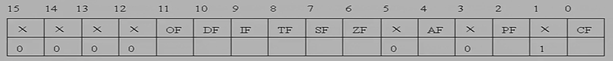
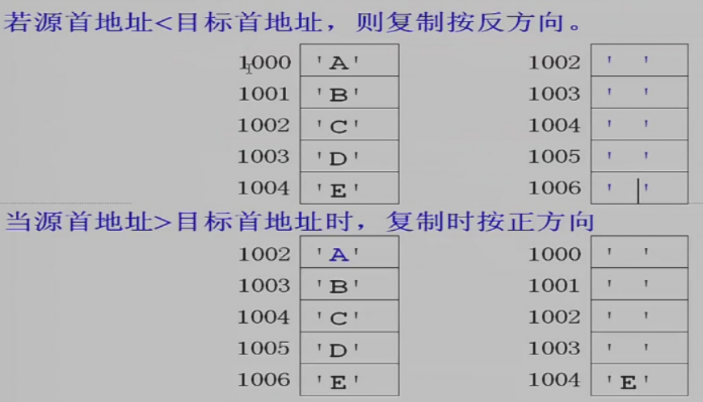
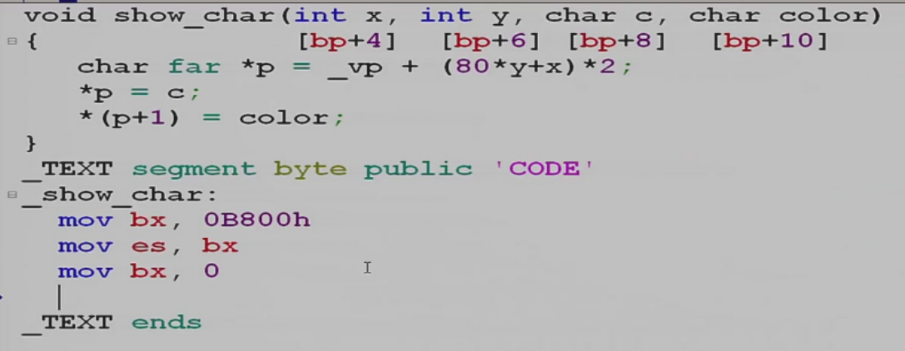
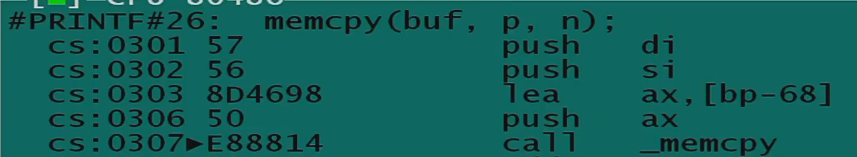
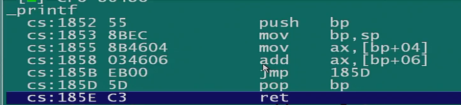

# 汇编语言

[TOC]

## intro

1. 资源
    - [小白的主页](http://cc.zju.edu.cn/bhh) 包含课程资源
    - 邮箱：iceman@zju.edu.cn
    - 实验环境：bochs 虚拟机，进行保护模式的实验
    - 考试：程序填空可以多次提交
    - [看雪学院（国内讨论破解）](http://bbs.pediy.com)
    - [讨论汇编、破解的网站（x64dbg 开源软件创作者所在论坛）](http://www.52pojie.cn讨论破解http://forum.exetools.com)
    - [国外讨论破解](http://www.tuts4you.com)
    - [国外老的破解教程](http://www.woodmann.com/crackz)
    - [fravia 论坛镜像](http://cc.zju.edu.cn/bhh/fravia/index.htm)
    - [国外32位汇编网站](http://www.masn32.com)
    - [浙大信息安全小组AAA](https://zjusec.com)
    - [x86 and amd64 instruction reference](https://www.felixcloutier.com/x86/)
    - 推荐阅读：Intel 80386 Programmer's Reference Manual，[书的网页版](https://pdos.csail.mit.edu/6.828/2018/readings/i386/toc.htm)
2. 学习汇编语言的作用
    - 加深对高级编程语言的理解
    - 逆向(reverse-engineering)：跟踪 & 破解程序（激活码）、反跟踪
    - 混合语言编程：提升程序性能
3. 实验环境
    - XP 虚拟机：点击 `.vmx` 文件直接在 VMWare 中打开虚拟机
    - [虚拟机网络设置](https://blog.csdn.net/qq_47188967/article/details/126442372)
    - xp 桌面上的 dosbox86 是一个 DOS 环境
4. 编译链接过程（以 printf 为例）
    - 编译： `.c` -> `.obj` （obj 文件中是机器码，作者提供 obj 而不提供 c 文件可以有效保护知识产权）
    - 链接: 搜索 `cs.lib` （库文件，obj 文件的集合），复制 `printf.obj` 以及 `c0s.obj` 到 `main.obj` 生成 `main.exe`
        - 调用 `main.c` 之前会调用初始化模块，turbo C 的初始化函数在 `c0s.obj` 中
        - 调用 main 函数的汇编语言 `call 01FA`

---

**文档内搜索 `[TODO]` 查找待办事项！**

## 知识点

### 硬件知识

1. 小端规则：低 Byte 在前，高 Byte 在后
2. eax & ax & ah & al：都是寄存器，eax 的低 16 位是 ax，ax 的高 8 位是 ah，ax 的低 8 位是 al
    - 寄存器在 cpu 内部，不在内存中，没有地址


#### 常见 16 位寄存器(14 个)

用于运算：(general registers)

- ax
- bx
- cx
- dx

存储段地址：(segment registers)

- cs: code segment
- ds: data segment
- es: extra segment，一个数据段存不下所有数据时用于补充
- ss: stack segment，存储堆栈区的段地址

存储偏移地址: 

- si
- di
- bp
    - **`[bp]` 默认的段地址是 `ss`**，用于弥补 `sp` 不能进行寻址的缺陷
    - **段地址覆盖**：显式地指定段地址寄存器覆盖默认的段地址寄存器
- sp
    - `ss:sp` 指向堆栈的顶端，但是在古老的寄存器里 sp 不能放在方括号里，即不能用 `ss:[sp]` 取出栈顶元素
- bx
    - 因为 sp 用于特定用途，偏移地址寄存器少了一个，就把通用寄存器中的一个拿来顶替

ip: instruction pointer，指令指针

- cs + ip: cs 用于保存将要执行的指令的段地址，ip 用于保存将要执行的指令的偏移地址，cs + ip 确定将要执行的指令的逻辑地址

##### FL

FL: flag，标志寄存器，16 个 bit 分别表示不同含义，有的可以指示指令执行后的状态，有的可以控制 CPU 行为



- 在 x86 instruction set reference 中查看不同指令对 FL 不同位的影响

---

- `FL[0]`: 称为 CF，存储当前指令的进位（在加法中表示进位，在减法中表示借位，在移位中表示最后被移出去的位，但本质是一样的）

```asm
mov ax 0FFFFh
add ax, 1
jnc no_carry_flag
jc has_carry_flag

no_carry_flag:
has_carry_flag:
```

- CF 相关指令
    - jc, jnc: 根据 CF 进行跳转
    - adc: 带进位加法（类似全加器），`adc ax, bx` 表示 `ax = ax + bx + CF`
    - clc: clear carry `CF = 0`
    - stc: set carry `CF = 1`
---

- `FL[6]`: ZF, zero flag，指令结果为 0 的时候置 1
    - `sub ax, ax` ZF=1
- ZF 相关指令
    - jz, jnz: 根据结果是否 0 进行跳转
        - `cmp ax, bx` + `je Label` 和 `sub ax, bx` + `jz Label` 在结果上是一样的

```asm
    ; 等价操作，但是前者更快
    or al, al
    jz zero

    cmp al, al
    je zero
```

---

- `FL[7]`: SF, sign flag, 存储指令结果的最高位
- SF 相关指令：js, jns

---

- `FL[11]`: OF, overflow flag，存储指令结果是否溢出，相当于指令结果最高位的再高一位。
    - 对一个最高位和次高位不同的数，进行左移 1 位操作，也会造成溢出（移位导致符号变化了）
- OF 相关指令：jo, jno

---

- `FL[2]`: PF, parity flag, 存储运算结果低 8 bit 的奇校验码（奇校验码含义为：编码+校验码，拥有奇数个 1）
    - *PF 与数据传输有关*
- PF 相关指令： jp(=jpe, jump if parity even), jnp(=jpo, jump if parity odd)

```asm
    or al, al   ; al 中存储接收数据，使用一个“无意义”的运算设置 PF 位
    jnp error   ; 进行奇校验
```

---

- `FL[4]`: AF, auxiliary flag, 辅助进位标志，运算指令低 4 位向高 4 位进位 AF=1
- AF 与 BCD 码有关
    - `daa`: decimal adjust for addition，行为如下：
        - 如果 (AF = 1 || AL & 0Fh >= 0Ah) 说明低 4 位已经进位或者需要进位，执行 AL += 6
        - 如果 (CF = 1 || AL &0 F0h >= A0h) 说明高 4 位已经进位或者需要进位，执行 AL += 60h
        - 为什么要加 6？因为十六进制进位进了低位的 16，但是 BCD 码的十进制进位只用进 10，要把低位多进的 6 加回去。

--- 

- DF: direction flag。控制字符串操作的方向

    1. `strcpy(char *t,char、*s)` 永远正方向
    1. `memcpy(char*t,char*s,intn)` 永远正方向
    1. `memmove(char*t,char*s,intn)` 会根据重叠情况使用正确的方向，当 DF=0 时为正方向（低地址到高地址），当 DF=1 是反方向。
    - `cld` 指令使 DF=0,`std` 指令使 DF=1



用 asm 实现 memmove

```asm
func_memmove:
    mov ax, data
    mov ds, ax
    mov es, ax
    mov si, offset s
    mov di, offset t
    mov cx, 10
    cmp es, ds  ; 先比较 es 和 ds
    ja neg_dir
    jb pos_dir
    mov dx, si
    add dx, cx
    cmp dx, di  ; 如果 es 和 ds 相同，则比较 si+cx 和 di
    jae neg_dir
pos_dir:
    cld         ; 设置 FD=0 表示内存复制方向为正方向
    jmp final_step
neg_dir:
    std
final_step:
    rep movsb   ; 实现 memmove(es:di,ds:si,cx);
                ; 如果反方向，则 es:di, ds:si 指向需要复制的字符串的最后一位
```

---

- IF: interrupt flag，表示是否允许硬件中断
- 相关命令：sti, cli

```asm
    cli
    ; 主函数
    ; 在主函数执行的过程中禁止硬件中断
    sti
```

软件中断和硬件中断的区别：硬件中断不会在用户代码中体现，由硬件事件发起。

`int 9h`: 键盘中断，由键盘敲击事件发起，将键盘值读到键盘缓冲区中
`int 8h`: 时钟中断，间隔一定时间将计数器加 1

---

- TF: trap flag，控制单步模式，一条指令执行前 TF = 1 ，CPU 在指令后面加一句 `int 1h`
    - `dword ptr 0:[4]` 存储了 `int 1h` 函数的地址，高 16 位是段地址，低 16 位是偏移地址（中断 `int x` 存放在 `0:[4 * x]` 处）（注意是小端模式存储）
- 相关指令：没有专门的指令，使用 pushf, popf，对 flag 整体进行操作

`int 1h` 的行为：

```asm
impl_int_1h:
    pushf                   ; 保存 flag
    push cs                 ; 保存当前指令的地址
    push offset trap_inst
    jmp dword ptr 0:[4]     ; 跳转到中断函数
```

调试器如何利用 TF：设置 TF = 1，将 `0:[4]` 指针指向自定义的中断函数处，则被调试程序每运行一条就会通过 `int 1h` 回到调试器的控制中。

如何设置 TF？

```asm
func_set_TF:
    pushf   ; 在栈里面存一个旧的 flag，方便结束单步模式之后的恢复
    pushf
    pop ax
    or ax, 100h
    push ax
    popf
```

如何利用 TF 进行反调试：
1. 对用户程序的所有指令进行加密
1. 将 `int 1h` 指向用户程序自身的函数，该函数的作用是解密下一条指令，加密上一条指令
1. 用户程序设置 TF = 1，则每条指令都会被 `int 1h` 解密后执行，如果其他人试图调试该程序，则 `int 1h` 指向其他函数，解密程序将不会被执行。

```asm
data_int_1h:
    dw prev_inst offset first, seg first    ; 用于存储上一条指令的地址
my_int_1h:
    push bp
    mov bp, sp  ; 用 bp 记录栈中参数地址
                ; 因为 bp 默认的段地址是 ss
```


##### 程序载入内存时的自动赋值

以下寄存器会在程序载入内存时被自动赋值

- cs=code
- ip=程序初始指令的偏移地址
- ss=stk
- sp=堆栈段的大小
- ds=es=psp段址

其中 **psp 段址** 是：长度为 100h 的一块内存，位于程序首段之前，其内容与程序内容无关，存放与 exe 相关的信息
- 命令行参数：`psp:80h` 一个字节存命令行参数的长度，从 `psp:81h` 开始连续存放命令行参数的字符
    - 如果程序名后面打了空格，那空格也会在参数字符串里
    - 参数字符串以回车结尾

**tips.**

1. 进行逻辑地址寻址之前 ds 一定要自己赋值
1. ds 初始值加 100h 等于程序首段段地址

#### 32 位寄存器

保持 16 位：cs, ds, es, ss

扩展到 12 位：eax, ebx, ecx, edx, esi, edi, ebp, esp, eip, EFL

#### 保护模式

16 位 CPU 运行在实模式(real mode)下，用户代码具有和操作系统一样的权限。

32 位 CPU 可以采用保护模式(protected mode)，用户代码不能越权访问操作系统等进程占用的内存空间。

32 位 CPU 中的寄存器：

- 保持 16 位：cs, ds, es, ss
- 扩展到 12 位：eax, ebx, ecx, edx, esi, edi, ebp, esp, eip, EFL

gdt(global descriptor table): 全局描述符表。数组，每个元素 8 Byte

```
t     -> gdt[0]
t+08h -> gdt[1]
t+10h -> gdt[2]
t+18h -> gdt[3]
```

现在假设这么一个情形：ds = 8, edi = 45678h，在内存中指向的地址是什么？

假设 gdt[1] 的 8 个字节如下：

| 0  | 1  | 2  | 3  | 4  | 5  | 6  | 7  |
| -- | -- | -- | -- | -- | -- | -- | -- |
| FF | FF | 00 | 00 | 10 | 93 | 0F | 00 |

取出其中的 7, 4, 3, 2 Byte 组成一个 8 位 16 进制数，与偏移地址相加得到逻辑地址

`00100000h + 45678h = 00145678h`

取出第 6 Byte 的低 4 位，加上 1 和 0 Byte，组成段的最大偏移地址 `FFFFFh`

第 6 Byte 的最高 bit 如果为 0，表示最大偏移量的单位是 bit；如果为 1，表示单位是 Page( = 4K)

第 5 Byte 用来规定段的类型、读写权限。例如 93h 表示：该段是数据段、可读、可写、要求访问者的权限是 ring0（最高权限级）

假设这是第 5 个 Byte 的数据，第 1 和 2 位规定了权限(ring0)

| 0  | 1  | 2  | 3  | 4  | 5  | 6  | 7  |
| -- | -- | -- | -- | -- | -- | -- | -- |
| 1 | 0 | 0 | 1 | 0 | 0 | 1 | 1 |

#### 32 位间接寻址方式

16 位中最复杂的间接寻址方式是 `[寄存器 + 寄存器 + 常数]` 如 `[bx + si + 2]` 。

32 位中最复杂的间接寻址方式是： `[寄存器 + 寄存器 * n + 常数]`
- 其中 n = 2、4、8
- eax, ebx, ecx, edx, esi, edi, esp, ebp 寄存器从八个中任选两个，并且两个寄存器可以同名，例如 `mov eax, [ebx+ebx*4+2]`
- 应用：将 C 语言编译成汇编语言时，需要根据数组中元素长度对下标进行乘法操作。使用 32 位间接寻址方式之后，就不用单独写一句左移语句了，可以用一句话表达原来两句话的意思。

例如：

mov eax, [ebx + esi*4 +2] short int a[3]={10, 20, 30};

设ebx ＝ ＆a［0］，esi＝2，则ax＝a［2］可以用以下指令 实现：

mov ax， ［ebx＋esi］；错误 mov ax， ［ebx＋esi＊2］； 正确

#### 端口 port

- 端口是计算机和外设之间通信的中间人。
- 端口地址的范围是：［0000h， OFFFFh］，共65536个端口。
- 对端口操作使用指令 in 与 out 实现。**in 和 out 只能使用 al 寄存器**

##### 通过端口获取时间 70h & 71h

70h 及 71h 端口与 cmos 内部的时钟有关。其中 cmos 中的地址 4, 2, 0 中分别保存了当前的时、分、秒，使用 BCD 码编码。

```asm
write:
    mov al, 0
    out 71h, al ; 告诉 cmos 接下去要访问它的0号内存单元
    mov al, 34h
    out 70h, al ; 把 cmos 的 0 号单元的值改成 34h

read:
    mov al, 0
    out 71h, al ; 告诉 cmos 接下去要访问它的0号内存单元
    in al, 71h  ; 读 cmos 的 0 号单元的值
```


##### 通过端口获取键盘信息 60h

通过 60h 号端口，CPU 与键盘之间可以建立通讯。

```asm
    in al, 60h  ; 从端口 60h 读取一个字节并存放到 AL 中
```


### 汇编指令

#### 运算指令

1. add, sub, mul, div 无符号整数加减乘除
1. imul, idiv 有符号整数乘除 **（加减操作不需要区分有符号和无符号）**
1. fadd, fsub, fmul, fdiv 浮点数加减乘除

##### 乘法指令 mul & imul

1. 8 位乘法：`mul bl` 表示 `ax = al * bl`
1. 16 位乘法：`mul bx` 表示 `dx:ax = ax * bx`
1. 32 位乘法：`mul ebx` 表示 `edx:eax = eax * ebx`

tips： **mul 的参数不能是常数，只能是寄存器或者变量**，因为需要参数长度已知，判断使用哪种长度的乘法。

tips：冒号表示前后连接

e.g. 无符号数乘法（**乘法只有一个参数**）

```asm
mov ax, 0FFFFh ; 65535
mov bx, 0FFFFh ; 65535
mul bx  ; 使用 bx 作为操作数，隐含的信息是 mul 是一个 16 位乘法，另一个操作数默认是 ax
        ; 相当于 dx:ax = ax * bx
        ; 冒号表示高 16 位和低 16 位的连接，即溢出的值存放在 dx 中
        ; ax 同时作为被乘数和结果寄存器，也隐含在命令中
```

e.g. 有符号数乘法

```asm
mov ax, 0FFFFh ; -1
mov bx, 0FFFFh ; -1
imul bx  ; 结果为 ds = 0000h, ax = 0001h
```

e.g. 为什么高级语言不需要区分 mul, imul, fmul？

Ans：因为高级语言有变量类型，可以根据操作数类型选择操作模式。但汇编语言的变量只规定长度，不规定类型。例如以下两个变量定义是等价的：

```asm
a dw 0FFFFh
b dw -1     ; 在内存中都是一段长 16 位的全 1 的数据
```

##### 有符号乘法 imul 的拓展

imul 的第二类用法可以包含 2 个或 3 个操作数：

1. `imul eax, ebx ; eax = eax * ebx`
    - 第2个操作数可以是寄存器也可以是变量
1. `imul eax, ebx, 3 ; eax = ebx * 3`
    - 第2个操作数可以是寄存器也可以是变量
    - 第3个操作数只能是常数

##### 除法指令 div & idiv

1. 16 位除 8 位得 8 位余 8 位：`div bl` 表示 `ax / bl = al ... ah`
    - 记忆：在小端规则下，ax 中 al 排在 ah 前面，所以高位 al 存更重要的内容——商，ah 存次要的内容——余数
    - 如果商超过 8 位，产生溢出，会在除法指令之前插入一个 `int 00h` 中断。可以通过中断函数修改被除数和除数防止报错。
1. 32 位除 16 位得 16 位余 16 位：`div bx` 表示 `dx:ax / bx = ax ... dx`
1. 64 位除 32 位得 32 位余 32 位：`div ebx` 表示 `edx:eax / ebx = eax ... edx`

##### 加减法拓展

1. inc & dec
    - inc & dec 不影响 CF，add 是会影响 CF 的
1. adc & sbb: add with carry, subtract with borrow
    - 计算 `12345678h + 5678FFFFh`
        ```asm
            mov dx,1234h
            mov ax,5678h ; dx:ax=12345678h
            add ax,OFFFFh; CF=1
            adc dx,5678h; DX=DX+5678h+CF
        ```
    - 拓展：大数加法
        ```asm
        next:
            mov al, [di]    ; ds 已经提前设置好
            adc al, [si]    ; di, si 是两个加数的偏移地址
            mov [bx], al    ; bx 是结果的偏移地址
            inc si
            inc di
            inc bx
            dec cx          ; cx 控制循环
            jnz next
            adc [bx], 0     ; 最高位判断一下有没有进位
        ```
1. neg: 取反 negate
    - 等同于减法操作，会影响所有的标志位
1. cmp
    - 和 sub 的区别在于 cmp 不保存减法的结果


##### 浮点数运算指令 & 浮点数寄存器

硬件支持：

CPU 内部一共有 8 个小数寄存器，分别叫做 st(0), st(1), ..., st(7)

其中 st(0) 可以简写为 st

这 8 个寄存器的宽度均达到 80 位，相当于 c 语言中的 long double 类型。

---

变量定义：

```asm
    pi dd 3.14              ; 32位小数，相当于 float
    pi_double dq 3.14159    ; 64位小数，相当于 double
                            ; q：quadruple 4倍的
    pi_long dt 3.14159265   ; 80位小数，相当于1ong double 
```

---

操作指令：

1. fld 执行类似于压栈的操作，最后一次 load 的内容存放在 `st(0)` 中，其余的依次往后推
    - 支持压入 float, double & long double
1. fild 把整数转换成小数压入
1. fstp 弹出

```asm
;Turbo Debugger跟踪时，
;点菜单View->Numeric Processor查看小数堆栈

data segment
abc dd 3.14 
xyz dd 2.0
result dt 0
data ends

code segment
assume cs:code, ds:data
main:
    mov ax, data
    mov ds, ax
    fld abc         ; 把3.14载入到小数堆栈
    fld xyz         ; 把2.0载入到小数堆栈
    fmul st, st(1)  ; 两数相乘
    fstp result     ; 保存结果到result，并弹出
    fstp st         ; 弹出小数堆栈中残余的值
    mov ah, 4Ch
    int 21h
code ends
end main
```

---

硬件实现：

1. `st(0)` 是逻辑编号，从堆顶往下分别写作 st(0), st(1), st(2), ...
1. 实际上 8 个浮点数寄存器都有其物理编号，物理编号是不会随入栈出栈改变的。
1. 浮点状态寄存器
    - 第 11 位到 13 位保存当前指针所指的浮点寄存器物理编号

#### 逻辑运算

- 位运算：and, or, xor, not


e.g.

```asm
mov ah 10110110b
shl ah, 1   ; ah = 01101100b
```

p.s. **逻辑右移使用 zero-extension，算术右移使用 sign-extension**

---

test 指令：执行一条 and 指令，但是不保留运算结果，只保留 flag 结果

例如可以用这样的方法判断 ax 是否为 0，可以避免使用 cmp 做减法操作，节省时间。

```asm
    test ax, ax
    jnz next
```

#### 移位运算

移位运算：shl, shr, rol, ror, sal, sar, rcl, rcr。对应:
1. 逻辑左移(shift left)
1. 逻辑右移(shift right)：左边补上 0
1. 循环左移(rotate lefts)
1. 循环右移(rotate right)
1. 算术左移（shift arithmetic left）
1. 算术右移(shift arithmetic right)：左边补上原数的最高位
1. 带进位循环左移(rotate with carry left)：和 CF 组成 n+1 位的整体，循环左移
1. 带进位循环右移(rotate with carry right)：和 CF 组成 n+1 位的整体，循环右移

---

在 C 语言中，无符号类型使用 shl 和 shr，有符号数使用 sal 和 sar。可以通过 td 查看编译产生的汇编代码，比较二者的区别。

---

- `CF = 0, al = 10110110` 执行 `rcl` 得到 `CF = 1, al = 01101100`，最低位从 CF 来
- `CF = 0, al = 10110110` 执行 `rol` 得到 `CF = 1, al = 01101101`，最低位从最高位来

rcl 的应用：对存储在多个寄存器中的数实现逻辑左移运算

```asm
    mov dx 1234h    ; 高 16 位
    mov ax 0ABCDh   ; 低 16 位
    shl ax          ; 低 16 位逻辑左移，进位存到 CF 中
    rcl dx          ; 高 16 位逻辑左移，并处理进位
```

#### 跳转指令

##### 无符号数比较跳转

- jbe: jump if below or equal
- jb: jump if below
    - 实现：只要 `CF == 1` 就跳转（如果上方是 cmp 指令，则 jb 是在检测结果是否小于 0,；但如果上方是其他指令比如 add，jb 就没有实际意义了）
    - jb 和 jc 的实现完全相同
- ja: jump if above
    - 实现：`CF == 0 && ZF == 0`
- jae: jump if above or equal
- jmp: 无条件跳转
- je
    - 实现：`ZF == 0` 跳转
    - 完全等价于 `jz`
- jne
    - 实现：`ZF != 0` 跳转
    - 完全等价于 `jnz`

e.g. 

```asm
cmp ebx, 100
jbe next
```

如果 ebx 小于等于 100 则跳转到 next 位置

##### 有符号数比较跳转

1. jl: jump if less
    - 实现：`SF != OF`
        - 比如 `2 - 3 = -1`，结果 `SF = 1, OF = 0`
        - 比如 `(-128) - 127 = 1`，结果 `SF = 0, OF = 1`
        - 因为如果产生了 overflow 意味着计算结果的符号和真实结果的符号不同
    - 不考虑 ZF 的状态
        - 因为两个相等的数相减，结果 `SF = 0, OF = 0`
1. jg
    - 实现：`SF == OF && ZF == 0`
1. jle
    - 实现：`SF != OF || ZF != 0`
1. jge
    - 实现：`SF == OF`

---

可以在 TB 中，修改 FL 的值观察跳转指令是否有向下的箭头。这样可以测试跳转指令通过什么条件判断跳转。

##### 跳转的分类：短跳、近跳、远跳

1. 短跳
1. 近跳
1. 远跳

---

**注意：短跳和近跳指令（远跳不是）的机器码中存储的是相对距离而不是绝对距离。这样做的目的是：当代码被移动时，仍旧能够正确执行。** 下面是一个移动代码块的例子。

硬盘：磁道、磁头、扇区

主引导区 master boot: 大小为 512B，在磁盘上的 0 道 0 头 1 扇区

1. 开机之后，ROM 会把 master boot 的代码读取到 `0000:7C00`
1. `jmp 0000:7C00`
1. 主引导区代码会找到操作系统所在的磁盘分区（例如 C: 盘），然后把自身代码复制到 `0000:0600`，把 C: 盘的第一个扇区读到 `0000:7C00`
1. `jmp 0000:7C00`
1. 再由操作系统代码读取 ntldr 程序到内存

---

**注意：短跳和近跳指令只能实现段内跳转，但远跳是直接跳转到目标地址，可以跨段跳转**

##### 其他跳转指令

1. `loop next`
    - 是一条简写指令，功能等价于 `dec cx` + `jnz next`，`cx` 是循环次数
    - 注意最大的循环次数需要 `cx=0` 开始

##### 函数调用和返回指令 & 函数参数传递方式 & 堆栈传参规范

1. 近调用
    - `call near ptr dest`：堆栈中仅压入 offset
    - `retn`：`pop ip`
1. 远调用
    - `call far ptr dest`：堆栈中先后压入 segment 和 offset
    - `retf`：`pop ip` + `pop cs`

---

函数传参方式：

1. 使用寄存器
1. 变量传递: 全局变量（不能用于递归函数或者多线程）or 局部变量
1. 堆栈传递
    - 注意 `call`（近调用） 指令一定会把下一条指令的 offset 压入堆栈，所以进入函数之后 `ss:[sp]` 存储的是 offset，`ss:[sp+2]` 存储的

```asm
f:
    push bp
    mov bp, sp
    mov ax, [bp+4]
    add ax, [bp+6]
    mov [bp+4], ax
    pop bp
    ret
main:
    mov ax, 4
    push ax
    mov ax, 6
    push ax
    call f
    pop ax      ; 取出结果
    add sp, 2   ; 没用的参数也 pop 掉
```

上面的代码为什么参数在 `bp+4` 和 `bp+6`？
1. `[bp]` 存储 old bp
1. `[bp+2]` 存储 offset back
1. `[bp+4]` 和 `[bp+6]` 存储两个 push 进去的参数

---

堆栈传参的三种规范（讲义 P154）

1. `__cdecl`
    - 参数从右到左压入堆栈，返回值存放在 ax 中
    - 函数返回后，调用者负责清理堆栈中的参数
    - 只有 `__cdecl` 规范能够处理参数个数不确定的情况
1. `__pascal`
    - 参数从左到右压入堆栈
    - 被调用者通过 `ret 4` 清理参数，例如这个 4 的意思是 `sp += 4`
1. `__stdcall`
    - 参数从右到左压入堆栈
    - 被调用者通过 `ret 4` 清理参数，例如这个 4 的意思是 `sp += 4`
    - 部分 Windows API 的参数传递规范

p.s. 在 TC 中使用 `int pascal f(int a, int b)` 语法使得函数以 pascal 规范传递参数

p.s. 在 C 规范中，函数有义务保护 bp, bx, si, di。一般先创建局部变量，再保护寄存器
1. bp 一般用于保存栈顶指针 sp

#### 栈操作指令

- push
- pop

tips. 操作数只能是 16 位或者 32 位数据，相应地 ss 减去 2 或者 4。

```asm
    ; 保存 16位数据
    push ax
    push word ptr ds:[di]
    ; 保存 32 位数据
    push eax
    push dword ptr ds:[di]
    ; 保存 8 位数据，曲线救国
    push ax
    pop bx
    mov al, bl
```

##### 栈空间的分配

```asm
stk segment stack
db 200h dup('S')
stk ends
```

- 堆栈只能定义一个，用 `stack` 关键字表示
- 可以用无名数组填充堆栈，比如上面的代码表示堆栈空间大小 200h Byte
    - 不定义名称对内存中的数据没有任何影响，但是在程序里就不能通过变量名访问这块内存了
- 可以不在程序中 `assume ss:stk`，因为 assume 是为程序中的寻址操作服务的，如果不需要通过 push, pop 以外的操作访问堆栈，就不需要加 assume
- 程序载入内存时 ss 和 sp 会自动赋值

---

如果用户没有分配栈空间，

- ss=首段段地址
- sp=0

相当于把段的末尾当做堆栈空间，对于 16 位寄存器来说，`sp-2 = 0-2 = 0xFFFE`

即使用户程序不需要使用 push pop，程序本身在进行 **时钟中断、键盘缓冲** 等操作时也会用到栈空间。

##### 压栈弹栈的实现

`push ax` (16 bit)

1. `sub sp, 2`
1. `mov ss:[sp], ax`

`pop ax` (16 bit)

1. `mov ax, ss:[sp]`
1. `add sp, 2`

push 和 pop 32 bit 数据同理

##### pushf & popf

FL 是不能直接引用的，需要通过压栈弹栈的操作把其中的值取出来


#### 符号扩充指令

三种传统的符号拓展：

1. cbw: convert byte to word
    - 没有参数
    - 默认对 al 进行符号拓展，拓展的位放在 ah 中
1. cwd: convert word to double word
    - 没有参数
    - 默认对 ax 进行符号拓展，拓展的位放在 dx 中
1. cdg: convert double word to quadruplee word
    - 没有参数
    - 默认对 eax 进行符号拓展，拓展的位放在 edx 中

更灵活的符号拓展：

1. movsx :move by sign extension 符号扩充
    ```asm
        movsx ax,al ; 相当于cbw
        movsx bx,al
        movsx edx,bl
    ```
1. movzx: move by zero extension 零扩扩充指令

##### 符号拓展的作用之一：服务有符号除法

```asm
    mov al,-4   ; AL=OFCh
    cbw         ; AX=0FFFCh=-4
    mov bl,-2   ; BL=0FEh=-2
    idiv bl     ; AL=02h(商)，AH=00h(余数)
```

#### 赋值相关指令 mov & xchg

1. mov
    - `mov word ptr [0426],0001` 把 16 位数据 0x0001 移动到地址 0x0426 的内存中。[] 表示取地址，相当于 C 中的 *。
    - **mov 不能同时操作两个内存变量**
    - **操作数等宽**
1. xchg
    - 交换两个变量 `xchg ax, bx`
    - 可以使用内存变量，但是不能两个都是内存变量

#### 取地址指令 lea & lds & les

1. lea：取偏移地址
    - 特殊用法：快速加法乘法
        - e.g. `lea ax, ds:[ax+bx+3]` 可以一次执行两条加法指令
        - e.g. `lea eax, [eax+eax*4]` 相当于一个移位加一个加法，比直接用乘法指令快
1. lds：取远指针
    - e.g. `lds di, ds:[bx]` 把内存中的 32 bit 数据，高 32 位赋值给 ds，低 32 位赋值给 di
    - 操作数长度固定：第一个操作数是 16 位的，第二个操作数是 32 位的
1. les：取远指针
    - e.g. `lds di, ds:[bx]` 把内存中的 32 bit 数据，高 32 位赋值给 es，低 32 位赋值给 di
    - 操作数长度固定：第一个操作数是 16 位的，第二个操作数是 32 位的

#### XLAT 换码指令

- 换码指令 XLAT(Translate) 也称查表指令
    - 在 XLAT 执行前必须让 ds:bx 指向表，AL 必须赋值为数组的下标
    - 执行 XALT 后，`AL=ds:[bx+AL]`

一个应用：十六进制数转 ASCII 码，本来是用比较语句加上 `'0'` 或者 `'A'`。现在可以在内存中存一张表，然后使用查表指令找到要输出的字符

#### 字符串操作指令

##### 字符串复制指令

1. movsb
    - 准备工作：
        1. `cx`: 复制多少个 byte
        1. `ds:[si]`: 源字符串地址 (si = source index)
        1. `es:[di]`: 目标字符串地址 (di = destination index)
        1. `DF`: 0 表示正向，1 表示反向 (使用 std, cld 指令)
    - 调用：`rep movsb` 表示重复复制 cx 次，`movsb` 表示单次复制
    - 结果：si 和 di 会跟着指令一起累加，最后指向字符串的末尾。如果 rep 的话 cx 会跟着指令一起减，最后变成 0；**但如果不 rep 的话 cx 不会跟着一起减**。
1. movsw
    - 同上，但是每次复制一个 word(2 byte)
1. movsd
    - 同上，但是每次复制一个 double word(4 byte)

加速复制内存块的速度：

```asm
    push ecx
    shr ecx, 2
    rep movsd
    pop ecx
    and ecx, 3
    rep movsb
```

##### 字符串比较指令

1. cmpsb
    - 准备工作：
        1. `cx`: 比较多少个 byte
        1. `ds:[si]`: 第一个比较字符串地址 (si = source index)
        1. `es:[di]`: 第二个比较字符串地址 (di = destination index)
        1. `DF`: 0 表示正向，1 表示反向 (使用 std, cld 指令)
    - 调用：
        1. `repe cmpsb` (repeat if equal)，如果 ZF = 1 则继续循环，否则退出循环
        1. `repne cmpsb` (repeat if equal)，如果 ZF = 0 则继续循环，否则退出循环
    - 结果：
        1. `ds:[si]` 和 `es:[di]` 指向最后一次比较的字符的后一个地址。如果字符串不想等，则指向第一个不相等的字符的后一位地址
        1. cx 可以表示还剩多少个字符没有参与比较
        1. ZF 显示最终结果，两个字符串是否相等
1. cmpsw
1. cmpsd

---

提问：能否通过 `cx == 0` 判断两个字符串全等？

不能。最后一个字符不等也会得到 `cx == 0`

正确的做法是 `ZF == 1` 表示两个字符串全等。

##### 字符串扫描指令

1. scasb
    - 准备工作：
        1. `cx`: 最多扫描多少个 byte
        1. `al`: 用于扫描的字符
        1. `es:[di]`: 扫描字符串地址 (di = destination index)
        1. `DF`: 0 表示正向，1 表示反向 (使用 std, cld 指令)
    - 调用：
        1. `repe scasb` (repeat if equal)，如果 `es:[di] == al` 则继续循环，否则退出循环
        1. `repne scasb` (repeat if equal)，如果 `es:[di] != al` 则继续循环，否则退出循环
    - 结果：
        1. `ds:[si]` 和 `es:[di]` 指向最后一次比较的字符的后一个地址。如果在字符串中找到了字符，则指向第一个找到的位置的后一位地址（需要 `dec di` 才能指向找到字符的位置）
        1. cx 可以表示还剩多少个字符没有参与比较
        1. ZF 显示最终结果，`ZF == 1` 表示找到了，否则就是没找到
1. scasw
1. scasd

---

应用：求 C 字符串的长度。

做法是 scasb 找 `\0` 的位置，注意最后要把结果减一， `\0` 不算长度。

##### 字符串填充指令

1. stosb
    - 准备工作：
        1. `cx`: 填充多少个 byte
        1. `al`: 用于填充的字符
        1. `es:[di]`: 需要填充的字符串地址 (di = destination index)
        1. `DF`: 0 表示正向，1 表示反向 (使用 std, cld 指令)
    - 调用：`rep stosb`
    - 结果：di 会跟着指令一起累加，最后指向字符串的末尾。cx 会跟着指令一起减，最后变成 0。

---

应用：实现字符串初始化 `memset`

##### 字符串读取指令

1. lodsb
    - 准备工作：
        1. `al`: 读取的字符存储的位置
        1. `ds:[si]`: 需要读取的字符串地址 (si = source index)
    - 调用：`lodsb`
    - 结果：`al = ds:[si], si++`

---

应用：使用 `lodsb` 和 `stosb` 过滤掉字符串中的一些字符

```asm
    ; 假设准备工作已经做好
again:
    lodsb
    cmp al, '#'
    je next
    stosb       ; 如果是要过滤的字符，就不存储到目标字符串中
next:
    dec cx
    jnz again
```

#### 其他常用指令

1. nop(0x90)：no operation 用于删除机器码并保持跳转指令的正确性
1. cli: clear interrupt 不允许中断（在 windows 下是特权指令，用户程序不允许操作）
1. `test`: 做一次 `and`，但不改变目标寄存器的值。紧接着可以用 FL 相关指令对目标寄存器值进行判断


### 汇编语言

1. 常数若以字符开头，需要添加前导零，用以与变量名进行区分。e.g. `0Fh`
2. 换行符
    - Windows 下：`\r` (0Dh) 回到行首，`\n` (0Ah) 光标到下一行的同一列
    - Linux 下： `\n` 承担了以上两个任务


#### 逻辑地址表示法

##### 段地址 + 偏移地址

段地址：5 位 16 进制段首地址的前 4 位

- 段首的要求：5 位 16 进制段地址的最低位必须为 0
- 段长的要求：最大段长 10000h
    - 假设段首地址是 `12340h`，则这个段里的所有地址分别是 `1234:0000` 到 `1234:FFFF`
- 段和段之间可以重叠，`1233:0068==1234:0058==1235:0048`
- 段地址适用于：变量、数组、标号

偏移地址：在段地址的基础上，加上的一个偏移量

p.s. 逻辑地址产生的历史原因：8086 CPU 没有 4 位以上的寄存器，只能把一个 5 位地址拆成两个 4 位表示

p.s. 每个地址存储 1 个 Byte 的数据

##### 表示方法

正确的：

- 取地址：`ds:bx+3`
- 取内容：`ds:[bx+3]`
    - `[bx+3]`，等价于 `ds:[bx+3]`，其中 ds 是隐含的
- `abc[1]`，其中 abc 是 data 段中的数组，属于直接寻址，会被编译成 `ds:[offset abc + 1]` 然后变成例如 `1000h:[0+1]`
    - `[abc+1]` 等价
    - `mov bx, offset abc` + `[bx+1]` 等价 
    - `mov bx, offset abc` + `mov si, 1` + `[bx+si]` 等价
    - 注意在 C 中指针加数字 `abc + 1` 的含义是 `abc + 1 * sizeof(*abc)`。但在汇编中指针加数字和数字加数字没有任何区别，`abc + 1` 永远表示 abc 偏移一个 byte。例如，如果 `xyz` 是一个 `dd` 数组，那么 xyz 的第二个元素地址为 `xyz + 4`。

错误的：

- 不能用常数表示段地址：`1000h:[2000h]`

##### 寻址方式分类

1. 直接寻址：偏移地址只用常数表示。例如 `[1000h]`, `ds:[2000h]`
1. 间接寻址：偏移地址可以由寄存器和常数表示。
    - 只允许 bx, bp, si, di 四个寄存器出现在方括号里。例如 `[ax]` 是错误的
    - 寄存器相加时只允许 b 开头的寄存器和 i 结尾的寄存器、例如 `[bx+si+2]` 是正确的，`[bx+bp]` 是错误的。

#### 重定位(relocating)

在编译过程中数组的 offset (3) 是可以知道的，但是 `seg s` 在编译的过程中是未知的，根据程序运行时内存的空闲区域而变化。

所以 `seg s` 会被编译成 s 的段地址和首段的段地址的差；在运行前由系统对程序进行修正，加上程序首段的段地址，这个过程称为 **重定位(relocating)** 。

例如在下面的程序中，用 qv 打开 exe 文件可以看到 `seg s` 被编译成 0，但用 td 打开 exe 文件，在运行中同样的位置是一个非 0 的不确定的数。

从文件头偏移 1E 处开始，每 4 个字节标识了一个重定位位置，以小端规则存储。例如 1E 处的内容为 `01 00 02 00`，假设程序运行时的 **真实首段地址** （注意不是文件头地址）为 `1000:0`，则表示 `1002:0001` 地址需要修改。

在文件头偏移 06 处存储了需要进行多少次重定位。例如 `01 00` 表示只有一个位置需要重定位。

在文件头偏移 08 处存储了文件头的长度。例如 `20 00` 表示文件头的长度为 `00200h`

#### 变量定义

| 变量名 | 内存位数 | 缩写含义 | C 中对应的数据类型 |
| -- | -- | -- | -- |
| db | 8 bit | byte | char |
| dw | 16 bit | word | short int |
| dd | 32 bit | double word | long int, float |
| dq | 64 bit | quadruple word | long long int, __int64, double |
| dt | 80 bit | ten bytes | long double |

e.g. `s db "ABC"` 定义一个数组，每个元素占 8 bit
e.g. `x dd 3.14` 定义一个 float

p.s. IEEE 754 标准浮点数：参考计组笔记中的 “浮点数 - IEEE754 标准” 章节

---

p.s. 可以在 code segment 中定义变量，但是必须保证程序运行时跳过定义变量的内存。

##### 定义数组变量

使用 dup 进行重复填充

```asm
data segment
s db 1, 2, 3, 4
t db 200h dup('S')
data ends
```

#### byte ptr

- 汇编语言的多数指令要求两个操作数等宽
- 汇编语言中常数没有明确的宽度

`mov ds:[bx], 0` 根据前两条规律，可以得出：指令的两个操作数宽度均不明确会报错

`mov ds:[bx], al` 将 8 bit 数据存到 `ds:bx`

`mov ds:[bx], ax` 将 16 bit 数据存到 `ds:bx`

`mov byte ptr ds:[bx], 0` 规定 `ds:bx` 是一个指向 8 bit 数据的指针，相当于 C 中的强制类型转换 `*(char*)(ds:bx) = 0;`

- 指针修饰符有 `byte ptr`, `word ptr` 和 `dword ptr` 三种
- 指针修饰符只能修饰内存位置，不能修饰常数。例如 `byte ptr 0` 会报错。

#### assume

1. `assume ds:data` 的作用：告诉编译器把变量或标号的段地址替换成对应的段寄存器，但并不会对段地址进行赋值。
    - 编译后不会生成机器码，称为“编译指示语句”
    - 需要提前对 ds 进行赋值
    - 没有 assume 就无法使用 `[bx+3]` 的简略写法 ？？？
    - 同一个段名和多个段寄存器建立关联，选择寄存器的优先级为 `ds > es > ss > cs`，即 `assume ds:data, es:data` 相当于 `assume ds:data`
1. `assume cs:code` 的作用：告诉编译器把变量或标号的段地址替换成对应的段寄存器，但并不会对段地址进行赋值。
    - 允许存在多个 code 段
    - 没有 assume 就无法对代码段中的标号进行寻址
    - 不需要提前对 cs 进行赋值，即使程序运行途中 cs 发生改变（跳转到不同的代码段），cs 也会由程序自行修改。


#### 写入显卡内存实现程序输出

详见：
- 写入显存实现输出字符 printscr.asm & printscr.c
- 写入显存实现输出图形 prtshape.asm

#### far ptr 远指针

##### 取出远指针的指令

远指针在内存中的存储：

- 同时包含段地址和偏移地址
- 32 位远指针和一个 long int 的存储方式是相同的

```asm
data segment
    addr dd 0B8000000h, 0B80000A0h ; 32 位远指针
data ends
```

32 位远指针：

1. `lds bx, dword ptr ds:[bx]` 把 `ds:bx` 处的一个 `double word` 取出来，高 16 位存到 `ds` 中，低 16 位存在 `bx` 中
    - 如果 data 段中使用 `dd` 存储变量， `dword ptr` 可以不写
    - 参数 `bx` 可以换成非偏移地址寄存器
1. `les bx, dword ptr ds:[bx]` 把 `ds:bx` 处的一个 `double word` 取出来，高 16 位存到 `es` 中，低 16 位存在 `bx` 中

48 位远指针：

1. 把 `dword ptr` 换成 `fword ptr` 其他不变

##### 使用远指针进行跳转


#### 局部变量

局部变量是在堆栈中定义的。考虑以下 C 语言函数：

```c
int add(int a, int b){
    int c;
    c = a + b;
    return c;
}
```

编译成汇编语言：

```asm
func_add:
    push bp
    mov bp, sp
; int c;
    sub sp, 2   ; 在堆栈空间中创建局部变量
; a + b
    mov ax, [bp+4]
    add ax, [bp+6]
; c = a + b;
    mov [bp-2], ax
; return c;
    mov ax [bp-2]
    mov sp, bp
    pop bp
    ret
```

在汇编语言中很容易看出局部变量的生命周期

#### 递归

注意 C 规范的函数需要保护 bp, bx, si, di 四个寄存器

考虑以下递归函数：

```c
int f(int n){
    if (n == 1) return 1;
    return n+f(n-1);
}
```

编译成汇编语言如下：

```asm
f:
    push bp
    mov bp, sp
    mov ax, [bp+4]      ; ax = n
                        ; 取出参数
    cmp ax, 1
    je do_ret
    dec ax              ; ax = n-1
    push ax             ; 设置参数
    call f              ; 递归调用函数 f，ax = f(n-1)
    add sp, 2           ; 调用者负责回收参数空间
    add ax, [bp+4]      ; ax(return value) = f(n-1) + n
do_ret:
    pop bp
    ret
```

#### 中断

中断向量：

1. `int n` 的中断向量一定保存在 `0:(n*4)` 的位置
1. 每个中断向量是一个远指针，存储中断处理程序的逻辑地址

在跳转中断处理函数之前，CPU 会执行以下 5 条命令：

1. `pushf` 保存程序运行的状态，退出中断后不影响继续运行
1. `push cs`
1. `push offset here`
1. `cli`: `IF = 0` 不允许中断嵌套
1. `clt`: `TF = 0` 不允许单步模式，目的也是防止中断嵌套

在执行 iret 时，CPU 是在执行以下三条命令：

1. `pop ip`
1. `pop cs`
1. `popf`

#### 结构体

声明结构体：

```asm
_WORD struc
    __letter db 21 dup(0)
    __x dw 0
    __y dw 0
    __status dw 0
    __hit_len dw 0
    __old_char db 0
    __old_color db 0
    __px dw 0
    __py dw 0
    __bx dw 0
    __by dw 0
_WORD ends
```

定义结构体变量：

```asm
_w _WORD 25 dup (<>)
```

使用结构体变量：
1. 使用 `.` 运算符
1. 成员变量地址 = 结构体首地址 + 成员变量偏移地址

```asm
   mov ax, _a.score
   xchg ax, [bx].score
   mov _a.score, ax
```


### DOS Interrupt

#### getchar

`int 21h(AH=01h)`: 从 stdin 读取一个字符，保存在 AL 中，相当于 getchar()

```asm
mov ah, 1
int 21h
cmp al, 'A'
```

和 `int 16h(AH=00h)` 的区别
- 只能读取可见的字符
- 读取的字符会显示在屏幕上

#### putchar

`int 21h(AH=02h)`: 把 DL 中的数据输出到 stdout 中，相当于 putchar()

```asm
mov ah, 2
mov dl, 'U'
int 21h
```

#### exit

`int 21h(AH=4Ch)`: 结束程序，返回 AL 中的数值

```asm
exit:
    mov ah, 4Ch
    mov al, 0
    int 21h
```

#### keyboard interrupt

`int 16h(AH=00h)`：接收键盘输入，存在 AX 中（16 位编码），属于 BIOS 中断
`int 16h(AH=01h)`：检测键盘缓冲区是否为空，若为空则 ZF=1，非空则 ZF=0(zero flag，是 FL 寄存器中的一个 bit)

```asm
again:
    ; do something
    mov ah, 1
    int 16h     ; 检测键盘缓冲区
    jz no_key
has_key:
    mov ah, 1   ; 如果键盘缓冲区中有数据，则读取按键信息
    int 16h
no_key:
    jmp again   ; 如果键盘缓冲区为空，则重复执行缓冲区检测流程
```

#### print string

`int 21h(AH=09H)`：输出以 `'$'` 结尾的字符串

```asm
    mov ah, 9
    mov dx, offset current_time
    int 21h
```

#### read string

`int 21h(AH=0Ah)` 把字符串读到 buffer 中

调用前的设置：
1. 设置 `FD`
1. `ds:dx` 指向 buf 的首地址
1. `buf[0]` 写入 buffer 的最大容量（单位为 byte）

调用后的结果：
1. 读取到回车结束
1. `buf[1]` 写入字符串长度（长度不包含回车），`buf[2]` 开始存储读入的字符串

```asm
   cld
   mov ax, data
   mov ds, ax
   mov ah, 0Ah
   mov dx, offset buf   ; ds:dx 指向 buf 的首地址
   int 21h              ; int 21h 0Ah 号功能：输入字符串
   xor bx, bx
   mov bl, buf[1]       ; BL=输入字符串的长度
   mov buf[bx+2], 00h   ; 把输入的回车符替换成00h
                        ; buf[2]起是字符串的内容
```

#### 程序驻留

`int 21h(AH=31h)`，设置 dx 为驻留的代码段长度（单位：节，1 节 = 16 byte）

程序结束运行后部分内存仍驻留在内存中。可用于修改中断向量供别的程序使用。

```asm
    mov dx,offset initialize    ; DX=len before label initialize
    add dx,100h                 ; include PSP's len
    add dx,0Fh                  ; include remnant bytes
    mov cl,4
    shr dx,cl                   ; DX = program's paragraph size to keep resident
    mov ah,31h
    int 21h                     ; keep resident
```

#### set cursor

`int 10h(AH = 02h)` 修改光标位置
1. BH = page number
    - 0-3 in modes 2&3
    - 0-7 in modes 0&1
    - 0 in graphics modes
1. DH = row (00h is top)
1. DL = column (00h is left)

### 混合语言编程

编译链接流程：

1. `tcc -S hello.c` 可以把 C 程序编译成汇编语言，方便查看其结构
    - 直接输入 `tcc` 可以查看 tcc 的所有参数
    - 使用 `_TEXT segment` 定义代码段，可以参考下面的框架
1. 把 C 函数翻译成 asm 代码
    - 可以把参数对应的 `[bp+x]` 事先写好
    - 注意保护用到的寄存器 
1. `masm /Ml called;` 生成 `called.obj`
1. `copy called.obj d:/tc` 拷贝到同目录下
1. `tcc -v caller.c called.obj` 编译链接生成 exe 文件
    - `-v` 调试时可以看到源代码

汇编代码规范：

asm_fun.asm：
1. 汇编为 C 提供函数 & 全局变量：声明 `public`
1. 汇编使用 C 函数 & 全局变量：声明 `extrn`
1. 汇编中的变量名命名：C 中对应变量名前加下划线
1. 可以使用 32 位寄存器: `.386` & `use16`
1. 记得 `assume`，最后加一个 `end`

```asm
public _char2hex, _show_char, _hello_str; public使它们变成全局, C语言中才可以引用它们
extrn _cfun:near, _vp:dword ; 声明C语言函数_cfun的类型为near ptr, C语言变量
                            ; _vp的类型为dword ptr, 汇编语言中才可以引用它们

.386
_DATA	segment word public 'DATA' use16
t db "0123456789ABCDEF"
_hello_str db "Hello,world!", 0
_DATA ends

_TEXT segment byte public 'CODE' use16
assume  cs:_TEXT, ds:_DATA

; void show_char(int x, int y, char c, char color)
; {
;    char far *p = _vp + (y*80+x)*2;
;    *p = c;
;    *(p+1) = color;
; }
_show_char:
  push bp
  mov bp, sp
  push bx
  push es
  les bx, [_vp]    ; ES=0B800h, BX=0000h
                   ; _vp是定义在C语言中的远指针: 
                   ; char far *vp = (char far *)0xB8000000;
;------------------;
; mov ax, [bp+6]   ; AX = y
; mov cx, 80       ; CX = 80
; mul cx           ; AX = y*80
; add ax, [bp+4]   ; AX = y*80 + x
; shl ax, 1        ; AX = (y*80+x) * 2
;------------------;
  push word ptr [bp+6]; y
  push word ptr [bp+4]; x
  call _cfun          ; 调用C语言函数int cfun(int x, int y)
  add sp, 4           ; 清理堆栈中的2个参数
                      ; cfun()返回AX = (y*80+x) * 2
  add bx, ax       ; ES:BX就是远指针p
  mov al, [bp+8]   ; AL = c
  mov es:[bx], al  ; *p = c
  mov al, [bp+10]  ; AL = color
  mov es:[bx+1], al; *(p+1) = color
  pop es
  pop bx
  pop bp
  ret

; void char2hex(char xx, char s[]) /* 把8位数转化成16进制格式 */
; {
;    char t[] = "0123456789ABCDEF";
;    s[0] = t[(xx >> 4) & 0x0F]; /* 高4位 */
;    s[1] = t[xx & 0x0F];        /* 低4位 */
; }
_char2hex:
  push bp
  mov bp, sp
  push bx
  push si
  mov bx, offset t
  mov al, [bp+4]
  shr al, 4
  and al, 0Fh
  xlat; AL=[BX+AL]
  mov si, [bp+6]; si=s
  mov [si], al  ; s[0] = AL
  mov al, [bp+4]
  and al, 0Fh
  xlat
  mov [si+1], al; s[1] = AL
  pop si
  pop bx
  pop bp
  ret
_TEXT ends
end
```

cmain.c：
1. 在汇编代码中实现的函数 & 全局变量，在 C 代码中用 `extern` 声明

```c
#include <stdio.h>
#include <string.h>
extern void show_char(int x, int y, char c, char color);
extern void char2hex(char xx, char s[]);
extern char hello_str[13];
char far *vp = (char far *)0xB8000000;

int cfun(int x, int y)
{
   return (y*80+x) * 2;
}

main()
{
   int i, n;
   char buf[2], c;
   n = strlen(hello_str);
   for(i=0; i<n; i++)
   {
      c = hello_str[i];
      char2hex(c, buf);
      show_char(0, i, c, 0x71);
      show_char(1, i, buf[0], 0x17);
      show_char(2, i, buf[1], 0x17);
   }
}
```

注意点：
1. int 和 short int 是 16 位的，long int 是 32 位的
1. char 作为参数会被拓展到 16 位，因为栈里不能 push 单个字节
1. 不能用双斜杠注释 `\\`，只能用 `\**\` 注释

以上这些细节都可以通过查看 `tcc -S hello.c` 生成的 `hello.asm` 得知。

---

其他混合语言编程方法：

1. 在 C 语言中内嵌
    - 在 TC 中
        ```c
        int main(){
            int x = 10, y = 20, z;
            asm mov ax, x
            asm add ax, y
            asm mov z, ax
            printf("%d\n", z);
        }
        ```
        - 发现内嵌汇编语言可以用标签调用局部变量，编译器会帮忙编译成 `[bp+x]` 的形式
    - 在 VC 中
        ```c
        __asm int 3
        __asm{
            mov ax, x
            ...
        }
        ```
        - 在代码中设置软件断点：加上 `int 3`，直接 run 就可以停在想停的地方
        - VC 中可以用汇编语言编写整个函数，函数头需要酱紫写：`__declspec(naked) int f(int a, int b)`，`naked` 的作用是不让编译器加任何汇编语句。函数参数从左到右压入堆栈，然后压入返回值（留一块堆栈空间用于返回值）
1. 

## 工具

### Turbo C & Turbo Debugger

#### 打开 TC 和 TD

- turbo C 编辑 + 编译链接(tcc，**16 位编译器**) + 调试
    - windows + R -> command -> tc + 文件名
- turbo debugger(td)：**只能调试 16 位 DOS 程序(.exe)**
    - windows + R -> command -> td + 程序名(.exe)

#### 用 td 调试 asm 生成的 exe

1. 在 command 中用 `TD xxx.exe` 命令打开 exe 文件
2. TD 界面
    - 左上：汇编程序(cs)
    - 左下：内存空间(ds)
    - 右上：寄存器（例如: ax, bx）
    - 右下：栈空间
3. 设置断点：F2 在光标位置设置一个断点
4. 跟踪进入函数：F7
5. 搜索内存地址：选中左下角框 -> ctrl+g -> 输入内存位置的逻辑地址例如 `ds:0426`
    - 搜索代码地址同理：选中左上角框 -> ctrl+g -> 输入代码位置的逻辑地址例如 `cs:0426`
    - 并不一定要左上角显示代码，左下角显示数据，只是这样看起来比较舒服
6. 切换寄存器位数：
    - 右键 -> 可以切换 16 位和 32 位
    - ctrl+R
7. F9：运行程序
8. F4：运行到光标处暂停
1. alt-X：退出
1. alt+F5：显示 user screen（查看程序输出），然后 esc 返回 TD 界面。
1. 选中 FL + 空格：临时修改 FL 中 bit 的值

---

显示：
1. 如果跳转指令后面有个向下的箭头，说明这条指令会进行跳转，否则这条指令不跳转

#### 用 td 调试 c 源代码编译链接生成的 exe

1. 菜单栏 - view - CPU：显示汇编代码，可以看到每条 C 语言语句是如何转化成汇编代码的

### OllyDbg 调试 32 位可执行程序

==OllyDbg 打开 exe、设置断点、调试（运行到断点etc）、修改汇编代码==

1. F2：运行
2. 

### MASM32

编译汇编语言的集成环境

- D:\masm32\qeditor.exe
- open -> 选择 `sum.asm` -> project -> build all -> 32 位程序 `sum.exe`

### MASM

MASM是Microsoft Macro Assembler的缩写，是微软公司为x86微处理器家族开发的汇编开发环境，拥有可视化的开发界面，使开发人员不必再使用DOS环境进行汇编的开发，编译速度快，支持80x86汇编以及Win32Asm，是Windows下开发汇编的利器。

编译 16 位汇编代码

- win+R -> command
- D: -> cd masm
- masm sum16.asm; 编译产生 obj 文件（可以省略后缀名）
- link sum16.obj; 链接产生 exe 文件（可以省略后缀名）
- td sum16.exe 在调试模式中运行

#### tasm

1. `tasm /m2 movcode;`
1. `tlink movcode;`
1. `td movcode`

多次扫描解决 forward reference 的问题。如果 jmp 是 short jump，那指令就只有 2 个字节。如果用 masm 的话，会默认填充 nop 变成 3 个字节。

### 010 Editor

16 进制编辑器，用于修改 exe 文件

在 OllyDbg 中复制一段 *较长的* 机器码，用 010 Editor 打开 exe 文件，ctrl+F 搜索复制的机器码，保证代码段唯一后修改。

### QuickView

16 进制编辑器

1. 回车 / F4 / 点击下边栏的 Mode：切换显示模式
    - ASCII 模式
    - hex 模式
    - 汇编语言模式
        - tab：切换修改机器码和修改汇编代码
2. F2：切换 16 位模式和 32 位模式
3. F7：搜索
    - tab：切换 ASCII 搜索和 hex 搜索
4. F3：恢复
5. Alt+F9：保存修改
6. ctrl+home: 回到文件开头

### EditPlus

文本编辑器，用于打开 ASM 文件或者 C 语言源文件

### WinApiHelp

查看 Windows XP API。点击索引，输入函数名搜索。

### 中断大全

查看 DOS API（软件中断）

点击“中断大全”网页 -> interrupt -> 选择中断号

### DosBox86

一个虚拟的 DOS 环境。其中虚拟的 C 盘位于 `D:\DosBox86` 下，要用这个环境进行编译链接运行，需要把文件放到 `D:\DosBox86\MASM` 文件夹下。

### Bochs 虚拟机

#### 用 bochs 虚拟机运行 dos 系统

1. bochs\bochsdbg.exe 双击启动系统
1. Load -> dos.bxrc -> Start 加载配置文件，启动虚拟机，虚拟机有三个窗口：
    - 在 console 窗口可以看到 bochs 运行的日志
    - bochs enhanced debugger 是 bochs 内置的调试器，是凌驾于虚拟机之上而不是嵌入在虚拟机中的，原则上可以设置无限多的硬件断点和软件断点
    - display 窗口就是虚拟机的命令行界面了
1. 点击 Continue，在 Display 界面看到 dos 的开机启动界面
    - 未点击 continue 时，bochs enhanced debugger 中 PC 停留在 `F000:0000FFF0` 位置处，该地址映射到 ROM 上，是开机启动代码
1. bochs\dos.img 点击即可查看 dos 镜像中的文件，可以直接把文件拖到里面。

tips：Bochs 虚拟机用解释的方式模拟执行指令。
- 可以调试 BIOS 启动的代码，可以调试 windows, linux 等系统
- 后续的保护模式代码需要在 bochs enhanced debugger 中调试
- 解释型虚拟机的难点：处理外界端口。比如键盘、显卡、硬盘，需要能够处理外部中断和进行读写，并且要支持多平台。
- 相似：游戏机的虚拟机，例如 wii 虚拟机。

tips：可以在 windows 物理机下运行，也可以在 XP 虚拟机的环境中运行 ~~（虚拟机里跑虚拟机）~~

#### 用 winimage 实现物理机和虚拟机交换文件

在 XP 虚拟机中：

安装好 winimage 后，双击bochs\dos.img可以自动打开dos虚拟机的硬盘镜像，然后就可以拖动鼠标把物理机的文件拖到dos.img\masm目录内，或者拖出来。

---

在 windows 10 中：

双击 winimage.exe 打开，把 dos.img 文件拖入 winimage 中，然后就可以通过拖动进行文件交换。

#### 使用 bochs enhanced debugger 设置断点

1. 首先点击 break 暂停虚拟机的运行，让 debugger 接管程序的运行
1. `watch r/w addr <len> <if> <cond>` 设置硬件断点
    - 注意 addr 只能使用物理地址
    - len 断点的长度，单位 byte
    - e.g. `watch w 0x67c3 1` 是 soft-ICE 中等会要设置断点的地址
1. 点击 continue 重新把控制权交给虚拟机
1. 当虚拟机对 watch 的地址执行写入操作时，bochs enhanced debugger 自动 break 并显示 `caught write watch point` 日志
    - ctrl+D 或者 view-disassemble，然后输入地址查看对应地址的汇编代码。触发断点的是高亮指令的上一条，例如 `mov byte ptr es:[ebx], cl`
    - 怎么找到被修改的地址呢？需要用到 gdt 表。例如上述指令写入的位置就在 `gdt[es] + ebx` 的位置
1. `info gdt` 显示 gdt 表，或者在 view 中找 gdt，快捷键 ctrl+F2
1. `info sr` 显示系统寄存器，gdtr 存储 gdt 表的地址。 `d gdtr + es` （代入数字）显示 `gdt[0x20]`。gdt 表的看法详见“保护模式”章节。

~~究极套娃：td 可以调试程序，soft-ICE 可以调试 td，bochs enhanced debugger 可以调试 soft-ICE~~

tips：使用 `help` 查看所有命令，`help watch` 查看命令的具体信息

### Soft-ICE 调试器

Bochs 虚拟机内置的调试器

#### 断点的分类

- 软件断点：software breakpoint，会把设置断点的指令首字节改为 `0CCh`，即 `int 3`，调试器运行程序到此处时会停住
- 硬件断点：hardware breakpoint，有三种类型（bpmp = breakpoint on memory byte）
    - `bpmp addr r`: 当 addr 地址处的变量值被读取时断
        - 硬件中实现的是 `rw`，即在读或者写的时候都断。然后在软件层面判断写之前的数据和写之后的数据是否相等，如果相等则判断为是被读访问。
    - `bpmp addr w`: 当 addr 地址处的变量值被写入时断
    - `bpmp addr x`: 当 addr 地址处的指令被执行时断

80386 以上的 cpu 设计了 dr(debug register)，在硬件上支持硬件断点，会把断点地址保存在 dr0, dr1, dr2, dr3 四个寄存器，再把断点条件保存在 dr6, dr7。所以硬件断点最多只能设置 4 个。

#### 使用 soft-ICE 调试 td & 设置硬件断点

1. ctrl+D：唤起 soft-ICE
1. 从上到下四个窗口：寄存器窗口、数据窗口、代码窗口、命令窗口
1. F5：print user screen
1. F8：执行一条指令
1. 在命令窗口中输入 `D cs:0` 在数据窗口中显示指定位置的数据（大小写不敏感）
1. 在命令窗口中输入 `bpmb 5386:3 w` 在指定位置设置硬件断点
    - 如果被调试程序执行了写指令，则会唤起 soft-ICE，并显示造成中断的写指令
1. 在命令窗口中输入 `BL` 查看已经设置的硬件断点
    - 显示 `BPMB 5387:0000 W C=01`，C 表示第几次写的时候触发中断
1. 在命令窗口中输入 `x` 或者直接 ctrl+D 回到被调试程序
1. 在硬件断点触发时，bochs 会自动唤起 soft-ICE，程序窗口中高亮代码的上一句就是触发断点的语句，例如 `mov es:[bx], al`
    - 可以在 soft-ICE 的寄存器窗口查看 es, ebx, eax 的值
    - 在命令窗口输入 `d es:bx` 数据窗口跳转到地址（可以直接使用寄存器中的值）
1. `bc 1` 清除第一个硬件断点，`bc *` 清除所有硬件断点
1. `bd 1` 或者 `bd *` （breakpoint disable）禁用断点，`be 1` 或者 `be *` （breakpoint enable）启用断点。禁用的断点在 `bl` 中显示，前面会打上星号标识

tips：soft-ICE 如何实现硬件断点？因为 bochs 是解释型的，所以可以在执行所有可能写入内存的指令时，都通过比较判断设置了硬件断点的位置有没有被写入。

#### 使用 soft-ICE 调试用户程序 exe & 设置软件断点

1. `ldr int3.exe` 用 soft-ICE 打开程序
1. 在命令窗口输入 `ec` 进入代码窗口，F2 在当前指令位置设置软件断点，再 F2 取消断点。再次输入 `ec` 回到命令窗口
1. 在命令窗口输入 `bpx 1234:5678` 在指定位置设置软件断点
1. 再次输入设置断点的指令去除软件断点，或者 `bc 1` 清除编号为 1 的软件断点，`bc *` 清除所有断点
1. F7 执行一条指令

#### 其他命令

1. `wc 8`, `wd 4` 调节代码窗口、数据窗口的长度
1. 在命令窗口中输入 `cls` 清除命令窗口屏幕
1. 上下箭头：调取指令历史记录

### Visual C++

32 位编译链接

1. F7: 编译链接
1. F10: 单步跟踪
1. 菜单栏 - view - debug windows - disassemble：显示源代码编译成的汇编代码

### GameBuster

1. 打开 bochs 虚拟机
1. `cd game` + `gb` 打开 gamebuster
1. `pc` 打开 pacman
1. 双击 left ctrl 打开 game buster 面板
1. 分析血量值的存储地址
    - 进入 address analysis，选择低精度（Low），输入当前血量值。然后在游戏中通过死亡减少血量值，多次输入当前血量值。gb 会逐渐缩小查询范围，最终确定存储血量的地址
1. 设置锁血挂
    - 在 address analysis 中，回车：选中数据
    - 在 list address 中，`alt + 1` 对表格的第 1 行的备注和地址进行修改，看到 `*` 的时候敲回车可以填入刚刚选中的数据
    - `1` 修改锁定的值
    - `shift + 1` 锁定刚刚修改的地址和值

## 实验

### 32 位汇编 sum.asm

功能：使用循环计算 $\sum_{i=1}^{100} i$

1. `invoke wsprint, offset result, offset format, eax`：调用操作系统内部函数（API），把 eax 中的内容按 format 指定的格式输出到 result 中
2. `invoke MessageBoxA, 0, offset result, offset prompt, 0`：调用操作系统内部函数，弹窗显示，标题 prompt，内容 result
3. `prompt db "The Result", 0`：定义变量
    - 单引号和双引号同义
    - 定义数组时不需要加方括号，和定义一般变量一样
    - 字符串不会自带 `\0`，需要自行加上 `, 0` 表示在字符串后加一个 ASCII 码值为 0 的字符
4. `result db 100 dup(0)`: 相当于 C 中的 `char result[100]={0};` dup 表示重复
5. 引导词(pseudo code)
    - `.data`: 表示下面开始定义变量
    - `.code`: 表示下面开始是程序指令
5. `end start`: 放在程序结尾，表示程序从哪个标号位置开始运行

```asm
.code
main：
	mov eax, 0	; e表示扩充, 有32位. 低16位是ax. ax的高8位是ah, 低8位是al.
	mov ebx, 1
next:
	add eax, ebx
	add ebx, 1
	cmp ebx, 100
	jbe next
; 下面的两个函数是API
; wsprintf(&result[0], &format[0], eax)就是将eax的值按照format格式输出到result上
; format是一个字符数组, 内容如"%d"
invoke wsprintf, offset result, offset format, eax
; MessageBoxA(0, result, prompt, 0)
; result是要显示的内容, prompt是标题
invole MessageBoxA, 0, offset result, offset prompt, 0
	ret
end main		; 第一条指令位于main:处
```

### 16 位汇编 case16.asm 在 DOS 系统中运行

功能：输入一个字符，使用分支语句判断是否是大写字母并输出

1. `.386`: 使用 32 位寄存器
1. `code segment use16`: 代码开始，使用 16 位地址（DOS 中无法使用 32 位地址）
1. `code ends`: 代码结束
1. `end begin`: 规定代码开始运行的位置

```asm
.386
code segment use16
assume cs:code
main:
	mov ah, 1
	int 21h			; AL = getchar()
					; int 21h代表一个函数集
					; AH=1表示调用该函数集中的1号子函数
	cmp al, 'A'
	jb	not_upper
	cmp	al, 'Z'
	ja	not_upper
is_upper:
	mov	ah, 2
	mov	dl, 'U'
	int 21h			; putchat(DL)
	jmp	exit
not_upper:
	mov	ah, 2
	mov	dl, 'o'
	int	21h
exit:
	mov	ah, 4Ch
	mov	al, 0
	int 21h			; exit(0)
code ends
end main
```

HW：输入字符，判断是大写字母、小写字母、数字、其他

### 破解 password.exe

方法 1：设置断点，在判断语句的附近找到用于比对的密码

方法 2：修改跳转语句，无条件跳转到密码正确的分支（暴力破解）（不能删除，用 nop 替换）

反制方法 2.1：exe 保护软件，压缩 exe 为另一个 exe 文件（例如 PeCompact, Vmprotect 保护程序不进入 Debug 模式）

方法3：破解 sn 函数的计算方法

反制方法 3.1：难以计算的 sn，例如 rsa

- sn = rsa(mac, 私钥)
- check rsa(sn, 公钥) ?= mac

反制方法 3.2：利用哈希函数保护密码，例如 md5

- 保存 密码'=md5(密码)，可以公开
- 再次登录时检查 密码'?= md5(输入密码)


### 16 位汇编 outstr.asm

功能：使用循环输出存放在 data 数据段的字符串

1. 在内存中存一个带回车的字符串 `s db "HelloWorld!", 0Dh, 0Ah, 0`
2. 偏移地址：`mov dl, s[bx]` 编译后变成 `mov dl, 3[bx]`，再变成 `mov dl, ds:[bx+3]`
    - 其中 ds 是数组元素的段地址(segment address)
    - 3 是 s 数组首地址关于段地址的偏移，编译过程中会被赋值
    - ds:bx+3 是数组元素的偏移地址
    - 相当于 C 语言中的 `*(ds: bx+3)`，C 允许这样的语法 `0[s+3]`，能够产生和 `s[3]` 一样的结果
    - `ds:[bx+3]` 可以简化为 `[bx+3]`，ds 是隐含在 `assume ds:data` 中的。在编译过程中 `[bx+3]` 会先被转化成 `data:[bx+3]` 然后再转化成 `ds:[bx+3]`
3. ds：数据段寄存器，只接受寄存器赋值，不能用常数赋值。因为在硬件设计时被简化了
4. `assume ds:data` 的作用：告诉编译器把变量或标号的段地址替换成对应的段寄存器，但并不会对段地址进行赋值。
    - 编译后不会生成机器码，称为“编译指示语句”
    - 需要提前对 ds 进行赋值
    - 没有 assume 就无法使用 `[bx+3]` 的简略写法 ？？？
    - 同一个段名和多个段寄存器建立关联，选择寄存器的优先级为 `ds > es > ss > cs`，即 `assume ds:data, es:data` 相当于 `assume ds:data`
5. `assume cs:code` 的作用：告诉编译器把变量或标号的段地址替换成对应的段寄存器，但并不会对段地址进行赋值。
    - 允许存在多个 code 段
    - 没有 assume 就无法对代码段中的标号进行寻址
    - 不需要提前对 cs 进行赋值，即使程序运行途中 cs 发生改变（跳转到不同的代码段），cs 也会由程序自行修改。


存储常数的代码：

```asm
data segment
a db "ABC"
s db "Hello$World!", 0Dh, 0Ah, 0
data ends
```

获取数组内容的代码：

```asm
mov ax, seg s
mov ds, ax
mov dl, s[bx]
```

完整代码：

```asm
data segment ; 数据段
a db "ABC"
s db "Hello$World!", 0Dh, 0Ah, 0 ; \r\n 回车
data ends

code segment ; 代码段
assume cs:code, ds:data
main:
    mov ax, seg s
    mov ds, ax ; 获取段地址存到 ds 里
    mov bx, 0 ; bx 用于遍历字符串 s
next:
    mov dl, s[bx] ; 经过编译后变成 mov dl, ds:[bx+3]
    cmp dl, 0
    je exit ; 读到字符串末尾的 0 就退出
    mov ah, 2
    int 21h ; 调用系统中断，输出字符
    add bx, 1
    jmp next ; bx 累加，重新开始循环
exit:
    mov ah, 4Ch
    int 21h ; 调用系统中断，退出程序
code ends
end main ; 表示程序从 main 开始运行
```

### 16 位汇编语言程序 to16.asm

功能：把一个 32 位二进制数转换为 16 进制输出，使用逻辑运算命令

1. `.386`: 使用 32 位寄存器，同时偏移地址默认为 32 位
2. `code/data segment use16`: 此段偏移地址为 16 位（DOS 中无法使用 32 位地址）
    - 两句话加起来的意思就是：用 32 位寄存器，但是一个地址只存 16 位数据

```asm
.386
data segment use16
a dd 56789ABCh
data ends

code segment use16
assume cs: code, ds: data
main:
    mov ax, data    ; 相当于 mov ax, seg a
                    ; 在 mov 命令中使用数据段的名字相当于取段地址
    mov ds, ax
    mov eax, a      ; 把 a 的值取到 eax 中，前提条件是 ds 中已经存储了 a 的段地址
    mov cx, 8       ; 循环次数
next:
    rol eax, 4
    mov edx, eax
    and edx, 0Fh    ; 通过 and 只保留最后 4 bit
    cmp edx, 10
    jae is_alpha
    add dl, '0'     ; dl 是 edx 的低 16 位
    jmp out_char
is_alpha:
    sub dl, 10
    add dl, 'A'
out_char:
    push eax        ; ah 是 eax 的一部分，会破坏 eax 中的原始数据，所以需要事先保存一下
    mov ah, 2
    int 21h         ; putchar(dl)
    pop eax
    dec cx          ; 等价于 sub cx, 1
                    ; 
    jnz next        ; 上一个写入的寄存器中的数据域与 0 比较
exit:
    mov ah, 4Ch
    int 21h         ; 退出程序
code ends
end main
```

p.s. 保存 eax 中数据的三种方法

1. 在其他寄存器中寄存
2. 在内存中定义的变量中寄存 `mov old_eax, eax`, `mov eax, old_eax`
    - 需要确保 ds 中存储的是 old_eax 的段地址，因为在前面已经操作过了，这里不用再操作
3. 在堆栈中寄存 `push eax`, `pop eax`

### 理解内存的间接寻址方式

有以下的 C 结构体

```c
struct Node{
    char name[8];
    short int score;
}a[10];
```

需要用汇编语言获取 `a[2].score` 的值

```asm
mov ds, seg a       ; ds 是 a 的段地址
mov bx, offset a    ; bx 是 a[0] 和段首的偏移距离
mov si, 20          ; si 是 a[2] 和 a[0] 的偏移距离，即 sizeof(Node) * 2
mov ax, ds:[bx+si+8]    ; 8 是 a[2].score 和 a[2].name 的偏移举例
                        ; 最终获取 a[2].score
```

这个例子说明了间接寻址方式的必要性。

tips: 可以把 b 理解位 base，数组的首地址；i 理解为 index，数组元素的偏移量。


### 多个代码段之间的跳转 jump.asm

实验目的：了解 assume 语句的作用

1. jmp 和 call 指令分为 near 和 far 两种。不同代码段之间跳转需要加上 `far ptr` 支持段间跳转，否则会报错 `error A2064 Near jmp/call to different cs`
1. 跳转到其他代码段之后，cs 会自动修改。所以每个代码段只需要将自己的段名 assume 成 cs 就行了。

```asm
code1 segment
assume cs:code1
main1:
    mov ah, 2
    mov dl, '1'
    int 21h
    jmp far ptr main2 ; 会被编译成 code2:main2
code1 ends

code2 segment
assume cs:code2
main2:
    mov dl, '2'
    int 21h
    jmp far ptr main1 ; 会被编译成 code1:main1
code2 ends

end main1
```

### 检验软件断点对程序的更改 breakp.asm

主要思想是：用读取内存中数据的同样方法，读取代码段中的指令数据

程序现象：如果直接运行程序，会在终端中输出 `n`，如果在 break_point 处加上断点并调试，则会输出 `y`。

```asm
code segment
assume cs:code
break_point:
    mov ah, 2   ; 程序检测这句话上有没有设置断点
    mov al, byte ptr [break_point]
    cmp al, 0CCh
    jne no_break_point
have_break_point:
    mov dl, 'y'
    int 21h
    jmp done
no_break_point:
    mov dl, 'n'
    int 21h
done:
    mov ah, 4Ch
    mov al, 0
    int 21h
code ends

end break_point
```

tips: `[break_point]` 会首先被编译器转化为 `code:[break_point]` 然后根据 assume 转化为 `cs:[break_point]`。可以直接在程序中写明 `cs:[break_point]`，等价，但能够补充说明这是代码段中的标签而不是数据段中的变量。

tips: `byte ptr cs:[break_point]` 的含义是将 `cs:break_point` 强制类型转换为一个指向 8 bit 数据的指针，然后用 `[]` 取出其中的内容。所以最终效果就是取出了 break_point 处命令的第 1 个字节。

### 写入显存实现输出字符 printscr.asm & printscr.c

1. 终端的屏幕是一个 25 行 80 列的矩形，坐标 `(0, 0)` 到 `(79, 24)` 每个位置可以放一个字符
    - 通过显存显示字符不需要操作系统的支持，而是硬件中就实现好了的
1. 写入显存的代码
    ```asm
    mov ax, 0B800h
    mov es, ax
    mov bx, 0
    mov byte ptr es:[bx], 'A'
    mov byte ptr es:[bx+1], 74h ; 写一个白底红字的 A
    mov byte ptr es:[bx+2], 'B'
    mov byte ptr es:[bx+3], 72h ; 写一个白底绿字的 B
    ```
    - `0B800h` 是显存的段地址（文字模式），是一个常数值。`0A000h` 是图形模式的显卡段地址
    - (x, y) 坐标对应的偏移地址计算公式 `addr = (y * 80 + x) * 2`
    - `74h` 表示显示的颜色，高 4 位 7 表示前景色是白色，低 4 位 4 表示背景色是红色
    - `7` 的 4 个 bit 分别表示：
        1. 是否加强颜色：例如 0100 表示普通的红色，1100 表示增强的红色
        1. 红(R)
        1. 绿(G)
        1. 蓝(B)：例如 0111 表示白色，0000 表示黑色，0001 表示蓝色

---

p.s. 为什么显存会和内存地址一样使用逻辑地址进行寻址？

因为部分内存地址被 **映射** 到显存上，通过逻辑地址可以方便地访问显存。

在 dos 系统中：
- `0000:0000` ~ `9000:FFFF` 没有映射，就是 RAM，存储 dos 及用户程序，长度为 640KB
- `A000:0000` ~ `B800:FFFF` 映射到显存
- `C000:0000` ~ `F000:FFFF` 映射到 ROM

映射是在系统启动前，运行 ROM 中的 POST(power on self test) 代码的过程中完成的。
- p.s.s. ROM 中还固化了 BIOS(basic input output system)，比如 `int 10h` 和 `int 16h` 函数集就定义在 BIOS 中，分别负责屏幕输出和键盘输入。这两组中断函数无需依赖操作系统就能运行，控制操作系统启动前的键盘输入（选择开机选项等）、屏幕输出（开机信息等）。

---

程序功能：在屏幕上显示 2000 个白底蓝字的 A。
- 输入任意字符返回终端，输入 `cls` 清空屏幕

```asm

code segment
assume cs:code
main:
    mov ax, 0B800h
    mov es, ax      ; 段地址
    mov di, 0       ; 偏移地址
    mov al, 'A'     ; 填充字符
    mov ah, 71h     ; 填充颜色
    mov cx, 2000    ; 循环次数
again:
    mov word ptr es:[di], ax ; 同时写入了字符和颜色
                             ; 注意低 8 位写在前面，高 8 位写在后面
                             ; 'A' 在内存中排在前面，所以应该写到低 8 位 al
    add di, 2
    dec cx
    jnz again
exit:
    mov ah, 1
    int 21h         ; 等待输入一个字符
                    ; 否则直接退出程序，终端会写东西
    mov ah, 4Ch
    mov al, 0
    int 21h         ; 退出程序
code ends
end main
```

p.s. 可以用 C 语言实现上述代码
- `p = (unsigned char far *)0xB8000000` 获取显存地址
- 使用 `tc printscr.c` 进行编译链接

```c
#include <stdio.h>
int main()
{
    unsigned char far * p = (unsigned char far *)0xB8000000;
    int i;
    for (i = 0; i < 2000; ++ i){
        *p = 'A';
        *(p+1) = 0x71;
        p += 2;
    }
    getchar();
    return 0;
}
```

### 写入显存实现输出图形 prtshape.asm

1. 终端屏幕可以看成一个 320 列 200 行的矩形，坐标 `(0, 0)` 到 `(319, 199)`，每个坐标是一个像素点
    - 320 * 200 * 256 虽然分辨率不高，但是所有显存地址可以都放在一个段内，方便编程
1. 切换图形模式的代码
    ```asm
    mov ah, 0   ; int 10h 的 0 号功能：切换图形模式
    mov al, 13h ; 图形模式选择: 320 * 200 * 256 色
    int 10h     ; BIOS 中的函数
    ```
    - 其他图形 or 文本模式：
        - `al=12h`: 640 * 480 * 16 色模式，将每个像素的 4 bit 信息分别存在不同的段里。总共有 4 个段，每个段中使用 640 * 480 个 bit
        - `al=3`： 80 * 25 文本模式。**附带清屏效果**
        - 在 xp 桌面 - 中断大全中查找其他图形模式
1. 写入显存的代码
    ```asm
    mov ax, 0A000h
    mov es, ax
    mov byte ptr es:[0], 4 ; 画一个红色的像素点
    mov byte ptr es:[1], 2 ; 画一个绿色的像素点
    ```
    - `0A000h` 是图形模式的显卡段地址
    - (x, y) 坐标对应的偏移地址计算公式 `addr = y * 320 + x`
    - 4 和 2 表示要画的颜色，因为要画就是把整个像素点全部填满，所以只需要颜色信息
    - `7` 的 4 个 bit 分别表示：
        1. 是否加强颜色：例如 0100 表示普通的红色，1100 表示增强的红色
        1. 红(R)
        1. 绿(G)
        1. 蓝(B)：例如 0111 表示白色，0000 表示黑色，0001 表示蓝色
1. 显示图形的代码
    ```asm
        shl ax ; ax 里存的是图形的某一行内容
               ; 左移之后将要输出的位被移到了溢出位，可以通过 jnc 检查溢出
        jnc no_dot
    is_dot:
        ; 画点
    no_dot:
    ```

---

程序功能：在屏幕正中间画一个 160 * 100 的红色矩形。

```asm
code segment
assume cs:code
main:
    mov ah, 0   ; int 10h 的 0 号功能：切换图形模式
    mov al, 13h ; 图形模式选择: 320 * 200 * 256 色
    int 10h     ; BIOS 中的函数
    mov ax, 0A000h
    mov es, ax
    mov di, 16080 ; 左上角点坐标 (80, 50)，偏移地址
    mov cx, 100
col_loop:
    push di
    mov ax, 160
row_loop:
    mov byte ptr es:[di], 4
    inc di
    dec ax
    jnz row_loop
    pop di
    add di, 320
    dec cx
    jnz col_loop
exit:
    mov ah, 1
    int 21h         ; 等待输入一个字符
                    ; 否则直接退出程序，终端会写东西
    mov ah, 0
    mov al, 3
    int 10h         ; 切换回文本模式，不然返回终端之后屏幕就花了
    mov ah, 4Ch
    mov al, 0
    int 21h         ; 退出程序
code ends
end main
```

### 播放动画 & 键盘控制 pushblk.asm

控制播放速度的方法：

1. 使用循环进行延时，控制动画播放速度
1. 使用时钟中断控制动画播放速度

处理键盘控制的方法：使用 BIOS 的键盘中断

---

补充知识点

1. 多线程 & 多进程
    - 多线程：同个程序多个函数同时执行。线程的分配由程序决定
    - 多进程：cpu 同时执行多个程序。进程的分配由操作系统决定

---

程序功能：使用上下左右键控制屏幕上的方块进行移动

```asm
data segment
x dw 0
y dw 0
data ends

code segment
assume cs:code, ds:data

; 函数功能: 将 cx 中存的字符数据显示在 (x, y) 位置
func_draw:
    ;根据(x,y)计算bx
    ;bx=(y*80+x)*2
    mov ax, [y]
    mov bp, 80
    mul bp; dx:ax = ax*bp, 其中dx=0
    add ax, [x]; ax=y*80+x
    add ax, ax ; ax=(y*80+x)*2
    mov bx, ax
    mov es:[bx], cx
    ret

main:
    mov ax, data
    mov ds, ax
    mov ah, 0
    mov al, 3
    int 10h; 能达到清屏的效果
    mov ax, 0B800h
    mov es, ax
draw:
    mov cx, 1720h
    call func_draw  ; 画一个方块
check_key:
    ;刷新屏幕的画面
    mov ah, 1
    int 16h
    jnz has_key
    jmp check_key
has_key:
    mov cx, 0020h   ; 用黑色填充
    call func_draw
    mov ah, 0
    int 16h
    cmp ax, 4800h
    je is_up
    cmp ax, 5000h
    je is_down
    cmp ax, 4B00h
    je is_left
    cmp ax, 4D00h
    je is_right
    jmp exit
is_up:
    cmp [y], 0
    je check_key
    dec [y]
    jmp draw
is_down:
    cmp [y], 24
    je check_key
    inc [y]
    jmp draw
is_left:
    cmp [x], 0
    je check_key
    dec [x]
    jmp draw
is_right:
    cmp [x], 79
    je check_key
    inc [x]
    jmp draw
exit:
    mov ah, 4Ch
    int 21h
code ends
end main
```


### 利用单步模式进行反调试 antidbg.asm

程序功能：对用户程序进行简单加密，在 `int 1h` 中断函数中进行解密和重新加密

需要使用 Bochs 虚拟机的 SoftIce 进行调试
- 使用 QuickView 对 exe 从 `single_step_begin` 到 `single_step_end` 的每个指令第一个 Byte 加 1
- 在 `int1h` 处设置软件断点
- `d ss:sp` 查看 `int 1h` 存到栈里的数据，得知上一条指令的逻辑地址
- 查看指令有没有被修改

```asm
code segment
assume cs:code, ds:code
main:
   jmp begin
old1h dw 0, 0
prev_addr dw offset first, code; 前一条指令的地址
begin: 
   push cs
   pop ds; DS=CS
   xor ax, ax
   mov es, ax; es=0
   mov bx, 4 ; bx=4
             ; es:bx->int 1h的中断向量即int 1h函数的地址
             ; dword ptr 0:[4]储存了int 1h函数的的地址
             ; 前16位存放偏移地址
             ; 后16位存放段地址
             ; 0:n*4用来存放int n的中断向量
   push es:[bx]
   pop old1h[0]
   push es:[bx+2]
   pop old1h[2]
   ;上述4条指令可以换成以下4条指令
   ;mov ax, es:[bx]
   ;mov dx, es:[bx+2]
   ;mov old1h[0], ax
   ;mov old1h[2], dx

   mov word ptr es:[bx], offset int1h
   mov word ptr es:[bx+2], cs
   pushf; save old FL

   pushf ; 把FL压入堆栈
   pop ax; AX=FL
   or ax, 100h; 第8位置1
   push ax
   popf; FL=AX, 此时TF=1, 但注意popf后并不会插入int 1h指令,
       ; 因为只有当本条指令执行前TF=1, CPU才会在该条指令后插入int 1h指令
first:
   nop ; 由于nop前TF=1, 因此nop后会插入int 1h指令
;int 1h (first int 1h), cpu会执行pushf, push cs, push offset back, jmp dword ptr 0:[4]
single_step_begin:
back:
   xor ax, ax
;int 1h
   mov cx, 3
;int 1h
next:
   add ax, cx
;int 1h
   nop
;int 1h
   loop next
;int 1h
   popf; restore old FL, TF=0
;int 1h (final int 1h)
   nop;
single_step_end:
   push old1h[0]
   pop es:[bx]
   push old1h[2]
   pop es:[bx+2]
   mov ah, 4Ch
   int 21h
int1h:     ; cpu进入int n中断函数时会自动对TF及IF清零, 故在int1h函数执行期间并不会发生int 1h中断
   push bp 
   mov bp, sp
   push bx
   push es
   mov bx, cs:prev_addr[0]
   mov es, cs:prev_addr[2]
   ;上面2条指令可以改成以下这条指令
   ;les bx, cs:prevaddr
   inc byte ptr es:[bx]; 加密上一条指令
   mov bx, [bp+2]      ; bx=下条指令的偏移地址
   mov es, [bp+4]      ; es=下条指令的段地址, 此时es:bx->下条指令的首字节
   ;上面2条指令可以换成以下这条指令
   ;les bx, dword ptr [bp+2]

   dec byte ptr es:[bx]; 解密下一条指令
   mov cs:prev_addr[0], bx
   mov cs:prev_addr[2], es
   pop es
   pop bx
   pop bp
   iret; cpu会一气呵成地执行pop ip, pop cs, popf
code ends
end main
```

### 使用乘法指令将十进制格式的字符串转换成数字 dec2v32.asm

```asm
;     y          x
; 16位段地址:32位偏移地址
; t是一张表
; t+y->64位的值, 其中的32位表示y这个段的段首地址
; 这种寻址模式称为保护模式(protected mode)
;     y          x
; 16位段地址:16位偏移地址
; y*10h+x得到物理地址这种寻址模式称为实模式(real
; mode)。dos启动后，它会把cpu切换到实模式，而非
; 保护模式; windows/linux启动后，它会把cpu切换到
; 保护模式。
.386
data segment use16
s db "2147483647", 0; 7FFF FFFFh
abc dd 0
data ends
code segment use16
assume cs:code, ds:data
main:
   mov ax, data
   mov ds, ax
   mov eax, 0; 被乘数
   mov si, 0; 数组s的下标
again:
   cmp s[si], 0; 判断是否到达数组的结束标志
   je done
   mov ebx, 10
   mul ebx; EDX:EAX=乘积, 其中EDX=0
          ; 或写成imul eax, ebx
   mov edx, 0
   mov dl, s[si]; DL='1'
   sub dl, '0'
   add eax, edx
   ;mov dl, s[si]
   ;sub dl, '0'
   ;movzx edx, dl
   ;add eax, edx
   inc si
   jmp again
done:
   mov abc, eax
   mov ah, 4Ch
   int 21h
code ends
end main
```

### 使用除法指令将数字转换成十进制格式的字符串 

```asm
.386
data segment use16
abc dd 7FFFFFFFh
s db 10 dup(' '), 0Dh, 0Ah, '$'
data ends
code segment use16
assume cs:code, ds:data
main:
   mov ax, data
   mov ds, ax
   mov di, 0; 数组s的下标
   mov eax, abc
   mov cx, 0; 统计push的次数
again:
   mov edx, 0           ; 被除数为 EDX:EAX
                        ; 其中 EDX 同时也用于存储余数，所以在除法前必须清零
   mov ebx, 10
   div ebx; EAX=商, EDX=余数
   add dl, '0'
   push dx
   inc cx; 相当于add cx, 1
   cmp eax, 0
   jne again
pop_again:
   pop dx
   mov s[di], dl        ; 通过 push pop 翻转数字的顺序，高位先 pop 出来
   inc di
   dec cx; 相当于sub cx, 1
   jnz pop_again

   mov ah, 9
   mov dx, offset s
   int 21h
   mov ah, 4Ch
   int 21h
code ends
end main
```

### 小数寄存器的使用 float.asm

```asm
;Turbo Debugger跟踪时，
;点菜单View->Numeric Processor查看小数堆栈
data segment
abc dd 3.14
xyz dd 2.0
result dd 0
data ends
code segment
assume cs:code, ds:data
main:
    mov ax, data
    mov ds, ax
    fld abc; 把3.14载入到小数堆栈
    fld xyz; 把2.0载入到小数堆栈
    fmul st, st(1); 两数相乘
    fstp result; 保存结果到result，并弹出
    fstp st      ; 弹出小数堆栈中残余的值
    mov ah, 4Ch
    int 21h
code ends
end main
```

### 使用 xlat 查表打印十六进制数 xlat.asm

```asm
.386 ; 表示程序中会用32位的寄存器
data segment use16; use16表示偏移使用16位
t db "0123456789ABCDEF"
x dd 2147483647
data ends

code segment use16
assume cs:code, ds:data
main:
    mov ax, data    ;\
    mov ds, ax      ; / ds:bx->t[0]
    mov bx, offset t;/
    mov ecx, 8
    mov eax, x
next:
    rol eax, 4
    push eax
    and eax, 0Fh
    xlat
    mov ah, 2
    mov dl, al
    int 21h
    pop eax
    sub ecx, 1
    jnz next
    mov ah, 4Ch
    int 21h
code ends
end main
```

### 从端口读取时间数据 readtime.asm

程序功能：显示当前时间 `hh:mm:ss`

暴力做法：进行三次读取

```asm
data segment
current_time db "00:00:00", 0Dh, 0Ah, "$"
data ends
code segment
assume cs:code, ds:data
main:
    mov ax, data
    mov ds, ax
    mov al, 4
    out 70h,al      ; index hour
                    ; 读取 cmos 4 号单元的数据
    in al,71h       ; AL=hour(e.g. 19h means 19 pm.)
    call convert    ; AL='1', AH='9'
    mov word ptr current_time[0],ax ; 填充进字符串
    mov al,2
    out 70h,al      ; index minute
                    ; 读取 cmos 2 号单元的数据
    in  al,71h      ; AL=minute
    call convert
    mov word ptr current_time[3],ax     ; word ptr 不能省略，相当于下面两句
                                        ; mov current_time[3], al
                                        ; mov current_time[4], ah
    mov al,0        ; index second
    out 70h,al
    in  al,71h      ; AL=second
    call convert
    mov word ptr current_time[6],ax
    mov ah, 9
    mov dx, offset current_time
    int 21h         ; 使用 int 21h 的 9 号功能输出一个字符串
    mov ah, 4Ch
    int 21h         ; 退出程序
;---------Convert----------------
; 函数功能：把用 BCD 码存储的两位十进制数转换成两个字符
;Input:AL=hour or minute or second
;      format:e.g. hour   15h means 3 pm.
;                  second 56h means 56s
;Output: (e.g. AL=56h, BCD 码)
;     AL='5'
;     AH='6'
convert:
    push cx
    mov ah,al ; e.g. assume AL=56h
    and ah,0Fh; AH=06h
    mov cl,4
    shr al,cl ; AL=05h
    ; shr:shift right右移
    add ah, '0'; AH='6'
    add al, '0'; AL='5'
    pop  cx
    ret
;---------End of Convert---------
code ends
end main
```

简化程序：使用循环执行三次读取

```asm
data segment
current_time db "00:00:00", 0Dh, 0Ah, "$"
data ends
code segment
assume cs:code, ds:data
main:
    mov ax, data
    mov ds, ax
    mov bl, 4       ; bl 表示 cmos 中的地址
    mov di, 0       ; di 表示 current_time 字符串的下标
next:
    mov al, bl
    out 70h, al
    in al, 71h
    call convert
    mov word ptr current_time[di], ax
    or bl, bl
    jz done
    sub bl, 2
    add di, 3
    jmp next
done:
    mov ah, 9
    mov dx, offset current_time
    int 21h         ; 使用 int 21h 的 9 号功能输出一个字符串
    mov ah, 4Ch
    int 21h         ; 退出程序
;---------Convert----------------
; 函数功能：把用 BCD 码存储的两位十进制数转换成两个字符
;Input:AL=hour or minute or second
;      format:e.g. hour   15h means 3 pm.
;                  second 56h means 56s
;Output: (e.g. AL=56h, BCD 码)
;     AL='5'
;     AH='6'
convert:
    push cx
    mov ah,al ; e.g. assume AL=56h
    and ah,0Fh; AH=06h
    mov cl,4
    shr al,cl ; AL=05h
    ; shr:shift right右移
    add ah, '0'; AH='6'
    add al, '0'; AL='5'
    pop  cx
    ret
;---------End of Convert---------
code ends
end main
```

### 通过端口访问键盘 key.asm

程序功能：读取所有的键盘事件并打印

按键按下和松开都会被抓取。ctrl，shift，caps lock 等键的行为也会被抓取。

注意点：
1. 使用 `in` 和 `out` 读取和写入端口
1. 中断结束之后，发EOI(End Of Interrupt)信号给中断控制器，表示我们已处理当前的硬件中断(硬件中断处理最后都要这2条指令)。因为我们没有跳转到的old_9h，所以必须自己发EOI信号。
1. 如果跳到old_9h的话，则old_9h里面有这2条指令，这里就不要写。但是跳转 old_9h 的时候注意把 old_9h 变量定义在代码段内，用 `jmp dword ptr cs:[old_9h]` 进行跳转。因为自定义中断处理程序在代码段中，我们可以保证 cs 一定的值和我们的预期相同，但 ds 就不能保证了。

```asm
;---------------------------------------
;PrtSc/SysRq: E0 2A E0 37 E0 B7 E0 AA  ;
;Pause/Break: E1 1D 45 E1 9D C5        ;
;---------------------------------------
data segment
old_9h dw 0, 0
stop   db 0
key    db 0; key=31h
phead  dw 0
key_extend  db 'KeyExtend=', 0
key_up      db 'KeyUp=', 0
key_down    db 'KeyDown=', 0
key_code    db '00h ', 0
hex_tbl     db '0123456789ABCDEF'
cr          db  0Dh, 0Ah, 0
data ends

code segment
assume cs:code, ds:data
main:
    mov ax, data
    mov ds, ax      ; ds = data
    xor ax, ax
    mov es, ax      ; es = 0
    mov bx, 9*4     ; bx = 36，因为 x 号中断的中断向量地址在 0000:[4*x] 的位置
    push es:[bx]
    pop old_9h[0]
    push es:[bx+2]
    pop old_9h[2]           ; 保存原来的 int 9h 中断向量
    cli                     ; 禁用外部中断
                            ; 防止在修改中断向量的过程中敲键盘导致跳转的偏移地址已经改了但是段地址没有改，造成事故
    mov word ptr es:[bx], offset int_9h
    mov es:[bx+2], cs       ; 修改 int 9h 的中断向量，指向程序自定义的函数
    sti
again:
    cmp [stop], 1       ; stop 在循环中不会被修改，但是在中断函数中会被修改
    jne again           ; 主程序在此循环等待
    push old_9h[0]
    pop es:[bx]
    push old_9h[2]
    pop es:[bx+2]    ; 恢复int 9h的中断向量
    mov ah, 4Ch
    int 21h

int_9h:
    push ax
    push bx
    push cx
    push ds
    mov ax, data
    mov ds, ax       ; 这里设置DS是因为被中断的不一定是我们自己的程序
    in al, 60h       ; AL=key code
    mov [key], al
    cmp al, 0E0h
    je  extend
    cmp al, 0E1h    ; 判断是否是拓展编码，拓展编码开头一定是 E0h 或者 E1h
    jne up_or_down
extend:
    mov [phead], offset key_extend
    call output
    jmp check_esc
up_or_down:
    test al, 80h     ; 最高位==1时表示key up
    jz down
up:
    mov [phead], offset key_up
    call output
    mov bx, offset cr
    call display     ; 输出回车换行
    jmp check_esc
down:
    mov [phead], offset key_down
    call output
check_esc:   
    cmp [key], 81h   ; Esc键的key up码
    jne int_9h_iret
    mov [stop], 1
int_9h_iret:
    mov al, 20h      ; 发EOI(End Of Interrupt)信号给中断控制器，
    out 20h, al      ; 表示我们已处理当前的硬件中断(硬件中断处理最后都要这2条指令)。
                        ; 因为我们没有跳转到的old_9h，所以必须自己发EOI信号。
                        ; 如果跳到old_9h的话，则old_9h里面有这2条指令，这里就不要写。
    pop ds
    pop cx
    pop bx
    pop ax
    iret             ; 中断返回指令。从堆栈中逐个弹出IP、CS、FL。

; 函数功能：依次输出提示和键码
output:
    push ax
    push bx
    push cx
    mov bx, offset hex_tbl
    mov cl, 4
    push ax   ; 设AL=31h=0011 0001
    shr al, cl; AL=03h
    xlat      ; AL = DS:[BX+AL] = '3'
    mov key_code[0], al
    pop ax
    and al, 0Fh; AL=01h
    xlat       ; AL='1'
    mov key_code[1], al
    mov bx, [phead]
    call display     ; 输出提示信息
    mov bx, offset key_code
    call display     ; 输出键码
    pop cx
    pop bx
    pop ax
    ret

; 函数功能：输出字符串
display:
    push ax
    push bx
    push si
    mov si, bx
    mov bx, 0007h    ; BL = color
    cld
display_next:
    mov ah, 0Eh      ; AH=0Eh, BIOS int 10h的子功能，具体请查中断大全
    lodsb
    or al, al
    jz display_done
    int 10h          ; 每次输出一个字符
    jmp display_next
display_done:
    pop si
    pop bx
    pop ax
    ret
code ends
end main
```

### 使用定时器中断和时钟端口实现时钟 autotime.asm

程序功能：设置 int 8h 中断，即使程序结束了或者运行了别的程序，终端右上角也会一直显示时间。

```asm
;==============源程序开始========================
code segment
assume cs:code,ds:code      ; 代码和数据放在同一个段里
;--------------Int_8h---------------------------
int_8h:
    inc cs:[count]
    cmp cs:[count],18
    jb  goto_old_8h
    mov cs:[count],0
    push ax
    push bx
    push cx
    push dx
    push si
    push di
    push ds
    push es
    ;
    push cs
    pop  ds; DS=CS
    push cs
    pop  es; ES=CS
    mov al,4
    out 70h,al; index hour
    in al,71h ; AL=hour(e.g. 08h means 8 am., 15h means 3 pm.)
    call convert
    mov word ptr current_time[0],ax
    mov al,2
    out 70h,al; index minute
    in  al,71h; AL=minute
    call convert
    mov word ptr current_time[3],ax
    mov al,0  ; index second
    out 70h,al
    in  al,71h; AL=second
    call convert
    mov word ptr current_time[6],ax
    call disp_time
    pop es
    pop ds
    pop di
    pop si
    pop dx
    pop cx
    pop bx
    pop ax
goto_old_8h:
    jmp dword ptr cs:[old_8h]
old_8h dw 0,0; old vector of int_8h
;---------End of Int_8h----------

;---------Disp_time--------------
;Output:display current time
;       at (X0,Y0)
X0 = 80-current_time_str_len
Y0 = 0
disp_time proc near
    push ax
    push cx
    push dx
    push si
    push di
    push ds
    push es
    mov ax,0B800h
    mov es,ax; ES=video buf seg
    mov ax,Y0
    mov cx,80*2
    mul cx   ; DX:AX=Y0*(80*2)
    mov dx,X0
    add dx,dx; DX=X0*2
    add ax,dx; AX=Y0*(80*2)+(X0*2)
    mov di,ax; ES:DI--->video buffer
    push cs
    pop  ds
    mov  si,offset current_time; DS:SI--->current_time
    mov  cx,current_time_str_len
    cld
    mov ah,17h; color=blue/white
disp_next_char:
    lodsb
    stosw
    loop disp_next_char
    pop es
    pop ds
    pop di
    pop si
    pop dx
    pop cx
    pop ax
    ret
disp_time endp
;---------End of Disp_time-------

;---------Convert----------------
;Input:AL=hour or minute or second
;      format:e.g. hour   15h means 3 pm.
;                  second 56h means 56s
;Output: (e.g. AL=56h)
;     AL='5'
;     AH='6'
convert proc near
    push cx
    mov ah,al ; e.g. assume AL=56h
    and ah,0Fh; AH=06h
    mov cl,4
    shr al,cl ; AL=05h
    add ax,'00'
    pop  cx
    ret
convert endp
;---------End of Convert---------
current_time db '00:00:00'
current_time_str_len = $-offset current_time ; 8 bytes
                                             ; $ is a macro which
                                             ; means current offset
count db 0   ; increment it on every interrupt
             ; When it reaches 18(about 1 second elapsed),
             ; it's time to display the time.
;============以上代码需要驻留=====================================

;程序从此处开始运行
initialize:
    push cs
    pop ds ; DS=CS
    xor ax, ax
    mov es, ax
    mov bx, 8*4; ES:BX-> int_8h's vector
    push es:[bx]
    pop old_8h[0]
    push es:[bx+2]
    pop old_8h[2]; save old vector of int_8h
    mov ax, offset int_8h
    cli    ; disable interrupt when changing int_8h's vector
    push ax
    pop es:[bx]
    push cs
    pop es:[bx+2]; set vector of int_8h
    sti    ; enable interrupt
install:
    mov ah,9
    mov dx,offset install_msg
    int 21h
    mov dx,offset initialize; DX=len before label initialize
    add dx,100h; include PSP's len
    add dx,0Fh; include remnant bytes
    mov cl,4
    shr dx,cl ; DX=program's paragraph size to keep resident
    mov ah,31h
    int 21h   ; keep resident
install_msg db 'AUTOTIME version 1.0',0Dh,0Ah
            db 'Copyright Black White. Nov 18,1997',0Dh,0Ah,'$'
code ends
end initialize
;==============源程序结束========================
```

### 使用定时器中断和声卡端口实现播放音乐 music.asm

程序功能：播放一段音乐（讲义 P162）

```asm
NOTE_1  =  440 ; 音调频率
NOTE_2  =  495
NOTE_3  =  550
NOTE_4  =  587
NOTE_5  =  660
NOTE_6  =  733
NOTE_7  =  825

ONE_BEEP  =  600 ; 一拍延时600ms
HALF_BEEP =  300 ; 半拍延时300ms

data segment
ticks dw 0
music dw  NOTE_5, ONE_BEEP
dw  NOTE_3, HALF_BEEP
dw  NOTE_5, HALF_BEEP
dw  NOTE_1*2, ONE_BEEP*2
dw  NOTE_6, ONE_BEEP
dw  NOTE_1*2, ONE_BEEP
dw  NOTE_5, ONE_BEEP*2
dw  NOTE_5, ONE_BEEP
dw  NOTE_1, HALF_BEEP
dw  NOTE_2, HALF_BEEP
dw  NOTE_3, ONE_BEEP
dw  NOTE_2, HALF_BEEP
dw  NOTE_1, HALF_BEEP
dw  NOTE_2, ONE_BEEP*4
dw  NOTE_5, ONE_BEEP
dw  NOTE_3, HALF_BEEP
dw  NOTE_5, HALF_BEEP
dw  NOTE_1*2, HALF_BEEP*3
dw  NOTE_7, HALF_BEEP
dw  NOTE_6, ONE_BEEP
dw  NOTE_1*2, ONE_BEEP
dw  NOTE_5, ONE_BEEP*2
dw  NOTE_5, ONE_BEEP
dw  NOTE_2, HALF_BEEP
dw  NOTE_3, HALF_BEEP
dw  NOTE_4, HALF_BEEP*3
dw  NOTE_7/2, HALF_BEEP
dw  NOTE_1, ONE_BEEP*4
dw  NOTE_6, ONE_BEEP
dw  NOTE_1*2, ONE_BEEP
dw  NOTE_1*2, ONE_BEEP*2
dw  NOTE_7, ONE_BEEP
dw  NOTE_6, HALF_BEEP
dw  NOTE_7, HALF_BEEP
dw  NOTE_1*2, ONE_BEEP*2
dw  NOTE_6, HALF_BEEP
dw  NOTE_7, HALF_BEEP
dw  NOTE_1*2, HALF_BEEP
dw  NOTE_6, HALF_BEEP
dw  NOTE_6, HALF_BEEP
dw  NOTE_5, HALF_BEEP
dw  NOTE_3, HALF_BEEP
dw  NOTE_1, HALF_BEEP
dw  NOTE_2, ONE_BEEP*4
dw  NOTE_5, ONE_BEEP
dw  NOTE_3, HALF_BEEP
dw  NOTE_5, HALF_BEEP
dw  NOTE_1*2, HALF_BEEP*3
dw  NOTE_7, HALF_BEEP
dw  NOTE_6, ONE_BEEP
dw  NOTE_1*2, ONE_BEEP
dw  NOTE_5, ONE_BEEP*2
dw  NOTE_5, ONE_BEEP
dw  NOTE_2, HALF_BEEP
dw  NOTE_3, HALF_BEEP
dw  NOTE_4, HALF_BEEP*3
dw  NOTE_7/2, HALF_BEEP
dw  NOTE_1, ONE_BEEP*3
dw  0, 0
data ends

code segment
assume cs:code, ds:data, ss:stk
main:
   mov ax, data
   mov ds, ax
   xor ax, ax
   mov es, ax
   mov bx, 8*4
   mov ax, es:[bx]
   mov dx, es:[bx+2]   ; 取int 8h的中断向量
   mov cs:old_int8h[0], ax
   mov cs:old_int8h[2], dx; 保存int 8h的中断向量
   cli
   mov word ptr es:[bx], offset int_8h
   mov es:[bx+2], cs   ; 修改int 8h的中断向量
   mov al, 36h
   out 43h, al
   mov dx, 0012h
   mov ax, 34DCh       ; DX:AX=1193180
   mov cx, 1000
   div cx              ; AX=1193180/1000
   out 40h, al
   mov al, ah
   out 40h, al         ; 设置时钟振荡频率为1000次/秒
   sti
   mov si, offset music
   cld
again:
   lodsw
   test ax, ax
   jz done
   call frequency
   lodsw
   call delay
   jmp again
done:
   cli
   mov ax, cs:old_int8h[0]
   mov dx, cs:old_int8h[2]
   mov es:[bx], ax
   mov es:[bx+2], dx   ; 恢复int 8h的中断向量
   mov al, 36h
   out 43h, al
   mov al, 0
   out 40h, al
   mov al, 0
   out 40h, al         ; 恢复时钟振荡频率为1193180/65536=18.2次/秒
   sti
   mov ah, 4Ch
   int 21h

frequency:
   push cx
   push dx
   mov cx, ax   ; CX=frequency
   mov dx, 0012h
   mov ax, 34DCh; DX:AX=1193180
   div cx       ; AX=1193180/frequency
   pop dx
   pop cx
   cli
   push ax
   mov al, 0B6h
   out 43h, al
   pop ax
   out 42h, al ; n的低8位
   mov al, ah
   out 42h, al ; n的高8位 
               ; 每隔n个tick产生一次振荡
               ; 振荡频率=1193180/n (次/秒)
   sti
   ret

delay:
   push ax
   cli
   in al, 61h
   or al, 3
   out 61h, al; 开喇叭
   sti
   pop ax
   mov [ticks], ax
wait_this_delay:
   cmp [ticks], 0
   jne wait_this_delay
   cli
   in al, 61h
   and al, not 3
   out 61h, al; 关喇叭
   sti
   ret

int_8h:
   push ax
   push ds
   mov ax, data
   mov ds, ax
   cmp [ticks], 0
   je skip
   dec [ticks]
skip:
   pop ds
   pop ax
   jmp dword ptr cs:[old_int8h]
old_int8h dw 0, 0
code ends

stk segment stack
dw 100h dup(0)
stk ends
end main
```

### 自定义中断处理函数

#### 自定义除 0 异常的中断处理 int00.asm

在调用 int 00h 之前，CPU 会执行以下三条命令：
1. `pushf` 保存程序运行的状态，退出中断后不影响继续运行
1. `push cs`
1. `push offset here`

在执行 iret 时，CPU 是在执行以下三条命令：
1. `pop ip`
1. `pop cs`
1. `popf`

```asm
code segment
assume cs:code
old_00h dw 0, 0
main:
   xor ax, ax
   mov es, ax
   mov bx, 0
   mov ax, es:[bx]      ; es:[0] = 0:[0]
                        ; 即 int 00h 的中断向量
   mov old_00h[0], ax
   mov ax, es:[bx+2]
   mov old_00h[2], ax   ; 先把原来的中断向量保存下来
   ;
   mov word ptr es:[bx], offset int_00h
   mov es:[bx+2], cs    ; 再把自定义的中断向量存进去
   ;
   mov ax, 1234h
   mov dh, 0
;int 00h
here:
   div dh               ; 做一个除 0 的除法
                        ; 在执行 div 指令之前会触发 int 00h 中断
next:
   mov ax, old_00h[0]
   mov es:[bx], ax
   mov ax, old_00h[2]
   mov es:[bx+2], ax    ; 恢复原来的中断向量
   ;
   mov ah, 4Ch
   int 21h              ; 退出程序
msg db "Divided by 0!!!", 0Dh, 0Ah, '$'     ; 在 code 段存储的数据
int_00h:
   push bp
   mov bp, sp       ; sp 是指向栈顶的指针
   ; 下面这段用于输出提示字符串
   push ax
   push dx
   push ds
   push cs
   pop ds
   mov ah, 9
   mov dx, offset msg
   int 21h              ; int 21h 的 9 号功能：输出字符串
   pop ds
   pop dx
   pop ax
   ;
   mov word ptr [bp+2], offset next ; 修改 iret 返回地址的 offset 部分
                                    ; 使得 iret 返回到 next 标签执行
                                    ; 相当于跳过了除零的 div 指令
   pop bp
   iret
code ends
end main
```

[TODO] 尝试修改代码，使得中断处理函数返回之后跳过 div 指令直接执行下一条指令

#### int 80h

```asm
code segment
assume cs:code
old_80h dw 0, 0
main:
   xor ax, ax
   mov es, ax
   mov bx, 80h*4; mov bx, 200h
   mov ax, es:[bx]
   mov old_80h[0], ax
   mov ax, es:[bx+2]
   mov old_80h[2], ax
   ;
   mov word ptr es:[bx], offset int_80h
   mov es:[bx+2], cs
   ;
   mov ah, 1
   int 80h; AL=键盘输入的ASCII码
next:
   mov ah, 2
   mov dl, al
   int 80h
   ;
   mov ax, old_80h[0]
   mov es:[bx], ax
   mov ax, old_80h[2]
   mov es:[bx+2], ax
   ;
   mov ah, 4Ch
   int 21h
int_80h: ; ISR(Interrupt Service Routine)
         ; 中断服务函数
   cmp ah, 1
   je is_1
is_2:
   push es
   push bx
   push ax
   mov bx, 0B800h
   mov es, bx
   mov byte ptr es:[160], dl
   mov byte ptr es:[161], 17h
   pop ax
   pop bx
   pop es
   jmp done
is_1:
   int 21h
done:
   iret
code ends
end main
```

#### int 8h System Timer

程序功能：每隔 1 秒打印 1 个数字（精确计时），到 9 的时候退出

```asm
data segment
s db '0',17h
count db 0
stop db 0
data ends
code segment
assume cs:code, ds:data
main:
   mov ax, data
   mov ds, ax
   xor ax, ax
   mov es, ax; ES=0
   mov bx, 8h*4
   push es:[bx]
   pop cs:old8h[0]; old8h[0] = es:[bx]
   push es:[bx+2]
   pop cs:old8h[2]

   cli; IF=0禁止中断
   mov word ptr es:[bx], offset int8h
   mov es:[bx+2], cs; 或seg int8h或code
   sti; IF=1允许中断
wait_a_while:
   cmp stop, 1
   jne wait_a_while
   cli
   mov ax,cs:old8h[0]
   mov es:[bx], ax
   mov ax,cs:old8h[2]
   mov es:[bx+2],ax
   sti
   mov ah, 4Ch
   int 21h
int8h:    ; interrupt service routine
   push ax
   push cx
   push si
   push di
   push ds
   push es
   mov ax, 0B800h
   mov es, ax
   mov di, 0
   mov ax, data
   mov ds, ax
   inc count
   cmp count, 18
   jb skip
   mov count, 0
   mov si, offset s
   mov cx, 2
   cld
   rep movsb
   inc s[0]
   cmp s[0], '9'
   jbe skip
   mov stop, 1
skip:
   pop es
   pop ds
   pop di
   pop si
   pop cx
   pop ax
   ;push ax
   ;mov al, 20h
   ;out 20h, al
   ;pop ax
   ;iret
   jmp dword ptr cs:[old8h]
old8h dw 1234h, 5678h
;设原int 8h的中断向量为5678h:1234h
code ends
end main
```

[TODO] 理解代码功能

### 代码复制 movcode.asm & printf.c

程序功能：
1. 把 `begin_flag` 到 `end_flag` 部分的代码复制到 `cs:1000` 处
1. 把 `main` 到 `endflag` 部分用 0 覆盖

代码的自我修改是反调试的一种方法

```asm
code segment
assume cs:code, ds:code, es:code
main:
   push cs
   pop ds; DS=CS
   push cs
   pop es; ES=CS
   cld
   mov ah, 2
   mov dl, 'A'
   int 21h
   mov si, offset begin_flag                    ; 源字符串地址
   mov di, 1000h                                ; 目标字符串地址
   mov cx, offset end_flag-offset begin_flag    ; 复制的字节数
   rep movsb
   mov cx, offset end_flag - offset main
   mov di, offset main
   mov bx, 1000h
   jmp bx               ; 跳转到 0000:1000 的位置继续执行
begin_flag:
   jmp next
next:
   mov al, 0
   rep stosb
   mov ah, 2
   mov dl, 'B'
   int 21h
   mov ah, 4Ch
   int 21h
end_flag:
code ends
end main
```

--- 

程序功能：用自定义函数覆盖 printf 函数

```c
/* 用DosBoxTc编译，菜单Options->Compiler->Model->Tiny
    Compile->Compile to OBJ
    Compile->Link EXE file
    Run->Run
    Run->User Screen
 */

extern int printf();
int f(int a, int b)
{
   return a+b;
}
void zzz(void)
{
}
main()
{
   char buf[100];
   char *p = (char *)printf;
   char *q = (char *)f;
   int n = (char *)zzz - (char *)f; // 通过后一个函数的首地址减去当前函数首地址计算函数的长度
                                    // 强制类型转换为 char*，减法的结果单位是字节。C 中指针相减和 ASM 中不同。
   int y;
   memcpy(buf, p, n);
   memcpy(p, q, n);
   y = printf(10, 20);
   memcpy(p, buf, n);
   printf("y=%d\n", y);
}
```



C 中的函数参数通过堆栈传递。顺序为从后往前依次 push 到堆栈中。



C 调用函数参数的方法：把栈顶指针 sp 赋值给 bp，然后用 bp 寻址找到栈里的参数。

TC 编译器特有的 C++ 编译指令：`#pragma comment(linker, "/SECTION:.text,RWX")`，告诉链接器代码段 `text` 改为可读可写

### 短跳近跳远跳的比较 jmp.asm

注意事项：
1. 短跳和近跳可以交给编译器去区分。
1. `jmp` 不能用立即数作为参数，例如 `jmp 6h` 是不行的

远跳的汇编指令：
1. 在 `jmp` 指令前加上 `far ptr`
1. 如果是远跳，且是向后引用，可以不加 `far ptr`，在跳转的标签上加上 `label far`，但是比较鸡肋

---

使用 far ptr 的写法：

```asm
code segment
assume cs:code
main:
   jmp next ; jmp short next
            ; 机器码是 2 个字节
exit:
   mov ah, 4Ch
   int 21h
next:
   mov ah, 2
   mov dl, 'A'
   int 21h
   jmp abc  ; jmp near ptr abc
            ; 机器码是 3 个字节
   db 200h dup(0)
abc:
   jmp far ptr away ; jmp far ptr away
                    ; 机器码是 5 个字节
code ends

fff segment
assume cs:fff
away:
   mov ah, 2
   mov dl, 'F'
   int 21h
   jmp far ptr exit ; jmp far ptr exit
                    ; 机器码是 5 个字节
fff ends
end main
```

---

使用 label far 的写法：

```asm
code segment
assume cs:code
main:
   jmp next; jmp short next
exit label far:
   mov ah, 4Ch
   int 21h
next:
   mov ah, 2
   mov dl, 'A'
   int 21h
   jmp abc; jmp near ptr abc
   db 200h dup(0)
abc:
   jmp far ptr away; jmp far ptr away
code ends

fff segment
assume cs:fff
away:
   mov ah, 2
   mov dl, 'F'
   int 21h
   jmp exit; jmp far ptr exit
fff ends
end main
```

---

使用硬编码的写法实现跳转到立即数：

```asm
    db 0EAh
    dd 0FFFF0000h
```

以上代码相当于 `jmp far ptr FFFF:0000`

### 可变参数个数函数实现 myprintf.c

函数 f 的功能是：读入一个 format 字符串，根据 format 计算后面的参数之和

```c
#include <stdio.h>
double f(char *s, ...) // 三个点是 C 语法，表示后面的参数有多少个不确定
{  double y=0;
   char *p = (char *)&s; /* p = bp+4 */
   p += sizeof(s); /* p = bp+6 */
   while(*s != '\0')
   {
      if(*s == 'i')
      {
         y += *(int *)p;
         p += sizeof(int);
      }
      else if(*s == 'l')
      {
         y += *(long*)p;
         p += sizeof(long);
      }
      else if(*s == 'd')
      {
         y += *(double *)p;
         p += sizeof(double);
      }
      s++;
   }
   return y;
}
main()
{
   double y;
   y = f("ild", 10, 20L, 3.14);
   printf("y=%lf\n", y);
}
```

### HW5 简易计算器

本题中用到了 `call` 的一种非常规用法。`call word ptr fun[bx]` 将会根据内存中存储的绝对地址进行近跳，跳转到 `ds:fun[bx]`。

```asm
;本题要求:
comment %
键盘输入一个表达式, 该表达式中包含若干个十进制非符号数(≤4294967295)及以下运算符:
   + * /
输出该表达式的十六进制值。
其中除法运算只需要计算商(丢弃余数),
表达式中的运算符不需要考虑优先级即一律按从左到右顺序计算。
若表达式中的任何一步计算结果超过32位(即大于0FFFFFFFFh),
则该步运算结果仅保留低32位(丢弃高32位)。
例如：
输入：
12345+56789*54321/9876
输出：
0005CD62
=======================================================================%
;==========请把以下代码保存到src\main.asm==============================
;==========选中main.sh及src文件夹->右键->压缩成submit.zip提交==========
.386
data segment use16
t db "0123456789ABCDEF"
buf  db 81, 0, 81 dup(0)   ; buf 第一个字节存储最大长度
                           ; buf 第二个字节存储输入字符串的长度
b    dd 0      ; b 的含义是前项计算结果 ds:[63h]
c    dd 0      ; c 的含义是当前读入的数 ds:[67h]
prev_op  dw 1; 1 means '+', 2 means '*', 3 means '/', 0 means '\0'
fun  dw 0000h, fun_add, fun_mul, fun_div ; 从 ds:[6Dh] 开始
s    db 00h, '+', '*', '/'
data ends

code segment use16
assume cs:code, ds:data
output:
   push eax
   push ebx
   push ecx
   push edx
   mov bx, offset t
   mov ecx, 8
next:
   rol eax, 4
   push eax
   and eax, 0Fh
   xlat
   mov ah, 2
   mov dl, al
   int 21h
   pop eax
   loop next
   mov ah, 2
   mov dl, 0Dh
   int 21h
   mov dl, 0Ah
   int 21h
   pop edx
   pop ecx
   pop ebx
   pop eax
   ret

main:
   cld
   mov ax, data
   mov ds, ax
   mov ah, 0Ah
   mov dx, offset buf   ; ds:dx 指向 buf 的首地址
   int 21h              ; int 21h 0Ah 号功能：输入字符串
   xor bx, bx
   mov bl, buf[1]    ; BL=输入字符串的长度
   mov buf[bx+2], 00h; 把输入的回车符替换成00h
                     ; buf[2]起是字符串的内容
   mov ah, 2
   mov dl, 0Dh
   int 21h           ; 输出回车
   mov dl, 0Ah
   int 21h           ; 输出换行
   ;
   lea si, buf[2]    ; ds:si->输入的字符串
   ;
;请在#1_begin和#1_end之间补充代码实现以下功能:
;    计算ds:si指向的表达式,运算结果保存到变量[b]中
;注意: 
;    所有补充代码包括自定义函数及变量均必须
;    放在#1_begin和#1_end之间
;#1_begin-------------------------------------
loop_begin:
   lodsb             ; 读取 ds:[si], 并且 si++
   xor ecx, ecx
   mov cl, al        ; cl = 下一个字符
   cmp cl, '0'
   jb not_number
   cmp cl, '9'
   ja not_number
is_number:           ; 如果下一个字符是数字
   mov eax, [c]
   mov ebx, 10
   mul ebx           ; eax = c * 10
   sub cl, '0'
   add eax, ecx      ; eax = c * 10 + (new_char-'0')
   mov [c], eax
   jmp done
not_number:          ; 如果下一个字符是运算符
                     ; 先把上一个运算符的结果算出来
                     ; 再用一个循环判断字符是什么，存到 prev_op 中
   mov bx, [prev_op]
   shl bx, 1                  ; 数组元素两个字节，这边要 * 2
   call word ptr fun[bx]      ; 调用函数计算结果
   mov bx, 4
loop_find_op:
   dec bx
   cmp cl, s[bx]
   je set_prev_op
   and bx, bx
   jnz loop_find_op
set_prev_op:
   mov [prev_op], bx
done:
   cmp [prev_op], 0
   jne loop_begin    ; 只有读到字符串末尾的 00h 才会把 prev_op 置 0
                     ; 在字符串读取完毕后退出
   jmp do_output
; 自定义计算函数
fun_add:
   push eax
   push ebx
   mov eax, [b]
   mov ebx, [c]
   add eax, ebx
   mov [b], eax   ; b = b + c
   xor ebx, ebx
   mov [c], ebx   ; c = 0
   pop ebx
   pop eax
   ret
fun_mul:
   push eax
   push ebx
   mov eax, [b]
   mov ebx, [c]
   mul ebx
   mov [b], eax   ; b = b + c
   xor ebx, ebx
   mov [c], ebx   ; c = 0
   pop ebx
   pop eax
   ret
fun_div:
   push eax
   push ebx
   push edx
   mov eax, [b]
   mov ebx, [c]
   xor edx, edx
   div ebx        ; 除法指令为 edx:eax / ebx = eax ... edx
                  ; 所以事先要清空 edx
   mov [b], eax   ; b = b + c
   xor ebx, ebx
   mov [c], ebx   ; c = 0
   pop edx
   pop ebx
   pop eax
   ret
;#1_end=======================================
do_output:
   mov eax, [b]   ; 计算结果存储在 b 中
   call output    ; 用16进制格式输出变量b的值
exit:
   mov ah, 4Ch
   int 21h
code ends
end main
;==========请把以上代码保存到src\main.asm==============================
```


### pacman 锁血挂！

程序思路：
1. 使用 gamebuster 得到血量在内存中的地址
1. 使用 softICE 设置硬件断点，找到修改血量的语句；`map` 命令查看程序的 psp，cs 和 ds 是 softICE 中显示的逻辑地址减去 psp。
    - 例如 `ds-psp=14Bh`, `cs-psp=20h`
    - 在程序中通过 `int 21h(AH=62h)` 把当前程序 psp 读到 bx 中
1. 修改 int 8h 中断，先看看之前算出来的减血量语句的位置是不是放着减血量语句，如果是的话表示进入游戏，可以修改。每隔一段时间就把血量值重置。
1. 使用 int 21h 的 61h 号功能程序驻留，让自定义的 int 8h 中断处理函数留在内存中

```asm
;==============源程序开始========================
code segment
assume cs:code,ds:code
;--------------Int_8h---------------------------
int_8h:
    cmp cs:fixed, 1
    je goto_old_8h
    push ax
    push bx
    push cx
    push dx
    push si
    push di
    push ds
    push es
    mov ah, 62h
    int 21h; BX=psp
    add bx, 20h
    mov ds, bx
    cmp byte ptr ds:[785h], 48h
    jne skip
    mov byte ptr ds:[785h], 90h
    mov cs:fixed, 1
skip:
    pop es
    pop ds
    pop di
    pop si
    pop dx
    pop cx
    pop bx
    pop ax
goto_old_8h:
    jmp dword ptr cs:[old_8h]
fixed  db 0
old_8h dw 0,0; old vector of int_8h
;---------End of Int_8h----------
;============以上代码需要驻留=====================================

;程序从此处开始运行
initialize:
    push cs
    pop ds ; DS=CS
    xor ax, ax
    mov es, ax
    mov bx, 8*4; ES:BX-> int_8h's vector
    push es:[bx]
    pop old_8h[0]
    push es:[bx+2]
    pop old_8h[2]; save old vector of int_8h
    mov ax, offset int_8h
    cli    ; disable interrupt when changing int_8h's vector
    push ax
    pop es:[bx]
    push cs
    pop es:[bx+2]; set vector of int_8h
    sti    ; enable interrupt
install:
    mov ah,9
    mov dx,offset install_msg
    int 21h

    mov dx,offset initialize; DX=len before label initialize
    add dx,100h; include PSP's len
    add dx,0Fh; include remnant bytes
    mov cl,4
    shr dx,cl ; DX=program's paragraph size to keep resident
    mov ah,31h
    int 21h   ; keep resident
install_msg db 'MyPcMan',0Dh,0Ah, '$'
code ends
end initialize
;==============源程序结束========================

```