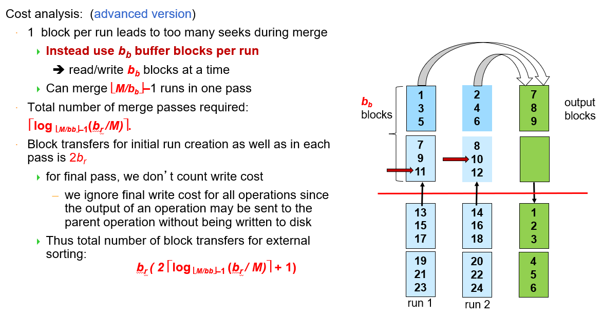
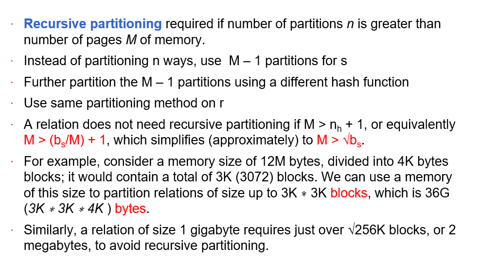

# 数据库系统概念

[TOC]

## reference

1. [mysql 官方中文文档](https://docs.gitcode.net/mysql/guide/)
1. [W3School](https://www.w3schools.cn/mysql/default.html)
1. [教材官网](https://www.db-book.com/)
1. [随机生成数据库数据教程](https://cloud.tencent.com/developer/article/1373196#:~:text=MySQL%20%E4%BB%8E%E9%9B%B6%E5%BC%80%E5%A7%8B%EF%BC%9A08%20%E7%95%AA%E5%A4%96%EF%BC%9A%E9%9A%8F%E6%9C%BA%E7%94%9F%E6%88%90%E6%95%B0%E6%8D%AE%E5%BA%93%E6%95%B0%E6%8D%AE%201,1%E3%80%81%E7%BD%91%E9%A1%B5%E7%89%88%EF%BC%9AGeneratedata%202%202%E3%80%81%E5%AE%A2%E6%88%B7%E7%AB%AF%EF%BC%9Aspawner%203%203.%E4%BB%A3%E7%A0%81%E7%94%9F%E6%88%90%EF%BC%9Apydbgen)
    - [随机数据网站](https://generatedata.com/generator)

## intro

1. 评分标准
    - Exercise（作业） 10%
    - Quiz（测试+讨论） 10%  
    - Lab & Project （实验和大程） 30%   
    - Exam （考试） 50% 
2. 参考
    - ch1 Introduction：纸质书
    - ch2 Relational Model：纸质书
    - ch3 Introduction to SQL：ppt + 笔记


## Course Note

### ch3 Introduction to SQL

1. DDL
    - **Domain Types**: 5 - 6
    - create table: 7 - 10
        - forein key 的完整性条件维护方法：10 [添加外键约束](https://blog.csdn.net/lvtula/article/details/81940429) [查看、删除外键约束](https://www.php.cn/mysql-tutorials-493494.html#:~:text=%E5%9C%A8mysql%E4%B8%AD%EF%BC%8C%E5%8F%AF%E4%BB%A5%E5%88%A9%E7%94%A8ALTER%20TABLE%E8%AF%AD%E5%8F%A5%E9%85%8D%E5%90%88DROP%E5%85%B3%E9%94%AE%E5%AD%97%E6%9D%A5%E5%88%A0%E9%99%A4%E5%A4%96%E9%94%AE%E5%85%B3%E7%B3%BB%EF%BC%88%E7%BA%A6%E6%9D%9F%EF%BC%89%EF%BC%8C%E8%AF%AD%E6%B3%95%E2%80%9CALTER%20TABLE%20%E6%95%B0%E6%8D%AE%E8%A1%A8%E5%90%8D%20DROP,FOREIGN%20KEY%20%E5%A4%96%E9%94%AE%E7%BA%A6%E6%9D%9F%E5%90%8D%3B%E2%80%9D%EF%BC%9B%E2%80%9CALTER%20TABLE%E2%80%9D%E8%AF%AD%E5%8F%A5%E7%94%A8%E4%BA%8E%E4%BF%AE%E6%94%B9%E8%A1%A8%EF%BC%88%E6%94%B9%E5%8F%98%E5%8E%9F%E6%9C%89%E8%A1%A8%E7%9A%84%E7%BB%93%E6%9E%84%EF%BC%89%EF%BC%8C%E8%80%8C%E6%B7%BB%E5%8A%A0%E4%BA%86%E2%80%9CDROP%20FOREIGN%20KEY%E2%80%9D%E8%AF%AD%E5%8F%A5%E5%90%8E%EF%BC%8C%E4%BF%AE%E6%94%B9%E5%8A%9F%E8%83%BD%E5%B0%B1%E9%99%90%E5%88%B6%E5%9C%A8%E5%88%A0%E9%99%A4%E5%A4%96%E9%94%AE%E5%85%B3%E7%B3%BB%EF%BC%88%E7%BA%A6%E6%9D%9F%EF%BC%89%E4%B8%8A%E3%80%82)
    - drop & alter table: 11 [修改表结构](https://www.yisu.com/zixun/620726.html#:~:text=mysql%E4%BF%AE%E6%94%B9%E8%A1%A8%E7%BB%93%E6%9E%84%E7%9A%84%E8%AF%AD%E5%8F%A5%E6%98%AF%E2%80%9CALTER%20TABLE%E2%80%9D%EF%BC%8C%E8%AF%A5%E8%AF%AD%E5%8F%A5%E5%8F%AF%E4%BB%A5%E6%94%B9%E5%8F%98%E5%8E%9F%E6%9C%89%E8%A1%A8%E7%9A%84%E7%BB%93%E6%9E%84%EF%BC%8C%E4%BE%8B%E5%A6%82%E5%A2%9E%E5%8A%A0%E6%88%96%E5%88%A0%E5%87%8F%E5%88%97%E3%80%81%E6%9B%B4%E6%94%B9%E5%8E%9F%E6%9C%89%E5%88%97%E7%B1%BB%E5%9E%8B%E3%80%81%E9%87%8D%E6%96%B0%E5%91%BD%E5%90%8D%E5%88%97%E6%88%96%E8%A1%A8%E7%AD%89%EF%BC%9B%E8%AF%AD%E6%B3%95%E6%A0%BC%E5%BC%8F%E4%B8%BA%E2%80%9CALTER%20TABLE,%3C%E8%A1%A8%E5%90%8D%3E%20%5B%E4%BF%AE%E6%94%B9%E9%80%89%E9%A1%B9%5D%E2%80%9D%E3%80%82%20%E6%9C%AC%E6%95%99%E7%A8%8B%E6%93%8D%E4%BD%9C%E7%8E%AF%E5%A2%83%EF%BC%9Awindows7%E7%B3%BB%E7%BB%9F%E3%80%81mysql8%E7%89%88%E6%9C%AC%E3%80%81Dell%20G3%E7%94%B5%E8%84%91%E3%80%82)
2. DML(query)
    - SQL 和关系代数的联系：12-14
    - select: 16 - 18
    - where: 19 - 20 [关系代数 AND, OR, NOT](https://www.w3schools.cn/mysql/mysql_and_or.html)
        - 字符串操作：28 - 29
        - null value: 36 - 37
    - from: 21 - 25
        - natural **JOIN**: 23 - 26
        - 不能直接用 natural join 的例子：25 - 26
        - 其他：left join, right join, full join, etc.
    - rename(as): 27
    - order by: 30
    - limit: 31
    - 集合操作(union (all), intersect (all), except (all)): 34 - 35
    - 合计函数: 38 - 44
        - group by: 40
        - having: 42
        - null value in aggregate functions: 43
        - 合计函数 + 代数运算：44
    - nested subqueries: 45 - 62
        - set membership(in & not in): 46 - 47
        - set comparisons(some & all): 48 - 52
            - scalar subquery: 52
        - set cardinality(exists & not exists): 53 - 55
        - 检查多重集(unique): 56 - 58
        - 在 from 语句中嵌套: 59 - 60
        - with 嵌套: 61 - 62
3. DML(modification): 63 - 70
    - delete: 64 - 65
        - 时序问题：65
    - insert: 66 - 67
        - 单行插入(value): 66
        - 多行插入(select): 67
    - update(set + where, set + case): 68 - 70

[补充：视图](https://blog.csdn.net/moxigandashu/article/details/63254901)

补充：WorkBench 的使用参考 “实验二举例 MySQL”。

补充：补充阅读 / MySQL JOIN cheat sheet

tips: as 的优先级比 natural join 高，`A natural join B as C` C 指代的是 B 而不是 `A natural B`。

补充：[数据库生成随机数据](https://cloud.tencent.com/developer/article/1373196#:~:text=MySQL%20%E4%BB%8E%E9%9B%B6%E5%BC%80%E5%A7%8B%EF%BC%9A08%20%E7%95%AA%E5%A4%96%EF%BC%9A%E9%9A%8F%E6%9C%BA%E7%94%9F%E6%88%90%E6%95%B0%E6%8D%AE%E5%BA%93%E6%95%B0%E6%8D%AE%201,1%E3%80%81%E7%BD%91%E9%A1%B5%E7%89%88%EF%BC%9AGeneratedata%202%202%E3%80%81%E5%AE%A2%E6%88%B7%E7%AB%AF%EF%BC%9Aspawner%203%203.%E4%BB%A3%E7%A0%81%E7%94%9F%E6%88%90%EF%BC%9Apydbgen)

### ch4 Intermidiate SQL

- Domain Type 拓展
    - 用户自定义类型(类似 typedef): PPT 12
    - blob：PPT 14
- 完整性约束：书 4.4 节
    - foreign key 引用自己的例子：PPT 21
    - 自动生成 unique key values：书 4.5.6
- assertion：单独定义的复杂 check，PPT 24
- view：书 4.2 节
    - MySQL 没有 materialized view，只能用 table + trigger 实现
- index：书 4.6 节
- transaction：书 4.3 节
    - transaction 举例：PPT 36
    - ACID property：PPT 37
- Authorization：书 4.7 节


### ch5 database API

- 缩写汇总：PPT 5
- 注入攻击 [参考文章](https://www.easysoft.com/developer/sql-injection.html)
- [SQLJ 手册](https://docs.oracle.com/en/database/oracle/oracle-database/21/jsqlj/)
- trigger：[MySQL trigger 语法](https://dev.mysql.com/doc/refman/8.0/en/trigger-syntax.html)
- [JDBC 手册](https://docs.oracle.com/javase/tutorial/jdbc/index.html)
- [ODBC 手册](https://docs.oracle.com/cd/E17952_01/connector-odbc-en/index.html)
- [Embedded SQL 手册 1](https://docs.oracle.com/en/database/oracle/oracle-database/21/lnpcc/embedded-SQL.html)
- [Embedded SQL 手册 2](https://docs.oracle.com/cd/A87860_01/doc/appdev.817/a42525/ch04.htm)

创建新用户时的问题：[MySQL Workbench 8.0 点击Server Status面板Could not acquire management access for administration报错问题解决](https://www.cnblogs.com/MarcLiu/p/17180986.html)


### ch6 E-R model

#### 设计 E-R model


- 基本元素
    - 方框：entity，实体
    - 菱形：relation，实体之间的关系
    - 双层菱形：weak relation。比如 `section` 自己无法唯一确定一个实体，是一个 weak entity set，依赖 `course` 存在，称为 identifying entity set。`section` 需要补充 `course` 的主键才能成为一个独立的表格，这种关系用双层菱形表示。
- 联系类型
    - 箭头：表示多对一的关系。比如从 `inst_dept` 指向 `department` 的箭头，表示一个 `instructor` 只能有一个 `department`
    - 双实线：total participant，全参与。比如 `instructor` 和 `inst_dept` 之间的双实线表示每个 `instructor` 一定属于一个 `department`
    - 单实线：participant，既没有一对多又没有要求全参与。比如 `student` 和 `takes` 之间的单实线，表示一个 `student` 可以不 `takes` 任何 `section`，一个 `section` 也可以有多个 `student` 来 `takes`
    - 虚线：表示附加属性。比如上课了就会有成绩，需要 `grade` 来记录
- 减少冗余
    - primary key 相同的所有表都可以合并
        - 被箭头和双实线连接的 relation 不会出现在 DDL 中，因为其属性可以并入双实线连接的 entity 中。
    - weak entity set
        - 比如 section 不用存课程名字、学分等信息，减少冗余。

#### E-R model 补充概念


---


- 多元关系一定可以转化为一些二元关系。比如可以实体化 `proj_guide`，将三元关系转化为 3 个二元关系

---


- multivalued：一个 entity 的同一个 attribute 可以有多个值，比如电话号码
- cmoposite：多个 attribute 的组合，比如 `first name` 和 `last name` 可以是一组 composite attribute，组成 `name`

e.g. 缩进表示符复合属性，大括号表示多值属性，小括号表示派生属性


---

mapping cardinality 映射基数

one to one, one to many, etc. 用连线的类型表示，比如一对一就是两个箭头。

---


#### 将 E-R model 转化为关系数据库的 DDL

- 可以不建表的元素：
    - 弱实体的 identifying relationship
    - 一对多的 relationship


---

- 主键的选择

---

- composite attribute: 
    1. flattened out by creating a separate attribute for each component attribute
    1. 一个表格用于存储 detail，一个用于存储组合后的属性，例如 `time_slot_detail(time_slot_id, day, start_time, end_time)` + `time_slot(time_slot_id)`
- multivalued attribute: 新建一张表格

---

常见错误：一个学生上某门课，一般不可能只有一次作业。可以设计成多值属性，但在转化为关系数据模型时一般会变成 c 图中的样子。


---

设计原则

- attribute 转化为 entity，可以增强 E-R 图的表达能力。例如新建表可以表达 multivalued attribute。
- relationship 转化为 entity，可以增强 E-R 图的表达能力。例如把购买关系实体化为订单，可以和用户、支付方式、商品建立关系。
- 多元联系实体化为 entity，再和原来连接的 entity 之间建立二元联系。

---

Specialization(特化) & Generalization（概化）


- overlapping: 子类可能有重合部分
- disjoint: 子类没有交集
- partial: 展示部分子类，可能存在其他类型
- total: 展示所有子类

实现方法 * 3-：P278 6.8.6.1

#### e.g. 12306 数据库设计

改进方案：

1. “车次” entity 去掉“过站信息”的多值属性，在“过站”关系上加上衍生属性“站点次序”。去除冗余信息。
1. 在“车票”和“用户”之间新增 entity “订单”，可与多张票建立关系，包含订单号、下单时间、价格等信息。
1. 新增 entity “区间”，包含所有的两站之间有铁路相连的站点对。“车次模式”和“区间”之间建立关系，表示一趟车会经过哪些区间。
1. 新增 entity “车次_区间_座位”，即实体化一个三元关系，其中包含属性：
    1. 车次的 format_id 和发车日期
    1. 区间 id
    1. 座位 id
    1. 价格 & 是否被购买
    - 这张表用来存储座位的购买信息，支持查询经过一些区间的车票
1. 新增关系“订单信息”，在“订单”和“车次_区间_座位”之间建立关系。

### ch7 Relational Database Design

1. decomposition
    - lossy: PPT 9
    - lossless
    - dependency preservation: PPT 39, 40
        - 保留的例子 & 不保留的例子: PPT 41
1. functional dependency
    - combined schema 的问题：PPT 5 7
    - 用 functional dependency 证明 lossless decomposition: PPT 11
    - closure F+: PPT 20
    - attribute set closure: PPT 25
        - 自动化计算方法: PPT 25
        - 求 superkey: PPT 27
        - 求 F+: PPT 28
    - dependency 推导
        - armstrong's axioms: PPT 21
        - collarary: PPT 23, 24
    - canonical cover: PPT 29
        - 正式定义: PPT 31
        - 求最简覆盖算法: PPT 31
1. normal forms
    - 1NF
    - 2NF
    - 3NF
        - motivation：BCNF 不一定能满足依赖 dependency preservation，削弱条件
        - 定义：PPT 46
        - 分解成 3NF 的算法：PPT 49
    - BCNF: PPT 35
        - 不是 BCNF 的例子: PPT 34, 35
        - 分解成 BCNF 的算法: PPT 36，37
        - 非 BCNF 的问题：信息冗余、插入异常、更新困难 PPT 5
    - 4NF
        - motivation：BCNF 无法处理多值依赖导致的问题，需要一个更强的条件
        - 多值依赖：PPT 59, 60
        - 多值依赖的性质：PPT 61, 63
            - 函数依赖一定是多值依赖
            - 若存在多值依赖 X->->Y，一定存在 X->->(R-Y)。即多值依赖一定是成对出现的
        - 分解成 4NF 的方法：PPT 65

---

lossless 和 dependency-preserved 的区别：前者是分开的两个 relation natural jion 之后能变成和分开前一样。后者是保证只要检查分开后每张表自己的 functional dependency，就可以保证分开前的所有依赖都满足。

### ch8 面向对象数据库

- 面向对象数据库
    - 关系数据库的局限性：PPT 5，书（多个作者，多个关键词，拥有多个属性的出版社属性）
    - array & set：PPT 9
    - 自定义类型：PPT 10
    - 类型的继承 & 表的继承：PPT 11
    - 引用类型：PPT 12
    - 从面向对象到关系形式的转化：ORM，PPT 13-17
- 半结构数据类型
    - xml
        - 树结构和 XPATH 查询：PPT 29
        - XQUERY： PPT 30
    - json


### ch9 数据存储

1. 物理存储介质
    - 存储级别：
    - 磁盘
        - 相关概念：ppt 6
        - 磁盘性能指标：ppt 10 - 12
        - 磁盘性能优化方案：ppt 13 - 15
    - flash: SSD: ppt 16
    - NVM: ppt 18

1. 数据存储结构

- [数据存储模型：NSM, DSM, PAX](https://www.jianshu.com/p/eb44bd5bc786)
- [cache miss](https://www.cnblogs.com/jokerjason/p/10711022.html)

### ch14 索引 Indexing

1. ordered index: ppt 5，注重概念
1. B+ 树
    - 插入的例子：
    - 删除的例子：
    - 综合的例子：
    - bulk loading: ppt 45, 两种方法，bottom up build 和排序了再插入
    - B+ tree file organization: ppt 41, 注意这里叶子节点存放 record 而不是指向 record 的指针
    - multi-key: ppt 51
1. cache conscious: ppt 54
    - cache miss：CPU 要访问的数据在 cache 中有缓存，就叫 hit，否则叫 miss
1. LSM: log-structured merge tree
    - one kind of "write-optimized tree": ppt 55, 56
    - insert 操作：ppt 57，满的时候合并，合并的时候使用 bottom up build
    - delete 操作：ppt 60, 打 lazy tag，查询的时候忽略，合并的时候删除
    - benefit: ppt 58
1. stepped-merge index: ppt 59
1. Buffer tree: ppt 61，有点 lazy 操作的味道，插入的 record 可能存在非叶子节点里，等满了再往下更新
1. bitmap indices: ppt 62

### ch15 Query Processing

#### 基本查询步骤


#### 查询优化——逻辑优化（关系代数的顺序）

1. 尽早执行选择算子
1. 先进行结果 item 更少的 join


最终结果等价，但是效率不同。

#### 查询优化——物理优化（关系代数的实现）

1. 选择算子可以有很多种实现方法：比如线性扫描、B+树索引
1. join 算子可以有多种实现方法：比如 hash join, merge join
1. pipeline 方法：部分结果产出之后直接送到上层，上层算子可以并行执行


#### 查询代价估算

如何简化代价估算？

1. 仅考虑磁盘 IO 代价，不考虑 CPU 运行时间等代价（并不是不存在时间代价，但是只考虑 dominate 的因素）
1. 不区分磁盘读和写的速度，看成一样的。

代价估算中考虑哪些因素？

1. 磁盘寻找(seek)：磁头移动到磁盘中的特定位置
1. 磁盘传输(transfer)：将磁盘块读到内存中或者将内存中的数据写到磁盘中


---

在估算代价时考虑最坏情况：

1. 内存：只给最小的内存空间
1. 磁盘读写次数：默认所有需要的磁盘块都不在内存中(miss)，都需要进行 seek 和 transfer

#### 选择算子

##### A1 (Linear Search)

worst case: $Cost = t_S + t_T * b_r$，$b_r$ 是用于存放表的磁盘块的总数

如果是带条件的选择，可以认为 average case: $Cost = t_S + t_T * \frac{b_r}{2}$。如果 attribute 只有两个不同的取值，那么选择出的 item 期望只有 50%。

##### A2 (primary B+-tree index / clustering B+-tree index, equality on key)

主键上建立的索引，不存在重复的键值：$Cost = (h_i+1)*(t_T+t_S)$


##### A3 (primary B+-tree index/ clustering B+-tree index, equality on nonkey)

主键上建立的索引（键值相同的数据连续存储），存在重复的键值：$Cost = h_i*(t_T+t_S) + t_S + t_T*b$


##### A4 (secondary B+-tree index , equality on key)

非主键上建立的索引，不存在重复的键值：$Cost = (h_i+1)*(t_T+t_S)$


##### A4' (secondary B+-index on nonkey, equality on nonkey)

非主键上建立的索引，存在重复的键值: $Cost=(h_i+n+m)*(t_T+t_S)$

- 假设最坏情况，n 个记录都在不同的块上
- n pointers may be stored in m blocks


##### 范围选择

A5 (primary B+-index / clustering B+-index index, comparison)

主键上建立的索引，范围查找：$Cost = h_i*(t_T+t_S) + t_S + t_T*b$

A6 (secondary B+-tree index, comparison)

非主键上建立的索引，范围查找：非常大

##### 多条件选择

A7: 先用一个条件（优先选有索引的条件）选出磁盘块，读到内存中再检查其他的条件
A8: 存在复合索引，可以一次筛选多个条件，那就先用复合索引找
A9: 先分别筛选各个条件，最后取交集


---

A10: 如果所有条件都有索引，先用索引查找，最后取并集。否则直接线性扫描
Negation: 考虑正难则反


#### 磁盘排序 external sort

##### 排序过程

先进行 in memory 的排序，生成长度为内存大小的归并段
- run 的个数为 $b / M$ 总块数除以内存块数


---

然后进行合并操作

- 在一次合并中，给每个归并段分配一个内存缓冲区（大小为一个 page），给结果分配一个内存缓冲区
- 如果归并段数量大于等于缓冲区数量，则需要多次归并


##### 代价估计

**simple version**：假设每个 run 只分配一个缓冲区。这样做会导致 seek 的次数增加。

首先估算磁盘读写的次数

- 注意最后一次不写入磁盘，默认使用 pipeline，将结果送到上层
- 注意能够给 run 使用的缓冲区个数只有 M-1，剩下的一个要给结果用
- block transfer 包含三部分：
    1. in memory 排序，每个 page 都要读写各一次
    1. 归并过程，归并轮数乘以块个数
    1. 最后一次归并，只读不写


---

然后估算磁盘寻找的次数

- 最后一次不写入磁盘，所以 seek 次数也要相应减一


---

**advanced version**：假设每个 run 分配多个缓冲区。能够减少 seek 的次数，但是归并轮数增加

- $b_b$ 的选择是 seek 次数和归并轮数的 tradeoff，可以写出解析公式尝试求解




#### 连接算子

##### nested-loop join


- 估算磁盘读写次数：外层循环中每个块都需要被读一次 + 内层循环中每个块都需要被读外层循环次数次
- 估算磁盘寻址次数：
    - 因为磁头只有一个，虽然在进入内层循环后外层循环的块不需要进行读写，但磁头不会继续指向外层循环的块。每次重新开启一轮外层循环，就需要重新对外层循环的块进行寻址
    - 每次进入内层循环，都只需要寻址一次，之后是线性扫描，不需要 seek
- 默认使用 pipeline，结果将直接进入上层，不会被写入磁盘


##### Block nested-loop join

和 nested-loop join 的区别在于：外层循环每次取出一个块而不是一条记录。减少了外层循环的读写和寻址次数


可以发现：外关系越小越好

---

improvement：之前都默认内存只有三个缓冲区，分别给内存循环、外层循环、输出使用。现在将缓冲区增加到 M 块。然后我们将多出来的缓冲区全都分给**外层循环**。

- 为什么分给外层循环有用？根据 block nested-loop join 的代价估算公式，外关系需要多少次读写会影响性能，但是内关系就不会影响


两种优化思想：

1. 如果 join 是等值连接，且等值条件的 attribute 是内关系的 key，则一旦找到一条符合的记录就可以退出循环了。对外层循环同理
1. Scan inner loop forward and backward alternately, to make use of the blocks remaining in buffer (with LRU replacement)
    - 解释：如果 buffer 策略是 LRU（最近最少访问），那么上一次内层循环的最后几条记录将会留在缓冲区中，改变循环方向将会减少内存读写

##### Indexed nested-loop join

外层循环同 block nested-loop join，内层循环用 index 查询

- 外循环代价：每次读一个块
- 内循环代价：$n_r$ 次用 index 进行查询


##### Merge-join

使用条件：必须是等值连接（包含自然连接），最好能已经有序

算法：
- 先按连接属性排序
- 再执行一个归并过程，碰到两个相同属性就合并产生结果


---

代价估算：

简单计算：假设每个 run 分配的内存 page 数相同，为 $b_b$
- 注意：如果原来数据没有排序好，则需要对两个序列分别做排序，计算排序的代价


再优化：每个 run 分配的内存 page 数不同


##### hybrid merge-join

使用条件：一个序列已经排好，另一个序列的连接属性上有 secondary-index
- 先把【有序序列】和【无序序列的索引】连接
- 然后排序，用线性扫描的方法把索引换成记录


##### Hash-join

使用条件：等值连接（包含自然连接）

哈希函数：用于做 partition，把需要连接的两个关系都分割成 n 块
- n 的取值需要满足：s 的每个 partition 能放到内存中
- 修正因子 (fudge factor)：一般来说块数都取得稍微大一点


分片：
- build input (relation)
- probe input (relation)


---

算法流程：
- 在内存中需要给每个 partition 分配一个 page 用于 output（先假设内存够用）
- 在 build input 中再使用一个哈希函数，用于 probe input 快速查找对应的 build input


---

recursive partition:
- 使用条件：本来应该给每个 partition 分配一个 page 用于 output，但是内存 page 数 M 比 partition 个数 n 小，一次放不下
- 重要公式：$M>\sqrt{b_s}$ 则不需要 recursive partition
    - 例题：需要至少多大的内存，才不用 recursive partition



---

代价估算：
- block transfer 代价组成
    - 分片的过程要把所有 block 读写各一次，probe 的时候再读一次，写到 pipeline 里
    - 由于每个 partition 实际存储的记录数量往往比预期的要多一点，会导致 partition 不是全满的，从而导致分片之后需要的存储空间比原来的多了 $n_h$ 个 block。但一般忽略这块代价
- block seek 代价组成
    - 分片过程中，每次读入和写出块都需要 seek，因为读写是交错的，不能保证磁头是移动到相邻位置。probe 过程只需要线性扫描，seek 次数为 2，可以忽略。
    - 通过增加每次读写的内存块数，减少 seek 的次数


---

含 recursive partition 的代价估计：
- 主要就是 partition 轮数的公式


## 错题摘录

### 某次小测（标注章节）

except 注意加括号，否则运算顺序容易出错。

```sql
select A.ID, A.customer_name, A.customer_street, A.customer_city
from customer as A
where not exists ((
	select B.branch_name
    from branch as B
    where B.branch_city = "Brooklyn"
) except (
	select D.branch_name
    from depositor as C natural join account as D
    where A.ID = C.ID
)) ;
```

---

两张表具有同名但含义不同的列时特别注意，不能直接用 natrual join

### query processing

1. 


答案有误，不用参考。但是需要注意的是有很多因素会影响代价估算公式：

1. 内存的 page 数
    - 分类讨论：内存 page 数和表的 block 数之间的大小关系
1. 谁是 outer relation
1. 对 merge sort / merge join / hash join 这些需要输入输出缓冲区的方法，缓冲区大小 $b_b$ 也是人为设置的
1. 对 hash join 来说，还有是否 recursive partition，需要讨论

如果题目没有明确说明就要讨论。

---

2. 


Q1 和 Q2 的区别在于 Q1 只用输出一条记录，但是 Q2 可能输出多条。

一般情况下，estimated cost 用 **average case cost** 表示。所谓的 **worst case** 是指不特别说明的情况下默认使用最少的内存。


---

3. 


辨析一下这两题的区别，同样是 block nested-loop join，前者默认只有 3 个缓冲区，后者有更多的缓冲块可以使用。

**注意是 $M-2$，不是 $M-1$**

---

4. 


B+树索引，**默认根节点不在内存中**，按照公式计算 transfer 和 seek 都是 $h_i+1$ 次。

---

5. 


注意 external sorting 包含 in-memory sorting 和 merging **两个部分**，total number 就是指两个过程的总和。


## 实验记录


## cheat sheet

以下都是我完全记不住的东西：

- trigger 的语法
- function 的语法
- query processing 代价估计公式


## OceanBase 讲座

数据库的核心技术：事务！

- 实时系统，调试困难，难以跟踪
- 主备库一致性问题
- 分布式数据库，硬件持久性问题，硬件成本问题

现代数据库：处理突发高并发

机遇：互联网发展红利期，淘宝支付宝的需求

---

问题1：收藏夹（上亿） & 商品（百万）的连接

原地实时更新 -> 批量异步更新

修改量相对于原始数据量来说非常小，用一台机器存修改量，每天两点更新并生成快照

---

问题2：防掉电（主备库至少两份备份） & 可用性（备库掉电或断网不影响使用） tradeoff，并减少应急的情况

[paxos 分布式协议](https://zhuanlan.zhihu.com/p/31780743)：主库只需要备份到其中一个备库，备库合并可做成主库

恢复时间 30s

---

问题3：新旧系统的兼容性，换系统

---

问题4：交易（行存） & 分析（列存）

增量部分，因为频繁写，所以行存

---

根据业务量实时伸缩，减少成本

压缩数据，利用 cpu 性能

---

问题5：数据正确性

[CRC 校验](https://zhuanlan.zhihu.com/p/256487370)

备库数据更行：回放日志

---

[oceanBase 社区](https://open.oceanbase.com/)
- 其他竞争者：google spanner

