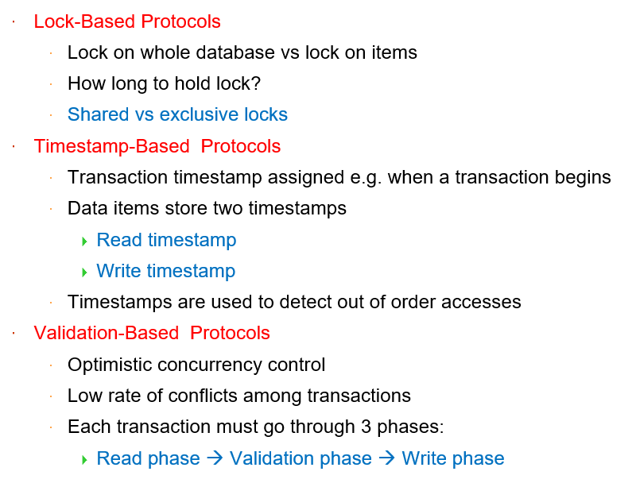
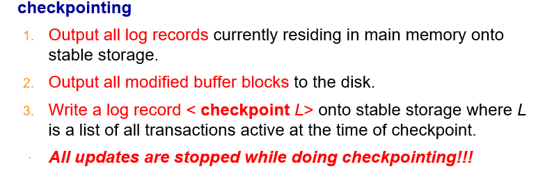
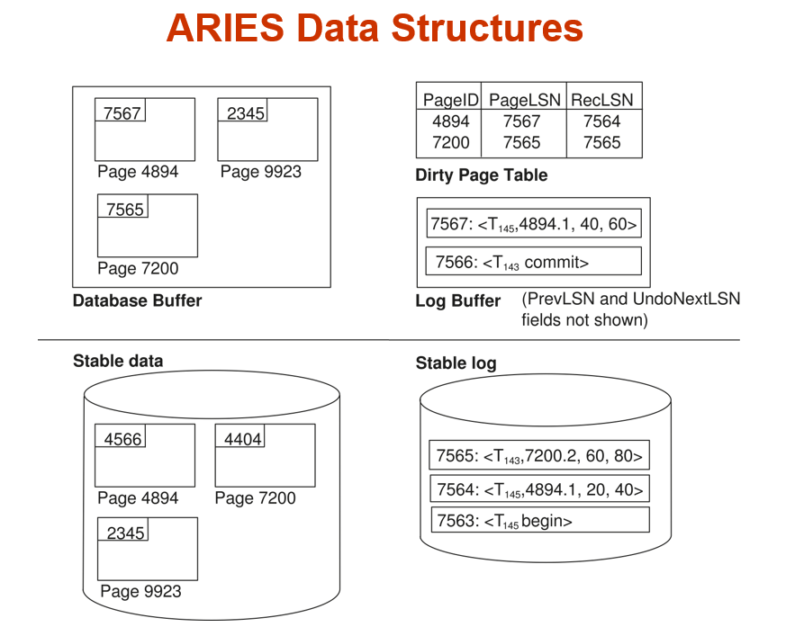

# 数据库系统概念

[TOC]

## reference

1. [mysql 官方中文文档](https://docs.gitcode.net/mysql/guide/)
1. [W3School](https://www.w3schools.cn/mysql/default.html)
1. [教材官网](https://www.db-book.com/)
1. [随机生成数据库数据教程](https://cloud.tencent.com/developer/article/1373196#:~:text=MySQL%20%E4%BB%8E%E9%9B%B6%E5%BC%80%E5%A7%8B%EF%BC%9A08%20%E7%95%AA%E5%A4%96%EF%BC%9A%E9%9A%8F%E6%9C%BA%E7%94%9F%E6%88%90%E6%95%B0%E6%8D%AE%E5%BA%93%E6%95%B0%E6%8D%AE%201,1%E3%80%81%E7%BD%91%E9%A1%B5%E7%89%88%EF%BC%9AGeneratedata%202%202%E3%80%81%E5%AE%A2%E6%88%B7%E7%AB%AF%EF%BC%9Aspawner%203%203.%E4%BB%A3%E7%A0%81%E7%94%9F%E6%88%90%EF%BC%9Apydbgen)
    - [随机数据网站](https://generatedata.com/generator)

## intro

1. 评分标准
    - Exercise（作业） 10%
    - Quiz（测试+讨论） 10%  
    - Lab & Project （实验和大程） 30%   
    - Exam （考试） 50% 
2. 参考
    - ch1 Introduction：纸质书
    - ch2 Relational Model：纸质书
    - ch3 Introduction to SQL：ppt + 笔记


## Course Note

### ch3 Introduction to SQL

1. DDL
    - **Domain Types**: 5 - 6
    - create table: 7 - 10
        - forein key 的完整性条件维护方法：10 [添加外键约束](https://blog.csdn.net/lvtula/article/details/81940429) [查看、删除外键约束](https://www.php.cn/mysql-tutorials-493494.html#:~:text=%E5%9C%A8mysql%E4%B8%AD%EF%BC%8C%E5%8F%AF%E4%BB%A5%E5%88%A9%E7%94%A8ALTER%20TABLE%E8%AF%AD%E5%8F%A5%E9%85%8D%E5%90%88DROP%E5%85%B3%E9%94%AE%E5%AD%97%E6%9D%A5%E5%88%A0%E9%99%A4%E5%A4%96%E9%94%AE%E5%85%B3%E7%B3%BB%EF%BC%88%E7%BA%A6%E6%9D%9F%EF%BC%89%EF%BC%8C%E8%AF%AD%E6%B3%95%E2%80%9CALTER%20TABLE%20%E6%95%B0%E6%8D%AE%E8%A1%A8%E5%90%8D%20DROP,FOREIGN%20KEY%20%E5%A4%96%E9%94%AE%E7%BA%A6%E6%9D%9F%E5%90%8D%3B%E2%80%9D%EF%BC%9B%E2%80%9CALTER%20TABLE%E2%80%9D%E8%AF%AD%E5%8F%A5%E7%94%A8%E4%BA%8E%E4%BF%AE%E6%94%B9%E8%A1%A8%EF%BC%88%E6%94%B9%E5%8F%98%E5%8E%9F%E6%9C%89%E8%A1%A8%E7%9A%84%E7%BB%93%E6%9E%84%EF%BC%89%EF%BC%8C%E8%80%8C%E6%B7%BB%E5%8A%A0%E4%BA%86%E2%80%9CDROP%20FOREIGN%20KEY%E2%80%9D%E8%AF%AD%E5%8F%A5%E5%90%8E%EF%BC%8C%E4%BF%AE%E6%94%B9%E5%8A%9F%E8%83%BD%E5%B0%B1%E9%99%90%E5%88%B6%E5%9C%A8%E5%88%A0%E9%99%A4%E5%A4%96%E9%94%AE%E5%85%B3%E7%B3%BB%EF%BC%88%E7%BA%A6%E6%9D%9F%EF%BC%89%E4%B8%8A%E3%80%82)
    - drop & alter table: 11 [修改表结构](https://www.yisu.com/zixun/620726.html#:~:text=mysql%E4%BF%AE%E6%94%B9%E8%A1%A8%E7%BB%93%E6%9E%84%E7%9A%84%E8%AF%AD%E5%8F%A5%E6%98%AF%E2%80%9CALTER%20TABLE%E2%80%9D%EF%BC%8C%E8%AF%A5%E8%AF%AD%E5%8F%A5%E5%8F%AF%E4%BB%A5%E6%94%B9%E5%8F%98%E5%8E%9F%E6%9C%89%E8%A1%A8%E7%9A%84%E7%BB%93%E6%9E%84%EF%BC%8C%E4%BE%8B%E5%A6%82%E5%A2%9E%E5%8A%A0%E6%88%96%E5%88%A0%E5%87%8F%E5%88%97%E3%80%81%E6%9B%B4%E6%94%B9%E5%8E%9F%E6%9C%89%E5%88%97%E7%B1%BB%E5%9E%8B%E3%80%81%E9%87%8D%E6%96%B0%E5%91%BD%E5%90%8D%E5%88%97%E6%88%96%E8%A1%A8%E7%AD%89%EF%BC%9B%E8%AF%AD%E6%B3%95%E6%A0%BC%E5%BC%8F%E4%B8%BA%E2%80%9CALTER%20TABLE,%3C%E8%A1%A8%E5%90%8D%3E%20%5B%E4%BF%AE%E6%94%B9%E9%80%89%E9%A1%B9%5D%E2%80%9D%E3%80%82%20%E6%9C%AC%E6%95%99%E7%A8%8B%E6%93%8D%E4%BD%9C%E7%8E%AF%E5%A2%83%EF%BC%9Awindows7%E7%B3%BB%E7%BB%9F%E3%80%81mysql8%E7%89%88%E6%9C%AC%E3%80%81Dell%20G3%E7%94%B5%E8%84%91%E3%80%82)
2. DML(query)
    - SQL 和关系代数的联系：12-14
    - select: 16 - 18
    - where: 19 - 20 [关系代数 AND, OR, NOT](https://www.w3schools.cn/mysql/mysql_and_or.html)
        - 字符串操作：28 - 29
        - null value: 36 - 37
    - from: 21 - 25
        - natural **JOIN**: 23 - 26
        - 不能直接用 natural join 的例子：25 - 26
        - 其他：left join, right join, full join, etc.
    - rename(as): 27
    - order by: 30
    - limit: 31
    - 集合操作(union (all), intersect (all), except (all)): 34 - 35
    - 合计函数: 38 - 44
        - group by: 40
        - having: 42
        - null value in aggregate functions: 43
        - 合计函数 + 代数运算：44
    - nested subqueries: 45 - 62
        - set membership(in & not in): 46 - 47
        - set comparisons(some & all): 48 - 52
            - scalar subquery: 52
        - set cardinality(exists & not exists): 53 - 55
        - 检查多重集(unique): 56 - 58
        - 在 from 语句中嵌套: 59 - 60
        - with 嵌套: 61 - 62
3. DML(modification): 63 - 70
    - delete: 64 - 65
        - 时序问题：65
    - insert: 66 - 67
        - 单行插入(value): 66
        - 多行插入(select): 67
    - update(set + where, set + case): 68 - 70

[补充：视图](https://blog.csdn.net/moxigandashu/article/details/63254901)

补充：WorkBench 的使用参考 “实验二举例 MySQL”。

补充：补充阅读 / MySQL JOIN cheat sheet

tips: as 的优先级比 natural join 高，`A natural join B as C` C 指代的是 B 而不是 `A natural B`。

补充：[数据库生成随机数据](https://cloud.tencent.com/developer/article/1373196#:~:text=MySQL%20%E4%BB%8E%E9%9B%B6%E5%BC%80%E5%A7%8B%EF%BC%9A08%20%E7%95%AA%E5%A4%96%EF%BC%9A%E9%9A%8F%E6%9C%BA%E7%94%9F%E6%88%90%E6%95%B0%E6%8D%AE%E5%BA%93%E6%95%B0%E6%8D%AE%201,1%E3%80%81%E7%BD%91%E9%A1%B5%E7%89%88%EF%BC%9AGeneratedata%202%202%E3%80%81%E5%AE%A2%E6%88%B7%E7%AB%AF%EF%BC%9Aspawner%203%203.%E4%BB%A3%E7%A0%81%E7%94%9F%E6%88%90%EF%BC%9Apydbgen)

### ch4 Intermidiate SQL

- Domain Type 拓展
    - 用户自定义类型(类似 typedef): PPT 12
    - blob：PPT 14
- 完整性约束：书 4.4 节
    - foreign key 引用自己的例子：PPT 21
    - 自动生成 unique key values：书 4.5.6
- assertion：单独定义的复杂 check，PPT 24
- view：书 4.2 节
    - MySQL 没有 materialized view，只能用 table + trigger 实现
- index：书 4.6 节
- transaction：书 4.3 节
    - transaction 举例：PPT 36
    - ACID property：PPT 37
- Authorization：书 4.7 节


### ch5 database API

- 缩写汇总：PPT 5
- 注入攻击 [参考文章](https://www.easysoft.com/developer/sql-injection.html)
- [SQLJ 手册](https://docs.oracle.com/en/database/oracle/oracle-database/21/jsqlj/)
- trigger：[MySQL trigger 语法](https://dev.mysql.com/doc/refman/8.0/en/trigger-syntax.html)
- [JDBC 手册](https://docs.oracle.com/javase/tutorial/jdbc/index.html)
- [ODBC 手册](https://docs.oracle.com/cd/E17952_01/connector-odbc-en/index.html)
- [Embedded SQL 手册 1](https://docs.oracle.com/en/database/oracle/oracle-database/21/lnpcc/embedded-SQL.html)
- [Embedded SQL 手册 2](https://docs.oracle.com/cd/A87860_01/doc/appdev.817/a42525/ch04.htm)

创建新用户时的问题：[MySQL Workbench 8.0 点击Server Status面板Could not acquire management access for administration报错问题解决](https://www.cnblogs.com/MarcLiu/p/17180986.html)


### ch6 E-R model

考点：题目给出需求，设计一个 E-R 图，并转化成关系数据库模型

#### 设计 E-R model


- 基本元素
    - 方框：entity，实体
    - 菱形：relation，实体之间的关系
    - 双层菱形：weak relation。比如 `section` 自己无法唯一确定一个实体，是一个 weak entity set，依赖 `course` 存在，称为 identifying entity set。`section` 需要补充 `course` 的主键才能成为一个独立的表格，这种关系用双层菱形表示。
- 联系类型
    - 箭头：表示多对一的关系。比如从 `inst_dept` 指向 `department` 的箭头，表示一个 `instructor` 只能有一个 `department`
    - 双实线：total participant，全参与。比如 `instructor` 和 `inst_dept` 之间的双实线表示每个 `instructor` 一定属于一个 `department`
    - 单实线：participant，既没有一对多又没有要求全参与。比如 `student` 和 `takes` 之间的单实线，表示一个 `student` 可以不 `takes` 任何 `section`，一个 `section` 也可以有多个 `student` 来 `takes`
    - 虚线：表示附加属性。比如上课了就会有成绩，需要 `grade` 来记录
- 减少冗余
    - primary key 相同的所有表都可以合并
    - **被箭头和双实线连接的 relation 不会出现在 DDL 中，因为其属性可以并入双实线连接的 entity 中**。
    - weak entity set，比如 section 不用存课程名字、学分等信息，减少冗余。

#### E-R model 补充概念


---


- 多元关系一定可以转化为一些二元关系。比如可以实体化 `proj_guide`，将三元关系转化为 3 个二元关系

---


- multivalued：一个 entity 的同一个 attribute 可以有多个值，比如一个人可以拥有多个电话号码
- composite：多个 attribute 的组合，比如 `first name` 和 `last name` 可以是一组 composite attribute，组成 `name`

e.g. 缩进表示符复合属性，大括号表示多值属性，小括号表示派生属性


---

mapping cardinality 映射基数

one to one, one to many, etc. 用连线的类型表示，比如一对一就是两个箭头。

---


#### 将 E-R model 转化为关系数据库的 DDL

##### 例子


##### 可以不建表的元素

1. 弱实体的 identifying relationship
1. 一对多的 relation（箭头 + 双实线）
1. 附加属性：就直接放在附加的那个关系所建的表上就行了


##### 复合属性 & 多值属性

- composite attribute:  一个表格用于存储 detail，一个用于存储组合后的属性，例如 `time_slot_detail(time_slot_id, day, start_time, end_time)` + `time_slot(time_slot_id)`
- multivalued attribute: 新建一张表格，包含 entity 的主键和多值属性

---

常见错误：一个学生上某门课，一般不可能只有一次作业。可以设计成多值属性，但在转化为关系数据模型时一般会变成 c 图中的样子。


##### 设计原则

- attribute 转化为 entity，可以增强 E-R 图的表达能力。例如新建表可以表达 multivalued attribute。
- relationship 转化为 entity，可以增强 E-R 图的表达能力。例如把购买关系实体化为订单，可以和用户、支付方式、商品建立关系。
- 多元联系实体化为 entity，再和原来连接的 entity 之间建立二元联系。

##### Specialization(特化) & Generalization（概化）

1. specialization：把一个集合拆成几个子集，例如把 person 拆成 employee 和 student
1. generalization：从一堆子集中提取出公共部分

这两者互为反操作。


- overlapping: 子类可能有重合部分
- disjoint: 子类没有交集
- partial: 展示部分子类，可能存在其他类型
- total: 展示所有子类

---

实现方法有两种：


或者


#### e.g. 12306 数据库设计

改进方案：

1. “车次” entity 去掉“过站信息”的多值属性，在“过站”关系上加上衍生属性“站点次序”。去除冗余信息。
1. 在“车票”和“用户”之间新增 entity “订单”，可与多张票建立关系，包含订单号、下单时间、价格等信息。
1. 新增 entity “区间”，包含所有的两站之间有铁路相连的站点对。“车次模式”和“区间”之间建立关系，表示一趟车会经过哪些区间。
1. 新增 entity “车次_区间_座位”，即实体化一个三元关系，其中包含属性：
    1. 车次的 format_id 和发车日期
    1. 区间 id
    1. 座位 id
    1. 价格 & 是否被购买
    - 这张表用来存储座位的购买信息，支持查询经过一些区间的车票
1. 新增关系“订单信息”，在“订单”和“车次_区间_座位”之间建立关系。


### ch7 Relational Database Design

1. decomposition
    - lossy: PPT 9
    - lossless
    - dependency preservation: PPT 39, 40
        - 保留的例子 & 不保留的例子: PPT 41
1. functional dependency
    - combined schema 的问题：PPT 5 7
    - 用 functional dependency 证明 lossless decomposition: PPT 11
    - closure F+: PPT 20
    - attribute set closure: PPT 25
        - 自动化计算方法: PPT 25
        - 求 superkey: PPT 27
        - 求 F+: PPT 28
    - dependency 推导
        - armstrong's axioms: PPT 21
        - collarary: PPT 23, 24
    - canonical cover: PPT 29
        - 正式定义: PPT 31
        - 求最简覆盖算法: PPT 31
1. normal forms
    - 1NF
    - 2NF
    - 3NF
        - motivation：BCNF 不一定能满足依赖 dependency preservation，削弱条件
        - 定义：PPT 46
        - 分解成 3NF 的算法：PPT 49
    - BCNF: PPT 35
        - 不是 BCNF 的例子: PPT 34, 35
        - 分解成 BCNF 的算法: PPT 36，37
        - 非 BCNF 的问题：信息冗余、插入异常、更新困难 PPT 5
    - 4NF
        - motivation：BCNF 无法处理多值依赖导致的问题，需要一个更强的条件
        - 多值依赖：PPT 59, 60
        - 多值依赖的性质：PPT 61, 63
            - 函数依赖一定是多值依赖
            - 若存在多值依赖 X->->Y，一定存在 X->->(R-Y)。即多值依赖一定是成对出现的
        - 分解成 4NF 的方法：PPT 65

---

lossless 和 dependency-preserved 的区别：前者是分开的两个 relation natural jion 之后能变成和分开前一样。后者是保证只要检查分开后每张表自己的 functional dependency，就可以保证分开前的所有依赖都满足。

### ch8 面向对象数据库

- 面向对象数据库
    - 关系数据库的局限性：PPT 5，书（多个作者，多个关键词，拥有多个属性的出版社属性）
    - array & set：PPT 9
    - 自定义类型：PPT 10
    - 类型的继承 & 表的继承：PPT 11
    - 引用类型：PPT 12
    - 从面向对象到关系形式的转化：ORM，PPT 13-17
- 半结构数据类型
    - xml
        - 树结构和 XPATH 查询：PPT 29
        - XQUERY： PPT 30
    - json


### ch12 数据存储

1. 物理存储介质
    - 分类和评价标准： 
    - 存储级别：
    - 磁盘
        - 相关概念：ppt 6
        - 磁盘性能指标：ppt 10 - 12
        - 磁盘性能优化方案：ppt 13 - 15
    - flash & SSD: ppt 16
    - NVM: ppt 18

1. 数据存储结构

- [数据存储模型：NSM, DSM, PAX](https://www.jianshu.com/p/eb44bd5bc786)
- [cache miss](https://www.cnblogs.com/jokerjason/p/10711022.html)

### ch13 Data Storage Structure

#### File Organization

概念辨析：

- The **database** is stored as a collection of **files**.
- Each **file** contains a sequence of **blocks**
- Each **block** is a sequence of **records**.  
- A **record** is a sequence of **fields**.

---

1. 单文件：所有元数据 & 数据都存在同一个大文件里
1. 多文件

#### Record Structure

##### Fixed-length Record

1. 简化文件组织：不允许跨 block 的 Record（允许残余空间）
1. 实现删除操作
    1. 移动 Record：把后面所有记录往前移 or 把最后一个记录往前移
    1. 不移动 Record：用链表标记所有被释放的 Record


##### Variable-length Record

Record 的组成：

1. 定长部分：存储定长属性 & 不定长属性的 (offset, length)
1. NULL bitmap：1 表示是 NULL，0 表示不是 NULL
1. 不定长部分：存储不定长属性的属性值

---

不同属性的存放方式：

1. 定长属性
1. NULL 属性
1. 不定长属性


---

Record 在 block 中的存放方式：(slotted page structure 分槽页)

1. block header
    1. entries: 存放 record 数量
    1. (offset, length) of records
    1. pointer to end of free space：用于插入新的数据
1. free space
1. records


---

slotted page 如何实现删除：

1. 打标签标记删除的 record
1. 定期重整：移动 record 并修改 pointer，在 records 之间不留 free space

slotted page 的利弊：

1. 利：方便维护
1. 弊：增加空间

---

其他存储方式：

1. 将同一个 record 中的不同 field 分别在不同地方存储（需要一个隐含的内部排序）
1. 按行存放 -> 按列存放

#### Record Organization in File

这节讨论怎么把新的 record 分配到空闲 block 中存储

##### Heap

随机分配，只要有空闲就可以分

如何维护空闲空间

1. 链表：把所有空闲空间串起来
1. free-space map


##### Sequential

file 中所有 record 按照顺序存储。优点是针对 key 的范围查找效率高。

细节实现：
1. 删除操作
1. 插入操作
1. 重整


##### B+ tree

##### Hashing

##### 其他文件组织方式

把多张表混合存放在同一块空间中：
1. 优点：如果混合存储的表经常需要连接，那磁盘 IO 会比较连续
1. 缺点：单取其中一张表不方便


#### Data Dictionary Storage

本节讨论如何管理 metadata

可以采用类似 OOP 中类的模式进行管理

#### Buffer Manager

##### buffer manager 实现

Buffer manager 的作用：


Buffer manager 的行为：


---

用 Pin & Unpin 限制 buffer 中内存块写回 disk：

1. **Pinned block**: memory block that is not allowed to be written back to disk
    - **Pin** done before reading/writing data from a block
    - **Unpin** done when read /write is complete

---

用 lock 进行并发控制：

1. 读 buffer 中的一个块会给块施加一个 **shared lock**, 修改 buffer 中的一个块会给块施加一个  **exclusive lock**
1. lock 规则：
    - Only one process can get exclusive lock at a time
    - Shared lock cannot be concurrently with exclusive lock
    - Multiple processes may be given shared lock concurrently

##### LRU replacement

Least Recently Used, 最近最少用到

假设 block 访问模式为：最近访问多的之后也会多访问。如果违反这个模式，LRU 的效率就会很低。理想的方法是：预测未来的访问模式。


##### clock replacement

LRU 的一种实现方式：
1. 当 buffer 中某个 block 没有被任何进程 pin 时，将其 reference bit 置 1
1. 当需要找一个 block 进行替换时，采用以下策略


why does it make sense?

如果在循环到某个 block 时发现其 reference bit 为 0，说明在整个循环中他都没有被置 1，即没有被访问过，这说明他是最近最少被用到的 block。

### ch14 索引 Indexing

1. ordered index: ppt 5，注重概念
1. B+ 树
    - 插入的例子：
    - 删除的例子：
    - 综合的例子：
    - bulk loading: ppt 45, 两种方法，bottom up build 和排序了再插入
    - B+ tree file organization: ppt 41, 注意这里叶子节点存放 record 而不是指向 record 的指针
    - multi-key: ppt 51
1. cache conscious: ppt 54
    - cache miss：CPU 要访问的数据在 cache 中有缓存，就叫 hit，否则叫 miss
1. LSM: log-structured merge tree
    - one kind of "write-optimized tree": ppt 55, 56
    - insert 操作：ppt 57，满的时候合并，合并的时候使用 bottom up build
    - delete 操作：ppt 60, 打 lazy tag，查询的时候忽略，合并的时候删除
    - benefit: ppt 58
1. stepped-merge index: ppt 59
1. Buffer tree: ppt 61，有点 lazy 操作的味道，插入的 record 可能存在非叶子节点里，等满了再往下更新
1. bitmap indices: ppt 62

#### LSM

在 flash 上写操作比读操作慢很多，所以诞生了一种 Write-optimized tree structures，LSM 是其中的一种。

##### LSM 的插入

1. 先插 memory 里的 L0，直到插满
1. 如果 L0 已经满了，就和 L1 合并成 L1-new 再写回到 L1 里。具体过程如下：
    1. 使用顺序 IO 把 L1 整个读到内存中
    1. 合并 L0 和 L1 叶子节点里的数据，并使用 bottom-up 方法构造出一棵新的 B+ 树
    1. 然后再使用顺序 IO 把新树覆盖到原来 L1 的位置
1. 如果 L1 也满了，就合并到 L2，以此类推


##### LSM 的查找

一层一层遍历每一棵树，代价比较大

##### LSM 的删除和更新

- 删除：打删除标签，（然后应该会定期重构）
- 更新：删除 + 插入

##### LSM 的优缺点


#### stepped merge LSM


#### buffer tree


##### 插入

当一条索引记录要插入到Buffer Tree时，并不是像B+Tree那样从根结点走到对应的叶子结点，而是直接插入到根结点的buffer中。

如果根结点的buffer满了，那么buffer中的每个索引记录就会被下推给下一层的相应孩子结点。（如何下推？就和原来B+Tree上的插入操作一样，比较该索引记录的key和该结点的key，沿pointer下推。）

如果孩子结点仍是非叶子结点，那么就将该索引记录添加到该结点的buffer，如果该结点的buffer也满了，就以同样的方式下推。（buffer中的索引记录是有序排列的）

如果孩子节点是叶子节点，那么索引记录按B+Tree的方式插入到叶子结点中。当叶子结点填满了，就按照和B+Tree一样的方式进行分裂，但注意非叶子结点的分裂多了一步对buffer的分裂。

---

由此看出 buffer tree 是随机 IO，但是写的次数会大大减少。

假设一个非叶子节点上的buffer保存的索引记录数量是孩子节点数量的k倍。那么平均下来，进行buffer下推操作时，每个孩子结点可以批量得到k个索引记录，同时通过排序还保证了下推到不同孩子结点是 **并发执行** 的。这就体现了Buffer Tree的优势，在进行随机写入时，把对每个孩子结点进行磁盘IO的成本平均分摊在k个索引记录之间。（原来在B+Tree上，一个索引记录就要对一个结点进行磁盘IO）。而且当k足够大时，节省还是非常显著的。

##### 查询

和B+Tree的查找方式一样，从根结点开始朝着叶子结点的方向向下遍历，但是它额外需要在遍历每个非叶子结点时，检查一下该结点的buffer中是否包括要查找的目标。范围查询也是如此，需要额外检查涉及到的叶子结点的祖先结点们的buffer。

##### 删除

Buffer Tree上的删除和更新，有两种方式。既可以像LSM Tree那样使用删除项和更新项，也可以按照B+Tree的删除和更新方式来做，只不过后者的磁盘IO代价可能要高一些。

##### 优缺点

- Benefits
    1. Less overhead on queries
    1. Can be used with any tree index structure
- Drawback: more random I/O than LSM tree

### ch15 Query Processing

#### 基本查询步骤


#### 查询优化——逻辑优化（关系代数的顺序）

1. 尽早执行选择算子
1. 先进行结果 item 更少的 join


最终结果等价，但是效率不同。

#### 查询优化——物理优化（关系代数的实现）

1. 选择算子可以有很多种实现方法：比如线性扫描、B+树索引
1. join 算子可以有多种实现方法：比如 hash join, merge join
1. **pipeline 方法**：部分结果产出之后直接送到上层，上层算子可以并行执行
1. 并行方法


#### 查询代价估算

如何简化代价估算？

1. 仅考虑磁盘 IO 代价，不考虑 CPU 运行时间等代价（并不是不存在时间代价，但是只考虑 dominate 的因素）
1. 不区分磁盘读和写的速度，看成一样的。

代价估算中考虑哪些因素？

1. 磁盘寻找(seek)：磁头移动到磁盘中的特定位置
1. 磁盘传输(transfer)：将磁盘块读到内存中或者将内存中的数据写到磁盘中


---

在估算代价时考虑最坏情况：

1. 内存：只给最小的内存空间
1. 磁盘读写次数：默认所有需要的磁盘块都不在内存中(miss)，都需要进行 seek 和 transfer

#### 选择算子

##### A1 (Linear Search)

worst case: $Cost = t_S + t_T * b_r$，$b_r$ 是用于存放表的磁盘块的总数

如果是带条件的选择，可以认为 average case: $Cost = t_S + t_T * \frac{b_r}{2}$。如果 attribute 只有两个不同的取值，那么选择出的 item 期望只有 50%。

##### A2 (primary B+-tree index / clustering B+-tree index, equality on key)

主键上建立的索引，不存在重复的键值：$Cost = (h_i+1)*(t_T+t_S)$


##### A3 (primary B+-tree index/ clustering B+-tree index, equality on nonkey)

主键上建立的索引（键值相同的数据连续存储），存在重复的键值：$Cost = h_i*(t_T+t_S) + t_S + t_T*b$


##### A4 (secondary B+-tree index , equality on key)

非主键上建立的索引，不存在重复的键值：$Cost = (h_i+1)*(t_T+t_S)$


##### A4' (secondary B+-index on nonkey, equality on nonkey)

非主键上建立的索引，存在重复的键值: $Cost=(h_i+n+m)*(t_T+t_S)$

- 假设最坏情况，n 个记录都在不同的块上
- n pointers may be stored in m blocks（红点太多了，一个块存不下）


##### 范围选择

A5 (primary B+-index / clustering B+-index index, comparison)

主键上建立的索引，范围查找：$Cost = h_i*(t_T+t_S) + t_S + t_T*b$

A6 (secondary B+-tree index, comparison)

非主键上建立的索引，范围查找：非常大

##### 多条件选择

A7: 先用一个条件（优先选有索引的条件）选出磁盘块，读到内存中再检查其他的条件
A8: 存在复合索引，可以一次筛选多个条件，那就先用复合索引找
A9: 先分别筛选各个条件，最后取交集


---

A10: 如果所有条件都有索引，先用索引查找，最后取并集。否则直接线性扫描
Negation: 考虑正难则反


#### 磁盘排序 external sort

##### 排序过程

先进行 in memory 的排序，生成长度为内存大小的归并段
- run 的个数为 $b / M$ 总块数除以内存块数


---

然后进行合并操作

- 在一次合并中，给每个归并段分配一个内存缓冲区（大小为一个 page），给结果分配一个内存缓冲区
- 如果归并段数量大于等于缓冲区数量，则需要多次归并


##### 代价估计

**simple version**：假设每个 run 只分配一个缓冲区。这样做会导致 seek 的次数增加。

首先估算磁盘读写的次数

- 注意最后一次不写入磁盘，默认使用 pipeline，将结果送到上层
- 注意能够给 run 使用的缓冲区个数只有 M-1，剩下的一个要给结果用
- block transfer 包含三部分：
    1. in memory 排序，每个 page 都要读写各一次
    1. 归并过程，归并轮数乘以块个数
    1. 最后一次归并，只读不写


---

然后估算磁盘寻找的次数

- 最后一次不写入磁盘，所以 seek 次数也要相应减一


---

**advanced version**：假设每个 run 分配多个缓冲区。能够减少 seek 的次数，但是归并轮数增加

- $b_b$ 的选择是 seek 次数和归并轮数的 tradeoff，可以写出解析公式尝试求解


#### 连接算子

##### nested-loop join


- 估算磁盘读写次数：外层循环中每个块都需要被读一次 + 内层循环中每个块都需要被读外层循环次数次
- 估算磁盘寻址次数：
    - 因为磁头只有一个，虽然在进入内层循环后外层循环的块不需要进行读写，但磁头不会继续指向外层循环的块。每次重新开启一轮外层循环，就需要重新对外层循环的块进行寻址
    - 每次进入内层循环，都只需要寻址一次，之后是线性扫描，不需要 seek
- 默认使用 pipeline，结果将直接进入上层，不会被写入磁盘


##### Block nested-loop join

和 nested-loop join 的区别在于：外层循环每次取出一个块而不是一条记录。减少了外层循环的读写和寻址次数


可以发现：外关系越小越好

---

improvement：之前都默认内存只有三个缓冲区，分别给内存循环、外层循环、输出使用。现在将缓冲区增加到 M 块。然后我们将多出来的缓冲区全都分给**外层循环**。

- 为什么分给外层循环有用？根据 block nested-loop join 的代价估算公式，外关系需要多少次读写会影响性能，但是内关系就不会影响


两种优化思想：

1. 如果 join 是等值连接，且等值条件的 attribute 是内关系的 key，则一旦找到一条符合的记录就可以退出循环了。对外层循环同理
1. Scan inner loop forward and backward alternately, to make use of the blocks remaining in buffer (with LRU replacement)
    - 解释：如果 buffer 策略是 LRU（最近最少访问），那么上一次内层循环的最后几条记录将会留在缓冲区中，改变循环方向将会减少内存读写

##### Indexed nested-loop join

外层循环同 block nested-loop join，内层循环用 index 查询

- 外循环代价：每次读一个块
- 内循环代价：$n_r$ 次用 index 进行查询


##### Merge-join

使用条件：必须是等值连接（包含自然连接），最好能已经有序

算法：
- 先按连接属性排序
- 再执行一个归并过程，碰到两个相同属性就合并产生结果


---

代价估算：

简单计算：假设每个 run 分配的内存 page 数相同，为 $b_b$
- 注意：如果原来数据没有排序好，则需要对两个序列分别做排序，计算排序的代价


再优化：每个 run 分配的内存 page 数不同


##### hybrid merge-join

使用条件：一个序列已经排好，另一个序列的连接属性上有 secondary-index
- 先把【有序序列】和【无序序列的索引】连接
- 然后排序（按索引对应的记录的实际地址排序），用线性扫描的方法把索引换成记录


##### Hash-join

使用条件：等值连接（包含自然连接）

哈希函数：用于做 partition，把需要连接的两个关系都分割成 n 块
- n 的取值需要满足：s 的每个 partition 能放到内存中
- 修正因子 (fudge factor)：一般来说块数都取得稍微大一点


分片：
- build input (relation)
- probe input (relation)


---

算法流程：
- 在内存中需要给每个 partition 分配一个 page 用于 output（先假设内存够用）
- 在 build input 中再使用一个哈希函数，用于 probe input 快速查找对应的 build input


---

recursive partition:
- 使用条件：本来应该给每个 partition 分配一个 page 用于 output，但是内存 page 数 M 比 partition 个数 n 小，一次放不下
- 重要公式：$M>\sqrt{b_s}$ 则不需要 recursive partition
    - 例题：需要至少多大的内存，才不用 recursive partition


---

代价估算：
- block transfer 代价组成
    - 分片的过程要把所有 block 读写各一次，probe 的时候再读一次，写到 pipeline 里
    - 由于每个 partition 实际存储的记录数量往往比预期的要多一点，会导致 partition 不是全满的，从而导致分片之后需要的存储空间比原来的多了 $n_h$ 个 block。但一般忽略这块代价
- block seek 代价组成
    - 分片过程中，每次读入和写出块都需要 seek，因为读写是交错的，不能保证磁头是移动到相邻位置。probe 过程只需要线性扫描，seek 次数为 2，可以忽略。
    - 通过增加每次读写的内存块数，减少 seek 的次数


---

含 recursive partition 的代价估计：
- 主要就是 partition 轮数的公式


### ch16 Query Optimization

#### introduction

- cost estimation 的依据
    1. statistical information: 数据库的统计信息，比如说是否有索引，有多少不同值
    1. cadinality estimation: 对中间结果大小的估计
- 查看 evaluation plan: `explain`

#### 关系代数表达式的化简

关系代数等价变换：

- 第一条和第二条可以用在：如果 $\theta_1$ 条件上有索引，可以把 $\theta_1$ 放到底层去做，$\theta_2$ 需要处理的数据量就变少了
- 第四条、第六条、第七条可以用在：减少中间结果的大小，方法可以是小表先连接、选择操作先做
- 第五条可以用在：一些连接算法外层循环越小，代价就越小
- 第八条、第十一条可以看看

但是检测等价变换规则并替换代价太大，实际中一般是运用启发式规则。


#### 使用统计信息进行代价估计

##### 常用统计信息

1. 估计值
1. 直方图


##### 选择操作的估算方法

1. 单条件单值选择：**假设平均分布**
1. 单条件范围选择：**假设平均分布**
1. 多条件选择：**假设不同条件之间独立，且都是平均分布**


##### 连接操作的估算方法

1. 笛卡尔积
1. 自然连接
    - 如果共同属性是 key，则用两表大小的较小值来估计
    - 如果共同属性是 foreign key
    - 如果共同属性不是 key，则需要估计 r 中的一个 tuple 可能需要和 s 中的多少个 tuple 连接，这个值用 $V(A, s)$ 来估计

估值原则：一般来说是往大了估计


##### 其他操作的估算方法


##### 估计中间结果的统计数据

估计 $V(A, r)$：
1. 选择操作的结果
    - 如果选择条件直接规定了选择哪些属性值，那就不用估计了
    - 如果选择条件是范围查询，就用最大值最小值计算选中率
    - 其他情况：假设每个 tuple 的 A 属性值都不同
1. 连接操作的结果
    - 如果属性 A 只存在于其中一张表中
    - 如果属性 A 是一个复合属性，且两张表都包含其中的一部分属性
1. 投影操作的结果
1. 统计（聚合）操作的结果
    


#### 选择 Evaluation Plan

1. cost-based optimizer
    - 考虑操作的连贯性：例如 hash join 代价比 merge join 低，但是 merge join 的结果是排好序的，可能会利于上层操作的执行
    - 优化代价 & 优化结果的 tradeoff：如果 evaluation plan 将会被反复使用，则花更多的代价对其进行优化

##### Cost-based Join Order Selection

1. 可能性个数计算公式：可以看成是树的计数，左右子树交换算不同 
1. 动态规划方法：无后效性 
1. join order optimization algorithm 通用算法：简单来说就是先枚举当前 relation 集合 S 的分割，再枚举用什么方法把分割后的集合连接起来 
1. left deep join tree：通过限制树的形状，减少通用算法的 cost 

#### 其他查询优化

##### 优化嵌套查询

先看一个例子：


1. 暴力算法：两重循环
1. 优化：使用半连接 

再推广到一般形式：


再推广到包含聚合操作的形式：


##### 维护 materialized view

incremental view maintenance 增量维护：
1. join operation: 
1. selection operation: 
1. aggregation operation: 修改所属聚类的统计值
1. 复合条件增量维护

使用 materialized view 优化 evaluation plan：把子查询的结果提前 materialize 了

materialized view 和 index 的选择：

### ch17 事务 Transaction

#### Transaction Concept

##### Two main issues to deal with

1. Failure
1. Concurrent 并发

##### ACID properties

1. 原子性由数据库的恢复机制保证
1. 一致性由程序员实现
1. 隔离性由数据库的并发访问机制保证


#### A Simple Transaction Model

##### 简化模型

仅保留 read 和 write 两个动作


##### 举个转账的例子


##### 事务状态 Transaction State


#### Concurrent Executions

本节讨论并发操作可能产生的问题以及解决办法

##### Lost Update（丢失修改）


##### Dirty Read（读脏数据）


##### Unrepeatable Read （不可重复读）


##### Phantom Problem（幽灵问题 ）


不可重复读和幽灵问题的区别：不可重复读是针对单个数据，而幽灵问题是针对整张表。后者更难处理，耗费的资源也更多。

##### Schedule

Schedule: a sequences of instructions that specify the chronological order in which instructions of concurrent transactions are executed

---

举个例子，串行调度：


下面这个 schedule 就等价于串行调度：


#### Serializability 可串行化

A (possibly concurrent) schedule is serializable if it is equivalent to a serial schedule (preserves database consistency).

##### conflict serializability(冲突可串行化)

定义：

1. 冲突：Instructions li and lj of transactions Ti and Tj respectively, **conflict** if and only if there exists some item Q accessed by both li and lj, and at least one of these instructions wrote Q.


2. 冲突等价：If a schedule S can be transformed into a schedule S´  by a series of **swaps of non-conflicting instructions**, we say that S and S´ are **conflict equivalent**.


---

用 **Precedence graph(前驱图)** 判断冲突可串行化：

两重循环，判断每对事务之间是否有冲突，若有冲突就连一条有向边。如果最终得到的有向图是一个 DAG，说明可串行化，否则不行。


##### view serializability(视图可串行化)

视图可串行化：串行化，且保证
1. 所有读的结果都和串行化之前一样
1. 所有事务结束之后的数据和串行化之前一样（即最后一次写的数据一样，除了最后一次之外的写顺序无关紧要）

---

举例：


以上例子中，
1. T27 必须在其他两个事务之前，因为他要读没有写过的数据
1. T29 必须在其他两个事务之后，因为他最后一次写 Q

---

性质：

Every conflict serializable schedule is also view serializable.

##### Other Notions of Serializability

因为加减法具有交换律，所以是可串行化的。但是数据库系统不考虑语句的语义，所以这两个事务不是冲突可串行化的。


#### Recoverability

**Recoverable schedule**（可恢复调度） — if a transaction Tj reads a data item previously written by a transaction Ti , then the commit operation of Ti  appears before the commit operation of Tj.

*可恢复* 比 *可串行化* 多考虑了 commit 和 abort

不可恢复的例子：


---


If T10 fails, T11 and T12 must also be rolled back.

cascading rollback 会导致效率降低，所以是需要避免的

---

无级联可恢复

Cascadeless schedules（无级联调度） — cascading rollbacks cannot occur; for each pair of transactions Ti and Tj such that Tj  reads a data item previously written by Ti, the commit operation of Ti  appears before the read operation of Tj.

#### Transaction Isolation Levels

四种隔离级别：


设置隔离级别的语句：In SQL `set transaction isolation level serializable`

#### Concurrency Control Protocols

**数据库系统的实现**：通过协议，规定事务的形式，从而保证事务满足 *视图可串行化*、*冲突可串行化* 或者 *可恢复* 的性质。



### ch18 并发控制 Concurrency Control 

#### Lock-Based Protocols

##### 基本概念

基于锁的协议基本约定：访问数据之前一定要申请锁，访问结束之后解除锁。

这是假设每次访问数据都会导致冲突，所以是一种 **“悲观的并发控制”** 。

两种锁：
1. exclusive (X) mode. Data item can be both read as well as written. X-lock is requested using  lock-X instruction.
2. shared (S) mode. Data item can only be read. S-lock is requested using  lock-S instruction.


##### The Two-Phase Locking Protocol

###### 定义

最简单的协议：所有加锁动作必须在所有解锁动作之前。能够保证事务一定 conflict-serializable 的。


###### 证明 2PL protocol 冲突可串行化

**证明可串行化**：使用反证法


先证明一个引理：如果在前驱图中 Ti -> Tj 有一条有向边，则 Ti 的 lock point 一定在 Tj 的 lock point 之前

有向边说明 Ti 和 Tj 一定都访问了同一块数据 D，且 Ti 对 D 的访问一定在 Tj 开始访问 D 之前结束了。所以 Ti 的 unlock D 一定在 Tj lock D 之前。最后用以下 two-phase protochol 的性质得出结论。


再证明：lock point 最早的事务一定可以交换到序列的最前端

反证法。假设 T1 是 lock point 最早的事务，但是有一条有向边从 Tx -> T1。那么 Tx 的 lock point 就比 T1 早（引理），矛盾。 

最后：通过依次执行 lock point 最早的事务得到一个执行顺序

--- 

结论：2PL 是可串行的充分条件，但不是必要条件。

反例如下，这个调度是冲突可串行化的


但是不满足 2PL，因为 T1 需要先解锁再加锁


###### Rigorous two-phase locking

问题：不可恢复性。因为 2PL 允许读脏数据，如果后面的事务 commit 了，前面的事务 rollback 了数据就出错了。

改进方案 - Rigorous two-phase locking（强两阶段封锁）: a transaction must hold all locks till commit/abort

###### Implementation of locking

谁来加锁？数据库系统自动实现

read 操作自动加锁：

```cpp
if Ti has a lock on D
    then
        read(D) 
    else begin 
            if necessary wait until no other  
                transaction has a lock-X on D
            grant Ti a  lock-S on D;
            read(D)
        end
```

write 操作自动加锁：

```cpp
if Ti has a  lock-X on D 
    then 
        write(D)
    else begin
        if necessary wait until no other trans. has any lock on D,
        if Ti has a lock-S on D
                then
                upgrade lock on D  to lock-X
            else
                grant Ti a lock-X on D
            write(D)
        end;
```

---

锁加在哪里？lock table

1. 用哈希表管理每一个对象
1. 用一个链表管理每个对象的所有锁


###### Deadlock Handling

死锁：A 在等 B 解锁，B 在等 A 解锁

Two-phase locking does not ensure freedom from deadlocks


---

如何避免死锁：
1. 事务只能一次性申请所有的锁，不能分批获得锁（现实中不可行）
1. 给所有数据增加一个偏序，所以访问同一组数据的顺序只有一种（现实中不可行）
    - 例如：转账的事务，一定先修改账号编号小的，再修改账号编号大的
1. 基于超时的方案(Timeout-Based Schemes)：等待超过 timeout interval 就直接 rollback
    - starvation: 同一个事务多次等待都得不到数据
    - time interval: 如何选择等待时间？

---

如何检测死锁：wait-for graph

可以通过 lock table 构造出来，同一个数据下方所有等待的事务都有一条有向边指向已经获得锁的事务。


检测出死锁之后怎么解除死锁？在环上找一个入度最多（最多事务在等待他）的点，把事务 rollback

---

例题：


##### Graph-based protocols

基于数据的偏序关系

###### tree protocol

1. 只有 exclusive lock
1. 除了第一把锁，其他节点加锁一定要求父亲节点当前有锁，但是可以在任何时间解锁（不满足 2PL 协议）


---

优点：
1. 冲突可串行化
1. 不存在死锁

缺点：
1. 不可恢复（因为有读脏数据，需要处理 commit dependency）
1. 会加很多没必要的锁

#### Multiple Granularity 多粒度

##### 基本概念

Granularity of locking (level in tree where locking is done):
- fine granularity（细粒度） (lower in tree): high concurrency, high locking overhead
- coarse granularity（粗粒度）  (higher in tree): low locking overhead, low concurrency


简单理解就是：数据库上，表上，记录上都可以加锁

---

在粗粒度层面增加 3 种锁：
1. **intention-shared (IS)**: indicates explicit（显示） locking at a lower level of the tree but only with shared locks.
1. **intention-exclusive (IX)**: indicates explicit locking at a lower level with exclusive or shared locks
1. **shared and intention-exclusive (SIX)**: the subtree rooted by that node is locked explicitly in shared mode and explicit locking is being done at a lower level with exclusive-mode locks.
    - SIX = S + IX


---

多粒度的 2-phase locking protocol:
1. 加锁：从粗粒度到细粒度，层层判断，层层加锁
1. 解锁：从细粒度到粗粒度，层层解锁

#### Insert and Delete Operations

##### 基本处理

之前的并发控制仅考虑了读写操作，并没有考虑对表的操作（插入、删除等等）。

插入删除和读写存在冲突：
1. reads/writes conflict with deletes
1. Inserted tuple is not accessible by other transactions until the transaction that inserts the tuple commits

基于锁的并发控制：
1. delete 要加 X 锁
1. insert 在 commit 之前都必须有 X 锁（不允许读脏数据）

##### 解决幽灵问题

插入和删除导致的幽灵问题（同一个事务多次 select 到的数据不同）


---

第一种方法：index locking

前提是查询的 attribute 存在索引。

把可能影响查询结果的 index 叶子全锁上，不让插入记录


---

第二种方法：谓词锁

每次插入都检测一下读语句，判断一下是否会影响读（实现起来比较麻烦）

---

第三种方法：Next-key locking

在 index locking 的基础上，把锁从每个节点精细化到每个记录


#### Multiversion Schemes

没讲

### recovery system

#### Failure Classification


一般的故障可以通过 日志 + repeating history 解决

介质故障可以通过 backup + repeating history 解决

#### Storage Structure

stable storage: 多备份 -> 近似 mythical


#### Recovery and Atomicity

Idempotent(幂等性)：不管执行多少次恢复算法得到的结果都相等。

后面都假设使用 strict 2PL 保证可恢复性(no dirty read)

恢复算法由 2 个部分组成：
1. 平常要记录信息
1. 发生故障要根据记录的信息回复数据


#### Log-Based Recovery

##### 怎么记日志？

1. 日志存储在 stable storage 上
1. 日志的基本组成部分：


举个日志的例子：


##### 先写日志原则

- 先写日志原则(Write-Ahead Logging or WAL)：任何 transaction，一定先写日志再做操作
- 只要日志写完了，我们就认为一个事务结束了。至于它有没有反映到数据库中我们并不关心。

##### 怎么使用日志进行恢复？

repeating history

1. redo：从上一个确定的 checkpoint 开始无脑执行 log
1. undo：记录一个 undo list 表示哪些事务还没执行完就发生故障了，这些事务需要被恢复算法 rollback（并记录 compensate log）


举个例子：


##### 补偿日志 compensate log

补偿日志分两种：

1. 第一种是正常执行过程中 rollback 了，需要写补偿日志
1. 第二种是恢复过程中，进行了一半没有结束的事务，需要强制 rollback 并写补偿日志


还是看这个例子，日志写到 15 条的时候发生故障了，这时候有 1 个事务没有执行完。在进行恢复的时候需要把 T4 事务 undo 了，并在日志的末尾加上补偿日志。

在恢复的过程中会维护一个 undo list。

##### checkpoint

打 checkpoint 需要做哪些事情：



注意：
1. 在打 checkpoint 的过程中，正在执行的事务需要先停下来
1. checkpoint 上有一个活跃事务表。这个表就是恢复过程中 undo list 的初始值
1. checkpoint 的含义是：在 checkpoint 之前的所有操作，都已经反映到 **磁盘** 上，即真正写入到数据库中

checkpoint 的例子：


##### log buffer


- 事务提交之前一定要先把日志从 log buffer 写到 log file 中
- database buffer 想要替换页（即把脏页写入磁盘）之前一定要保证这些页里的数据，log 已经写入 log file

---

log buffer 和 database buffer 之间尽量减少耦合度（不要互相等待）：

1. no-force policy: commit 之后数据可以在内存中停留一段时间，不一定要马上写入磁盘
1. steal policy: 内存中一个块上还有未提交的事务，仍可以把这个块写回到磁盘中。（因为恢复算法保证期间发生故障一定可以恢复原状）


##### fuzzy checkpoint

打 checkpoint 的过程中不停止其他事务的执行。即以下 2 件事情并行：

1. 磁盘 I/O: 把 checkpoint 前的修改写到磁盘里
1. 内存: 继续执行后续的事务

具体实现方法如下：维护一个 last_checkpoint 指针即可


#### Recovery with Early Lock Release and Logical Undo Operations

strict 2PL 限制太多了，例如 B+ 树操作就不是 strict 2PL。

需要一种恢复方法，不依赖 old value 进行恢复，而是使用反操作进行恢复，比如恢复 `a+=100` 就用 `a-=100`，恢复 insertion 就用 deletion。这种恢复方法可以不管别的事务是否在当前事务结束之前读过脏数据。

- physical undo：使用 old value 进行恢复
- logical undo：使用反操作进行恢复


举个例子：


#### ARIES Recovery Algorithm

##### 基本介绍

state of the art!

ARIES 有一些独特的东西：

- log sequance number(LSN)
- page LSN
- log record 也和之前的不一样
- dirty page table

##### LSN

- log sequance number(LSN): 给每个日志编号
- page LSN：给每个 page 都记录，编号为 page LSN 的日志之前的所有操作都已经反映到当前页（磁盘中的页和内存中的页都有）上了

##### log record

有两种形式：

1. 普通形式：在事务正常执行过程中记录的 log 
    - PrevLSN: LSN of previous log record of the same transaction（undo 的时候就像遍历链表一样往上跳就行了）
    - RedoInfo & UndoInfo: 如果要 redo 需要做什么操作，如果要 undo 需要做什么操作
1. redo-only log：在恢复过程中记录的log，因为肯定不需要 undo，所以就少记一点东西。也叫 compensation log record (CLR) 
    - UndoNextLSN: next (earlier) record to be undone. 在 LSN 之前 UndoNextLSN 之后的事务都已经被曾经的恢复过程 undo 过了，本次恢复过程不用再重复 undo

##### dirty page table

记录在 checkpoint 里，用于减少 redo 的工作量

对每个页记录 2 个数据：

1. PageLSN: 最新一次修改当前页的 log 编号
1. RecLSN: an LSN such that log records before this LSN have already been applied to the page version on disk。redo 的时候就直接从 RecLSN 开始 redo 就行了。



看 PageId = 4894:

1. 磁盘上：PageLSN = 4566, 表示 4566 之后的操作都还没有写入磁盘
1. 内存中：PageLSN = 7567, 表示最新更新内存中这一页的操作是 7567
1. dirty page table 上：需要 redo 的操作只存在于 7564 到 7567 之间

---

checkpoint 上需要记录

1. dirty page table
1. list of active transactions（For each active transaction, LastLSN, the LSN of the last log record written by the transaction）


##### ARIES Recovery Algorithm

三个步骤：


执行的方向如下：


看一个例子：


容易考 ARIES 算法的流程，需要知道这三个阶段具体在干什么。

1. analysis pass 维护三个东西
    1. RedoLSN: 从哪句 log 开始 redo（设置为 checkpoint 中记录的最小 RecLSN）
    1. undo list: 哪些事务需要被 undo，这些事务的最后一个 log LSN 是多少(LastLSN)
    1. dirty page table: 哪些 page 是脏页面，脏页分别有哪些操作没有反映到磁盘里（RecLSN & PageLSN）
1. redo pass
    - 使用 dirty page table 优化 redo 过程：log 要修改的 page 不 dirty 或者当前 LSN 小于 page 的 RecLSN，就不用 redo 这句 log
1. undo pass 从后往前扫描
    1. 每次选出 undo list 中 LastLSN 最大的进行 undo（写一条 CLR 并且设置 UndoNextLSN 为被 undo 的 log 中记录的 PrevLSN）
    1. 然后更新 undo list 中的 LastLSN: 
        - 如果是一般语句，就把 LastLSN 设置成 PrevLSN
        - 如果是 CLR，就把 LastLSN 设置成 UndoNextLSN（并且 CLR 本身是不会被 undo 的，只是作为一个跳板找到上一条需要 undo 的日志）


## 错题摘录

### ch3 SQL 小测

except 注意加括号，否则运算顺序容易出错。

```sql
select A.ID, A.customer_name, A.customer_street, A.customer_city
from customer as A
where not exists ((
	select B.branch_name
    from branch as B
    where B.branch_city = "Brooklyn"
) except (
	select D.branch_name
    from depositor as C natural join account as D
    where A.ID = C.ID
)) ;
```

---

两张表具有同名但含义不同的列时特别注意，不能直接用 natrual join

### query processing 代价估计

1. 


答案有误，不用参考。但是需要注意的是有很多因素会影响代价估算公式：

1. 内存的 page 数
    - 分类讨论：内存 page 数和表的 block 数之间的大小关系
1. 谁是 outer relation
1. 对 merge sort / merge join / hash join 这些需要输入输出缓冲区的方法，缓冲区大小 $b_b$ 也是人为设置的
1. 对 hash join 来说，还有是否 recursive partition，需要讨论

如果题目没有明确说明就要讨论。

---

2. 


Q1 和 Q2 的区别在于 Q1 只用输出一条记录，但是 Q2 可能输出多条。

一般情况下，estimated cost 用 **average case cost** 表示。所谓的 **worst case** 是指不特别说明的情况下默认使用最少的内存。


---

3. 


辨析一下这两题的区别，同样是 block nested-loop join，前者默认只有 3 个缓冲区，后者有更多的缓冲块可以使用。

**注意是 $M-2$，不是 $M-1$**

---

4. 


B+树索引，**默认根节点不在内存中**，按照公式计算 transfer 和 seek 都是 $h_i+1$ 次。

---

5. 


注意 external sorting 包含 in-memory sorting 和 merging **两个部分**，total number 就是指两个过程的总和。


## 实验记录


## cheat sheet

以下都是我完全记不住的东西：

- trigger 的语法
- function 的语法
- query processing 代价估计公式


## OceanBase 讲座

数据库的核心技术：事务！

- 实时系统，调试困难，难以跟踪
- 主备库一致性问题
- 分布式数据库，硬件持久性问题，硬件成本问题

现代数据库：处理突发高并发

机遇：互联网发展红利期，淘宝支付宝的需求

---

问题1：收藏夹（上亿） & 商品（百万）的连接

原地实时更新 -> 批量异步更新

修改量相对于原始数据量来说非常小，用一台机器存修改量，每天两点更新并生成快照

---

问题2：防掉电（主备库至少两份备份） & 可用性（备库掉电或断网不影响使用） tradeoff，并减少应急的情况

[paxos 分布式协议](https://zhuanlan.zhihu.com/p/31780743)：主库只需要备份到其中一个备库，备库合并可做成主库

恢复时间 30s

---

问题3：新旧系统的兼容性，换系统

---

问题4：交易（行存） & 分析（列存）

增量部分，因为频繁写，所以行存

---

根据业务量实时伸缩，减少成本

压缩数据，利用 cpu 性能

---

问题5：数据正确性

[CRC 校验](https://zhuanlan.zhihu.com/p/256487370)

备库数据更行：回放日志

---

[oceanBase 社区](https://open.oceanbase.com/)
- 其他竞争者：google spanner

