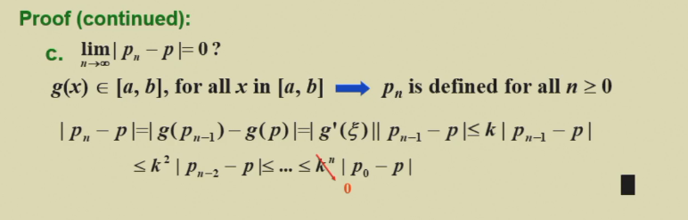
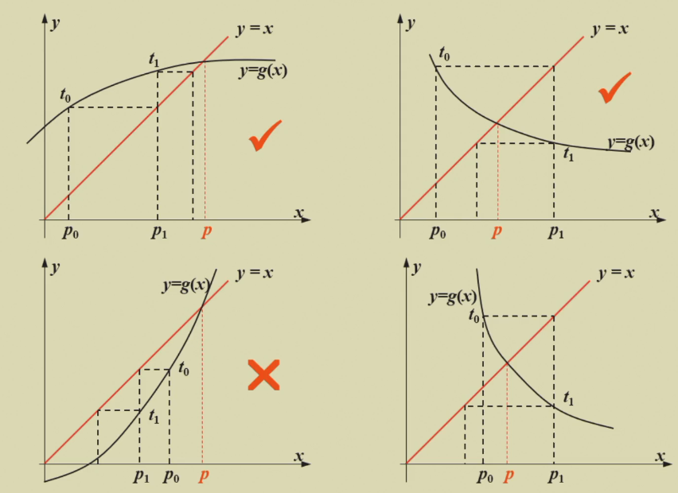
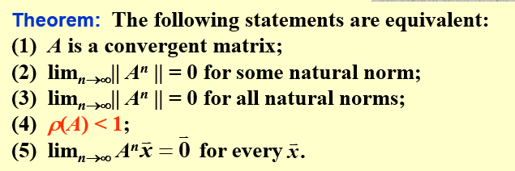
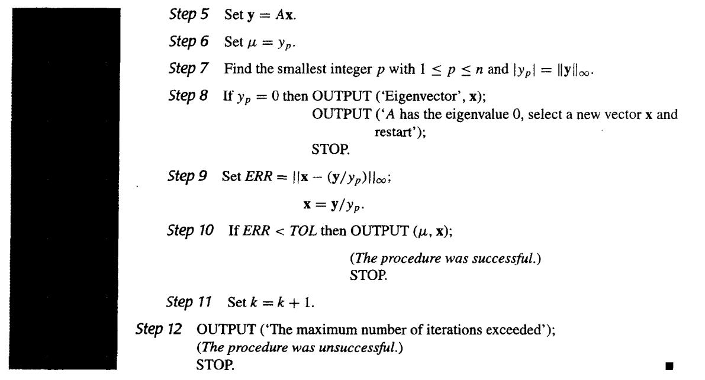
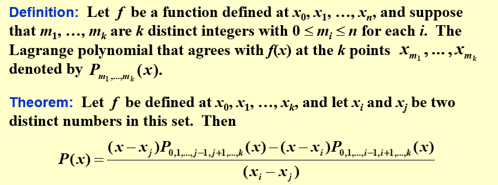
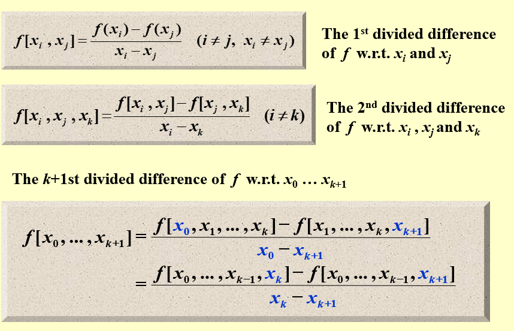
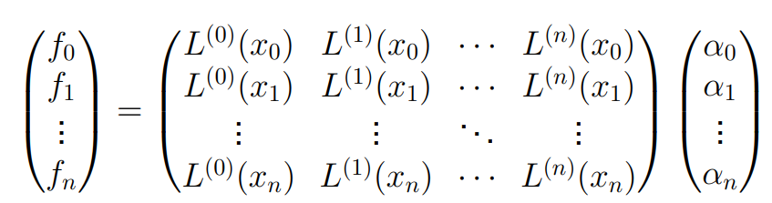

# 数值分析

[TOC]

## intro

课程内容：

- 了解近似技术
- 未来研究方向：工业软件
- 黄劲 hj@cad.zju.edu.cn

参考资料：

- [去年的智云](https://classroom.zju.edu.cn/coursedetail?course_id=37986&tenant_code=112)：可以参考小测 & Pre
- [本学期的智云](https://classroom.zju.edu.cn/coursedetail?course_id=50694)
- [ecnu NA 课程主页](https://math.ecnu.edu.cn/~jypan/Teaching/NA/index.html)
- NA 常见问题的程序实现
    - BLAS
        - netlib reference：慢但是可作为精确解对照
    - LAPACK
    - Linpack
    - atlas
    - arpack
    - minpack

## ch1 数学基础

### ch1.2 Roundoff Errors & computer arithmetic 近似、误差和计算机代数

#### 误差的分类（按产生的原因分类）

- truncation error 用 **有限** 个项的和去近似 **无穷** 级数的值
- roundoff error 用 **有限** 位小数近似实数计算结果

e.g. 近似计算积分中的 truncation error 和 roundoff error


总误差 = 没计算进去的余项 R4 造成的误差 + S4 四舍五入造成的误差 < 0.006

#### 十进制小数近似方法

- chopping
- rounding

e.g. **four-digit rounding arithmetic**: 每次计算（加减乘除、三角函数etc）都用 rounding 保留到 4 位有效数字


#### 误差的分类（按计算方法分类）

- absolute error 绝对误差
- relative error 相对误差


e.g. 两个相近的数相减会丢失有效位数；乘以一个很大的数或者除以一个很小的数会导致绝对误差增大。

- 有效数字实际上是在说明相对误差。丢失有效位数即在说相对误差增大。


e.g. 一元二次方程求根

- 使用分子有理化避免相近数相减


e.g. 计算一元三次函数在某一点的值

- 3-digit arithmetic 每次计算都需要保留三位有效数字，而不是最终结果保留三位有效数字。比如计算 $x^3$ 需要两次保留有效数字。
- 秦九韶算法, a.k.a. Horner's Method


### ch1.3 Algorithms & Convergence 算法和收敛

#### 算法的稳定性

稳定性：

1. stable
1. unstable
1. conditionally stable

误差增长：

1. linear
1. exponential


e.g. 使用递推算法计算积分，比较两种算法的稳定性


#### 收敛性

[TODO] 看书补充定义 & 做书上习题（上课的时候没讲）

1. 数列的 Convergence Rate
2. 函数的 Convergence Rate
    - 用 big O notation 表示
    - 求极限的方法：洛必达

## ch2 一元方程求解

### ch2.1 The Bisection Method 二分法

#### 数学依据

零点存在性定理

#### 迭代终止条件

可以有多种终止条件，根据实际情况选择使用：


比如对于下面这个函数，计算 $|f(p_n)|< \varepsilon$ 的终止条件效果较差：


#### 收敛性

- 如果 $p_n$ 取区间中点，误差上界还可以再除一个 2


#### 伪代码

- 第一问：
    1. 使用 $a+(a-b)/2$ 可以防止 a+b 过大溢出
    1. 使用 $(a+b)/2$ 可以防止相近数相减丢失有效位数
- 第二问：防止两个极小数相乘超出计算机浮点数的表示范围(underflow)


#### 优缺点

- 优点
    1. 限制条件少，只要函数连续就可以用
    1. 保证一定会收敛
- 缺点
    1. 收敛速度慢
    1. 只能找到一个根
- 规避缺点的方法：在使用二分法之前，先画函数图像，选择合适的区间进行二分法。

### ch2.2 Fixed-point Iteration 不动点迭代

#### 收敛条件（不动点定理）

条件：

1. g 是定义在闭区间上的连续函数
1. g 的函数图像在一个正方形里，即 $a\leq x\leq b,a\leq g(x)\leq b$
1. g 在开区间上导数存在且 $|g'|<k<1$
    - k 是为了防止 $g'\rightarrow 1$

证明：

1. 证明一定存在不动点，用零点存在性定理
1. 反证法证明不动点唯一，用拉格朗日中值定理
1. 证明收敛性，用拉格朗日中值定理




举个例子：



#### 终止条件（不动点定理推论）


#### 伪代码

- 并没有限制输入必须满足不动点定理，实际上很多情况下不满足不动点定理的函数使用不动点迭代也能收敛


#### 不动点迭代函数的选择

举个例子：

- 对同一个 f，可以有很多不同的 g 进行不动点迭代
- k 值越小，收敛越快


### ch2.3 Newton's Method 牛顿迭代法

#### 数学依据

- 泰勒展开到第二项，再舍去余项变成一个线性函数


#### 收敛条件

条件：

1. f 是闭区间上的连续函数，且有二阶导
1. f 在闭区间内有零点，且零点处导数非零

结论：存在一个零点的邻域，只要初始值在这个邻域内，牛顿迭代法就一定会收敛到零点

证明：牛顿迭代是不动点迭代的一种形式，所以证明牛顿迭代的公式满足不动点定理的条件，就可以直接用不动点定理说明收敛。

1. 证明连续
1. 证明一阶导 $|g'|<k<1$
    - $g'(p)=0$ 且 $g'$ 连续，所以一定存在一个邻域，使得 $|g'|<k<1$ 成立
1. 证明在正方形里，用拉格朗日中值定理 + 一阶导小于 1 的性质


可以看出牛顿法的收敛非常依赖初始值的选择。

#### 其他

用牛顿法解决二元非线性方程组：

- 用二元函数泰勒展开推导公式
- 用 Newton down-hill method 减少初值的影响

截线法：[收敛性证明看这篇博客](https://zhuanlan.zhihu.com/p/259656891)

### ch2.4 Error Analysis for Iterative Methods

#### 收敛阶的定义

- $\alpha$ 收敛阶
- $\lambda$ 渐进误差常数


#### 收敛阶的计算

e.g. 不动点迭代 & 斜率非零，计算收敛阶


e.g. 牛顿迭代法，计算收敛阶


定理：通过判断不动点函数 g 零点处的各阶导数，可以确定不动点迭代的收敛阶

- 证明：把 $g(p_n)$ 进行 $p$ 处的泰勒展开


e.g. 用定理验证牛顿迭代法的收敛阶


#### 牛顿迭代法拓展 & 计算收敛阶

当根是复根时，牛顿迭代法要求的 $f'(p)\neq 0$ 就满足不了了。


怎么把复根变成单根，一个比较暴力的方法是直接除以一阶导：


但是这样做问题也是存在的，就是每次迭代都需要算二阶导。

### ch2.5 Accelerating Convergence

#### Aitken’s $\Delta^2$ Method

核心思想：把收敛阶 or 误差范围当成解方程的一个条件，相当于凭空多出一个条件。利用收敛阶的条件来加速迭代算法的收敛

比如现在已知 linear convergent，且 $\{p_n\}$ 全在 p 的同一边，如何利用这个条件？

- 用相邻的三项，可以近似出一个解


收敛性证明：满足 linear convergent，且 $\{p_n\}$ 全在 p 的同一边两个条件，加速了比直接用不动点迭代收敛更快


#### Steffensen’s Method


## ch6 Direct Methods for Solving Linear System 直接法求解线性方程组

### ch6.1 Linear Systems of Equations 高斯消元法


复杂度计算：

1. 求上三角矩阵：不考虑行交换，第 $k(1\leq k\leq n)$ 行需要对 $n-k$ 进行消元，每次消元需要 $(n-k+1)+1$ 次消元，两项分别代表消系数矩阵，消常数向量
1. 回代过程(backward-substitution)：不管了到时候就套公式吧


### ch6.2 pivoting strategy

#### partial pivoting

先看一个例子：

- 误差来自于 $x_2$ 的系数 $\frac{59.14}{0.003}$，乘以一个很大的数放大了绝对误差


为了减少除数接近零对精度的影响，我们在每一次对第 𝑖 行利用行变换进行消元的之前，选择第 𝑖 列具有最大元素的第 𝑙 行，将第 𝑖 行与第 𝑙 行进行交换，将数比较大的 pivot 更换上去，在一定程度上解决这个问题。


#### scaled partial pivoting

再看一个例子：


总结一下：

1. scaled partial pivoting 相当于把每行都归一化到同一个尺度，然后再做 partial pivoting
1. 实际操作中，就是把行首元素除以放缩因子，然后再比较大小
1. 放缩因子，即上面公式中的分母，只计算一次，不然复杂度太大不能接受

（scaled partial pivoting 是三种算法中最重要的一种）


#### complete pivoting

在每一次对第 𝑖 行利用行变换进行消元的之前，选择从第 𝑖 行到第 𝑛 行、从第 𝑖 列到第 𝑛 列的最大元素 $𝑎_{𝑘𝑙}$ ，将第 𝑖 行与第 𝑘 行、第 𝑖 列与第 𝑘 列进行交换。

#### pivoting 方法的时间复杂度


### ch6.5 Matrix Factorization 矩阵分解

#### 补补线代

1. 来点直觉：在数值分析中矩阵的可逆和不可逆并不是绝对的，而是有一个指标判断其更接近可逆还是更接近不可逆
1. $n*n$ 的下三角矩阵是一个群：对于矩阵加法和乘法封闭
    - 两个下三角矩阵相乘仍是下三角矩阵
    - 下三角矩阵的逆仍是下三角矩阵
    - 上三角矩阵同理

#### LU 分解

##### LU 分解的条件

条件：不需要行交换就可以完成高斯消元


唯一性的详细证明如下：


##### LU 分解的方法

算法伪代码描述：


举个例子：（手算的时候没必要按伪代码的步骤算）


怎么把一串矩阵操作变成下三角矩阵呢？


如果矩阵需要进行行变换才能完成高斯消元，则把 LU 分解变成 $PA=LU$ 的形式，矩阵 P 负责做行变换。

##### 其他

补充知识：

- unitary 是指对角线都是 1
- Doolitle factorization: LU 分解，且 L 的对角线都是 1(unitary)
- crout's factorization: LU 分解，且 U 的对角线都是 1(unitary)
- 不能 LU 分解不代表矩阵不可逆！

---

LU 分解的优点：对于 A 相同，b 不同的所有方程。只需要 1 次 $O(n^3)$ 的分解，每次都可以用 $O(n^2)$ 解方程。

### ch6.6 Special Types of Matrices

#### Strictly Diagonally Dominant Matrix 严格对角占优

什么是严格对角占优？


严格对角占优的矩阵一定可以 LU 分解！


#### Choleski’s Method for Positive Definite Matrix 正定矩阵

正定矩阵的定义：

- 注意实数域内正定矩阵确实是要求对称的，放在复数域内就不成立了


---

实对称矩阵正定的判别条件：


比较有用的应该是：所有顺序主子式（左上角的子矩阵的行列式）均为正 & 所有特征值均为正

---

性质：

1. 如果 A 对称正定，则 A 的逆也正定
1. **实对称矩阵一定可以相似对角化 & 正交相似对角化（$PDP^{-1}$ 中 P 是正交矩阵） & 合同对角化**

---

正定矩阵可以分解成 $LDL^T$ 和 $LL^T$ 两种额外的形式

- 为什么矩阵 D 中的元素都是正的呢？因为 A 是实对称矩阵，$LDL^T$ 是其合同对角化的形式，然后 D 作为和 A 合同的二次型，也得正定，所以对角线上所有元素都是正的（口胡的，看看线代笔记再来）


---

算法实现：


- $LDL^t$ 分解会比 LU 分解快 7~8 倍左右。
- 手算的时候就直接照着算法步骤做就行

#### Crout Reduction for Tridiagonal Linear System 三对角矩阵

- 不是所有三对角矩阵都可以用 Cruot 方法求解，不能用 Crout 方法求解也不代表这个方程没有解


Crout 分解的使用条件：


## ch7 Iterative Techniques in Matrix Algebra 迭代法解线性方程组

### ch7.1 向量的范数 & 矩阵的范数

#### 向量的范数

引入范数目的：衡量迭代方法的步长，用于终止条件的判定。范数是距离的一种表示，向量的范数就是两个向量之间的距离。

向量范数的定义：


---

常用向量范数：


---

一些常用性质：

- 向量数列的收敛（是否收敛与范数的选取有关）
- 在无穷范数意义下的收敛，相当于向量中每个元素各自收敛
- 范数等价的定义
- **实数域内所有向量范数都是等价的**
    - 所以所有向量数列收敛问题，都可以转化为无穷范数意义下的收敛问题，从而转化成每个元素的数列收敛问题


#### 矩阵的范数

矩阵范数的定义：


常见矩阵范数：

1. Frobenius Norm
1. Natural Norm 自然范数
    - 几何意义：用矩阵对向量进行线性变换，最多能把向量放大多少倍
    - 无穷范数：每行元素的绝对值之和，取最大的
    - 1 范数：每列元素的绝对值之和，取最大的
    - 2 范数：也叫谱范数


然后考虑矩阵自然范数的定义，矩阵最多能将向量放大的倍数就是自然范数。所以矩阵二范数就是 S 对角线上绝对值（如果是复数的话就是模长）最大的元素，即矩阵特征根模的最大值，即 $||A||_2=\sqrt{\lambda_{\max}(A^TA)}$


---

证明矩阵的无穷范数的公式：

1. 第一部分：利用无穷范数的定义进行展开
1. 第二部分：要证明最大值大于定值，只要证明存在某种情况大于定值即可，使用构造证明


### ch7.2 特征根 & 特征向量 & 谱半径

#### 谱半径

- 谱半径的定义：矩阵特征根的最大模长
- 谱半径的性质：小于等于所有的矩阵自然范数
- 矩阵收敛的定义：矩阵的无穷次幂趋向于 0


#### 特征根 & 特征向量

1. 特征值的求法：
    1. 特征值之和等于矩阵的对角线元素之和（迹），特征值之积等于矩阵的行列式
    1. 矩阵乘一个常数，所有特征值都乘这个常数
    1. 矩阵加一个单位矩阵，所有特征值都加一个单位矩阵

#### 补充：向量求导


### ch7.2 迭代法求解线性方程组

#### Jacobi Iterative Method

公式推导：


---

使用条件：

1. D 对角线上所有元素非零（可在预处理过程中通过行列交换得到）
1. Tj 收敛则算法收敛

---

算法伪代码：


#### Gauss-Seidel Iterative Methods

公式推导：


---

伪代码：

- 矩阵形式看似比较复杂，但实际实现中和雅各比迭代非常相似。简单理解，就是雅各比迭代是用数组 A 中的元素去计算一个数组 B；而高斯迭代则是边计算边覆盖数组 A。


#### 迭代方法的收敛性证明

引理：矩阵收敛的充要条件

- 引理的假设是 A 是可相似对角化的（数学意义下不可对角化的矩阵，一般都可以通过增加一点扰动使其变为可对角化）




---

然后计算误差：

- 第二行不等式来自于自然范数的定义。因为二范数的意义是“最大放大倍数”，所以任意一个向量乘以矩阵的放大倍数一定不大于“最大放大倍数”


补充：

- 充分条件：T 的范数小于 1

---

然后就可以得到 **迭代算法收敛的条件**：迭代矩阵 T 收敛


---

然后定量计算迭代方法的 error bound：

- 和不动点迭代的 error bound 形式完全相同
- 补充：严格对角占优，雅各比和高斯两种迭代法都会收敛


#### relaxation methods

公式推导：


---

算法伪代码：


---

举个例子，手算的时候酱紫算：


---

收敛性判定条件：

- 想让 relaxation 方法收敛，w 只能在 0 到 2 之间
- 如果正定矩阵，w 在 0 到 2 之间，则不管初始值如何，一定收敛
- 如果正定 + 三对角，则不仅可以知道收敛，还可以知道 w 取什么值的时候收敛最快


---

看个例题：（用到的是上一节“迭代方法的收敛性证明”中的收敛性判定条件）

- 首先把公式化成标准形式 $x^{(k)}=Tx^{(k-1)}+b$
- 收敛的充要条件：$\rho(T)<1$
- T 的谱半径越小，收敛越快


### ch7.4 Error Bounds and Iterative Refinement

#### condition number & Error Bounds 条件数

##### 条件数的定义


##### 条件数的意义

condition number 几何意义：

1. 矩阵将一个单位元变线性换成一个椭球，这个椭球的扁度（最长轴和最短轴的比值）就是条件数
1. 椭球越扁，就越接近降秩（某一条轴变成 0 就真的降秩了）

---

condition number 在计算 error bound 中的意义：条件数越大，就越容易放大两个向量之间的差

看个例子直观理解一下：

- 对于一个条件数很大的 A，则 b 的一点点轻微扰动会导致 x 的剧烈变化


##### 使用条件数定量计算 error bound

定理1：（只有 b 有误差）


引理：


定理2：（只有 A 有误差）


定理3：（A 和 b 都有误差）


##### 条件数的性质

- 第三条：从几何直观理解，乘常数只会改变椭球的大小，不会改变椭球的形状
- 第四条：从几何直观理解，正交矩阵只改变向量的方向，不改变长度，所以单位圆被正交矩阵线性变换了之后还是单位元
- 第五条：第四条的推论


直觉：条件数大的矩阵，不管用迭代法还是直接法，都容易产生大误差。但是迭代法受条件数的影响更大。

#### Iterative Refinement 迭代优化


## ch9 Approximating Eigenvalues

### ch9.2 Power Method

#### 原始算法

目标：求矩阵的最大特征根

假设：

1. 最大特征根绝对值大于第二大特征根，不能有并列第一
    - 如果有相等的特征根，能收敛但是值不对
    - 如果有互为相反数的特征根，则不能收敛
1. 选取的初始向量要满足 $\beta_1\neq 0$


做法：对初始向量 x 不停乘 A


#### 优化：Normalization

每次算出来的 $x^{(k)}$ 都放缩成：

1. 最长的维度长度为 1
1. 并且是正数




这里终止条件是通过 $x^{(k)}$ 的方向变化判断的，方向变化足够小则认为收敛。

#### 优化：Aitken's Method

因为知道 power method 是 linear convergent，所以可以用相邻三个 u 估算一个更准确的 u


#### 收敛速度

$|\frac{\lambda_2}{\lambda_1}|$ 越小，收敛越快。

直觉：收敛快和精度高不是同一维度的问题。比如归一化是解决精度问题，$|\frac{\lambda_2}{\lambda_1}|$ 是关于收敛速度问题。

#### Inverse Power Method

目标：求解最小的特征根


做法：求解 $A^{-1}$ 的最大特征根

1. 将 A 进行 LU 分解（如果不能分解，将会导致每次迭代复杂度多一个 n，很难接受）
1. 迭代 $Ax^{(k+1)} = x^{(k)}$

---

推广：求解最接近 $\lambda$ 的特征根

对 $A-\lambda I$ 做 inverse power method 就行


## ch3 Interpolation and Polynomial Approximation 插值和拟合

### ch3.1 Interpolation and the Lagrange Polynomial 拉格朗日多项式

#### 拉格朗日插值

本质：解 n+1 元 1 次方程组

先看拉格朗日多项式最简单的形式(n=1)：

- $L_{n, i}(x)$ 称为基函数，基函数的性质
    1. 在插值点上，$L_{n, i}(x_j)=\delta_{ij}$，$\delta_ij=1$ 当且仅当 $i=j$
    1. 直观理解，$L_{n, i}(x)$ 是 $y_i$ 的系数。离 $x_i$ 越近，$L_{n, i}(x)$ 越大，函数值就越接近 $y_i$；反之同理


再推广到拉格朗日多项式的一般形式：


再举个例子 $L_{3, 1}(x)$ 便于理解：


看看 $L_{n, i}(x)$ 的函数图像：


#### 唯一性证明

第一种证明：n+1 元 1 次方程组中有 n+1 个线性无关的方程，一定有唯一解

第二种证明：反证法，n 阶多项式不可能有 n+1 个根


#### 拉格朗日余项（重点）

引理：“递归”的罗尔定理


定理：求余项


余项的作用：求 error upper bound


余项公式的记忆：如果 $x_i$ 彼此之间靠的很近，这里的余项趋向于 *泰勒展开的拉格朗日余项*

#### 拉格朗日多项式的合并 & Neville’s Method



Neville’s Method:


### ch3.2 Divided Differences & Newton Interpolation 牛顿插值法

#### 牛顿插值法思路

目标：在 n 个点的插值结果基础上，新增一个点。不需要重新计算整个插值函数，只需要新增一项即可。

先看前三步：


然后看一般形式：


如何计算系数 $\alpha_i$ 呢？代入所有点构成一个线性方程组：


代入 N 的表达式得：


是一个下三角矩阵，且矩阵中每个位置的元素与矩阵大小 n 是无关的！已知 $\alpha_0, ..., \alpha_{n-1}$，可以使用 O(n) 的时间消元，计算出 $\alpha_n$

---

类比牛顿插值法和，牛顿插值法也可以看成渐进的线性近似。

#### 牛顿插值法系数的计算

Divided Differences 定义如下：



手算 Divided Differences 这么算：


牛顿插值的系数就是：


#### 以线性方程组的视角看插值方法

拉格朗日插值：

- 是对角阵



再推广：只要有一组基，就可以得到一种新的插值方法

- 例如：$1, x, x^2, ..., x^n$ 就是一组基
- 好的基是什么样的？比如拉格朗日插值的基，可以保证矩阵是对角阵；比如牛顿插值的基，可以保证矩阵是下三角阵。方便解方程的就是好的基。


## ch8 Approxiamation Theory

### discrete least squares approximation 离散最小二乘法

`n << m`: 采样点远大于多项式阶数。若 `n > m` 可以用插值使得采样点误差为 0

$P(\textbf{a}, x)=a_0+a_1 x+a_2x^2+\ldots+a_n x^n$ 是一个多项式，系数为 $\textbf{a}=(a_0, a_1, \ldots, a_n)^T$ 在最小二乘法中需要求一个向量 $\textbf{a}$ 使得 $P(\textbf{a}, x)$ 逼近目标函数 $f(x)$

如何衡量近似函数和目标函数的接近程度呢？定义 $$E_2(\textbf{a})=\sum_{i=1}^m (P(\textbf{a}, x_i)-y_i)^2$$

如果用所有采样点的数据组成 m 维向量

$$
\left\{\begin{matrix}
  X=\begin{pmatrix}
  1 & x_1 & \ldots & x_1^n\\
  1 & x_2 & \ldots & x_2^n\\
  \vdots& \vdots & \ddots & \vdots\\
  1& x_m &\ldots & x_m^n
\end{pmatrix}_{m\times n} \\
  X\textbf{a}=(P(\textbf{a}, x_1), P(\textbf{a}, x_2), \ldots, P(\textbf{a}, x_m))^T \\
  \textbf{y}=(y_1, y_2, \ldots, y_m)^T
\end{matrix}\right. 
$$

然后把 error 看成差向量的范数，有

$$
\begin{align*}
E_2(\textbf{a}) &= ||X\textbf{a}-\textbf{y}||_2^2\\
&=(X\textbf{a}-\textbf{y})^T(X\textbf{a}-\textbf{y})\\
&=\textbf{a}^TX^TX\textbf{a}-2\textbf{a}^TX^T\textbf{y}+\textbf{y}^T\textbf{y}
\end{align*}
$$

推导中可以合并两个交叉项，因为其结果是一个 $1\times 1$ 的矩阵，相当于一个标量，而他们的标量数值显然是相等的。即 $(X\textbf{a})^T\textbf{y}=\textbf{y}^T(X\textbf{a})$

因为最小二乘法的要求是最小化 error，所以其必要条件是 $\textbf{a}$ 是 $E_2(\textbf{a})$ 的极值点。所以我们对 $E_2(\textbf{a})$ 求导

$$\frac{\partial E_2(\textbf{a})}{\partial\textbf{a}}=2X^TX\textbf{a}-2X^T\textbf{y}=0$$

$$X^TX\textbf{a}=X^T\textbf{y}$$

可以令 $A=X^TX$，之后的正交向量部分就是构造具有特殊性质的矩阵 $A$

Linearization: 把非线性的多项式通过换元等操作变成多项式，比如 $y=ae^\frac{b}{x}$ 可以变成多项式

### 正交向量 & 连续最小二乘法

线性空间：所有不超过 n 阶的多项式组成的线性空间 $\Pi_n$

线性无关的定义：（几何直观：向量不平行）[线性无关](https://zhuanlan.zhihu.com/p/411455683)

多项式空间内积的定义：
- 内积可以有很多种，这里使用带 weight 的版本
- 定义离散的内积：取 m 个采样点（常数），把对应采样点的函数值乘起来


使用内积得到正交的条件：（几何直观：向量垂直）两个多项式内积为 0

将 $\Pi_n$ 的一组正交基 $\phi_0(x),\phi_1(x),\ldots,\phi_n(x)$ 代入 $X$，得到的 $X$ 长这样：

$$
X=\begin{pmatrix}
  \phi_0(x_1) & \phi_1(x_1) & \ldots & \phi_n(x_1)\\
  \phi_0(x_2) & \phi_1(x_2) & \ldots & \phi_n(x_2)\\
  \vdots& \vdots & \ddots & \vdots\\
  \phi_0(x_m)& \phi_1(x_m) &\ldots & \phi_n(x_m)
\end{pmatrix}
$$

因为 $\phi_0(x),\phi_1(x),\ldots,\phi_n(x)$ 是一组正交基，根据内积的性质，$A=X^TX$ 除了对角线之外全都为 0，即 $A$ 是一个对角阵，求解 $A\textbf{a}=X^T\textbf{y}$ 就方便多了。

使用施密特正交化求一组正交基，可以得到条件数更小的 $A$。 


### 切比雪夫多项式


#### 应用：幂级数降阶


### ch4 积分方法

[数值积分方法](https://zhuanlan.zhihu.com/p/166272592)


## Project 记录

### Proj 3 求解周期性三对角阵方程组

[参考博客](https://blog.csdn.net/qq_32096491/article/details/78213914)

原方程

$$
\left[
\begin{matrix}
 2      & 0.5     &0  & \cdots &0&0.5      \\
 0.5      & 2     &0.5& \cdots & 0&0      \\
 0      & 0.5     &2 & \cdots & 0&0      \\
 \vdots & \vdots & \ddots & \vdots \\
 0      &0    &0& \cdots & 2&0.5      \\
0.5    & 0     &0 & \cdots &0.5&2      \\
\end{matrix}
\right]
\left[
\begin{matrix}
x_0\\
x_1\\
x_2\\
\vdots\\
x_{n-2}\\
x_{n-1}\\
\end{matrix}
\right]=\left[
\begin{matrix}
p_0\\
p_1\\
p_2\\
\vdots\\
p_{n-2}\\
p_{n-1}\\
\end{matrix}
\right]
$$

将最后一个变量先作为参数 $k$，得到三对角矩阵

$$
\left[
\begin{matrix}
 2      & 0.5     &0  & \cdots &0&0      \\
 0.5      & 2     &0.5& \cdots & 0&0      \\
 0      & 0.5     &2 & \cdots & 0&0      \\
 \vdots & \vdots & \ddots & \vdots \\
 0      &0    &0& \cdots & 2&0.5      \\
0    & 0     &0 & \cdots &0.5&2      \\
\end{matrix}
\right]
\left[
\begin{matrix}
x_0\\
x_1\\
x_2\\
\vdots\\
x_{n-3}\\
x_{n-2}\\
\end{matrix}
\right]=\left[
\begin{matrix}
p_0-0.5k\\
p_1\\
p_2\\
\vdots\\
p_{n-3}\\
p_{n-2}-0.5k\\
\end{matrix}
\right]
$$

用 Crout's Method 对三对角矩阵进行 LU 分解之后

$$
L=\begin{pmatrix}
l_0  &  &  &  & \\
0.5  & l_1 &  &  & \\
  & 0.5 & l_2 &  & \\
  &  & \ddots & \ddots & \\
  &  &  & 0.5 & l_{n-2}
\end{pmatrix}
$$

$$
U=\begin{pmatrix}
1 & u_0 &  &  & \\
  & 1 & u_1 &  & \\
  &  & 1 & \ddots & \\
  &  &  & \ddots & u_{n-2}\\
  &  &  &  & 1
\end{pmatrix}
$$

其中 $l_i = 2-\frac{0.25}{l_{i-1}}$ 通过递推求得，$u_i=\frac{0.5}{l_i}$

解方程后得到的 $\vec{x}(k)$ 是 $k$ 的一次式，所以 **解方程的时候不仅要存常数，还要存 $k$ 的系数**。

然后利用刚刚舍弃掉的那个方程求出 $k$，代回到 $\vec{x}(k)$ 中得到最终的答案。

$$
\begin{align*}
&\left\{\begin{matrix} 
  x_0  =  a_0k+b_0\\  
  x_{n-2}  = a_1k+b_1 \\
  0.5x_0+0.5x_{n-2}+2x_{n-1}  = p_{n-1}
\end{matrix}\right. \\
\Longrightarrow & k=\frac{2p_{n-1}-b_0-b_1}{a_0+a_1+4}
\end{align*}
$$

检验：使用 numpy 进行矩阵乘法和解线性方程组

```python
import numpy as np

# 新建矩阵
x = np.array([2, 0, 0, 0.5, 1.875, 0, 0, 0.5, 1.867]).reshape(3, 3)
b = np.array([1, 2, 3]).reshape(1, 3)

# 矩阵乘法
np.matmul(x, y)

# 解线性方程组
np.linalg.solve(x, b)
```

### Proj 4 实现 Jacobi 方法和 Gauss-Seidel 方法

- [向量范数的理解](https://blog.csdn.net/lz867422770/article/details/80013600)
- [矩阵的特征分解](https://zhuanlan.zhihu.com/p/314464267)
- [矩阵特征分解的条件](https://blog.csdn.net/u012845311/article/details/76461424)
- 矩阵的奇异值分解：看《统计学习方法》, [奇异值分解](https://zhuanlan.zhihu.com/p/29846048)

### Proj 5 LU 分解 + inverse power method 求解特征值和特征向量

条件：给出特征值的估计值 q，给出特征向量的初始值 $\hat{x}^{(0)}$

引理：如果 x 是 A 的关于 $\lambda$ 的特征向量，那么 x 也是 $A^{-1}$ 的关于 $\frac{1}{\lambda}$ 的特征向量

先判断给定的 q 是不是 A 的特征值，即 $\det(A-qI)=0$ 是否成立。我的做法是做初等行变换计算行列式。(tips: 可以提前做判断，也可以在后面迭代解方程的时候，如果方程没有解说明 q 就是特征值)

初始化：对 $\hat{x}^{(0)}$ 进行 normalization (**注意 normalization 是把最长的维度变成 1，需要考虑符号；而不是把最长的维度长度变成 1，否则最后无法收敛**)

$$
\left\{\begin{matrix} 
  A-qI=A' \\
  x^{(0)} = \frac{\hat{x}^{(0)}}{\hat{x}^{(0)}_p}, where \; |\hat{x}_p^{(0)}| = ||\hat{x}^{(0)}||_{\infty}
\end{matrix}\right.
$$

然后每次的迭代过程就是解方程

$$
\left\{\begin{matrix} 
  (A-qI)\hat{x}^{(k+1)}=x^{(k)} \\  
  x^{(k+1)} = \frac{\hat{x}^{(k+1)}}{\hat{x}^{(k+1)}_p}, where \; |\hat{x}_p^{(k+1)}| = ||\hat{x}^{(k+1)}||_{\infty} \\
  \lambda^{(k)}= \frac{1}{\hat{x}^{(k+1)}_p}+q
\end{matrix}\right.
$$

解方程还是用 ~~高斯消元~~ LU 分解。

直到前后两次迭代的特征值的差小于给定值或者前后两次迭代的特征向量差的范数小于给定值（题目采用前者，书上采用后者），或者迭代次数超过上限，退出迭代，

参考：
- LU 分解：书 P393
- Inverse Power Method：书 P569

---

优化：LU 分解

前提条件：不用行变换就可以完成高斯消元（**注意：本题为了强制使用 LU 分解，只要方程组的系数矩阵不能 LU 分解都当做方程组无解，即当做系数矩阵行列式为 0**）

如果可以 LU 分解的话，对 (A-qI) 进行 LU 分解

$$
\left\{\begin{matrix} 
  l_{i,i}=1 \\
  u_{i,i}=a_{i,i}-\sum_{j=0}^{i-1}l_{i,j}u_{j,i} \\
  l_{j,i}=\frac{1}{u_{i,i}}(a_{j,i}-\sum_{k=0}^{i-1}l_{j,k}u_{k,i}), j>i \\
  u_{i,j}=a_{i,j}-\sum_{k=0}^{i-1}l_{i,k}u_{k,j}, j>i 
\end{matrix}\right. 
$$

整个 LU 分解可以看成是一个 $n\times n$ 元线性方程组求解。过程是从左上角往右下角做，先对 $a_{i,i}$ 列一个方程，假设 $l_{i,i}=1$ 算出 $u_{i,i}$，对角算出来之后对 $a_{i,j}$ 和 $a_{j,i}$ 列方程，可以得到 $u{i,j}$ 和 $l_{j,i}$。

使用 LU 分解可以加速迭代过程中解方程的步骤。

---

拓展：行列式的求法

1. 初等行列变换变成上三角或者下三角，对角线乘积就是行列式
1. 代数余子式，递归求（空间消耗比较大）
1. 枚举全排列，$\sum(-1)^{\tau(j_1,j_2,...,j_n)}a_{1,j_1}a_{2,j_2},...a_{n,j_n}$

这个 Proj 选择用初等行变换实现是因为之后还要用到高斯消元，部分代码可以重用，比较省力。


### 可复用模块

#### 行变换法求矩阵行列式

```c
double MyDet(int n, double a[][MAX_SIZE], double TOL){
    double A[MAX_SIZE][MAX_SIZE];
    for (int i = 0; i < n; ++ i)
        for (int j = 0; j < n; ++ j)
            A[i][j] = a[i][j];
    for (int i = 0; i < n; ++ i){
        int max_i = i;
        for (int j = i+1; j < n; ++ j)
            if (fabs(A[j][j]) > fabs(A[max_i][max_i]))
                max_i = j;
        if (max_i != i)
            for (int j = 0; j < n; ++ j){
                MySwap(&A[i][j], &A[max_i][j]);
            }
        if (fabs(A[i][i]) < TOL) return 0;
        for (int j = i+1; j < n; ++ j){
            double frac = A[j][i] / A[i][i];
            for (int k = i; k < n; ++ k)
                A[j][k] -= frac * A[i][k];
        }
    }
    double ret = 1;
    for (int i = 0; i < n; ++ i) ret *= A[i][i];
    return ret;
}
```

#### 高斯消元 + scaled partial pivoting

1. 重复计算了每行的最大值，所以复杂度会比较高。需要降低复杂度的时候可以稍作修改。
1. 会修改 A 和 b 数组中的值，需要提前进行备份。

```c
void MyGaussian(int n, double A[][MAX_SIZE], double b[], double x[]){

    for (int i = 0; i < n; ++ i){
        int max_i;
        double max_value = 0;
        for (int j = i; j < n; ++ j){
            double max_a = 0;
            for (int k = i; k < n; ++ k)
                max_a = MyMax(max_a, fabs(A[j][k]));
            max_a = fabs(A[j][i] / max_a);
            if (max_a > max_value){
                max_value = max_a;
                max_i = j;
            }
        }
        if (max_i != i){
            for (int j = 0; j < n; ++ j)
                MySwap(&A[i][j], &A[max_i][j]);
            MySwap(&b[i], &b[max_i]);
        }
        for (int j = i+1; j < n; ++ j){
            double frac = A[j][i] / A[i][i];
            for (int k = i; k < n; ++ k)
                A[j][k] -= frac * A[i][k];
            b[j] -= frac * b[i];
        }
    }

    for (int i = n-1; i >= 0; -- i){
        x[i] = b[i];
        for (int j = i+1; j < n; ++ j)
            x[i] -= x[j] * A[i][j];
        x[i] /= A[i][i];
    }
}
```

#### LU 分解

1. 不会对原数组进行修改，不用提前备份。
1. 能够进行 LU 分解返回 0，不能分解返回 1

```c
int MyLUFactorization(int n, double A[][MAX_SIZE], double L[][MAX_SIZE], double U[][MAX_SIZE], double TOL){
    for (int i = 0; i < n; ++ i){
        // L[i][i]
        L[i][i] = 1;

        // U[i][i]
        U[i][i] = A[i][i];
        for (int j = 0; j < i; ++ j)
            U[i][i] -= L[i][j] * U[j][i];
        if (fabs(U[i][i]) < TOL) return 1;
        
        // L[j][i]
        for (int j = i+1; j < n; ++ j){
            L[j][i] = A[j][i];
            for (int k = 0; k < i; ++ k)
                L[j][i] -= L[j][k] * U[k][i];
            L[j][i] /= U[i][i];
        }

        // U[i][j]
        for (int j = i+1; j < n; ++ j){
            U[i][j] = A[i][j];
            for (int k = 0; k < i; ++ k)
                U[i][j] -= L[i][k] * U[k][j];
        }
    }
    return 0;
}
```

```c
void MyLUSolveLinearSys(int n, double L[][MAX_SIZE], double U[][MAX_SIZE], double x[], double b[]){
    double y[MAX_SIZE];

    // Ly=b
    for (int i = 0; i < n; ++ i){
        y[i] = b[i];
        for (int j = 0; j < i; ++ j)
            y[i] -= L[i][j] * y[j];
        y[i] /= L[i][i];
    }

    // Ux=y
    for (int i = n-1; i >= 0; -- i){
        x[i] = y[i];
        for (int j = i+1; j < n; ++ j)
            x[i] -= U[i][j] * x[j];
        x[i] /= U[i][i];
    }
}
```

#### 调试函数：输出矩阵、输出向量

```c
void MyPrintMat(int n, double A[][MAX_SIZE]){
    for (int i = 0; i < n; ++ i){
        for (int j = 0; j < n; ++ j)
            printf("%7.3lf", A[i][j]);
        printf("\n");
    }
    printf("----------------\n");
}
```

```c
void MyPrintVec(int n, double x[]){
    for (int i = 0; i < n; ++ i)
        printf("%7.3lf", x[i]);
    printf("\n==================\n");
}
```

#### 常用函数：Swap

```c
void MySwap(double *x, double *y){
    double temp = *x;
    *x = *y;
    *y = temp;
}
```