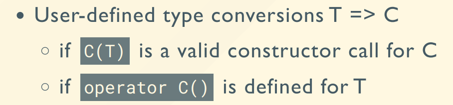

# 面向对象程序设计

[TOC]

> todo: 学一学这篇博客的封装：[ADS B+ 树](https://blog.csdn.net/ZJU_fish1996/article/details/50890467)

## 笔记

### intro

1. 参考
    - 作业答案：参考卷卷的博客，可以用于考试复习 [HW1-HW8](https://zhoutimemachine.github.io/2022/07/07/2022/oop-mid-review/) [HW9-HW13](https://zhoutimemachine.github.io/2022/07/07/2022/oop-final-review/)
    - 贺老师翻译的 C++ 相关文章：[知乎](https://www.zhihu.com/column/c_1561843704159232000)。贺老师的图书分享：[阿里云盘](https://www.aliyundrive.com/s/z5hLRAELpPP), 提取码: 5jm9。
    - [The Cherno C++](https://www.youtube.com/playlist?list=PLlrATfBNZ98dudnM48yfGUldqGD0S4FFb) 超纲知识学习
    - [C++ 新闻](https://isocpp.org/) [cpp_reference](https://en.cppreference.com/w/)
    - MUD(multi-user dungeon) 游戏示例：NetHack，guidebook 很重要，[nethack 官网](https://nethack.org/), [nethack-wiki](https://nethackwiki.com/), [nethack 服务器](https://alt.org/nethack/), [快速上手文档](https://lug.ustc.edu.cn/planet/2021/09/nethack-gitgud/)，[所有按键列表](https://tieba.baidu.com/p/1438247556)
    - 助教-陆子仪：ziyilu@zju.edu.cn
    - 陈翔：xchencs@zju.edu.cn
2. 成绩
    - 期末考 50%
    - Lab 50%：单周项目，双周小题

### 变量

#### 引用 &

- 一般来说定义引用变量一定要赋初值
- 不需要赋初值的情景：函数参数，类中的引用变量。由函数的调用者，类的构造函数提供初值
- 引用只能赋初值，不能修改


- `int * &`: 引用一个指针
- `int & *`: 指向引用变量的指针


- `const int &`：不修改实参本身，也不复制，可以节约栈空间和省去复制变量的时间

```cpp
struct BigStruct{
    int a[10000];
};

void f(const BigStruct &);
```

#### 常量 const


举个例子，char 指针：

- 第一句和第二句是等价的，等号右边是一个 `const char *`，等号表示将 s1 和 s2 指向 data 区中的字符串常量头指针。如果要这么写，第二句意义更明确，比第一句更不容易犯错。
- 第三句和第四句是等价的，第三句的等号表示 char 数组的初始化（假设是局部变量），是在栈中分配数组的空间，然后把 data 区中的字符串常量 copy 到栈中。

```cpp
char * s1 = "Hello World!";
const char * s2 = "Hello World!";
char s3[] = "Hello World!";
char s4[]("Hello World!");

s1[0] = 'C'; // Error
s3[0] = 'C'; // OK
```

#### static

##### static 的两个含义


##### static 的使用场景


static 全局变量：只能在当前源文件的代码中访问(internal linkage)

static 局部变量：在函数第一次被调用时构造，一直存在直到程序结束

class 内的 static 变量：本源文件中所有类的实例共用，需要单独定义，不能在初始化列表中构造


class 内的 static 成员函数：只能访问类内的 static 变量，调用的时候不存在 this 指针

class 内的 static 常量：所有类共享的常量数据

### 函数

#### 函数重载(overload)

条件：

- 返回值，函数名，作用域一样（三者有任意一个不一样都算是不同函数，不算重载）
- 参数不一样（参数一样，仅函数体不一样不允许，会报重复定义的错误）

```cpp
template<typename T>
void print_array(T arr[], int n){
    for (int i = 0; i < n; ++ i)
        std::cout << arr[i] << ' ';
    std::cout << endl;
}

template<typename T>
void print_array(T* arr[], int n){
    for (int i = 0; i < n; ++ i)
        std::cout << *arr[i] << ' ';
    std::cout << endl;
}
```

重载函数之间相互调用：减少修改的工作量


#### template

```cpp
template<typename T, typename Compare>
void selection_sort(T arr[], int n, Compare comp)
{
  for (int i = 0; i < n - 1; ++i)
  {
    int min_idx = min_element(arr, i, n, comp);
    if (min_idx != i)
      swap(arr[min_idx], arr[i]);
  }
}
```

- 存在 `std::Compare` 类型，比如优先队列中可以使用的 `less`, `priority_queue<int,vector<int>,less<int> > big_heap;`

#### inline

- inline 函数不会产生函数调用的 jal 语句。

- tradeoff：空间换时间。

- 递归函数不能使用 inline


- header only library: inline 函数允许重复定义，可以把函数实现包含在头文件中

### 类 Class

#### 重载运算符

##### 可以重载的运算符


##### 第一种写法：在类外部重载 as global function

- 可以把 operator 看成一个函数，具有参数、函数体、返回值。但是参数和返回值的设置必须满足运算符原来的运算规则。
- 参考资料：[C++ 可重载运算符实例](https://www.runoob.com/cplusplus/cpp-overloading.html)，在网页的最底下。

tips:
- 如果类外重载需要访问类内的 private 变量，则需要声明 friend

```cpp
class Student{
public:
    int id;
    std::string name;
};

bool operator < (const Student& x, const Student& y){
    return x.id < y.id;
}

std::ostream& operator << (std::ostream& out, const Student& x){
    return out << '(' << x.id << ", " << x.name << ')';
}
```

##### 第二种写法：在类内重载 as member function

- 类内重载是类的一个成员函数
- 成员函数可以在类内声明，在类外实现
- 隐含的第一个参数，通过 `this` 指针调用 
- 在调用时第一个参数必须是本类型（第二个参数支持隐式的类型转换） 

tips: 
- 输出流的类内重载：所谓“类内”，是 ostream 类内。因为 ostream 类在生命时用到了 template，在重载其运算符时需要和类使用一样的 template `template<typename _CharT, typename _Traits>`*（目前还不会重载）*

```cpp
class Student{
public:
    int id;
    std::string name;
    bool operator < (const Student& y){
        return this->id < y.id;
    }
    bool operator > (const Student&);
};

bool Student::operator > (const Student& y){
    return this->id > y.id;
}
```

##### 参数和返回值

参数：

- 如果参数 read-only，最好写成 `const &`
- 如果 member function 的 this 也 read-only，把函数定义成 `const`
    - 如果变量和常量都需要调用使用这个运算符，则需要重载两遍
- 如果 global function 的第一个参数要被修改，定义成 reference `&`
    - e.g. stream inserter

返回值：
- indexer 可能需要重载两遍，分别是 const 和非 const 的
- indexer 返回一个 reference


##### 特殊的重载：自增自减

声明：


实现：

注意减少重复的代码


调用：


##### 重载赋值符号 assignment =

注意区别赋值语句和 copy constructor


未定义赋值语句，编译器会自动生成
- 其做法是：递归地进行 memberwise assignment
- 注意：默认的赋值是浅拷贝

重载成深拷贝：
- 需要注意检查 self assignment


##### 重载小括号 functor

如果需要把函数当做参数传进函数，可以使用 functor

```cpp
#include <cmath>
#include <iostream>
#include <vector>
using namespace std;

void transform(vector<int>& v, const function<int(int)> & f) {
    for (int & x : v)
        x = f(x);
}

class mul_by {
public:
    mul_by(int a) : a(a) {}
    int operator()(int x) const {
        return x * a;
    }
private:
    int a;
};

class add_by {
public:
    add_by (int a) : a(a) {}
    int operator()(int x) const {
        return x + a;
    }
private:
    int a;
};

class nth_pow {
public:
    nth_pow (int a) : a(a) {}
    int operator()(int x) const {
        return pow(x, a);
    }
private:
    int a;
};

class print {
public:
    add_by (char sep) : sep(sep) {}
    // 返回值必须是 int，否则和形参不能对应
    int operator()(int x) const {
        cout << x << sep;
        return x;
    }
private:
    char sep;
};

int main()
{
    vector<int> v { 1,3,5,7,9 };
    
    transform(v, mul_by(5));
    transform(v, add_by(3));
    transform(v, nth_pow(2));
    transform(v, print(','));
```

##### 自定义类型转换

两种形式：
- 两种里面只能实现一种，否则会报 ambiguous



举例：
- 想要阻止单参数构造函数导致隐式的类型转换，可以在构造函数之前加上 `explicit` 关键字


更清晰的写法：


#### 构造函数

##### 重载多个构造函数

可以重载多个构造函数

```cpp
class Rectangle{
private:
    int h, w;
public:
    double area;
    Rectangle():h(0), w(0){}
    Rectangle(int _h,int _w):h(_h),w(_w){}
    void get_area(){area = h * w;}
};

Rectangle r = Rectangle(2, 3);
Rectangle s;
```

##### 构造函数一定会被执行

- 编译器保证构造函数一定会被执行，可以保证对象一定被初始化

在 VC 中使用 debug 编译器，栈空间没有被初始化的变量会被填充 `0xCD`，国标码显示“烫”(`0xCCCC`)；堆中没有被初始化的变量会被填充 `0xCD`，国标码显示“烫”(`0xCDCD`)。

##### 默认构造函数

- default constructor：没有参数的 constructor

如果没有任何自定义的构造函数，编译器会自动加上 default constructor；但如果有自定义构造函数，那要用 default constructor 就必须自己写了。

tips: 如果没有被重载，拷贝构造函数也会被自动生成

```cpp
// 以下两种写法等价
Rectangle::Rectangle() = default;
Rectangle::Rectangle() {}
```

##### 初始化列表

**执行顺序**：
- 会首先执行初始化列表进行成员的构造（真正的初始化），然后再执行构造函数（成员已经构造完毕，构造函数中的语句是对变量进行赋值、计算等操作）。
- 会首先构造基类，再构造派生类。析构的时候相反

tips: 如果类的成员没有默认构造函数，则必须要在初始化列表中调用已有的构造函数，否则会报错。

tips：子类可以调用父类的构造函数，然后再构造子类独有的成员。

```cpp
// 调用顺序为：
// 1. Shape 的初始化列表
// 2. Shape 的构造函数
// 3. Rectangle 的初始化列表
// 4. Rectangle 的构造函数
Rectangle(int _h,int _w):Shape(_h, _w), d(sqrt(_h * _h + _w * _w)){}
```

析构函数调用的顺序和构造函数的正好相反。

##### 关于构造和析构执行顺序的一个例子

```cpp
#include <iostream>

struct X {
    X() {
        std::cout << "X::X()" << std::endl;
    }
    ~X() {
        std::cout << "X::~X()" << std::endl;
    }
};

struct Y {
    Y() {
        std::cout << "Y::Y()" << std::endl;
    }
    ~Y() {
        std::cout << "Y::~Y()" << std::endl;
    }
};

struct Parent {
    Parent() {
        std::cout << "Parent::Parent()" << std::endl;
    }
    ~Parent() {
        std::cout << "Parent::~Parent()" << std::endl;
    }
    X x;
};

struct Child : public Parent {
    Child() {
        std::cout << "Child::Child()" << std::endl;
    }
    ~Child() {
        std::cout << "Child::~Child()" << std::endl;
    }
    Y y;
};

int main() {
    Child c;
}

// output
/*
X::X()
Parent::Parent()
Y::Y()
Child::Child()
Child::~Child()
Y::~Y()
Parent::~Parent()
X::~X()
*/
```

- 构造临时对象

```cpp
// 下面这句话做了两件事情：
// 首先使用 Rectangle(x, y) 构造函数构造了一个临时变量
// 然后把临时变量赋值给 rec
Rectangle rec = Rectangle(3, 4);
```

##### 单参数构造函数

可以写成带小括号的形式，也可以直接用等于号

```cpp
Node y;
Node x(y);
Node x = y; // 两者等价，都调用了拷贝构造函数
```

##### 拷贝构造函数

什么时候需要写拷贝构造？

类内有指针的时候，特别是指针指向的地址是在成员函数中分配的事后，一般都需要重载拷贝构造 & 赋值符号，防止浅拷贝产生问题，或者重复析构同一块空间产生错误。

---

拷贝构造在什么时候被调用？

1. 定义变量初始化时
1. 函数实参传入时
    - 返回值优化：省去一个拷贝构造。取消返回值优化的编译选项 `-fno-elide-constructors` 

---

拷贝构造造成的性能下降：

由于 vector 的特性，在扩容的时候，会新分配一段新的空间（长度 capacity() 一般是原来的两倍），然后把原来的所有元素都拷贝到新的地址，导致单次 $O(N)$ 的拷贝构造（均摊 $O(1)$）。

```cpp
vector<Point> v;
v.push_back(Point(1, 2)); // 调用 Point 的构造函数和拷贝构造函数
v.emplace_back(1, 2); // 直接构造 Point，不会调用拷贝构造
```
---

如何禁止拷贝构造？

显式地声明成 private，或者加上关键字 `=delete`

```cpp
Person(const Person &rhs) = delete;
```


#### 析构函数

析构函数（destructor）会在每次删除所创建的对象时执行。在程序正常结束时默认会使所有对象消亡。

将动态分配的内存全部存在 class 内，能够有效避免内存泄漏。

举例：

```cpp
class String{
private:
    char* p;
public:
    String(int n);
    ~String();
};

String::~String(){
    delete[] p;
}

String::String(int n){
    p = new char[n];
}
```

#### class 访问控制(private, protected, public)

类内成员变量 & 函数类型：

- private: 仅 class 内可以访问
- protected: class 内、子 class 可以访问，外界无法访问
- public: 全局都可以访问

一般数据为 private，访问函数为 public，防止随意修改破坏数据间的一些完整性约束。建立 class 的过程相当于一个建模的过程，将实例的属性和交互抽象成概念。

struct 就是一个默认所有成员为 public 的 class。是 C++ 为了兼容 C 的产物。

**tips.** private 仅类内可以访问的含义是，在 Node 类的成员函数中访问另一个 Node 对象的 private 数据是可行的。private 并不限制访问的对象，只限制访问的类型。

**tips.** 可以通过指针访问类内 private 的变量。private 只是用来防止成员操作符的访问。

#### 类的继承

##### 继承类型 & 继承行为

- 公有继承（public）：当一个类派生自公有基类时，基类的公有成员也是派生类的公有成员，基类的保护成员也是派生类的保护成员，基类的私有成员不能直接被派生类访问，但是可以通过调用基类的公有和保护成员来访问。
- 保护继承（protected）： 当一个类派生自保护基类时，基类的公有和保护成员将成为派生类的保护成员。
- 私有继承（private）：当一个类派生自私有基类时，基类的公有和保护成员将成为派生类的私有成员。

派生类不继承的情况：

- 基类的构造函数、析构函数和拷贝构造函数
- 基类的重载运算符
- 基类的友元函数
- adiitional: name hiding

拓展阅读：

- [子类初始化列表不能初始化父类元素的原因 -> 初始化列表和构造函数的关系](https://blog.csdn.net/uestcyms/article/details/103509443)

```cpp
class Shape{
protected:
    int h, w;
public:
    double area;
    Shape():h(0), w(0){}
    Shape(int _h, int _w):h(_h), w(_w){}
};

class Rectangle: public Shape{
public:
    Rectangle():Shape(){}
    Rectangle(int _h,int _w):Shape(_h, _w){}
    void get_area(){area = h * w;}
};

class Triangle: public Shape{
public:
    Triangle():Shape(){}
    Triangle(int _h,int _w):Shape(_h, _w){}
    void get_area(){area = 0.5 * h * w;}
};
```

##### Insights: composition & inheritance 组合和继承

- 组合：car **has a** tire.
    - class 之间不存在继承关系，而是包含关系
- 继承：student **is a** human.
    - base class & derived class

##### Name Hiding

- 派生类中定义的函数会隐藏基类中的同名函数（即使参数列表不一样也会隐藏）
- 如果派生类中需要调用基类被隐藏的函数，则需要加上 `Base::` 进入基类的命名空间
- 对 virtual 函数行为不一样（还没看过）

```cpp
class Base{
    void print();
    void print(int a, int b);
};

class Derived: public Base{
    void print(int a){
        Base::print();
        Base::print(a, a); // 访问基类中的函数
    }
};

int main()
{
    Derived d;
    d.print(); // 报错，因为基类中的同名函数被隐藏了
}
```

##### upcasting

- 基类指针或者引用可以指向派生类对象，但会丢失派生类独有的数据
- 对 virtual 函数行为不一样（等会说）


#### new & delete

##### new & delete 基本变量类型

- `[]` 是创建数组，`(), {}` 是初始化

```cpp
	int * a = new int[100];
	int * b = new int(1024);
	int * c = new int[100]{1, 2, 3, 4, 5};
	delete[] a;
	delete b;
	delete[] c;
```

- delete 为什么要分为 `delete` 和 `delete[]`？

free 的功能是释放一次 malloc 分配的所有地址，所以不管是分配单个变量 `malloc(sizeof(int))` 还是分配多个变量 `malloc(sizeof(int) * 100)` 都可以用一次 free 全部释放掉。

但是 delete 新增了功能，可以对动态分配的数组，单独析构和释放一个位置的内存。

##### new & delete 自定义变量类型

功能：

- new 的功能：分配内存，调用构造函数构造类的实体，返回对象的指针。
- delete 的功能：调用析构函数，释放内存。

e.g. new 不同的子类不能把内容存在同一个数组里，但可以把指针存在同一个数组里

- 错误写法：`Shape arr[] = {new Rectangle(1, 2), new Triangle(2, 4, 5)};`
    - 直接把子类赋值给基类，子类独有的变量消失
- 正确写法：`Shape * arr[] = {new Rectangle(1, 2), new Triangle(2, 4, 5)};`

new 和 malloc 的区别：

1. new is an operator, while malloc is a function.
2. new calls an appropriate constructor for object allocation, while malloc doesn't.
3. new returns a pointer with the appropriate type, while malloc only returns a void * pointer that needs to be typecasted to the appropriate type.

new 和 delete 数组的顺序问题：

- new 先分配空间，再按下标从小到大调用构造函数
- delete[] 先按下标从大到小调用析构函数，再释放空间

#### 多态 polymorphism & 虚函数virtual & dynamic_cast

##### 虚函数和纯虚函数

- 在编译时，编译器不**静态链接**到基类的函数，而是在程序中任意点可以根据所调用的对象类型来选择调用的函数，这称为**动态链接**
- 在**虚函数**不需要任何有意义的实现时，可以使用**纯虚函数**
- 使用 `Rectangle * rect = dynamic_cast<Rectangle*>(shape);` 来把指向派生类的基类指针转化为派生类指针

tips:

- 包含纯虚函数的类不能实例化为对象

```cpp
class Shape{
protected:
    int h, w;
public:
    double area;
    Shape():h(0), w(0){}
    Shape(int _h, int _w):h(_h), w(_w){}
    virtual void get_area() = 0;
};

class Rectangle: public Shape{
public:
    Rectangle():Shape(){}
    Rectangle(int _h,int _w):Shape(_h, _w){}
    void get_area(){area = h * w;}
};

class Triangle: public Shape{
public:
    Triangle():Shape(){}
    Triangle(int _h,int _w):Shape(_h, _w){}
    void get_area(){area = 0.5 * h * w;}
};

// main
Shape * arr[] = {new Rectangle(1, 2), new Triangle(2, 3)};
arr[0]->get_area();
arr[1]->get_area();
std::cout << arr[0]->area << " " << arr[1]->area << std::endl;	
```

解释：虽然 arr 中的数据都是 Shape 指针，但是指向的是不同的派生类对象。在基类 Shape 中 `get_area()` 是纯虚函数，所以会根据调用函数的派生类类型动态链接到对应的函数。

##### virtual 析构函数

`delete Base*` 会调用 Base 的析构函数，而不管指针指向的是否是派生类，从而导致内存释放不彻底。

解决方法：
1. virtual 析构函数
1. 智能指针，会自动进行内存管理
    ```cpp
    #include <memory>
    std::unique_ptr<Derived> smart_ptr(new Derived);
    ```
##### virtual 函数的常规实现方法

*注意：并不是所有编译器都采用这种实现方法*


- vptr: 指向 vtable 的指针，**每个对象有一个**，在初始化的时候指向不同 vtable 的不同位置
- vtable: 一个指针的数组，**每个类有一个 vtable**，指向本类动态链接的函数


- 如果派生类没有重写虚函数，则 vtable 中存的就是基类定义的虚函数（例如 resize），否则会改成派生类自己定义的虚函数（例如：析构函数和 render）

```cpp
#include <iostream>
using std::cout;
using std::endl;

class Base{
protected:
    int base_data;
public:
	Base(): base_data(200){}
	virtual void vfunc1(int x){cout << "Base::vfunc1(), parameter: " << x + base_data << endl;}
    virtual void vfunc2(){cout << "Base::vfunc2()" << endl;}
};

class Derived: public Base{
private:
	int derived_data;
public:
	Derived(): derived_data(100){}
	void vfunc1(int x) override {cout << "Derived::vfunc1(), parameter: " << x + base_data + derived_data << endl;}
	void vfunc2() override {cout << "Derived::vfunc2()" << endl;}
};

int main(){
	Derived d;
	void* vptr = *((void **)&d); // vptr 是一个指针
	void** vtable = (void**)vptr; // vtable 是一个指针的数组
	void (*vf)(Derived*, int) = (void (*)(Derived*, int))vtable[0]; // 虚函数指针存在 vtable 中
	vf(&d, 20); // 因为成员函数调用需要有 *this 指针，但直接用指针调用函数跳过了类的步骤，没有默认的 *this，需要通过参数传给函数

	// 上下两种调用函数的方式，在函数行为上是一样的
	d.vfunc1(20);

	return 0;
}
```

- 外部指针调用 vtable 中的函数。熟悉 vptr 和 vtable 的存储结构。

##### vptr 在赋值操作中的行为

vptr 不会复制。b 的 vptr 还是指向 Base 的 vtable。

```cpp
Base b;
Derived d;
b = d;
b.virtualFunction();
```

如果强行复制 vptr，且 Derived 类的虚函数调用了派生类独有的数据，则会导致函数访问未定义的内存。

##### override 覆写虚函数

关键字 override 的含义是，让编译器来检查我们有没有正确覆写父类的虚函数。因此，任何子类覆写虚函数后导致函数签名的变化，都会导致编译器报错。比如在编写子类函数时忘记加了某个变量，忘记加 const 等导致覆写失败，编译器都会报错

```cpp
 struct Derived : public Base {
   void doSomething(int i) override {  // ERROR,编译器报警没有正确覆写Base::doSomething
     std::cout << "This is from Derived with " << i << std::endl;
   }
 };
```

##### relaxation

对于引用和指针类型的返回值，子类对虚函数的覆写，允许返回值为子类。


##### interface 接口

*纯虚函数*可以看成一种*接口*，用户根据具体问题实现接口的纯虚函数，调用接口。

**举例：牛顿迭代法**

- 接口：`class NewtonSolver`
    - 将与牛顿迭代法本身无关的函数抽离出来，即把 `f()` 和 `df()` 做成纯虚函数
    - 与牛顿迭代法本身相关的函数在接口中实现，比如 `solve()` 牛顿法主函数，`is_good()` 判断结果是否足够
    - 与牛顿迭代法本身相关的参数在接口中定义，比如 `tolerance` 和 `max_iters` 等参数。
- 实例：`class NthRootSolver: public NewtonSolver`
    - 用户只需要根据实际问题实现纯虚函数，就可以对具体问题使用牛顿迭代法

---

换一种思路：函数式编程

将函数作为参数传入函数中，函数也可以当做接口使用。

```cpp
using fn = std::function<double(double)>;

double Normal_Newton(fn f, fn df, ...);

double Specialized_Newton(double a, ...){
    auto f = [a] (double x) {return x * x - a;}; // 匿名函数
    auto df = [] (double x) {return 2 * x;};
    return Normal_Newton(f, df, ...);
}
```

匿名函数：`[]` 中的是超参数，`()` 中的是形参，`{}` 中是函数体。用匿名函数更方便地定义参数传入接口中。

##### Code Quality

- Coupling: 低耦合(loose coupling)，基类和派生类互不影响，派生类不能随意修改基类。
- Cohesion: 高内聚(high cohesion)，功能明确，函数能用一句话描述，类功能不会过于庞大。

cx 的建议：看开源库，学习思想。

#### friend 函数 & 类

- 类的**友元函数**定义在类外部，但有权访问类的所有私有（private）成员和保护（protected）成员。
- 类的**友元类**可以访问类的所有私有（private）成员和保护（protected）成员。

tips：

- friend 可以定义在类内任意位置，权限设置对 friend 无效

```cpp
class Student; // Declaration

class AnotherClass{
    void f(Student*);
};

class Student{
private:
    int id;
    std::string name;
public:
    Student(int x, std::string y):id(x), name(y){}
    friend bool operator < (const Student&, const Student&);
    friend std::ostream& operator << (std::ostream&, const Student&);
    friend void AnotherClass::f(Student*); // AnotherClass 的 f 函数可以访问 Student 的 private 变量
};

bool operator < (const Student& x, const Student& y){
    return x.id < y.id;
}

std::ostream& operator << (std::ostream& out, const Student& x){
    return out << '(' << x.id << ", " << x.name << ')';
}
```


#### const object 常量对象

- 变量可以调用函数的常量版本和变量版本，常量只能调用函数的常量版本。

- 常量函数中不能修改成员值，否则会报错。

- 同函数名，同参数列表，但一个函数加了 const 符号，这两个成员函数是不同的成员函数。所以可以做到常量和变量调用同名函数时程序行动不同。


#### const 成员变量 & static const 实现对象间数据共享

const 成员变量在对象构造时创建（必须在初始化列表里构造），在构造函数体内和成员函数中不能修改，在类析构时消失。

---

- [在 class 中定义 static 成员变量](https://www.cnblogs.com/stevenshen123/p/11555758.html)
- [C++ 类成员函数中的静态变量的作用域](https://blog.csdn.net/su_787910081/article/details/42213245)


#### class 的多文件实现（声明和定义分离）(.h & .cpp)

- 类外实现成员函数，需要用 `::` 声明函数是成员函数
- `::` 单独使用用于跳出类，使用全局变量


- `.h` 文件中只能写声明，不能写定义和实现 


- 多文件实现的好处：主程序和类实现是两个不同的编译单元，以 `.h` 为沟通的接口。只修改主程序或者只修改类实现，另一部分不需要重新编译生成 object，只需要重新链接即可。
- [C 语言为什么只需要 include<stdio.h> 就能使用里面声明的函数? - 醉卧沙场的回答 - 知乎](https://www.zhihu.com/question/389126944/answer/1169709964)

#### #pragma once 防止重定义

```cpp
#pragma once
```

保证这个头文件只被编译一遍。相当于 C 中的

```c
#ifndef __INVERTED_INDEX__
#define __INVERTED_INDEX__

...

#endif
```

### 命名空间 namespace

#### 定义

```cpp
namespace my_space{

}
```


#### 使用

- 使用 `typedef` 或 `using`, `auto` 缩短变量类型的长度

```cpp
// 使用函数
using my_space::my_function;
// 使用整个 namespace
using namespace my_space;
```

#### 使用场景

比如 ADS 的项目里要写一个函数的不同实现版本，分别为 `search_1()`, `search_2()` 和 `search_3()`，分给不同的人写。

因为函数功能相同，容易出现不同的人定义相同名字的全局变量，或者同名函数，导致最后统一编译的时候重定义报错。

针对这个问题最好的解决方法是给每个子函数套一个 namespace，就不会存在重定义的问题了。

search_1.h 只 **声明** 需要被主函数调用的函数

```cpp
namespace SEARCH_1{
    int search_1(int target[BeadN], int item_cnt, int item[][BeadN]);
}
```

search_1.cpp **实现** 函数，可以定义全局变量（套 namespace 只是用于说明变量和函数所在的空间，命名空间不存在声明和定义的区别）

```cpp
namespace SEARCH_1{
    // search_1(){}
    // int VAR;
}
```

### STL 标准模板库

#### 容器 Container

- sequantial
    - array & vector & deque: 不可变长，单端可变长，双端可变长
    - forward-list, list: 单向指针，双向指针链表
- associative
    - 底层用红黑树实现
    - set, multiset
    - map, multimap
- unordered associative:
    - 底层用哈希表实现
    - unordered_set, unordered_multiset, unordered_map, unordered_multimap
- adaptors
    - stack, queue, priority_queue

##### vector

- `[]` 运算符不会进行边界检测，一定会返回值。

```cpp
// 初始化和插入
vector<int> evens {2, 4, 6, 8};
evens.push_back(12);
evens.insert(evens.begin() + 4, 5, 10);

// 遍历 vector
for (vector<int>::iterator it = evens.begin(); it < evens.end(); it++) cout << *it << ", ";
for (auto it = evens.begin(); it < evens.end(); it++) cout << *it << ", ";
for (int e: evens) cout << e << ", ";
```

##### list

- `size()` 是线性的，`empty()` 才是 O(1)
- `erase(it)` 会使 it 失效，但会返回下一个迭代器，理想的使用方法是 `it = l.erase(it);`


##### map

- key 的数据类型必须能够比大小和判断相等。即自定义类型做 key 需要**重载小于号和等于号**。
- `[]` 运算符不会判断 key 是否存在，若不存在会插入并把 value 设置成默认值。
- set 和 map 中的元素默认是不可变的（因为修改元素会改变红黑树结构）。但是可以在变量前加 **`mutable`**，表示即使是在 const object 内这个 member 也是可以修改的，并保证 mutable 的成员不参与大小和相等的比较，即不会影响 object 在红黑树中的位置。

```cpp
// 定义和插入
map<string, int> price;
price["apple"] = 5;
cout << price["apple"] << endl;

// 遍历
for (pair<string, int> pair: price) cout << '{' << pair.first << ", " << pair.second << '}' << endl;
for (auto pair: price)              cout << '{' << pair.first << ", " << pair.second << '}' << endl;
for (auto [fruit, f_price]: price) cout << '{' << fruit << ", " << f_price << '}' << endl;
```

#### 算法 Algorithm

[参考阅读: STL world map](https://www.fluentcpp.com/getthemap/)

- 所有的范围都是左闭右开 `[begin, end)`

#### 迭代器 iterator

把各种不同的指针统一起来，使用统一的算法处理。

- random-access: 可以比大小
- contiguous-access：不能比大小

```cpp
// vector 的 back_inserter 迭代器，可以在尾部未定义的区域插入
vector<int> evens {1, 2, 3, 4};
copy(evens.begin(), evens.end(), back_inserter(evens));
// list 的 front_inserter 迭代器，在头部插入
list<int> l {1, 2, 3, 4};
copy(l.begin(), ,.end(), front_inserter(l)); // {4, 3, 2, 1, 1, 2, 3, 4}
// ostream_iterator
copy(evens.begin(), evens.end(), ostream_iterator<int>(cout, ", "));
```

自定义 iterator ==还不会==

```cpp

```

tips:

- [获取 iterator 指向的元素的地址](https://blog.csdn.net/cwdben/article/details/116034666)

### 其他

#### Memory Model


#### c++ string

1. `string.data()` 返回一个 char 指针指向字符串的内容

### 工具

#### Dev-C++ 调试

[参考博客](https://www.jianshu.com/p/1602264dadf2)

#### CMake 跨平台构建工具

- it is not a build system itself; it generates another system's build files.

[CMake 教程](https://zhuanlan.zhihu.com/p/500002865)


## Homework Record

### HW1 Students I

#### 准备工作

前置知识：

1. `cout` 如何对齐
2. 如何使用 `ifstream, ofstream` 读写文件
3. 使用 `string` 进行字符串处理

项目需求：

1. 从文件中输入 10 个记录，向标准输出流中输出表格。
2. 使用 class 封装

参考资料：

1. [前人的代码](https://blog.csdn.net/u013046245/article/details/20035471)

#### cout 格式设置

[参考博客：C++的cout高阶格式化操作](https://www.cnblogs.com/devymex/archive/2010/09/06/1818754.html#:~:text=cout.setf%20%28ios%3A%3Aright%20%7C%20ios%3A%3Ahex%29%3B,%2F%2F%E8%AE%BE%E7%BD%AE16%E8%BF%9B%E5%88%B6%E5%8F%B3%E5%AF%B9%E9%BD%90%20cout.setf%20%28ios%3A%3Aright%2C%20ios%3A%3Aadjustfield%29%3B%20%2F%2F%E5%8F%96%E6%B6%88%E5%85%B6%E5%AE%83%E5%AF%B9%E9%BD%90%EF%BC%8C%E8%AE%BE%E7%BD%AE%E4%B8%BA%E5%8F%B3%E5%AF%B9%E9%BD%90)

1. `setf` : 在当前的格式状态上追加指定的格式
    - 参数：
        1. 第一个：追加设置的格式
        2. 第二个（可选）：删除的格式
    - 可选格式：
        1. 单独格式（可用 `|` 并列）：
            - 进制相关
                - `ios::dec`  以10进制表示整数
                - `ios::hex`  以16进制表示整数
                - `ios::oct`  以8进制表示整数
                - `ios::showbase`  为整数添加一个表示其进制的前缀，不显示前缀使用 `ios::noshowbase`
            - 缩进相关
                - `ios::internal`  在符号位和数值的中间插入需要数量的填充字符以使串两端对齐
                - `ios::left`  在串的末尾插入填充字符以使串居左对齐
                - `ios::right`  在串的前面插入填充字符以使串居右对齐
            - 浮点数表示相关
                - `ios::fixed`  将符点数按照普通定点格式处理（非科学计数法）
                - `ios::scientific`  将符点数按照科学计数法处理（带指数域）
                - `ios::showpoint`  在浮点数表示的小数中强制插入小数点（默认情况是浮点数表示的整数不显示小数点）
            - 其他
                - `ios::boolalpha`  将bool类型的值以true或flase表示，而不是1或0
                - `ios::showpos`  强制在正数前添加+号
                - `ios::skipws`  忽略前导的空格（主要用于输入流，如cin）
                - `ios::unitbuf`  在插入（每次输出）操作后清空缓存
                - `ios::uppercase`  强制大写字母
        2. 组合格式：
            - `ios::adjustfield`  对齐格式的组合位
            - `ios::basefield`  进制的组合位
            - `ios::floatfield`  浮点表示方式的组合位
    - e.g. 
        ```cpp
        cout.setf(ios::right | ios::hex); //设置16进制右对齐
        cout.setf(ios::right, ios::adjustfield); //取消其它对齐，设置为右对齐
        ```
2. `unsetf`: 在当前的格式状态上删除指定的格式
3. `flags`: 将当前格式状态全部替换为指定的格式
4. `setw`: 设置对齐宽度，但是仅对下一个输出内容有效
    - e.g. `cout.flags(ios::right); cout << setw(10) << -456.98 << "The End" << endl;`
5. `setfill`: 设置填充字符，对本语句及后续语句均有效
    - e.g. `cout << setfill('0') << setw(10) << 45698 << endl;`
6. `left/internal/right`: 设置对齐位置，对本语句及后续语句均有效
    - e.g. `cout << left << setw(10) << -456.98 << "The End" << endl; //左对齐`
7. `std::hex`（16进制）、`std::dec`（10进制）、`std::oct`（8进制）、`std::showbase`（显示进制前缀）、`std::noshowbase`（不显示进制前缀），对本语句及后续语句均有效
    - e.g. `cout << showbase << hex << setw(4) << 12 << setw(12) << -12 << endl;`
8. `setprecision`: 设置小数精度，对本语句及后续语句均有效

[C++ cout格式化输出补0](https://blog.csdn.net/u012686154/article/details/88429398)

#### cout 格式设置函数的头文件和命名空间

1. 头文件
    1. `<iostream>`: 
    2. `<iomanip>`: 
2. 命名空间
    1. `std::` - 
    2. `std::ios::` - 

#### getline

- 参数
    1. 输入流（比如cin）
    2. 指定一个string对象
    3. 结束字符（默认 `\n`，getline不会读入默认或指定的结束字符，但在调用之后读取的位置已经跳过结束字符）
- e.g.
    - 2 个参数 ` getline(cin, str1);`
    - 3 个参数 ` getline(cin, str1, ' ');`

#### cout 缓冲区 & cout 和 printf 混用问题

1. 输出机制：
    - cout 将输出参数倒序调用并存放在栈里，一旦遇到 endl 或者 flush 或者程序结束，就清空缓冲区输出
        - e.g. `std::cout << i << " " << i++ << " " << i--;` 输出 `0 -1 0`
    - printf 输出参数的调用是一个 *undefined behavior*，不同编译器可能导致参数调用顺序不同。且 printf 没有缓冲区，语句执行完后直接输出。
        - e.g.
            ```cpp
            std::ios::sync_with_stdio(false);
            std::cout << "cout!";
            printf("printf!");
            ```
            输出的结果是 `printf!cout!`
2. `std::ios::sync_with_stdio();` 输入参数 true（默认也是 true）可解决 cout 和 printf 混用导致的输出顺序问题。
3. `std::unitbuf` 单缓冲区间即每次都直接输出`std::nounitbuf` 恢复到原来的缓冲方式

#### ifstream & ofstream & fstream 成员函数

[参考博客：C++文件读写详解（ofstream,ifstream,fstream）](https://blog.csdn.net/kingstar158/article/details/6859379)


1. 打开 & 关闭文件
    - `open`
        1. 第一个参数：文件名
        2. 第二个参数（可选，ifstream 默认位 in，ofstream 默认为 out，fstream 默认两个都有，可用 `|` 连接表示多选）：打开方式
            - `ios::in`	为输入(读)而打开文件
            - `ios::out`	为输出(写)而打开文件
            - `ios::ate`	初始位置：文件尾
            - `ios::app`	所有输出附加在文件末尾
            - `ios::trunc`	如果文件已存在则先删除该文件
            - `ios::binary`	二进制方式
        3. 第三个参数（可选）：文件类型
            - 0	普通文件，打开操作
            - 1	只读文件
            - 2	隐含文件
            - 4	系统文件
        - 可以用构造函数的语法打开文件 `fstream foi("foo.txt", ios::in|ios::out);`
        - e.g.
            ```cpp
            ofstream out;
            out.open("Hello.txt", ios::in|ios::out|ios::binary)                 //根据自己需要进行适当的选取
            ```
    - `close`: 即使忘记调用 close，析构函数也会自动调用关闭函数 close
2. 使用重载运算符 `<<` `>>` 读写，和用 cin 一样就行
    - ifstream 仅重载了 `>>`，ofstream 仅重载了 `<<`
3. 使用成员函数读写
    - getline 有两个同名函数，一个是 istream 的成员函数，一个是 iostream 中的函数
        - `fin.getline(str,LINE_LENGTH)` 参数为 std::string 和行的最长长度，成功读入返回值 1，超出长度返回 0
        - `getline(fin,s,'\n')`
    - read：读指定字节数
        - e.g. `char buffer[SIZE]; in.read (buffer, size);`
    - write：写指定字节数
        - e.g. `char buffer[SIZE]; out.write (buffer, size);`
4. 获取状态
    - `bad()`：如果在读写过程中出错，返回 true 。例如：当我们要对一个不是打开为写状态的文件进行写入时，或者我们要写入的设备没有剩余空间的时候。
    - `fail()`：除了与bad() 同样的情况下会返回 true 以外，加上格式错误时也返回true ，例如当想要读入一个整数，而获得了一个字母的时候。
    - `eof()`：如果读文件到达文件末尾，返回true。
    - `good()`：这是最通用的：如果调用以上任何一个函数返回true 的话，此函数返回 false。
    - `clear()`: 重置以上成员函数所检查的状态标志
4. 操作和查看流指针
    - `tellg()` 和` tellp()` 这两个成员函数不用传入参数，返回pos_type 类型的值(根据ANSI-C++ 标准) ，就是一个整数，代表当前 get 流指针的位置 (用 tellg) 或 put 流指针的位置(用 tellp).
    - `seekg()` 和 `seekp()` 这对函数分别用来改变流指针 get 和 put 的位置。
        - 可选参数 for seekdir
            - `ios::beg` 从流开始位置计算的位移
            - `ios::cur` 从流指针当前位置开始计算的位移
            - `ios::end` 从流末尾处开始计算的位移
        - 两种原型
            1. 从文件头开始计算位置：`seekg ( pos_type position );`
                - e.g. `seekg (12);`
            2. 从指定位置开始计算相对位置：`seekg ( off_type offset, seekdir direction );`
                - e.g. `in.seekg (-1, ios::end);`


### HW4

#### stringstream

使用 sstream 进行字符串拼接、类型转换

但是要注意，[stringstream 重复使用需要重置](https://stackoverflow.com/questions/21906167/how-to-correctly-use-stringstream-class-multiple-times)


#### cin 读到文件末尾

[C++ cin 读到文件末尾](https://blog.csdn.net/itzyjr/article/details/123246241)

注意，最好把输入语句直接放在 while 循环的判断中，否则可能把 eof 字符读出来。

#### Windows 批处理

[常见批处理指令](https://blog.csdn.net/feihe0755/article/details/90181822)

[重定向](https://blog.csdn.net/feihe0755/article/details/90181822)

[输出多行数据到文件中](http://www.bathome.net/thread-5160-1-1.html)