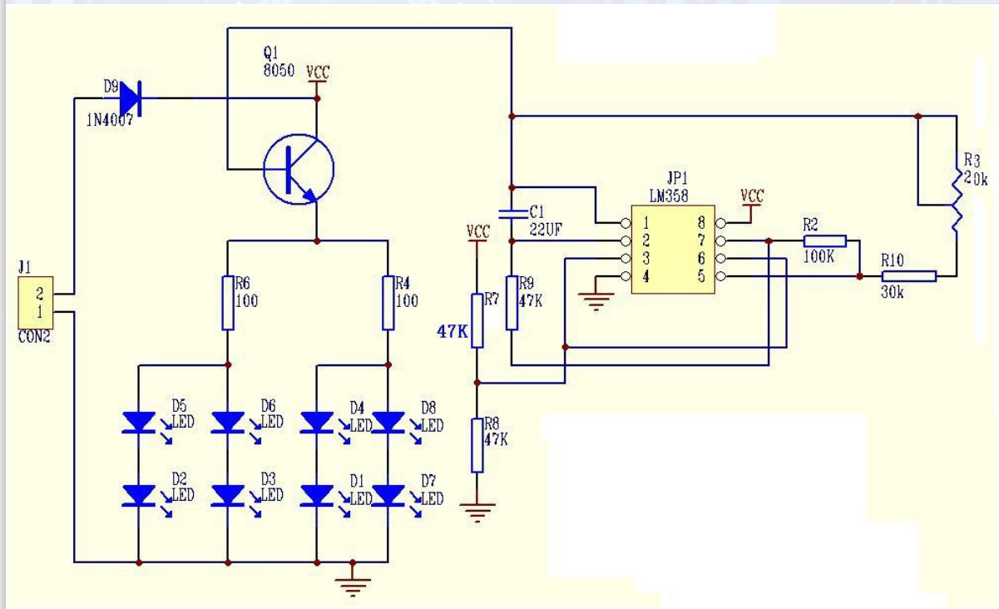
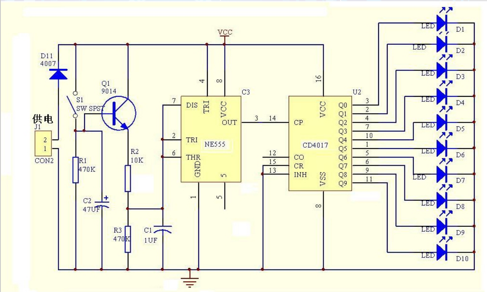
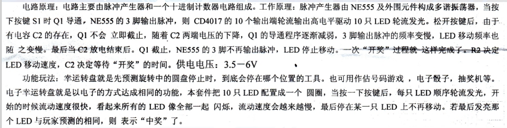
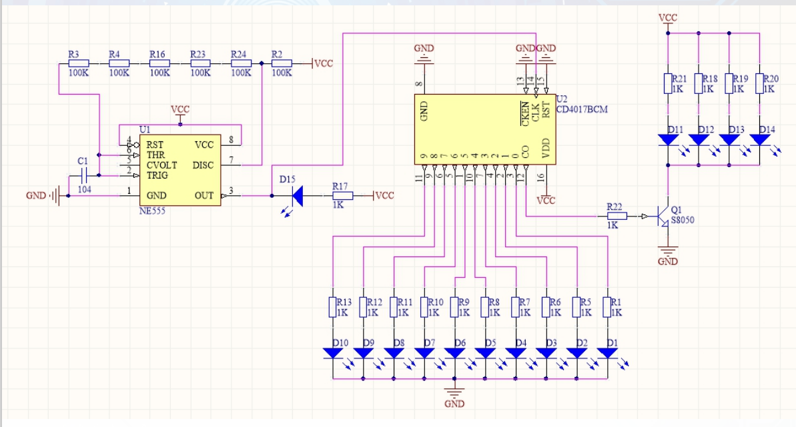
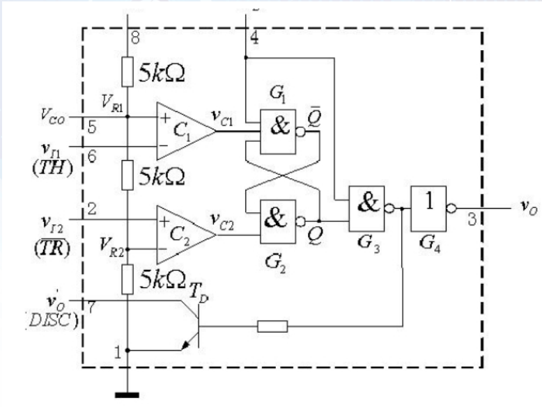

# 电子工程训练

[TOC]

## intro

1. 课程安排
    - 初级
        - 第1周：学习器件识别，介绍PCB制作，手工焊接步骤
        - 第2周：双列直插器件焊接训练（呼吸灯 & 幸运转盘）
        - 第3周：仪器使用初步，电路的调试与测试
        - 第4周：贴片器件焊接训练与调试
        - 第5周：仪器使用、电路调试的巩固
    - 提高
        - 第6周：小白路由器配置操作、体验
        - 第7-11周：电子系统（智能插座）调试、安装及系统集成工程认知及工程实践
        - 第12-16周：机电一体系统（履带式机器人）调试、安装及系统集成工程认知及工程实践

## 认识元器件

*看讲义内容即可*

1. 电阻
    - 分类
        - 按材料分类
            - 金属膜（便宜）
            - 合金箔（精度高）
            - 水泥电阻（功率大，水泥隔绝空气防线圈氧化）
            - 其他：碳膜、绕线电阻、合成膜电阻、氧化膜电阻、沉积膜电阻、有机实心电阻、无机实心电阻、玻璃釉膜电阻等
        - 按功能分类：光敏、热敏etc，贴片电阻
    - 参数：标称阻值（Ω 一般用 R 表示，分不同系列成等比数列）、允许误差、额定功率、温度系数($\alpha$)
    - 阻值标注：
        - 直标法
        - 色环标注（双列直插）
            - 四环（精度低）
            - 五环（精度高）
            - tips：离其他环最远的环是精度环
        - 数字倍乘法（贴片电阻）：103, 51R, 5R1
    - 电位器：注意阻值和 x 或者 $\theta$ 不一定是线性关系
2. 电容
3. 电感

## PCB 焊接训练 - 双列直插

1. 焊接
    - 烙铁头温度：350 摄氏度
    - 五步法：先上烙铁头，再上焊锡；先下焊锡，再下烙铁头
    - 先焊低的器件，再焊高的器件
2. 器件
    - 二极管：长脚正；有白环的一端是负极
    - 三极管 S8050：NPN 型；看平面上的文字，下面从左到右是 e, b, c
    - 电解电容：长脚正，PCB 板上涂白的是负极
    - 芯片：引脚向下，缺口朝左，左下是 1 号引脚；如果没有缺口，名称正着看，左下是 1 号引脚
    - 导线：红色接电源正，黑色接电源负

## PCB 焊接训练 - 贴片器件

1. 焊接
    - 步骤：（批处理）给第一个焊盘上锡 - 焊接第一个焊盘 - 焊接第二个焊盘
    - 芯片焊接步骤：第一个焊盘上锡 - 第一杆焊盘焊接 - 对角焊盘焊接 - 其余焊盘焊接
    - 目标焊点形状：三角形，包裹焊脚
2. 贴片器件
    - 板子电压 3V
    - 
    - 二极管：板子上标 + 号的是正极。器件上标颜色的一端，或者标 "T" 的下端，或者标三角形的尖端是负极。

## 电路板调试

呼吸灯：

- LM358及外围电路构成三角波振荡器
- 改变R3的阻值可以调整三角波的输出频率
- Q1进行电流的放大
- D9防止电源反接

幸运转盘：

流水灯：

NE555 内部结构：

## 智能插座

焊接阶段：

- BOM: PPT 15
- 所有电阻型号照片: PPT 60
- 元器件相关提示: PPT 58
- 供电电路: PPT 19

检测阶段：

- TP 作用：PPT 21
- 测试1：PPT 22
- 分析2：PPT 29
- 测试3：PPT 38
- 测试4：PPT 46
- 测试5：PPT 49