# 计算机组成与设计

[TOC]

## intro

1. 课程内容 
2. 分数组成
    - Theory (70%)
        - Homework + Quiz 20%: Late submission get 10% off for each 3 days. No late than 6 days 
        - Midterm test 10%: 进度到 5.4 A Simple Implementation Scheme
        - Final Examination 40%: English, Close-book test with one A4 memo.
    - Lab assignments (30%)
3. reference
    - [实验指导](https://guahao31.github.io/2023_CO/)
    - verilog 学习资料
        - [菜鸟教程](https://www.runoob.com/w3cnote/verilog-tutorial.html)
        - [HDLBits](https://hdlbits.01xz.net/wiki/Main_Page)
        - 参考阅读中的 `Verilog-2012.pdf`: 波形测试没有任何问题，但是下板现象并不符合波形。可能的问题参见 ppt 17 - 31 页 [slides repo](https://github.com/Guahao31/for_Computer_Logic/tree/master/slides)
    - 绘制有限状态机图：[FSM designer](https://madebyevan.com/fsm/)

## chapter 1 Computer Abstractions

1. Eight Great Ideas
    - Design for Moore's law：根据设计流程长度，硬件设计需要适配几年后的晶体管大小
    - Use Abstraction to Simplify Design：分层，隐藏复杂度
    - Make the Common Case Fast
        - Amdahl's Law：当提升系统的一部分性能时，对整个系统性能的影响取决于:1、这一部分有多重要 2、这一部分性能提升了多少。以下公式通过计算*同一个程序*的运行时间提升来表示性能的提升。
            $$
            Speedup_{overall}=\frac{ExecTime_{old}}{ExecTime_{new}}\\
            =\frac1{((1-Fraction_{enhanced})+\frac{Fraction_{enhanced}}{Speedup_{enhanced}})}
            $$
    - Performance via Parallelism
    - Performance via Pipeline
    - Performance via Prediction：预测 CPU 行为的结果并提前进行下一条指令。在大规模循环逻辑中要尽量避免数据强依赖的分支(data-dependent branching). [阅读材料](https://zhuanlan.zhihu.com/p/22469702)
    - Hierarchy of Memories
    - Dependability via Redundancy：增加冗余保证可靠性，以防某台机器出错
2. 集成电路(integrated circuit)
    - 术语
        - wafer: 晶圆
        - die: 晶粒。die area 取决于电路设计需要。
        - chip: 芯片
        - yield: 良品率；defect rate: 缺陷率。
    - 制造流程：硅 -> 晶圆 -> 切割 -> 晶粒 -> 封装 -> packaged dies -> 芯片
    - 价格：晶粒越大缺陷率也会相应提升，且晶圆边缘浪费的材料增加 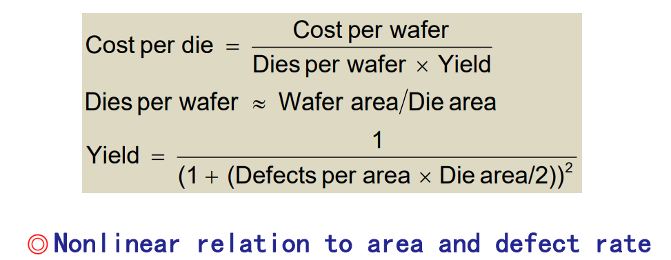
3. 性能(performence)
    - 指标
        - response time
        - throughput: 吞吐量，即做的总工作量
    - 运行时间衡量指标
        - elapsed time: 程序运行的持续时间。在单核处理器的情况下，Elapsed Time = Cpu Time + Wait Time。在多核处理器的情况下，由于多个CPU同时处理任务所以可能会出现Cpu Time 大于Elapsed Time 的情况。
        - CPU time：进程所占用的处理器时间
    - CPU time 影响因素
        - clock cycle time(=1/clock rate)
        - CPI(Cycles per instruction)
            - weighted average CPI
            - 每条指令的执行时间不一样，CPI 取决于程序使用了哪些指令。与程序、编译器有关，与硬件无关。
        - MIPS(millions of instructions per second): CPI & MIPS varies between programs on a given CPU.
        - 举个例子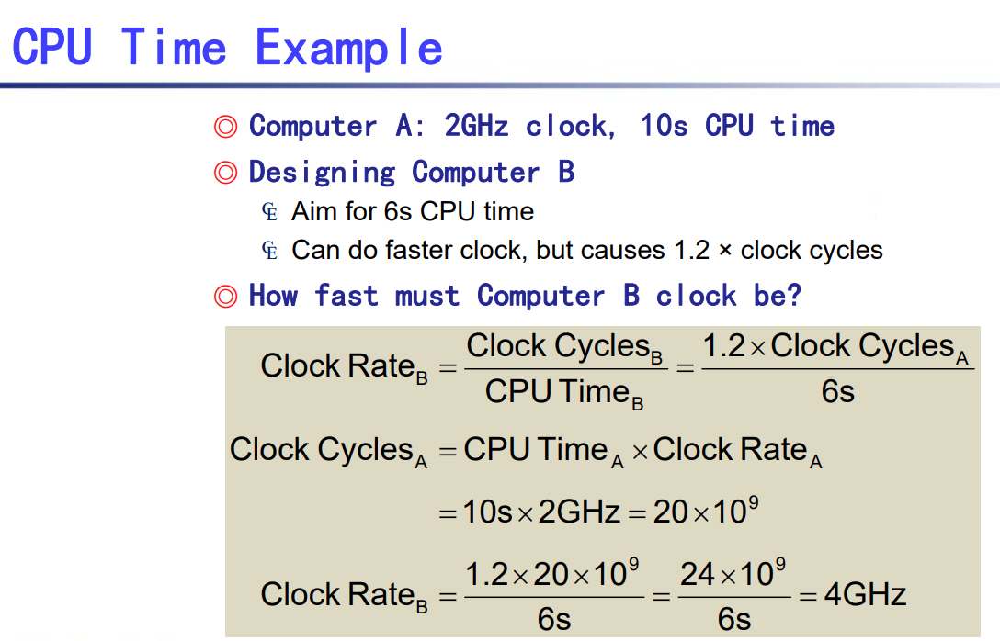
        - SPEC CPU benchmark: benchmark 是 CPU 性能测试，SPEC 是一家公司的测试标准（使用广泛）
    - three walls
        1. Power Wall: CMOS IC power = capacitive load * voltage $^2$ * frequency
            - low load -> low voltage
        2. Memory Wall
        3. ILP(instruction level parallelism) Wall: 

## chapter 3 ALU 设计

### 数字表示

1. two's biased notation: 在 two's complement 的基础上偏移一个固定的常数，不同的标准偏移常数不同。
    - $[X]_b=[X]_c+biased$ 如果偏移 $2^n$ 就是把符号位取反，IEEE754 标准偏移 $2^n-1$
2. sign extension: 把符号位填充到空位里
3. 比较运算
    - 对有符号和无符号整数需要不同的命令，因为相同的两个二进制数在有符号和无符号的情况下大小关系不同
    - signed integer
        - slt: set when less than
            - e.g. `slt rd, rs, rt` 如果 rs 小于 rt 就把 rd 置 1，否则置 0。
        - slti: set when less than immediate
    - unsigned integer
        - sltu
        - sltiu

### 算术运算

1. overflow
    - 溢出处理流程：
        - ALU硬件检测
        - Generation of an exception
        - Save the instruction address(not PC) in SEPC(special exception program counter)
        - Jump to specific routine in PC
    - 溢出判断条件：O = (A 的符号位 $\oplus$ Result 的符号位) & (B 的符号位 $\oplus$ Result 的符号位 $\oplus$ $sub / \overline{add}$)，O 为 1 表示有溢出 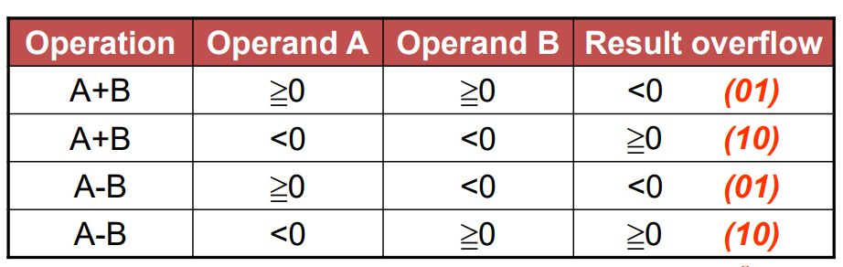
3. 逻辑运算
    - logical shift: sll / srl / slli / srli
        - 全称：shift left logical immediate
        - e.g. `slli x11, x9, 3` 表示 `x11=x9<<3`
    - and / or / xor, etc

### 加法器优化

1. 行波进位加法器
2. Carry Lookahead Adder
3. Carry Skip Adder：模块内用 carry lookahead，模块外用行波进位。是运行速度和硬件复杂度的折中方案。 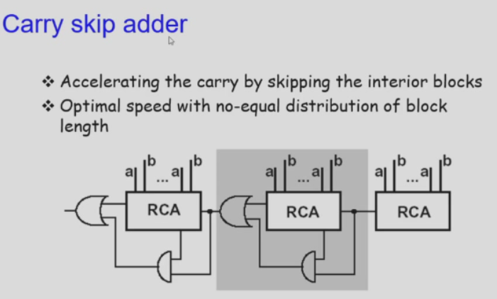
4. Carry Select Adder：高位把 carry 是 0 和是 1 的情况都先做了，最后选一个输出，用空间换时间。 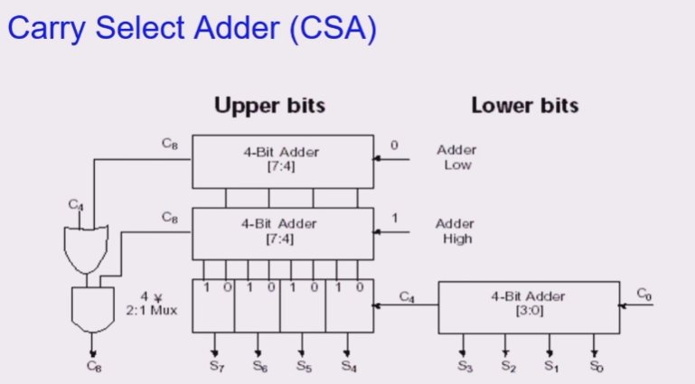

### 初级 ALU 组件

功能：

1. and
2. or
3. add
4. subtract
5. compare：Binvert 和 CarryIn 设置成减法。把 Result 最高位传到最低位输出（ *如果有溢出则需要取反，详见上方溢出情况表* ）
6. overflow detection：需要 A，B，Result 的最高位（符号位作为输入）
7. zero detector：给 compare 增加一个判断相等的功能，只需要加一个大的或非门就行了。

最高位的模块比普通位多一个溢出检测：

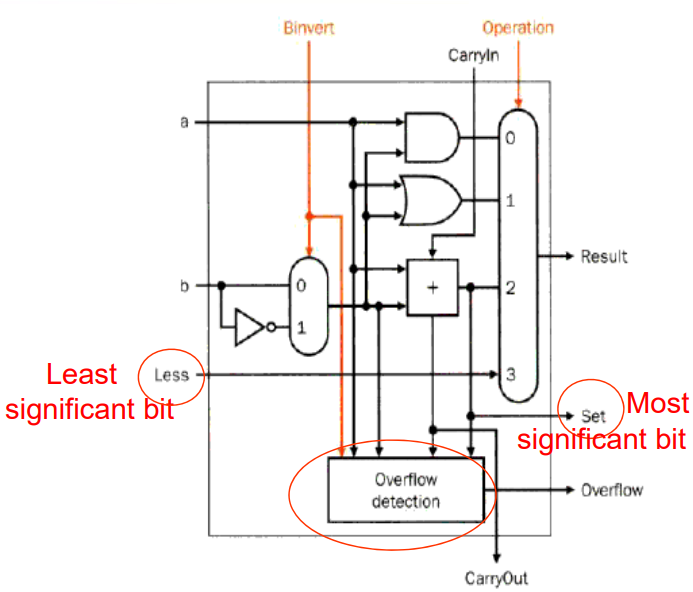

行波进位 ALU 整体结构，可以看到 compare 从最高位到最低位的数据传输：

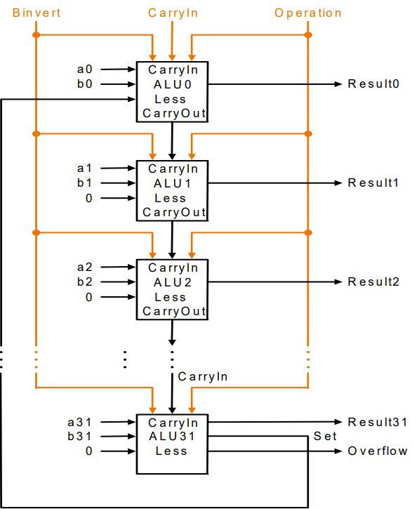

### 乘法器优化

参考：

1. [wikipedia: booth algorithm](https://en.wikipedia.org/wiki/Booth%27s_multiplication_algorithm#How_it_works)
2. [博客园: 补码一位乘](https://www.cnblogs.com/xisheng/p/9260861.html#:~:text=%E8%A1%A5%E7%A0%81%E4%B8%80%E4%BD%8D%E4%B9%98%E6%B3%95%E8%BF%90%E7%AE%97%E8%A7%84%E5%88%99%20%281%29%20%E5%A6%82%E6%9E%9C%20yn%20%3D%20yn%2B1%EF%BC%8C%E9%83%A8%E5%88%86%E7%A7%AF%20%5B%20zi,%E5%A6%82%E6%9E%9C%20yn%20yn%2B1%20%3D%2010%EF%BC%8C%E9%83%A8%E5%88%86%E7%A7%AF%E5%8A%A0%5B%20-%20x%5D%E8%A1%A5%EF%BC%88%E6%88%96%E5%87%8F%20%5Bx%5D%E8%A1%A5%EF%BC%89%EF%BC%8C%E5%86%8D%E5%8F%B3%E7%A7%BB%E4%B8%80%E4%BD%8D%EF%BC%9B)
3. [CSDN: 补码一位乘](https://blog.csdn.net/qq_43355372/article/details/100540759)

笔记：

1. 基础版 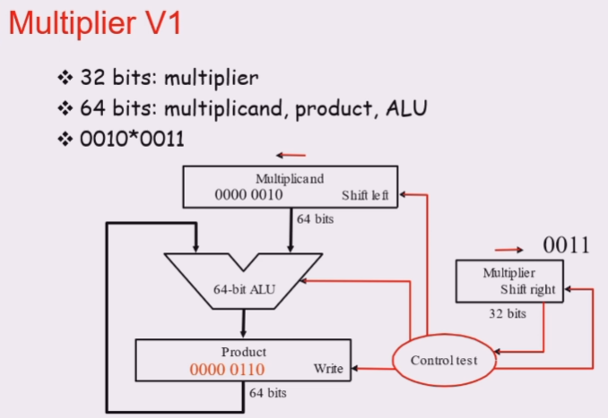
2. 优化 1：因为每次只对 32 个 bit 做加法， ALU 的位数可以减半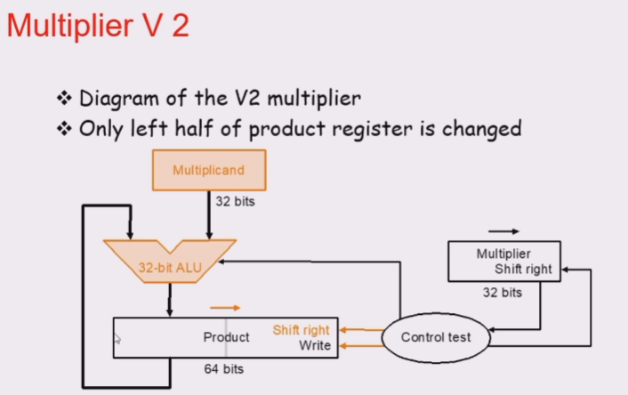
3. 优化 2：multiplier 右移且最低位丢弃，最高位无意义，所以可以把 Product 和Multiplier 的寄存器拼在一起，节省一半空间 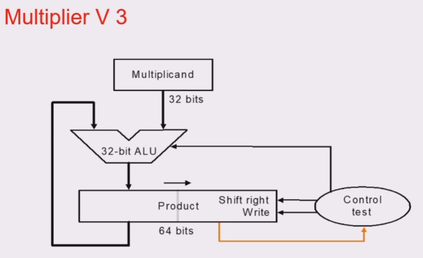
4. 有符号数乘法基础版：取出符号位，转化为无符号数乘法
5. Booth 算法：
    - **性质 1**：负小数的补码和原码换算（不包含符号位）
        - 方法1：整数部分取反加一，小数部分直接加。
        - 方法2：左移转换为整数，取反加一，再右移回去
        - e.g. 假设 $z$ 有 n 位整数 m 位小数，$z=-(2^n-[z]_{补整})+[z]_{补小}=-(2^n-[z]_{补整}-[z]_{补小})=-(2^n-[z]_{补})=-(2^{n+m}-2^m*[z]_{补})*2^{-m}$
    - **推论 1**：若纯小数 $z$ 的补码为 $z_0.z_1z_2\dots z_n$，其中 $z_0$ 是符号位，则 $z=-z_0+0.z_1z_2\dots z_n$
    - **性质 2**：负数 x 补码右移 1 位的结果为 `x/2`（右移使用 sign extension）；负数 x 补码左移 1 位的结果为 2x；减去 x 的补码相当于加上 $-x$ 的补码。对于正数来说上述结论显然成立。
    - **推论 2**：一个数 $x\in\mathbb{Q}$ 的补码 $[x]_{补}$ 乘以一个数的真实值 $z\in\mathbb{Q}$ 为结果 $xz$ 的补码。
        - 原因是：把 z 进行二进制拆分 $z=\sum_i z_i 2^i, z_i\in\{-1, 0, 1\}$，对于每一个项，把 x 进行移位后与 $z_i$ 相乘，可以保证移位和乘法过后的值是结果的补码，最后把所有结果相加，仍保证是补码。
    - **结论**：一个带符号位的数 $x$ 和一个带符号位的纯小数 $z$ 相乘，结果的补码为 $[xz]_{补} = [x]_{补} * (-z_0 + \sum_{i=1}^n z_i 2^{-i})$
    - **推广**：两个 n 位（包含符号位）的整数相乘，结果的补码为 $[x]_{补} * (-z_{n-1}) * 2^{n-1} + [x]_{补} * (z_{n-1}z_{n-2}\dots z_0)$
    - **优化**：用 $2^n-2^m$ 的形式代替一堆连续的 1，即从低位向高位扫描，如果当前位 `cur` 和低一位 `last` 是 10 则做减法，是 01 则做加法。并且这种方法不用特判最高位，看起来非常优美。
6. fast multiplication：multiple adders 空间换时间

### 除法器优化

1. 基础版
    1. check for 0 divisor
    2. 把 divisor 从高位不断右移，用 Remainder 减去 Divisor 如果得到负数就重新加回去，以下为 7/2 的例子 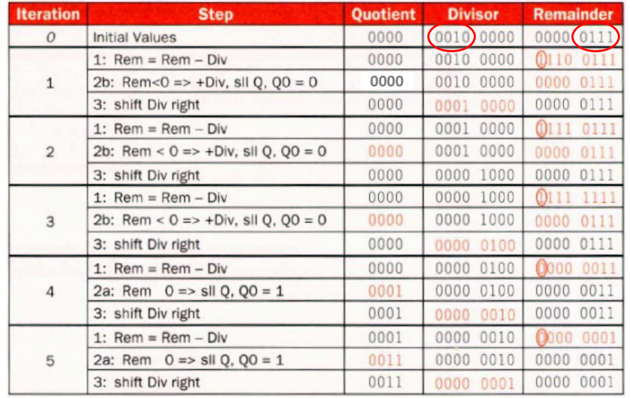
2. 优化 1：Divisor 不动，Remainder 左移，ALU 位数减半
3. 优化 2：Remainder 左移一位后最低位无意义，可以用于存放商，省去商的寄存器空间 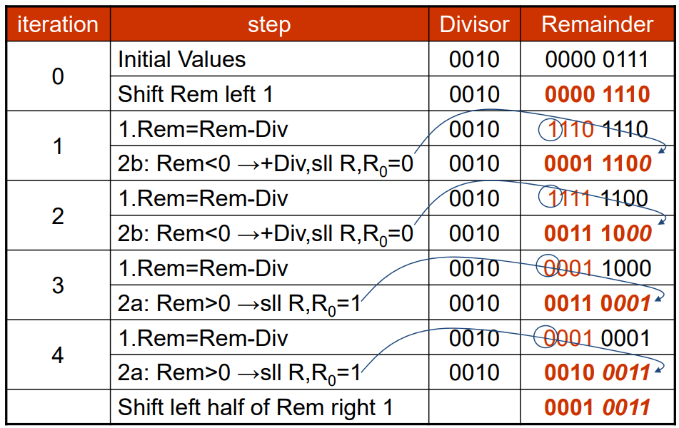
4. 有符号数除法：**要求 Remainder 与 Dividend（被除数） 符号一致**
5. fast division：SRT 除法（查表）

### 浮点数

#### IEEE745 标准

- 存储格式（注意 bias） 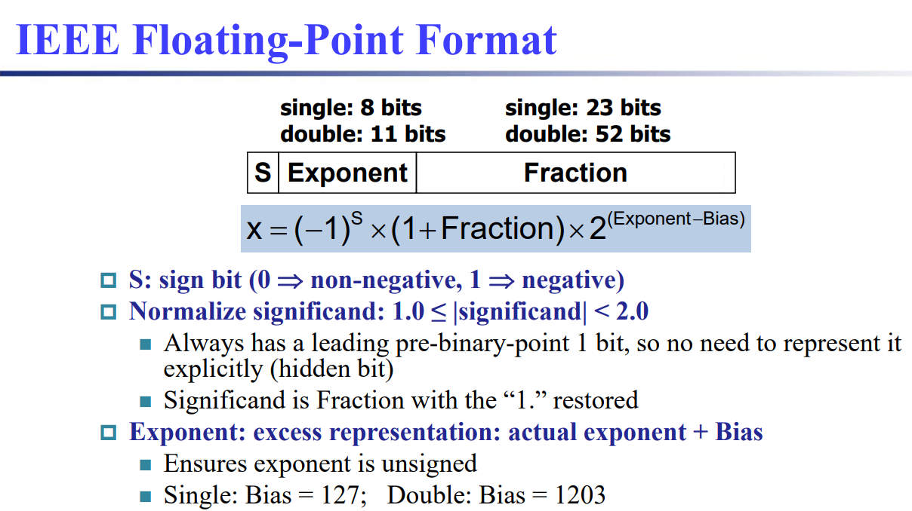
- 表示范围（注意排除保留的 exponential）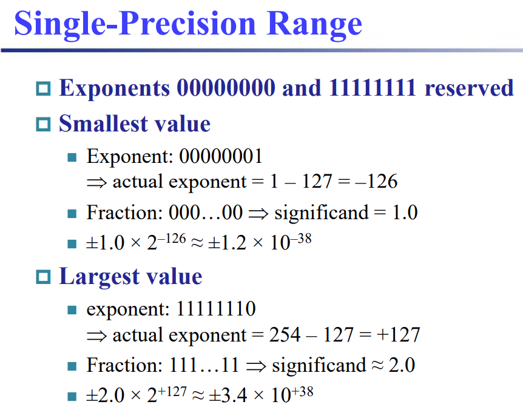
- denormal number
    - exponential 全 0：存储极小值 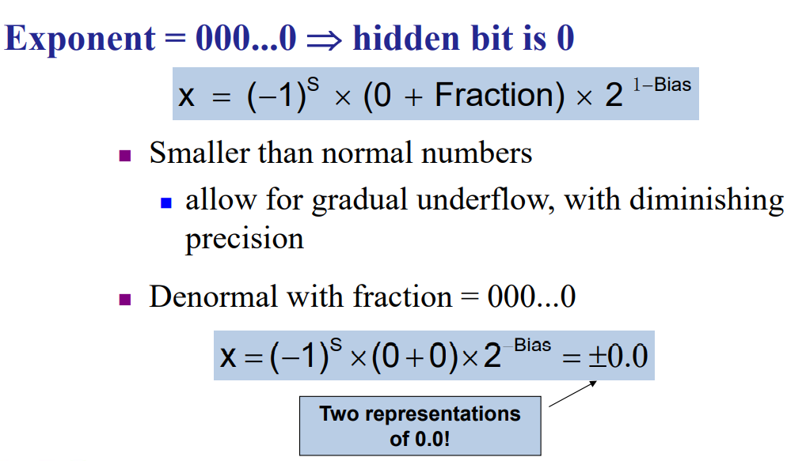
    - exponential 全 1：无穷和 NaN 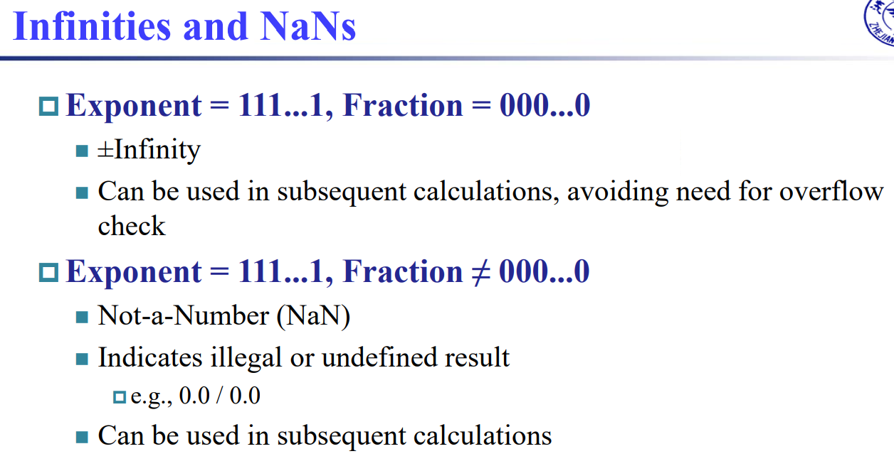

#### 浮点数加法

算法流程：


硬件实现：
- Control 根据 ALU 中 exponent 大小比较的结果，选择大的那个作为结果，并把小的 significand 进行右移


举例：


#### 浮点数乘法

算法流程：
- 步骤 1 中 exponent 相加需要减去 bias
- 步骤 3 中一定是右移，因为两个大于等于 1 的数相乘一定大于等于 1
- 除法的流程和乘法类似


硬件实现：


举例：


#### RISC-V 中的浮点数

浮点数寄存器
- 浮点数运算使用专门的浮点数寄存器
- 寄存器为双精度，单精度数存在低 32 bit
- 有专门存常浮点数的寄存器，因为使用频繁，可以加速运算，如 x0 存 0

#### 精度控制

1. 4 种 round mode 
    - round to nearest even: `x.5` 有一半概率向上取整，一半概率向下取整，尽可能减少结果的误差
2. 运算过程中的 3 个 extra bit
    - guard & round: 在有效数字之后再多存两位 ~~（感觉 round 位意义不大）~~
    - sticky: 在 guard & round 右边非零就存 1，全 0 就存 0，用于区分 `x.5000000` 和 `x.5000001` 的进位 

## chapter 2 RISC-V 指令

### Instruction Characteristics

- 指令只能对寄存器进行运算，除了 Load 和 Store 之外别的指令都不访问 Memory
- 等长指令

处理器内部的数据存储形式 * 3（不包含 memory）


指令的操作数类型：
- `x-x` 表示 operands 中有哪些类型，例如 register-register 表示只对寄存器内的数据进行运算


### 操作数(operand)类型

- register operand
- memory operand
    - little endian
    - memory alignment：同一个数据尽量对齐放在同一个 word(4 Byte) 里
- immediate operand: *make common case faster*

RISC-V 中的寄存器：


大小端：


### load & store

基址寻址方式：易于实现数组元素寻址
- `ld $x6, 0(x5)` 把 x5 所存的地址，偏移 0 Byte，把值 load 到 x6 里


### 指令格式(format)

1. R-format 
2. I-format 
    - 立即数是有符号数，所以只有 `addi` 没有 `subi`
3. S-format 
    - sd 的例子中，偏移量 `S_imm` 是由两段立即数和符号拓展组成的
4. 其他 

需要掌握：
- 汇编
- 反汇编
- cheating sheet 
    - opcode 决定指令格式，funct3 和 funct7 决定指令类型

### 指令具体介绍

- logical instructions

    - 右移分为逻辑右移 `srl` 和算数右移 `sra`，前者 zero-extention, 后者 sign-extention
    - AND 指令可用于实现掩码(mask)

- branch instructions
    
    - `blt` 和 `bltu` 的区别：带 u 的表示把用于比较的数看成无符号数
    - `jal` 和 `bne x0, x0, NEXT` 的区别：都表示无条件跳转，区别在是否保存 PC，前者用于实现函数跳转(jump and link)
    - 跳转语句可以实现：if-else, switch-case, 循环

## Vivado

### 概念

#### Testbench 是什么？怎么写？

[Testbench 是什么？怎么写？](https://vlab.ustc.edu.cn/guide/doc_testbench.html#2-1-testbench%E7%9A%84%E5%BB%B6%E8%BF%9F%E5%BB%BA%E6%A8%A1)

#### IP 包含源文件和不包含源文件的区别？

- 功能上：
    - 包含源文件方便修改
    - 不包含源文件保护知识产权
- 生成过程：
    - 包含源文件的 IP 直接依据当前项目文件生成
    - 不包含源文件的 IP 则是先导出 edf 和仅包含端口信息的 v 文件，再重新导入到项目中生成 IP（**注意：如果导入到同一个项目中，因为文件名相同，会覆盖之前写的源文件，所以最好新建项目或者修改源文件名字**）。
- 调用方法：
    - 有源无源都一样，只要把 IP 核文件夹的目录加入到 project 的 IP repository 中就行。
- 调用原理：
    - 有源文件：其调用原理是利用xgui下的tcl脚本根据xml特征描述从源文件处重新复制生成工程所需文件
    - 无源文件：其调用原理是利用xgui下的tcl脚本根据xml特征描述从.edf文件处重新复制生成工程所需文件


#### .edf 网表文件是什么？有什么作用？

[.edf 网表文件是什么？有什么作用？](https://zhuanlan.zhihu.com/p/137433454)

#### 什么是 IP core？

IP核文件夹包含 xgui 和 component 以及其对应的源文件（有源文件则为 v，无源文件则为 v 和 edf）

### 操作

#### 使用 VSCode 作为编辑器

[使用 VSCode 作为编辑器](https://zhuanlan.zhihu.com/p/378739805)


#### 导出 edf 和 v 文件

- tcl console 命令：注意文件名要和原源文件不同 `write_verilog -mode synth_stub F:/programfiles2022/Vivado/IP/<project_name>/<project_name>_ns.v` `write_edif F:/programfiles2022/Vivado/IP/<project_name>/<project_name>_ns.edf`
- 若含Xilinx IP则需通过如下命令生成edf文件：`write_edif -security_mode all E:/FPGA/ip/MUX2T1_5.edf`
- 需要打开 Synthesized Design 之后才能执行上述命令

#### 生成自定义 IP

在 `IP Location` 步骤指定位置生成 IP 文件，会把源文件一起复制过去，形成 IP 核文件，在此之前不用考虑文件位置问题。

#### 调用自定义 IP

~~xml 文件描述包含源文件的目录位置，若复制源文件时更改了路径位置，则需在xml描述对应位置进行更新，以免出现调用时无法找到源文件的错误。~~ 不会出现上述问题

1. 把所有 IP 核放在同一个文件夹下，使用时只需要把所有 IP 所在的文件夹加入到 IP repository
2. 在 IP catalog 中双击用 IP 生成一个 module
3. 然后就可以在 verilog 文件里把 module 例化了，显示在 Design Sources 里的名字就是模块名
    ```verilog
    MUX2T1_5_0 MUX2T1_5_0(
        .I0(I0),
        .I1(I1),
        .s(s1),
        .o(o_0)
    );
    ```

#### 修改自定义 IP

在修改某些 IP 时，采用右键 IP，选择 Edit in IP Packager 进入自动生成的子工程中修改，修改完成后 Repackage IP，然后回到父工程中 Upgrade IP 即可。可以避免自认为 IP 更新了，实际上工程并没识别到

#### 把原理图翻译成 verilog 文件

1. 输入输出照抄
2. module 实例化（命名，但先不连线）
3. 给每个输出引脚定义一根线，命名为“实例名_引脚名”
4. 遍历每个输入引脚，填入要连的线名称

#### RAM & ROM

==Lab0 PPT P131==


### 封装 clk 和 rst 接口的问题

- clk 报错
- rst 自动反相

参见 Lab01-1 PPT P22-27


### Verilog

#### assign

- 方向性：等号右边输入(driver, source)，左边输出(sink)
- 持续性：表示持续存在的(continuously)连接关系，而不是一个即刻的赋值行为
- 无序性：语句顺序与结果无关
- 唯一性：一个 wire 只能被一个 driver 驱动，即一个 wire 只能出现在 assign 等式左边一次
- 是 wire 之间的连接关系，本身不是一条 wire

e.g. `assign out = in;`

#### wire

- 声明必须在第一次使用之前
- `input wire in` 简写成 `input in`，本质是一根连接 module 内外的 wire

#### vector

- 声明：`type [upper:lower] vector_name;`, e.g. `wire [31:0] my_vec`
    - negative ranges are allowed, e.g. `input wire [3:-2] z;`
    - 反向 vector, e.g. `wire [0:7] b;`, b[0] is the most-significant bit
    - 禁用未定义网络：在文件最前面写 `default_nettype none
- part-select: `assign out = my_vec[7:0];`
- concatenation
    - 可以组合输出端口，e.g. `assign {out[7:0], out[15:8]} = in;`
    - 可以组合输入端口，e.g. `assign out[15:0] = {in[7:0], in[15:8]};`
    - 必须保证宽度已知，e.g. `{3'b111, 3'b000}` 可以，`{111, 000}` 不行
    - 重复 n 次：`{num{vector}}`, e.g. `{3'd5, {2{3'd6}}}`

p.s. Bitwise vs. Logical Operators 在 operand 是 vector 时行为不同：位运算对于每一位分别运算，返回和运算数同样长度的结果；逻辑运算则把两边当成布尔值，返回 1 位的结果

p.s. unpacked array: 

- 用于定义内存块
- `reg [7:0] mem [255:0];` are 256 unpacked elements, each of which is a 8-bit packed vector of reg. 
- 只能单个使用 `mem[0]`，不能连续使用 `mem[31:0]`
- [参考](https://hdlbits.01xz.net/wiki/Vector1)

#### module

定义一个 module

```verilog
module mod_a ( input in1, input in2, output out );
    // Module body
endmodule
```

调用 (实例化，instantiate) 一个 module
- by position `mod_a instance1 ( wa, wb, wc );` 顺序和定义的时候一样
- by name `mod_a instance2 ( .out(wc), .in1(wa), .in2(wb) );`

p.s. pin 指 1 位的输出端口


#### procedure

procedure 包括：

- always
- initial
- task
- function

procedure 内部的语法有：

- if-else
- case

#### combinational always

`always @(*)` 和 assign 的异同

- 语法不同：always 块内部不能有 assign，但可以使用 if-else, case 等更复杂的语法
- 操作的变量类型不同：assign 左边必须是 net type (e.g. wire)，always 内部的 procedural assignment 左边必须是  variable type (e.g. reg)
- 逻辑相同：Both will recompute the output whenever any of the inputs (right side) changes value.

p.s. `always@()` 括号里叫 sensitivity list，表示检测到其中输入的变化就重新执行块内的代码

p.s. wire 和 reg 的硬件实现相同，只是用于两种不同情景的不同语法


e.g.

```verilog
always @(*)
    case(sel)
        2'h0: q = d;
        2'h1: q = o1;
        2'h2: q = o2;
        2'h3: q = o3;
    endcase
```

#### clocked always

p.s. 在 procedure 中 `=` 和 `<=` 的区别：In a combinational always block, use blocking assignments(=). In a clocked always block, use non-blocking assignments(<=).

e.g. `always @(posedge clk) out_always_ff <= a ^ b;`

#### if-else 语句

e.g.

```verilog
always @(*)
    if (sel_b1 & sel_b2) out_always = b;
    else out_always = a;
```

p.s. 如果要在 if-else 中对某个 reg 进行赋值，最好在所有分支中都对其进行赋值。否则会生成一个触发器，在没有赋值的分支保留值，不再是组合逻辑。

#### case 语句


e.g.

```verilog
always @(*) begin     // This is a combinational circuit
    case (in)
      1'b1: begin 
               out = 1'b1;  // begin-end if >1 statement
            end
      1'b0: out = 1'b0;
      default: out = 1'bx;
    endcase
end
```

- 只执行一个分支，不需要 break
- 重复的分支语法正确，但只有第一个分支被使用

p.s. casez: z 可以为任意值

```verilog
always @(*) begin
    casez (in[3:0])
        4'bzzz1: ...
        4'bzz10: ...
        4'bz100: ...
        4'b1000: ...
        default: ...
    endcase
end
```

(casex 同理，可以用 `?` 代替 `z`)