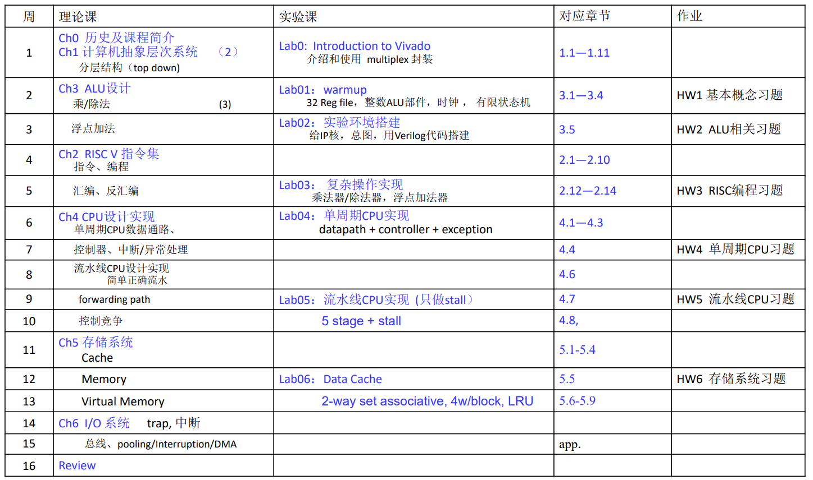
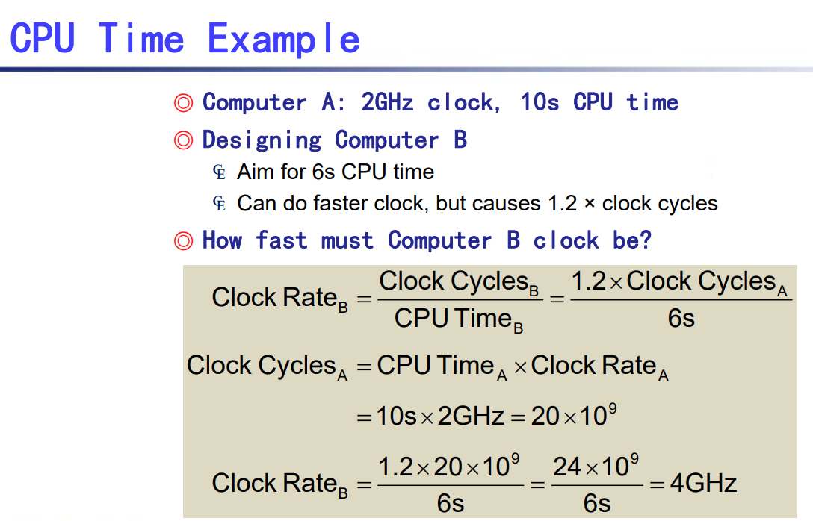

# 计算机组成与设计

[TOC]

## intro

1. 课程内容 
2. 分数组成
    - Theory (70%)
        - Homework + Quiz 20%: Late submission get 10% off for each 3 days. No late than 6 days 
        - Midterm test 10%: 进度到 5.4 A Simple Implementation Scheme
        - Final Examination 40%: English, Close-book test with one A4 memo.
    - Lab assignments (30%)
3. reference
    - `Verilog.pdf`: 波形测试没有任何问题，但是下板现象并不符合波形。可能的问题参见 ppt 17 - 31 页
4. Eight Great Ideas
    - Design for Moore's law：根据设计流程长度，硬件设计需要适配几年后的晶体管大小
    - Use Abstraction to Simplify Design：分层，隐藏复杂度
    - Make the Common Case Fast
        - Amdahl's Law：当提升系统的一部分性能时，对整个系统性能的影响取决于:1、这一部分有多重要 2、这一部分性能提升了多少。以下公式通过计算*同一个程序*的运行时间提升来表示性能的提升。
            $$
            Speedup_{overall}=\frac{ExecTime_{old}}{ExecTime_{new}}\\
            =\frac1{((1-Fraction_{enhanced})+\frac{Fraction_{enhanced}}{Speedup_{enhanced}})}
            $$
    - Performance via Parallelism
    - Performance via Pipeline
    - Performance via Prediction：预测 CPU 行为的结果并提前进行下一条指令。在大规模循环逻辑中要尽量避免数据强依赖的分支(data-dependent branching). [阅读材料](https://zhuanlan.zhihu.com/p/22469702)
    - Hierarchy of Memories
    - Dependability via Redundancy
5. 集成电路(integrated circuit)
    - 术语
        - wafer: 晶圆
        - die: 晶粒。die area 取决于电路设计需要。
        - chip: 芯片
        - yield: 良品率；defect rate: 缺陷率。
    - 制造流程：硅 -> 晶圆 -> 切割 -> 晶粒 -> 封装 -> packaged dies -> 芯片
    - 价格：晶粒越大缺陷率也会相应提升，且晶圆边缘浪费的材料增加 
6. 性能(performence)
    - 指标
        - response time
        - throughput: 吞吐量，即做的总工作量
    - 运行时间衡量指标
        - elapsed time: 程序运行的持续时间。在单核处理器的情况下，Elapsed Time = Cpu Time + Wait Time。在多核处理器的情况下，由于多个CPU同时处理任务所以可能会出现Cpu Time 大于Elapsed Time 的情况。
        - CPU time：进程所占用的处理器时间
    - CPU time 影响因素
        - clock cycle time(=1/clock rate)
        - CPI(CYcles per instruction)
            - weighted average CPI
        - 举个例子
    - 