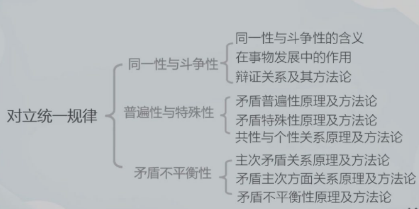

# 马克思主义基本原理

[TOC]

## intro

1. 评分标准
    - 期末考 40%
    - 平时分 60%
        - 辩论 30 / 25
        - 慕课时长 20
        - 线上小测 3 次 30
        - 线上讨论：春学期和夏学期最后一周，共 2 次 10 分 
        - 发言每次 3 分
        - 教师评价 10 分，其他部分最高 90 分，总分 100 分折算 60 分。
2. 考试
    - 选择题 1 * 40
    - 大题 20 * 3 考点：辩证唯物主义，历史唯物主义、政治经济学
3. 辩论
    - 同一律审查：偷换概念
    - 矛盾审查
    - 质证：论据不可靠
    - 无效推理：违背三段论、论据不充分etc
    - 归谬法
3. 参考资料
    - [选择题题库](https://hggshiwo.github.io/exchelper/index.html#/)，[选择题题库 github 仓库](https://github.com/HGGshiwo/exchelper5)
    - [慕课](https://www.icourse163.org/course/PKU-1003761005?tid=1004001014)，记得

## 马克思主义的概念

1. 马克思主义
    - 狭义
    - 广义
2. 马克思主义的正统性
    - 坚持马克思的原创理论
        - 唯物史观
        - 剩余价值
    - 坚持以实践为导向和标准
        - 不是马克思主义：西马，停留在书本上。
    - 坚持远大的共产主义理想
        - 炫耀知识和炫耀财产本质相同？没有改变世界的目标（信仰）会导致心理的空虚，生活缺乏激情和动力。
        - 马克思主义者 - 信仰 = 没有信仰的唯物主义者
        - 将个人信仰和国家信仰结合，在个人奋斗的同时造福社会。

## 马克思主义发展史

### 马克思主义产生条件

1. 时代发展的产物：资本主义萌芽、工人运动兴起
2. 人类思想发展的产物
    - 德国古典哲学：
    - 英国古典政治经济学
        - e.g. 什么决定了货币的价值？全社会在某时刻生产出的产物决定了货币价值
    - 空想社会主义
        - 共产主义实现的道路不能靠资产阶级的道德感
        - 共产主义的实现需要高度发达的生产力
3. 马克思恩格斯个人努力

### 马克思主义的发展

1. 苏联模式的马克思主义：托洛茨基、列宁、斯大林
2. 西方马克思主义
    - 法国五月风暴
    - 法兰克福学派：
3. 中国化的马克思主义
4. 第三世界的马克思主义：古巴卡斯特罗

### 辩证法

- 黑格尔：本质即联系
- 马克思：人的本质是社会关系的总和

- 夸大特殊性：白马非马
- 夸大普遍性：好人

### 马克思为什么是对的？

[b 站视频](https://www.bilibili.com/video/BV18z4y1C7rX/?spm_id_from=333.337.search-card.all.click&vd_source=fc5d7f6ebecaa54cb57d884a9e457b94)

人的本质：创造性地参与和改变自然与社会关系

劳动分工是一种对人的异化，将人变成工具。真正优秀的科学家都诞生于全科教育的时代。

剥削对资本家来说是正向循环。

剩余价值理论：工人劳动力的交换价值和使用价值。使用价值的提升反而导致交换价值减少。

## 期末复习

大题：

1. 一道辩唯
1. 一道历唯
1. 一道政治经济学