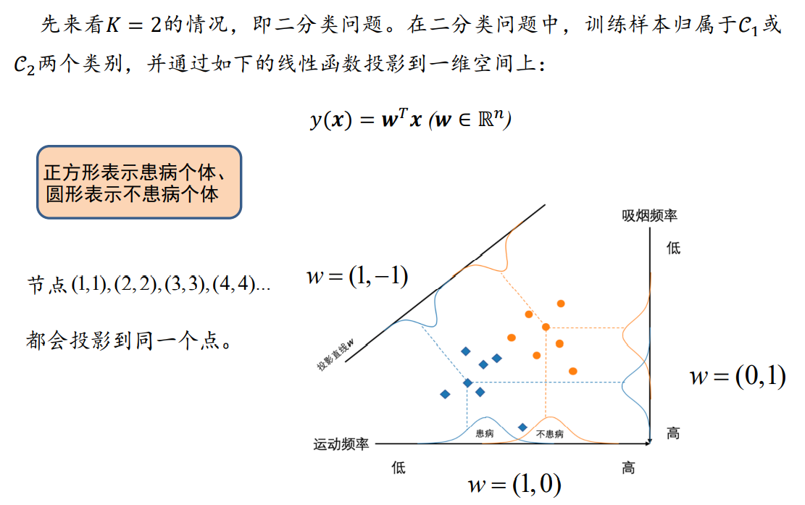

# AI 基础

## 工具介绍

### 智海 Mo 平台

1. [Mo 平台](mo.zju.edu.cn)
2. Jupyter Notebook
    - 作业主文档：`main.ipynb` 
    - 提交作业：选择代码块组成 `main.py` 并进行用例测试，提交 **只有一次机会**
    - 资源：2核4G cpu + 4G内存，TF 2.x / torch 1.4.0（ **注意兼容问题** ）
    - 使用 GPU： 新建 `xxx.py`，header 选择新建任务，选择 GPU 机器， **注意结果存放在 `/result` 文件夹下**

### 人工智能框架：PaddlePaddle & MindSpore

1. 人工智能 > 机器学习 > 深度学习
2. 机器学习的本质：参数估计
    - 模型假设
    - 评价函数
    - 优化算法
3. PaddlePaddle：百度，2016开源（多端多平台分布式部署？）
4. MindSpore：华为（全栈全场景？）

## 作业答疑

垃圾短信检测：

1. 归一化为什么能提升性能？参数更容易收敛。
2. 模型泛化程度不够（测试训练集外的数据时准确率比测试训练集时低很多）怎么提升？限制参数的范数，防止参数朝某一些方向特征过度靠近。

异常检测：

1. PCA 降维的维度是否正交？PCA 降维后的坐标向量是正交的单位向量。因为协方差矩阵 $XX^T$ 是实对称矩阵，**实对称矩阵不同特征值的特征向量是正交的**，然后条件又保证 $w_iw_i^T=1$ 即特征向量是单位向量，所以取出来的维度向量一定是正交单位向量。
2. PCA 选择维度数量的依据？PCA 降维的维度是算法性能和数据还原度的 trade-off
3. 选择聚类数目的依据？根据先验知识，或者根据测试出来的性能
4. 离群点被当做一个单独的分组导致没有被判断为异常点怎么办？方法是随机产生初始聚类中心，不要用 kmeans++。

深度学习：
1. [交叉熵的由来](https://zhuanlan.zhihu.com/p/115277553)
2. 把图片长宽设置得更小，训练更快但效果也更好了？和具体的问题有关，有的数据上可能只需要整体轮廓就可以训练的比较好了，所以长宽设置的更小更好训练
3. 怎么选取最终模型？一般模型选择通过在 validation set 上的准确性来选择，防止过拟合
4. 打乱数据集，可以防止过拟合

## 逻辑推理

1. 命题逻辑和谓词逻辑：
    1. 归结(resolution)和单项归结(unit resolution): 归结就是 A 或 B 为真，A 非或 C 为真，则 B 或 C 一定为真。单项归结就是 A 或 B 为真但是 A 为假，则 B 为真。
    2. 析取是或，合取是与
3. 知识图谱：
    1. 是一个有向图，(实体，关系，实体)
    2. FOIL(first order inductive learner) 算法——ILP(inductive logic programming) 的一种
        1. 目标：给定目标谓词，得到形如下式的推理规则 
        2. 信息增益：用于评判前提约束谓词的好坏 
        3. 算法流程：
            - 预处理：
            - 迭代：依次将谓词加入到推理规则中作为前提约束谓词；计算所得到新推理规则的FOIL增益值；基于计算所得FOIL增益值来选择最佳前提约束谓词。将最佳前提约束加入到推理规则中，去掉用不上的正例和反例（将例子中的实体代入到前提约束谓词中，在背景知识里没有符合的）
            - 结束：得到的推理规则覆盖训练样本集合中所有正例且不覆盖任意反例，学习结束。
    3. PRA(path ranking algorithm) 算法：

## 搜索

1. 搜索的基础概念
    1. 搜索算法评价指标：完备性、最优性、时空复杂度
    2. 概念：
        - 搜索树：整个搜索过程形成的树结构
        - 边缘集合、开表(open list)：下一步探索的候选节点
        - 闭表(close list)：已经被拓展过的状态（节点）
        - 图搜索和树搜索：图搜索中一个状态只能有一个节点，不允许环路出现
2. 启发式(heuristic)搜索
    1. 概念：
    2. 贪婪最佳优先搜索(Greedy best-first search)：评价函数f(n)=启发函数h(n)
    3. A*算法：
3. 对抗搜索(Adversarial Search)，i.e.博弈搜索(Game Search
    1. 最小最大搜索(Minimax Search): 
    2. Alpha-Beta剪枝搜索(Pruning Search): 
        - 假设有一个位于MIN层的结点𝑚，已知该结点能够向其上MAX结点反馈的收益为**𝛼**。𝑛是与结点𝑚位于同一层的某个兄弟结点的后代结点。如果在结点𝑛的后代结点被访问一部分后，知道结点𝑛能够向其上一层MAX结点反馈收益小于𝛼，则结点𝑛的未被访问孩子结点将被剪枝
        - 考虑位于MAX层的结点𝑚，已知结点𝑚能够从其下MIN层结点收到的收益为**𝛽**。结点𝑛是结点𝑚上层结点𝑚′的位于MAX层的后代结点，如果目前已知结点𝑛能够收到的收益大于𝛽，则不再扩展结点𝑛的未被访问后继结点，因为位于MIN层的结点𝑚′只会选择收益小于或等于𝛽的结点来采取行动
    3. 蒙特卡洛树搜索(Monte-Carlo Tree Search):
        - 奖励和悔值函数：
        - epsilon-贪心算法：
        - 霍夫丁不等式：
        - 上限置信区间（UCB1，upper confidence bounds）（以多臂赌博机为例）：置信上限与已获得的收益平均值、已经尝试的总次数、对当前赌博机尝试的次数有关。UCB 的目的是在探索和利用之间寻找平衡，和 epsilon-贪心一致。 
        - 算法步骤：（以黑白棋为例）
            - 选择：用 UCB1 算法计算节点权值，贪心选择一条路径
            - 拓展：随机
            - 模拟：随机
            - 反向传播：更新拓展的节点和路径上的节点，更新尝试次数和总收益
                

## 监督学习

1. 基本概念
    - 损失函数： 
    - 经验风险和期望风险：
        - 经验风险(empirical risk)：训练集中数据产生的损失。经验风险越小说明学习模型对训练数据拟合程度越好。
        - 期望风险(expected risk):当测试集中存在无穷多数据时产生的损失。期望风险越小，学习所得模型越好
        - 根据大数定律，当样本容量趋于无穷时，经验风险趋于期望风险。所以在实践中很自然用经验风险来估计期望风险。由于现实中训练样本数目有限，用经验风险估计期望风险并不理想，要对经验风险进行一定的约束。
    - 泛化能力、过学习、欠学习：
    - 结构风险最小化、正则化项（惩罚项）：通过限制模型规模来防止过拟合 
    - 分类：
        1. 判别方法：回归模型、神经网络、支持向量机、Ada Boosting
        2. 生成方法：贝叶斯方法、隐马尔科夫链
2. 回归
    - 一元线性回归：最小二乘法
        - 损失函数：求一组 (a, b) 最小化 L(a, b) 
        - 推导：求偏导，极值处导数为 0
        - 结果：
    - 多元线性回归
        - 问题定义：
        - 推导：y 是一个列向量，X 的一列是一个数据，一行是数据的一维，a 是一个列向量 
    - 逻辑斯蒂回归：解决离群点问题
        - sigmoid 函数：单调递增，对输入𝑧取值范围没有限制，z 取值在0附近时，函数输出值的变化幅度比较大。
        - 正例概率、负例概率、几率（P/(1-P)）、对数几率：整理概率大于 0.5 即几率大于 1 可认为输入数据在当前参数模型下被判定为正例 
        - 最大化对数似然、最小化损失函数（交叉熵）：其中 yi 只能取 0 或 1
        - 梯度下降公式：
        - 推广：逻辑斯蒂回归只能解决二分类问题，推广到 softmax 函数，处理多分类问题
3. 决策树：通过树形结构进行分类
    - 信息熵：E(D) 值越小，表示 D 包含的信息越确定，也称 D 的纯度越高。在决策树上，信息熵是对每个节点而言，k 表示节点包含几种种类的最终分类（如下图中“拥有房产”节点有两种信息，而“年龄20-30”节点只有一个信息，最终分类是“给”和“不给”两类） 
    - 信息增益：进行一个划分之后熵减少了多少。其中 D 是父节点样本数，Di 是第 i 个分支的样本数 
    - 信息增益率：一般来说分支越多，信息增益越大，容易造成决策树过拟合。引入 info 对多分支进行惩罚 
4. 线性判断分析（LDA, linear discriminant analysis），一种基于监督学习的降维方法
    - 投影：
    - 计算投影后的类内方差：其中 m1，m2 是类投影前的中心点坐标，矩阵大小为 (1 * n) * (n * n) * (n * 1)，n 是原数据维度，形似二次型 
    - 最大化类间距离，最小化类内方差。这里 m1，m2 是投影后的类内均值 
    - 类间散度矩阵(between-class scatter matrix)、类内散度矩阵(within-class scatter matrix)：
    - 拉格朗日插值法：由于 𝐽(𝒘) 的分子和分母都是关于𝒘的二项式，因此最后的解只与 𝒘 的方向有关，与 𝒘 的长度无关（即便扩展或缩减 𝒘 ，𝒘T𝒘 所得长度也可被约分掉），因此可令分母𝒘𝑇𝑺𝑊𝒘 = 1，然后用拉格朗日乘子法，𝐿(𝒘) = 𝒘𝑇𝑺𝑏𝒘 − 𝜆(𝒘𝑇𝑺𝑤𝒘 − 1)，结果 
    - LDA 步骤描述： 
5. Ada Boosting 自适应提升
    - 概念：
        1. 概率近似正确(probably approximately correct, PAC)：如何知道假设是正确的，以及为了接近真实需要多少数据（霍夫丁不等式就是针对 PAC 问题的回答）
        2. 强可学习、弱可学习：两者等价，即如果已经发现了“弱学习算法”，可将其提升（boosting）为“强学习算法”
    - 步骤：
    - 实际上是在最小化指数损失函数

## 无监督学习

1. K 均值聚类
    - 目标：将𝒏个数据依据其相似度大小将它们分别聚类到𝒌个集合，使得每个数据仅属于一个聚类集合，并最小化集合内方差。
    - 步骤：
        1. 第一步：初始化聚类质心
        2. 第二步：将每个待聚类数据放入唯一一个聚类集合中（欧氏距离最近）
        3. 第三步：根据聚类结果、更新聚类质心（均值）
        4. 第四步：算法循环迭代，直到满足条件（已经达到了迭代次数上限，或者前后两次迭代中，聚类质心基本保持不变）
    - 缺陷：
        1. 需要事先确定聚类数目，很多时候我们并不知道数据应被聚类的数目
        2. 需要初始化聚类质心，初始化聚类中心对聚类结果有较大的影响
        3. 算法是迭代执行，时间开销非常大
        4. 欧氏距离假设数据每个维度之间的重要性是一样的
2. 主成分分析（Principle Component Analysis, PCA）: 是一种特征降维方法
    - 与 LDA 的区别：监督学习和无监督学习，主成分分析的点没有预先分类。
    - 目标：向方差最大的方向投影（保持特征）来达到降维（降低冗余性）的目的。
    - 推导：
    - 其他降维方法：非负矩阵分解（non-negative matrix factorization, NMF），多维尺度法(Metric multidimensional scaling, MDS) ，局部线性嵌入（Locally Linear Embedding，LLE）
    - 奇异值分解（SVD）
    - 应用：特征人脸方法 
    - 应用：隐性语义分析（latent semantic analysis, LSA或latent semantic indexing, LSI）
        1. 第一步：计算单词-文档矩阵，表达文档和单次的包含关系
        2. 第二步：奇异值分解
        3. 第三步：重建矩阵。当k=2，即选取最大的前两个特征根及其对应的特征向量对矩阵A进行重建。
        4. 第四步：挖掘语义关系。把一个文档当做一个随机变量计算相关系数矩阵
3. 期望最大化算法（expectation maximization, EM）
    - 最大似然估计 （maximum likelihood estimation，MLE）和最大后验估计 （maximum a posteriori estimation，MAP）：逻辑斯蒂回归就是用对数似然函数的相反数（交叉熵）作为损失函数 
    - 目标：解决含有隐变量（latent variable）问题的参数估计方法
    - 步骤：（以二硬币投掷为例）
        - 情景：在每一轮实验中，先随机选择一个硬币，然后用所选择的硬币投掷十次，将投掷结果作为本轮实验观测结果。隐变量：对硬币的选择。模型参数：每个硬币投出正面的概率。
        1. 求取期望（E步骤，Expectation）：假设模型参数的初始值，已知实验结果，求隐变量概率分布。
        2. 期望最大化（M步骤，Maximization）：将隐变量概率分布视为已知，已知实验结果，求模型参数。
    - 本质上是在求最大对数似然

## 深度学习

1. 前馈神经网络
    - 概念：
        1. 神经元：二值化输入，线性加权求和，输出 1 或 -1
        2. 激活函数： 
            - 多分类：softmax，
        3. 损失函数：常用均方误差损失函数和交叉熵损失函数（度量两个概率分布间的差异）
            - softmax 损失：一旦得到模型预测输出 y1_hat 将该输出减去 1 就是交叉损失函数相对于 z1 的偏导结果。对于除第一个输出节点以外的节点进行偏导，在得到模型预测输出后，只要将其保存，就是交叉损失函数相对于其他节点的偏导结果。 
    - 感知机模型
        1. 单层感知机：二值化输入，线性加权求和，激活函数，输出 1 或 -1
        2. 多层感知机：多层感知机由输入层、输出层和至少一层的隐藏层构成。层与层之间通过“全连接”进行链接。
    - 更新参数：梯度下降和反向传播
        1. 梯度下降：f(x+dx)-f(x) = f'(x)dx
        2. 反向传播：使用链式求导法则
2. 卷积神经网络
    1. 卷积：padding，striding
    2. 池化：防止过拟合
    3. 神经网络正则化：dropout（随机屏蔽神经元），批归一化（随机选取一些神经元的输入归一化为标准正态分布，防止梯度消失），正则化（引入惩罚项，防止过拟合）
3. 循环神经网络
    1. 长短时记忆网络（LSTM）
    2. 门控循环单元神经网络
4. 具体应用
    - 词袋模型

## 强化学习

## 博弈论相关