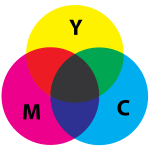

# 图像信息处理

[TOC]

## Chapter 1 基础知识

### 图像格式

- PNG 常用于网络
- BMP：可以压缩（rle），但是一般都不压缩
    - color image: RGB 各一个 Byte，最常见的 BMP 就是 24 位真彩色图
    - greyScale: 8 位 256 个灰度（业界规定， **所有设备的灰度只有 256 级** ）
    - **dpi** = dot per inch （打印的参数）（200 dpi 显示效果足够优秀）
        - 视网膜屏幕：dpi 接近视网膜上的细胞数
- JPEG:
    1. 压缩策略：
        - 根据压缩比要求，从高频到低频逐步削减信息。Different manipulations for *high-frequency signal* and *low-frequency signal*.
        - According to the requirement of compression ratio, remove information from high frequency to low frequency. 
    2. 大幅面高质量打印：国外进口 -> 有研究空间
    3. 缺点：文字等细节容易看出问题的，适合用矢量图
    4. 优点：高频信息占用存储空间大，减少高频信息更容易获得高压缩比；低频信息可以保留物体的基本轮廓和色彩分布，最大限度维持图像质量。适合用于互联网。
- TIFF: 用于 CAD、GIS(geographic information system)，分为 public 和 private （压缩方式或者加密方式），便于公司进行开发
- GIF(graphics interchange format): 使用LZW encoding method

### 有关颜色、成像的生物和物理知识

成像：
- 小孔成像：孔太大，图像模糊；孔太小（光圈(Sperture)太小），进光量不够，产生衍射，且相机抖动对成像效果的影响更大
- 透镜（胶卷相机）：
    - circle of confusion: 未聚焦在像屏上
    - depth of a field（景深）：相机能够清晰拍摄的距离范围
        - 小光圈 -> 大景深 -> 风景照（需要清晰显示远近的信息）
        - 大光圈 -> 小景深 -> 背景虚化
        - 原理：进光少，circle of confusion 小，眼睛无法分辨则不认为是模糊
- **数码相机** ：
    - DSP：处理数字信号，降噪（ *国内核心技术落后* ）
    - 处理过程：

颜色的物理意义：
- 鸡尾酒会问题（图像、声音 etc） [科普](https://zhuanlan.zhihu.com/p/58505511)
- **color vision** : the feeling of human brain when lights of different wavelengths reach retina.
    - 棒状细胞(rod)：数量大，只感光
    - 锥状细胞(cone)：数量少，在光照充足的情况下能感受颜色，有三种，分别对红、绿、蓝光最敏感 -> **三原色理论的生理基础**
    - 色觉因人而异 + **人从对比度感知色彩** （如何让所有人看到相同的颜色 *目前仍未解决* ）
    - 如何产生不同颜色的光：产生不同波长的光波 or 色光按比例混合 [色彩空间基础（这篇还是非常全面的）](https://blog.csdn.net/u010468553/article/details/79614229)

- 紫边现象：胶片相机的边上因为透镜产生色散而导致的模糊
- priority vs sensitivity
    - priority 先 notice 到什么变化 : hue（色调）> saturation（饱和度）> lightness（亮度）
    - sensitivity 能感知多小的变化：亮度最敏感 -> HDR
    - *在视觉传达领域非常重要*


### 颜色空间 (color space)

- **device dependent** model:
    - RGB: additive，色光混合
    - CMY: subtractive，吸收部分色光，反射剩下的色光，多用于打印设备（CMYK 增加黑色）
    - HSV(HIS):
        1. hue（色调）
        1. saturation（饱和度）
        1. value / intensity（光强），和 YUV 里的 Y 是一样的
- **device independent** model:
    - CIE XYZ
    - CIE Lab
    - CIE YUV
- Transformation between color spaces
    - RGB<->CMY: 
    - RGB<->HSV:   
    - RGB<->CIE XYZ: 查表 transformation tables 
    - CIE XYZ<->CIE L*a*b* 
    - RGB<->CIE YUV 


## Chapter 1 存储图像的数据结构 & 图像处理方法

1. 矩阵：例如 multispectral image 多光谱图像
2. 链表：例如 RLE(Run Length Encoding)
    - 行 + (列开头 + 列结尾) + ...

---

1. windows API DIB
    - 逻辑屏幕 vs 物理屏幕
2. VC++: 可以借鉴群文件里的库，自己进行扩充
3. matlab: Image Processing Toolbox
4. PhotoShop
5. GIMP: 开源版本的 PhotoShop
6. 光影魔术手：支持批处理

（操作举例：直方图均衡化）

## Chapter 1 BMP

### BMP 文件结构

> 参考资料：[BMP 文件结构、读取和存储](https://zhuanlan.zhihu.com/p/122959774)

1. 位图文件头 BitMapFileHeader
2. 位图信息头 BitMapInfoHeader
3. 调色板 Palette
4. 实际位图数据 ImageData

#### 位图文件头

重要信息：
- `bfOffBits`: 找到 bitmap 的开头

注意：
- bfTtype 需要注意字节序的问题，最保险的做法是 `bfType = *(unsigned short*)((unsigned char*)"BM")`

```c
struct BITMAPFILEHEADER
{
    unsigned short bfType;        // 指定文件类型，必须是0x424D，即字符串"BM"，也就是说所有.bmp文件的头两个字节都是"BM" (0-1字节)
    unsigned int   bfSize;        // 文件大小,包括这14个字节,以字节为单位(2-5字节)
    unsigned short bfReserved1;   // 保留，必须设置为0 (6-7字节)
    unsigned short bfReserved2;   // 保留，必须设置为0 (8-9字节)
    unsigned int   bfOffBits;     // 从文件头到像素数据的偏移(10-13字节)
    BITMAPFILEHEADER(){}
    BITMAPFILEHEADER(char * buffer){ // 构造函数，传入 BMP 文件的首地址
        this->bfType = *(unsigned short*)(buffer);
        this->bfSize = *(unsigned int*)(buffer+2);
        this->bfReserved1 = *(unsigned short*)(buffer+6);
        this->bfReserved2 = *(unsigned short*)(buffer+8);
        this->bfOffBits = *(unsigned int*)(buffer+10);
    }
}; // 共 14 字节
// WORD == unsigned short == 16bit
// DWORD == unsigned int == 32bit
```

upd. 补充了一个构造函数，修改成 C++ 语法

#### 位图信息头

重要信息：
- `biWidth`: 单位是 **像素**
- `biHeight`: 单位是 **像素**，`biHeight > 0` 表示图像是翻转的（在 bitmap 中依次存储的像素是 **左下到右上** ），`biHeight > 0` 则图像是正的
- `biClrUsed`: 决定了调色板的文件大小， `biClrUsed == 0` 表示调色板上所有的颜色都使用，即 bitmap 中直接存储 RGB

不重要信息：

- `biCompression`: 因为一般的 BMP 都不压缩，所以可以默认这个变量为 0

运算关系：
- `bfSize = bfOffBits + biSizeImage`
- 行字节数 `byteWidth = (biWidth * biBitCount / 8 + 3) / 4 * 4`，**byteWidth 必须是 4 的倍数** ，不够的字节用 `00` 补齐
- `biSizeImage = biHeight * byteWidth`
    - 常见错误：`biSizeImage != biHeight * biWidth * biBitCount`

```c
struct BITMAPINFOHEADER
{
    unsigned int    biSize;          // 此结构体的大小，为40 (14-17字节)
    long            biWidth;         // 图像的宽,单位是像素  (18-21字节)
    long            biHeight;        // 图像的高，单位是像素  (22-25字节)
    unsigned short  biPlanes;        // 表示bmp图片的平面属，显然显示器只有一个平面，所以恒等于1 (26-27字节)
    unsigned short  biBitCount;      // 一像素所占的位数，常用的值为1（黑白二色图）,4（16色图）,8（256色）,24（真彩色图）（新的.bmp格式支持32位色）   (28-29字节)
    unsigned int    biCompression;   // 指定位图是否压缩，有效的值为BI_RGB，BI_RLE8，BI_RLE4，BI_BITFIELDS（都是一些Windows定义好的常量）。我们今后所讨论的只有第一种不压缩的情况，即biCompression为BI_RGB的情况。 (30-33字节)
    unsigned int    biSizeImage;     // 像素数据所占大小 (34-37字节)
    long            biXPelsPerMeter; // 说明水平分辨率，单位是象素/米。一般为0 (38-41字节)
    long            biYPelsPerMeter; // 说明垂直分辨率，单位是象素/米。一般为0 (42-45字节)
    unsigned int    biClrUsed;       // 指定本图象实际用到的颜色数，如果该值为零，则用到的颜色数为2的biBitCount次方，即使用所有调色板项。 (46-49字节)
    unsigned int    biClrImportant;  // 说明对图象显示有重要影响的颜色索引的数目，如果是0，表示都重要。(50-53字节)
    BITMAPINFOHEADER(){}
    BITMAPINFOHEADER(char * buffer){ // 构造函数，传入 BMP 文件的首地址
        this->biSize = *(unsigned int*)(buffer+14);
        this->biWidth = *(long*)(buffer+18);
        this->biHeight = *(long*)(buffer+22);
        this->biPlanes = *(unsigned short*)(buffer+26);
        this->biBitCount = *(unsigned short*)(buffer+28);
        this->biCompression = *(unsigned int*)(buffer+30);
        this->biSizeImage = *(unsigned int*)(buffer+34);
        this->biXPelsPerMeter = *(long*)(buffer+38);
        this->biYPelsPerMeter = *(long*)(buffer+42);
        this->biClrUsed = *(unsigned int*)(buffer+46);
        this->biClrImportant = *(unsigned int*)(buffer+50);
    }
};
// BI_RGB == 0
// 要注意的是：上述公式中的biWidth'必须是4的整倍数（所以不是biWidth，而是biWidth'，表示大于或等于biWidth的，离4最近的整倍数。举个例子，如果biWidth=240，则biWidth'=240；如果biWidth=241，biWidth'=244）如果biCompression为BI_RGB，则该项可能为零
```

upd. 补充了一个构造函数，修改成 C++ 语法

#### 调色板

注意事项：
- 顺序是 **BGR** 而不是 RGB
- `biClrUsed` 决定了调色板的大小，例如灰度图可以有一个大小为 256 的调色板

```c
typedef struct _PIXELINFO {
    unsigned char rgbBlue;   //该颜色的蓝色分量  (值范围为0-255)
    unsigned char rgbGreen;  //该颜色的绿色分量  (值范围为0-255)
    unsigned char rgbRed;    //该颜色的红色分量  (值范围为0-255)
    unsigned char rgbReserved;// 保留，必须为0
} PIXELINFO;
// 调色板实际上是一个数组，共有 biClrUsed 个元素,数组中每个元素的类型是一个RGBQUAD结构，占4个字节
// 有些位图，如真彩色图，是不需要调色板的
```

#### 实际位图数据

对于用到调色板的位图，图象数据就是该像素颜在调色板中的索引值。对于真彩色图，图象数据就是实际的R,G,B值（**顺序是 BGR**）。

要注意两点：
1. 每一行的字节数必须是 **4的整倍数**，如果不是，则需要用 0 补齐。
2. 一般来说（biHeight > 0 时），.BMP文件的数据从下到上，从左到右的。也就是说，从文件中最先读到的是图象最下面一行的左边第一个像素，然后是左边第二个像素…接下来是倒数第二行左边第一个像素，左边第二个像素…依次类推，最后得到的是最上面一行的最右一个像素。

#### BMP 类

```c
struct BMP{
    BITMAPFILEHEADER fileHeader;
    BITMAPINFOHEADER infoHeader;
    PIXELINFO * pixelInfo;
    char * imageData;
    char * buffer; // 动态分配空间存储二进制的 BMP 文件，一个 char 存一个 Byte
};
```


### 读取和存储 BMP

#### 二进制文件读写：fopen, fread & fwrite + Malloc

> 参考资料：
> 1. [fopen](https://cplusplus.com/reference/cstdio/fopen/)
> 2. [fread](https://cplusplus.com/reference/cstdio/fread/)
> 3. [fwrite](https://cplusplus.com/reference/cstdio/fwrite/)
> 4. [C dynamic memory allocation](https://www.geeksforgeeks.org/dynamic-memory-allocation-in-c-using-malloc-calloc-free-and-realloc/)

1. fopen
    - 常用格式：r, w, a, r+, w+, a+
    - 如果要编辑 **二进制文件**，必须要加上 **b** ，例如 rb
2. fread
    - 语法：`size_t fread ( void * ptr, size_t size, size_t count, FILE * stream );`
3. fwrite
    - 语法：`size_t fwrite ( const void * ptr, size_t size, size_t count, FILE * stream );`

可复用的二进制文件读写模板：

```cpp
#include<stdio.h>
#include<stdlib.h>

int readBitFile(char * & buffer, char * fileName);
int writeBitFile(char * buffer, int bufferSize, char * fileName);
int freeBitFile(char * buffer);

// 读入二进制文件
int readBitFile(char * & buffer, char * fileName){
    // open file & check
    FILE * file;
    int bufferSize;
    file = fopen(fileName, "rb");
    if (file == NULL){fputs("File Error!", stderr); exit(1);}

    // obtain file size
    fseek (file , 0 , SEEK_END); // 找到结尾
    bufferSize = ftell (file);
    rewind (file); // 回到文件开头

    // allocate memory to contain the whole file:
    buffer = (char*) malloc (sizeof(char)*bufferSize);
    if (buffer == NULL) {fputs ("Memory error",stderr); exit (2);}

    // copy the file into the buffer:
    size_t result = fread (buffer, 1, bufferSize, file);
    if (result != bufferSize) {fputs ("Reading error",stderr); exit (3);}

    // terminate
    fclose (file);
    return 0;
}

// 写入二进制文件
int writeBitFile(char * buffer, int bufferSize, char * fileName){
  FILE * file;
  file = fopen (fileName, "wb");
  size_t result = fwrite (buffer , sizeof(char), bufferSize, file);
  if (result != bufferSize) {fputs ("Writing error",stderr); exit(1);}
  fclose (file);
  return 0;
}

// 释放二进制文件内存
int freeBitFile(char * buffer){
    free (buffer);
    return 0;
}
```

#### BMP 文件读写

> 参考资料：
> 1. [memcpy](https://cplusplus.com/reference/cstring/memcpy/)

1. memcpy
    - 语法：`void * memcpy ( void * destination, const void * source, size_t num );`
    - num 的单位是 Byte

可复用的 BMP 文件信息获取模板：

```cpp
#include<stdio.h>
#include<stdlib.h>

int getBmpFile(BMP & bmp);

int getBmpFile(BMP & bmp){
    // get bitmap info
    bmp.fileHeader = BITMAPFILEHEADER(bmp.buffer);
    bmp.infoHeader = BITMAPINFOHEADER(bmp.buffer);
    if ((bmp.infoHeader).biClrUsed == 0) bmp.pixelInfo = NULL;
    else bmp.pixelInfo = (PIXELINFO*)(bmp.buffer + sizeof(bmp.fileHeader) + sizeof(bmp.infoHeader));
    bmp.imageData = bmp.buffer + (bmp.fileHeader).bfOffBits;

    // check validity
    char BM[2] = {'B', 'M'};
    if (bmp.fileHeader.bfType != *(unsigned short*)(BM)){fputs ("Format not BMP",stderr); exit(1);}
    return 0;
}
```

### 24 位 RGB 位图转换为 YUV

1. 遍历所有像素
2. 公式计算 Y，U, V (double or int)
3. 截断函数 clip Y
4. 新建 BMP 实例
5. 写入 BMP 实例

附加步骤：

1. 调整亮度 Y 并重新计算得到一个 RGB 图

### HW1 中遇到的问题

1. 参数：指针的引用
2. bfType：[低端字节序和高端字节序](https://www.cnblogs.com/Philip-Tell-Truth/articles/5173941.html#:~:text=%E5%B0%8F%E7%AB%AF%E5%AD%97%E8%8A%82%E5%BA%8F%E6%8C%87%E4%BD%8E%E5%AD%97%E8%8A%82%E6%95%B0%E6%8D%AE%E5%AD%98%E6%94%BE%E5%9C%A8%E5%86%85%E5%AD%98%E4%BD%8E%E5%9C%B0%E5%9D%80%E5%A4%84%EF%BC%8C%E9%AB%98%E5%AD%97%E8%8A%82%E6%95%B0%E6%8D%AE%E5%AD%98%E6%94%BE%E5%9C%A8%E5%86%85%E5%AD%98%E9%AB%98%E5%9C%B0%E5%9D%80%E5%A4%84%EF%BC%9B%E5%A4%A7%E7%AB%AF%E5%AD%97%E8%8A%82%E5%BA%8F%E6%98%AF%E9%AB%98%E5%AD%97%E8%8A%82%E6%95%B0%E6%8D%AE%E5%AD%98%E6%94%BE%E5%9C%A8%E4%BD%8E%E5%9C%B0%E5%9D%80%E5%A4%84%EF%BC%8C%E4%BD%8E%E5%AD%97%E8%8A%82%E6%95%B0%E6%8D%AE%E5%AD%98%E6%94%BE%E5%9C%A8%E9%AB%98%E5%9C%B0%E5%9D%80%E5%A4%84%E3%80%82,%E5%9F%BA%E4%BA%8EX86%E5%B9%B3%E5%8F%B0%E7%9A%84PC%E6%9C%BA%E6%98%AF%E5%B0%8F%E7%AB%AF%E5%AD%97%E8%8A%82%E5%BA%8F%E7%9A%84%EF%BC%8C%E8%80%8C%E6%9C%89%E7%9A%84%E5%B5%8C%E5%85%A5%E5%BC%8F%E5%B9%B3%E5%8F%B0%E5%88%99%E6%98%AF%E5%A4%A7%E7%AB%AF%E5%AD%97%E8%8A%82%E5%BA%8F%E7%9A%84%E3%80%82)
3. struct BITMAPFILEHEADER 的大小是 16 而不是 14
4. sizeof(指针) 返回的是指针的大小而不是数组的大小
5. 指针类型转换的语法
7. C++ 结构体内声明函数好像不能做，或许转向使用 class 封装会更好一点
8. 重载 BMP 类的运算符或许会更好一点,[struct 的构造函数](https://zhuanlan.zhihu.com/p/392077524)
9. RGB (0, 0, 0) 是黑，(255, 255, 255) 是白
10. `(i/3) / (int)bmp.infoHeader.biWidth` 注意类型转换，不然当成 unsigned int 计算，unsigned int 强转 double 会出问题，首位会被当成符号位，char 直接参与计算会被当成带符号整数,
11. 各种数据类型的内存大小，[struct 的内存分配](https://blog.csdn.net/weixin_41453492/article/details/101318522)


## Chapter 2 二值图像和形态学操作(Binary Image and Morphological Operation)

### 结构定义

优点：只留下需要的信息，且在某些需要打印的场景更为低廉

### Binarization

获取：设置阈值 threshold
- 好的阈值：minimize 前景（背景）内部的方差 = maximize 两部分之间的差异
- 大津算法：枚举所有的 threshold，计算并求最小值
- 优化：全局大津法导致局部阴影无法识别 -> 扫描窗口，在每个 local window 中做大津法
- 再优化：去噪声？形状简化？形态学操作

应用：
1. 绿幕
2. 检测水淹的区域
3. 人脸识别（基于颜色，容易受外部光照的影响）

### dilation（膨胀）

A: binary image
B: structure element （结构元的选取非常灵活）

符号：圆圈里一个加号

实现： 若 A 和 B 有交，则把 B 的坐标原点放到图像中。

效果：
1. 补洞
2. 扩展

### erosion （腐蚀）

符号：圆圈里一个减号

实现：B 完全包含于 A 的前景中，则把 B 的坐标原点放到图像中。（考试中可以列表来判断是否包含）

padding：
1. 0 padding
2. 复制第一行第一列做 padding

效果：
1. 去小噪点
2. 去边界

### erosion & dilation

结合：erosion + dilation -> 去噪点 + 恢复边界大小

对偶性(duality)：
1. $(A-B)^c=A^c+B$
2. $(A+B)^c=A^c-B$

应用：
1. 提取边界 ($A-(A-B)$减去腐蚀后的部分)
2. 补洞
3. structure extraction

### opening

开操作 = 先腐蚀，再膨胀

符号：空心圆圈

效果：去掉小块，棱角平滑，并且保持整体面积大致不变

### closing

闭操作 = 先膨胀，再腐蚀

符号：小黑点

效果：补小洞和断开的边界，并且保持整体面积大致不变

---

应用：指纹识别 -> 先做开操作，再做闭操作


### HW2 中遇到的问题

1. padding
2. 大津法分块过于小会导致失去全局性质，过大可能导致有部分特点被光线等外部调价掩盖
    - 解决方案：local 局部大津法，对每一个点单独求一个

#### 用 photoshop 获取 24 位 BMP 图像素材

1. 图像 -> 模式 -> 选择格式和位数
2. 文件 -> 存储为 -> 在窗口中选择格式和位深度

## Chapter 3 灰度图像操作

### visibility & enhancement

1. greyScale perception: 256 级已经超过了人眼可以分辨的范围
1. Weber's Law:
    - 肉眼可见的灰度值差 visible threshold $\frac{\Delta I}{I}\approx 1...2\%$ 
    - 定理的定义范围有限，在亮度过大或者过小时不成立
    - 显示设备想要至少呈现出人眼能区分的 256 级灰度，要求 
    
    $$\frac{I_{max}}{I_{min}}=(1+K_{weber})^{255}\approx13...156$$
    
    对比度 $\frac{I_{max}}{I_{min}}$ 值越大，能显示的灰度范围越大，说明显示器效果越好
    - Fechner's Law: 人眼的感知能力正比于 $\log(I)$
1. $\gamma$ 校正：
    - 最初用于 CRT 显示器，后用于图像后期处理
    - $$I=U^{\gamma},U=I^{\frac{1}{\gamma}}$$ $\gamma$ 越大, 对比度越高
    - 曝光值 E
    - 现实世界：HDR(high dynamic range) 亮度范围 10^8 远超可以显示的亮度值 *（，如果不进行处理有一部分会溢出可显示范围无法显示出差异）* -> Dynamic range compression
1. **色调映射 (tone mapping)** -> visibility enhancement（解决过曝和曝光不足，从而可以看清更多部分）
1. 可视增强 - $\log$ 操作： $L_d = \frac{\log(\beta L_w+1)}{\log(\beta L_{max}+1)}$
    - $L_w$ 是实际亮度， $L_d$ 是显示亮度，$L_d$ 分布在 $[0,1]$ 上， $\beta$ 是系数，$\beta$ 越小，图像对比度越低，整体亮度越高；反之对比度升高但是增亮效果削弱
    - 缺陷：对比度降低（可以再使用直方图均衡化增加对比度）


### histogram 直方图 & histogram equalization 直方图均衡化

1. 直方图：
    - 灰度图直方图：直方图是一种统计图，表示每一个灰度级中像素数占总像素数的比例
    - 彩色图直方图：三通道各有一个直方图
        - 用例：以图搜图（仅根据颜色分布）
        - 用例：照片拼照片
    - 缺陷：忽略了结构信息（斑马皮肤和国际象棋棋盘）
    - 应用：图像压缩、增强、分割
1. 直方图均衡化：
    - 效果：增加对比度，使图像更清晰，颜色更鲜艳。比如说对于过曝和曝光不足的照片，灰度动态范围较小，灰度值集中，照片会看起来灰蒙蒙的，适合用直方图均衡化处理。
    - 连续：
        - 原始图像直方图 $r-P(r)$，满足 $\int_0^1 P(r)=1$
        - 求一个映射 $s = T(r)$ 使得 $\forall s, P(s) = 1$
        - $\int_{0}^{r}P(r)dr = \int_{0}^{s}P(s)ds = \int_{0}^{s}1\cdot ds=s$
        - 公式：$s=\int_{0}^{r}P(r)dr$
    - 离散：
        - $s_k = \sum_{i=0}^k P(r_k)$，原来灰度值为 $r_k$ 的像素点被重新分配灰度值 $s_k$
        - 递推：$s_k = s_{k-1} + P(r_k)$
        - 近似：将 $s_k$ 近似为数值最相近的灰度级 $r_l$
    - 缺陷：在连续条件下能做到完全均衡，但在离散条件下无法做到
    - 局部直方图均衡化
1. 附加操作：
    1. 直方图匹配（以图搜图）：
        - 连续：做两次直方图均衡化 $s_k = T_1(r_{1k}) = T_2(r_{2k})$，则 $r_{2k} = T2^{-1}\cdot T1(r_{1k})$
        - 离散：根据两张对应表建立新的对应表
    1. histogram transformation：手动更改 $s=T(r)$ 函数调节亮度或对比度（在 ps 里就有这个图）
        - 部分亮度对比度增强：分段函数
    1. 颜色量化：$r-s$ 图变成阶梯函数，减小图像存储空间


## Chapter 4&5 Geometric Transformation & Morphing

1. 简单变换(simple transformation or warp)
    1. 平移：

        $$
        \begin{align*}
        \begin{bmatrix}
        x'\\
        y'\\
        1
        \end{bmatrix}&=
        \begin{bmatrix}
        1 & 0 & \Delta x\\
        0 & 1 & \Delta y\\
        0 & 0 & 1
        \end{bmatrix}
        \begin{bmatrix}
        x\\
        y\\
        1
        \end{bmatrix}\\\\
        \begin{bmatrix}
        x\\
        y\\
        1
        \end{bmatrix}&=
        \begin{bmatrix}
        1 & 0 & -\Delta x\\
        0 & 1 & -\Delta y\\
        0 & 0 & 1
        \end{bmatrix}
        \begin{bmatrix}
        x'\\
        y'\\
        1
        \end{bmatrix}
        \end{align*}
        $$

    2. 镜像：

        $$
        \begin{align*}
        \begin{bmatrix}
        x'\\
        y'\\
        1
        \end{bmatrix}&=
        \begin{bmatrix}
        s_x & 0 & 0\\
        0 & s_y & \Delta y\\
        0 & 0 & 1
        \end{bmatrix}
        \begin{bmatrix}
        x\\
        y\\
        1
        \end{bmatrix}\\\\
        \begin{bmatrix}
        x\\
        y\\
        1
        \end{bmatrix}&=
        \begin{bmatrix}
        s_x & 0 & 0\\
        0 & s_y & \Delta y\\
        0 & 0 & 1
        \end{bmatrix}
        \begin{bmatrix}
        x'\\
        y'\\
        1
        \end{bmatrix}
        \end{align*}
        $$

        - $s_x=1,s_y=-1$ 关于 x 轴对称，$s_x=-1,s_y=1$ 关于 y 轴对称

    3. 旋转：

        $$
        \begin{align*}
        \begin{bmatrix}
        x'\\
        y'\\
        1
        \end{bmatrix}&=
        \begin{bmatrix}
        \cos\theta & -\sin\theta & \Delta x\\
        \sin\theta & \cos\theta & \Delta y\\
        0 & 0 & 1
        \end{bmatrix}
        \begin{bmatrix}
        x\\
        y\\
        1
        \end{bmatrix}\\\\
        \begin{bmatrix}
        x\\
        y\\
        1
        \end{bmatrix}&=
        \begin{bmatrix}
        \cos\theta & \sin\theta & -\cos\theta\Delta x-\sin\theta\Delta y\\
        -\sin\theta & \cos\theta & \sin\theta\Delta x-\cos\theta\Delta y\\
        0 & 0 & 1
        \end{bmatrix}
        \begin{bmatrix}
        x'\\
        y'\\
        1
        \end{bmatrix}
        \end{align*}
        $$

        - 顺时针旋转
        - 需要移动到画布中间：$\Delta x, \Delta y$ 取原图 4 个顶点在新图中的坐标最小值的相反数
        - 需要插值
    4. 缩放(scale): 缩小 = shrink = down-sampling
        - 缩小：需要取样，放大：需要插值

        $$
        \begin{align*}
        \begin{bmatrix}
        x'\\
        y'\\
        1
        \end{bmatrix}=
        \begin{bmatrix}
        k_x & 0 & 0\\
        0 & k_y & 0\\
        0 & 0 & 1
        \end{bmatrix}
        \begin{bmatrix}
        x\\
        y\\
        1
        \end{bmatrix}\\\\
        \begin{bmatrix}
        x\\
        y\\
        1
        \end{bmatrix}=
        \begin{bmatrix}
        \frac{1}{k_x} & 0 & 0\\
        0 & \frac{1}{k_y} & 0\\
        0 & 0 & 1
        \end{bmatrix}
        \begin{bmatrix}
        x'\\
        y'\\
        1
        \end{bmatrix}
        \end{align*}
        $$

    5. 错切(shear)

        $$
        \begin{bmatrix}
        x'\\
        y'\\
        1
        \end{bmatrix}=
        \begin{bmatrix}
        1 & d_x & 0\\
        0 & 1 & 0\\
        0 & 0 & 1
        \end{bmatrix}
        \begin{bmatrix}
        x\\
        y\\
        1
        \end{bmatrix}
        $$

        $d_x$ 是常数，对 y 做错切同理。
    6. 组合：

        $$
        \begin{bmatrix}
        x'\\
        y'\\
        1
        \end{bmatrix}=
        \begin{bmatrix}
        a & b & c\\
        d & e & f\\
        0 & 0 & 1
        \end{bmatrix}
        \begin{bmatrix}
        x\\
        y\\
        1
        \end{bmatrix}
        $$

2. 插值(interpolation)
    1. nearest neighbor：通过逆变换把新图坐标转换为原图坐标（实数），在原图像上取最近邻
    2. linear interpolation: 
        - 1D
        - 2D: bilinear equation

            $$
            \begin{align*}
            g(x,y)&=ax+by+cxy+d\\
            &=\frac{B-A}{x_0}x+\frac{C-A}{y_0}y+\frac{(A+D)-(B+C)}{x_0y_0}xy+A
            \end{align*}
            $$

            其中 $A,B,C,D$ 分别是 $(0,0),(x_0,0),(0,y_0),(x_0,y_0)$ 处的函数值
    3. bicubic(双三次)
    4. RBF：
3. morph：同时改变像素位置和值
    - 分类：基于像素、线段、特征点
    - 应用：表情映射（可用机器学习实现），特征值分解

## Chapter 6&7 Convolution & Filtering

1. 1-D convolution:

    $$
    \begin{align*}
    g(x)=f(x)*h(x)=\int_{-\infty}^{+\infty}f(t)h(x-t)dt\\
    g(x)=f(x)*h(x)=\frac{1}{M}\sum_{t=0}^{M-1}f(t)h(x-t)
    \end{align*}
    $$

    - 交换律: $f*g=g*f$
    - 结合律: $(f*g)*h=f*(g*h)$
    - 分配律: $f*(g+h)=f*g+f*h$
2. Filtering:
    - 卷积核称为 filter，这里二维卷积相当于加权求和

    $$g(x,y)=\sum_{i=-n}^n\sum_{j=-m}^m kernel(i,j)f(x+i,y+j)$$

    1. low-pass filter（低通滤波）,i.e. filtering for smoothing（平滑滤波）
        1. linear smoothing filter, i.e. mean filter（均值滤波）, box filter
            - 卷积核 (size of *mask* ) 越大，模糊得越厉害
            - 手机相机的“大光圈”模式：判断景深并用相应大小的卷积核进行平滑滤波

        $$
        \begin{aligned}
            Kernel_{mean} = \frac{1}{9}
            \begin{bmatrix}
            1 & 1 & 1 \\
            1 & 1 & 1 \\
            1 & 1 & 1
            \end{bmatrix}\\
            Kernel_{weighted\_mean} = \frac{1}{16}
            \begin{bmatrix}
            1 & 2 & 1 \\
            2 & 4 & 2 \\
            1 & 2 & 1
            \end{bmatrix}\\
        \end{aligned}
        $$

        2. statistical sorting filter（统计排序滤波）
            - e.g. median filter（中值滤波）：取 mask 中的中位数作为像素值

        3. Gaussian filter: 用正态分布函数来做代权平均

        $$
        GB[I]_p=\frac{1}{W_p}\sum_{q\in S}G_{\sigma}(||p-q||)I_q
        $$

    2. sharpening filter（锐化滤波）
        - 效果：滤波得到的是边界图像（像素值变化越剧烈值越大），将原图和滤波后的图像融合（fusion，像素值相加）得到边缘增强的图像。
        - 数学基础：
            1. discrete differential:

            $$
            \frac{\partial f}{\partial x}=f(x+1)-f(x)
            $$

            2. discrete second order idfferential:

            $$
            \frac{\partial^2 f}{\partial x^2}=f(x+1)+f(x-1)-2f(x)
            $$

            3. gradient & nabla operator:

            $$
            \begin{aligned}
                \nabla f&=
                \begin{bmatrix}
                \frac{\partial f}{\partial x}\\
                \frac{\partial f}{\partial y}
                \end{bmatrix}\\
                |\nabla f|&\approx|\frac{\partial f}{\partial x}|+|\frac{\partial f}{\partial y}|
            \end{aligned}
            $$

            4. Laplacian operator: 其中平方的含义类似向量点乘

            $$
            \begin{aligned}
                \Delta f&=\nabla^2 f\\
                &=\frac{\partial^2 f}{\partial x^2}+\frac{\partial^2 f}{\partial y^2}\\
                &=f(x+1,y)+f(x-1,y)+f(x,y+1)+f(x,y-1)-4f(x,y)
            \end{aligned}
            $$
            
        - 常见锐化滤波
            1. gradient based method: 
                - 其中 $z_5$ 是中心元素，$z'_5$ 是用梯度滤波得到的像素值，$z''_5$ 是用 Robert Cross Gradient 得到的像素值。

            $$
            \begin{aligned}
                Window &=
                \begin{bmatrix}
                z_1 & z_2 & z_3 \\
                z_4 & z_5 & z_6 \\
                z_7 & z_8 & z_9
                \end{bmatrix}\\
                z'_5&=|z_6-z_5|+|z_8-z_5|\\
                z''_5&=|z_9-z_5|+|z_8-z_6|
            \end{aligned}
            $$

            2. Laplacian filter:
                - 梯度滤波容易产生较粗的边缘，使用二阶偏导的拉普拉斯滤避免了这一问题，像素均匀变化的区域不会被增强。但是容易受噪点的影响，所以可以用 *高斯拉普拉斯变换* 改进。
                - 其中 c 是衰减参数，正负性与原像素的像素值相同。可以发现，如果原像素值是正的，且是一个极大值点，则拉普拉斯算子得到的结果是负的，想要增强这个边缘像素的话就必须减掉这个正的值。极小值点同理。

            $$
            \begin{aligned}
                Kernel_{laplacian} &=
                \begin{bmatrix}
                0 & 1 & 0 \\
                1 & -4 & 1 \\
                0 & 1 & 0
                \end{bmatrix}\\
                Kernel_{extended} &=
                \begin{bmatrix}
                1 & 1 & 1 \\
                1 & -8 & 1 \\
                1 & 1 & 1
                \end{bmatrix}\\
                g(x,y)&=f(x,y)-c\Delta f(x,y)
            \end{aligned}
            $$

    3. bilateral filter（双边滤波）
        - 基本目标：smoothing
        - 效果：
            1. 去噪
            2. 基于双边滤波的 tone mapping：可以看 Durand 的论文，感觉这个方法比常规可视增强的好处在于双边滤波保边效果好，。大致过程应该如下：
                1. 原图分出亮度和色度
                2. 亮度用双边滤波分出低频和高频
                3. 对低频部分做可视增强
                4. 把三部分合并
            3. relighting
            4. 其他：磨皮美颜、改变图片风格（漫画滤镜）
        - 原理： **同时考虑距离和像素值** ——距离越近影响越大，像素值越接近影响越大。 
        - 参数设置：
            1. 方差越大，说明权重差别越小，因此表示不强调这一因素的影响，反之，则表示更强调这一因素导致的权重的不均衡。$\sigma_s$ 越大图像越模糊，$\sigma_r$ 越小，图像保留越多纹理。极端情况，如果 $\sigma_s$ 无穷大，相当于值域滤波；$\sigma_r$ 无穷大，相当于空域高斯滤波。
            2. $\sigma_s$ 可以设成对角线的 2%，单位像素； $\sigma_r$ 可以设置成窗口中所有像素梯度的平均值
        - 公式：其中 $G_{\sigma}$ 是高斯（正态）分布函数

        $$
        \begin{aligned}
        BF[I]_p&=\frac{1}{W_p}\sum_{q\in S}G_{\sigma_s}(||p-q||)G_{\sigma_r}(|I_p-I_q|)I_q\\
        BF[RGB]_p&=\frac{1}{W_p}\sum_{q\in S}G_{\sigma_s}(||p-q||)G_{\sigma_r}(||\mathbf{RGB_p}-\mathbf{RGB_q}||)\mathbf{RGB_q}
        \end{aligned}
        $$

        - 快速近似：[参考博客](https://zhuanlan.zhihu.com/p/272236618)
        - 缺点：容易产生梯度逆转
    4. guided filter：[参考博客](https://zhuanlan.zhihu.com/p/161666126)
        - 功能：去雾、抠图
        - 优势：在边界上比双边滤波效果更好，可以有效防止梯度逆转（光晕）
        - 缺陷：在边界的选择上不能永远符合人的直觉
    5. sparse norm filter
        - L2 norm: 均值滤波

        $$I_i^{new} = \min_{I}\sum_{j\in N_i}(I-I_j)^2$$

        - L1 norm: 中值滤波

        $$I_i^{new} = \min_{I}\sum_{j\in N_i}(I-I_j)$$

        - 推广：在 p<1(0.1, 0.2, 0.3) 时具有防止梯度逆转的功效

        $$I_i^{new} = \min_{I}\sum_{j\in N_i}|I-I_j|^p$$

        - 应用：
            1. 防梯度逆转
            2. 去除异常值(outlier)
            3. HDR compression: 可视增强
            4. 去运动模糊(motion deblur)：前提是先预估一个相机抖动路径
            5. 智能上色：给定灰度图和在每一块上涂两笔颜色。需要多次迭代
            6. 图像融合：基本同上


## Chapter 8 Fourier Transformation

1. 傅里叶级数

$$
\begin{equation*} \begin{split} f(t)=\frac{a_{0}}{2}+\sum_{n=1}^{\infty}{[a_{n}cos(n\omega t)+b_{n}sin(n\omega t)]} \end{split} \end{equation*}
$$

$$
 \begin{align*} &a_{n}=\frac{2}{T}\int_{t_{0}}^{t_{0}+T}f(t)cos(n\omega t)dt\\ &b_{n}=\frac{2}{T}\int_{t_{0}}^{t_{0}+T}f(t)sin(n\omega t)dt\\ \end{align*}
$$

2. 傅里叶变换 [看这个博客学吧](https://www.cnblogs.com/h2zZhou/p/8405717.html)
    1. 应用：
        1. 生物识别：例如眼球识别
        2. 3D 显示中的反走样(anti-aliasing)：近处清晰图像和远处模糊图像之间的过渡
        3. 图像压缩 or 去噪点：去除高频部分
    2. 数学基础：
        1. 复数
            - 定义：magnitude, phase & 
            - 计算性质：相加，相乘
        2. 欧拉方程

        $$
        
        $$

    3. 频域图：横坐标是频率，纵坐标是相位，灰度值越大表示该频率和相位的振幅
    4. 公式：傅里叶变换和逆变换

    $$
    \begin{equation*} F(\omega)=\int_{-\infty}^{\infty} f(x) e^{-i \omega x} d x \end{equation*} \\
    \begin{equation*} f(x)=\frac{1}{2 \pi}\int_{-\infty}^{\infty} F(\omega) e^{i \omega x} d \omega \end{equation*}
    $$

    5. 推广：2-D 傅里叶变换

3. 快速傅里叶变换(FFT)
    1. DFT
    2. 2-D DFT
    2. 2-D DFT 的可视化：magnitude + phase，其中相位对于重建画面更重要

（待办：FT 和 FFT 的推导和应用再看一遍）

## Chapter 9 Image Feature 图像特征

1. 应用：
    1. 图像匹配
    2. 全景照片：图像拼接 + 亮度调节
        - 进阶：对角度不同、光照不同的图片进行拼接
    3. 火星车动态寻路：地面特征的匹配
2. 技术：
    1. feature detecting: 检测特征点
    2. Scale Invariant Feature Transform(SIFT)：旋转、缩放、光照不变性
3. 找特征点的方法：Harris Corner Detector
    - [这个博客里抄公式](https://zhuanlan.zhihu.com/p/129882379)
    - [这个博客看推导](https://www.jianshu.com/p/133ee1dde482)
    - Harris Operator：简化方法
    - Properties：
        1. 旋转不变性：用长轴短轴确定方向
        2. 光照不变性：因为取的是极值点，二阶导受原函数放缩的影响很小
        3. **对于图像尺度非常敏感**
    - 尺度敏感的解决方法
        1. Harris-Laplacian：先进行降采样获得多个尺度的图像，对每个点做多尺度的角点检测，如果这个点在某些尺度上不是角点，则舍去。对于留下来的点，用 Laplace 算子求出角点特征最明显的尺度。
        2. SIFT(scale invariant feature transform)：Difference of Gaussian
            - Orientation：给每个特征点一个代表其方向和像素值变化程度的向量，用于判断旋转和光照
                - 对角点求特征方向：求偏导
                - 求一块像素的方向：投票法。所有像素点的特征方向做直方图选最大的。
                - 也可以把一个 patch 分割成小块，每个小块求特征向量，以使特征维度更多，表达更准确。
            - SIFT 应用：词袋模型(bag of visual word)，一个 SIFT 特征表示一个含义。
            - 缺点：耗时长，对非刚性物体效果差（如动物）
4. SURF：优化了计算速度
    1. 算法步骤：
        1. 计算积分图（二维前缀和）
        2. 分割成 4 * 4 的子窗口，求四个类 Haar wavelet feature（相邻的上下左右窗口进行加加减减），一个子窗口有 16 * 4 个特征
        3. 变换尺度，重复计算，得到尺度方向上离散的特征值，可以用插值(interpolation)方法得到中间值。
        4. 匹配加速：SURF 特征可以用正负号进行初步判断
    2. 优点：更快，耐噪声
    3. 应用：图像拼接——选择特征点，提取特征，匹配（至少六个点，得到图像变换矩阵），旋转缩放拼接（RANSAC），拼接（Image Blending）
5. RANSAC(random sample consensus)：解决离群点问题
    1. 算法流程：
        1. 随机选点算 transformation 矩阵（回归出一个函数）
        2. 用结果矩阵检查有多少 inlier（在阈值之内） 和 outlier
        3. 用 inlier 重新回归出转移矩阵，迭代到符合要求。
    2. 优缺点：通用，容易实现；实际情况下离群点多导致迭代次数巨大（改进：霍夫变换，voting strategy）
        - 点数越多迭代次数越多，最优结果离群点越多迭代次数越多（不容易收敛）
6. Image Blending：
    1. Pyramid creation：先通过高斯滤波得到一系列图像（高通到低通），相邻相减（拉普拉斯算子）得到某些频率上的图像。不断迭代。

（待办：抄公式，看哈里斯检测的公式推导）


## 期末复习

1. 考察内容重点
    1. 算法实现：卷积操作、二值图像、灰度图像
    2. 易于分点作答的理论知识点：成像原理
2. 考前回看
    1. 数字相机成像原理 
    2. 景深的定义：相机能够清晰拍摄的距离范围
        - 小光圈 -> 大景深 -> 风景照（需要清晰显示远近的信息）
        - 大光圈 -> 小景深 -> 背景虚化
        - 其他：镜头焦距越长，景深越小；焦距越短，景深越大。拍摄距离距离越远，景深越大；距离越近，景深越小。
    3. CIE RGB 色感应函数
    4. 人眼感应颜色变化的优先级、敏感程度
        - 优先程度：三者变化幅度相同的情况下，人们往往会注意到色调（Hue, H）的变化，然后是饱和度（Saturation, S），然后是亮度（Value, V）。
        - 敏感度：人眼对于亮度的变化最为敏感，能分辨更微小的亮度变化。恰好与人眼的高动态能力相匹配。
    5. 颜色系统：举例、是否设备相关、应用
        - RGB 加色
            
        - CMY 减色, CMYK(K 代表黑色，用来省墨水) 
            
        - HSV：设备相关，
            1. hue（色调）
            2. saturation（饱和度）
            3. value / intensity（光强），和 YUV 里的 Y 是一样的
        - YUV：亮度，红色色差，蓝色色差（色度）
        - CIE XYZ, CIE Lab 设备无关（统计人的感受得到）
    6. 图像编码
        - JPG：
            1. 压缩策略：根据压缩比要求，从高频到低频逐步削减信息。
            2. 缺点：文字等细节容易看出问题的，适合用矢量图
            3. 优点：高频信息占用存储空间大，减少高频信息更容易获得高压缩比；低频信息可以保留物体的基本轮廓和色彩分布，最大限度维持图像质量。适合用于互联网。
        - BMP 的结构：
            1. 不同的 biBitCount 代表什么图片？1 二值图像，8 灰度图，16 伪彩色，24 真彩色，32 带透明度的真彩色
            2. 每一行的字节数必须是 **4的整倍数**，如果不是，则需要用 0 补齐。
            3. 一般来说（biHeight > 0 时），.BMP文件的数据从下到上，从左到右的。也就是说，从文件中最先读到的是图象最下面一行的左边第一个像素，然后是左边第二个像素…接下来是倒数第二行左边第一个像素，左边第二个像素…依次类推，最后得到的是最上面一行的最右一个像素。
            4. 像素值存储顺序：BGR
        - RLE(Run Length Encoding, 行程编码): 线性存储图像 
        - 无压缩、有损压缩、无损压缩
    7. 二值图像：优缺点分点作答、全局大津算法、局部化大津算法
        - 优点：只留下需要的信息，且在某些需要打印的场景更为低廉
        - 大津算法的实现步骤：枚举 threshold 计算 
    8. 形态学操作：膨胀、腐蚀、开运算（先腐蚀再膨胀，去小噪点，保持原有大小）、闭运算（先膨胀再腐蚀，去小缺口，保持原有大小）
        - 掌握：物理意义、算法实现
        - 例如膨胀的物理意义：扩大图片，填充小空缺
    9. 可视增强
        1. Weber's Law:
            - 肉眼可见的灰度值差 visible threshold $\frac{\Delta I}{I}\approx 1...2\%$ 
            - 定理的定义范围有限，在亮度过大或者过小时不成立
            - 显示设备想要至少呈现出人眼能区分的 256 级灰度，要求 
            
            $$\frac{I_{max}}{I_{min}}=(1+K_{weber})^{255}\approx13...156$$
            
            对比度 $\frac{I_{max}}{I_{min}}$ 值越大，能显示的灰度范围越大，说明显示器效果越好
        1. 可视增强 - $\log$ 操作： $L_d = \frac{\log(\beta L_w+1)}{\log(\beta L_{max}+1)}$
            - $L_w$ 是实际亮度， $L_d$ 是显示亮度，$L_d$ 分布在 $[0,1]$ 上， $\beta$ 是系数，$\beta$ 越小，图像对比度越低，整体亮度越高；反之对比度升高但是增亮效果削弱
            - 缺陷：对比度降低（可以再使用直方图均衡化增加对比度）
    10. 直方图、直方图均衡化（算法描述、会运算）、直方图拟合
        - 直方图均衡化：
            - 效果：增加对比度，使图像更清晰，颜色更鲜艳。比如说对于过曝和曝光不足的照片，灰度动态范围较小，灰度值集中，照片会看起来灰蒙蒙的，适合用直方图均衡化处理。
            - 连续：
                - 原始图像直方图 $r-P(r)$，满足 $\int_0^1 P(r)=1$
                - 求一个映射 $s = T(r)$ 使得 $\forall s, P(s) = 1$
                - $\int_{0}^{r}P(r)dr = \int_{0}^{s}P(s)ds = \int_{0}^{s}1\cdot ds=s$
                - 公式：$s=\int_{0}^{r}P(r)dr$
            - 离散：
                - $s_k = \sum_{i=0}^k P(r_k)$，原来灰度值为 $r_k$ 的像素点被重新分配灰度值 $s_k$
                - 递推：$s_k = s_{k-1} + P(r_k)$
                - 近似：将 $s_k$ 近似为数值最相近的灰度级 $r_l$
        - 直方图均衡化例子：
        - 优缺点：仅考虑像素值不考虑位置，不同图像的直方图可能相同
    11. 几何变换的矩阵：平移、旋转、镜像、错切、缩放
        - 旋转（顺时针）
        
        $$
        \begin{align*}
        \begin{bmatrix}
        x'\\
        y'\\
        1
        \end{bmatrix}&=
        \begin{bmatrix}
        \cos\theta & -\sin\theta & \Delta x\\
        \sin\theta & \cos\theta & \Delta y\\
        0 & 0 & 1
        \end{bmatrix}
        \begin{bmatrix}
        x\\
        y\\
        1
        \end{bmatrix}\\\\
        \begin{bmatrix}
        x\\
        y\\
        1
        \end{bmatrix}&=
        \begin{bmatrix}
        \cos\theta & \sin\theta & -\cos\theta\Delta x-\sin\theta\Delta y\\
        -\sin\theta & \cos\theta & \sin\theta\Delta x-\cos\theta\Delta y\\
        0 & 0 & 1
        \end{bmatrix}
        \begin{bmatrix}
        x'\\
        y'\\
        1
        \end{bmatrix}
        \end{align*}
        $$

    12. 插值：最近邻、线性插值（双线性插值）
    13. 图像变形（morph）：插入中间帧，线性插值方法
        - 表情映射的步骤：假设光照条件相同（m 个点光源），手动选取特征点，计算图像表面方向向量，根据方向向量计算变形前后的脸部某点光照强度变化。再把这个变化应用到新的图像中 Ib' = Ib * (Ia'/Ia)。
    14. 离散一维卷积、离散二维卷积的公式和具体计算
    15. 滤波（卷积核长什么样，要会计算，优点和缺点）
        - 均值滤波、中值滤波、拉普拉斯滤波
        - 双边滤波（边界明显，梯度逆转）：$\sigma_s$ 越大图像越模糊，$\sigma_r$ 越小，图像保留越多纹理。极端情况，如果 $\sigma_s$ 无穷大，相当于值域滤波；$\sigma_r$ 无穷大，相当于空域高斯滤波。
        - 引导滤波（保梯度、速度更快）：引导公式推导，区分双边滤波和引导滤波的结果
    16. 傅里叶变换（理解即可）：傅里叶平面表示的信息，本质——把函数表达为周期函数之和（值域到频域）、
        - 相位比幅值更重要
    17. 特征检测
        - Harris 角点检测：优缺点、公式推导
        - 哈里斯-拉普拉斯（变换视野）
        - SIFT：流程、优缺点
        - 图像拼接的流程: 选择特征点（Harris），提取特征（SIFT，SURF），匹配（至少六个点，得到图像变换矩阵），旋转缩放（RANSAC），拼接融合（Image Blending）
    18. 深度学习
        - 描述反向传播算法（BP）：计算一轮到两轮 BP
        - 池化：max、average
        - learning rate：太大太小的问题