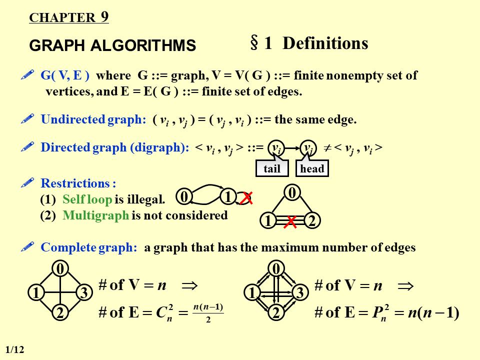
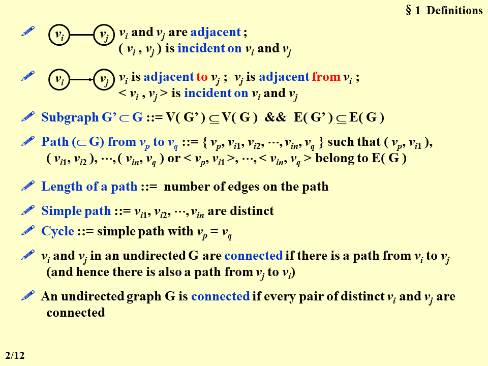
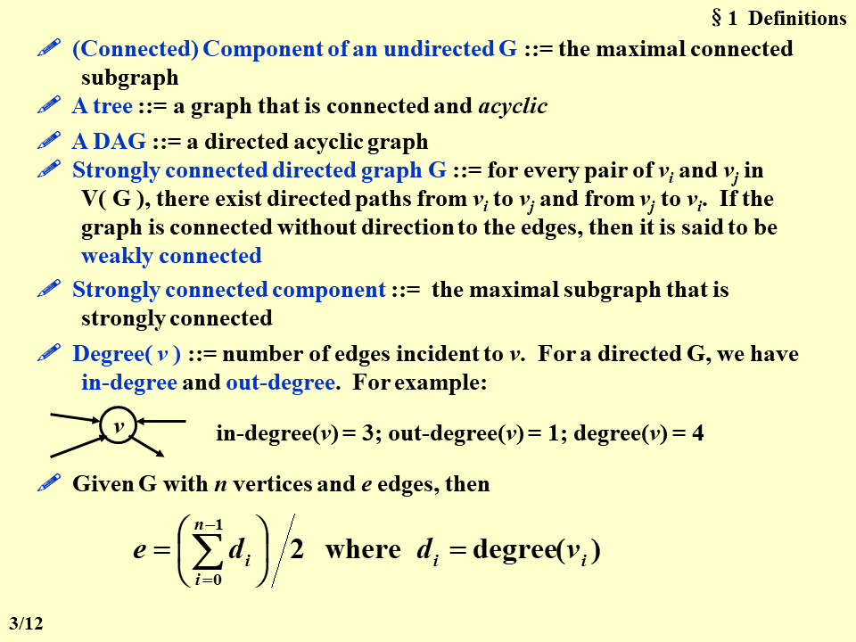
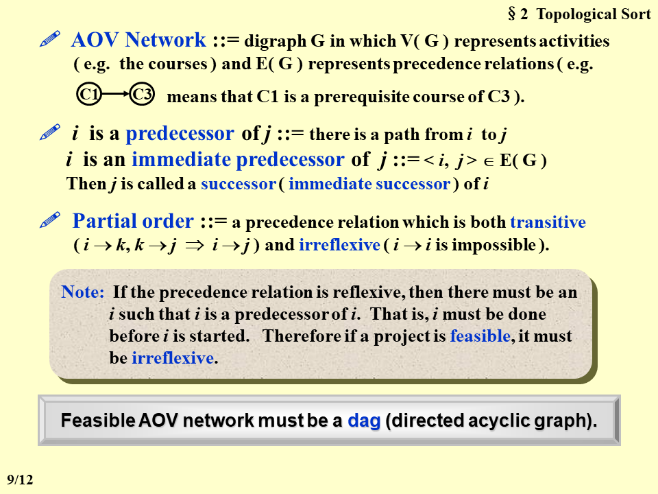

# 数据结构基础

## Project Report 要求

0. 删除个人信息
1. 封面
    - 标题 + 日期 (-1)
2. Chapter 1 Introduction
    - 自己描述题目，不能照搬照抄 (-3)
3. Chapter 2 Algorithm Specification
    - 伪代码 + 自然语言描述
    - 不要直接贴项目代码
4. Chapter 3 Testing Result
    - 每一组测试样例都要写 purpose (-3)
    - 至少一组综合测试样例 (comprehensive test case)，数据规模的上下边界各一组，极限情况 (extreme case) 必须测试到，再加 n 组随机数据 (-4)
    - *搞点图来展示运行时间*
5. Chapter 4 Analysis and Comments
    - 分析复杂度需要写过程 (-4)
        - 例如循环要这么写：*The loop runs for N times and the complexity of each loop body is O(1), so the total time complexity is O(N).*
    - 时间和空间都要写到
6. 代码
    - 一定要多写注释，至少写到代码总长度的 30% 以上 (-50)
7. README
    - 怎么编译？怎么运行？怎么输入？期望的输出？

## 课程笔记

1. ch1：课程简介
2. ch2：复杂度分析
    - 大 O：上限
    - 大 Ω：下限
    - 大 θ：上限 + 下限
    - 小 o：无穷小量（大 O 的反向操作）
    - if/else：选较大的那个分支算复杂度
    - 主定理
2. ch3：栈和队列
    - 中缀表达式转后缀表达式：
        1. 如果是操作数, 则直接压进输出队列中
        2. 如果是运算符, 分以下情况:
            a. 运算符堆栈为空, 或者运算符栈顶元素为'(', 则直接将运算符压进栈
            b. 运算符如果是')', 则将运算符栈中的元素都压进去输出队列中并将其弹出运算符栈, 直到遇到'('为止
            c. 运算操作符是'+' '-' '*' '/' 之一的时候, 将其与运算符栈顶元素作比较,如果栈顶的优先级较小（ **如果运算符是左结合的则优先级相等也要出栈** ）, 则将运算符压入栈中。否则, 将栈顶元素弹出并压入输出队列中, 然后继续比较栈顶, 直到运算符被压入栈.
    - 中缀表达式转前缀表达式：
        1. 存两个堆栈, 一个存放操作数, 一个存放运算符
        2. 由于要转换为prefix, 运算符在操作数前, 所以扫描从中缀表达式 **从右往左** 扫描.
        3. 如果是操作数, 则直接压进操作数栈中
        4. 如果是运算符, 分以下情况:
            a. 运算符堆栈为空, 或者运算符栈顶元素为')', 则直接将运算符压进栈
            b. 运算符如果是'(', 则将运算符栈中的元素都压进去操作数栈中并将其弹出运算符栈, 直到遇到')'为止
            c. 运算操作符是'+' '-' '*' '/' 之一的时候, 将其与运算符栈顶元素作比较,如果栈顶的优先级较小,（ **如果运算符是右结合的则优先级相等也要出栈** ） 则将运算符压入栈中. 否则, 将栈顶元素弹出并压入操作数栈中, 然后继续比较栈顶, 直到运算符被压入栈。
        5. 扫描完一遍后, 将运算符堆栈剩余的元素都压入操作数栈中。
        6. 将操作数栈从栈顶到栈底输出就是prefix.
3. ch4：树
    - traversal:
        - preorder: 根左右
        - inorder: 左根右
        - postorder: 左右根
    - degree of tree: max degree of node
    - 任意树变成二叉树：倾斜 45 度，兄弟变儿子；i.e.左儿子是第一个儿子，右儿子是兄弟
    - threaded binary tree 线索二叉树：
        - 目的：n 节点二叉树有 n+1 个儿子指针是 NULL，利用这些指针来使遍历更加方便
        - 分类：前序 / 中序 / 后序
        - 构造：NULL 的左儿子换成（前序 / 中序 / 后序）遍历中的前驱节点，右儿子换成后继。
        - 遍历：不再需要回溯，只需要判断自身和左右儿子的顺序即可
4. ch5：二叉搜索树
    - BST: binary search tree
        - delete:
            - 1 degree: 儿子挪上来
            - 2 degree: 用 largest in the left subtree 或者 smallest in the right subtree 来替换当前节点
        - lazy tag: 标记删除但是不实际删除，用于删除操作不多的情况
    - ADT: abstract data type
    - decision tree:
        - internal node & external node(leaf)
    - 特殊的树
        - complete binary tree: 叶子节点深度差最大为 1
        - full binary tree
5. ch6：binary heap
    - property：
        - 每个节点都比儿子大（左右儿子之间没有限制）
        - 一定是 complete binary tree
        - 查找只能 $O(N)$
        - 编号从 $\lfloor \frac{N}{2}\rfloor +1$ 开始就都没有儿子
    - operation
        - 建堆：保证操作每个节点时，他的两个儿子子树都是堆，然后将这个节点往下推。有 $\frac{N}{2}$ 个节点需要往下推至少一次，$\frac{N}{4}$ 个节点往下至少两次，以此类推 $T(N)=\frac{N}{2}+\frac{N}{4}+...=O(N)$
        - push：在最大编号后面插入，依次往上交换
        - pop：左右儿子挑一个大（小）的提上来
    - d-heaps: 
        - 单次操作 $O(d \log_dN)$，d 为 3 时时间复杂度最低
        - 父亲：$father(i)$ 是一个阶梯函数，$father(1) = 0$，每过 d 个数函数值 +1，$father(i) = \lfloor (i+d-2)/d\rfloor$
        - 最大的儿子：把最大的儿子后面的节点全去掉，则树上除了叶子之外全都是满儿子，$$father(son_{max}(i)) = [son_{max}(i)-1]/d = i$$ 所以 $son_{max}(i)=id+1$
        - 最小的儿子： $son_{min}(i) = (i-1)d+2$
7. ch7: disjoint set ( 并查集 )
    - union-by-size: 小树合并做大树的儿子，查询 $O(\log_2 N)$，因为从任意节点每往上爬一层，子树大小至少翻一倍
        - array representation: 非根节点，数组中存父亲编号；根节点，数组中存数组大小的相反数
    - union-by-depth: 浅树合并做深树的儿子，查询 $O(\log_2 N)$，因为一棵深度为 n 的树需要 2 棵深度为 n-1 的树合并得到，所以深度为 n 的树大小至少为 $2^n$，树深度为 $O(\log_2 N)$ 级
    - path compression: 查询和合并的复杂度都是 $O(1)$】
        - 并查集的非递归写法：
            ```c
            SetType  Find ( ElementType  X, DisjointSet  S )
            {
                ElementType  root,  trail,  lead;
                for ( root = X; S[ root ] > 0; root = S[ root ] );
                for ( trail = X; trail != root; trail = lead ) {
                lead = S[ trail ] ;   
                S[ trail ] = root ;   
                }
                return  root ;
            }
            ```
    - relation 的性质：reflexive 自反性，symmetric, transit
8. ch8: graph
    - 定义：
        - 单讲 connected 一般是无向图，有向图要分强联通和弱联通
        - 有向图的 adjacent 有 from 和 to 之分
    - 图的存储方式：adjacent multilist，就是同一条边存两个next，分别是对于出点的 next 和对于入点的 next，方便找入度
    - 拓扑排序相关定义：


## 错题整理

1. 

期中考

If a stack is used to convert the infix expression a+b*c+(d*e+f)*g into a postfix expression, what will be in the stack (listing from the bottom up) when f is read?

Ans：`+(+`