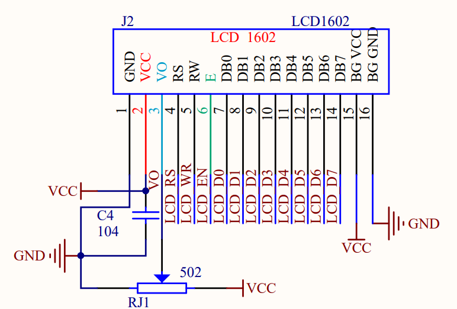
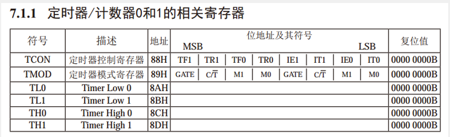
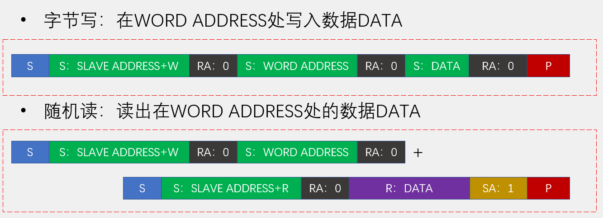
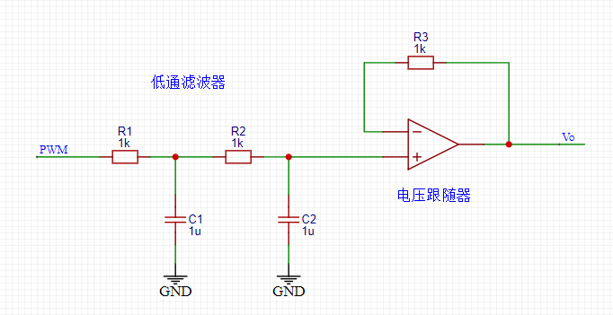

# 51 单片机

[TOC]

## C51 编程

1. C51
    - 在 C 基础上增加了便于访问单片机内存的 **sbit**(special bit) 和 **sfr**(special function register，), **code** 变量类型。
        - 声明1：用地址声明 `sfr P0 = 0x80; sbit P0_0 = 0x80;`
        - 声明2：用 sfr 声明 sbit `sbit P3_4 = P3^4;`
        - 调用：`if (P3_1 == 0) P2_0 = 0;` 可以直接对寄存器进行读和写。
        - `code` 修饰的变量，其内存将申请 ROM(FLASH) 上。FLASH 空间更大，但是不能在软件中更改。例如 `unsigned char code Animation[32];`。
    - 只能在函数或者循环的开头定义局部变量
    - 引用头文件 `REGX52.H`，可以直接调用定义好的端口，例如 `P2, P2_0`
    - 因为存储空间有限，经常用 `char`(-128 ~ 127) 和 `unsigned char`(0 ~ 255)，需要注意符号和数据范围的问题
2. Keil5
    - 在 Keil5 中定义和使用模板： `|` 表示使用模板之后光标跳转的位置
3. 常用模块
    1. 延时模块：用空语句占用时间，空语句数量通过主频计算，在 stc-isp 软件内可生成延时函数
    2. 按键防抖模块：按键状态发生变化时延时 20 ms
4. 模块化编程：
    - 在函数实现的 `.c` 文件中不需要包含函数的声明，只需要在想调用函数的地方引用 `.h` 就行了。
    - 使用到的自定义函数的 `.c` 文件必须添加到工程参与编译，使用到的 `.h` 文件必须要放在编译器可寻找到的地方（工程文件夹根目录、安装目录、自定义）

## 开发板原理图

1. 数码管
    1. 共阴极
    2. 通过 38 译码器选择数码管，74HC138 译码器 A, B, C 引脚代表二进制数的低、中、高位。
    3. P00 到 P07 端口分别对应 LED a, b, ..., g, dp
    4. 消影：段选、位选是交替进行的，当段选已经选中下一个数码管时，位选仍保持着上一个数码管的数据，会被显示在下一个数码管上，产生重叠。需要在每次显示之后重置位选。
    5. 驱动方式
        - 单片机直接扫描：只用单片机占用 11 个接口，用 74H595 只需要 3 个接口。
        - 专用驱动芯片：TM1640，不需要占用大量 CPU 时间进行扫描
2. 74HC245 模块功能：
    1. DIR 引脚控制数字信号传递的方向
    2. 增强驱动能力：输入的高低电平信号增强为 Vcc 和 Gnd
3. LCD1602
    - 介绍：
        - LCD（Liquid Crystal Display，液晶显示屏）是一种**字符型**液晶显示模块，可以显示ASCII码的标准字符和其它的一些内置特殊字符，还可以有8个自定义字符（不能显示任意图像）
        - 1602：显示容量 16×2 个字符，每个字符为 5*7 点阵
        - 自带驱动芯片，不需要 CPU 进行扫描
    - 引脚  
        - 可以通过调节 VO 脚连接的电位器，观察屏幕对比度是否变化，来确定引脚有没有插反。
    - 内部结构 
        - DDRAM 有 40 列，但是只有 16 列映射到屏幕上。默认前 16 位映射到屏幕，可以改变映射关系（屏幕右移）。地址如下图所示 
        - A/C = ADDR/COUNTER 地址位置寄存器
        - 字模库：CGRAM + CGROM。CGRAM 可以写入，用于存放自定义字符；CGROM 不支持写入。DDROM 的 21H 到 3FH 部分使用 ASCII 码编码。**注意 CGRAM 只能存放 8 个字模，地址 00H 和 08H 指向硬件上的同一块区域。** 
    - 指令 
        - 显示一个字符：先写入一个指令，设置 DDRAM 地址；再写一个数据(1Byte)表示写到这个位置的字模编号
        - 添加一个自定义字模：先写入一个指令设置 CGRAM 地址和行号，其中 DB5, DB4, DB3 为 CGRAM 地址，DB2, DB1, DB0 为行号。再写数据，DB4, DB3, DB2, DB1, DB0 对应于每行 5 点的字模数据，DB7, DB6, DB5 可为任何数据，一般取“000”。重复八次就在 CGRAM 的一个地址中写入了一个自定义字模了！*搭配文字取模软件食用更佳*
    - 时序
        - 先把 RS, RW, DB0 ~ DB7 设置好，然后给 E 一个高电平。然后如果是写操作就直接拉低，读操作在拉低之前数据位都有效。
        - 通信的时序参数基本以纳秒为单位，用 51 单片机操作不需要考虑延时。但是执行指令的时间较长，一般需要三到四个时钟周期，需要等待指令执行完成后才能执行后续指令。（p.s. **E 的高电平需要保持 1ms 左右，在写入结束后 1ms 内不进行其他写入动作，不然指令不执行，可能是手册的时序没有写完整**）
4. 矩阵键盘
    - 扫描：IO 口从 16 个减少到 8 个（n^2 减少到 2n）
    - 思路1：按行扫描或者按列扫描
    - 思路2：先扫描整个矩阵判断是否有按键按下，当有按键按下后再按行或列扫描确定按下的位置。这种方法优点是检测更加灵敏，缺点是引脚冲突导致蜂鸣器乱叫。
    - 问题1：若按行扫描，P15 口引脚冲突，扫描时蜂鸣器同时工作。按列扫描不会出现问题。
    - 问题2：作为输入口时，IO 口的输出需要设为高电平，否则输入的高电平无法被检测到。
    - 问题3：在一个按键松开之前不能检测到另一个按键按下。扫描的弊端。
5. 单片机 I/O 口
    - 准双向口：既可以作为输入口，又可以作为输出口
    - 弱上拉强下拉：可以简单理解成，输出高电平时，在 IO 口和 Vcc 之间连一个电阻，允许外接设备将电平拉低；输出低电平时，IO 口直接接地。
    - 其他 I/O 模式：高阻输入 - 内部高阻态，输入高低电平均不会短路。推挽输出 - 直连 Vcc 增强驱动能力。开漏输出 - MOS 管输出，驱动能力较弱。
6. 定时器 / 计数器 （关于定时器和中断的具体功能和实现详见手册）  
    - 是单片机内部资源。可实现软件计时，或者使程序每隔一固定时间完成一项操作，替代长时间 Delay
    - STC89C52 的 T0 有四种工作模式
        - 模式0：13位定时器/计数器
        - 模式1：16位定时器/计数器（常用）。不会自动重装，需要在中断函数中重新初始化。**如果不自动重装的话会随机装一个值进去，一般是 63 即低 5 位置 1。所以即使在主函数中暂时设置 `EA=0` 不允许中断，在重新开启中断之后定时器仍会正常工作。**
        - 模式2：8位**自动重装**模式。**TL 累加，TH 不变，溢出时将 TH 重装入 TL。**
        - 模式3：两个8位计数器
        - 注意1：T1 没有第 3 种
        - 注意2：**TF 由硬件置 1，直到 CPU 响应中断（不允许中断也算响应了）由硬件置 0**，无需软件设置
    - 定时器相关寄存器 
        - $C/\overline{T}$：
            - 作用：选择使用内部时钟作为输入或者使用外部脉冲输入作为输入
            - 硬件：是寄存器 TMOD 的一位，不可位寻址，通过电路连线直接控制定时器中的开关
            - 若使用内部时钟，每 1us 计数器加一，可以通过设置计数器初始值来计一个特定时间。
        - TMOD：高 4 位控制 T1，低 4 位控制 T0
        - GATE 和 TR0：计数器的开关，$TR0 \wedge(\overline{GATE}\vee \overline{INT0})$ 为真时计数器才工作
        - TL, TH, TF: timer low, timer high, timer flow(1 bit)
    - 中断：
        - 中断源：8个（外部中断0、定时器0中断、外部中断1、定时器1中断、串口中断、定时器2中断、外部中断2、外部中断3），不同型号的单片机不同 
        - 中断优先级
        - 中断号 
        - 注意：中断函数尽量简单，否则会导致主函数程序执行效率低下。
        - 中断相关寄存器（查手册）
7. 串口通信
    - 51 单片机中实现串口通信的模块：**UART（Universal Asynchronous Receiver Transmitter，通用异步收发器）**
    - 最简单的双向通信串口模型如下图，TXD(transmit exchange data), RXD(receive exchange data), Vcc 供电，GND 提供标准 0 电平，因为高低电平都是以 GND 为标准的。如果两边电平标准不同则还需要加电平转换芯片 
    - 电平标准：
        - TTL电平：+5V表示1，0V表示0
        - RS232电平：-3 ~ -15V表示1，+3 ~ +15V表示0（可容忍的电压变化更大，抗干扰能力更强）
        - RS485电平：两线压差+2 ~ +6V表示1，-2 ~ -6V表示0（差分信号，一个信号需要两根线，但是能够进行更长距离的传输，稳定性更好，例如 USB，CAN）
    - 术语：
        - 全双工：通信双方可以在同一时刻互相传输数据
        - 半双工：通信双方可以互相传输数据，但必须分时复用一根数据线
        - 单工：通信只能有一方发送到另一方，不能反向传输
        - 异步：通信双方各自约定通信速率
        - 同步：通信双方靠一根时钟线来约定通信速率
        - 总线：连接各个设备的数据传输线路（类似于一条马路，把路边各住户连接起来，使住户可以相互交流）
        - 波特率：单位时间内载波调制状态变化的次数，即串口通信每秒钟传输符号的个数。
            - 注意1：注意与比特率区分。
            - 注意2：一个符号可以负载多个比特信息，例如在 51 单片机中可能是 8 bit 或者 9 bit 信息为一个符号，取决于串口工作模式。所以需要注意波特率的单位是 Bd 还是 bps。
            - 注意3：波特率可能无法精确设定为某些值，从而产生一定的误差。例如在 12MHz 时钟频率的单片机中无法设置波特率为 4800，因为无法整除。
            - 计算：例如单片机时钟频率为 11.0592MHz，工作在 12T 模式，Timer1 工作在 8 位定时器模式；需要波特率为 Bd = 4800bps，串口波特率不翻倍（SMOD=0）。根据时钟频率可知，单片机每秒有 SysClk = 11059200 个时钟周期；因为 12 个时钟周期为一个指令周期（12T），所以每秒有 SysClk / 12 个指令周期；因为 T1 每秒溢出次数为 SysClk / 12 / (65536 - TH1)，且 **T1 每溢出 32 次接收 1 bit**，所以波特率为 SysClk / 12 / (256 - TH1) / 32 = Bd。所以需要设置 Timer1 的初始值为 TH1 = 256 - 11059200 / 12 / 32 / 4800 = 256 - 6。
    - STC89C52 的 UART 的四种工作模式：
        - 模式0：同步移位寄存器
        - 模式1：8位UART，波特率可变（常用），无校验位，时序图如下 
        - 模式2：9位UART，波特率固定，有校验位
        - 模式3：9位UART，波特率可变，有校验位
    - 串口内部结构简图
        - SBUF：串口数据缓存寄存器，**物理上是两个独立的寄存器，但占用相同的地址**。写操作时，写入的是发送寄存器，读操作时，读出的是接收寄存器。
            - 在 *发送过程* 中：写 SBUF 的指令会触发发送数据。在发送结束即 TI 被置 1 之前不能写 SBUF 否则会出错。（详见手册中的串行口工作模式）
            - 在 *接收过程* 中：接收器以给定波特率的 16 分频采样数据（即每次接收 1 bit，会采样 16 次）。如果没有数据则 RxD 端口将一直为 1；如果 RxD 从 1 变 0，则启动接收器并重置 16 分频计数器（即同步时间）开始接收一帧数据（8 bit + 起始位和结束位）。
            - 注意：通信双方需要约定好波特率，否则传输的数据将是错误的。
        - TL1, TH1：Timer1 相关寄存器。UART 想要工作，需要启用 Timer1，使用模式 2 **自动重装**定时器，并通过配置 Timer1 的溢出速度控制波特率。
        - TI, RI：触发同一个中断号的中断，**在中断处理函数中需要判断是读还是写触发了中断，在中断结束后需要用软件复位**。（详见上面的中断结构图）
        
8. 点阵屏
    - 大点阵屏一般是由 8 * 8 或者 16 * 16 的单位点阵屏拼接成的。
    - 显示原理：扫描（和数码管相同）
    - 74HC595
        1. 74HC595 是串行输入并行输出的移位寄存器
        2. OE(output enable) 低电平使能。且 OE 是由板子上的一个物理开关 J24 控制的，J24 把 OE 和 GND 接在一起的时候点阵屏才能点亮。
        3. SERCLK 出现上升沿时，移位寄存器往下移一位，并把 SER 中的数据填充在最低位。RCLK 出现上升沿时，把移位寄存器中的数据填充到输出寄存器中。 
        4. 74H595 的多片级联：QH' 连接下一个 74H595，可输出16位、24位、32位等，常用于IO口扩展。
        - 注意1：LED 的阳极连接 74H595，阴极直接连单片机的 IO 口。反过来不好，因为 IO 口输出高电平驱动能力差。
        - 注意2：74H595 恒压输出，驱动能力虽然比 IO 口直接驱动好一点，但是能力仍旧有限，所以亮一排灯和亮一个灯的亮度会有所区别。
    - 辅助软件：数字取模软件、图像取模软件。可制作滚屏字幕和逐帧动画。
9. DS1302
    - DS1302是由美国DALLAS公司推出的具有涓细电流充电能力的低功耗实时时钟芯片。
    - 所属大类 - RTC(Real Time Clock)：实时时钟，是一种集成电路，通常称为时钟芯片（例如：DS3231 精度高，DS12C887 内部自带电池）
    - 优点：相比单片机内部时钟，更精确，不占用 CPU 时间，断电继续运行（可连接备用电池，并具有涓细电流充电功能）
    - 引脚定义 
    - 时钟相关寄存器 
        - 前两列表示读或者写这行的寄存器的指令。指令是一个 8 位 2 进制数，详见下方指令格式。
        - $12/\overline{24}$ 表示如果这位为 1 就用 12 小时制，这位是 0 就用 24 小时制。 $\overline{AM}/PM$ 同理。
        - 10Seconds 和 Seconds 分别表示秒数的十位和各位，使用 BCD 编码。
        - WP: write protection，高电平则不能写入只能读出。**在初始化时需要把写保护关闭，否则可能导致读出的数据乱码。**
        - 最后一行是涓细电流充电相关寄存器，可以先不管。
        - 注意：一般情况下寄存器默认上电置 1，是一个不合法的时间。所以**需要给 DS1302 赋一个时间初值，否则不会开始计时**。
    - 指令的编写
        - 指令格式：
        - 输入指令时序图：SCLK 上升沿写入数据，下降沿读出数据
            - 用 C 语言实现上升沿和下降沿：连续赋值 `SCLK = 0; SCLK = 1;`
            - 高电平和低电平需要至少保持一定的时间（参考手册并增加延时，或者用其他语句占用时间，**若不考虑保持时间可能会导致读出数据乱码**）
            - **读完之后必须要把 IO 口置 0**，否则下次读可能乱码，目前不知道为什么 
10. 蜂鸣器
    - 分类：
        - 有源蜂鸣器：内部自带振荡源，将正负极接上直流电压即可持续发声，**频率固定**
        - 无源蜂鸣器：内部不带振荡源，需要控制器提供振荡脉冲才可发声，**调整提供振荡脉冲的频率，可发出不同频率的声音**
    - 正负极：外壳上有正极的标志，或者长引脚为正。
    - 驱动芯片：ULN2003D 芯片
        - 达林顿晶体管阵列。可以看成一堆非门，但是只有输出 0 具有驱动能力，输出 1 不具备驱动能力
    - 音符与频率对照表 
        - 小字组 a (440Hz) 是基准频率
        - 高八度频率翻倍
        - 八度中间的黑键和白键频率按等比数列划分（**十二平均律**）
    - 实现：
        - 用定时器中断实现音高。通过音符频率计算定时器中断的周期，每次中断翻转 IO 口电平
        - 在主函数中用循环实现时值。**一般将频率高、耗时短的周期性操作放在定时器中；频率低，耗时长的周期性操作放在主函数中。** 这样基本可以做到互不影响。
    - 后续改进：
        1. 因为芯片内部时钟非常不精准，所以音准差的有点离谱，可以试一个系数出来把每个频率都乘这个系数。
        2. 当蜂鸣器频率很快，即中断的频率很高时，CPU 效率降低导致原来一拍的时间边长了，需要修改一拍的时间，或者减少中断函数的耗时。
11. AT24C02
    - AT24C02是一种可以实现掉电不丢失的存储器
    - 存储介质 E2PROM，容量：256字节
        - 补充知识
            1. ROM 的发展史：Mask ROM（二极管焊死，不可编程。**用二极管而不是导线的原因是，防止逆向电流使其他地址线导通**）, PROM（二极管可以通大电流烧毁，把断路变成导通，所以只能进行一次编程）, EPROM（紫外线照射可以把烧毁的二极管重新导通，可以多次编程）, EEPROM(也叫 E2PROM，不用紫外线照了，通电就行) 
            2. ROM 含义的拓展：原指只读存储器，后扩大为非易失性存储器的统称。硬盘（磁介质）、光盘（光介质）都算 ROM。
    - I2C 总线(Inter IC BUS, IIC)
        - 引脚：两根通信线 SCL（Serial Clock）、SDA（Serial Data）
        - 性质：同步（有时钟）、半双工（发送和接收分时复用一根数据线），带数据应答
        - 芯片举例：MPU6050 陀螺仪芯片，0.96 寸 OLED 屏幕
        - 电路规范：所有 I2C 设备的 SCL 连在一起，SDA 连在一起。设备的 SCL 和 SDA 均要配置成 **开漏输出模式（输出 0 直接接地，输出 1 相当于引脚断路）**。SCL 和 SDA 各添加一个上拉电阻，阻值一般为 4.7KΩ 左右。开漏输出和上拉电阻的共同作用解决了多机通信互相干扰的问题（除了输出信号的设备，其他接收设备输出 1，就只有一个设备在影响总线上的电位） 
        - 时序结构模块（数据帧的组成部分）
            1. 起始条件 S(tart)：SCL高电平期间，SDA从高电平切换到低电平 
            2. 终止条件 （sto）P：SCL高电平期间，SDA从低电平切换到高电平 
            3. 发送一个字节 S(end) Byte：SCL低电平期间，主机将数据位依次放到SDA线上（高位在前），然后拉高SCL，从机将在SCL高电平期间读取数据位，所以SCL高电平期间SDA不允许有数据变化，依次循环上述过程8次，即可发送一个字节 
            4. 接收一个字节 R(eceive) Byte：SCL低电平期间，从机将数据位依次放到SDA线上（高位在前），然后拉高SCL，主机将在SCL高电平期间读取数据位，所以SCL高电平期间SDA不允许有数据变化，依次循环上述过程8次，即可接收一个字节（主机在接收之前，需要释放SDA） 
            5. **发送**应答 S(end) A(cknowledge)：在**接收**完一个字节之后，主机在下一个时钟发送一位数据，数据0表示应答，数据1表示非应答（**通信结束一般发送非应答**） 
            6. **接收**应答 R(eceive) A(cknowledge)：在**发送**完一个字节之后，主机在下一个时钟接收一位数据，判断从机是否应答，数据0表示应答，数据1表示非应答（主机在接收之前，需要释放SDA） 
        - 数据帧
            1. 发送帧（**0 为 W 1 为 R**，SLAVE ADDRESS 高四位由元件型号决定，AT24C02 是 1010，低三位由硬件连接决定，在开发板上 A2,A1,A0 都接地了所以是 000） 
            2. 接收帧 
            3. 符合格式帧（先发送再接收） 
        - AT24C02 的数据帧
            1. 字节写 
            2. 随机读 
            3. 其他（页写、顺序读等，看手册）
    - 注意事项
        1. AT24C02 的时序参数 $T_{WR}$ 写周期：从一个写周期的有效停止条件开始至内部写周期结束的时间。所以**在每个写数据帧之后都需要 Delay 5ms**，在此期间的其他写数据帧会失效。
        2. **在每次接收开始之前先把 SDA 拉高**，否则接收到的全 0。
12. DS18B20 温度传感器
    - 介绍：DS18B20是一种常见的数字温度传感器（与之相对的是模拟温度传感器，例如热敏电阻，以阻值为模拟信号），其控制命令和数据都是以数字信号的方式输入输出，相比较于模拟温度传感器，具有功能强大、硬件简单、易扩展、抗干扰性强等特点。测温范围：-55°C 到 +125°C。
    - 内部结构 
        - 寄生供电
        - 64-BIT ROM：不可写，作为器件地址（独一无二），用于总线通信的寻址。
        - SCRATCHPAD（暂存器）：RAM，存储结构如下 
        - CRC：数据校验码，根据前八个 Byte 计算，
    - 单总线(1-wire)
        - 介绍：异步（没有时钟，使用绝对时间）、半双工（双向传输）
        - 优点：省通信线，最少仅需要 DQ 和 GND 两根线，在元件与主机距离远的时候有成本优势。
        - **缺点：通信期间不能中断**
        - 电路规范：
            1. 设备的DQ均要配置成开漏输出模式，并添加一个上拉电阻，阻值一般为4.7KΩ左右（为了实现总线结构）
            2. 若此总线的从机采取寄生供电，则主机还应配一个强上拉输出电路 
        - 时序模块
            1. 初始化：主机将总线拉低至少 480us，然后释放总线，等待15 ~ 60us后，存在的从机会拉低总线60 ~ 240us以响应主机，之后从机将释放总线 
            2. 发送一位：主机将总线拉低60 ~ 120us（不能太长否则和初始化混淆），然后释放总线，表示发送0；主机将总线拉低1 ~ 15us，然后释放总线，表示发送1。从机将在总线拉低30us后（典型值）读取电平，整个时间片应大于60us 
            3. 接收一位：主机将总线拉低1 ~ 15us，然后释放总线，并在拉低后15us内读取总线电平（尽量贴近15us的末尾），读取为低电平则为接收0，读取为高电平则为接收1 ，整个时间片应大于60us 
            4. 发送一个字节和接收一个字节：**低位在前**
        - 操作 
            1. ROM操作 = ROM指令 + 本指令需要的读写操作。用于检查 DS18B20 地址，选择要进行通信的元件。
                - SKIP ROM：跳过地址匹配，直接与所有元件通信
            2. 功能操作 = 功能指令 + 本指令需要的读写操作。用于读写数据。
                - CONVERT T：更新 RAM 里的温度值
                - READ SCRATCHPAD：读取 RAM 中的值
        - 数据帧   
        - 温度数据存储格式：反码存储，高四位 bit extension。只要把读出的数据存在 int 里再除以 16 就可以得到温度数据了。 
13. 直流电机
    - 电机
        1. 直流电机：由永磁体（定子）、线圈（转子）和换向器组成。当电极正接时，电机正转，当电极反接时，电机反转。
        2. 步进电机：由永磁体（中心转子）和电磁铁（一圈）组成。通过控制电磁铁的磁性来控制中心转子转动，可以精确控制转速。
        3. 舵机：通过输入脉冲宽度控制转动角度，可用于小车转向控制。
        4. 无刷电机、空心杯电机：功率大，常用于四轴飞行器。
    - 电机相关概念
        1. PWM：Pulse Width Modulation，脉冲宽度调制。核心思路是用快速变化的数字信号等效表达模拟信号（这里等效指功率相同）。 
            - PWM重要参数：频率 = 1 / $T_S$，占空比 = $T_{ON}$ / $T_S$，精度 = 占空比变化步距 
            - 用定时器实现 PWM：用计数器值和比较值实现特定占空比。 
            - 注意：**修改占空比的时机最好选在一个循环结束的时候**，否则占空比将产生短促的抖动，反映在现象上就是呼吸灯闪烁。
        2. PID：一种保持稳定的控制方法（例如可以使巡线小车方向抖动减小），[简介](https://zhuanlan.zhihu.com/p/347372624)
    - 电机驱动
        1. 电路驱动
            - 直接驱动：三极管开关，反接二极管防止开关断开后感应电流过大。电机只能单向转动。
            - H 桥驱动：电机可以双向转动，但是没有二极管保护所以三极管耐压值需要较大。
        2. 电机驱动芯片：[电机驱动芯片——DRV8833、TB6612、A4950、L298N的详解与比较](https://blog.csdn.net/qq_45467083/article/details/108814176)
            - 开发板上的驱动芯片：ULN2003D 芯片、达林顿晶体管阵列。可以看成一堆非门，但是只有输出 0 具有驱动能力，输出 1 不具备驱动能力。电机一个端口接高电平，一个端口接 ULN2003D 的输出端口，即可实现驱动。
14. AD/DA(Analog to Digital/Digital to Analog)
    - 基本介绍
        1. 模型 
            - 输入通道：AD转换通常有**多个输入通道**，用多路选择开关连接至AD转换器，以实现AD多路复用的目的
            - IO：
                - 并口（速度快、原理简单）
                - 串口（接线少、使用方便）
        2. 集成
            - 集成在 AD/DA 芯片：如 PCF8591 兼顾 AD 和 DA
            - 集成在单片机内：可以直接用 IO 口读取电压
        3. 性能指标
            - 分辨率：指AD/DA数字量的精细程度，通常用位数表示。
            - 转换速度：表示AD/DA的最大采样/建立频率
    - 运算放大器（运放）
        - 介绍：具有 **很高放大倍数** 的放大电路单元。输入输出关系如下图所示，分为线性区和非线性区，A 通常有几十万，线性区的宽度通常只有几十 uV。
        - 引脚：电源正极、电源负极、同相输入端、反相输入端、输出端。 
        - 结构：内部集成了差分放大器、电压放大器、功率放大器三级放大电路（具体参见模电课程）
        - 分析方法：
            - 虚短：当给运放引入负反馈时，Un=Up。感觉好像在Un 和 Up 之间接了一根导线短路了，所以叫“虚短”。 
            - 虚断：理想运放的输入阻抗无穷大。无论输入端接多高的电压，流入输入端的电流都非常小，所以叫“虚断”。
        - 应用：
            - 电压比较器：不加负反馈，应用运放的非线性区，将模拟信号转换为数字信号 
            - 反相放大器 
            - 同相放大器 
            - 电压跟随器：输出端无阻抗，使没有驱动能力的电压变为有驱动能力的电压。 
            - 加法器 
            - 积分器 
            - 微分器
    - 硬件结构 & 原理
        1. DA
            1. T型电阻网络DA转换器 
                - 先看红框：所有黑色节点右侧的电阻都是 2R，因为 2R 和 2R 并联是 R，再和 R 串联又变成 2R。所以从黑色节点往下流的电流和往右流的电流相等，从而导致 `I7 = 2I6, I6 = 2I5, ..., I1 = 2I0` 的分级现象。
                - 再看绿框：根据“虚短”性质，两个输入端都接地，即底下两条长导线上都是 0V，这是为了不影响上方电流的分流。只要开关输入为 1，电流就会留到上方长导线上，所以上方长导线上电流为 $\frac{D_7 \dots D_0}{256}I$。
                - 再看蓝框：根据“虚断”性质，流向输入端内部的电流为 0，所以长导线上所有电流都经过 $R_{fb}$ 流向输出端，形成电压差。又因为输入端都接地为 0V，所以输出端电压为 $\frac{D_7 \dots D_0}{256}\frac{V_{ref}R_{fb}}{R}$
                - 典型芯片：DAC0832，DA 转换器部分就采用了T型电阻网络结构。 
            2. PWM型DA转换器 
                - 低通滤波器：滤掉高频部分（交流），留下低频部分（直流），二级低通滤波（重复两个 RC 电路）使得滤波效果更好。最终效果是得到一个等效直流电压，输入到运放。
                - 电压跟随器：和输入电压一样，但是使其具有驱动能力
                - 开发板上的 DAC：红色是一个低通滤波，绿色是一个放大两倍的同相放大器，黄色是分压，橙色是限流。 
        2. AD
            1. 逐次逼近型AD转换器：使用二分查找法，将 DAC 产生的电压与传感器信号比较并修改 DAC 的数字信号，产生最接近传感器信号的数字信号并输出。 
                - 典型芯片：ADC0809，其中 AD 部分采用 逐次逼近型结构。 
            2. ET2046/XPT2046（开发板上的）：逐次逼近
    - ET2046/XPT2046（开发板上的） 
        - 引脚：$\overline{CS}$ 名为片选，就是主机与多个芯片连接时选择与哪个芯片通信的接口，低电平芯片可以通信。DCLK、DIN、DOUT 是 SPI 通信接口。XP、YP、XN、YN、VBAT 是模拟信号输入。VREF 是参考电压，可以由内部提供也可以由外部输入。
            - 虽然 ET2046 是触摸屏芯片，但在开发板上，XP、YP、VBAT 分别接了电位器、热敏电阻、光敏电阻的用于模拟信号（电压）的输入，用法较为简单。
        - 工作模式
            1. 单端模式：VBAT 的测量需要用单端模式。
            2. 差分模式：差分模式仅用于 X 坐标、Y 坐标和触摸压力的测量，其它测量要求采用单端模式。
        - 时序：先片选，然后从 DIN 输入 8 位控制字（上升沿输入），然后从 DOUT 读出 16 位输出（下降沿输出） 
            - 控制字各位的作用：
            - A2A1A0 通道配置：`1 010 0 1 00` 读取 VBAT 数据；`1 001 0 0 00` 读取 XP 数据；`1 101 0 0 00` 读取 YP 数据。
            - D1D0 掉电配置：
15. 红外遥控
    - 简介：
        - 红外遥控是利用红外光进行通信的设备，由 *红外LED* 将 *调制后的信号* 发出，由专用的红外接收头进行解调输出
        - 通信方式：单工，异步
        - 红外LED波长：940nm
        - 通信协议标准：NEC标准
    - 硬件电路
        - 发送部分 
            - 38kHz：调制，使得红外二极管以 38kHz 闪烁来表示低电平，不发光表示高电平。目的是抗干扰（来自太阳光等其他红外光）。也可以由软件进行调制，则可以省去这个硬件单元。
            - IN：输入信号。
        - 接收部分：滤波，留下 38kHz 的部分，并解调成和输入一样的信号。
        - 发送和接收的三种基本状态
            1. 空闲状态：红外LED不亮，接收头输出高电平
            2. 发送低电平：红外LED以38KHz频率闪烁发光，接收头输出低电平
            3. 发送高电平：红外LED不亮，接收头输出高电平（在第一个下降沿之后脱离空闲状态，之后发送的高电平就表示高电平了）
    - NEC 编码 
        - 接收端判定发送的信息只需要判断相邻两个下降沿之间的时间就可以了
        - Start：13500us, 计时器走 12442 下。
        - Repeat：11250us, 计时器走 10368 下。
        - Data 0：1120us, 计时器走 1032 下。
        - Data 1: 2250us, 计时器走 2074 下。
        - End: 66535us
    - 红外遥控器按键键码 
    - 外部中断：使用的是外部中断0。配置中断寄存器，定义中断函数（中断号 0），参考中断的章节。
        - 低电平触发和下降沿触发的区别：如果一直处在低电平，低电平触发处理完一个中断函数之后马上又进入下一次触发；但是下降沿触发不会。
    - 程序结构：**状态机！！！** 
        - Debug：
            - `P3_2` 外部中断口还连着一个独立按键，可以先用按键调试外部中断。
            - 可以先用 Delay 函数测试定时器的计时精确程度和正确性。
            - 可以用 P2 控制 LED 亮灭，来测试程序是否进入某个分支。

## 项目记录

1. DS1302 可调时钟
    1. 如何使程序逻辑更清晰：
        - 整个程序只有一个循环！在循环中通过判断选择相应行动。不要把逻辑写成先判断再各自进入不同的循环，容易边麻烦。
        - 模式选择的程序思维！把时钟模式和调节模式视作两种并列的模式
        - 在每个 while 循环中都先检查是否有按键按下，如果切换模式的按键按下就做出相应操作，然后根据模式选择进行行动。
    2. 在功能较多时如何选择合适的实现顺序：
        - 先实现显示功能
        - 再增加调节模式（只显示进入调节模式无实际功能）
        - 编写调节模式功能
        - 再增加判断时间合法性
        - 最后写中断增加闪烁
    3. 遇到的奇怪错误：
        - choose 作为参数传入函数，在调用 `LCD_ShowNum()` 后会被修改，但是作为全局变量就不会。
        - 读完之后必须要把 IO 口置 0，否则下次读可能乱码
    4. 后续改进：利用定时器中断实现按键上升沿和下降沿的捕获
2. 按键扫描实现秒表 + AT24C02 存储数据
    1. **程序结构设计很重要！！！**：先实现 6 个时序结构模块，放在一个文件里。再实现读和写两个操作帧，放在一个文件里。在主函数里只需要调用两个操作帧的函数即可。
    2. 测试方法：LED 和 24C02 存在引脚冲突（P2_0 和 P2_1），在功能还没有完全实现的时候，可以通过 LED 的亮灭初步判断对错
    3. **多个元件用到定时器中断的程序结构**：在主函数中定义中断函数，在中断函数中以不同的频率调用不同元件的驱动程序（例如按键扫描），那么每个元件就只需要写一个驱动就可以了。**用定时器扫描替换循环扫描的方法也可以一定程度上缓解扫描对于 CPU 时间的占用**
    4. **在中断处理函数中重新设置中断相关寄存器，可能会导致意外错误** ：现象是一旦中断开启，会导致主函数中与 AT24C02 的通信出错。目前不知道原因，感觉有可能与控制寄存器的硬件结构有关，反复读写控制寄存器可能导 IO 口错误或者变量值错误。
    - **按键扫描常见错误**：
        1. 注意按键 1 和 0 对应的引脚是反的，需要在中断函数中进行交换。有意思的是，如果在 `Key_Request` 中进行交换，则有可能会被中断，导致交换完的数据又被新的没交换的数据覆盖了，所以按的手速很快的时候 0 和 1 会错乱。
        2. **注意 `Key_Request()` 的速度不要太快**，否则有可能 keyNum 刚被 `Key_Interrupt` 赋值就被 `Key_Request` 置零了。Request 的频率保证在 20ms 一次以内就行了（假设 Request 每 10ms 一次，那按键被吞的概率就是万分之一，可以忽略不计），太短就加上延时；如果主函数是分支结构，需要保证每个分支的时间都不会太短。
3. DS18B20 温度报警器
    - 功能：
        1. 主函数循环检测温度，并显示在 LCD1602 上
        2. AT24C02 存储温度上限和下限的值，上电时读取上次的值
        3. 定时器中断扫描按键，修改报警温度上下限
        4. ~~达到报警温度，定时器中断控制蜂鸣器报警~~
    - DS18B20 驱动函数结构
        1. 1-wire 时序结构：初始化，写一位，读一位，写一字节，读一字节
        2. DS18B20 数据帧：更新温度，读取温度
    - 调试：
        1. 时序结构中初始化有响应位，可以先检测一下 DS18B20 是否响应
        2. DS18B20 上电有初始值，可以先不 ConvertT，检查数据格式转化是否正确。
    - 常见问题：
        1. 因为单总线通信对时间非常敏感，所以中断会导致通信出错。所以在通信期间需要使 `EA = 0` 禁用所有中断。但是会影响定时器精度。
        2. **LCD WR 和蜂鸣器 IO 口引脚冲突**，不能用蜂鸣器报警。
4. LCD1602
    - 首先定义接口
    - 然后写基本模块 * 3：延时 1us 函数、写指令、写数据
    - 然后实现功能：初始化（清屏 & 设置显示模式）、显示字符、显示字符串、显示数字、添加和使用自定义字符。

## Project 遥控小车

