# 人工智能基础-吴飞

[TOC]

## 逻辑推理

1. 命题逻辑和谓词逻辑：
    1. 归结(resolution)和单项归结(unit resolution): 归结就是 A 或 B 为真，A 非或 C 为真，则 B 或 C 一定为真。单项归结就是 A 或 B 为真但是 A 为假，则 B 为真。
    2. 析取是或，合取是与
3. 知识图谱：
    1. 是一个有向图，(实体，关系，实体)
    2. FOIL(first order inductive learner) 算法——ILP(inductive logic programming) 的一种
        1. 目标：给定目标谓词，得到形如下式的推理规则 
        2. 信息增益：用于评判前提约束谓词的好坏 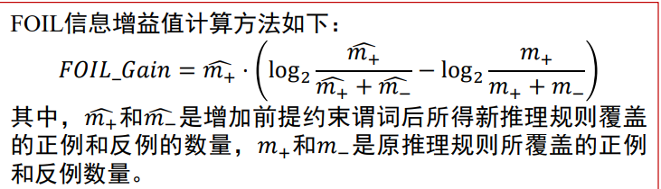
        3. 算法流程：
            - 预处理：
            - 迭代：依次将谓词加入到推理规则中作为前提约束谓词；计算所得到新推理规则的FOIL增益值；基于计算所得FOIL增益值来选择最佳前提约束谓词。将最佳前提约束加入到推理规则中，去掉用不上的正例和反例（将例子中的实体代入到前提约束谓词中，在背景知识里没有符合的）
            - 结束：得到的推理规则覆盖训练样本集合中所有正例且不覆盖任意反例，学习结束。
    3. PRA(path ranking algorithm) 算法：

## 搜索

1. 搜索的基础概念
    1. 搜索算法评价指标：完备性、最优性、时空复杂度
    2. 概念：
        - 搜索树：整个搜索过程形成的树结构
        - 边缘集合、开表(open list)：下一步探索的候选节点
        - 闭表(close list)：已经被拓展过的状态（节点）
        - 图搜索和树搜索：图搜索中一个状态只能有一个节点，不允许环路出现
2. 启发式(heuristic)搜索
    1. 概念：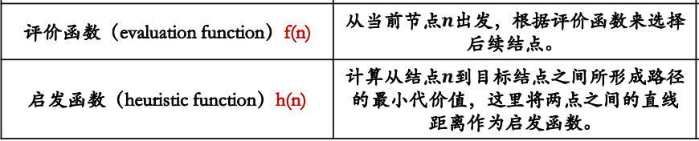
    2. 贪婪最佳优先搜索(Greedy best-first search)：评价函数f(n)=启发函数h(n)
    3. A*算法：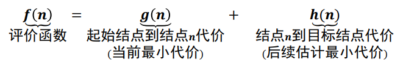
3. 对抗搜索(Adversarial Search)，i.e.博弈搜索(Game Search
    1. 最小最大搜索(Minimax Search): 
    2. Alpha-Beta剪枝搜索(Pruning Search): 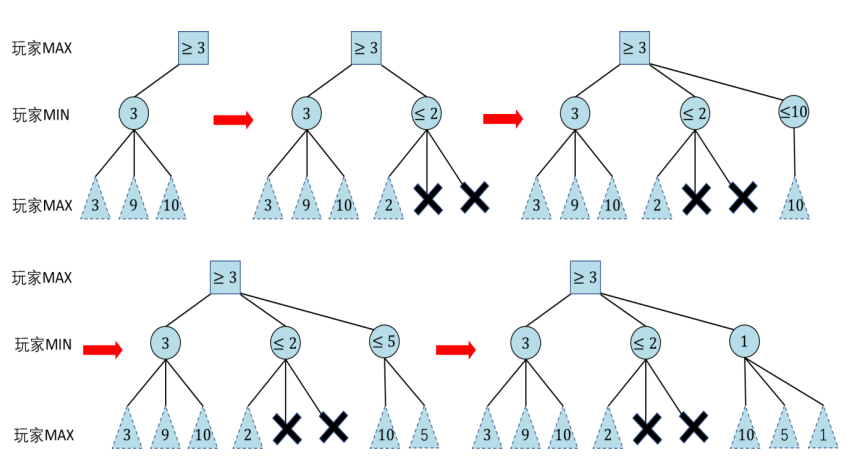
        - 假设有一个位于MIN层的结点𝑚，已知该结点能够向其上MAX结点反馈的收益为**𝛼**。𝑛是与结点𝑚位于同一层的某个兄弟结点的后代结点。如果在结点𝑛的后代结点被访问一部分后，知道结点𝑛能够向其上一层MAX结点反馈收益小于𝛼，则结点𝑛的未被访问孩子结点将被剪枝
        - 考虑位于MAX层的结点𝑚，已知结点𝑚能够从其下MIN层结点收到的收益为**𝛽**。结点𝑛是结点𝑚上层结点𝑚′的位于MAX层的后代结点，如果目前已知结点𝑛能够收到的收益大于𝛽，则不再扩展结点𝑛的未被访问后继结点，因为位于MIN层的结点𝑚′只会选择收益小于或等于𝛽的结点来采取行动
    3. 蒙特卡洛树搜索(Monte-Carlo Tree Search):
        - 奖励和悔值函数：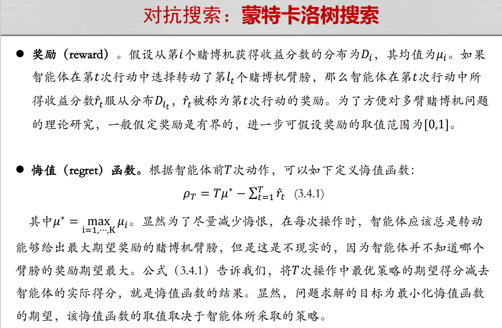
        - epsilon-贪心算法：
        - 霍夫丁不等式：
        - 上限置信区间（UCB1，upper confidence bounds）（以多臂赌博机为例）：置信上限与已获得的收益平均值、已经尝试的总次数、对当前赌博机尝试的次数有关。UCB 的目的是在探索和利用之间寻找平衡，和 epsilon-贪心一致。 
        - 算法步骤：（以黑白棋为例）
            - 选择：用 UCB1 算法计算节点权值，贪心选择一条路径
            - 拓展：随机
            - 模拟：随机
            - 反向传播：更新拓展的节点和路径上的节点，更新尝试次数和总收益
                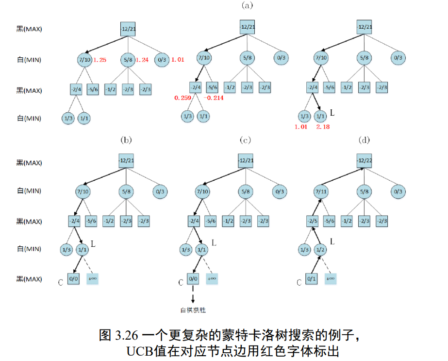

## 监督学习

1. 基本概念
    - 损失函数： 
    - 经验风险和期望风险：
        - 经验风险(empirical risk)：训练集中数据产生的损失。经验风险越小说明学习模型对训练数据拟合程度越好。
        - 期望风险(expected risk):当测试集中存在无穷多数据时产生的损失。期望风险越小，学习所得模型越好
        - 根据大数定律，当样本容量趋于无穷时，经验风险趋于期望风险。所以在实践中很自然用经验风险来估计期望风险。由于现实中训练样本数目有限，用经验风险估计期望风险并不理想，要对经验风险进行一定的约束。
    - 泛化能力、过学习、欠学习：
    - 结构风险最小化、正则化项（惩罚项）：通过限制模型规模来防止过拟合 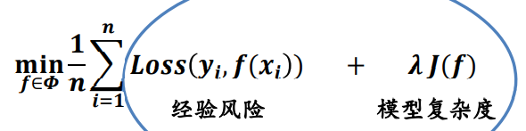
    - 分类：
        1. 判别方法：回归模型、神经网络、支持向量机、Ada Boosting
        2. 生成方法：贝叶斯方法、隐马尔科夫链
2. 回归
    - 一元线性回归：最小二乘法
        - 损失函数：求一组 (a, b) 最小化 L(a, b) 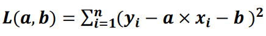
        - 推导：求偏导，极值处导数为 0
        - 结果：
    - 多元线性回归
        - 问题定义：
        - 推导：y 是一个列向量，X 的一列是一个数据，一行是数据的一维，a 是一个列向量 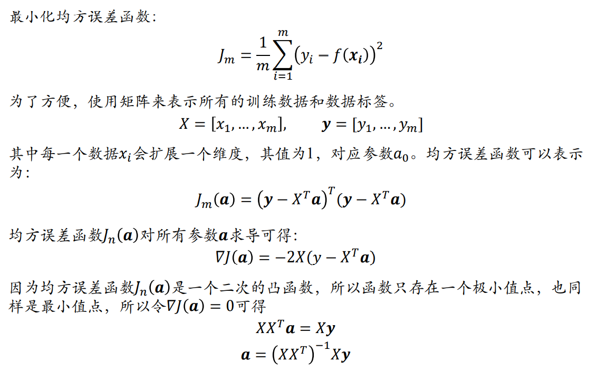
    - 逻辑斯蒂回归：解决离群点问题
        - sigmoid 函数：单调递增，对输入𝑧取值范围没有限制，z 取值在0附近时，函数输出值的变化幅度比较大。
        - 正例概率、负例概率、几率（P/(1-P)）、对数几率：整理概率大于 0.5 即几率大于 1 可认为输入数据在当前参数模型下被判定为正例 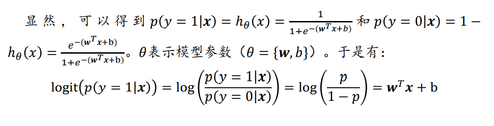
        - 最大化对数似然、最小化损失函数（交叉熵）：其中 yi 只能取 0 或 1
        - 梯度下降公式：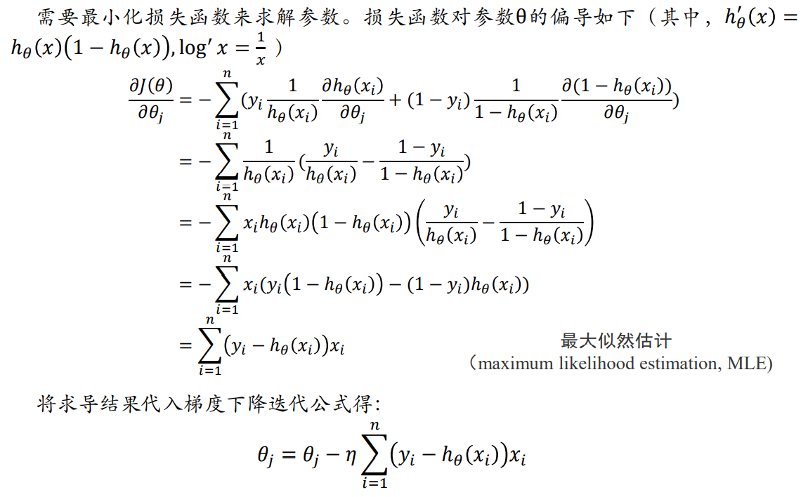
        - 推广：逻辑斯蒂回归只能解决二分类问题，推广到 softmax 函数，处理多分类问题
3. 决策树：通过树形结构进行分类
    - 信息熵：E(D) 值越小，表示 D 包含的信息越确定，也称 D 的纯度越高。在决策树上，信息熵是对每个节点而言，k 表示节点包含几种种类的最终分类（如下图中“拥有房产”节点有两种信息，而“年龄20-30”节点只有一个信息，最终分类是“给”和“不给”两类） 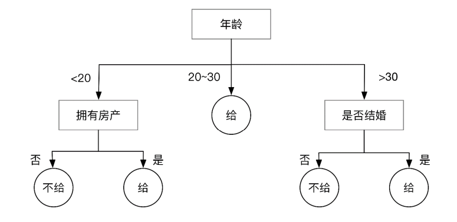
    - 信息增益：进行一个划分之后熵减少了多少。其中 D 是父节点样本数，Di 是第 i 个分支的样本数 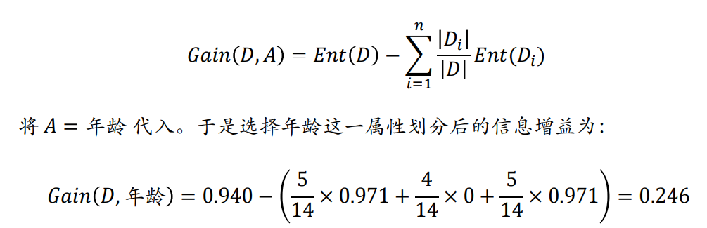
    - 信息增益率：一般来说分支越多，信息增益越大，容易造成决策树过拟合。引入 info 对多分支进行惩罚 
4. 线性判断分析（LDA, linear discriminant analysis），一种基于监督学习的降维方法
    - 投影：
    - 计算投影后的类内方差：其中 m1，m2 是类投影前的中心点坐标，矩阵大小为 (1 * n) * (n * n) * (n * 1)，n 是原数据维度，形似二次型 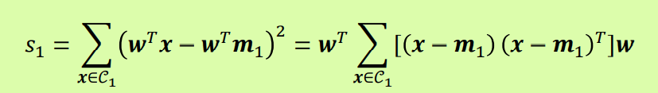
    - 最大化类间距离，最小化类内方差。这里 m1，m2 是投影后的类内均值 
    - 类间散度矩阵(between-class scatter matrix)、类内散度矩阵(within-class scatter matrix)：
    - 拉格朗日插值法：由于 𝐽(𝒘) 的分子和分母都是关于𝒘的二项式，因此最后的解只与 𝒘 的方向有关，与 𝒘 的长度无关（即便扩展或缩减 𝒘 ，𝒘T𝒘 所得长度也可被约分掉），因此可令分母𝒘𝑇𝑺𝑊𝒘 = 1，然后用拉格朗日乘子法，𝐿(𝒘) = 𝒘𝑇𝑺𝑏𝒘 − 𝜆(𝒘𝑇𝑺𝑤𝒘 − 1)，结果 
    - LDA 步骤描述： 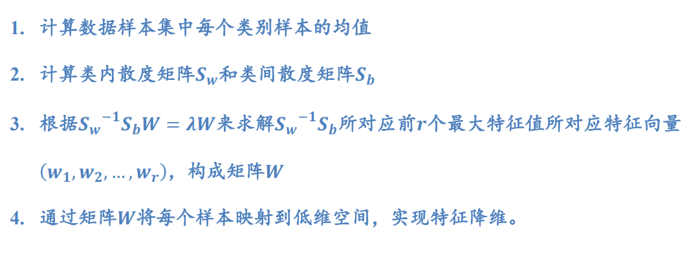
5. Ada Boosting 自适应提升
    - 概念：
        1. 概率近似正确(probably approximately correct, PAC)：如何知道假设是正确的，以及为了接近真实需要多少数据（霍夫丁不等式就是针对 PAC 问题的回答）
        2. 强可学习、弱可学习：两者等价，即如果已经发现了“弱学习算法”，可将其提升（boosting）为“强学习算法”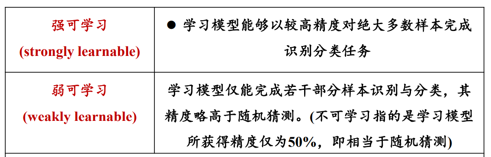
    - 步骤：
    - 实际上是在最小化指数损失函数

## 无监督学习

1. K 均值聚类
2. 主成分分析
3. 期望最大化算法