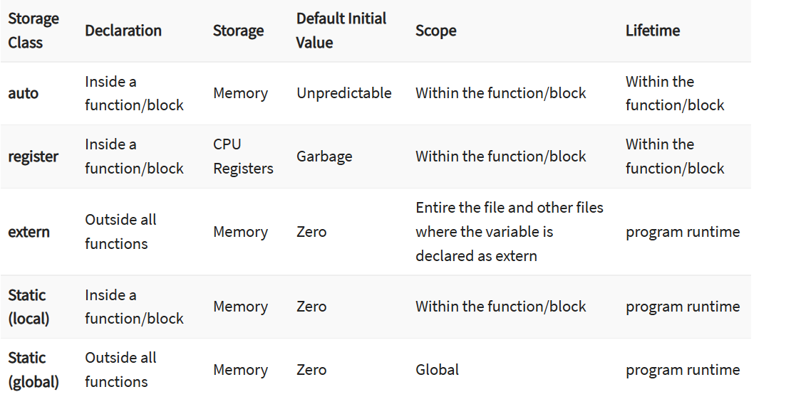

# 程序设计与算法基础

[TOC]

## 错题整理

### 知识点

1. 函数题：
    1. x 和 y 之间的素数，可能 x < y
2. 快速排序：
    1. 首先，在这个序列中随便找一个数作为基准数
    2. 这里可以用两个变量 i 和 j ，分别指向序列最左边和最右边，称作 “哨兵 i ” 和 “哨兵 j ”
    3. 左边的哨兵向右移动直到找到第一个大于基准数的数，右边的哨兵向左移动直到找到第一个小于基准数的数，交换这两个数
    4. 若 i > j 则把 j 指向的位置与基准数交换，分治 j 的左右两边
3. 归并排序：
    1. 从中间分成两段，分别递归
    2. 在临时数组中进行归并，需要 $O(n)$ 的空间
4. `scanf` 输入字符集：`scanf("%[^\n, ^ , ^\t]", str);` 表示读到回车、空格或者制表符时停止，最后的回车、空格、制表符会留在缓冲区
5. typedef :
    - 最初的目的是为了让不同机器上的类型拥有相同的长度 `typedef short int_16`
    - `typedef char Line[80]`：定义了一个变量类型 `Line`，`Line a = char[80]`
6. struct 的奇技淫巧：看起来是实现了一个可边长字符数组，但是实际上是分配了一段空白的区间，调用 `s.s[x]` 的时候实际上是访问到了结构体外面，但是内存不会越界。btw free 一个指针会把 malloc 的所有内存都释放，所以这里 free 没有问题。
    ```c
    typedef struct{
        int len;
        char s[];
    } string;
    string *s;
    s = (string *)malloc(sizeof(int) + 20);
    printf("%d\n", sizeof(string));
    printf("%d\n", sizeof(s));
    free(s);
    ```
7. 申请内存常用函数
    - `void * malloc(size)`
    - `void * realloc(pointer, size)` 重新分配一定大小的内存
    - `free(pointer)  释放内存`


### 题目

**1.**

A. 一个C语言源文件（.c文件）必须包含main函数
B. 一个C语言源文件（.c文件）可以包含两个以上main函数
C. C语言头文件（.h文件）和源文件(.c文件）都不需要进行编译
D. 在一个可以正确执行的C语言程序中，一个C语言函数的声明（原型）可以出现多次

D

**2.**

逗号表达式

函数调用语句function((a,b),c)中含有的实参个数为（ ）

**3.** 

组合数最快递归版（编程题）

$$C_n^m = \frac{m}{n}C_{n-1}^{m-1}$$

**4.**

假设运算符'*'和'%'都是右结合的，则表达式 (3*5%3) 的值为6。

T

**5.**

为了检查以下if-else语句的两个分支是否正确，至少需要设计2组测试用例，即x的取值至少有两组（不等于0的数和0）。

```c
if (x != 0){
   y = 1 / x;
} else{ 
   y = 0;
} 
```

T

**6.**

复杂的组合数据类型辨析 [贺老师推荐阅读材料](https://c-faq.com/decl/spiral.anderson.html)

```c
int *a[10]; // an array 10 of pointer to int
int (*a)[10]; // a pointer to array 10 of int
void (*signal(int, void (*fp)(int)))(int); // signal is a function passing an int and a pointer to a function passing an int returning nothing (void) returning a pointer to a function passing an int returning nothing (void)
```

**7.**

关于指针的一些论述（作业 W12，纠错）

1. 不同类型指针：
    1. 不同类型的指针变量是可以直接相互赋值的。
    2. 两个任意类型的指针可以使用关系运算符比较大小。
2. 数组的基地址是在内存中存储数组的起始位置，数组名本身就是一个地址即指针值。
3. 运算符优先级：
    1. `*++p+2` 的运算顺序是 `(*(++p))+2`，先单目运算符再双目运算符
    2. `*str[1]` 的运算顺序是 `*(str[1])` 所有括号包括方括号都是优先级最高的

**8.**

For the function declaration `void f(char ** p)`，the definition __ of `var` makes the function call `f(var)` incorrect。

A. `char var[10][10];`
B. `char *var[10];`
C. `void *var = NULL;`
D. `char *v=NULL, **var=&v;`

Ans: A，A 的类型是 `char *[10]`。本体强调数组首地址和指针之间的区别。

**9.**

结构相同的匿名结构体不算同一种类型。

```c
struct{
    int x, y;
}a;
struct{
    int x, y;
}b;
b = a;
```

(+) 结构体类型本身不占用内存空间，结构体变量占用内存空间。

**10.**

宏相关

1. 符号常量名和宏名：都是用宏定义的，只不过前者是用符号表示一个常量
2. 宏定义不是语句


**11.**

extern static register auto 关键字的用法

1. 对于变量

- 凡是函数中未指定存储类别的局部变量，其隐含的存储类型为 auto
- 未指定存储类别的全局变量，其隐含的存储类型为 extern



- extern 变量需要声明和定义。

```c
extern int i; //是声明，不是定义，没有分配内存
int i; //是定义
```

2. 对于自定义类型

- 最好在 `.h` 文件里定义，可以在包含 `.h` 文件的各个文件里使用。
- 如果类型已经定义在文件中，他的作用域只有文件本身以及 `include` 该文件的文件。在其他文件均可以重新定义同名自定义类型。同时 `typedef` 也可以多次使用，不算重复定义。

3. 对于函数

对于函数来说，默认 extern，可以被其他文件调用，但想要调用的话必须在其他文件里声明 `extern`。static 只能在本文件使用。

**12.**

编译链接相关

常见链接错误：

1. 符号未定义的错误经常发生在符号 **已经声明，但是并没有具体的定义** 的情况下。在C语言中，符号可以是一个函数，也可以是一个全局变量。在程序的编译过程中，只要符号被声明，编译就可以通过，但是在连接的过程中符号必须具有具体的实现才可以成功连接。
2. 符号重定义错误与符号未定义错误类似，如果连接器在连接的时候，发现一个符号在不同的地方有多于一个定义，这时就会产生符号重定义错误。对于同一个符号，如果在多个源文件中出现多次，将会产生符号重定义错误。

```c
#include <stdio.h>

void foo(int);
int main(){
    foo(2223);
    return 0;
} // 这段就是典型的链接错误
```

在C中，初始化发生在代码执行之前，编译阶段分配好内存之后，就会进行初始化，所以我们看到在C语言中无法使用变量对静态局部变量进行初始化


## 授课

### 思路

1. 指针的应用
    - 函数形参中的数组首指针, 多个 `**` 的嵌套的含义
2. 对语言熟悉的阶段：
    - 对语法不熟悉 -> 问问题 for/while 循环的循环次数，null 的含义和历史，char 在算数运算中的使用（unsigned char），
    - 看得懂语法但是读不出意思 
        - -> 限时读代码段说出意思 -> 读项目代码，命名规则：全大写（常量）、大驼峰（变量类型）、小驼峰（变量名）
        - 自然语言是否可以描述算法 -> 编程语言和自然语言阅读的相似之处：抽象出功能、模块化理解
    - 读得懂代码但是写得慢 -> 函数题：限时实现一个功能，发现自己慢在哪里，
    - 可以顺利写完一段代码但是 debug 时间很长：瞪眼法、输出调试法、gdb 等调试方法（数组右移：m>n 的情况，运算符优先级：或和与，数据范围）
        - 引入：“我想提升一下自己的代码能力，听说业界传言一种语言写满 50w 行就算精通了，我一天写几百行比较合适？”
        - 根本原因是你的逻辑和代码逻辑不匹配
        - 常见数据格式的内存大小，int 和 long 哪个更大
        - 熟悉语言的特性：面向对象 vs 面向过程？C 也有 class，为什么 C 是面向过程语言而 C++ 是面向对象语言？强类型弱类型？解释型编译型
        - hanoi tower 调试问题
    - 能顺利运行但是代码不够优美：封装、复用 -> e.g. timing 函数（测试函数的运行时间）
    - 推广到其他语言
3. struct / class 的内存分配
    - 两个 int 指针指向一个 longlong 的前后两段会有什么结果？ -> 低端字节序
4. for 语句的非常规用法
    - 邻接表存边
    - 求一个数字的各位数字之和：用一个 for 循环写完

讲课需求：

- **数据类型知识点整理和数组例题讲解** + 字符数组
- 新鲜思路和容易出现但不容易发现的 bug
- 针对某种题型的复习和整理，面向考试


## 每日一题

### 1 

one for all

Anya has been spending a lot of time studying programming recently, implementing plenty of functions for practice. However, she won't get a :star:star:star: unless these functions are $\mathcal{Elegant}$ in Mr.Henderson's perspective. As is known to all, Mr.Henderson likes functions that are short and powerful. He will be happy especially if one function consists only of one "for loop", which he calls "one for all". Please help Anya simplify the following functions into one for loop and win her a precious :star:star:star:!

1.

Note that `int T, a[1001]` are declared as global variables.

```c
int myRead(int x){
    scanf("%d", &T);
    for (int i = 0; i < T; ++ i){
        scanf("%d", a + i);
    }
}
```

Answer:

This simplification is often used when you want to read multiple test cases, where `T` is the number of test cases.

```c
int myRead(int x){
    for (scanf("%d", &T); T--; ){
        scanf("%d", a + i);
    }
}
```

2. 

`int value[1001], _next[1001]` are declared as global variables, where `_next[i]` represents the next index of the i-th element(-1 if there is no next).

hint: Determine which sentence is the initialization, which is the loop condition, and which is increment.

```c
void traversal(int _start){
    int now = _start;
    while (now != -1){
        printf("%d\n", value[now]);
        now = _next[now];
    }
}
```

Answer:

This for loop will be useful if you want to traverse a chained list, such as adjacent list for edges in a graph.

```c
void traversal(int _start){
    for (int now = _start; now != -1; now = _next[now]){
        printf("%d\n", value[now]);
    }
}
```