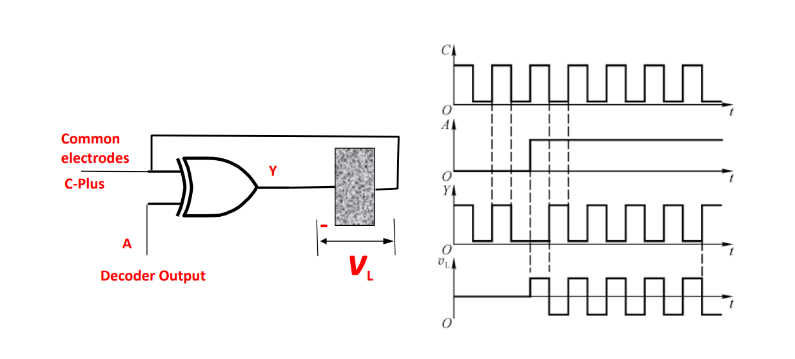
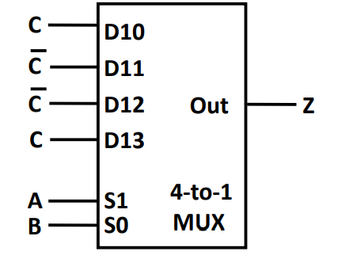

# 计算机逻辑设计基础

[TOC]

## ISE 的安装

1. 安装 14.7 版本，不要安装 windows10 特供版
2. [解决 license manager 闪退问题](https://blog.csdn.net/qq_43066051/article/details/108695253)
3. [解决 iMPACT:923 - Can not find cable, check cable setup ! 问题](https://blog.csdn.net/qq_24815615/article/details/80382184)：重新安装驱动可以解决问题，还报错就换块板子

## ISE 使用基本步骤

### 前置芝士

1. `.xise` 文件：工程文件（导入工程用这个文件）
2. `.v` 文件：Verilog 输入源文件，定义电路输入输出和逻辑
3. `.tbw` 文件：基准测试波形文件
4. `.ucf` 文件：时序约束 + 引脚分配
    - 语法举例：`NET "F" LOC = AF24 | IOSTANDARD = LVCMOS33; #comment here`


### verilog 工程

1. 新建工程
    1. File -> New Project
    2. Top-Level Source Type: HDL
    3. 设置：
        - Family: Kintex7
        - Device: XC7K160T
        - Package: FFG676
        - Speed: -1
2. verilog 输入源文件(.v)
    1. 新建：
        1. Implementation 窗口空白处的右键菜单中选择 New Source
        2. 选择源类型为 Verilog Module
        3. Add to Project 打钩
        4. 可以选择定义输入输出端口
    2. 导入：
        1. Implementation 窗口空白处的右键菜单中选择 Add Copy to Source (复制文件到当前 workspace)
        2. 选择 .v 文件
3. verilog 输入源文件调试和运行
    1. 在 Sources 窗口选中 .v 文件
    2. 在 Processes 窗口运行 Synthesis XST
    3. 在 Processes 窗口运行 View RTL Schematic
        - 在 Available Elements 中选择 Verilog 输入源文件
        - Add
        - Create Schematic
4. 建立基准测试波形文件(.tbw)
    1. 新建
        1. 在 Sources 窗口空白处的右键菜单中选择 New Source
        2. 选择源类型为 Verilog Test Fixture
        3. Add to Project 打钩
        4. Associate Project：选择需要关联的 verilog 输入源文件
    2. 导入：同上
5. 波形文件编写和运行
    1. 在 Simulation 窗口找到 _sim.v 文件(一般命名为源文件名_sim)
    2. 运行
        1. Simulation 窗口选 _sim.v 文件
        2. Processes 窗口双击 Behavioral Check Syntax
        3. Processes 窗口双击 Simulate Behavioral Model
        4. 成功将会打开模拟程序软件 ISim
    3. 查看
        1. 点击 Zoom to Full View  （模拟运行结果只显示最后1NS的波形，全屏显示可以看到1us的全部波形）
        2. 可用操作：Run for the time specified on the toolbar 运行到指定时间 
        3. 可用操作：Restart 
6. 建立时序约束 + 为端口指定引脚分配(.ucf)
    1. 新建
        1. 在 Sources 窗口空白处的右键菜单中选择 New Source
        2. 选择源类型为 Implementation Constraints File
        3. Add to Project 打钩
    2. 导入：同上
7. 在 SWORD 板上运行
    1. Implementation 窗口选 .ucf 关联的 .v 文件
    2. Processes 窗口双击 Implement design
    3. 在快捷栏点击 Project -> Design Summary/Report -> Show Warnings / Show Reports 查看错误
    4. Processes 窗口双击 Generate Programming File
    5. 把工程复制到学校电脑，进行后续步骤：
        1. Processes 窗口双击 Config Target Device 下的 Manage Configuration Project(iMPACT)
        2. 双击 Boundary Scan 弹出下载编辑窗口
        3. 鼠标右键选择 Initialize Chain，系统自动查找已连接在电脑上的开发平台 JTAG 下载链
        4. 选择 bit 文件打开（注意文件位置）
        5. Attach SPI or BPI PROM 窗口单击 NO
        6. Device Programming Propertier 窗口 单击OK
        7. 右击弹出窗口，单击 Program
        - 然后就可以在板子上看到结果了

### Schematic 工程

1. 新建工程
    1. File -> New Project
    2. Top-Level Source Type: Schematic
    3. 设置：
        - Family: Kintex7
        - Device: XC7K160T
        - Package: FFG676
        - Speed: -1
2. 创建原理图文件(.sch)
    1. Implementation 窗口空白处的右键菜单中选择 New Source
    2. 选择源类型为 Schematic
    3. Add to Project 打钩
3. 画图工具
    1. 元器件
        1. 新建元器件：Symbols，搜索元器件名称
        2. 元器件重命名：双击，修改 InstName Value，选中 visible
        3. 新建输入输出
        4. 输入输出重命名：右键，Rename，若需要改成多位则形如 `S(3:0)`
        5. 多位输入输出重命名：双击，修改 Nets 下的名称，点击 OK
    2. 连线
        1. 图标：
        2. 总线：画一根线，接一个输入或者输出，输入修改为多位，形如 `S(3:0)`
        3. 总线接口：点击 Bus Tap 图标，点击总线，选择接口编号，点击需要连接的线头
4. 建立基准测试波形文件(.tbw)
    1. 新建
        1. 在 Sources 窗口空白处的右键菜单中选择 New Source
        2. 选择源类型为 Verilog Test Fixture
        3. Add to Project 打钩
        4. Associate Project：选择需要关联的 verilog 输入源文件
    2. 导入：同上
5. 波形文件编写和运行
    1. 在 Simulation 窗口找到 _sim.v 文件(一般命名为源文件名_sim)
    2. 运行
        1. Simulation 窗口选 _sim.v 文件
        2. Processes 窗口双击 Behavioral Check Syntax
        3. Processes 窗口双击 Simulate Behavioral Model
        4. 成功将会打开模拟程序软件 ISim
    3. 查看
        1. 点击 Zoom to Full View  （模拟运行结果只显示最后1NS的波形，全屏显示可以看到1us的全部波形）
        2. 可用操作：Run for the time specified on the toolbar 运行到指定时间 
        3. 可用操作：Restart 
6. 建立时序约束 + 为端口指定引脚分配(.ucf)
    1. 新建
        1. 在 Sources 窗口空白处的右键菜单中选择 New Source
        2. 选择源类型为 Implementation Constraints File
        3. Add to Project 打钩
    2. 导入：同上
7. 在 SWORD 板上运行
    1. Implementation 窗口选 .ucf 关联的 .v 文件
    2. Processes 窗口双击 Implement design
    3. 在快捷栏点击 Project -> Design Summary/Report -> Show Warnings / Show Reports 查看错误
    4. Processes 窗口双击 Generate Programming File
    5. 把工程复制到学校电脑，进行后续步骤：
        1. Processes 窗口双击 Config Target Device 下的 Manage Configuration Project(iMPACT)
        2. 双击 Boundary Scan 弹出下载编辑窗口
        3. 鼠标右键选择 Initialize Chain，系统自动查找已连接在电脑上的开发平台 JTAG 下载链
        4. 选择 bit 文件打开（注意文件位置）
        5. Attach SPI or BPI PROM 窗口单击 NO
        6. Device Programming Propertier 窗口 单击OK
        7. 右击弹出窗口，单击 Program
        - 然后就可以在板子上看到结果了
8. 生成逻辑符号图和VF文件
    1. 展开 Design Utilities，点击 Create Schematic Symbol，系统生成模块的逻辑符号图文件，文件后缀.sym
    2. 展开 Design Utilities，点击 View HDL Function Model， 会产生.vf文件
    3. 使用时，把 .sym 和 .vf 添加到工程中，ADD NEW SCOURE，就可以在 symbols 栏看到模块

注意：
1. 如果无法运行指定的文件，并右键设为“Top Module”


### 常用波形文件

注意：
1. 变量定义在 `initial begin` 前面
2. 自动生成的文件要去掉 `ifdef` 加上 `end`

```verilog
// Verilog test fixture created from schematic F:\programfiles2022\Xilinx\WorkSpace\D_74LS138_SCH\D_74LS138.sch - Thu Oct 13 20:41:43 2022

`timescale 1ns / 1ps

module D_74LS138_D_74LS138_sch_tb();

// Inputs
   reg Input_1;
   reg Input_2;
   reg Input_0;
   reg G;
   reg G_2A;
   reg G_2B;

// Output
   wire [7:0] LED;

// Bidirs

// Instantiate the UUT
   D_74LS138 UUT (
		.Input_1(Input_1), 
		.Input_2(Input_2), 
		.Input_0(Input_0), 
		.LED(LED), 
		.G(G), 
		.G_2A(G_2A), 
		.G_2B(G_2B)
   );
// Initialize Inputs
	integer i;
	initial begin
		Input_1 = 0;
		Input_2 = 0;
		Input_0 = 0;
		G = 1;
		G_2A = 0;
		G_2B = 0;
		#50;
		
		for (i = 0; i < 8; i = i + 1)
		begin
			{Input_2, Input_1, Input_0} = i;
			#50;
		end
	end
endmodule
```

### 常用引脚约束文件

注意：
1. `|` 前后加空格

```verilog
NET"S1"LOC=AA10 | IOSTANDARD=LVCMOS15;#电压说明
NET"S2"LOC=AB10 | IOSTANDARD=LVCMOS15;
NET"S3"LOC=AA13 | IOSTANDARD=LVCMOS15;
NET"F"LOC=AF24  | IOSTANDARD=LVCMOS33 ;#D8
#NET"Buzzer"LOC=AF25 | IOSTANDARD=LVCMOS33 ;
#NET"LED[0]"LOC=W23  | IOSTANDARD=LVCMOS33 ;#D1
#NET"LED[1]"LOC=AB26 | IOSTANDARD=LVCMOS33 ;#D2
#NET"LED[2]"LOC=Y25  | IOSTANDARD=LVCMOS33 ;#D3
#NET"LED[3]"LOC=AA23 | IOSTANDARD=LVCMOS33 ;#D4
#NET"LED[4]"LOC=Y23  | IOSTANDARD=LVCMOS33 ;#D5
#NET"LED[5]"LOC=Y22  | IOSTANDARD=LVCMOS33 ;#D6
#NET"LED[6]"LOC=AE21 | IOSTANDARD=LVCMOS33 ;#D7
```

## 可用模块


## 课内知识点

### Chapter 1

1. 4 位以下的格雷码可以用卡诺图构造

### Chapter 2

1. 卡诺图：注意 10 和 11 是反的，一行内的反容易发现，第 3 行和第 4 行反容易忘

### Chapter 3 组合逻辑电路设计

1. 设计基本步骤
    1. specification：明确逻辑功能，输入，输出
    2. Formulation：写出逻辑表达式 
        - 真值表
        - MinTerm or MaxTerm
    3. Optimization：
        1. 化简表达式
            - 公式法
            - 卡诺图
        2. 提取可复用模块
            - 成本计算：所有门电路的输入端之和，例如 $X=BT+BCD,G=7$
            - 香农展开定理 -> 常用模块
    4. Technology Mapping：转化为 VHDL 代码或者 schematic
        - tips:
            - MinTerm = 一排输入连非门 + 一排 and + 一排 or
            - 不同输出可以分开来画图，但是同一个输入最好只有一个端口
        - to NAND gates: 用非门和与非门表示所有门电路并化简（化简思路主要是非非抵消）
    - e.g.1 BCD to excess-3 code: 4 位二进制数 +3 运算
2. 基本逻辑模块
    1. Enabling：不能的时候 F 可以出 0 或 1
    2. Decoder:
        - e.g. 2-to-4 decoder, 3-to-8 decoder （不用的输入端口可以接地，不用的输出端口可以空着）
        - expansion: 可以用 n-to-$2^n$ 的模块加一个新的输入位做 (n+1)-to-$2^{n+1}$ 的模块
        - with enable：在每一个输出端口后面都加一个与门，控制是否输出
        - LCD 控制模块
        
    3. Encoder：
        - e.g. 4-to-2 encoder, 8-to-3 encoder
        - priority encoder: 
            - 目的：让每一种输入都有对应的输出，而不是只有 n 种合法输入
            - 实现：输出条件为某一位 1 且比他优先的位全都是 0
    4. Multiplexer:
        - 输入输出：控制位(e.g. S0 - S2)，输入位(e.g. I0 - I7)，输出位(Y)
        - 组成：n-to-$2^n$ 的 decoder + $2^n$ 个 enable
        - width expansion: 同一个 S 控制多组 I，实现方法是一个 decoder 连到多组平行的 enable
    - 用以上模块实现任何组合逻辑电路：
        1. decoder + or: 每个 or 代表一个输出，相当于用 MinTerm 表示输出
        2. multiplexer: S 位输入，I 位填充真值表
            - 用 n 位 multiplexer 实现 n+k 输入的逻辑功能：把剩下的那 k 位放到 I 位实现
            


