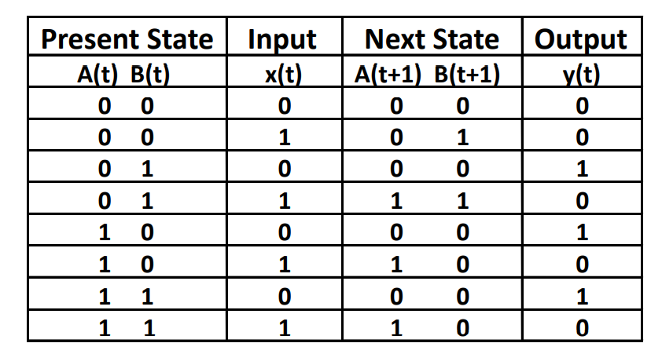
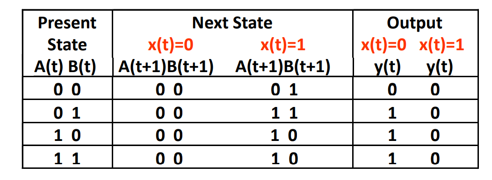

# 计算机逻辑设计基础

[TOC]

## ISE 的安装

1. 安装 14.7 版本，不要安装 windows10 特供版
2. [解决 license manager 闪退问题](https://blog.csdn.net/qq_43066051/article/details/108695253)
3. [解决 iMPACT:923 - Can not find cable, check cable setup ! 问题](https://blog.csdn.net/qq_24815615/article/details/80382184)：重新安装驱动可以解决问题，还报错就换块板子

## ISE 使用基本步骤

### 前置芝士

1. `.xise` 文件：工程文件（导入工程用这个文件）
2. `.v` 文件：Verilog 输入源文件，定义电路输入输出和逻辑
3. `.tbw` 文件：基准测试波形文件
4. `.ucf` 文件：时序约束 + 引脚分配
    - 语法举例：`NET "F" LOC = AF24 | IOSTANDARD = LVCMOS33; #comment here`


### verilog 工程

1. 新建工程
    1. File -> New Project
    2. Top-Level Source Type: HDL
    3. 设置：
        - Family: Kintex7
        - Device: XC7K160T
        - Package: FFG676
        - Speed: -1
2. verilog 输入源文件(.v)
    1. 新建：
        1. Implementation 窗口空白处的右键菜单中选择 New Source
        2. 选择源类型为 Verilog Module
        3. Add to Project 打钩
        4. 可以选择定义输入输出端口
    2. 导入：
        1. Implementation 窗口空白处的右键菜单中选择 Add Copy to Source (复制文件到当前 workspace)
        2. 选择 .v 文件
3. verilog 输入源文件调试和运行
    1. 在 Sources 窗口选中 .v 文件
    2. 在 Processes 窗口运行 Synthesis XST
    3. 在 Processes 窗口运行 View RTL Schematic
        - 在 Available Elements 中选择 Verilog 输入源文件
        - Add
        - Create Schematic
4. 建立基准测试波形文件(.tbw)
    1. 新建
        1. 在 Sources 窗口空白处的右键菜单中选择 New Source
        2. 选择源类型为 Verilog Test Fixture
        3. Add to Project 打钩
        4. Associate Project：选择需要关联的 verilog 输入源文件
    2. 导入：同上
5. 波形文件编写和运行
    1. 在 Simulation 窗口找到 _sim.v 文件(一般命名为源文件名_sim)
    2. 运行
        1. Simulation 窗口选 _sim.v 文件
        2. Processes 窗口双击 Behavioral Check Syntax
        3. Processes 窗口双击 Simulate Behavioral Model
        4. 成功将会打开模拟程序软件 ISim
    3. 查看
        1. 点击 Zoom to Full View  （模拟运行结果只显示最后1NS的波形，全屏显示可以看到1us的全部波形）
        2. 可用操作：Run for the time specified on the toolbar 运行到指定时间 
        3. 可用操作：Restart 
6. 建立时序约束 + 为端口指定引脚分配(.ucf)
    1. 新建
        1. 在 Sources 窗口空白处的右键菜单中选择 New Source
        2. 选择源类型为 Implementation Constraints File
        3. Add to Project 打钩
    2. 导入：同上
7. 在 SWORD 板上运行
    1. Implementation 窗口选 .ucf 关联的 .v 文件
    2. Processes 窗口双击 Implement design
    3. 在快捷栏点击 Project -> Design Summary/Report -> Show Warnings / Show Reports 查看错误
    4. Processes 窗口双击 Generate Programming File
    5. 把工程复制到学校电脑，进行后续步骤：
        1. Processes 窗口双击 Config Target Device 下的 Manage Configuration Project(iMPACT)
        2. 双击 Boundary Scan 弹出下载编辑窗口
        3. 鼠标右键选择 Initialize Chain，系统自动查找已连接在电脑上的开发平台 JTAG 下载链
        4. 选择 bit 文件打开（注意文件位置）
        5. Attach SPI or BPI PROM 窗口单击 NO
        6. Device Programming Propertier 窗口 单击OK
        7. 右击弹出窗口，单击 Program
        - 然后就可以在板子上看到结果了

### Schematic 工程

1. 新建工程
    1. File -> New Project
    2. Top-Level Source Type: Schematic
    3. 设置：
        - Family: Kintex7
        - Device: XC7K160T
        - Package: FFG676
        - Speed: -1
2. 创建原理图文件(.sch)
    1. Implementation 窗口空白处的右键菜单中选择 New Source
    2. 选择源类型为 Schematic
    3. Add to Project 打钩
3. 画图工具
    1. 元器件
        1. 新建元器件：Symbols，搜索元器件名称
        2. 元器件重命名：双击，修改 InstName Value，选中 visible
        3. 新建输入输出
        4. 输入输出重命名：右键，Rename，若需要改成多位则形如 `S(3:0)`
        5. 多位输入输出重命名：双击，修改 Nets 下的名称，点击 OK
    2. 连线
        1. 图标：
        2. 总线：画一根线，接一个输入或者输出，输入修改为多位，形如 `S(3:0)`
        3. 总线接口：点击 Bus Tap 图标，点击总线，选择接口编号，点击需要连接的线头
        4. 导线重命名：双击导线 -> 分别修改 Nets 和 Nets 下属元件的 Name 属性
            - 如果导线重名则认为这两条导线相连，如果总线命名为 `V1, V2, V3, V4` 则认为这 4 条导线依次接入总线
            - Visible Add 将导线名称添加到导线边上
    3. 快捷键
        1. Ctrl + R：实现symbole方向改变
        2. 双击空白画布处：schematic Sheet 改变尺寸大小
4. 建立基准测试波形文件(.tbw)
    1. 新建
        1. 在 Sources 窗口空白处的右键菜单中选择 New Source
        2. 选择源类型为 Verilog Test Fixture
        3. Add to Project 打钩
        4. Associate Project：选择需要关联的 verilog 输入源文件
    2. 导入：同上
5. 波形文件编写和运行
    1. 在 Simulation 窗口找到 _sim.v 文件(一般命名为源文件名_sim)
    2. 运行
        1. Simulation 窗口选 _sim.v 文件
        2. Processes 窗口双击 Behavioral Check Syntax
        3. Processes 窗口双击 Simulate Behavioral Model
        4. 成功将会打开模拟程序软件 ISim
    3. 查看
        1. 点击 Zoom to Full View  （模拟运行结果只显示最后1NS的波形，全屏显示可以看到1us的全部波形）
        2. 可用操作：Run for the time specified on the toolbar 运行到指定时间 
        3. 可用操作：Restart 
6. 建立时序约束 + 为端口指定引脚分配(.ucf)
    1. 新建
        1. 在 Sources 窗口空白处的右键菜单中选择 New Source
        2. 选择源类型为 Implementation Constraints File
        3. Add to Project 打钩
    2. 导入：同上
7. 在 SWORD 板上运行
    1. Implementation 窗口选 .ucf 关联的 .v 文件
    2. Processes 窗口双击 Implement design
    3. 在快捷栏点击 Project -> Design Summary/Report -> Show Warnings / Show Reports 查看错误
    4. Processes 窗口双击 Generate Programming File
    5. 把工程复制到学校电脑，进行后续步骤：
        1. Processes 窗口双击 Config Target Device 下的 Manage Configuration Project(iMPACT)
        2. 双击 Boundary Scan 弹出下载编辑窗口
        3. 鼠标右键选择 Initialize Chain，系统自动查找已连接在电脑上的开发平台 JTAG 下载链
        4. 选择 bit 文件打开（注意文件位置）
        5. Attach SPI or BPI PROM 窗口单击 NO
        6. Device Programming Propertier 窗口 单击OK
        7. 右击弹出窗口，单击 Program
        - 然后就可以在板子上看到结果了
8. 生成逻辑符号图和VF文件
    1. 展开 Design Utilities，点击 Create Schematic Symbol，系统生成模块的逻辑符号图文件，文件后缀.sym
    2. 展开 Design Utilities，点击 View HDL Function Model， 会产生.vf文件
    3. 使用时，把 .sym 和 .vf 添加到工程中，ADD NEW SCOURE，就可以在 symbols 栏看到模块或者在 verilog 代码中使用
        - 注意：使用模块的时候需要同时调用模块依赖的其他模块

**注意：**
1. 如果无法运行（或者进行波形模拟）指定的文件，右键设为“Top Module”
2. 如果修改了模块类型，同时存在 .vf 和 .v 文件，去掉其中一个，否则可能默认选择 .vf 文件生成模块。
3. 无法重新生成 sym：
    - 右键 -> Process Properties -> 允许覆盖打钩
    - 右键 -> ReRun
4. 同一个项目的不同模块放在同一个项目里，否则修改模块之后需要沿继承树更新，很麻烦。
5. 在 generate programming file 时报错可以去 map 以及之前的 warning 中找问题。报错找不到端口有可能是因为端口悬空。

## 常用波形文件

注意：
1. 变量定义在 `initial begin` 前面
2. 自动生成的文件要去掉 `ifdef` 加上 `end`


```verilog
for (i = 0; i < 8; i = i + 1)
begin
    {Input_2, Input_1, Input_0} = i;
    #50;
end
```

时钟输入

```verilog
initial forever begin
    clk = 1'b0; #20;
    clk = 1'b1; #20;
end
```

## 常用引脚约束文件

注意：
1. `|` 前后加空格

### LED 灯

```verilog
#NET"LED[0]"LOC=W23  | IOSTANDARD=LVCMOS33 ;#D1
#NET"LED[1]"LOC=AB26 | IOSTANDARD=LVCMOS33 ;#D2
#NET"LED[2]"LOC=Y25  | IOSTANDARD=LVCMOS33 ;#D3
#NET"LED[3]"LOC=AA23 | IOSTANDARD=LVCMOS33 ;#D4
#NET"LED[4]"LOC=Y23  | IOSTANDARD=LVCMOS33 ;#D5
#NET"LED[5]"LOC=Y22  | IOSTANDARD=LVCMOS33 ;#D6
#NET"LED[6]"LOC=AE21 | IOSTANDARD=LVCMOS33 ;#D7
```

### 数字显示

```verilog
NET"SEGMENT[0]"LOC=AB22 | IOSTANDARD=LVCMOS33; #a
NET"SEGMENT[1]"LOC=AD24 | IOSTANDARD=LVCMOS33; #b
NET"SEGMENT[2]"LOC=AD23 | IOSTANDARD=LVCMOS33; #c
NET"SEGMENT[3]"LOC=Y21 | IOSTANDARD=LVCMOS33; #d
NET"SEGMENT[4]"LOC=W20 | IOSTANDARD=LVCMOS33; #e
NET"SEGMENT[5]"LOC=AC24 | IOSTANDARD=LVCMOS33; #f
NET"SEGMENT[6]"LOC=AC23 | IOSTANDARD=LVCMOS33; #g
NET"SEGMENT[7]"LOC=AA22 | IOSTANDARD=LVCMOS33; #p
NET"AN[0]"LOC=AD21 | IOSTANDARD=LVCMOS33; # enable number 0 display
NET"AN[1]"LOC=AC21 | IOSTANDARD=LVCMOS33; # enable number 1 display
NET"AN[2]"LOC=AB21 | IOSTANDARD=LVCMOS33; # enable number 2 display
NET"AN[3]"LOC=AC22 | IOSTANDARD=LVCMOS33; # enable number 3 display
```

### 开关

```verilog
NET"SW[0]"LOC=AB10 | IOSTANDARD=LVCMOS15;
NET"SW[1]"LOC=AA13 | IOSTANDARD=LVCMOS15;
NET"SW[2]"LOC=AA12 | IOSTANDARD=LVCMOS15;
NET"SW[3]"LOC=Y13 | IOSTANDARD=LVCMOS15;
NET"SW[4]"LOC=Y12 | IOSTANDARD=LVCMOS15;
NET"SW[5]"LOC=AD10 | IOSTANDARD=LVCMOS15;
NET"SW[6]"LOC=AE10 | IOSTANDARD=LVCMOS15;
NET"SW[7]"LOC=AE12 | IOSTANDARD=LVCMOS15;
```

### 按钮

```verilog
NET"btn[0]"LOC=W14 | IOSTANDARD=LVCMOS18;
NET"btn[0]"clock_dedicated_route=false;
NET"btn[1]"LOC=V14 | IOSTANDARD=LVCMOS18;
NET"btn[1]"clock_dedicated_route=false;
NET"btn[2]"LOC=V19 | IOSTANDARD=LVCMOS18;
NET"btn[2]"clock_dedicated_route=false;
NET"btn[3]"LOC=V18 | IOSTANDARD=LVCMOS18;
NET"btn[3]"clock_dedicated_route=false;
NET"BTNX4"LOC=W16 | IOSTANDARD=LVCMOS18; // 按钮的使能，低电平触发
```

### 时钟

```verilog
NET"clk"LOC=AC18 | IOSTANDARD=LVCMOS18;
```


## 可用模块

1. D_74LS138：3-8 decoder
    ```verilog
    Enable = G && !G_2A && !G_2B
    ```
2. MyMC14495: 1 位 16 进制数在 LED 上显示
    ```verilog
    EN = !LE // LE 为 0 的时候正常显示
    p = !point // point 为 1 的时候小数点亮，输出为 0 表示 LED 亮
    ```
3. DispNumber_sch: 1 位 16 进制数在 LED 上显示
    ```verilog
    input [1:0] BTN; // BTN[0] 控制 LE, BTN[1] 控制 point
    input [7:0] SW; // SW[3:0] 16 进制数
    output [3:0] AN; // AN[3:0] = SW[7:4]，4 个数码管的低电平有效使能信号，即 AN[i] == 0 表示第 i 个数字显示
    output [7:0] SEGMENT; // 输出 a-g, p
    ```
4. clkdiv: 时钟分频器
    ```verilog
    input clk, // 输入时钟信号
    input rst, // reset
    output reg[31:0]clkdiv // 输出以 2^i 个时钟周期为周期的时钟信号
    ```
5. Mux4to1: 4-1 Multiplexer
6. Mux4to1b4_sch: 4-1 Multiplexer，输入输出 4 位向量
7. disp_num: 4 位 16 进制数在 LED 上显示
    - 按顺序每次只亮一组数码管，利用视觉暂留达到显示 4 个数字的效果，也便于刷新。
    ```verilog
    input clk;
    input [15:0] HEXS;
    input [3:0] LES;
    input [3:0] points;
    input RST;
    output [3:0] AN;
    output [7:0] Segment;
    ```
8. 

## Verilog 语法

### 组合逻辑电路

1. wire：导线
2. reg：寄存器
3. assign：相当于连线，一般是将一个变量的值不间断地赋值给另一个变量，就像把这两个变量连在一起，所以习惯性的当做连线用，比如把一个模块的输出给另一个模块当输入。

## 课内知识点

### Chapter 1 编码

1. 4 位以下的格雷码可以用卡诺图构造

### Chapter 2 组合逻辑电路基操

1. 卡诺图：注意 10 和 11 是反的，一行内的反容易发现，第 3 行和第 4 行反容易忘

### Chapter 3 组合逻辑电路设计

1. 设计基本步骤
    1. specification：明确逻辑功能，输入，输出
    2. Formulation：写出逻辑表达式 
        - 真值表
        - MinTerm or MaxTerm
    3. Optimization：
        1. 化简表达式
            - 公式法
            - 卡诺图
        2. 提取可复用模块
            - 成本计算：所有门电路的输入端之和，例如 $X=BT+BCD,G=7$
            - 香农展开定理 -> 常用模块
    4. Technology Mapping：转化为 VHDL 代码或者 schematic
        - tips:
            - MinTerm = 一排输入连非门 + 一排 and + 一排 or
            - 不同输出可以分开来画图，但是同一个输入最好只有一个端口
        - to NAND gates: 用非门和与非门表示所有门电路并化简（化简思路主要是非非抵消）
    - e.g.1 BCD to excess-3 code: 4 位二进制数 +3 运算
2. 基本逻辑模块
    1. Enabling：不能的时候 F 可以出 0 或 1
    2. Decoder:
        - e.g. 2-to-4 decoder, 3-to-8 decoder （不用的输入端口可以接地，不用的输出端口可以空着）
        - expansion: 可以用 n-to-$2^n$ 的模块加一个新的输入位做 (n+1)-to-$2^{n+1}$ 的模块
        - with enable：在每一个输出端口后面都加一个与门，控制是否输出
        - LCD 控制模块
        
    3. Encoder：
        - e.g. 4-to-2 encoder, 8-to-3 encoder
        - priority encoder: 
            - 目的：让每一种输入都有对应的输出，而不是只有 n 种合法输入
            - 实现：输出条件为某一位 1 且比他优先的位全都是 0
    4. Multiplexer:
        - 输入输出：控制位(e.g. S0 - S2)，输入位(e.g. I0 - I7)，输出位(Y)
        - 组成：n-to-$2^n$ 的 decoder + $2^n$ 个 enable
        - width expansion: 同一个 S 控制多组 I，实现方法是一个 decoder 连到多组平行的 enable
    - 用以上模块实现任何组合逻辑电路：
        1. decoder + or: 每个 or 代表一个输出，相当于用 MinTerm 表示输出
        2. multiplexer: S 位输入，I 位填充真值表
            - 用 n 位 multiplexer 实现 n+k 输入的逻辑功能：把剩下的那 k 位放到 I 位实现
            
3. 算术功能模块
    - to be continued（记得把之前的几个模块的原理图和输入输出图给贴上去）


### Chapter 4 时序电路

#### 时序电路基本概念

1. 定义：组合逻辑电路 + 存储元件
2. 分类：
    - 同步：状态变化发生在离散的时间点，需要有时钟信号(clock pulse)来触发状态变化
    - 异步：状态变化依赖输入信号在连续时间内的变化，以及不同输入信号的变化顺序
3. 模拟时序电路 -- Circuit Delay Model
    - 基本假设：电位变化瞬间发生 & 延迟固定
    - 延迟一般在 0.1 ns 量级，若时钟信号在 100 ns 量级则可以忽略延迟

#### 时序电路存储模块

1. 锁存器(latch)
    1. RS-Latch
        - 与非门 0 触发，或非门 1 触发
    2. clocked RS-Latch：只在 C 输入高电平的时候更改状态
    3. D-Latch：消除不确定(indeterminate)状态
    - 空翻现象：在同一个时钟周期里输出变化多次并导致结果不确定
2. 触发器(flip-flop / trigger)
    - 名称：Master-slave Flip-flop 强调结构，是两个锁存器的叠加； Edge-triggered Flip-flop 强调功能，只在时钟信号发生变化的时候变化状态
    - 分类：
        1. 脉冲触发（master-slave RS-flipflop）：存在一次性采样问题（1s catching）
        2. 边沿触发（master-slave D-flipflop）
            1. 正边沿（在时钟信号由 0 变 1 的时候改变状态）触发
            2. 负边沿（在时钟信号由 1 变 0 的时候改变状态）触发
    - D-flipflop 的实际实现： 
    - 直接输入：就是上图中的 $\overline{S},\overline{R}$ 两个输入端，可以异步改变输出状态，用于初始化
    - 触发器的标准图形符号（注意小圆圈代表的含义） 
    - 其他注意点：
        1. 为了避免延迟，在同一个电路中一般使用同一种边沿的触发器，或者产生经过校正同步的正向脉冲和负向脉冲。为了使触发器状态保持，可以使用门控时钟，但是要注意门控产生的延迟。
        2. 脉冲触发和边沿触发的区别：
            - 根本原因是 D 锁存器和 RS 锁存器触发机制的不同，只要用到的锁存器有保持功能则触发器一定是脉冲触发。
            - 区别主要体现在 $t_s$ 的不同。
            - 脉冲触发第二级的输出需要考察整个高电平脉冲期间的输入变化才能知道，在高电平期间如果输入出现异常跳动，结果可能出错；边沿触发第二级输出只需要考察边沿前很小一段时间的输入即可。原因是：RS 触发器有输入对应保持的情况，输入变化输出不一定变化。
3. 其他触发器
    1. J-K flip-flop：$J\not=K$ 赋值，$J=K$ 保持或者取反。下图中因为保持功能是用组合逻辑来实现的，所以是边沿触发。 
    2. T flip-flop：把 J-K flip-flop 的 J 和 K 连起来即可 

#### 时序电路分析

1. 输入方程和次态方程：
    - 输出方程：例如 $D_A = AX+BX$
    - 次态方程：例如 $A(t+1) = D_A(t) = A(t)X(t)+B(t)X(t)$，两个方程本质相同，求解的方法如下图 
2. 状态表：当前状态 + 输入 + 下一状态（次态） + 输出。可以用一维表格的画法，也可以用类似于卡诺图的二维表格。  
3. 状态图 for FSM(Finite State Machine)：
    - 分类：
        - Mealy：输出由输入和状态决定，把输出标在箭头上
            - 圆圈里是状态编号
            - 箭头上是输入 & 输出 
        - Moore：输出仅由状态决定，把输出标在状态的圆圈里
            - 圆圈里是状态编号 & 输出
            - 箭头上是输入 
        - 混合模型：对每个点判断属于 Mealy 还是 Moore 
    - equivalent state：如果两个状态的每一个输入序列产生的输出相同，且产生的次态相同或等价，则这两个状态等价。比如说下图 $S_2, S_3$ 等价等价状态的判断依据在电路设计的例子中。 
4. 时序电路（触发器）的时序参数：
    1. $t_s$: setup time，在边沿前 $t_s$ 时间内的输入变化会影响输出。所以在这段时间内最好保持输入稳定。脉冲触发的 $t_s$ 等于高电平宽度，远大于边沿触发的 $t_s$
    2. $t_h$: hold time，在边沿后 $t_h$ 时间必须保持输入端电平不变，否则不能触发。目前很多工艺可以取消 $t_h$
    3. $t_{pd}=\max\{t_{PHL},t_{PLH}\}$：传输延迟，计算从边沿到产生稳定输出之间的时间
    4. $t_w,t_{wH}, t_{wL}$：脉冲宽度 
    - 主频不能过小的原因： 触发器延迟 $t_{pd,FF}$ 和组合电路产生的延迟 $t_{pd,COMB}$ 之和不能比脉冲宽度大，否则触发失败。下图为计算组合逻辑电路中最多可以产生多少延迟的方法以及一组数据：  
5. 触发器的特征表和激励表:
    - 特征表：用于电路分析
    - 激励表：用于电路设计 

#### 时序电路设计

和时序电路分析基本可以看成是反过程。

1. specification：明确问题
2. formulation：画状态图，写状态表
    - 整个时序电路设计最关键的步骤就是 **状态设计**
3. State Assignment：给每个状态分配二进制编号
    - 先化简 **等效状态** ！
    - 对于 **无效状态** 进行特判处理
4. Flip-Flop Input and Output Equation Determination
    1. 选择触发器类型
    2. 推导输入公式和输出公式
    3. 优化两个公式
5. Technology Mapping：用组合逻辑电路和 flipflop 实现电路功能
6. Verification：验证

举例：Sequence Recognizer for 1101

1. specification：做一个 01 字符串匹配，同步输入 1 位二进制信号，如果和模式串匹配就输出 1。
2. formulation：
    - Mealy Model 
    - 转换为 Moore Model：往往需要更多的节点，把 Mealy Model 中不同输入导致的不同输出拆分到不同的状态中 
3. State Assignment - 1：化简状态
    1. 在状态图中判断等效状态：
        1. 前提：首先对于所有输入，输出相同
        2. 然后次态满足以下一种
            - 次态相同 
            - 次态交错 
            - 次态循环 
    2. 在状态表中判断等效状态：
        1. 观察法
        2. 隐含表法 
4. State Assignment - 2：状态映射
    1. 基本方法：表格中取出单个输出即卡诺图 
    2. 状态映射原则：（本质上就是让卡诺图中的 0 和 0 更相邻，1 和 1 更相邻）
        1. 在相同输入条件下具有相同次态的现态，尽可能分配相邻的二进制代码（首要考虑）
        2. 相邻输入条件，同一现态的次态应尽量分配相邻的二进制代码
        3. 输出完全相同的状态，尽可能分配相邻的二进制代码
        4. 最小化状态表中出现次数最多的状态，或者给初始状态赋 0。
    3. 状态映射原则举例说明： 
        1. 原则一（首要）：AB,AD,BD;AD,BC 尽可能相邻
        2. 原则二：AB,AC,DC,AB 尽可能相邻
        3. 原则三：AB,AC,BC 尽可能相邻
        4. 原则四：给 A 分配 00
        5. 最终结果：A=00, B=10, C=11, D=01
5. Flip-Flop Input and Output Equation Determination
6. Technology Mapping
7. Verification

### chapter 6 Registers and Register Transfer

1. 寄存器
    1. 需求：
        1. 在触发器的基础上，可以用控制信号控制是否触发
        2. 寄存器传输（Register transfer） + 微操作(microoperation) 
    2. 实现方法：
        1. 门控时钟(gated clock)：使用 $\overline{LOAD}$ 信号
            - 优点：在不需要修改触发器状态的时候不会触发，能耗低
            - 缺点：clock skew 时钟偏移，不同步 
        2. Load-controlled Feedback：使用多路复用器(multiplexer)选择保持还是加载新数据 
    3. 寄存器的表示
        1. 图示 
        2. 取值：R, R(1), PC(L), PC(7:0)
        3. 寄存器传输：$R_1\leftarrow R_2$
        4. 条件传输：$K1:(R_2 \leftarrow R_1)$
        5. 存取内存：$R_0\leftarrow M[AR]$
    4. 寄存器单元 (register cell) 设计：
        1. one-hot (独热)：
        2. encoded
2. 寄存器传输 (Register Transfer) 
    - 定义：对寄存器中存储的数据进行移动和处理
    - verilog 中的传输和微操作
        - 组合逻辑：`assign =`
        - 寄存器传输：`<=`，一般用在 `always @()` 语句中，注意同一个寄存器的传输不能出现在多个 `always @()` 中
        - 封装总线：`{A, B}` ，其中 A 和 B 都是 wire
        
    - 实现方法分类1：
        1. 基于多路复用器：可以用时序电路设计的方法来优化电路结构 
        2. 基于总线
        3. three-state bus
        4. 其他
    - 实现方法分类2：
        - 并行(parallel)
        - 串行(serial)：
            - 优点：简化了线路，延迟低，时钟频率可以非常高。
            - 应用1：常用于设备间传输，如 USB，type-C，以太网线。
            - 应用2：并行计算用串行实现，减小电路复杂度，以更小的成本提供更多的计算单元
            - 应用3：硬件实现奇偶校验
        - 串并行转换
3. 微操作 (Microoperations)
    - 定义：对寄存器或存储器中的数据进行基本的操作
    - arithmetic: 加减乘除
    - logical: 与或非异或
    - 移位(shift)：sl 和 sr，例如 $R_1\leftarrow sl R_0$，具体实现有多种，可以是 zero fill, 循环移位, 或者算数填充(右移填充符号位)
4. 寄存器模块举例
    1. 串行加法器：

### chapter 5 Digital Hardware Implementation 数字硬件实现


## project

1. [音游延迟判定](https://www.bilibili.com/read/cv12661920/)
2. [音游相关术语解读](https://zh.moegirl.org.cn/%E9%9F%B3%E4%B9%90%E6%B8%B8%E6%88%8F/%E7%94%A8%E8%AF%AD) [b站专栏相关术语解读](https://www.bilibili.com/read/cv14147817/)