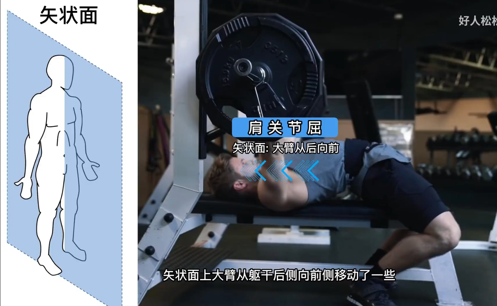

# 健身

[TOC]

## 健身训练

### 分化训练

#### 分化方式的选择

分化方式：

1. 五分化：背、胸、肩、手、腿
1. 四分化：背+肩后束、胸+肩前中束、手、腿+腹部
1. 三分化：背+肩后束+肱二头、胸+肩前中束+肱三头、腿+腹部
1. 二分化

---

优缺点：

1. 全身循环速度：分化次数越少，循环速度越快
1. 单部位训练组数：分化次数越多，单部位训练更彻底

---

新手建议：

1. 三分化或者四分化，保证每周 3 到 5 练
1. 有效增肌的最优训练频率是，每个部位每周至少练 2 次
1. 注意边际效应：每个部位练 1 个小时就已经很多了，后面基本都是垃圾组

我的选择：三分化，每周 4 练

#### 分化方式的底层逻辑——肌肉协同

##### 推胸动作

推胸动作可以拆分成三部分：

1. 水平面上肩关节水平内收：胸大肌 + 肩前束
1. 矢状面上肩关节屈：胸大肌 + 肩前束
1. 肘关节伸：肱三头肌

##### 背部训练

两种类型的划船训练：

划船动作可以拆分成两部分：

1. 矢状面上肩关节伸：背阔肌 + 大圆肌 + 肱三头肌长头 + 肩后束
1. 水平面上肩关节水平外展：肩后束 + 冈下肌

注意：屈肘动作是肱二头肌发力，在背部训练中使用屈肘代偿会导致背部发力不充分

### 动作模式

所有动作一览表：

#### 练背日

##### 划船

根据开肘角度分类：

1. 下背划船：
    - 夹肘，握距等于肩宽，拉向腹部
    - 动作模式：肩关节伸
    - 主要发力肌肉：背阔肌、大圆肌更多，也有肩后束和肱三头肌长头
1. 上背划船：
    - 开肘，握距大于肩宽，拉向胸部
    - 动作模式：肩关节伸 + 肩关节水平外展
    - 主要发力肌肉：

##### 下拉

##### 反向飞鸟

##### 弯举

#### 练胸日

##### 推胸

推胸 = 肩关节水平内收 + 肩关节屈 + 肘关节伸

多关节运动，配重更大

杠铃卧推动作要领：首先是分阶段，准备阶段、起杠、下降、上升。准备阶段脚用力踩好，怎么看握距，肩胛骨锁定，背略微顶起把胸拉开。起杠看好手腕角度，注意重量。下降注意弧线，下到下胸，停住不要弹起来，可以碰到胸也可以不碰到，上到手臂垂直地面，眼睛盯住杆子更容易控制，在顶端呼气吸气。上升的事后可以想象把两个手臂往中间夹，这样胸肌更好发力。

##### 夹胸

夹胸 = 肩关节水平内收

蝴蝶机夹胸可以做两组用来做热身，感受胸中缝的发力。也可以用木杆子或者弹力带热身。

##### 推举

哑铃推肩动作要领：第一个是怎么举起哑铃，先放在腿上，可以用腿借力推起来。起始位置大小臂九十度，小臂与地面垂直，大臂不用过度外展。上升呼气，下降吸气。上升爆发，下降控制。

##### 前平举

##### 侧平举

哑铃侧平举动作要领：起始位置在裤袋边上，略微挺胸，肩弹响一定要停下来调整动作。上升之后手臂可以适当向前转，力臂可以适当减小。上升呼气，下降吸气。想象用手肘去碰两边的两堵墙，感受中束的发力，不要用斜方肌借力。

##### 提拉

##### 臂屈伸

龙门架绳索臂屈伸动作要领：身体可以稍微前倾，大臂垂直地面，核心用力，上身和大臂固定。下拉到极限位置加上一个手臂内旋，能感受到三头明显的刺激。

##### 练胸日拉伸

- 胸肌拉伸：墙角
- 肩前束拉伸：手背在身后向上到不能再上，然后挺胸，正常呼吸，感受胸和肩前束的拉伸
- 肩中束拉伸：手臂向前贴紧胸部，另一只手向胸口拉
- 三头拉伸：左脚上前，右手肘后端贴墙。

#### 练腿日

##### 膝关节伸

##### 髋关节伸

##### 膝关节屈

##### 卷腹

##### 举腿

### 训练计划

训练计划：

1. 练背日：高位下拉 * 5 组 + 杠铃划船 * 5 组 + 哑铃弯举 * 5 组 + 反向飞鸟 * 5 组
1. 练胸日：卧推 * 5 组 + 哑铃推举 * 4 组 + 哑铃侧平举 * 4 组 + 臂屈伸 * 4 组
1. 练腿日：深蹲 * 5 组 + 硬拉 * 5 组 + 卷腹 & 举腿 * 5 组

## 健身饮食

## 吃练跟拍
