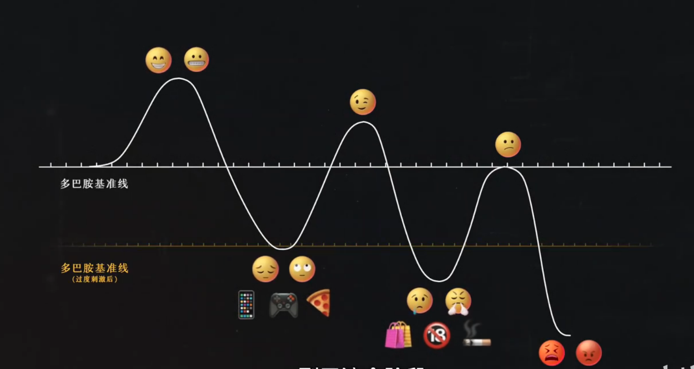
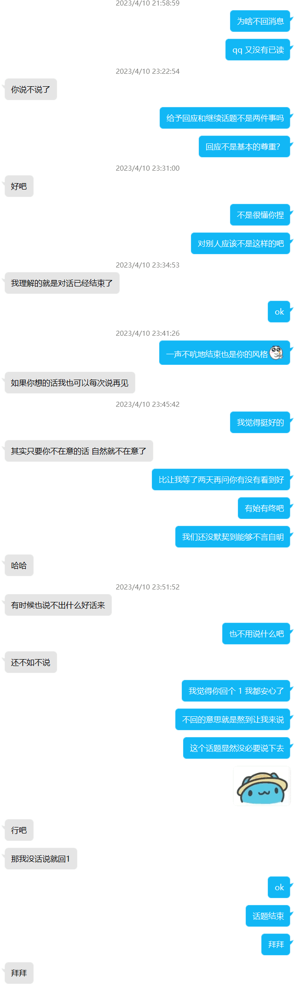
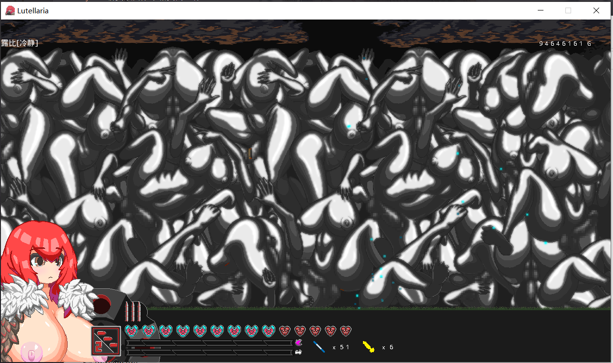

# 2022.1.17

1. 今天做了什么值得记录的事情？

今天了解了一点转专业和保研的相关信息。

今天了解了手帐的做法和作用，并决定不用纸质手帐而用几个 app 代替。

今天重新捡起了吉他，并开始写博客，是一个不错的开端呢。接下来要做的是规划好每周三次吉他练习的时间。

2. 今天有什么值得称赞的地方？

在经历了昨天一整天的颓废之后，今天终于好像找回了一点行动的动力。

3. 今天有什么需要改进的地方？

4. 明天想要做什么？

今天晚上了解一点 js 小游戏，看看能不能找到 npc 算法优化一下猫猫的行为。

然后设置一下每日打卡，早睡早起的习惯要开始起步了。

# 2022.1.18

1. 今天做了什么值得记录的事情？

上午订了 2 道题。
下午和 lyc、qingqing、ltc、mmt 等初中同学打球，连打 4 个小时。

回家洗完澡就瘫倒了，从九点断断续续睡到了第二天早上八点半。

2. 今天有什么值得称赞的地方？

每日计划完成得不错。

3. 今天有什么需要改进的地方？

洗澡稍微快一点。注意劳逸结合，不要连续两三个小时坐在电脑前面，会导致之后到睡觉一直萎靡不振。

4. 明天想要做什么？

# 2022.1.19

1. 今天做了什么值得记录的事情？

上午把一套 cf 题订正完了。

下午学车，感觉能应付一些突发情况了，但是减档转弯还是不是很熟练。

在地铁上和在练车的休息过程中看了不少书，感觉用 kindle 看书比用手机看效率更高，可能是屏幕更护眼看久了也不会累的缘故吧。

晚上练了《River Flows in You》的 intro 和 A 段，写了笔记，有了记录之后就算忘了捡起来也会快很多。

2. 今天有什么值得称赞的地方？

基本找回了学期中的工作状态，不会有消极怠工的态度。

3. 今天有什么需要改进的地方？

劳逸结合安排得不够好，明天需要记录一下工作时间和休息时间。

早上起的太晚了导致早上能安排的事情太少，明天八点起床。

4. 明天想要做什么？

八点起床，早上打一场 vp，下午学车，晚上打球。晚上回来总结一个合理的锻炼计划。看 js 小游戏原码的事情可能要拖到后天了。

# 2021.1.20

1. 今天做了什么值得记录的事情？

今天浑浑噩噩过了一天，上午 cf vp 打了一个小时， E 题想不出来于是直接摆烂开始打游戏，一直玩到要去学车。

学车的下午也是一如既往的水，看看小说刷刷 b 站。

晚上打球，回来洗澡的时候自己玩了一会，洗完澡吃完饭大概十点钟，躺在床上看书一不小心睡着了，一觉睡到十二点，起床洗漱之后继续睡，算是误打误撞完成了一天早睡打卡吧。

2. 今天有什么值得称赞的地方？

无

3. 今天有什么需要改进的地方？

效率太低了，明天咕了学车，尝试在家干活一天，找找状态。

4. 明天想要做什么？

补题，看书，完成两个 ddl。

# 2021.1.21

今天早上要不是妈打电话来，我可能都不会在十点钟之前起床。感觉不管睡得多么早，起床的时候总是要做一定的挣扎的，今天晚上就要做好充分的心理暗示，明天早上醒来之后直接起床洗漱，洗过脸之后一般就不会再困了。

起床之后本来想开始写box小游戏的，但是因为想借鉴一些小游戏的经验点开了b站，然后就开始看《影子战术》的速通视频，然后就一发不可收拾，从起床一直看到吃中饭。

下午到晚上一直在搞这个代码，倒是学到了一点东西，但是效率着实很低。明天可以尝试多件事情轮流来做，可能不会过早进入瓶颈，导致效率降低。

总而言之还是劳逸结合做得不好，没有“可持续发展”。明天要用上番茄钟。

# 2021.1.22

1. 今天做了什么值得记录的事情？

今天把 box 小游戏基本搞定了，之后就闲着没事去加几张地图或者改一改参数就行了。晚上准备好好洗个澡放松一下，然后弹吉他，看书。

2. 今天有什么值得称赞的地方？

今天总算是成功早起了！

虽然一整天都在做同一件事情，但是一直保持着亢奋状态，效率很高，解决了很多问题。

在工作的间隙也适当的休息了，没有让自己太累。

3. 今天有什么需要改进的地方？

其他计划拖了很久没做了，明天要稍微完成一些ddl。

4. 明天想要做什么？

把 cf 题补了，把踩点总结写了，然后晚上开个会。运动计划去知乎和b站上了解一下然后写一篇博客。

今天晚上早睡！！！

# 2022.1.23 + 2022.1.24

1. 今天做了什么值得记录的事情？

这两天可以说是一事无成了。23号补题补了一半去打游戏了，然后着急忙慌的准备开会，会也开的拖拖拉拉，晚上又去团建了运动计划到现在都没看过。24号就早上写了一套题，但是还是没有能够在比赛里把一道能带我上分的题写出来，从下午到晚上先下了几个黄油玩玩，然后开始看电影，让子弹飞，一直看到两点钟。

2. 今天有什么值得称赞的地方？

心态很好，浪费了两天一点都不焦虑。

3. 今天有什么需要改进的地方？

心态要改变一下，有其他更有意义的事情值得你花时间。

4. 明天想要做什么？

主要任务是做一个反思和计划，然后补两套题+写博客，总结一下上次开会的一些东西，然后随意。

p.s. 以后每日计划晚上写好之后早上一定要再看一眼。

# 2022.1.27

1. 今天做了什么值得记录的事情？

前两天因为实在是太颓废了，连每日小结都没有写。

今天花了一整天订了一道 F 题，感觉收获还是有的，因为一道题涉及到了并查集、线段树、树上差分等方法，我光是分别把这些东西都熟悉一下就花了挺久，写的时候也是犹犹豫豫，不过也没办法。

期间穿插着弹了一会吉他，看了会书，下午睡大觉睡了两个小时。

晚上打了一场 cf，因为是 div.1 + div.2 所以只能打 div.1，险些被劝退，但最终还是写了三道题上了一点分。勉强达到期望，但是离目标还有一点距离，首先是速度太慢，其次能写出前三题还是靠脸的，这次的题至少我看了都有点想法，要是有的题有一个转化我没有想到就完了。

2. 今天有什么值得称赞的地方？

打了开始复健后的第一场比赛。

3. 今天有什么需要改进的地方？

我觉得挺好的，就这样吧。

4. 明天想要做什么？

订正上一场 vp 留下来的三道题。弹吉他。把 box 小游戏收个尾。看书。其他看心情做吧。

# 2022.1.28

1. 今天做了什么值得记录的事情？

起床直接吃中饭，第一次低头看时间看到的就是下午一点。

下午订正了一道题（没有完成 3 道题的任务）。弹吉他的时候感觉小拇指痛，没有继续练《river》，找了一首《爱的罗曼史》，今天吉他的量可以接受。box小游戏的修改今天效率很高，主要原因是先制定了计划，知道自己需要做什么，然后再一件事一件事地去做，于是很快就解决了问题。吃饭后和睡觉前看书也是明智的决定。晚上还看了一部电影《彗星到来的那一夜》。

感觉人还是需要一些能量，那场 cf 之后我真的很受鼓舞。

2. 今天有什么值得称赞的地方？

box小游戏的更新，先制定了计划再逐个击破，效果很好。

任务完成度比较高。

3. 今天有什么需要改进的地方？

起床就是中午了，没有早上可言。

4. 明天想要做什么？

把回忆的文章写完让齐宝看看。box小游戏更新几张地图，写一下项目总结。把《爱的罗曼史》的指法笔记写好。看书。订正昨天剩下的两道题。了解总结一下锻炼计划（明天一定要做掉，拖了很久很久了）。

现在是1月30号的中午，昨天什么都没有做，下午在玩《纳迪亚》，晚上在团建《among us》，所以说都在打游戏了。今天下午也要出去玩，所以今天目标就是尽量把昨天的任务做完吧。

# 2022.1.30

1. 今天做了什么值得记录的事情？

把 box 小游戏收了个尾并且把项目总结写了。

把《爱的罗曼史》的执法笔记写好了，并且找了大横按练习。

下午去植物园玩了，晚上团建了人类一败涂地。

2. 今天有什么值得称赞的地方？

除了玩之外的时间效率挺高的。

3. 今天有什么需要改进的地方？

玩的时间太多了，过年之前的任务可能清不掉了。

4. 明天想要做什么？

把回忆的文章再更几篇给齐宝看（可以当成长期更新）。订正两道题。去luogu找一个补算法或者数据结构的题单，做一道题或者复习一个算法。锻炼计划。

# 2022.1.31

1. 今天做了什么值得记录的事情？

今天是除夕夜，明天就要迎来新的一年了。今天下午把《影子战术》通关了。晚上一直在刷手机。没有等到该一起跨年的人，每次过年想要多找几个人聊聊天的时候都会发现自己能聊的人挺少的。“总是看手机，搞得好像又很多消息要回一样”说的就是我。

2. 今天有什么值得称赞的地方？

无

3. 今天有什么需要改进的地方？

多了去了。

4. 明天想要做什么？

把昨天的计划做完。入手云台。

# 2022.2.1

1. 今天做了什么值得记录的事情？

真的中午才起床。订正了两道题，下午去爬南高峰，晚上看了《第九区》大受震撼。

2. 今天有什么值得称赞的地方？

今天没有花很多时间看手机，而是用这些时间想了一些事情，并且有部分想法付诸行动了。比如说去问蛋要了转图灵成功的学长的联系方式。比如说解决了压岁钱问题。

3. 今天有什么需要改进的地方？

但是还是有很多没有做到的事情。计划完成度很低。并且 box 小游戏还没有完工。

4. 明天想要做什么？

1 box 小游戏，2 题单上先开始刷字符串相关内容至少学会一个算法，3 计划开始每天学一点数学分析，4 云台！5 锻炼计划！6 写文章给齐宝看 7 早起！！！

# 2022.2.2

1. 今天做了什么值得记录的事情？

今天 box 小游戏已经到了精修阶段，两边在交涉和修改中。文章写完了，这大概是我第一次写这么长的文章，将近 5k 字，估计以后也很难有想法让我能写出这么多字了。下午去拜访了 clm 叔叔，但是一直在人家家里玩 switch，感觉并不是太礼貌。

2. 今天有什么值得称赞的地方？

除了出去玩的时间，效率一直很高。要继续保持

3. 今天有什么需要改进的地方？

早上时间的利用率太低了，明天早上起来先把云台和锻炼计划这两个硬骨头啃掉，这两个占据我的明日计划好久啦！

4. 明天想要做什么？

1 早起 2 起床之后做云台购买和锻炼计划编写 3 学一个算法刷一道题 4 box 小游戏收尾发布

# 2022.2.3

1. 今天做了什么值得记录的事情？

box 小游戏终于写完了！！！看了稳定器评测，觉得太贵了，但是偶然发现了 PR 和 AE 可以后期做防抖，所以转向尝试做后期的防抖。在手机上清理出了 7G 的空间，在电脑上与杀毒软件苦战。成功找到了完整的《塞尔达传说》资源并且开始愉快地玩耍，值得一提的是我第一次遇到了下载的过程中出现错误的情况，重新下载就解决了。在找到这个完整资源之前，下载了一个有缺漏的资源，手动下载了 CEMU 和 mouse2joystick 并尝试自己搞最后还是没有找到修改键位的方法。

2. 今天有什么值得称赞的地方？

坚持不懈地解决了几个问题。

3. 今天有什么需要改进的地方？

没有按照计划行事。

4. 明天想要做什么？

1 下载 AE 2 剪一个视频，用到后期防抖。3 写拍摄脚本 4 运动计划和数分学习计划 5 看书和吉他

# 2022.2.4

1. 今天做了什么值得记录的事情？

睡到了中午，起床就吃中饭了。下午本来只是想试一试开虚拟内存之后塞尔达会不会跑的更流畅一点，效果超乎我的想象于是我选择玩了一下午游戏。不过还好晚上及时打住，吃完晚饭之后看了会书，练了一会吉他。之后开始剪视频，并且把 AE PS PR 都换成了浙大的正版。搞得很晚，因为下载的时候没看文档，就知道自己瞎搞。

2. 今天有什么值得称赞的地方？

做了挺多事情。

3. 今天有什么需要改进的地方？

起床太晚了！睡得太晚了！你没有梦想叫你起床吗？

4. 明天想要做什么？

主要做视频拍摄方面的工作。吉他、看书。有空整理一下转竺院需要哪些材料，要找老师要的东西就尽快去要，要提前学的东西就提前规划好。

# 2022.2.7 ~ 2.9

1. 今天做了什么值得记录的事情？

突然发现好几天没写每日小结了，而且已经丧失了部分的记忆。我感觉 2 月 5 号到 6 号我一直沉迷塞尔达，但是好歹还是写了一个脚本。7 号到 9 号在外面玩，看了两部电影《十二宫》和《扬名立万》，开了一次会，这次会议还算成功。然后学车的时间拖到 17 号了。我只能考完科三长途跋涉回杭州，第二天直接去学校报道了。

一些感悟。首先是面对几个不确定的时间，比如说学车的时间还没有定，社会实践实地拍摄的时间也没有定，但是这两段时间有重合，如果想要两个都参加，就肯定得委屈其他同学一下调整实地拍摄时间。在这种时候最好的方法是直接把我的难处和大家讲，因为肯定不止我一个人时间安排上有困难，而且我的困难确实是情有可原，所以可以和大家商量确定时间。

然后是关于学车时间推后，没有办法和小朋友们一起去考试的事情。生活中总是会遇到很多变数，计划赶不上变化。能做的就是两点，第一是在做计划的时候就对突发情况的可能性做一个预估，并准备好 plan B，第二是在遇到变数的时候保持冷静并调整变化。总而言之不要被变化吓到了，也不要急，这样总能解决问题的。

2. 今天有什么值得称赞的地方？

3. 今天有什么需要改进的地方？

要开始干活啦。事情都堆在一起了。

4. 明天想要做什么？

1. 列好转竺院所需材料的清单，要找老师要的（如排名或者推荐信）先去要来。2. 看一下 ppt 制作教程，做一个六个一知名高校介绍。3. 看书，吉他。 4. 每日信息上报。 5. bgm，台词征集，

# 2022.2.10

1. 今天做了什么值得记录的事情？

按掉闹铃直接睡到吃中饭，全天沉迷原神，只能说已经无法比今天更颓废了。

对于游戏，其实并不用像现实世界中那样，组织活动啦转专业啦什么事都多尝试尝试，经验越丰富越好。如果你玩游戏目的性很明确，那么游戏有很多捷径，看攻略比自己探索效率高多了。在不同的世界，秉持不同的世界观。

2. 今天有什么值得称赞的地方？

坚持不懈地肝了一天的原神。

3. 今天有什么需要改进的地方？

没有按照计划行事。

4. 明天想要做什么？

把昨天的计划完成。然后优先做完所有的六个一作业。

# 2022.2.12

1. 今天做了什么值得记录的事情？

早上一看，突然发现昨天的计划全都完成了，甚至还超额把六个一作业全都做完了。昨天开始准备转图灵班的材料，做完了六个一，看了 ppt 制作教程然后觉得就我现在这个水平真没必要自己做 ppt。然后打原神。

值得一提的是晚上突然出现的 emo，原因很简单，就是很多待办的事情堆积起来，而有一件事情（给黄正达的推荐信草稿）在处理的过程中卡住了。其实这件事进度迟迟不能推进本身的后果是不严重的，但是因为有很多事情等着我去做，就放大了他的影响，导致了严重的焦虑。而解决方案是什么呢？当然是少拖延，尽量早做完事情，给后续发生的突发事件更大的处理空间。

2. 今天有什么值得称赞的地方？

把计划做完了。

3. 今天有什么需要改进的地方？

要学会拒绝。原神有人加我的世界帮我打的时候，我想推主线任务，多人游戏的时候又推不了，就陪大佬打每日委托和地脉之类的。但是实际上我并没有特别想打这个。

还有就是适可而止吧。游戏里把想做的事情做完，就就此打住，退游不玩。

4. 明天想要做什么？

1. 搞定图灵班转专业电子版材料 2. 队旗电子版+打印，顺便把双面打印的东西打下来填好，来得及的话把图灵班材料打印3份 3. 陪政治齐玩原神 4. 98淘书找教材 5. 写思想汇报电子版 6. 看书+吉他。

# 2022.2.13

1. 今天做了什么值得记录的事情？

早上五点四十五起床，七点到西兴大桥开始一天的拍摄。白天的拍摄一直持续到下午四点，晚上七点开始。中间这段时间利用的不错，买了一杯咖啡然后在店里坐着写好了组织里活动的推文文案，改好了推荐信发给黄正达。感觉坐在河边的咖啡店里能够获得效率upup的加成，以后也可以考虑多换换环境。

2. 今天有什么值得称赞的地方？

下午的空闲时间利用的不错，以后也可以尝试多换环境以获得更高的效率。

3. 今天有什么需要改进的地方？

4. 明天想要做什么？

# 2022.2.14

1. 今天做了什么值得记录的事情？

今天什么都没有做。看了巨人但是觉得并没有那么吸引人了，打了原神但是感觉有点无聊。写好了要做的事情，但是想着我昨天太累了今天给自己放松一下，就没有兴致去做计划里的事情。导致很晚了才跟yps、scl、lqp确定第二天的拍摄计划，其他的准备材料啊之类的事情一概没有搞定。

碰巧晚上躲在被子里看 b 站的时候刷到一个视频，里面一句话很打动我：“为什么要按照计划做事？不是因为你列了计划就必须得逼着自己完成，而是你设想了一个最好的明天，实现了它能够带给你最多的收获。”你是在和自己交涉，而不是在逼自己做事。按计划做事的你不是自己的奴隶，而是自己的主人。按计划做事是在给自己带来快乐，而不是给自己带来焦虑。如果在寒假之前我就是这么想的话，我可能就能避免很多既不想做事又不想虚度时光的纠结。

但是过去的都已经过去了，希望明天能像视频里说的高效的人那样，效率“off the chart”。

2. 今天有什么值得称赞的地方？

3. 今天有什么需要改进的地方？

为了变成一个更好的人而努力吧。

4. 明天想要做什么？

# 2022.2.15

1. 今天做了什么值得记录的事情？

昨天安排好了 yps、scl、lqp 三人早上的拍摄任务，八点四十的时候去看了一眼收工，然后和 yps 去开始一天的拍摄。值得肯定的是在只有两个人的情况下调整了拍摄方案，完成了一个令人比较满意的镜头。而且今天运气比较好，虽然学校附近看起来非常冷清，天气也很冷，但是广场里却有很多人，想拍的画面基本都拍到了。下午的时候找的第一家全家人不是很多，但是我觉得火车站的全家应该人会多一点，就去了城站边的全家，最终也拍到了比较满意的延时摄影。

晚上效率不高，感觉在家里工作效率确实不高啊，换个环境真的能给自己增添不少的动力呢。

2. 今天有什么值得称赞的地方？

3. 今天有什么需要改进的地方？

晚上的效率有待提高，或者说在家里办公的效率有待提高。

4. 明天想要做什么？

# 2022.2.16

1. 今天做了什么值得记录的事情？

早上起来依旧自闭，完全不想开工，坐在电脑前面坐了一个上午，愣是什么事都没做。十一点就出发准备去场口考科目三了，吃完晚饭稍微睡了一会，然后从十点一直练到晚上十二点。回到宾馆之后本来想写完通讯稿就睡觉，但是因为太自闭了给政治齐打电话，并且一直处在一种一旦挂了电话就会很焦虑的状态，所以跟政治齐一起打原神打发时间。一直到两点多，政治齐挂电话睡觉了，我才开始写推文，写到三点钟。

2. 今天有什么值得称赞的地方？

3. 今天有什么需要改进的地方？

行动只会带来短暂的焦虑，不行动就是永远的井底之蛙。

4. 明天想要做什么？

# 2022.2.17

1. 今天做了什么值得记录的事情？

早上七点起床，八点到考场，得知九点钟才能签到，签完到之后发现到得早根本没用号子是随机的。可以说是内卷无用的一个非常直观地论据了。

虽然有点担心会错过号子，但是在听小朋友们说号子是从小到大叫的，就下定决心回宾馆睡觉。然后在宾馆把剪辑任务布置了，下午在等待大厅把转专业申请材料搞得八九不离十。这段时间还是利用的不错的。

然后就是科三考试了，不知道是因为太冷还是紧张我上车之前抖得不行。看跟我同车的那个老哥好几次险些熄火但是还是完成了考试，我上车的时候也放平了心态，就跟平常一样去做。但是这个车跟我水火不容，我一次忘了挂三挡二挡开了过长距离，一次熄火+忘记挂空挡点火，就挂科回家了。

2. 今天有什么值得称赞的地方？

等待时间利用的比较好，没有看无营养的内容消磨时间。

3. 今天有什么需要改进的地方？

容易紧张，应付不了不熟悉的场面，容易受到他人的影响（安全员的催促）。

4. 明天想要做什么？

# 2022.2.18

1. 今天做了什么值得记录的事情？

一早就返校了。列了想要做的事情，然后一件事一件事去做，做到下午把大部分事情都搞定了，甚至连转专业申请的各种事项也都做完了。感觉非常满意。

2. 今天有什么值得称赞的地方？

如果有一堆琐事要做，让你感觉一时半会理不清思路的时候，最好的办法是把这些事情在纸上列出来，然后一项一项解决。很多时候这种事情只是个数多，但是处理每件事情所需的时间并不长。在小范围的时间内也不需要太在意做这些事情的先后顺序，不用纠结一个完美的排序，就尽快把每件事都做掉就好了。只要事情一件一件减少，思路就会变得顺畅起来，并且焦虑也会减少，所以治疗焦虑的最好药方就是行动。

3. 今天有什么需要改进的地方？

中午午睡本来想只睡半个小时，但是听到闹铃醒来之后，又在床上躺了四十分钟，辗转反侧纠结要不要起床。就是说该起床就果断起床，起床只是痛苦一时，只要下床了清醒了就马上能回到清醒状态。

4. 明天想要做什么？

今天晚上 1 今天晚上十二点之前睡觉，2 重新制定每日打卡计划并且从今天开始执行。3 写一个寒假总结。4 剪视频，除了特效之外大致成型
明天 1 敲章，2 看看退学需要做哪些事情，3 学特效，把视频大致搞定，4 推文的任务先布置下去，5 学安卓

# 2022.2.19

1. 今天做了什么值得记录的事情？

昨天计划的还是太美妙了一点。事实是剪视频远没有想象中的那么简单，效率也有很多的影响因素，也得合理考虑给自己安排休息时间。然后通知和交流需要花费很多时间，如果一个任务没有布置清楚，需要反复花更多的时间去和队友解释，偷懒的恶果终究是会显现的。

今天做的事情大概就是敲了个章，然后整合了一下资料这样，上交了一个通讯稿这样。

2. 今天有什么值得称赞的地方？

3. 今天有什么需要改进的地方？

整个人比较乱，事情没做多少，花在聊天上的时间太多。状态比较不稳定吧，有的时候效率会比较高，有的时候会懒得规划事情。

4. 明天想要做什么？

# 2022.2.20

1. 今天做了什么值得记录的事情？

早上八点半起，起来先写了一个思想汇报。然后开始剪视频，做了大概一个半小时吧。然后事情出现了转机，蛋上交了个人小结并成功用依据阴阳怪气勾起了我的怒火。于是花了半个小时d蛋，花了半个小时和状元讨论d蛋心得，花半个小时平复心情，最后就去吃饭了。

因为十二点多才吃饭，回来的路上打印了一下文件，回寝室就快一点钟了，看了一下b站，小睡了一会，拿了个超市的外卖之后就去拍合照了。然后一直在划水，想要吃完晚饭再开始干活。不过我现在比较相信自己安排好了啥时候开始干活还是能要求自己开始的。

2. 今天有什么值得称赞的地方？

早上效率还可以。

3. 今天有什么需要改进的地方？

下午开摆。

4. 明天想要做什么？

明天是开学第一天，先习惯一下起早八的感觉。第一节课还是好好听一下，熟悉一下老师的风格，想要上课不听等以后再说。

# 2022.2.21-2022.2.25

1. 今天做了什么值得记录的事情？

一个星期过去了，一个字都没有写。这次倒真的不是因为我懒啊，忘掉了啊之类的，是真的没时间。今天是星期五下午，终于我办完了手头看起来是最后一件事情，能够得到片刻的喘息了。不过在可以预见的未来我肯定又要开始忙碌了，毕竟转专业莫名其妙成功了，这回先要跑到玉泉去盖章，之后又要到新班级去搞各种事情。那现在就来写一下这五天的小结吧。

周一周二，也没干啥就一直在水课。上课听但不完全听，心思全在剪视频上。有几节课听了一点但是马上就听不下去了，然后开始自己看书，看完书之后继续做自己的事情。

星期三。繁忙的一天。早八微积分果断不听，准备转专业面试。事实证明我的决策完全正确，要是我听完这节微积分，就只剩最多一个小时时间写+背自我介绍，其他问题肯定也不能提前想过。面试之前和一起来的张杰夫聊了两句，人家是大类第三，相比之下我就显得非常普通了。他很突出的一点特征就是学的很快，比较会模仿。面试前出了一点小意外，原本预定的教室打不开，只能临时换教室。有几个稍微晚了一点到的老师在原来那个教室门口探头探脑的时候，我去跟老师说了一声，面试换地方了。老师反应很不错。他可能也觉得这样做能增加好感度，下一个老师来的时候他就冲上去说了类似的话。再说面试的时候，我感觉我基本就是把心声全都袒露出来了：我上个学期过得太安逸了，我内驱力不够，我想要换一个环境，让外界环境来鞭策我。走出面试教室感觉自己寄了——但是没想到最后还是过了面试。面试完感觉终于放下了一件事情可以稍微休息一下了，回到寝室准备摆烂，但是又出现了一件事情让我欲摆不能。我突然发现我选了玉泉的体育课！情急之下直接退了课补选了星期四的网球课——为了补选稳一点我选了早八，于是这个学期我就要忍受五天早八的痛苦了。但是凭空多出来的两节课时间，给我赶上五点的 ddl 创造了条件。原来我根本没敢想在今天把事情做完，真是运气太好了，突然有了时间，我就开始埋头赶工。五点之前我剪完了视频、改好了推文，成功把申请表踩点发给了云峰微讯。晚上是社牛锻炼课——职业生涯规划。

星期四。平平无奇的一天。早上去上了补选的早八网球课，提前了 20 分钟到安中开始了等待。看到两个大佬在打网球，本以为是课友，没想到就是两个人约球。我一整个震惊住了，在我们感叹起早八的痛苦的时候，竟然有的人可能七点半就开始新的一天了。中午去吃了 tony 家，被带着玩了几把王者荣耀，突然很想玩 MOBA，为星期五重新入坑 LOL 埋下伏笔。五点半无线网络应用下课，一个小时时间吃饭。我选择了用这一个小时冲到体育馆去打了个疫苗（留观半小时），半路上去教学楼买了个面包，于是成功迟到了。登记打疫苗的时候，我左手拿着身份证，右手摸着空空的口袋，问登记的小姐姐我有没有拿自己的身份证。成功社死了。

星期五。早上两点睡觉，七点半起床洗漱带上一瓶牛奶直奔信电导，居然卡着点在教室里坐下了没有迟到——但是发现章院长的课每节课都要点到，突然有点不想上了。吃了饭下午去现宣，中午回寝室换了一套衣服再出门，自我感觉良好。现宣就一直在玩，还去隔壁支教的宣传摊位上转了一转，玩了一会游戏，然后就是一直在和 302 聊天，第一次发现内向型的人在交流的时候很容易因为紧张而失去思考的能力，所以之后一直是我在挑起话题，也一般是我提问他回答。现宣结束之后去帮张慧雯（ngo hui jin）同学办理退学手续。还是挺有趣的，要去5个地点敲6个公章，一个地点最多辗转3个办公室才搞定所有事情。我严重怀疑我自己把这件事当成了什么支线任务来做，做的不亦乐乎，规划好最佳路线，一路火花带闪电。办公室老师说今天多半是办不成了给我了一个 3 月 15 号的 ddl，然后我一个小时不到就把这个事情搞完了，能感受得到办公室老师的惊讶。今天晚上先休息休息，写一个文案，分配一下总结材料的任务，然后摆烂！

突然忘了还有推文的邮件没有发，还是好记性不如烂笔头啊，写下来多好！

2. 今天有什么值得称赞的地方？

经过最近这段时间的各种赶工，我觉得 Mario Circeli 老师这句话说的真是太对了：“在你快要迟到的时候，最紧急的事情不是给老师发消息说你快要迟到了，而是不要看手机尽你所能赶到约定地点。”而我的做法可能比这个更进一步，快迟到了连时间都不用再看了，手机丢口袋，冲就完事了。

现在有一个优点就是可以直接用脑子记事情了。养成了习惯新增一件事情的时候先搞清楚时间地点、找谁联系，然后能把这些信息记住并且做掉。逐渐习惯了搞这种麻烦的办公事项。

看通知和发布通知一定是最最“重要且紧急”的事情，给别人多一点反应的时间。发完了就不用去想了，做其他事等大家看过回复。

3. 今天有什么需要改进的地方？

4. 明天想要做什么？

ppt 和 总结材料分工。

# 2022.3.16

1. 今天做了什么值得记录的事情？

已经很久没有记录过生活了，感觉最近过得匆匆忙忙浑浑噩噩，总是有什么事情没有结束要一直记挂着，所以也一直没有时间真正地停下来休息一下，放松一下。

也不是没有休息没有放松，平常看短视频看的可多了，有的时候根本停不下来。反而是放弃了一些其他的一些兴趣爱好，比如看书、弹吉他，甚至玩塞尔达和LOL。明明花时间去干这些事情会有意义得多，但却把碎片时间全都花在了没有意义的事情上，试图以此来缓解焦虑，但是得到的却是一事无成带来的更加焦虑。

所以觉得有必要稍微停下来审视一下自己，到底是什么在困扰着我，解决了哪些问题之后我的焦虑才会缓解。

2. 今天有什么值得称赞的地方？

3. 今天有什么需要改进的地方？

4. 明天想要做什么？

看看我还要做哪些事情：
1. 把课程进度全都赶上（数分差3课时、抽代差6课时、离散数学差4课时左右、文化人类学差4课时、普物实验差一次实验、太极拳要看好评分标准），特别是抽代现在还一点都没学过。
2. 每周要能留出固定的（不能固定至少要是足够的）时间给普物实验报告和预习报告、文化人类学的材料阅读。
3. 一些大作业：职规的采访和报告要安排起来，改革开放史的思考题和论文不能拖到最后，确认导师+网安导找导师要project，太极拳的大作业和社会活动安排起来、还有科四考试和体侧安排起来。

但是第3点这一点其实并不能给我带来太多的焦虑，因为 ddl 还很远，我呢真的不见 ddl 不心慌的。这么理了一下之后觉得情况开朗了不少，但是还是要尽量快地把这些东西处理掉，然后进入正常的生活节奏当中。

# 2022.3.18-19

1. 今天做了什么值得记录的事情？

18号星期五，从下午玩塞尔达一直玩到晚上，晚饭也没吃。然后晚上还看了《蜘蛛侠：英雄无归》和《瑞克和莫蒂》。说实话蜘蛛侠电影个人感觉最感人的剧情大概就是，没能救下 M(ary)J(ane) 的 Peter Parker 替主世界中的 Peter Parker 救下了他的 M(ichelle)J(ones)。其他貌似真没有什么看点了。

以后好好学习的愿望果然都知识存在于幻想中吧。

2. 今天有什么值得称赞的地方？

3. 今天有什么需要改进的地方？

4. 明天想要做什么？

# 2022.3.22

1. 今天做了什么值得记录的事情？

昨天白天还算高效，但是晚上一直在摆烂。晚上躺在床上听 yjn 打呼噜，顺便再次怀疑了一下我生活的意义。所以说人再有情怀，格局再大，也不能永远生活在不快乐中。而让我快乐的是什么呢？弹吉他，运动算是两个吧，所以就每天花点时间做这两件事情，犒劳一下自己，也是给自己一个积极的心理暗示，白天就好好做该做的事情，晚上有时间给你玩的。至于长远的规划，我还是没有的，就走一步算一步，活在当下吧。

现在数分、离散数学、普物的进度都赶上了，唯一最麻烦的就是抽代了。现在的想法是，数分和离散数学都比课程进度差一次课，然后每节课都听上次的网课，下课了之后直接把听的那节课的作业给做了。普物上课就认真听课，下课把上课的内容都搞懂，周末再写作业。普物实验的预习报告和实验报告规定时间在周五下午做了，拖到周末会导致效率很低，不应该在实验报告上花太多的时间。抽代就先把课的进度给补上，然后上课好好听，下课多花点时间。

文化人类学就周二下午花时间看材料，然后上课也认真听，顺便可以做做ppt。职规课上写职业规划报告。中国改革开放史和网安导就不去了，用来补课和写作业，也需要先想好大作业要怎么安排。

2. 今天有什么值得称赞的地方？

3. 今天有什么需要改进的地方？

4. 明天想要做什么？

# 2022.4.6

1. 今天做了什么值得记录的事情？

看了《无间道》。刀人刀得是真的凶狠，剧情设计的也是真的好，这么多主角里只有一个人能活下来非常地合情合理。两个人的命运中都充满着孤独和无奈，年轻时都是为着自己的一腔热血插手了警察与黑道的纷争，但在长时间的卧底生活之后两人唯一的渴望就是全身而退，重新做回好人。但是由于肩负的责任，连这最最简单的愿望都变成了奢望。

特别是黄警官坠楼身亡时陈永仁看他的眼神，真的是让我久久不能忘怀。唯一知道他身份的人死了，现在他完全没有了依靠，如果不能夺回身份，他就永远无法洗白自己，只能继续过逃犯生活。看到这个场景的时候我感受到一阵无法抑制的压抑，挺符合我当时的心境的，感觉无依无靠，没有继续活下去的理由。

摆烂两天，明天要重新开始干活了。在学习的间隙可以穿插一些其他的活动比如说玩一玩 python 这种，不要每次都觉得这种事情要等到学习学完了才去搞。

2. 今天有什么值得称赞的地方？

3. 今天有什么需要改进的地方？

4. 明天想要做什么？

# 2022.4.10

1. 今天做了什么值得记录的事情？

发现之前听网课一直进度很慢的原因：因为可以回放，所以只要一个地方没有搞懂就会无限快退，导致一个地方卡很久。但是事实是很有可能因为这个确实难以理解，所以后面老师又解释了一遍，或者听了后面的知识之后前面的会方便理解一点，再或者单纯就是老师讲错了或者你有一个概念记错了。解决方案很简单，就是先在本子上空出位置来，打个问号，等一节课听完了再来重新看这个问题，大部分时候一个小问题不会影响后续的听课。

2. 今天有什么值得称赞的地方？

3. 今天有什么需要改进的地方？

4. 明天想要做什么？

# 2022.4.14

1. 今天做了什么值得记录的事情？

记一下这两天发生的一些有意思的事情。

首先呢，是一件让我感觉很满足的事情。我下午出门的时候跟打扫我们厕所卫生的阿姨说了一声辛苦了。就是这么简单，但是这个举动给我的下午注入了活力。我一直很难直白地表达感情，赞美的话或者真心的话一到嘴边就会被一股无形的力量给逼回心里。在出门前我也在卫生间门口徘徊了一会，因为卫生间门关着，我不知道推门进去会不会显得比较刻意，或者打扰到阿姨工作。就是会在这种小事上过分纠结，特别是在与人交往的过程中的小事。但是这次我说出口了，所以还是非常高兴非常满足的。

第二个，是一件让我感觉自己有所进步的事情。 当我发现我实验选课出了一点小问题的时候，我并没有慌张，而是先找了任课老师然后再找了主管老师，提出了自己的解决方案，并且得到了同意，没有耽误今天的实验。换做以往，像这样的突发事件，即使是与预期只有非常小的偏差，也足以让我紧张到难以思考。但是现在我有了一定的处理突发事件的能力，在紧急情况下能够保持冷静，像平常一样思考，这算是一个非常大的进步了吧。

第三个，是一件让我很有成就感的事情。还是在做实验的时候，因为我在老师还在讲废话的时候就开始摆弄实验设备，并且实验进度比一般人都要快，所以有很多人来问我实验操作，这算是我今天一天的动力源泉了。可能是有人来询问我给了我一种高人一等的优越感，或者是帮助别人带给我一种我的价值得到了发挥的满足感，总之实验结束之后我就非常高兴，这种积极的状态一直持续到晚上。

还有，我觉得我现在比以前更能屏蔽外界的干扰了。就比如说室友在寝室里边看沙雕视频边笑，或者是凳子拖地发出很大的声音，或者是重拿重放持续发出噪音，换做以前我都会觉得非常烦躁，无法专注于手头的事情。但感觉今天晚上我能够快速地驱散这种外界带来的负面情绪，并继续专注于学习，这是一个好兆头。

还有，就是我现在更愿意分享了。在高中时，因为圈子太小，我总是更多地把身边的同学看做竞争对手而不是合作伙伴。但是进入大学之后，自己与身边的人的竞争关系被淡化了，而同学作为非常有价值的资源，需要靠合作和交流来加以利用。比如一起做社会实践，比如一起自修，比如一起跑步，别人总有一些你没有的强项值得你学习或者可以为你所用，和别人一起做一件事情也更容易做好更容易坚持下去。而取得同学信任，让他们愿意与你合作甚至是为你做一些事情的前提，是你自己需要主动地去分享或者付出。现在我也看清了这一点，自己的资源，藏在自己手里就永远只能发挥有限的作用，但是分享出去，不仅资源发挥了更大的作用，我也收获了同学好感，这对我来说是有百利而无一害的。比如说，我乐意回答别人的一些问题，我乐意分享自己的笔记和一些学习方法。但是我很多时候不愿意为一些自视甚高，或者把你的帮助视作理所当然的人伸出援手，即使帮这个忙并不会对我自己造成什么损失。在将来我可能需要把我分享的范围再进行拓展，这样我就不会拘泥于这样一个两个人了。

2. 今天有什么值得称赞的地方？

3. 今天有什么需要改进的地方？

4. 明天想要做什么？

# 2022.4.18

1. 今天做了什么值得记录的事情？

今天早上难得地跟齐宝进行了连续的几个回合的对话，最开始感觉不错，但是到后来就只有逐渐浓烈的火药味了。不知道为什么会这样，可能是双方压力都很大，在网上面对见不到面的对方就比较容易控制不住情绪吧。但是仔细想想，我跟她确实有很大的不同，我很需要亲密关系来缓解我“缺一半”的问题，但是她却没有这么大的需求。所以我有没有必要继续跟她保持这样若即若离的关系，让我始终陷在痛苦的泥潭中。我觉得已经没有太大的必要了。我宁可没有这段关系的限制吧，我还能更自由地多交一些朋友，现在这样就陷入死局了。

再记录一下昨天晚上喝完半瓶失身酒，晚上做的一个梦。有一个小男孩跟我开玩笑，然后我生气了，把他整个拎起来摔在地上，因为没有控制好力度，他头朝下撞在地板上，发出清脆的响声。我很慌张，想把他再抱起来，但是他整个人都僵硬了。就记得这一个片段了，还有一些其他的剧情，感觉也都有点暴力。

2. 今天有什么值得称赞的地方？

3. 今天有什么需要改进的地方？

4. 明天想要做什么？

# 2022.4.21

1. 今天做了什么值得记录的事情？

今天又做实验去了。这个物理实验对我物理实验技术方面没有什么提升，对我的其他方面能力倒是增益不少。首先就是偷懒的技术，从最开始一个数据一个数据按计算器，到后面学会用 excel，然后写实验报告和预习报告越来越熟练，速度也越来越快，实验报告跟组织活动之类的技术一样，都是经验性的，孰能生巧就行了。然后就是因为补选的缘故，实验总是出一些差错，比如说要补做实验啦，两个选课系统里选的时间不一样导致实验做不了啦。虽然碰到了好多这种问题，但是我都能跟老师反映问题并且解决问题，目前来说这些问题没有给我造成什么不好的后果，就只是增加了一点麻烦而已。

昨天晚上看了《寄生虫》，感觉挺有意思的但是立意并不深刻，表现这种主题的电影应该挺多的吧。在豆瓣上也看到了不少质疑的声音，我也不知道为什么评价这么高。不过或许是我对韩国的阶级对立现状并不了解，所以导致我只看到了我能看到的浮于表层的立意。

看完电影又打游戏去了，感觉不能再这样子了。我现在有好多想要做的事情，游戏并没有足够高的优先级，所以我本不应该一有空闲时间就去打游戏，早点把线代的课和作业给补上之后就可以抽出时间来写自己想写的东西了。

2. 今天有什么值得称赞的地方？

3. 今天有什么需要改进的地方？

花了很多整段的时间打游戏，非常的不值得。

晚上看短视频到深夜，睡眠不足，非常不值得。

4. 明天想要做什么？

# 2022.4.22

1. 今天做了什么值得记录的事情？

政治齐一整天没理我。我真的觉得很奇怪，就算你一天都很忙，至少可以先跟我说一声，也不至于一整天就回了两次消息，每次消息回两个字，我属实不能理解。而且过完忙碌的一天不是就更有分享的素材了吗？可能是我太喜欢跟她分享生活，但她并不喜欢这样，甚至觉得每天跟男朋友分享生活是一件费时费力又没意思的事情。我觉得很奇怪，难道每天跟男朋友聊天对她来说像每天上班一样没意思吗，与其每天刷原神给自己找班上也不愿意多说两句话，我属实不理解。然后每次又坚决反对分手，然后我想要找她她又嫌我烦，大师 adc 都没她会拉扯了属于是。我完全不知道那我们维持这段关系的意义是什么，互相消耗吗？

火死了，谈你妈的恋爱，明天学完就打游戏吧。

2. 今天有什么值得称赞的地方？

3. 今天有什么需要改进的地方？

需要找一些方法尽快调整状态。今天从下午开始状态就不好，下午写实验报告很没有效率，晚上又一直在打游戏。就是根本挣扎都不想挣扎就只想颓废的那种。要是每次碰到这种状态都要消耗一整天来调整那就太亏了，还是得多尝试一些方法。

比如现在找到的助眠视频就可以帮助我快速入睡，去图书馆写实验报告就会写的很快。早上听课效率会很高（存疑）。反正还是需要多了解自己，也多做尝试找到掌控自己的方法。

4. 明天想要做什么？

# 2022.4.23

1. 今天做了什么值得记录的事情？

2. 今天有什么值得称赞的地方？

在遇到比较困难的事情的时候，容易因为畏难情绪而拖延，这时候需要一些策略来让自己逐渐找到状态。下面以今天碰到的困难——扭摆法测转动惯量的数据处理——来总结一下近期的一些心得。

首先是列出待办列表。比如说扭摆法的实验报告难就难在他的数据非常多，有直接测量得到的，也有需要用公式计算的，对于每一个数据又需要算不确定度。而且数据处那一页纸还写不下，我还得规划一下是挤在一页里还是另外加纸。那么策略就是先把已知的物理量和需要计算的物理量在 excel 中列好，然后对于每一个量看看计算公式、依赖关系和不确定度公式。列完之后会清晰很多，列之前的困惑是“我有好多公式不清楚”，列之后的困惑是“我转动惯量的不确定度计算公式不清楚”，有了明确的目标，逐个击破就容易了很多。

其次是找简单的工作先着手开始做。如果纵观全局感觉工作又多又麻烦，不如先把会做的做一点起来，已经完成的工作或许会对接下来的工作有一定的启发意义。比如说昨天晚上我就对着一张空空的 excel 表毫无头绪，然后想着都快睡觉了就先把已知的实验数据给抄抄到表格里，然后抄完之后又想平均值我可以先求好，然后想想平均值都求出来了 A 类不确定度也算算掉好了，然后第二天早上起来发现该用到的物理量基本都已经求出来了，写公式的时候只要去引用已经算好的格子就行了。

3. 今天有什么需要改进的地方？

看短视频看的太多了，而且无法克制自己的欲望，你甜美的都快把自己冲死了吧。

我来先空想一点对策。一个是坚持跑步，一个是养成习惯每次洗澡之前都做一组俯卧撑，感觉力量训练会一定程度上消减杏玉。如果觉得学不进去了可以选择去跑个步或者单纯地下楼走走。

然后针对短视频，就是多找点事情去做。

我现在的打算是，一整个早上的时间都用来学习课内内容，目前来看我大概率能够坚持一整个早上。下午可以划划水，看看书看看文档这种，三点半之后可以去跑步。晚上如果有心情学习就学习，如果没有心情学习就写 rop 或者搞你自己的 app，或者打游戏——打游戏是完全可以接受的。

然后睡前的话就先看两眼书，如果要听助眠的话，就不要看 b 站首页直接点进收藏。

4. 明天想要做什么？

变得更好。

# 2022.4.25

1. 今天做了什么值得记录的事情？

2. 今天有什么值得称赞的地方？

一个非常简单的方法：学不下去了就离开寝室，写作业去图书馆，听课去教室。想要自己玩了就去跑步，跑完步回来练上肢，然后洗澡。目前来说应该是包治百病了。

3. 今天有什么需要改进的地方？

看短视频看了很久，以后可以选择换个环境让自己不要再浪费时间。

4. 明天想要做什么？

# 2022.5.3

1. 今天做了什么值得记录的事情？

2. 今天有什么值得称赞的地方？

3. 今天有什么需要改进的地方？

今天是五一假期的最后一天了，感觉这个假期并不是利用的特别好，不过也算是情理之中了，一般来说假期效率都不高。

总结一点需要改进的地方。一个是比较宽泛的，想要改掉一个坏习惯，最好把这件事替换成另一个而不是强行不做这件事。比如说已经成功的，洗澡之前跑步和做俯卧撑，代替了每次洗澡之前都要自己玩。那么想要改掉晚上睡觉之前刷 b 站，就把在睡前打开 b 站改成在睡前打开阅读软件，或者看稍后在看里收藏的视频系列。

然后如果在某一个时间段不想学习了，可以如何解决？首先是事先安排好学习和休息的时间，不要透支自己。最好还是按上课的时间来，听 45 分钟的课之后休息 5 分钟。其次是在实在不想做事情的时候先做一点简单机械的事情。比如说在晚课之后回到寝室，不想再干任何事情了，可以先洗漱、晾衣服收衣服、弹吉他之类的，也可以稍微简单拉伸或者锻炼一下，这样过了一个小时之后还可以再学至少一个半小时。

4. 明天想要做什么？

拒绝摆烂，把该做的事情做掉，然后做想做的事情。

# 2022.5.10

1. 今天做了什么值得记录的事情？

分手了，结束了前段时间痛苦的经历。虽然分了之后心里一直空落落的，但是如果不分我实在无法忍受这种似乎可以依赖别人但好像又不能依赖，似乎可以倾诉但真的想要说出口了又感到很奇怪，的这种感觉。我提分手她是拒绝的，但是我还是单方面的断绝关系了。我觉得这么做挺不负责任的，但可能我本来就没准备好，还没有足够成熟可以发展一段持久的亲密关系。男孩子可能本来就不应该依赖别人，有这么多人对你抱有期待，男孩子应该成为别人的依靠而不是去依赖别人，可能是这样的吧。我觉得在我真的能承担这种责任之前，还是谨慎一点不要开启新的亲密关系了，多打磨自己吧，不要去耽误别人了。

我感觉人生的意义还是应该掌握在自己的手上，而不是寄托在他人身上，或者寄托在关系上。我觉得还是想着未来能创造一点自己的价值吧，多学点东西，多产生一些新的东西，酱紫。

2. 今天有什么值得称赞的地方？

3. 今天有什么需要改进的地方？

我不觉得打游戏是不好的行为，但是如果时间过于紧迫，游戏应该为优先级更高的任务让路，难道不是吗？我觉得这点自觉应该还是得有的。

4. 明天想要做什么？

# 2022.5.15

1. 今天做了什么值得记录的事情？

记一下学生会那边的事情。首先是组内能分的锅一定不要嫌麻烦就自己做了，纯纯的自己 PUA 自己。假如是和别的组织合作的话，有讨价还价的余地就多讨价还价，别的组织不会关心我们做了多少工作，最好我们把所有活都干了。然后就是信息一定要沟通清楚——时间、地点、对接人，转告的信息一定要找当事人确认。比如说高晨曦说羽毛球队会在六点多还物资，但是我没有和羽毛球队确认，最后他们九点半才把物资还回来，那时候仓库已经没有人管了。

2. 今天有什么值得称赞的地方？

3. 今天有什么需要改进的地方？

比较重要的一点还是，闲下来一定要有事情做，不要一累或者闲下来就看短视频。你可以弹吉他、打 LOL、看书、看漫画、看 B 站里收藏的视频、去跑步或者在寝室里锻炼。这些活动其实都不算太累人，像写 qsc 的任务或者做导师的任务这种，虽然不是主要任务，但都不能算是休闲活动。实在累了就去阳台吹吹风或者定个时趴下睡一会，休息完了之后会好很多。

还有就是，如果浪费了时间，补救措施应该是增加后续任务完成的效率，而不是省去一些本来应该做的事情。就比如说，早上睡过头了，然后就不吃早饭直接下床就开始学习；或者说因为上课的时候效率太低，就不休息一直学一直学。这些做法最后还是在拉低自己的效率，并且还会破坏自己的状态，是绝对不可取的。不如稍微休息一下，调整一下状态，想一想接下来要干什么，然后着手开始做。

然后我觉得我很难开始做一件事情，并且很难估计一件我没有做过的事情消耗的时间。所以一定要为一件你没做过的事情留更多的时间，而已经做过的事情拖 ddl 的影响相对来说会小一点。比如说讨论简报，我完全没有料到写一个话题的简报居然要大概两个小时——我只留了大概 4 个小时的时间写简报，但是现在看来完成简报的大致时间应该是 12 个小时。之后的导师的任务和网安导的任务也是同理，不会做的事情一定要提前去了解。

4. 明天想要做什么？

# 2022.5.16

1. 今天做了什么值得记录的事情？

今天终于把文化人类学的讨论简报给写完了。我预计简报 12 小时完成，我已经算上了之后熟能生巧可能减少的时间，但是也得加上休息的时间和摆烂的时间，最后差不多刚好在自己定的 ddl 之前完成了。不得不说 ddl 就是生产力啊，也算是让我认识到了如果现在不开始逼一逼自己，期末的时候我会过得多痛苦了。所以今天在下午的摆烂之后，晚上还是出来自修了。

2. 今天有什么值得称赞的地方？

成功 rush ddl！

3. 今天有什么需要改进的地方？

然后今天想跟自己聊一聊游戏和自己玩。我觉得游戏和自己玩都是无罪的，有罪的是沉迷这两件事情的自己。游戏平常玩玩，放松身心，又能和同学增进感情，何乐而不为。但是如果每到学累了的时候，或者遇到什么困难、遇到什么烦心事了，第一个想到的就是打开游戏逃避问题，那这个游戏就不得不戒了。自己玩也是一样，适当地自己玩能够提供即时的强劲的快感，何乐而不为呢。但是假如你每天都被杏玉困扰，明明已经很累了但是还是忍不住想要自己玩，那这个时候自己玩就得戒了。

总之就是，游戏和自己玩都只是放松法的方式，不能影响正常的生活。如果他们影响了你正常的生活，那么久必须要先重拳出击把这两件事情控制住，不然只能越陷越深。

4. 明天想要做什么？

# 2022.5.18

1. 今天做了什么值得记录的事情？

2. 今天有什么值得称赞的地方？

今天还是比较高效的，主要原因应该是定了比较容易完成的计划。今天早上给数分、普物都收了一个尾，下午把太极拳的作业互评和期末考试做掉了。晚上把数分作业做完了，常微分作业做了一半。唯一做的不好的地方是，下午运动完之后很累，所以一直处在想要学但是又不是很学得动的状态，然后摸完了一个下午。

3. 今天有什么需要改进的地方？

不要睡得太晚，不然第二天一整天都会很虚。一个很显然的事实，晚上不睡觉白天就要花时间补偿熬夜的时间，而且白天又累又痛苦。所以最好的办法是白天尽快把事情做完，然后晚上好好睡觉，剩下的东西等第二天起床之后再继续做。

跑完步之后马上回寝室练一练上肢然后去洗澡，中间休息的时候不要刷短视频啦，本来跑步+俯卧撑+洗澡理想的话可以在 1 个小时之内完成，这么拖就会拖很久。

4. 明天想要做什么？

# 2022.5.20

1. 今天做了什么值得记录的事情？

今天又看到了一篇讲 thu 学霸怎么又会学又会玩的文章，虽然这种东西看得眼睛都起茧子了，但是今天看到又大酸特酸了一会。可能是最近的心境的缘故，对 thu 这个学校比较敏感，或者是因为我最近确实感觉生活很无趣，少了刚进大学那段时间的那种什么都想尝试一下的劲头。现在上课能水就水，活动也不是太想参加，原来还打算的去打 ACM 的现在又在自己给自己找借口不想去了。

我确实不是那种很有激情的人，所以对我来说最好的办法是找到一个在某方面充满激情的人带我。比如说我以前以为我会喜欢文化人类学，但是即使我确实感觉阅读材料都挺有意思的，很多时候我也提不起干劲去读那些东西。文化课学习也是一样，要不是 zjf 跟我一起学，可能我很多课都摆烂了。

感觉还是不能死学，不能以看完多少多少网课，看书看到第几页第几页作为自己的目标。更好的方式应该是搞懂哪个知识点，或者学习哪种方法。虽然这两种思路的结果差不多，但是后者明显更能激发自己的主观能动性。就比如说离散对我来说，是一门难易适中且比较有意思的课，因为讲的又多又浅，所以感觉就像是科普或者导论一样，每次学新的方法解决新的问题其实是挺好玩的事情。数学分析也是，把思路理通是一件很舒服的事情，所以做思维导图就是既迫在眉睫又能使我感到心情愉悦的事情，所以可以一点一点做起来了。

总之就是，即使学习压力挺大，也要保持对生活的热情。

写完这段感觉心情愉悦，晚上或许可以去跑个步，弹弹吉他，或者打一把 LOL。XD

2. 今天有什么值得称赞的地方？

3. 今天有什么需要改进的地方？

4. 明天想要做什么？

# 2022.5.24

1. 今天做了什么值得记录的事情？

昨天本来很烦躁想骂一骂 yjn 的，但是现在也不怎么想了。感觉他也是无意的，纯纯无法体会身边人的感受而已。一直发出很大的声音破坏自修环境，听他写作业就跟听小剧场一样，一会发出疑惑的声音，一会苦大仇深地哼哼两声，一会对着程序破口大骂，戴着耳机都防不胜防。也没什么办法，就把寝室当成可以随意发出声音的地方吧，要自修就去教室或者戴耳机就行。

2. 今天有什么值得称赞的地方？

在自己实在效率很低，并且情绪低落的时候，就不要再继续学习了，彻底地放松自己会有利于自己快速满血复活。昨天就是这种情况，整个下午效率很低，下午上完课感觉实在有点郁闷，于是晚上先打了一会游戏，去跑了个步，做了 50 个俯卧撑，看了一场球，弹了 1 个小时吉他，然后躺在床上看了一集奇巧计程车。感觉整个人都松下来了，于是反而更有前进的动力了。

然后就是跑步、俯卧撑、收衣服、洗澡、洗衣服、吹头、擦药、晾衣服这个流程做的快了很多。早上起床的流程也做的快了很多。之前经常早上起床慢悠悠想接下来要干什么，或者是在俯卧撑的休息时间看短视频浪费时间，导致这两个流程拖得很长。现在稍微好一点了。在俯卧撑的休息时间可以收毛巾准备好洗澡的东西，洗完先擦药，然后穿衣服下楼吹头，然后回来之后过不久应该衣服就洗好了，就收衣服晾衣服。算上跑步，整个过程应该要花一个半小时左右。

3. 今天有什么需要改进的地方？

关于预习。预习其实不需要做太多的东西，上课前的预习只要基本知道下节课会讲什么东西就行，开学前的预习就知道整个学期的课程安排就行——比如说知道每个章节会花多少课时、以自己的水平一节课需要花多少时间去消化这些—不用了解的太详细，也不用在意有很多不会或者有很多问题，留着等以后解决就行。。我之前就是一直把预习想的太麻烦了，所以一直都懒得做预习的工作，然后就导致上了一学期就跟预习一下的效果差不多，最后还要靠自己整理一遍才能大概理清思路。比如说数学分析，前半学期我基本处于懵逼的状态，不知道接下来要讲什么，就一节课一节课听课和记笔记。到后半学期，我才大概知道接下来要讲什么，能做出“今天听完重积分的讲课”这种比较有针对性的计划，但这本应该是开学初就做好的事情。

4. 明天想要做什么？

# 2022.5.31

1. 今天做了什么值得记录的事情？

早上把离散图论学完了，中午和下午把数分听了一节课左右，晚上把普物 quiz、作业、离散作业写完了。感觉效率还是比较高的。特别是吃完晚饭之后没什么精神，抱了半小时吉他之后感觉就好起来了。

稍微总结一下：晚上早睡，并且一定要想好早上起床之后要干什么，不然七点二十醒了之后容易在床上怀疑人生。最好把第二天要做的事情先大致看一眼，比如说把作业题目看一眼，或者把要学的章节书先瞟一眼，不然早上起床很累的话容易产生畏难情绪。中午睡觉之前的碎片化时间利用起来，午睡结束之后去阳台站一会快点清醒过来，然后去教室，骑车的路上吹吹风基本就恢复经历并且清醒了。晚饭之后突然失去了动力，弹了半个小时吉他之后感觉好了许多，然后晚上学到十点半。回寝室之后就做一些简单的杂务之类。

2. 今天有什么值得称赞的地方？

3. 今天有什么需要改进的地方？

写作业也要注意效率。先把作业完成了再想题和去群里问。

高效了一天之后第二天就不行了。早上起床之后怀疑人生，躺到九点钟。显然还是需要前一天先预习一下第二天要做的事情。

4. 明天想要做什么？

# 2022.6.5

1. 今天做了什么值得记录的事情？

2. 今天有什么值得称赞的地方？

3. 今天有什么需要改进的地方？

你的压力来源于，无法自律，假装努力，但是现状跟不上内心的欲望。其实并没有什么摆烂的事和正事之分，所有的事情都是自己选择的生活。所以只要在做自己想做的事情，就不要再自责了。

4. 明天想要做什么？

# 2022.6.6

1. 今天做了什么值得记录的事情？

看到了《人物》的一篇文章，讲的是胎停。如果没有这篇推文的话，我既不知道胎停为何物，也无法体会自然流产的女性感受到的失落、自卑等等复杂的感情。文中有几句话让我印象深刻。

人们总是以为自己能理性地对待很多事情，能通过努力掌控很多事情，但那是人的文化命运，而不是生理命运，你不能和自然作斗争。

对我来说，最讨厌的就是通过表现不在意，来显得你很强大、很理性。

作为独生子女，我是作为无性别的人长大的，觉得所有做不到的事情，都是因为不够聪明或者不够努力。

不需要有不能一蹴而就的焦虑感，女性是需要在混沌和破碎中进化的。

当我说的越多，我就越不觉得有耻感，也越觉得解脱。

2. 今天有什么值得称赞的地方？

3. 今天有什么需要改进的地方？

4. 明天想要做什么？

# 2022.6.21

1. 今天做了什么值得记录的事情？

20号考完之后一直享受着零压力的生活，今天终于来写日记啦，把 21 到 23 的一并补上。但是我现在有点纠结，我想让这种零压力的生活继续持续下去，享受身心的放松；但又想要回到原来的生活，感觉用劳累和焦虑换来的成就感确实也让我沉醉。人的生活状态就是应该在这两者之间切换的吧，但感觉我总是难以从一种状态中调整到另一种状态——在压力下不知道怎么放松，在放松时就算工作开始堆积、压力开始增大我也不为所动。以前我对于状态的切换比较佛，觉得这本来就是需要一些契机或者外力的，于是把掌控自己节奏的权利拱手让给了环境和他人——就像四排不选打野一样。特别是我会希望身边最亲密的人来帮助我完成这个切换，时常鼓励我给我打鸡血或者陪伴我帮我缓解压力，现在想想这确实对另一半要求太过于苛刻了。

2. 今天有什么值得称赞的地方？

3. 今天有什么需要改进的地方？

今天写一点考试周的感想。

首先是关于生活状态。最好能形成固定的生活节奏，感受自律带来的成就感。每天提前想好早上起床之后要干什么，然后早上七点二十起床，从早八开始去教室自修四节课。中午吃完饭回寝室小睡半小时，想要下午准点去自修的话，十二点半肯定得睡下了，睡觉之前和之后不要刷手机（恼）。一点十五到教室开始下午的自修，也是四节课，然后吃完饭回寝室。晚上可以先在寝室弹弹吉他，或者去跑步打球，回来洗澡。八点左右再出门去教室，到十点或者十一点教室赶人了再回寝室。上床之前略看一会书，上床看一集番，然后想想明天早上想干什么，睡觉。

上述的模式比较理想化，其中有一些部分也应该根据当时的状态进行改动。比如下午睡醒了如果感觉并不想去教室自修，可以出去运动，总之不要呆在寝室玩手机。中午感觉精力充沛也可以不回寝室休息，直接住在教室。

但是这学期我的生活节奏一直很乱，根本原因是生活态度比较消极。在我说服自己游戏并不是什么不好的东西之后，每当我什么事情不想做了，就会打开游戏，打一把，再打一把，再打一把，结果就是人更累了，时间也没了，节奏也乱了。然后也不珍惜睡眠时间，晚上自暴自弃玩手机能玩到两三点钟。课也不好好上，每次拖着一堆网课不听也不知道着急。直到考试周我的作息才基本恢复正常。希望能一直记得这段长达一个学期的混乱生活，引以为戒。

然后是关于学习环境。最好能经常换环境，以免自己在一个环境里呆习惯了导致懈怠。对我来说调整状态效果最好的有：回寝室睡觉、打球跑步然后洗澡、吉他。出去吃饭并不能帮助我调整状态，打游戏也不行，摆烂刷手机就更不行了。

关于学习方法。我不想再像上个学期那样疲于听网课记笔记，长期处于一种几乎失去思考的能力的状态了。我觉得像上学期那样放弃上课，选择听网课的效率并不是很高，只能说是跟不上上课进度的一种补救方案。那种听网课相当于用网课来预习，然后课下再自己看笔记复习；而因为上课之前对课程内容一无所知，所以频繁暂停，上课的效率是很低的。而如果我能在课前稍微预习一下，就像常微分方程，上课的时候我基本知道老师接下来会讲什么，我可以紧跟上课进度，并且更能抓住老师讲课的重点，补充我已有的知识。曾经听到过一个说法，上课的最佳状态是已经会了 70%，通过上课来学习剩下的 30%。现在觉得这话说得非常有道理。

总结一下我觉得学习方法需要改进的地方：1 预习到能听懂老师上课讲什么的程度，2 上课形成自己的思路，跟上老师的进度，3 上课不一定要把每句话都听懂，知道整段话在讲什么就行了，4 不要高估自己的实力去学一些不要求的东西导致落下进度，5 复习考试和平视学习有很大差别，备考主要任务是知道考什么、怎么考。

然后是一些碎碎念。

关于人际关系。有的人喜欢在它面前示弱的人，有的人更倾向于对强者产生好感，想要和人搞好关系首先还是得清楚对方的需求，然后对症下药。举个例子， ypsgg 在学习方面不喜欢你表现得比他强，但是在他不自信的方面希望得到肯定。在和陌生人交流的过程中，不要盲目猜测，首先保持尊重。如果是为了功利的目的进行的交流，当然最重要的就是大达成目的，需要放低身段的时候就放低身段，需要卑微卖惨的时候就卖惨，反正一般来说别人也不认识你。

最后就是在文化人类学的摧残下，感受到了自己人文素养的缺失。因为文字的输入太少，所以根本输出不出去，导致我总是觉得别人说的好，说的有道理，但是自己却很难表达自己的观点或者情感。想要多读点书，多写点东西，不仅是像我现在的日记这样功能性比较强的文字，也可以多记录记录自己的情感吧。

4. 明天想要做什么？

# 2022.6.22

1. 今天做了什么值得记录的事情？

今天终于和图灵班的小朋友们约了第一次球，感觉挺高兴的。

2. 今天有什么值得称赞的地方？

3. 今天有什么需要改进的地方？

4. 明天想要做什么？

# 2022.6.23

1. 今天做了什么值得记录的事情？

今天回了一趟学军，

2. 今天有什么值得称赞的地方？

3. 今天有什么需要改进的地方？

4. 明天想要做什么？

# 2022.6.24

1. 今天做了什么值得记录的事情？

昨天又和 lqp 聊起了前女友。不可否认我还是对她抱有着一些幻想。但为什么会有这些幻想呢？我不是太清楚。我觉得我已经用充分的理由说服自己我们不合适了，主要原因应该是进入大学一年以来她仍旧是最有可能和我走得更近的人。我想要找对象应该主要是想要满足我的归属需要。其实这点应该挺明显的了，因为文体小组能让我感到很满足甚至觉得不需要更亲近的人，和小团体团建打游戏能让我高兴一天，和熟悉的人一起回高中看老师让我感觉很幸福。更重要的是，这种幸福感是可以替代爱情带给我的幸福感的。我觉得我更想要的可能是默默无闻地呆在一个能够接纳我，且能够让我感觉安心的团体里。所以暑假还是多去找其他小朋友玩吧，找图灵的小朋友约球，找毛哥和狗，找 gay 天玩。功利地讲这也是给自己多留一点退路，一些关系淡了该可以依赖另外一些，不要轻轻松松就被别人整破防了。

2. 今天有什么值得称赞的地方？

3. 今天有什么需要改进的地方？

今天突然又觉得零压力的生活会把活人变成垃圾。这两天呆在家里，着实感觉到自己已经放弃思考了。不知道为什么一回家我就会焦虑、易怒，然后摆烂。或许是一回家两位家长就想方设法地来干涉我的生活，对任何方面都想提出自己的建议，想让我照着他们的想法来做，让我感觉有点被冒犯了吧。或许是经过高中三年的后天训练，卧室这个环境已经被我认定为颓废的环境了，一回到这个地方就条件反射地想要颓废。这种感觉属实令人恐惧，让我想到爱死机里的虫群，仿佛体会到了精神被控制的无助。

4. 明天想要做什么？

# 2022.7.2

1. 今天做了什么值得记录的事情？

今天是享受单人寝的第一天，感到了无上的快乐。现在寝室自修成为了去教室自修之外的另一种选择，如果天气不好的话也不用硬着头皮往外跑了。寝室还可以用机械键盘！寝室里还可以想脱裤子就拖裤子！洗完澡不用在又潮湿又闷热的浴室里边擦干边流汗了，可以光明正大地跑到房间里，几乎是一出浴室就风干了不少，太爽了！我还可以随时随地居家健身！我还可以随便操控空调！我还可以完全自主掌控睡觉时间！而且这个寝室的地理位置也是得天独厚，离球场近，离食堂近，离教室近，我的一切出行基本上都在骑车十分钟路程内。实在是！太！舒服！了！

这就是我理想的独居生活吧！

2. 今天有什么值得称赞的地方？

完成了吉他和锻炼。虽然没怎么干活，但是调整了自己的状态，明天满血复活。

3. 今天有什么需要改进的地方？

没有开始学英语，没有开始看书。午睡之后的起床太慢了，在床上看没营养的短视频。

4. 明天想要做什么？

早起，英语口语跟读，去堕落街吃早饭。

# 2022.7.3

1. 今天做了什么值得记录的事情？

很可惜，今天并没有满血复活。七点二十被闹钟闹醒异常痛苦，无奈只能冒着一睡不醒的风险再次合眼。再醒来就是八点十分了，什么学英语什么吃早饭想都不用想了，还得拖着疲惫的身子去上课，不过所幸我还给自己留了 20 分钟赶到教室。明天就不想着起床学英语了，太难了，先起床去吃个早饭吧。

《River Flows in You》就快要成型了，但是还需要打磨。

2. 今天有什么值得称赞的地方？

今天健康打卡了，打网球+Chris跟练，练吉他，看书。

3. 今天有什么需要改进的地方？

没有学英语，也没有搞服务器，学习超算的效率比较低。

4. 明天想要做什么？

起床吃早饭！把 CUDA 的证书拿到。开 lab2。

# 2022.7.5

1. 今天做了什么值得记录的事情？

今天起床吃早饭了！但是那个烧饼店让我挺失望的。早起还是很痛苦，我在床上躺了一会，又坐了一会，才有力气下床。感觉闹铃响了之后选择“十分钟后再响”是一个不错的选择，这十分钟能一定程度上缓解痛苦。虽然我也不知道为什么起床会这么难受。我的睡眠很充足，我也睡午觉，我一天的学习强度也不是特别大。但每次起床都感觉再动一下我的心脏就不会继续跳了。

2. 今天有什么值得称赞的地方？

做完了 omp 的 quiz 和 CUDA 的 lab。大概把昨天和今天的课程内容给补上了，明天可以开始做 lab。还练了一个小时吉他。

3. 今天有什么需要改进的地方？

度过了很多无所事事的时间。最容易无所事事的是吃完中饭到睡午觉之前，直接躺下睡觉肚子有点胀，但是又有点困了不想做什么事情，于是开始玩手机，玩手机，玩手机，一直玩到本来觉都要睡完了，根本停不下来。

然后就是，午睡完了根本不想起床。明明有很多事情要干，躺在床上愣是全给忘了，或者是本能地抗拒导致选择性失忆，总之就是完全不想起床。等到起床了又发现想做的事情很多，时间却被浪费掉了大半。很难受。

还有就是我很难利用好等待的时间，用最近刚学的术语说，就是不会多线程并行。比如说一个软件正在下载，时间很长，在这段时间里我的很多精力会被分去想他到底下载好了没有，导致我做其他事情的效率很低。还挺好笑的，搞得好像我分配一部分的大脑来处理这个事情，他就会下载的快一点一样。但就是忍不住会去想，过一会就像看一眼。

这种时候或许应该记个时，到这个时间之后再去想，在闹铃响之前就不要想这个事情了。

说起闹铃，感觉自修的时候也应该给自己分配一点休息时间。眼睛太容易累了。45min 休息一下吧。

4. 明天想要做什么？

好好听课，最好能在课上就把上课的内容搞懂，晚上可以做一点自己的事情。

# 2022.7.9

1. 今天做了什么值得记录的事情？

2. 今天有什么值得称赞的地方？

3. 今天有什么需要改进的地方？

感觉这两天过得很安逸，有点麻木了。总是想睡觉，睡醒了也不想下床，下床了也不知道该干嘛。每天除了打球、健身、练吉他、看书，其他基本什么都不干。学长组、社会实践、超算好多锅都留着过年呢，知道要做但是就不做。

从明天开始希望自己做两个改变。一个简单一点，就是醒了就下床，不要赖在床上玩手机。第二个，就是晚上睡觉之前，或者早上起床之后，先想好今天要做完什么事情，然后晚上写日记的时候看看做了多少，给自己一个反馈。

这两天还是每天都来写一写吧，确实是有点太过于怠惰了。

4. 明天想要做什么？

今天晚上，练两组十分钟，洗澡。看书一个小时。看完 web server 的原理，把 overleaf 的反向代理搞好。

明天，早上看完 lab 2 的题目，开始做。下午吃完饭之后抓紧回寝室睡午觉，起床之后先弹吉他后去打球，回来练一组十分钟洗澡吃外卖。晚上写完社会实践的 todo 发到群里，参与学长组文档的编写。然后看计概的 《welcome aboard》。

希望能加油把事情都做完捏。

# 2022.7.10

1. 今天做了什么值得记录的事情？

overleaf、typecho，还有一个副产品 whoami 终于全都装好了！今天效率高的时候效率真的很高！（没夸找夸

2. 今天有什么值得称赞的地方？

下午效率很高，午睡醒了果断下床（对于幼儿园小朋友来说或许有点简单，但是对于大学生来说刚刚好），搞完了反向代理，解决了 latex 无法编译中文的问题。然后去打球，拿外卖，跟 chris 练，洗澡，吃晚饭（说是夜宵也不过分），一气呵成。也不是说这些事情有多重要，做完了多有成就感，但是在这些事情之间我没有水手机，这对我来说是一件不容易的事情。

3. 今天有什么需要改进的地方？

早上起床趴在桌子上继续睡，提不起干劲。好多计划好的事情没有做完。

4. 明天想要做什么？

七点半起床，稍微看看计概的书。熟悉计概的上课模式。看看能不能抽出时间练琴、打球、看书。如果有空的话开 lab2。

# 2022.7.14

1. 今天做了什么值得记录的事情？

和坤坤打羽毛球，和胖和坤和tian和cmy团建打拳。感觉我还是挺喜欢这种氛围的，大家聚在一起除了追求快乐之外没有其他任何的关系——没有利益关系，没有竞争关系，甚至可以忘记过去的同学关系，什么都不管，只专注于当下的快乐。很久没有这种感觉了。自从单身以来我一直觉得独居、独来独往是一件很快乐的事情，但是在一个人的状态下我又无法做到专注和自律，所以独身对我来说其实并不是一个很好地选择，只能说是暂时的逃避罢了。

最近《亲密关系》也没有坚持看下去，但是经常在想这个问题。其实我之前感情的失败，好像都可以概括出一个相似的原因：我连自己的生活都照顾不好，谈何照顾别人呢？就像你自己平常根本不跟朋友出去玩，带女朋友出去当然不知道玩什么；你自己平常都是想玩就玩想睡就睡毫无自制力可言，那么在别人面前也装不出什么优秀的样子，只会显得自私和无聊。

在看书的过程中，我的关注点一直是我们的不同，以及这些不同点如何无法弥合。但或许在这个因素之外还有其他的因素，让我，或者让她，执着于这些不同，没有在意生活路径的交集。有个不恰当的例子，就像保护少数民族的各种传统文化也在一定程度上加重了民族对立。

所以我觉得如果可能的话，我还是想要弥补一下我在这方面的缺失的。虽然我觉得分手是必然的结果，但是我选在那个时间，以那种状态单方面宣布分手我是大有问题的。我希望能规划一次充实的杭州之旅，准备一些惊喜，准备好要说的话，准备好要问的问题，然后在行程结束的时候达成“好聚好散”的结果。当然这种世界线显然只存在于梦里，比较现实的方案当然是以《亲密关系》读后感的形式表达出我想表达的意思。

2. 今天有什么值得称赞的地方？

3. 今天有什么需要改进的地方？

4. 明天想要做什么？

lab1 + hw3 + hw4，通识经验 + 社会实践 todo

# 2022.8.5

1. 今天做了什么值得记录的事情？

早上起来看 lab3，先是搞 vscode 的 remote 插件搞了一会，终于能够用 vscode 编辑服务器上的文件了，很高兴。然后又捣鼓了一会 mkdocs 的 tag 和 roamlinks 插件，搞好了，笔记可以打 tag 和查找 tag 了，很高兴。

但是问题就是早上本来是想写 lab 的呀。然后开始看题目，终于把题目看懂了，但是看群里说先写 lab4 会比较有思路。然后开始纠结先看 lab3 还是先看 lab4，然后就啥也没写。

下午开始搞社会实践的东西，问老师问题的文案想了很久。看回放倒是没看多久，倍速 rush 了讲通知的前 30min，然后开始纠结要不要听接下来的部分，当然边纠结边玩手机。然后写文档，到六点的时候文档、行程、问老师的问题基本都尘埃落定了。下午算是做了一点事情，但是感觉多少有点神志不清，目标不明。这种时候应该把要做的事情先列出来，然后一件一件搞定，心里也会踏实一点。

晚上去游泳啦，游完差不多九点了，开始看跑团的教程和视频，外加发了一个群公告。

这么看起来今天确乎做了不少事情。但是我却感觉自己像是没有做什么事情。主要原因是原定的目标并没有推进，而是想到什么就做什么，虽然做了很多但是 todo list 并没有一点减少，所以才会焦虑。

2. 今天有什么值得称赞的地方？

3. 今天有什么需要改进的地方？

感觉因为 lab 有点难所以又开始浑浑噩噩混日子了。

4. 明天想要做什么？

# 2022.9.4

1. 今天做了什么值得记录的事情？

时隔 1 个月，重新打开日记本，还是因为最近我的状态连自己都有点捉摸不透了。日记一直算是我和自己交流的一个窗口，是我承认罪恶的告解厅——我向我自己阐述罪恶并痛悔，而后我宽恕我自己。我犯了怠惰和贪婪之罪，怠惰于学业，贪婪于享乐，为时一月，不知悔改，至于今日，竟然连翻开的书中都会夹着手机，竟然在电脑前坐了半个小时就注意力涣散，也无法克制及时享乐的想法以致日夜颠倒精神萎靡。

最近看新晋学习区 up 主张尔达的视频，决定重拾看书的习惯。之前一直把看书当做一种任务，看的也都是能够体现知识的“重量”的大部头科学类书籍。但这样任务式的阅读对于养成阅读习惯来说可能弊大于利，书没能坚持读完，反倒消磨了兴趣。确实如二老板所说，为什么能坚持阅读，是因为阅读不需要坚持，觉得很累的事情还是想想怎么不要去做好了。这真的是我梦寐以求的生活状态了，所以现在当务之急是找到做一些事情的快乐。

再来摘录一段我在社会实践期间的 emo 语录：

外出玩放电，独处充电。负面情绪真的很难一把火浇灭吧，跟齐宝讲话讲了一会之后好了很多，但是现在连齐宝也开始嫌弃我了，到这种时候就该识趣闭嘴了。感觉真的不能把自己看的太卑微，该生气的时候就应该生气，别人不喜欢你了又怎么样呢？况且有的人就是会看不起太没脾气的人，反而会觉得有脾气的人性格更鲜明。然后感觉适当的展示自己真的很重要，像我现在这种情况完全可以放开胆子让自己变的更张扬，根本不用担心会不会过度，我感觉不用一味地对别人只夸不指责，对自己只指责不夸，聊天中也不用总是做倾听者而是可以去做输出的人，这样自然会有话语权吧，有意见也不说有不爽的地方也不提就憋在肚子里，在外人看来只是自己生闷气的小孩子而已。

今天早上表达了自己的不满，并专注于自己的快乐。今天过得很舒适。

太卑微辣！当我发现维持和政治齐的感情根本不用花力气只需要花钱的时候，我在干什么呢？当然是选择砸钱进去。那么依靠金钱维系的感情有什么值得你留恋的地方呢？我觉得没有，花完钱之后我只觉得下头，就当是花钱买一点体验吧，体验过了以后就不会再喜欢这样的关系了。

2. 今天有什么值得称赞的地方？

3. 今天有什么需要改进的地方？

4. 明天想要做什么？

今天想把游记写完，然后小程序开个头，然后努力养成随手抓起一本书的习惯吧。

# 2022.10.19

两个月没写日记了，感觉最近有点迷茫，很难掌控自己。

最近错过了一次普物小测，非常难受。要是我摆烂没有去听课导致错过小测，那我应该内心毫无波澜。但是我已经花了很多时间把普物进度赶上了，却因为决策失误——想着先写完作业再去听网课——而导致缺了这次小测，属实是非常不应该的。事后分析，最佳的决定应该是去课上写作业，写完就交，写不完就找助教 py。但是当时我决定不去听课的时候，忽略了最近是小测高发期这一事实，导致决策失误。当然最根本的原因还是最近的学习状态不好，课业已经有点跟不上了，还没有自己的时间。

引以为戒。

有些事情是要坚持去做的，有些事情是要坚持不做的。在已经没有选择的余地的时候，要看到事情好的一面鼓舞自己；在还有决定的权利的时候，则要考虑坏的后果，防止自己过于盲目。比如说：
1. 运动是需要坚持的，因为一旦运动频率不够学习效率也会降低，并且状态会很差，什么事都不想做。
2. 早睡早起是需要坚持的，因为一旦睡得比室友晚，就得听着他们的呼噜声入睡，很浪费时间，一定要抓住十二点那段时间赶快睡着；还有就是如果延长晚上的时间，就得花更多中间时间休息，得不偿失，而如果把这些时间搬到早上，则能更好地利用课间劳逸结合。
3. 提前至少一天完成 ddl 是需要做到的，因为一旦有突发情况，ddl 和突发情况的双重压力你很难应对，对于完成 ddl 的时间也经常估计错误，所以拖到最后是很危险的。
4. 少自己玩是需要坚持的，因为玩比较耗费精力，玩完之后精神状态不会太好；而且玩的过程很费时间。下次想自己玩了就去打球或者打游戏。
5. 提前预习是需要坚持的，因为不预习听课容易掉线，一旦掉线后面的课堂时间基本就在浪费；而且面向作业学习本来也需要把书都翻一遍，提前翻书是明智的选择。

其他暂时没想到。总之就是最近状态不好，效率很低，容易焦虑。小测缺勤直接扣 10 分也算是给我敲响警钟了吧，之后多多努力就好了。

# 2022.10.30

1. 今天做了什么值得记录的事情？

今天是秋学期第七周的周末，现在我还有 3 个 lab 和 1 个求是潮的锅没写。等到第八周，我需要面对还有期中考和博弈论基础的论文。而我前两周因为一直没抽出时间写除了课内 lab 以外的东西，导致西溪实验室那边咕了两周，现在感觉已经算是被炒鱿鱼了。而最令人感慨的是我的暑假总结还没有写，开学以来没有碰过吉他，暑假开的《克拉拉与太阳》到现在还没看完。

重压之下不得不想办法提高效率了。其实我本来的计划应该是，前两周文化课摆烂做社会实践，然后用大概两周的时间把前四周的内容赶上，然后跟上课程进度学课内内容，并且有时间去做自己的事情。这个自己的事情首先就是暑假总结，而暑假总结到现在都没有写，这整整五周的时间里我的工作效率可见一斑。

感觉主要问题出在，对时间不够敏感。在大尺度的时间上，对何时做完 ddl 没有规划；在小尺度的时间上，对劳逸时间分配经常没有意识。比如说，对于前者，我经常忘记 ddl，在有多个 ddl 的时候不会估计时间；对于后者，休息的时候随便刷一会 b 站摆烂时间就超过学习时间了，但基本都没有意识到；更好笑的是我一直觉得我没有下午，但是实际上只要午睡能准时起床下午能有至少两到三个小时的时间。

我没有足够努力到能战胜自己的焦虑。

最近情绪上也出大问题。容易焦虑，拒绝社交。感觉其根本原因还是自己的生活态度太颓废了，不自信了，也不有趣了，成为了一个自怨自艾、故步自封的人。再次活成了自己讨厌的样子。

2. 今天有什么值得称赞的地方？

3. 今天有什么需要改进的地方？

4. 明天想要做什么？

# 2022.11.4

1. 今天做了什么值得记录的事情？

记录一下写 voting tree 之后的一些感想。一个是自己对开放命题的探索能力不够，这个先不谈。我感觉这次 project 没有写好的最主要原因在于，还没有搞清楚一个方法行不行，就硬着头皮去实现，还没动脑子就急着动手，最后发现别人的方法其实并不适合这道题目的场景。具体来说，就是因为 voting tree 有一篇论文，我就照着论文开写，但是越写越不对劲，因为论文针对的问题是三维空间里动物或者人骨架的关节点匹配，但我们的作业题是二维图形相似的判断，可迁移性其实并不强。就比如说在论文中有一个剪枝，是针对动物骨架关节点之间长度的不变性，计算节点半径，从而达到排除错误匹配的效果，在平面图形相似的问题中就完全不能用，写了也是白费力气。而在平面图形中更行之有效的计算机和方法，也因为我在论文上花费了太多时间而没有写完。

总而言之，不管是在接受别人的观点，接受别人的建议，或者在参考别人的经验方法的时候，最忌讳的就是不加思考的照搬照抄。先动脑，再动手，好吧。

再记一下关于课程学习主动性的一些想法，我觉得像我这两学期的策略——先用开学课程进度缓慢的两周摆烂，然后再利用相对于课程进度的延后，利用学习效率更高的资源，比如 ppt 和作业，来进行学习，以达到花费更少的时间完成等量任务的目的——这种策略应该可以说是被证实不可行了。开学充裕的时间应该用来适应各门课的学习节奏，摸清资源的来源、作业的布置地点、小测的频率等等，在至少上了两周的课之后再决定要不要旷课。旷课其实也并非良策，最好还是在课上就把这节课的内容搞定，再不济也要跟上进度，这样下课的时间反而花费的更少。这学期因为前期摆烂的缘故，已经让自己陷入了分身乏术的境地，只能继续补天，但是寒假和下学期可以考虑对学习方法进行改进。

2. 今天有什么值得称赞的地方？

3. 今天有什么需要改进的地方？

4. 明天想要做什么？

# 2022.11.15

摘录政治齐最近的一篇博客，写一点我的看法，顺便讨论一下我最近看到和想到的一些话题。

&gt; 很久没有好好发过博客，其实原因很多。因为我的生活已经变成了一团乱麻，因为越来越不敢表达自己。就连发条简单的朋友圈也会很纠结，在打好字以后又删掉。对消息十分焦虑，尤其是在一觉睡到中午的时候，看着屏幕上密密麻麻的消息通知，真的会觉得很烦。碰到不想回的消息，直接标为未读然后晾着，拖很久才回，或者干脆就不回了。不想接的电话，直接挂掉或者假装没看到。

&gt; 周日男生节的时候，因为也不用我们主持，我和zc就一直在下面聊天，聊着聊着就发现我们俩的ex都在浙大图灵班，这两段经历还有挺像的，又离谱又好笑。还有cyf的点睛之笔：什么，你俩的前男友是同一个？那天晚上我本来想给hy打个电话，后来为啥没打，我也忘了，可能是潜意识里觉得并不会得到什么开心的结果吧。不知道为什么，脑子里开开心心地结束电话的记忆空空如也，只留下了不开心时的感受。照理来说开心的时候应该也是有的吧，只不过脑子里只剩下了不开心。好像只记得在楼梯间里站很久，十二点多，又冷又累。有时候我会感觉自己像是一个哄完小孩睡觉的妈，但是还有一堆事情在等着我去做。
前几天爸妈的电话也没接，也没跟hy发消息。本来十一点才开始写十二点要交的物化作业，结果爸妈给我打了二十分钟的电话，还要挖苦我两下。感觉我全程除了嗯和还好就没说过别的，就也没什么可说的。然后一边偷偷擦眼泪一边把物化作业给写了，卡着点交上了。没过多久hy发消息问我是不是还活着，我说就当我死了。后来我又说昨天甚至想打个电话，他说我画大饼并且发了一个讽刺我的表情。本来我想维持我一贯的沉默了，但是又发了一句“有时候想打字也是想想就算了”，然后他又发了一个讽刺的表情。过了一段时间他又发“真有你的，实在觉得算了就算了”。然后就觉得累上加累，果然还是沉默吧。毕竟我在这种心境下实在说不出什么好听的话来，说出不好听的话也只会得到更不好听的话。其实说起来，他们大概也是被我逼成了这样，总之就是在互相折磨。

直接上纲上线，我的称呼已经变成两个字名字的首字母了，普通人之一，前男友之一。你怎么这么冷静啊？直接把表情定性为讽刺的表情，然后把这段明显是相互敷衍客套的话单独拎出来衬托自己的情绪。为情绪找理由还是你比较行。

但是我与人交流的态度还是需要改变的。当讨论没有准确答案的问题，我想要反驳别人的时候，多半不是对方的观点触碰到了我的底线，我觉得有必要纠正对方；而是因为对方的说法让我产生了负面情绪，我需要通过驳倒对方，或者说出能让对方和我一样难受的话，来平衡自己的损失。这显然是有问题的，需要多反省。

&gt; 其实今天还突然想明白为什么当时会喜欢jx了。因为其实我需要的是一个可以哔哔赖赖的人。虽然他不喜欢我，但是从来不会直白地嫌我烦。他只会敷衍我，所以就没有说教，也不会杠我，也不会和我争论。我也知道他不喜欢我，所以有时候就算他单纯回个表情我也不觉得有什么，甚至他多说几句时我还会很高兴。而且正因为他不喜欢我，所以他绝对不会控诉我不去找他，或者给我施加压力，他也几乎不会主动来找我。不过，就算是我很喜欢他的时候，也知道我对他的喜欢很虚幻，我喜欢不一定是他本人，只是一种有人可以依赖的感觉。当时我好像也经常挺痛苦的，一方面觉得他不喜欢我，一方面觉得我对他的喜欢不是真的喜欢，还经常十分纠结要不要去找他。有时候下定决心要一刀两断最后又忍不住。但不管怎么样，都没有这种疲惫的感觉，起码我还会思考跟他有关的事，会想着跟他偶遇一下，而不像现在，只想抛开这一切，什么都不去想。就是这样一个不喜欢我的人，才没有和我“互相折磨”。而喜欢我的人，却难逃此劫。hy说我不配拥有亲密关系，不应该出来祸害别人，我觉得是正确的。其实我本来确实是这么想的。当时我曾下定决心，假如他跟我表白，一定不答应。但是真到了那个份上，只能说也是被爱情冲昏了头脑了。

谈个恋爱不好好谈，发现问题了只想着逃避。还理直气壮地“我不会为你而改变，你就不要想了”，个人主义在亲密关系中不会受伤，她的所有这些痛苦都不是别人导致的，也没有人能够改变。最好的办法可能就是给她一个轻松的环境，她能找到自己想做的事情。

等到事情一件一件发生，结果已经坏透了，才开始谈初衷，谈想法。这样解决不了任何问题，也安慰不了任何人——除了自己吧大概。

所谓的需要一个可以逼逼赖赖的人，说白了不就是只享受暧昧期吗。舔别人的话，这种若即若离的关系能够无限延长。虽然看起来是在单方面付出，实际上是不用考虑后果不用承担责任的自我满足。我的失误是没有看出政治齐的这种倾向。我一般会把她的一系列行为总结为冷漠，但是她在所有情况下都冷漠吗？对所有人都冷漠吗？实际上不是。如果是她主动来找我聊天，她能聊得很开心，但是只要是我先开口，甚至只是打了一个电话过去，她都有理由不高兴。对她来说，倾听并不能给她带来情绪价值，反而她会觉得为别人创造情绪价值是一件得不偿失的事情。想要和她双方都开心只能迎合她的价值观。

我在人际交往中的快乐很大程度上取决于与我产生关联的人的快乐，所以我显然是倾向于讨好和依赖别人的。这种性格在政治齐眼里必然是很下头的。在她的记忆中，跟我打电话的经历基本都是不愉快的，因为我打给她的次数远多于她打给我，而在我打给她的时候她一般不愿意说任何内容，对我的生活毫无兴趣，并且几乎每次都会提到打电话有多么讨厌。我尝试过引导她多聊聊她自己，或者讲她他感兴趣并且在我的知识范围内的话题——护肤化妆衣服讲不出来——但是目前没有取得过较大的进展。

解决办法呢，首先快速度过暧昧期，到一个双方都需要为对方承担一定责任，做出一定付出的阶段，否则无法准确地考察对方。其次是成为先付出的人，目的同样也是加快考察阶段的到来，不要害怕回报低于付出，收益必然伴随风险。如果还是误判了呢，当断则断，不愿意为对方做出任何改变的人直接 pass。以前还是想的太少，投入的情感太多。

&gt; 其实我今天那么说的时候，只是希望他能问我一句怎么了。也不只是今天，很多时候我都在期盼这句话。我不记得以前有没有听过这句话了，但是设身处地地脑补一下，就算他真的那么问了，我可能只会条件反射地说没怎么。不过就算是那样，也会和现在有点不同吧。

确实。“怎么了？没怎么。”“怎么不说话？也没什么话好说吧。”像这种对话已经变成套路了都。不管是我先说，还是我先问，回答都少的可怜。

&gt; 和zc聊天的时候还聊到，就是像那样的一个人，虽然你有他的时候觉得没什么，但是当你有什么想说的话的时候，他就在那里。一旦失去了之后，就算有什么话想说，也不知道跟谁说，就会有种孤独的感觉。但是，假如在他需要你的时候，你不能好好回应，就不能要求他一直在那里等你。可能恋爱，尤其是异地，就是要相互委屈吧，不能一直待在自己的舒适区里。她说其实她之后其实很想挽回，但是对方的态度很坚决。我说，但是可能同样的事情还会再发生一遍，起码我就是这样。
有时候我会把这些都归结于thu对我的异化，但我也知道自己的性格里本身有些东西根深蒂固。有时候想试着走出舒适区，有时候又觉得算了，放过自己也放过别人。

这里都能提舒适区我是真震惊了。如果回应对方都是要花费努力的，而不是一件很寻常的事情，甚至是快乐的事情，维持一段关系必然是痛苦的。人不可能永远在做让自己痛苦的事情，特别是在外界已经施加了如此大压力的条件下。我很相信一句话，“爱情是两个人一起与全世界抗衡”，如果在一起不是一种让人安心的事情，与对方交流都能算“走出舒适区”，这恋爱确实一文不值。

&gt; 电脑要没电了不写了。明天早上还要跑一千五和立定跳远。真怕我猝死在操场上，毕竟感觉现在身体素质真的很差，上次体测八百要跑四分多。然后明天下午实验课，还是考试实验，实验报告一字未动，也不知道中午能不能写完。就这样吧，感觉写完好了很多，看来以后还是要多多写博客。

看了好多遍这篇博客，写的很真诚，这很难得。我觉得我可以把这篇博客看成我这段感情彻底失败的标志，过去的就不想了，向前看吧。

# 2022.11.24

感觉又遇到了曾经遇到过很多次的问题——是等到有状态了再学习还是花精力去创造学习状态？前者能留给我更多的时间娱乐，但是同时也削弱了我的自主性，遇到紧急的 ddl 会更焦虑；后者能让我有更多时间投入学习，但是随之而来的问题就是学习与娱乐、课内学习与课外学习的时间分配问题。

前段时间我在等待状态，经常性无所事事、间歇性紧张焦虑。我觉得这显然不是我想要的状态，我想要有更稳定的情绪状态，这就需要我去人为减小学业带来的压力，把我面对压力的能力留给其他方面，诸如社交、课外学习等等。我觉得我大一的时候在这方面做的还是挺不错的，虽然有可能是因为大一的学业压力确实不大。不过最近把普物、AI、fds、dip这些课程的进度跟上了，每周要花的时间减少了，确实感觉整个人轻松了不少。

总之我觉得在“应该学习的时间”，要给自己创造学习状态。什么时候应该学习呢？早上的五节课、下午的五节课、晚上的三节课是肯定要学习的，我觉得调整好作息习惯在这些时间段是绝对可以保持清醒的。然后中饭提前一点去吃不要拖到最后去排队吃剩饭，午睡要特别注意别睡过头，其实只要下床了马上就清醒了，只是在被子里温度过高导致人有点晕乎乎的不想下床。下午的时间其实和上午一样多，但是每次都被我给浪费得一干二净，把这段时间用起来能大大缓解我的压力。晚上的时间我是能够用好的，我现在在寝室里自修已经不会有注意力集中不了的问题了，不需要跑到教室图书馆用新环境刺激自己保持专注。然后呢每天一把匹配或者排位放到晚课结束之后打，晚上排的人也多，还可以和tian宝蕉宝c宝开黑。

最后再来说说习惯。

1. 我想要每天打一把排位或者匹配，先每条路练两个熟练的英雄，不然每天开黑都拉胯游戏体验太差了。
2. 每周三早上晨跑，周一和周五打球，周日皮划艇。
3. 睡前阅读。
4. 每天写日记，就少写两句就行，但是要动动脑子回想一下一整天的经过。先不安排固定的时间，之后肯定会逐渐找到一个最好的方案。

# 2022.12.8

8 天的隔离生活让我认识到了一些东西的重要性，也迫使我思考了一些平常没有时间思考的问题。

有的东西虽然稀松平常，但是没他不行，所以重要。指甲刀、螺丝刀、剃须刀、洗面奶、护发素，在寝室里都是伸手就能捞到。但一旦离开了最熟悉的环境，我每次都会忘记其中的某些，等到想要用却没法用的时候，才觉察出这些东西的不可或缺。

习惯也是这样。隔离的几天我过得日夜颠倒，每天都想干什么就干什么，作息没有规律。当时自觉没什么问题，但这样过了几天之后就觉得精力衰退，坐在电脑前提不起精神；体力也退化了很多，今天早上跑步才跑 3 公里就有点乏力了。在隔离期间，因为没法晨跑，所以我对于早睡早起就懈怠了；因为几乎不用分配时间运动，所以也觉得在该做事的时候浪费一点时间无伤大雅。但这么做实际上严重扰乱了我平常的生活节奏。要是不经历这次隔离，我可能意识不到一块触手可及的田径场对我日常作息习惯的保持有多重要；以及保持好的作息习惯对我的学习生活的重要性。总之之后注意早睡早起定期运动，保持充沛的精力。

# 2022.12.12

昨天很颓废，晚上想着早睡早起第二天用崭新的面貌面对新的一天。然后今天不能说没有长进吧，只能说是死性不改。我早上就写好了今天的计划，要补笔记、写作业，然后可以的话还要动一下项目。但是实际上听课、作业、 project 什么都没做，唯一稍微能算得上是一件事情的事情就是跑步了。

回忆起来大概有两个比较严重的问题：一个是计划没有安排到具体的时间、一个是让自己分心的事情太多。第一点，虽然我计划是有的，但是经常在开始做一件事情的时候一拖再拖，浪费很多时间，更好的方法应该是定好 45 分钟做某件事情，然后不管做完没有都休息一下。第二点，我经常看 qq 消息，经常看 CR 视频，还时不时上线开个宝箱、宝箱位空了又把宝箱打满、看到新卡组了又要去锦标赛试一试。但是这些事情都是不紧急不重要的，我把这些事情的优先级提的如此高完全就是堕落的表现，可以等到 45 min 工作时间的间隙来做这些事情。我目前觉得这两点是导致我时间不够用的罪魁祸首，但是真相尚不明朗，所以从今天晚上开始尝试改变这两点，看看效果如何。

# 2022.12.13

1. 今天做了什么值得记录的事情？

终于又套这个板子来写每日小结了，因为今天难得的有了一点点空闲时间，好像没有什么非常紧急的 ddl 了。

2. 今天有什么值得称赞的地方？

晚上效率很高，在定时期间基本能够保持专注，把手头的事情做完。但是每次到 40 分钟左右的时候，就会有点不想继续工作，所以每次拿起手机的时候计时剩下的时间都是 5 到 10 分钟。这说明经过隔离时的高强度摆烂，我的注意力下降了不少。但是这次我不准备根据现象调整每次工作的时间，到快要注意力涣散了就稍微忍一忍把剩下的一点做完再休息，应该能够更快地恢复一个更有活力的状态。

3. 今天有什么需要改进的地方？

睡到十一点，整个早上直接没掉。

下午，在开始学普物之前花了很长时间纠结，想做但又不想做，想开始但也想继续什么都不干，所以结果就是不停地玩手机，看无意义的内容。我怀疑我做手头这件事的意义，怀疑我活着的意义，做这种——看似有意义实际上只是负面情绪的表达——的思考的时候，一般来说都是在我纠结要不要开始做一件事之前。

4. 明天想要做什么？

第一要务是把 C# 的锅写了发给学长，然后问问能不能参加例会。

第二要务是面向作业把计逻的理论课笔记补上，最少做掉一次的作业，最好能把理论课的进度完全赶上。

# 2022.12.14

1. 今天做了什么值得记录的事情？

长跑复健还在继续，今天跑了 6 公里，小腿也不痛了，呼吸心率控制的很好，但是配速只有 5 分 20 秒，有待提高。

中饭烧了馄饨和牛排。煎牛排一定要用小火，不然一下锅表面就焦了，但是里面还很生。应该是小火六分钟，两面各三分钟，并且刚下锅的时候要经常翻面。这次煎牛排，第一次看表面太焦了急着出锅，拍照确实挺好看的，但咬了一口居然还有点血腥味。没办法只能又把洗好的锅从水槽里拿出来再煎一遍——已经洗过的锅啊！兼职是暴殄天物！——但是再煎一遍之后肉又太老了。

晚饭烧了一个汤，放了番茄、冬笋、酱油肉、豆腐。番茄和笋就算是放汤，也要单独炒过，单独放盐、酱油这些调味料，不然那个笋吃起来就像吃草一样；而且炒番茄要多放点油，不然里面的汁水炒不出来。晚上突然忘了水煮蛋要怎么做，问了下老妈得到了一个和我记忆中不一样的答案。可能之前的做法是外婆告诉我的，好像是蛋和水二比一或者一比二，而老妈的说法是两个蛋大半碗水。明天去试一试。

最后就是皇室战争的矿球卡组玩出了点门道，失误减少了之后可以用这几张朴实无华的卡打出漂亮的防守和进攻预判，并且准备为了这套卡组开一个笔记记一下一些游戏心得。

2. 今天有什么值得称赞的地方？

做了以上三件事情。

3. 今天有什么需要改进的地方？

只做了以上三件事情。

4. 明天想要做什么？

先做计逻。然后把暑假总结给写了。然后把 C# 给写了。明天下午还要做程算的作业。

其他的话想把《皮囊》再多看一点。然后练一练皮卡锤，把对于换路进攻的理解和如何用游侠偷塔的技巧写一写。

找一个手机录屏软件。想要录一点矿球的素材，再自己录一点解说，感觉矿球真的每把都打的惊心动魄，能够赢下来靠的基本就是打乱对手牌序和摸清对手防守习惯之后的最后一波进攻，比较有借鉴意义。

# 2022.12.15

今天政治齐提出要打视频电话，我就陪她打了。还是一如既往的无话可说，每一个话题好像都能被两句话说完，马上就挤不出新话题了，半个小时基本就是两个人对着镜子欣赏自己的美貌。然后我说太浪费时间就挂了电话。

到这里为止基本都和往常一样，但后面她的反应让我觉得前段时间这个社交账号背后的人和现在的她是完全两个人。她先问了一句“那要怎么样才算不浪费时间呢？”我不知道她是怎么问出这个问题的，我觉得这个问题实在是太好回答了。但凡她能稍微设身处地地思考一下前段时间想要找她打电话的我的心理，以及她的反应，结果不难得出。对她来说只要听到对方的声音，看到对方的脸就是一件很开心的事情，聊天或者不聊天都可以，可以为当下的幸福感锦上添花。但是对我来说呢？前段时间每次通电话给我的感觉都是，好像是她花费了本该属于自己的时间来陪我，每打一次电话我都多亏欠她一点。每次不情不愿的接起电话，用一两句话结束一个话题，最后抱怨着挂掉电话。每当我想要分享，期待共鸣的时候，等待我的基本都是负面的情绪反馈。想起这些我就觉得完全提不起精神，虽然看着屏幕对面傻笑的政治齐，我当然知道她想要什么，我也可以让她心满意足地挂掉电话睡个好觉，但我就是不想这么干。

这还不算最离谱的，后面她又好像觉得有话没说清楚一样又打电话来，说了一句“你不爱我了吗？”我直接被干沉默了，关于这段不能算健康的关系我想过很多，说实话我早就准备好了长篇大论来回答这个问题，但是她一问出口我又觉得没有一句话是说得出口的。我想说你辜负了我太多的期待，我早就不对和你的未来抱有任何的向往；我想说你从未理解我的想法，但却始终保持着你是善解人意的小女生我是钢铁直男的优越感。我真的想不通，一个在一两个星期之前还觉得，宁可花时刷手机也不花时间和我多说两句话，只是因为一旦开始话题就会聊很久，还会顺便玩手机，很浪费时间，这样的人会问出“你是不是不爱我了”这种问题。我想过很多种可能，可能她真的有点排斥与人交流，可能她只是觉得我不重要。但不管我做出什么假设，这些理论都告诉我远离她是对自己最好的决定，这就是为什么我看起来不爱她了。这真的是很难看出来的事情吗？

感情真的是需要经营的，依靠吸引力维持的感情持续不了多久，身在其中的人逃不了付出和妥协。

# 2022.12.16

1. 今天做了什么值得记录的事情？

昨天睡觉之前陪政治齐聊了一会天，听她讲小时候的故事，讲进入大学之后的焦虑，情到深处她还哭了一会。但聊完之后她心情好了很多，那我也趁机跟她说了我之前反复想表达的事情——关于我们之间的关系，关于她的一些让人不舒服的言行，还有关于她个人的发展之类的——只有把她哄开心了才能和她讲这种事情。

2. 今天有什么值得称赞的地方？

早上虽然起的很晚，但是因为晚上睡得太晚了所以可以原谅。

早上加下午总共学了至少 6 个课时的计逻和 2 个课时的 DIP，晚上打了 3 个小时的趣味 C 比赛。学习时长非常可观，而且并不累，说明这种充满干劲的状态至少可以保持一段时间。

3. 今天有什么需要改进的地方？

都挺好的。

4. 明天想要做什么？

早上六点起床，洗漱吃早饭之后先下楼拿快递，就当做饭后休息。回家之后先热身再去操场跑步，回家洗个澡再煎个锅贴当早饭。尽量在八点之前洗完澡，在八点半之前吃完早饭。

然后早上先学课内的东西，普物和概率论优先，计逻可以先做作业再继续听课。下午先写暑假总结，再捣鼓一下选课，最后有空的话做 C#。晚上记得打趣味 C。打完开摆。

# 2023.1.22

兔年来咯！也好久没有写日记了。看了看手机备忘录里的只言片语，都是有感而发，然后自以为精辟的大道理。只记录这一两句话当然 p 用没有，我最讨厌的就是脱离实际的大道理了；但是回忆当时的让我写下这些话的场景，可以算是一件有意思的消遣。

第一句，同情自己是卑劣懦夫的行径。这句话是《挪威的森林》里永泽告别渡边时说的话，我把这句话当成想要追求成功的人的必备素养。同情自己必然要先为自己创造值得同情的故事，把实际发生的事情美化成自己心目中的样子，把自己的过失美化成天灾人祸，把自己逃避的事情美化成不得已而为之。同情自己是有悖于唯物主义的，不利于做出正确的判断和决定。我想渡边在永泽眼里就是一个活在自己的想象中的人，当永泽丢下初美出国进修，渡边还纠结在和直子的感情中无法下定决心，所以永泽才会把这句话作为临别赠言。

第二句比较长，也是看完《挪威的森林》记下来的。感觉自己曾经做错了很多事、理解错了很多人，比如说用各种事情把自己的生活填满，比图说在做每件事之前都先考虑成本和收益，比如说评判谁真诚谁不真诚。

不要追求把自己的生活填满应该是我已经想了很久的事情了，借读这本书的机会写了一下。去年我特别喜欢把事情拖到 ddl 之前做，以为这样效率更高，我就可以腾出更多时间做更多我想做的事情。但是结果却不如我想的那么美好，事实是我的生活完全没有容错的空间，沉浸在 ddl 带来的紧张感中，花了很多额外的时间用于排解紧张感，花了很多额外的时间报复式颓废。所以今年我的目标也是先让自己闲下来，当然不是说什么事情都不做，但是需要给自己留下容错的空间，留下真正可以自由安排的时间，然后用这些时间做点想做的事情。

做事之前因为想要权衡利弊而导致过分保守，也是我曾经的一大错误思路。昨天跨年的时候我想了一下，我和去年有什么区别，我觉得这点也是最明显的：如果说大一的我不断尝试新的事情，想要找到一个值得我付出时间的事情，但结果是我更加迷茫了；那大二的我就是不想想得太长远，也不想考虑一件事投入时间有没有价值，我只想把当下想做的事情做好。我不喜欢在错误的道路上浪费过多的时间，所以我的大一就是对任何事情都浅尝辄止。不确定这条路走不走得通，但是不走就一定不会犯错。这可能也是我躺平心态的源头之一，我在课业上也总是这么想：把最基本的任务做完就好了，再多做怕边际效应导致效率下降收益降低。这样的思路当然能对我起到一定的保护作用，防止我过于冒进，但是同时我也不会花时间去做我不确定的事情，这显然大大降低了我的期望收益。

第三句是我越来越感觉到兼听则明的重要意义。当时我看了自己的 dip 成绩，4.2，感觉符合预期，我也觉得在这节课学到了不少东西——自己写图形库锻炼了我写 C++ 的能力，学到了好多之前不会的封装语法；而且图形库还给 THU 的同学用来做她的大作业了，在实际应用中又调出了不少错误，自己写的东西派上用场了也还是挺高兴的。但是呢，之后我又看了一眼群，群里不乏拿了 3.0，3.3 骂开课老师的，觉得老师讲课无趣，觉得课程考核方式迂腐啊，一棒子给打死了。但是说实话，无论是老师的讲课水平，还是课程考核方式，在开课前学生都有足够的渠道了解，对于这两点也有很多的方法应对。让我来说的话，我当时选这节课首先是因为要学分不得不选，其次就是因为他的实验，至于讲课就当科普来听，考试就靠辅学群的知识点总结复习。这些都是可以发挥主观能动性安排好的。如果这学期真有哪节课该骂的话，我觉得是计逻。理论课不骂，自学应付考试没问题。但是实验老师不上心对实验质量的影响确实非常大，实验无趣，验收划水，评分只看报告，真的很难有动力去学这个东西，不如每个人发个单片机玩玩。有点跑题了，但是如果我是一个对 dip 了解不多的学弟，看到这么多学长义愤填膺地叫我不要选这节课，我可能真的就相信了。

第四句是我越来越感觉到被人需要的重要意义。这句话把小事说大了，其实就是 xyjj 说我要是不发做饭的说说她可能就会吃外卖而不是自己做了，我擅自理解了一下。但是能够帮助到别人还是很令人感到高兴的，我希望能在明年能把一些事情做好，然后帮到身边的人，最简单的就是对课业更上心一点了。

# 2023.2.1

昨天回学校看老师，晚上和小朋友吃饭聊天。感觉从饭桌上获取了不少新的信息，ququ 说上交已经把体系结构上完了，编译原理没上课但是寒假已经开始写编译器了，下学期就是机器学习和编程语言，加上大一实验课做的巡线小车，这一年下来交大学生学习的内容比浙大多了不少。首先我非常羡慕交大的 ACM 班，更为合理的培养方案——体现在实践课程更多、冗余内容更少等方面——单独配备的师资，以及学校更多的关注，可以说是交大的亲儿子了。反观图灵则完全没有这个待遇，学习活动更多的是学生在主导。当然也得看到图灵这样管理方式的优点，我们相对更为自由，但我没有利用好图灵的自由学想学的东西，没有完成从被动接受知识到主动寻找知识之间的转变，这是我羡慕交大培养方式的内因。

所以今天晚上就开始看 b 站大学的 51 单片机教程了。虽然可能比较基础，sky 同学锐评没意思，但这个是目前我最想学的一门课程。回想起以前，每当我准备开始学某个新的东西的时候，我首先会质疑这个东西学了有什么用，质疑我花时间下去是否有最高的收益，很多时候在质疑阶段就把我的学习热情给抹杀了。即使开始了，我也会尽量减少练习的时间，想要一下就上项目进实战，一口吃成胖子。现在我想改变这种心态，既然现在想学就把这个课给看了，跟着课程把实验都做了，勤加练习直到我能完全靠自己完全我自己的需求。

然后就是最近打游戏又遇到了瓶颈。皇室战争的平衡性真的令人无语，凤凰武僧遍布天梯和经典挑战，像矿球这样强度不大的卡组，遇到镜像凤凰的卡组后期几乎没有招架之力，几次被凤凰的逆天复活搞得心态爆炸。打天梯又被等压卡组朴实无华的进攻打的说不出话来。但是话虽如此，今天看力量哥直播切片，他的一句“这个游戏一直都是这样”还是令我挺感叹的，作为一个毫无影响力的普通玩家，我不得不在既定的框架下竞争，我能做的只有思考怎么通过提升自己的水平赢更多的比赛。如果为输的每一场比赛感到气馁，心态会越来越差，打出越来越多的失误，输越来越多的比赛。输的多了之后停下来想想怎么应对是更好的选项，先在理论上战胜对手，再经过不断的练习，才有可能在实战中发挥出来。其实我想过无数遍怎么拿矿球解石头人双倍和三倍圣水的最强一波，但实战的时候完美解的概率非常低。

最后写一点关于最近的精神状态。寒假开始，我的目标是让自己“闲”下来。我确实是“闲”下来了，但这个“闲”只表现在什么事情都没做，而没有表现在面对任何事情的平静心态。为什么呢？因为在我的意识里，我一天里大部分的时间仍旧是不可自由支配的时间。为什么不可支配呢？因为有太多无用的事情瓜分了我一天的时间了。比如晚睡早起，躺在床上花个把小时玩手机；比如起床就看视频，洗脸洗一半发呆，吃早饭之前再玩一会手机。“闲”不应该是这样的，这不是我想要的状态。我想我应该给自己找更多重要不紧急的事情——比如说看 b 站大学的课，没有 ddl 所以不紧急，我很想学所以重要——更多地处理重要不紧急的事情而不是处理重要且紧急的事情，才是“闲”的真谛。

然后就是让我非常难以接受的现象：在输了一把游戏之后迫切地开启下一把游戏，愿意刷手机而不愿意拿起床头柜的书，愿意刷主页不愿意看稍后再看的内容，愿意完成作业而不愿意做更多的习题找漏洞。我感觉这些行为的本质都是类似的，离开舒适圈的痛苦被我放大了，现在的我对这种痛苦太过敏感了。

写不动了，下次再写。

# 2023.2.25

今天日记的主题是总结。把寒假总结写了，顺便补一下上个暑假的总结。

寒假的计划很简单，就三件事情：

1. 学烧饭
2. 皇室战争经典挑战 12 胜
3. 做遥控小车

学烧饭可以算是完成了，目前能够做到根据冰箱里的食材自己一个人解决一日三餐，可以做烘焙拿出去送人，一些基本的菜式也可以脱离菜谱做出来。而且我养成了闲着没事跑厨房的习惯，在厨房里呆着非常舒适安心，并且仍旧保持着做饭的热情，这意味着我还有继续发展这个爱好的潜力。

经典挑战 12 胜没有完成但是有了一定的进展。目前的水平能够稳定上 1 级大师联赛；能拿得出手胜率有一定保障的卡组有速猪、屠夫猪、烟花猪、矿球；具有一定熟练度稍微练两场能用的卡组有皮卡锤、速弩、4.6 狂暴电车、游侠矿炸、自闭桶；还没怎么玩明白的卡组有家驹、石头人等大费推进卡组、黑王矿。

写了一些笔记，主要是关于矿球的，能够看出分析失败对局对于水平提升的帮助，需要继续坚持认真分析每一次失败对局。没有练习算费，有部分时候对于赚费还是亏费的感知是错误的。没有练习记牌序，可以从记关键进攻牌和防守牌的牌序开始。卡组玩的太少，有的时候猜不出对面卡组，且不知道怎么应对，容易被游侠、公主、家驹这些打的措手不及。

算费、记牌序、猜卡组、玩更多卡组、养卡是后续需要做的事情。

做遥控小车没有完成但是有了较大的进展。看完了 b 站上的 51 单片机教程，初步掌握了单片机编程、阅读 datasheet，还有一些通信规则。接下来要做的就是：

1. 先看总教程了解大致步骤
2. 买舵机、步进电机、蓝牙或者 Wifi 通信、摇杆、OLED等元件及其驱动元件，编写调试驱动程序。
3. 学剩下不会的东西，包括 pcb 板的绘制、焊接、PID、电源。
4. 最后：买小车底座、轮胎、其他电子元件；去嘉立创打印 pcb 板并焊接；写控制程序和调试。

后续流程还有点长，不可能在短期内出成果，要有耐心并且规划好时间，一步一步去完成。

# 2023.2.26

补一下暑假总结。

一放假先开玩，和蛋、apei 老师、状元、tiandong 回了趟高中，被张特请了一顿饭。然后和 ssy 一起去看电影，忘了看的是啥了。

然后暑假前半段在上计概和超算，写了一个 lab5 的 unit test 帮助了几位小朋友。在此期间花了挺多时间捣鼓网站，部署了 overleaf 和博客，但是并没有继续用；部署了 mkdocs，整理了之前零零散散写过的不少笔记，最终沿用了下来，形成了之后的笔记框架。

小学期上到了七月底，之后刷了点题去考科四，拿到了驾照。

再之后马不停蹄赶往衢州（这段可以翻说说，还有照片看）。在衢州和 sky 住水亭街的民宿，逛商场并人生第一次夹娃娃。然后又是送奶茶又是送娃娃，追回了一度失去的爱情。然后和 j 王和 sky 一起去江山找毛哥和狗，晚上夜聊到五点钟，紧接着第二天去玩仙霞关和一些其他景点，没有猝死算是万幸。晚上看禁闭岛，没有看完就被毛父赶上床了，在床上和 sky 一起看完。第二天爬江郎山。然后再回衢州，早上小姑娘终于主动来宾馆找我，中饭和 j 王一起吃 j 母力荐的饭点，下午是人生第一次唱 k，和 sky、j 王、状元、ymz 一起。晚上吃了火锅之后被小姑娘送到火车站，为之后在杭州再会埋下伏笔。

回杭州之后先是和杭州的坤、tian、胖等人玩剧本杀、桌游店以及约饭。然后又带着两拨人在杭州玩。第一波是毛哥和狗。第一天走了龙井、九溪（徒步）、苏堤、湖心岛（坐船）、湖滨的路线，晚饭在杭州酒家和车车一起吃。

第二天早上逛良渚博物馆，中饭在一个江山人开的餐馆吃，毛哥试图说服店家让我们酒水免单但是以失败告终。下午带上二马一起去良渚遗址公园，为了省一人 30 块的观光车费用，骑共享四人自行车，骑得还不如走路快。我们去的时候就已经快要闭园了，在里面闲逛到观光车都停运了，太阳都落山了，才走到门口。毛哥和狗在公园门口和家长打电话要晚一天回家，拉扯了好久。晚上 k 到一点半。

早上送走毛哥和狗，顺便去接 cz 和 sky。早上去法喜寺，中饭吃知味观，下午逛孤山脚下的浙江博物馆，晚上和状元和二马一起 k，k 完爽吃路边烧烤摊。第二天早上冒着猝死的风险去宝石山看日出，结果人挤人体验极差。看完日出还很早，于是在武林夜市门口打台球。然后回家，sky 在我家上课，我带 cz 去华家池逛，顺便买了把扇子送他对象。晚上在玩 ipad 和混乱大枪战。

这段时间玩的很开心，但也花掉了将近 1/4 个暑假。

玩完差不多就准备去社会实践了，关于贵州的记录在另一篇文章里。社会实践花了不少精力，前前后后至少有两个星期，期间还要赶超算的 ddl。最后整出了一篇推文和一个小程序。

在社会实践回家到开学之前又找 ymz 来杭州玩，详见 Plan B，

送走 ymz 之后回学校参加学长组工作。

总结一下暑假做了啥：

1. 超算和计概 20 天左右
2. 玩（回高中、去衢州江山、带同学玩杭州、和政治齐玩） 20 天左右
3. 社会实践 14 天左右
4. 学长组
5. self-hosted 起步

# 2023.2.27

今天就假装要去给高中的小朋友做学习经验分享，写个演讲稿。上次没稿子瞎讲了一通，其中有些观点是挺好的，但是逻辑得重新组织一下，讲的更清楚和简洁一些。

1. 寻找学习的内驱力。我学习的内驱力主要来源于三点，一是我对某件事有兴趣，二是我觉得某个东西学了有用，第三就是一些莫名其妙的责任感，比如要用什么成果证明自己，要为自己的未来负责，要为了家庭能够有更好的生活条件等等。我后面讲的很多内容是围绕“内驱力”这个关键词的，比如语文英语学习经验，我主要想讲如何培养兴趣；讲关于“初心”的思考，也是说在想明白为什么要做一件事之前，会很难驱动自己把时间精力投入到这件事中。
2. 多做关于“初心”的思考。我觉得如果在做一件事之前不知道自己为什么要做，那最好先停下来想一想，否则这件事只会被淹没在时间的洪流里，对你未来的人生走向产生微乎其微的影响。比如说为什么要刷题，为什么要刷这套题，为什么要刷这么多题，面对这些问题，不同人肯定会有不同的答案：比如 A 同学对做这些问题的答案是老师让我做，我不得不做，而 B 同学的答案是我知道我数学考试解几总是算不对，在这些题目中我会重点关注解几小题和大题，这些练习是用来帮助我弥补自己的短板的。那很显然 B 同学更能抓住刷题这件事的重点，同时因为他知道自己刷题想要达到什么目标，他也更容易检验自己刷题的效果如何，就比如说下次考试解几有没有做出来，就算没有算出来，看到题目想到的思路是不是比较好算。其他还有很多事情是可以想的，比如刷哪本教辅，模仿谁的范文，数学题选择哪种方法，等等。
2. 语文和英语的学习方法分享。面对文科学习，我不是特别喜欢死记硬背，我觉得培养兴趣在长远来看是更有用的。比如语文学习，我之前高三的语文老师有一个方法我觉得特别好，就是每天写随笔，内容不限，体裁不限，但就是得每天动笔写一点东西，和文字培养好交情，免得到要用的时候他不听使唤。在这样的学习方法下，你学习语文的目的就会潜移默化地产生一些转变，可能就不是为了完成作业，为了更好的成绩，可能就会是为了写出一点自己的东西。再讲英语学习，我觉得高中英语学习过程中对我帮助最大的有三件事。第一件事是背 3k5，虽然过程很痛苦但是认真背完之后是能感受得到区别的。第二件事是读英文小说，这对我的阅读速度提升非常大。大家可以比较一下，平常考试中，一般是三篇文章，每篇大概 500 个词，而且平常做题也不可能通读全篇，一般都是抓着关键词就到文章里去找，导致在做阅读题的过程中你很难对自己的阅读速度有准确的感知，也很难有提升。相比之下，小说的篇幅和一篇阅读的差距大概在 100 倍，当你连贯地读一本书的时候，是能够感觉出来自己读的越来越顺，速度越来越快，有的时候就算一页里划了不少生词，你还是会觉得自己已经读懂了他的意思。第三件事就是找蔡老师答疑（顺带夸一波）。
3. 合作的能力比竞争的能力更重要。高中时期我会更多地把身边的同学当做竞争对手而不是合作伙伴，有的时候会不想分享自己的学习资料和学习方法，因为别人可能把我好的学习方法学去了取得了重大进步并且排名一举反超我，我不想发生这种事情。但是事实是，在高考中你是和全省的考生统一排名，差一分就可以差几十上百的名次，就算全班的同学全都狗屎运考的比你好，你成为了全班垫底，这对你整体的排名影响是微乎其微的。反观在你能在交流中收获的东西，两者是不可同日而语的。
4. 自主学习，主动获取更多的信息。（不想写了）
5. 浙大竺可桢学院导师制 & 转专业 & 大类 & 热门专业分享。导师制会给每个竺可桢学院的学生配备一个学业导师，带你参观实验室、参加课题组，指导你未来可能会走上的科研道路。转专业首先需要考虑是否受到三一、强基等招生政策的影响，其次大一上需要比较努力拿到一个好的绩点，并准备面试。浙大转专业机会很多，每个学期每个专业基本都会放出 5 个甚至更多的名额，我就是通过转专业进入目前所在的图灵班的。（大类和热门专业就不写了）

# 2023.2.28

回顾一下最近的学习状态：学会了有计划地做自己想做的事情，但是失去了紧张感，浪费了很多时间。

把 51 单片机的课听完对我来说确实是一个突破，也是一种思路上的转变。以前我假如有了一个目标，一般会想着直接上手，然后因为太难了就半途而废。比如说听到了一首喜欢的指弹曲，就想着直接把谱子找来硬练；比如想要自己做网站或者小程序，就对着需求硬做，碰到写不出来就去网上找教学，导致代码写得非常丑陋。但是目前面对“做小车”这个目标，我选择先系统学习单片机，循序渐进，在学完单片机之后也理清了后续制作的思路。

虽然学会了系统学习知识，但是没有 ddl 带来的散漫我还是没有克服。经常性晚睡晚起，事情做到一半就去玩手机，容易分心去看别的内容，这种事情经常发生，导致我每天的效率非常低。为了应对这样的困境，我有以下三个想法：

第一个是在 b 站学到的早起方法。起床之后什么都不要想，只执行动作。不要想起床之后干什么，有没有起早，是不是很累，要不要再睡五分钟。执行的起床动作就是，坐起来，拿上手机和耳机，下床，穿衣服，刷牙，洗脸。把起床动作养成习惯，其中不要穿插任何其他的动作，练到能在无意识的情况下做出这一串动作。

第二个是听 TED 演讲学到的一个思路。但我晚上想晚睡的时候，我一般都会把晚上的这段时间定义为“今天”的末尾，给自己一种睡得越晚，就获得了越多的时间的错觉，而不会去考虑今天晚睡对明天的消极影响。而演讲中则是以周的维度来衡量时间，每周有 8 * 7 = 56 小时用于睡眠，有多少时间用于工作，那么剩下的时间就是可以自由支配的。而晚上睡前刷视频和打游戏的时间，并不会算在睡眠的 56 小时里，而是会算在自由支配的时间里，多玩一个小时手机就意味着这周少了一个小时做自己想做的事情，这些事情就会被拖到下周，再拖到下下周，造成严重的后果。

第三个是以前的习惯，就是定时 45 分钟做一件事情，然后休息。这个习惯最近没有保持，因为最近做的事情往往不是必须要做的任务，而是自己想做的兴趣，所以我就没有对自己那么苛刻，也没有用 45 分钟来督促自己专心。但放弃这个习惯之后我的专注程度下降了不少，对时间的感知也变差了。以后需要重新捡起这个习惯。

# 2023.3.3

第一周的课上完了，有不少想法想记录一下。

首先是这学期想要尝试改变一下学习方法——坚决不翘课听回放，尽可能在课堂上解决课堂上的问题，尽可能在当天解决当天的作业，把周六和周日留出来自由支配。

第一周试运行下来，好的方面在于，在正确的时间做正确的事情效率更高，收获更多。效率更高的原因是，虽然听回放可以倍速，但是因为可以随时暂停回放，所以注意力不会像上课那样集中，算上暂停写笔记和回退重听的时间，其实可能和上课差不了多少。然后就是上课比听回放收获更大的另一个点，他对于锻炼思维速度更有帮助，因为上课需要在更短的时间内对老师的提问形成答案。

当然也有需要改进的地方：一是预习，二是课后的状态保持。首先是预习，下周可以试一试每节早十的课都提前半小时到，早八也提前一点；看一看这节课的 ppt，对授课内容有大致的了解；如果有作业布置下来的话就先看看作业题，其中看不懂的部分在课上多多留意；如果有前人笔记就看看重要知识点有哪些，可以提前在笔记里写好框架，上课也重点关注。感觉没有预习的话听课把握不住重点，容易留很多问题到课后；但是提前预习太多感觉效率也不是太高，所以先尝试在课前的一段时间做预习的工作。然后就是课后状态的保持，连续上了 6,7,8 三节课之后，如果能再 9,10 节课保持状态把笔记补了然后开始动作业，当天的效率会非常高，但是上周我基本做不到在回到寝室之后马上再次进入状态，经常容易荒废一个下午。下周尝试在下午下课之后马上赶回寝室把后续的两节课时间当成固定的自修课来看待，晚上的时间就先不考虑，先把下午的时间抓住。

第二点是主动借助问题拓展更多的知识和主动阅读来拓展更多知识。第一种方式是先有需求后有行动。我感觉在上周我发现了很多有用的东西，首先就是在 github、98、图灵课程网站上找课程资源，在 98 上找课程经验发现了学长的科普周报感觉非常有用，为了数据库的大程准备了一些前后端的学习资源（网课、awesome-go 等等），为了 OOP 大程去找了 MUD 游戏然后发现了 nethack 这个经典肉鸽；但是 ADS 虽然有搞懂均摊分析和 Splay 复杂度证明的需求却还没有行动，计组助教给了不少资源我的 verilog 也极其不熟练但是还没行动。第二种方式是定期通过固定的渠道接受新的知识，保证一定的摄入量。比如鱼肆周报和阮一峰的科技爱好者周报负责碎片化的新知识，公开课（如 cs189 和 PCB 绘制等等）负责系统的新知识，都是非常好的途径，接触新的东西会让生活充满激情，但是需要坚持才会产生提升效果。

总之就是感觉开学开了个好头，希望之后能把好的状态延续下去，并不断精益求精。

# 2023.3.14

事情又堆起来了。感觉主要原因还是计组和 NA 两门课，前两周都没有在一周之内把该完成的事情完成，任务堆积了两周之后就显得更加棘手了。简单写一下最近的两个改进的想法。

第一点是 todo 的分类和排序。

按照触发方式分为正在进行、将要进行和挂起三种状态。这个想法可以在之后做 todo list 的时候实现。

1. 正在进行的意思就是只要看到了就马上去做。
2. 将要进行需要给定一个开始时间，是由时间触发的待办事项，可以定闹钟来提醒自己。
3. 挂起是外部触发的待办事项，比如等助教回复之后再订正作业，或者等筛选结果出来之后再决定做不做这个 project。当前不用花任何精力思考，等外部触发事件发生之后再把这些事情提上日程。

然后的一个想法就是给待办事项设置前驱关系，让 todo 形成一个 DAG。比如说先把 oop 的笔记整理完，了解了封装的基本知识之后，再用这些知识去写 ads 的 B+ 树。先把一些待办事项连贯起来，然后再把不连通的 DAG 进行优先级排序。

再之后可以按照学科排序，在新建待办的时候可以选择学科。

第二点是保持良好的作息习惯。

有这点想法的原因是这两天生病，睡眠时间大大增加了，但我反而作息规律，精力充沛，效率提高，令人感慨平常压缩睡眠时间，又在其他地方浪费掉的行为多么的可耻。

我想以下这些习惯都是经过实践检验的好习惯，可以无条件执行：

1. 晚上十二点之前关闭手机屏幕，开始入睡
2. 早上听到闹铃之后马上执行从躺姿变为坐姿、拿手机和耳机、下床、刷牙、洗脸的操作
3. 非正餐时间不吃零食
4. 晚课结束（9:25）之前不玩游戏，不刷视频

希望能在这两天把任务进度追回一点，之后还有组里的学习任务、比赛的任务、NA 的展示、ADS 的 project，一天一样都做不过来。只能说好好加油咯。

# 2023.3.29

这两天记得东西都比较碎片，因为 NA 展示、马原辩论、ADS 大作业几件事情压身，感觉又有上学期那种事情多的有点晕头转向的状态了。但好在现在条件基本允许每周清空待办了，一定要珍惜这大好时光把因为大作业而落下的课程进度给补上来。然后接下来就是碎片大汇总。

---

First of all, 从 98 学了点 x 知识。比如如何延长时间（汪汪心碎），还认真总结了方法做了笔记（汪汪心碎）。

- 临场：延时tt，心算两位数乘法，做足前戏，他手结合。
- 平时：
    - 让头露在外面和衣物摩擦
    - 用杯子适应包裹感。不看电影使用杯子，10 次一组，前顶时吸气收紧臀部和腰腹，切忌放松，回收时呼气放松
    - 摩擦，可以用掌心摩擦敏感的区域，或者五指包围对顶部做短程的活塞运动，200 次一组先加重量再加次数。两组训练交替进行，每次三组。不要练得太多，容易导致疼痛损伤。
    - 按摩脚底涌泉穴增强肾功能

心灵之约属实是好多离谱事，但也有值得借鉴的经历。

- [早卸]( https://www.cc98.org/topic/5562862/1#1)
- [尿路感染](https://www.cc98.org/topic/5562737/1)
- [如果是暧昧对象和你们说和异性大学同学去上海迪士尼玩了？？？](https://www.cc98.org/topic/5562013)
- [后续](https://www.cc98.org/topic/5563002)
- [电话](https://www.cc98.org/topic/5563536)
- [异地](https://www.cc98.org/topic/5562620)
- [社交](https://www.cc98.org/topic/5563224)
- [就业](https://www.cc98.org/topic/5555182)

---

然后是深夜 emo 文学。

爱是会消失的。周六听讲座，老爸连着打了一串电话过来，我微信回了他又不看，无奈只好跑到会场外面去接电话。接起电话其实也就一句话好讲，就是叫我发个验证码过去。既然是紧急不重要的事情，想想也算了，发完验证码我又偷偷溜回座位上。没想到过了一会又一连串电话打过来，我觉得这可能是我这辈子最痛恨打电话的时候。在电话里说明了我不方便接电话，终于是免除了电话骚扰。但坐在报告厅里我不禁想如果这时候是其他人给我打电话我会是什么反应，感觉主要矛盾是电话但又不止是电话。

回顾我的情感历程，从初中到高中，我总是想找一个值得依赖的人作为恋人，但又不想要表现出依赖关系。这种想法导致我无法抗拒关心我的异性，以及只愿意找比我弱势的人，两者结合就是倾向于找关心我的弱者。这种想法本身就是自相矛盾的，我一边享受着对象无条件的关爱，一边稳坐高位者的姿态获取源源不断的优越感，这种亲密关系对对方来说不能算是有益的关系。

再回顾一下 ex 的情感经历，虽然我感觉我到现在都没有完全理解她，就从一些片面的现象里尝试总结出一点规律吧。我感觉她最适合单相思，在关系中永远作为追求者存在。对追求对象的要求，必须是可望而不可即的，太快得到会让她怀疑追求对象的含金量。在追求的过程中，追求对象的形象会被美化，被推上神坛；而一旦追求对象跌落神坛，就不再被需要了。在追求过程中，追求者必须表现出迎合的姿态，以期得到追求对象的认可；但迎合的姿态不是长久的，一旦不存在求之不得的威胁，迎合就不再必要了。

单相思还有一个重要的性质，就是缺乏交流。情感是单方面的，不需要表达和接收。追求对象是一种情感的载体，在她的眼中是被物化的，而她需要的更多的是这种物化的情感载体。真正能够与自身平等相处的应当是倾诉对象，所以我一直坚持对象是倾诉对象的子集。当追求对象成为倾诉对象，她就面临着处理对方情绪的压力，“对象”不再像原来那样那么完美无瑕了。

还有很多因素对现在的情况产生过影响。我想几次吵架是影响很大的，以至于到关系末期时相关话题成为了雷点且无法挽回。我不认为学业压力是关键因素，我也不认为异地是关键因素。

今天非常快乐，首先是因为狂刷 98 心灵之约，感觉看到了不少有用的东西，当然也有离谱的事情。然后就是关于 ads 的搜索引擎这个项目和很多人进行了交流。首先是 yds，对我们 pre 的时间把控提出了建议，以及教我们老师提醒注意时间的时候，宁可不讲了也不要拖时间硬把内容讲完。然后就是和张瑞和高晨昊聊了聊他们的 project 思路，感觉学到很多，特别是 gchgg讲了他设计性能检测算法的思路之后，我感觉这个算法突然就合理了起来，原来看 report 我就完全没有理解到这一层。然后 gchgg 和 zrgg 都好温柔啊qwq

---

然后是间歇性踌躇满志。

但是明天呢就必须得重新找回效率把作业赶一赶了。首先要解决的是汇编的两次作业，然后是 oop 听课和做作业，然后把 report 改了把 final 交了，然后搞计组。然后就是吃饭的途中以及吃完饭后不要玩手机，太浪费时间了，洗完澡不要玩手机了，太浪费时间了，尽快进入学习状态。

--- 

然后是之前某次的 emo 文学。千篇一律，令人感慨。一些根本的问题还是无法解决的，所以珍惜最开始充满激情愿意为对方无条件付出的阶段吧，还是挺怀念的。

打了四个电话就当作没看见一样属实是让人非常寒心了。没有分享的欲望，把倾听分享当作工作最低限度地完成，不愿意把个人生活的时间分配哪怕多一点到两个人的交流，多一点都是亏了要不高兴不耐烦了。

上学期末，她一个人呆了一个学期，给自己整自闭了，那时候是知道要来依赖我的。现在的态度就好像我但凡打个电话多发两条消息都是在扰乱她的生活。以前是只要我主动她就逃避，现在还学会发牢骚了。每次都被这种被人需要的感觉冲昏了头脑，明明能够预见到现在这种情况的，只有更自私的人才能成为赢家。但我现在也不太可能说直接摆脱她，除非开始下一段感情，所以还是积极地面对社交，积极地创造亲密关系吧。

---

看 b 站视频的笔记。

今天还学到了“晶体智力”“流体智力”“内向成长”“外向成长”两组概念，更意识到了看得见摸得着的成果对于学习的重要性。

---

听院士讲座的笔记。

中国工程院 ai 目前的研究方向：智慧城市，大数据（数据量大于处理能力），智能制造（工业4.0 需要 ai），创新设计，知识中心，智能交通，智能医疗。

中国 ai 的未来发展方向：大数据智能，群体智能，跨媒体智能（跨媒体情感识别，网易瑶台），人机混合增强智能（达芬奇手术刀，大疆眼镜），自主智能系统（海康威视智能分拣系统，自动化智能化比机器人更实用）
- 城市管理（大数据智能）：城云科技。违章停车（提供最近的停车位信息），治理出店经营（分类问题，判断是否属于经营范围）
- 人工智能与实业：产业链智能管理（江苏按产业链引进企业，用 ai 寻找好的上游企业以及优化产业链，海关产品、人才库专利库）
- 关于未来 ai 特性的判断：设备越来越多，越来越私人，ai 会与曾经在一台计算机上的 ai 不一样。

关于创业的经验分享：
- 靠聚集领域数据成为领域头部。媒体是人和计算机都能理解的信息。互联网司法（调出类似的案件，检索法律文件）
- 中国的优势不在理论研究，而在于国家规划和调动的资源。
- cv 产业链有很大的发展空间，摄像头智能检测。

# 2023.4.10

《你为什么觉得无聊？》观后感

在 b 站刷到这个视频，感觉是久旱逢甘雨，但或许是阿 b 看我刷太久了才给我推送“无聊”的相关内容。

无聊是一种怎样的感觉：

1. 无聊是一种想要做让人满足的事情，但又做不了的让人厌恶的状态
1. 无聊感可能不是因为焦虑和抑郁而出现，而是产生于被控制的感觉。

无聊的好处：

1. 激发冷静的思考
1. 积极规划未来
1. 激发创造力

多巴胺的底层原理：

提升多巴胺基准线：

1. 接触日光
1. 保证睡眠
1. 多吃坚果、芝麻、鱼肉、牛肉、芝士
1. 适当摄入咖啡因

如何跳出多巴胺低谷：

1. 做比当前更困难，甚至会产生痛感的事情，来加速身体产生多巴胺，比如洗冷水澡、跑步健身、冥想、读书。
1. 不要做能快速产生大量多巴胺的事情，比如玩手机、吃零食。
1. 让自己无聊下来，让身体自发恢复到多巴胺基准线
1. 记录自己的生活，在平淡的生活中发现新鲜感

---

简单心理的《逼自己努力？》观后感

这种焦虑不仅来自于个人，还来自于对“功绩社会”的建构，来自于一种*内化的资本主义*。

1. 休息时，产生愧疚感。忙碌才是社会地位的象征。必须要一直处在“不断进步”“做出贡献”的状态中 -> 休息时感到安心和快乐
1. 自我价值与生产力息息相关
1. 用忙碌回避情感、心理上的需求。变成更好的自己可以带来安全和爱？被爱一定和努力和功绩相关吗？
1. 把工作放在情感之上，把关系当成达成目标的因素
1. 对竞争不过你的人具有强烈的优越感。这种想法是把人物化的，把生活的困境完全归咎于个人
1. **沉迷“被他人凝视状态下的自我”。沉迷于自己的身份，认为事物被展示出来得到关注才是有价值的。**

---

虽然没有把话挑明，借怎么结束话题这件事来说结束一段关系的事，但我觉得我已经把想说的意思说明白了：与其拖着折磨对方，不如主动结束，这也是对对方最基本的尊重。

平常逐渐冷淡的交流就已经在给两个人的关系宣判死缓了，又有最后那次打电话做导火索，让我觉得我必须抛弃过去往前看了。当你问一个人有什么想要分享的，对方回答没什么好分享的；当你想要了解对方的想法，但对方只是回答没什么想法：那这个人就不值得继续关心了。

把有趣的事分享给不敷衍的人，把爱留给值得被爱的人。过去的都过去了，希望能在未来遇到更好的人。

# 2023.4.25

哥们终于有时间写日记了。感觉最近有好多想法想记录一下。

---

ADS 期中考寄了。刚点开看成绩，感到十分震惊和愤怒，觉得我对上课所讲内容几乎全盘掌握，本应薄纱这场考试，而一眼看去错题都是因为题目不知所云。之后仔细看了看错题，才逐渐冷静下来。程序填空虽然题目不给结构体定义肯定有问题，但是我对数据结构操作不熟练是更重要的原因。程序填空题，其实我猜的定义就是实际的定义，答案错确实是因为没想明白。而前面的判断题和多选题，对着答案看看，也明白了它在考什么点，知识点里哪些是重点、易错点。整理了一下错题，这才意识到考的垃圾内因远大于外因，没什么好抱怨的，下半学期有针对性地练习和整理，提前预习 yds 说的三个难点章节，考前好好复习，抓住期末考的机会就好了。

---

最近想了一下为什么自己口语不好。其实我想要解决的问题“英语口试成绩太差”，其根本原因可能不是“英语口语”不好，而是我的表达能力欠缺。因为我不仅英语口语不好，英语写作也一样不好；不仅英语不好，连语文也一样不好。我现在的想法有两个，首先是积累能够熟练用于表达的单词、词组、句子；其次是多用英语写东西，并最好能借助外界力量评判自己写的东西表达是否清晰，以及可以怎么改进。

针对第一个想法，需要做的是改变背单词的策略，之前背单词的考核形式是看英文写中文，这样做阅读的词汇量是积累了不少，但是在写作中基本用不出来。

针对第二个想法，我想尝试一下使用 chatGPT 进行练习。首先就是找一些话题写作文，然后丢给 chatGPT 改卷子，并且让他写范文。之前关于“信件有一种特别的魔力”这个话题，我感觉他就写的比我自己写的好。第二个就是自己开启话题，并和 chatGPT 对话。但是前提是能申请到 chatGPT API，最好能搞一个 bot 出来，不然在 openai 网站上说一句话刷新一次也太难受了。

---

记录一下黄劲关于学数学的见解。“数学就是要靠练出来的。”我觉得这是我本科前两年里一直忽略的事实。数分和线代基本都是靠考前刷历年卷拿的高绩点，几乎没有额外的练习。当时还很骄傲，花的时间比别人少，却拿了跟别人一样甚至更好的分数，但弊端还是在之后的学习中逐渐显现出来。首先是基本的数学知识和计算技巧已经忘得一干二净，积分要百度，线性无关和正交的概念也要百度，学习更深的知识举步维艰。其次就是数学直觉积累的太少，看到抽象概念反应不出几何直观，相关概念之间建立不起联系，比如矩阵的一些性质，秩、行列式代表什么含义，都反应不过来。

数学分析是一门重视实践的课程，也可以算是数学和计算机的交叉课程。我觉得可以利用这节课，多多练习数学计算和推导，夯实一下自己的数学基础。也不需要在课程要求之外额外多做很多东西，就是把作业都写了，把证明都跟着推一遍，把想不起来的数学概念重新复习一下，再把 project 都写一遍。

---

昨天因为室友 A 打呼噜一晚上没睡着，第二天感觉身体已经不属于我自己了。虽然堂在床上的时候感觉异常清醒，但是一旦离开躺着这种最放松的姿势，不管是站着还是坐着，不管是在休息还是在学习，只要不是躺着，胸口都隐隐作痛，头也感觉有点晕。当天晚上还去跑了个 5 公里，幸好没猝死。

以后的应对策略就是把玩手机的时间放到十二点关灯上床之前，关灯上床马上开睡，这样有半个小时到一个小时的入睡时间。开睡之前先平躺听助眠放松全身，然后再侧躺用最舒服的姿势入睡。感觉这样入睡确实是睡得最深最舒服的。

---

然后是以前写在手机里的日记。都是一些只言片语，就放在这里咯。

黄正达挺可爱一小老头，专业方面学习能力=专业前三，推荐信打回来三次

短时间的压力来源于事情太多而时间太紧。最优解决方案：遇到事情尽早规划尽早做完。实在不行，很多事情堆在一起了：一项一项解决，等事情解决了部分之后压力自然就少了。（大二下实践了觉得这句话说的太对了）

关于三分钟热度，喜欢就好好喜欢，多学点多做点，不喜欢就好好不喜欢，去尝试其他的事情。

晚上死活睡不着，听着室友打呼噜，每一次吸气的声音都是那么低沉而具有穿透力，平稳而持久，像是用一根针刺进我的大脑，然后细细搅拌均匀。不管用什么方法我都无法让自己不注意呼噜声，十二点躺下的时候还有点困，两点坐起身的时候眼镜已经闭不上了。在这种时候我反而不想浪费时间了，爬下床打开台灯继续写计逻实验。时间总是受这种不公平待遇，在有的时候一秒都弥足珍贵，有的时候几个小时都可以随手挥霍。以后当我因为我掌控不了任何事情而悲伤时，至少还有一件事可以安慰自己，那就是我对我的时间的独裁。

秋学期一直感觉自己时间不够用，每天好像都在赶 ddl，赶完一个又来一个，永远也没有时间休息。今天在和王家豪聊天的时候发现这学期我居然选了 33 学分，再加上我一直想做但没做的求是潮那边的锅，和西溪那边的锅，时间不够用怎么说都说得过去。想要把事情做好，肯定是不能同时做这么多事情的，目前看来我拒绝去宋明黎的实验室和拒绝学机器学习课程是完全正确的，并且在目前的这些事情中，也要有选择地先做好一部分我觉得重要的事情，然后再应付了剩下的。

今天的社死事，听课听断片了。在西二的唯学长廊自修，听汇编的回放。突然就往左边倒了下去，然后又在失重的感觉中惊醒。

从将近八点半到十一点二十听了五个课时的课。五个课时本应是从早八到十二点半的，通过倍速加快进加不休息省下了一个半小时的时间。一开始没算时间，想着尽量在今天把落下的课听完，等到一算时间感觉一个半小时这个数字有点夸张。虽然说确实很累就是了，感觉这种疲劳用一个半小时的睡眠也补不回来。

# 2023.4.28

哥们又来写日记了。vscode + markdown 实在是太舒服了，ctrl+P 打开历史文档，上手就写。

今天体测，总分连 80 都没到。虽然平时跑步、划船运动量比上学期肯定要大，但是成绩全面下降了。感觉教训是考试不准备是肯定要寄的orz 看了看去年的分数，引体向上多做了 2 个分数高了 10 分，这次因为上杆子之前没看评分标准，想想 15 个就差不多了，完全没想到最后这 2 个居然这么值钱。然后 50 米慢了 1 秒，1000 米也慢了 10 秒，主要是因为平常跑这两个距离跑的太少了。幸好体测是可以重测的，唉，然后又想起前几天，幸好 ads 期中考是可以覆盖的。一定一定要提前做准备呀orz

最近的目标呢，一个就是多尝试做几次引体向上，不要求姿势标准，只追求个数，保证在平常就能刷到满分。第二个就是自测 1000 米，熟悉 1000 米腿的发力和心率，然后控制一下不要反胃。50 米下次也去重测一下。

# 2023.5.10

昨天又失眠了。十二点半躺下，毫无困意。先给自己做好了心理建设，睡不着也没关系的啦，室友发出点声音很正常啦。接着遍历了一遍已知的入睡方法：疯狂眨眼，但这次眨了半天也没有眼皮沉重的感觉；肌肉用力再放松，确实身体松下来了，但精神依旧亢奋；深呼吸，憋气，吐气，刻意用力地呼吸能让人有一种飘飘然的感觉，好像空气通过鼻腔直冲大脑，但这次深呼吸也失去了原来的作用。于是大概一点钟的时候，我又茫然地躺在床上瞪着天花板，听对床的室友放下手机，然后三分钟之内就打起了呼噜。

手表的监测记录告诉我中间我是睡着过一次的，三点钟又醒了。但因为三点那会我实在是清醒得离谱，所以我并没有意识到这段时间的睡眠。三点钟正是室友睡得最熟的阶段，呼噜声堪比拖拉机。我还是试了几个传统做法，用脚砸床，拍栏杆，但最近打呼噜的朋友好像被我拍出了抗性，噪音几乎不能把他从沉睡中拉回来一点。在辗转反侧了很长时间之后，我决定去晃一晃对面的床。效果显著，呼噜声暂停了，室友也没有醒，翻了个身说了两句梦话继续回归沉重的呼吸。回到床上，寝室里只剩下安静，但焦虑仍旧萦绕在我的床头。只要一上床，我就会开始担心，最多十分钟之后呼噜声又会响起，而那时候我多半还没睡着。我试图听一点白噪音，听以前听过的睡前冥想练习，但当时的我身心俱疲，无法集中注意力听从声音的引导放松身体。

又躺了一会，实在受不了了，我去阳台搬个凳子坐下。虽然凌晨的风很冷，但逃离了寝室和床带给我的焦虑还是让我好受了不少。大概已经四五点钟了，虽然天还没有亮，但是楼下已经响起了零零星星的鸟叫声。阳台的环境让我感到心灵的放松，清凉的空气，隐约的风声，间或有鸟叫声，我有点想把床搬到阳台上，或者直接到楼下人行道上打地铺好了。望着远处的房子时，我有点想想点什么事情，但是回忆了一下最近根本也没什么事情可想的。最近的生活看起来好像很充实，我越来越了解自己，每天的计划基本都能够在让自己不焦虑的前提下充分利用时间，做事的时候也能保证长时间专注；花了很多时间入门健身，每天花十五分钟到半个小时练吉他，能感觉到每天都比昨天进步了一点；也通过健身认识了一个人挺不错的学弟。但真的要在凌晨的阳台上想一点什么东西，我感觉我没有什么可以想的。没有值得想的人，没有需要复盘反思的事，没有想要打磨的观点，没有自然流露的情绪。不断的学习工作是我麻醉自己的药剂，我在忽视自己的情感需求，把自己打造成没有感情的机器人。这并不是我想要成为的样子，可悲。

之前看过一个说法睡不着的时候不要硬躺，否则潜意识会把“床”和“清醒”建立联系。回屋里之后我也不想上床了，就随便翻了一本书看。其实我对书已经没什么兴趣了，但就是不想啥事不干，也不想因为啥事不干觉得无聊而去玩手机，所以就摸了一本《看见》看看。平铺直叙的叙事很容易理解，直抒胸臆的抒情也容易共情，看起来不花力气，是不错的睡前读物。看到柴静在宾馆研究土地法，直到鸟叫响起，直到天际泛白，突然有点点感动，感觉好像是有人陪我把夜熬穿了。抬头一看，天还真的已经亮了，于是滚回床上睡觉。早上睡到十点钟，闹铃也没听到，课也没去上。

# 2023.5.13

今天可能是开学以来最充实的一天。早上和学弟一起去健身房，九点半练到十一点半。中午陪爸妈吃饭逛校园。晚上和学长学姐一起吃饭听音乐节。

早上其实八点多就醒了，看着时间还多，就想扎一个丸子头再去吃早饭。看了几个视频，有很多种扎法，但是试了好几个发现都是一坨奇形怪状的东西。因为我头发太久没有修，长短差异太大了，扎出马尾之后有的头发只能冒出一个尖头，有的能拖到脖子，每次抓住辫子想盘起来都会漏掉一堆碎毛。之后还是得先学习一下自剪，再考虑其他的扎法。

在镜子前练三角肌和三头的耐力练了将近一个小时，发现来不及吃早饭了，还是匆匆扎上原来的阉割版丸子，带了条士力架就直奔健身房。今天是练腿日，深蹲 80kg 做组，硬拉 70kg 做组、PR 80kg，卷腹负重 10kg，仰卧抬腿，咸鱼打挺（练下背部的，不知道叫什么）和咸鱼侧翻（练侧腹的，也不知道叫什么）负重 10kg。感觉三分化训练计划中核心练得太少了，练背的时候可以加一点核心。然后练腿真的消耗巨大，练之前一定要补充碳水，等肌酸到了可以先上肌酸再练，而且一定要吃早饭。不吃早饭的后果就是，心肺比腿先吃不消，蹲完一组头晕眼花，训练效果想必是会大打折扣。

中午去大食堂三楼吃饭，突然发现还价格非常实惠，并且浙大烤鸭还是挺好吃的。然后就是陪爸爸妈妈聊天，基本都围绕着我的生活聊。我最近在干什么？我最近在健身，在跑步。哦那要注意膝盖不要受伤了，跑个五公里十公里差不多了，别光顾着练力量也要在意一下自己的身材外形的。我 520 要去西溪湿地跑步。那挺好的，年轻人就是要多参加参加活动。我准备训练半年然后去跑半马。爸爸妈妈担心ing，还是量力而行哦。然后去校友林散步，一路走到湖边，绕到东教才回来。边走着边聊到我的未来规划，我爸开口就是保本校，说起浙大计算机的水平之高导师之多地位之稳固，还是想让我留在杭州。帮老妈在郁金香前面拍照，跟旁边拿着长枪短炮的摄影组合一比显得我们很业余，但老妈挺开心，拍完赶紧发到同事小团体里。然后又聊到我绕着学校跑步的路线，聊到皮划艇的码头和训练路线。老爸在路边认出了一堆植物，最近项目里搞绿化，这些草草木木的特征习性都搞得滚瓜烂熟。唯一和他们相关的话题就是，老爸给我看他手上的伤，说他在办公室午睡睡醒之后突然晕倒了，但自己丝毫没有意识到。我叫他去医院看看，他反而对我过于惊讶的反应感到有点意外。他也不是很想去医院，觉得去了肯定得全身检查很麻烦，而且自己猜猜多半就是血糖啊之类的老毛病。然后老爸又轻描淡写地说起老妈也在家里莫名其妙晕倒过一次。我感觉特别害怕，以前总感觉病痛离我们家很远，除了从未见过的爷爷，我二十年来也只送过我的太外婆离开。我几乎从来没有意识到爸爸妈妈也都是五十上下的人了，保养的再好，身体也都要开始走下坡路。之前回老家的时候，老爸老妈总是喜欢拿外公脑子的毛病、拿外婆听不大清的耳朵跟别人说，当做茶余饭后的谈资，我总觉得有点不舒服。但现在他们谈起自己已经远不及以前健康的身体，也好像在谈论稀松平常的小事。反而是我站着说话不腰疼，仗着年轻的身体同情他们的衰老，却完全没有理解上一辈和上上辈的心境。

# 2023.5.18

昨天晚上学长组面试，面试倒是没怎么参与，聊天是聊了不少。感觉有的时候需要表达自己的喜好、倾向、想法，自己在别人眼里才真正是一个立体的人，才是值得信赖、喜欢的人。因为害怕别人不喜欢而羞于展现自己，纯纯的 dinner，以后不准再这样了。

感觉我自己是真的慢热，慢到很多人可能没有耐心去感化这么一个冷漠的人。甚至在我和华子的关系里，都是他先放下戒备。昨天他笑的好开心，第一次见嘿嘿嘿，无处安放的倾诉欲跟我很像。虽然这种什么话都说的倾诉模式会降低自己的发言在别人心中的价值，我昨天也确实在两边都需要应付的时候优先选择了忽略华子这一边，但是以后一定要认真听他的每一句话。所有自闭小孩都将被温柔以待！

---

跟 zjf 的交流让我彻底认清自己在上一段感情里有多么让人讨厌。把自己的小恩小惠夸大，把对方的帮助和付出化小。为了夸大自己的付出，就得人为地给对方施加压力，通过增加事情的难度来变相抬高自己的价值。但其实说难听点大家心里都有点数，你做了什么心里都有评判。然后想要自己永远处于高地位而把对方置于低地位，为了维护这种高地位就说出一些爹味言论、擅自插手别人的事情、以及口嗨，让人感觉很不舒服。就比如说叫签个到，p 点大的事，先是超激动地叫我说要签到，先上压力；然后说不知道纸质还是雷达签名，给这件事增加难度；然后说你最好来教室外面坐坐方便我后续通知你，爹味言论。

他习惯于用这种方式社交，让自己获得优越感；而对于与他社交的对方来说，我觉得最好的方法还是敬而远之，他要是能帮到你就让他帮，帮不到就不理他，反正他自己也会屁颠屁颠凑上来的。不要太在意他表达的情绪，只要他让我感到不舒服那就是他的问题，我也反向输出情绪给他让他也焦虑焦虑。说到这里，感觉我的想法和 qnvy 的做法非常雷同，有点理解她为什么说跟我谈恋爱很累，以及总是对我避之不及了。

挺愧疚的，在她压力最大的时候不仅没有帮助她缓解压力，还在自己没有意识到的地方给她增加了很多压力。但反过来说，反向输出情绪并不能让人意识到问题，只能让人更加迷惑。qnvy 向我传达的意思是我不能在任何方面 push 她，我连关心她的事都必须征得她的同意，这已经进入了另一个极端。如果在问题的初期能好好沟通的话，我想也不一定不能解决。但是放任问题发展下去，就一定会到达不可挽回的地步。

果然空想还是很难共情到点子上，还是得亲身体验才能真正理解。

---

再记一点上次皮划艇训练讲的东西。

比赛准备阶段，在上风口等待，被吹过浮球了通过倒退再前进回到上风口。将要发令的时候保证自己处在前进或者平稳的状态，不能还在退回起点的路上。

比赛中的三个阶段：起步，中途，冲刺。起步不要满桨，高桨频。中途降低桨频放松肌肉但是保持速度。冲刺阶段加桨频。长距离划充分利用腰腹力量。

# 2023.7.17

时隔两个月再次打开日记本，以手机记事本为存储介质的日记 buffer 已经爆满了。有些东西因年代过于久远，甚至已经很难根据我当时写的只言片语回忆有感而发的场景，所以我就尽力写，写不出来也没办法了www。并且此日记本的性质也发生了一些变化，因为把这篇日记之前的整个日记本都给学姐看了，所以这部分内容已经不是我一个人独享的秘密了。之后也不准备向任何人公开日记本了，会写点更见不得人的东西，要公开日记的话就筛选一些出来做一个“目前可以公开的情报”吧。

暑假的第一个月过得非常充实。

小学期主打一个随性，翘课是每日必备，work-life balance 是坚决贯彻。虽然现在看来我眼中的“随性”确实挺讨厌的，晚上大家都急着做项目，我不回消息装死；白天又嘎嘎干活，热情参与讨论。虽然我自以为在整个项目中发挥了比较大的作用，最开始的方向基本是我来确定的，我的代码贡献量肯定是全队最高，代码方面队友解决不了的问题也是我来解决的；但是，我的能力和贡献显然还没有达到支持我“随性”的水平。我无法做到即使显得满不在乎，也能指挥团队高效运行；我只能做到让人一肚子怨气，但是又不好意思戳破。

小学期的某一天早上翘课出去骑车。

小学期结束是星期四，那天晚上去夜骑，但是。。。

第二天去吃萨，逛盒马，宠物店看仓鼠猫猫兔兔，天街还有一个杂货店没有逛过。。。

第三天和 mldgg 和 xyjj 做蛋糕，可以总结一些做蛋糕的技巧。然后晚上吃饭的时候听 mldgg 讲故事。学姐觉得爱情是友情+贴贴，虽然我不是很赞同，但是等她有了实践经验之后思路肯定会有所转变的。mldgg 看起来比较喜欢歌颂苦难，我感觉有点点不健康，可能是成长环境导致的看待世界的视角不一样。但是人家认为自己比很多人幸福，其实这样就可以了吧。

第三天晚上还和 zwz 蛋还有坤坤吃夜宵聊了一会天。时间过得很快，从我说 zwz 变宽了之后就一刻都没有停下来。

第四天早上爸妈来一起搬寝室，和司机师傅聊天。下午去见师兄，聊了强化学习的研究思路。感觉这才是真正的工科计算机，之前的理论。

stray 的一些细节：

1. 猫猫踩键盘、猫猫踩钢琴
1. 在柔软的垫子上踩奶
1. 猫猫抓树、抓沙发、抓墙
1. 可以把平台边缘所有油漆桶都推下去
1. 头上套上袋子之后方向键混乱
1. 

# 2023.7.25

最近有一些想做的事情，我准备在被托福软禁在杭州之前把这些事情做掉。

我还是没有办法违抗自己内心的欲望。如果没有尝试过，我这辈子估计都会惦记着这件事情，所以还是趁年轻啥都试试。为什么总是压抑自己内心的欲望呢？是因为大环境不允许我干这些事情，这些事情是见不得人的，是道德唾弃的，是法律禁止的。我显然知道这些可能产生的现实的后果，以及必然产生的我的心理的变化，但是我还是想做！哈哈谁管什么法律道德舆论，管不到我头上，人生在世已经有这么多条条框框了，钻点空子才能活的更舒心，遵从自己的内心才是人间正道。

要说我欲求不满，那我确实就是欲求不满。庞大且隐蔽的色情产业对我有着十足的吸引力，其中当然有男性荷尔蒙作祟，但反叛虚无的当下更是我强大的动力。为什么别人手握大把的性资源，而我一贫如洗？我还没摸清其中的门道，但是已经逐渐理解了一点了。首先就是资源一定掌握在少数人手里，我现在想要入门，必须要花钱做敲门砖。有钱当然可以为所欲为，但是我没钱，对于有钱人的游戏我只能流流口水，最多分一些残羹冷炙。目前能满足我窥探别人生活的欲望的最好的渠道就是论坛，虽然大部分都是想靠淫秽色情赚钱，但沙里淘金也能淘出一些真诚分享的帖子，没资源没渠道，只能最大化利用我的时间精力和少得可怜的钱。不过我也有自己的优势，我的优势就是年轻。好好健身雕刻一个好的身材，学学打理自己的脸，学学穿搭，学成个人模狗样，然后再尝试去吸引资源，这是长期计划。目前呢我还没有办法兑现这些优势，那花钱也是在所难免的。

今天先试了一下线上的服务。我找的那家店倒是诚信经营，付 188 门槛还送 10 分钟视频。只是每天的流水实在太多，客服的记忆只能维持十几分钟。接单的姐姐看起来应该是已经工作一段时间了，前面还有一个客人要等 10 分钟。打开视频，姐姐穿着看起来有点廉价的情趣内衣，背景是一片白墙，屁股底下垫着一块纸尿裤一样的一次性方巾。简短的打过招呼之后，姐姐熟练地扯下兜住乳房的两块布料，露出赖以为生的八字奶，边揉边开始呻吟起来。面对换姿势、看下面、撑开阴唇、玩阴蒂、插入手指这些命令，视频对面的姐姐都照做不误，夹着声音重复着那几句话，“哥哥”“老公”“超我”。直到十分钟结束，姐姐以迅雷不及掩耳之势从床上跃起扑向手机，关掉了视频，并几乎在同一时刻删除了好友。被删好友之后我感觉有点索然无味，本来还想夸两句给个好评，但人家可能已经接受过无数的骚扰，对客户接下来的污言秽语有清晰的预期，于是工作结束，没有理由再浪费时间。打开录屏，听到第一声夹子音，我感觉有点恶心，又把录屏关掉了。我觉得我虽然欲求不满，但也还没有欲求不满到需要用这种服务解决需求，为了赚钱而搔首弄姿并不能勾起我的性欲，反而有点恶心。本来过两天想试试线下的，现在打算还是先缓缓，等以后精虫上脑克制不住自己了再说吧。

我渴望双方互相渴求的感觉，渴望野兽一样激情的性爱。或者说我的性欲也只是我渴望被需要，渴望被认可的一种延伸。花钱买来的性资源，无法提供这种心理上的满足。即使对方真的叫的很欢，表现的很满足，我也无法说服自己这是对方的真情实感。我连女朋友是否爱我都会怀疑，如何做到不怀疑那个想从我身上赚钱的人呢？还是好好做自己吧，对抗无聊有一万种方式，性的快感只是其中一种。性可能是很有效的一种排解寂寞的方式，但绝对不是最健康最有益的一种。多发展发展自己的爱好，多交一些异性朋友，还是这样更好吧。现在试也试过了，别老欲求不满了。

然后就是昨天在 puq 看到了学姐，是港中深游学的合照。合照里学姐看起来好小只，甚至有点不起眼，如果我不认识学姐的话看完这张照片我都不会记得有这个人。但是她的内心世界是瑰丽而深邃的，让我无比地好奇和向往。不过这种感觉好像似曾相识？两年前的政治齐给我的不也是这样的感觉吗？不起眼的小姑娘，但有主见有才华，擅长用文字打动人，也擅长提供情绪价值。她们身上的闪光点如此的相似，我看她们的世俗的眼光也未曾改变。当然我觉得我现在也是在重蹈几年前的覆辙，过度分享，要失败几次才能分清基于兴趣的聊天和善意的敷衍呀，头脑发热的时候就不要再说话了。

但平心而论，这样的女生做朋友不好吗？作为一个性缘脑，一看到喜欢的特质就想到谈恋爱，属实有点思维定式了。学姐对于喜欢的话题有很多可聊，我也很喜欢她和我之间观点的碰撞；但对于不感兴趣的话题学姐一般选择已读不回或者敷衍过去。这意味着如果我看到相关话题，只要和学姐分享，就一定能收获一段有益的讨论，减少没营养的日常分享也能维持一定的新鲜感。最后就是，其实我很早就对学姐回消息的弧长有了感性的认识，知道她一般不愿意因为聊天打乱了生活计划，知道不感兴趣的话题我秒回她也不会看，但是当时可能头脑发昏，大脑中非理性的部分一直在压抑着理性的部分，放纵自己想说什么就说什么，站在对方的角度我确实分享得多到让人有点尴尬的程度。

因为在学姐和 qny 之间建立了奇妙的联系，我觉得我有点想找 qny 聊聊。我挺想聊聊我过去的问题和听听她的想法，但是这种话题还是得由对方开启才行。去衢州的话，就请对方吃个晚饭，聊聊近期的生活，晚饭挑在靠江边一点的地方，吃完饭散个步去咖啡店坐坐，能这样就最好了。

# 2023.7.26

健身房里最温暖的话语莫过于“来我帮你辅助一组”了吧，鼠鼠我真是感受到人间大爱了。

今天一进健身房就看到一大哥嘎嘎深蹲，蹲完把片一卸，拎着杆子到旁边嘎嘎硬拉。整个健身房的片基本都在他那了，我偷偷从旁边史密斯机上摸了两个 10 下来，找了一圈连 5 都不剩了，只有 2.5 可以用。因为前几次练胸都没什么感觉，今天我是冲着练动作去的，一会调卧推凳的位置，一会调杠铃位置，一会改个握距，每推一下还要刻意夹一下肩胛，看起来应该像是那种第一次进健身房没怎么摸过器械的纯小白。组间的时候我经常偷瞄隔壁大哥，他的头发在平头的基础上野蛮生长到了一个不能称之为平头的长度，腰带紧紧箍住圆滚滚的“将军肚”。他把手机摆好开启录制，深吸一口气，起杠很轻松，然后“啪”一声杠铃狠狠砸在地上，把旁边的阿姨吓了一跳。可怕的是他起杠几乎没有粘滞感，我很怀疑是不是我摸走的这两个 10 限制了他的发挥。

然后在我组间的时候，大哥来还杠铃杆。因为小区健身房太小了，没有自由深蹲架，所以杠铃杆全放在自由卧推架上。他说直接把杆子放卧推架上吧，还留了两片 15 我直接就好做了。我没看仔细就答应了，但马上发现这 50 我也做不了组啊。我尴尬地笑笑，准备换片。没想到这时候大哥发话了，“做到极限重量才能进步，来来来我帮你辅助一组”。我很惊喜，但是更多的还是懵逼，也不知道咋拒绝想着那今天就加练几组吧，乖乖躺到了卧推凳上。在我疯狂借力，左肩都快推烂了的情况下，终于第一组推了 3 个。

然后好心的大哥开始教学动作，腿蹬紧地面，斜方顶住卧推凳，大拇指伸直刚好到磨砂的边缘就是标准握距，起杠的时候指根顶住杠铃杆。其中斜方顶住卧推凳这个动作我觉得非常直观，网上的教程往往会说“上背反弓”“肩胛收紧下沉”之类的话，甚至会强调“上背反弓”不是整个背反弓，但这些都太抽象了。一句“斜方顶住卧推凳”，直接爆杀所有教程，背也反弓了，肩胛也固定了。大哥教完还不忘躺下刷刷推了一组，50 对他来说就是热身的重量。我再试了一次，这次虽然还是疯狂借力，把我的卧推做成了大哥的二头弯举，但在大哥“还有力”“很轻松”的怂恿下做了 4 个。

大哥辅助我这一轮又发现我的一个毛病，呼吸节奏不对。这敏锐的洞察力和对动作要领的熟练程度，感觉完全可以去做健身教练了呀。但大哥还是谦虚一下，说他“也没练多久”。我实在不好意思再奉承，就闭嘴听大哥继续讲呼吸。为什么每次推之前要吸气呢？是因为一口气吸到肚子里，把腰腹核心给顶起来，躯干部分才能固定住，腿蹬地才能蹬住，整个人才是稳定的，即所谓“气沉丹田”。最好的呼吸，是离心之前深吸一口气，核心发力稳定，一口气把这个卧推推完了，再重新呼吸下一口气。大哥为了让我明白把气吸到肚子里是什么感觉，还找了腰带来做教具，让我感受腰快要把腰带顶爆的感觉。呼吸和核心稳定这点真是太重要了，在深蹲和硬拉的时候更是关乎自身安全，之前我的呼吸一直很随意，甚至会在爆发的时候吸气，现在想想真是不心疼腰啊，也不懂怎么用腰带保护自己。在呼吸教学之后，我带着腰带推了一组，5 个力竭，但是这组的前三个不是很吃力了。

最后大哥还不忘教我拉伸动作。他反复强调“因为我是受过伤的，所以才跟你说这些”。刚刚不还说练了没多久吗？拉伸动作和我平常的弹力带肩关节热身很像，但是又有细节。起始位置弹力带要放在脑后，这几乎是在为难我的肩关节活动度。然后先保持小臂垂直地面，大臂直下带动肩胛旋转。最后的动作有点像练三头，大臂不动，肘关节旋转把弹力带横向拉开。做完一组之后肩前中束感受明显，比我平常抓着桌角随便乱拉的拉伸高到不知道哪里去了。

一波教学之后，我天真的以为大哥是健身教练，没想到大哥深藏功与名，连联系方式也没留就走了。教我卧推只是他今天训练计划完成之后的饭后甜点。他真的在日行一善，他真的我哭死。感恩 8 幢的大哥！

# 2023.7.27

今天看完了《知更鸟女孩》，想简单写一点什么。

书本身感觉中规中矩。设定是女主有灵视能力，能够通过皮肤的触摸预知对方的死亡。女主的超能力是因为她与某种超自然的东西共生，可能类似女主和死神签订过契约之类，反正有种和死亡息息相关的东西寄生在女主体内，这点信息被占卜的老婆婆透露出来了。女主性格也很有意思，曾经心系他人命运，想要成为超级英雄逆天改命，但因为没有摸清游戏规则，没有能够阻止小男孩追红气球被撞死，误以为自己只是旁观者、秃鹫、蟑螂，从此意志消沉，认为“该是什么就是什么”，红气球也成为她心里难以磨灭的阴影。但到结局时发现她其实是可以改变命运的，只要用一条命换另一条命就可以了，就可以维持“天平的平衡”。这我就不能接受了，一条命换另一条命算“平衡”吗？死神居然可以接受契约者使用陌生人甚至仇人的性命去换爱人的性命？人类超越自身的范畴去和超自然的存在做交易，交易双方的实力存在极大的鸿沟，其交易本身就不可能是平等的，弱势的人类理应付出更多，而不是像女主一样好像是凌驾于生死之上的支配者，和她签订契约的死神是傻的吗？当然设定还未明了，女主超能力的来源可能不是神明，作者对于命运的理解也可能和我的截然不同，等看了后面几部再下定论也不迟。

这本书的阅读过程称不上舒服，但很刺激。不舒服在于作者塑造的人物多多少少都有点“讨人厌”。擅长诈骗和勒索的阿什利，抓住米莉亚日记的把柄，利用她逆来顺受的性格，疯狂勒索，开口就是“你需要我”，称得上 PUA 大师。卡车司机路易斯，像小孩子一样天真、单纯，但也像没长大一样无知且无聊，丧妻都没有改变他这样的特质，我属实有点震惊。路易斯嘴上说着“尽最大努力去改变”，实际上还不是找开卡车这种不用动脑子的活填充自己无聊的生活，等着别人来改变自己的命运。没有个人生活，空有一身优良品质，是等着死后被当标本展示在博物馆里吗？虽然在他自己的视角里，他努力的过好每一天的生活，积极乐观向上，是自己生活的主宰者，但是事实是他被米利安不费吹灰之力地拿捏，他的幸福与否就看他遇到的人是否愿意给他幸福。太可悲了。太可悲了。我他妈狠狠代入，我不就这么个无聊的人吗？在阅读过程中，我无时无刻不在唾弃阿什利和为路易斯感到焦急，所以有点不舒服；而刺激是因为作者对于性和暴力的描写非常生动。做爱的时候，仿佛世界上就只剩两个人，生死、尊严、理智，世间一切枷锁都被踏碎；两人也放纵欲望掌控身体，既想让对方获得升天般的快感，也想置对方于死地。这是一种激情的、忘我的性爱。我的表达能力有限，就少说几句了，下面这段我真的非常喜欢：

米莉安把阿什利的双手从自己的脖子拉开，并一把将他摁倒在地板上。阿什利的头撞到了旁边的桌子腿，可是两人只顾着缠绵，早已忘掉了一切。米利安骑在阿什利身上，压的他几乎喘不过气。阿什利抬起脖子，咬着米莉安锁骨下面的皮肉。她终于有了活着的感觉，她感到恶心，想吐，浑身湿漉漉的，就像被风暴卷起的海浪。她用双腿紧紧夹住阿什利的下半身，她能感觉到他进入了她的身体。

然后还有一些想写的。一个是看了豆瓣的评论之后，感觉人在阅读的过程中，只是看到了自己想看到的东西。评论感觉都挺片面的，不管是打高分的还是打低分的，只看到了自己喜欢或不喜欢的一面。这既能说明语言的局限性，也能说明语言用于交流的重要性。再一个是这本书非常有意思的地方，就是书后面还有作者采访，还附了作者的个人博客，作者经常在博客里发点东西，并和评论者互动，感觉很有活力呢。

明天起床联系一下捷安特的店家，把自行车骑回家。然后我想直接买这辆二手车了，问问老爸和 peipei 老师的意见。然后就是安排一下 31 号衢州游玩的行程，先看看天气，以及台风影响大不大，然后找一下漂流，可以的话就发到群里给大家看看，不行的话就在群里征求意见了。行程确定之后跟老爸老妈报备一下，再去问 qny 有没有时间见面。再有就是把日记给补全了，然后开始写上周师兄留的任务，英语也得看一下了。晚安。

# 2023.7.28

凌晨一点，不是很想睡觉，那就记录一下最近的一些感悟吧。

首先是在最近的获取知识的过程中，我越来越能体会到学习更多知识、接受更多经验、了解更多观点的重要性。最近每天无所事事，所以想看书看电影也不会担心浪费时间，想看就无所顾忌地去看了。让我感到有些奇妙的是，每看一个部作品——例如《知更鸟女孩》《死侍》《呼兰河传》，我都感觉这个东西是崭新的，是很好的。虽然我很少能说出具体为什么好，事实上这些作品也未必那么优秀，但我就是觉得非常不错，我能从中学到不少东西，联想到不少东西，这让我感到兴奋。而但我接受新的观点时——例如看 b 站对周恩来《托洛茨基反对派在中国发生的原因及其前途》的解析视频，看瓜子炸胡的出国留学经验分享，我往往也觉得这些个观点是崭新的，是很好的。当提出观点的人或旁征博引，或循循善诱时，我搜遍脑子却搜不出一点和观点相关的经验和知识，只能觉得“嗯，他说的很对”。回想起之前与人讨论问题，我也常因为知识浅薄而显得偏激。我想要表达中国现行体制有其可取之处，但是我说不出好在哪里，别人指出问题，我觉得很对，但我也只能相信这些问题有解决办法，而无法提出解决办法：这让我看起来“又红又专”。我对国外所谓的自由持怀疑态度，觉得生活在中国却被塑造了西方价值观的人，终将在现实中打破自己的幻想；但是我并没有了解任何出过国的朋友的心境，无法做出“出过国，了解过多元的文化的人，反而会更爱国”这样的判断。我对很多作品、观点有着先入为主的偏见，但是这些偏见的理由往往是单薄的，这些偏见得以存在的原因就在于我的固执阻止了我在这些方面与他人互通有无。总之，我现有的知识、经验，并不足以支撑我的一些唯我独尊的观点，也很难让我在对未知事物做出判断时保持实事求是。所以现在的第一要务就是保持学习的热情、接受新事物的热情，了解世界再形成观点。这也引出了下一个话题。

如何以最高的效率获取知识？或者说把知识替换成信息、资源，我觉得问题都是大同小异。首先，最轻松的当然是用钱换资源。用 2 块钱就可以买一天的百度网盘会员，用 10 块钱门槛就可以进资源群，过 188 门槛甚至都可以 pc 了。在以上情况下花钱都是值得的：花钱买网盘会员可以省下大量捣鼓那些免费软件的时间；资源群可以主动求资源，摆脱了被动接受 channel 信息的局面，这是没有钱做不到的；最后一个更加，没钱玩 p。然后，就是掌握信息发布的渠道，通过检索获得想要的信息。以 b 站为例：想要学习吉他，b 站有零基础系统教学；想要自学健身，b 站有比私教讲的还细的教程；想要了解历史，b 站有几个优秀的科普账号，还有推荐优秀科普账号的账号（不要套娃）；想读一本书但是有畏难情绪，b 站会有人做导读和解析视频；喜欢一个小众音乐人，b 站也有和你爱好相同的人在进行二创。不过，虽然这些资源的供应是客观存在的，但供需之间还存在鸿沟。主动搜索是跨越供需鸿沟的最好方法，被动等待接受信息相对而言效率就太低了。所以刷主页总是很难让人感到满足，因为推荐的很多都是同质的内容，而非新的内容、你需要的内容。最后才是通过固定的渠道，获取到未曾了解到的新信息，比如微信公众号、报纸杂志、网易云音乐的心动模式。（不想写了，睡觉去了）

最后是我能明显感觉到，连写了两天之后，写随笔变得轻松了很多。从想法到文字的飞跃不再那么惊险了，所以我也不至于坐在电脑前，对着几句大纲苦苦思索下不去笔。还是得坚持多写啊兄弟。

# 2023.7.29

看了柴静采访周星驰的节目。最有感触的就是，从《大话西游》中的“如果非要给这份爱加上一个期限，我希望是，一万年”，到几年后《西游降魔》中的“一万年太久，只争朝夕”。在生活的洗礼下，一个人的心境从天马行空变得脚踏实地。我不是很能理解怎样的生活才能让人产生这样的改变，就像我向学姐表达我对爱情美好的幻想时，我也不明白她为什么不愿抱有期望。还是等着生活来改变我吧。

# 2023.7.30

今天掏了耳朵，产出的小零食无论从数量、总体积、单块最大体积、颜色、形状等任何维度看，都达到了一种惊世骇俗的程度。我应该算是在每天给自己耳朵里塞一点棉花，久而久之就形成了一个天然的耳塞；今天把耳塞摘掉了，感觉整个世界都在冲我大吼大叫。所有声音好像都变得尖锐起来了——键盘的声音、鼠标的声音、电风扇的声音、用手抓耳朵的声音，甚至我自己说话的声音，好像耵聍（说的好听一点免得我想吐）是一个低通滤波器，把进入我耳朵的声音中高频的部分给屏蔽掉了。感谢耵聍，让这个世界刻薄的声音都变得温柔起来了呢。

不过我很怀疑耵聍是不是只有“耳塞”一个功能。因为连我自己说话的声音听起来都发生了很大的改变，而按理来说我听自己说话的声音不应该是骨传导为主吗？所以很有可能耵聍还起到了一个阻尼的作用，减小耳膜振动的幅度，让原本音量就比较小的高频部分掉出了被感知的边界。

说实话我真的挺震惊的，掏个耳屎，给我一种异世界转生的感觉。以后要是有人不确定意识和物质之间的关系，我直接给他举我套耳屎的例子。你觉得自己的意识在正确反映物质，但是意识和物质之间的桥梁，可能在感官的这一步就已经走向了错误的方向，实际上意识只是物质的一种主观映象。

# 2023.8.5

最近在新东方上托福课，梦回高中。进入新东方之后，“目标”就不再重要了，“行动”才是王道。一切都那么井井有条，时间安排、课时安排、练习安排，不管什么背景、什么程度的学生进来，新东方都有信心用短短两个星期时间培养出一个高分选手。一切都那么充满激情，老师上课像打了鸡血一样，夸奖学生的话日常挂在嘴边，埋头苦干的学生随处可见，甚至餐厅里都有摊着书等待的人，这导致我即使每天累的快睁不开眼睛了，也觉得不配合他们表演有点过意不去。比较了两者的教学模式之后，我现在觉得学军一切教学特色中最本质的一点就是，排除了学生内驱力对于高考成绩的影响。不管你是一个有长远规划的人，正在向着自己的目标努力；还是一个略有天赋的人，但每天只想混吃等死：学军总有办法让你执行他的计划，达成“高考高分”这个双方的共同目标。

早在高中的时候我就对这种模式产生过怀疑，我觉得自己好像充满了干劲，但又能感觉到这种干劲是虚无缥缈的，是转瞬即逝的。大学两年，我觉得我还没有从这种模式中走出来。我能对自己的未来负责吗？我在为更美好的未来奋斗吗？我在努力成为一个更让自己满意的人吗？高考毕业后这些问题的答案都是否定的，时光飞逝，而现在这些答案也没有任何改变。我明知要对自己负责却坚持不对自己负责的时间都快赶上我坚持打胶的时间了，我真是毅力的代名词。

白天上课的时候我也不是非常专心，在昏昏沉沉的时间里，任由自己的感情泛滥。我把课上激情四射、课下不发一言的老师类比成收钱办事的妓女。他们上课的时候越熟练，越热情，越关心学生，我就越觉得恶心。这只不过是职业习惯罢了，还真有人把这点关心当关心？但当我在内心中对热情的老师们恶语相向的时候，我也为自己感到悲哀，我非常知道自己是喜欢恶意揣测别人的动机的。这次把别人的热情当成职业习惯，就和以前把饭点不回消息当成冷漠，把不愿意打电话当成感情淡了如出一辙，浪费他人给予的情绪价值罢了。我才是不配拥有亲密关系的人，我甚至不配被爱。所以还是先成为一个值得被爱的人再追求爱情吧。

还有一些零碎的想法，我想用三个关键词来讲。第一个关键词是“点评”，点评是独立思考的表现。以前我可能会觉得随便点评别人或者点评和别人相关的事情是一件不礼貌的事情，所以很多时候我会避免去做出评价。但实际上关于礼貌与否的考量是完全多余的，点评能够让对方更了解我的想法和尊重我的价值观，见解独到的点评也能一定程度上提升对方对我的好感度。最重要的是，将点评作为一种习惯，实际上是将主动、独立的思考作为一种习惯。在思考或者表达受到阻碍的时候，求知欲被激发，这是拓展新知识的绝佳机会。在上写作课的时候，老师经常会提问让我们点评一下范文，但这种时候我完全就是脑袋空空。在别的同学发言的时候，或者在老师讲授技巧的时候，我也都没有主动思考的习惯，丧失了非常重要的学习机会。第二个关键词是“回应”，回应是思维活跃的表现。坐在最前排的一搏同学每次都能够非常快地回应老师的问题，这让我非常佩服。即使是全神贯注，我也很难以他这样的速度对课上的提问做出回应，不能快速回应也时常让我显得非常木讷。我觉得想要练成像他这样快速的回应，首先需要的是对知识的熟练度，比如说对单词要非常熟悉，口语表达要非常熟练；其次要反复的的练习，让自己习惯于紧跟授课的思路进行思考，并且在需要回应的时刻快速做出反应。第三个关键词是“要求”，对自己的要求应当取决于自己的需求，与他人无关。想到这点是因为看到我左边和左前方的两个学数学的同学，在词汇量得到老师的赞美之后，对于词汇相关的提问就非常活跃；新同学在词汇量上技高一筹，两位好像就有点消沉了。他们的行为对外界的正反馈和负反馈太过于敏感了，以至于让他们显得摇摆不定。而我觉得我在这方面做得更好一点，我觉得我的阅读主要需要提升词汇量，需要提升做笔记的熟练度；我的听力主要需要练习影子跟读，适应语速和 multitask；我的写作和口语的短板比较类似，首先需要解决的是没有思路的问题，训练在短时间形成观点，想出说理的逻辑和事例，这是我即使在中文语境下也很欠缺的能力。而我后续也会主要先在这些方面下功夫。

今天和 hjl 姐姐聊天，感觉自己只要一聊天，情商低的问题就会暴露无遗。hjl 姐姐话题的主题是，留学生都多多少少有点问题，举了一个例子，有人双飞，然后我的回应是，细说双飞。这里双飞作为一个例子，想要说明的是有的留学生生活不检点，对方的情感是厌恶的。所以对方想要展开说双飞吗？显然不想，甚至说出这个词就可能觉得恶心了。而我无法区分这种情感上的差别，直接进行一个关键词提取，实际上确实挺傻逼的。我觉得避免这种情况的话，最好的办法还是谨慎开黄腔。然后就是多聊吧，尽量去感受对方的情感，试错之后及时总结纠错。

加油加油。

# 2023.8.7

今天准备早点睡。

刚开始上托福课的时候，每天睡 5 个小时不到，白天全程注意力高度集中，整个人非常累。期末周结束之后好久没有体验过这种身心俱疲的感觉了，一下子没有适应，就陷入了恶性循环。一边焦虑一边玩手机，每天什么事都不做，但又一两点钟睡觉。等到第二天挣扎着起床，更加疲惫，更加什么事也不想干，然后更疯狂地刷手机。

这两天每天早上迟到半小时，也不做作业，也不管实验室那边的事情，也不健身，感觉状态有所回转。现在已经不那么依赖玩手机来维持多巴胺水平了，也有把手头的任务做掉的动力，但是做事效率仍旧很低。可以尝试早上起床效率更高一点，晚上回寝室之后学习效率更高一点。其实提高效率的主要策略就是别刷手机就行。

明天加油捏。

# 2023.8.10

今天白天的效率很高，把阅读和写作的作业进度都赶上了，背单词也找到了状态，所以晚上允许自己摆烂了。

我现在觉得，单词量也不是一个一维的衡量标准，而是听说读写四大项各有一个维度。听和读的词汇量主要在考量语言到意义的转化，说和写的词汇量正好相反。从另一个和角度看，听和说的词汇量包含的更多是口头语言，词汇以发音的组合的形式存在；而读和写包含的则是书面语言，词汇以字母的组合的形式存在。因为这四种词汇量侧重点不尽相同，所以针对这四种词汇量的训练方法是不同的，考察方式也不同。对自己的评估，进步的方向，都需要更审慎的思考。

这两天课上下来还是不得不感叹新东方还是有点东西的，老师不仅讲授应试技巧，还更关注能力的培养。阅读、听力讲的笔记方法我感觉非常有用，能够帮助我把握文章或者谈话的整体脉络。就像罗翔老师说的，“一生二，二生三，三生万物。但如果你只看到万物，那世界就太碎片化了”，真正想要通过阅读学到东西，需要的就是将万物总结为一。以前我看一篇 700 字的文章，首先我肯定没有足够的阅读耐力一口气看完，就算看完了也是看到哪忘到哪。而笔记可以帮助我看出段内逻辑、段间逻辑，从而得出文章主旨，也可以帮助我快速定位原文，回看忘记的内容。现阶段我的英语阅读水平还有所欠缺，脱离笔记无法整体地理解文章，但在笔记的帮助下我每看一篇文章就能理解其中的逻辑，在积累一定的阅读量之后我相信我也能像阅读中文那样在英文文章中提炼思想。

然后就是今天看完了罗翔老师和余华老师关于《兄弟》的谈话。访谈中，罗翔老师金句频出，余华老师举的例子形象而深刻，主持人黄鸭兄的总结提纲挈领，三个人配合得近乎完美，我看得过瘾，也受益匪浅。但是无奈记性太差，全篇将近两个小时，每句话都想记住，到最后却什么都回想不起来。明天回家之后先把新东方和实验室的任务做完，然后再重新刷一遍访谈视频，这次看的时候记录一些东西。

# 2023.8.11

最近就多想点文案，在 soul 上面每天发一条，平常不要去水，也不要主动找别人，而是要立人设，别急！然后每天看看群，主要看图片，文案怎么发的聊天怎么聊的，如果有时间往上翻翻看看大佬的经验。等以后积累了一点经验了，再去群里水水，交流经验分享资源。以及最重要的，不要把 yp 的思路代入到日常的生活中，生活中所有人都是朋友，也别性缘脑了。

其他方面的话，还是要多积累经验。而且不仅仅要走出舒适圈，还要创造新的舒适圈。像大一的时候我确实走出舒适圈了，参加了社团组织，学习了技术参与了项目，认识了很多人；但是一年下来组织没混明白，技术没学到位，活动组织半吊子，认识的人熟的少的可怜，人脉也没有拓展：总之就是没有把圈外不舒适的生活变成圈内舒适的生活。再往前看，我练吉他也一直是这样的状态，唱歌也是，篮球也是，皮划艇也是，自建网站也是，去 ktv，去打台球，去桌游店，去密室，去剧本杀，玩鹅鸭杀、狼人杀、人类一败涂地等等一堆团建游戏，全都是。现在唯一做的还可以的就是健身，每次去健身房很放松，进步加重量，学习新的动作，都是很稀松平常的事情。写日记也算是吧，写下文字是一件很轻松的事情，回忆是一件快乐的事情。

但是创造舒适圈比走出舒适圈要难得多。走出舒适圈只需要承受短期的心理压力就行，对我来说这并不是多难得事情。而创造舒适圈简单来说就是把该动的脑子全动完了，剩下只需要根据经验行事就行了。具体来说，创造舒适圈需要摸清新圈子的运行规律，并积累一定的资源和渠道。比如健身，我有三个熟悉的健身房，有熟悉的训练计划、熟悉的训练动作，即使感到困惑，我也绝对能找到 b 站上的教学视频。相对来说，需要人际交往的圈子对我来说会比较难一点，感觉现在能做的事很多：

1. 一个是多发展一些兴趣爱好，划归到舒适圈中的那种爱好，可以当做谈资的那种爱好；
1. 然后就是学会把所有人都看成朋友，既不要动不动就精虫上脑过于亲密，也不要恶意揣测别人故意疏远；
1. 前一条是心态上的，那实际行动上，可以定期花一点时间，主动了解别人，主动关心别人，主动为别人提供实际的帮助或者情绪价值；
1. 然后就是写一些受众为他人的文字：在 b 站上发表评论，在豆瓣上发表影评，多做一些值得记录的事情然后发说说和朋友圈，然后自建网站记录一些平常做的事情和产生的想法。

我写的东西感觉跟 chatGPT 一样。有点不切实际，但可以当做一个努力的方向。就像拥有性资源这种目标，如果直接去追求显然是不切实际的，获得足够的金钱、拥有优秀的身材和颜值都是通往这一目标路上的台阶，只有一步一步跨上台阶，才能够有足够的高度接近目标。还是觉得自己有太多可以进步的地方了，希望大三一年可以专注于提升自己，不断拓展舒适圈，等明年暑假再来看看我有没有提升情商、积累经验、拥有资源。

# 2023.8.26

在 soul 上找到了一个姐姐，最近有种在热恋期的感觉。我们三观契合，说话投机，需求互补，简直是天造地设的一对。她喜欢倾诉，我喜欢倾听；她有多到无处安放的爱，而我想要被爱；她想要找回年轻的感觉，我青春期的荷尔蒙无处释放。我觉得我很幸运，能在一个乌烟瘴气的软件里找到我真正需要的那个人。

但这种热恋的状态又让我感觉特别不真实，就好像是活在梦里一样。我和姐姐的年龄差了有两位数，有的时候我甚至会有点恍惚，到底该叫姐姐还是该叫阿姨。姐姐工作也很拼，不是那种特别注重保养的人，所以年龄多少岁就好像写在她的脸上一样。每当我看向她，她好像都在提醒我，我们只是暂时相伴的旅人，没有结果，只有当下。而且，说是热恋期，其实我们也没有建立恋爱关系，只能算是进入生活比较多的炮友。没有未来，这种想法让我有点不安。热情什么时候会冷却呢？这段关系什么时候会走到尽头呢？我不知道答案是几个月后，还是几年之后，当时我知道未来一定有某一天，我们会重新回到自己的生活，重新变成两条不相交的平行线。

不过没有未来其实也是一件好事。我们双方都知道我们之间没有未来，也都约定了不要给自己负担，不要给对方负担；所以其实我完全不需要去想这些，不需要给自己上压力。而且因为没有未来，当下就更显得珍贵。珍惜每一次同床共寝，珍惜每一次酣畅淋漓。珍惜每一个特别的节日，也珍惜每一天普通的日常。我不用担心未来的某一天她会对我失去新鲜感，我只需要在下一次见面制造惊喜。没有了顾虑之后，我反而更能发挥我的创造力，我还有一万个体位想要尝试，也还有一万种玩法没有解锁，除去性之外也有一万种约会选项。相比短暂的当下，我的储备简直可以近似为无穷无尽。所以放开手玩就好了，管什么未来不未来的，我本来就没有未来，我有的只有当下。

先睡了，明天起床先做点学长布置的任务，然后来补补日记。

## 2023.8.27

太好了，今天什么也没有干。上午在爽睡，下午在打游戏，晚上健身。

但是下午玩的这个小黄油还真挺不错的。小黄油名叫 Lutellaria 的封印，讲的是上古封印松动，其中的魔物出逃，肆虐世界。然后我们的 hero 呢，从睡梦中被唤醒只为了一件事，“完成你的使命”。然后 hero 一路过关斩将，到达最终的封印，然后牺牲自己用肉身加固封印。

不仅剧情挺完整的，设计风格我也很喜欢。地图总共有三片区域，前两片区域就是不同的场景，第一片区域是新手村，第二片区域是废弃的医院，最后是神圣的领域。每一片区域的背景、贴图、敌人，甚至音乐都有自己的风格，一片区域中的各种元素之间搭配得比较融洽，而且区域与区域之间不雷同，每进入一片新的区域都很有新鲜感。比如第一片区域通往宝箱的道路边摆放的祭坛和柱子，比如第二片区域怪物的设计，比如第三片区域室内的背景画上纠缠扭曲的身体、室外背景中长着异形的头和裸露的脊椎骨的庞然大物。地图上还有很多小细节也说明制作组很走心，比如跑图的时候容易看漏的陷阱、隐藏门的机制、门钥匙的设计、单侧门的开锁机关设计，还有作者非常喜欢的恐怖元素（钟声响起时会短暂穿越到死者的世界，两眼一抹黑加上身边随机出现吊死鬼；在敲钟足够多下之后，地图上会出现名为“死”的怪物，将整个地图拖入死者的世界），我都觉得很有新意。

而最后一片区域是设计得最别出心裁的。为了体现 hero 所在的空间已经不是正常的空间了，首先刚进第三片区域的时候，先三次经过了一段重复的空间，这段空间的墙壁上是密密麻麻的壁画。然后在前往封印的路上，屏幕上方会提示距离封印中心还有多少距离，从最开始的 2000 多公里，一路杀到封印面前，需要反复多次经过刷怪房。作者这么设计应该就是为了体现 hero 前往封印中心的这段路的艰辛和枯燥，像是一条危险的朝圣之路，而前行的唯一动力就是到达终点。

美中不足的是，地图虽然有，但是根本看不懂，形同虚设，容易迷路。其他都非常不错！想玩狗叫社的另一部作品，setalia，现在已经在百度网盘里躺好了。

晚上在找这个作者的另一部作品的时候，看到了 [这个 act 黄油推荐贴](https://g.nga.cn/read.php?tid=29530899&rand=747)，是真的良心啊，以后跟着大哥混了。

## 2023.8.28

今天又品鉴了一款黄油，不得不说现在黄油的质量是真的高啊。今天玩的是恐怖游戏，名为《放学后捉迷藏》，故事背景就是一个小男孩正太君为了证明自己不是胆小鬼进入鬼屋探险。这部作品算是我的恐怖游戏入门了，包含躲藏、追逐等元素，玩的时候还是挺紧张刺激的。

我觉得这款游戏最吸引我的地方是鬼的设计。鬼大概可以分为三种：第一种是会追着你跑的，第二种是陷阱怪，第三种是特殊机制怪。

会追着跑的鬼又分不同等级，最低级的只要在不被看见的情况下躲进柜子里就可以逃脱；而稍微高级一点的第二种能够把正太君从柜子里抓出来，需要用符咒道具来解决；第三种躲柜子也没用，也不能杀死，但是移动速度慢，所以解决方案只有逃跑。

陷阱怪主要是在注意力不集中的时候趁虚而入，一种是地上的阴影，一种是墙上的画，还有一个是雕塑。阴影在没有被手电筒照到的时候会快速靠近正太君，但是被手电筒照到之后会减慢速度，并逐渐消失；墙上的画有一些会被鬼占据，经过之后就会掉落并追逐正太君；雕塑出现时背景里会有心跳声，雕塑越接近正太君，心跳声就越响，但是被手电筒照到就会显形并石化，照一会就会消失。

特殊机制怪是最有意思的也是最难玩的。第一种是交警，红灯停绿灯行，人和鬼都得遵守，如果在红灯期间移动了就会扣血。第二种是玛丽，她会在屏幕上方提示正太君她在哪间房间，正太君必须马上逃离那间房间。第三种是钢琴老师，如果鬼屋中传来钢琴声，就必须追寻声音找到钢琴并打断演奏，否则一段时间之后就会扣血。

这些机制混合在一起，我只能在紧张的同时猪脑飞速运转。声音是不容易听漏的，但脚下和墙上的陷阱容易看漏；有时候我光顾着脚下的道具，还能和追逐怪撞个满怀，白给一血。整体体验非常好，美中不足的是 CG 做的比较单调，总共就那么几个动作，都人鬼了还不整点猎奇的，完全冲不动。

---

今天下午还品鉴了另外两款黄油——《Miss Kyouko wants to get done!》和《Handyman Legend》，都非常一般。前者可以归类为模拟类游戏，就是场景和 CG 的排列组合，这种要不是非常猎奇的我现在都不是很玩得动，这家公司的其他作品也不用考虑了。

后者非常类似之前玩过的《夏日狂想曲》，算是 SLG 吧，但是无论在剧情、HCG、游戏性上都差了夏日一个档次。具体来说，就是游戏内容重复度很高，玩了一会就没有新鲜感了。刷好感度的手段只有打工一种，而且流程非常长，游戏时常完全是靠重复工作堆起来的，CG 就那么几种，你让我反复看我也看腻了吧；然后好感度提升也不会触发剧情，只能解锁 CG，我完全没有提升角色好感度的动力；没有随机剧情，没有隐藏道具、剧情、角色，没有多结局，总之就是游戏流程的“可预见性”太强了。

在夏日狂想曲里，我每天得盘算着一天时间怎么用，又要去树林收米，又要去公园过剧情，又要去商店抽卡，又要发帖子推剧情，又要在家里做任务刷角色好感度和作业进度。然后每个角色好感度和作业进度刷满的时候都有剧情，淫乱度刷到一定值也会触发剧情，每周末还有外出游玩剧情，除了三个主角之外还可以给其他配角做任务刷好感过剧情，游戏中的一个月过得非常充实，而且我从来没有反复做同一件事的枯燥感。可能玩过更优秀的游戏就能看出次一点的作品的缺点了吧。

Handyman 呢，光看 CG 质量是非常不错的，后续将角色完全开发之后还有很多 CG，特别是淫乱的阿黑颜很戳我 XP。但是缺点就是流程太长，重复性太高，实在玩不下去。

# 2023.9.12

这是要上交的学期小结，稍微认真写了一下。

2022-23学年春夏学期我做了一些有益的尝试，对我未来的发展有一定的帮助。首先是尝试卷绩点，用期末周的头发换来了所有课程平均绩点和主修专业课绩点排名的提升。下学期可以沿用春夏的策略，这样效率很高：常就把实验做好，进度不要落下就行；期末那一个月狠狠卷，每门课能满则满。第二个尝试是退出了原来的机器学习理论课题组，开始跟另一个学长做强化学习。理论组并不适合我：我没有实战经验，阅读积累也比较少，组里的任务对我来说比较难完成且收获不大；组里小导提供的指导也非常有限，无非是多读论文。而逃到研究生手下之后情况就好了很多，作为过来人，学长知道怎么教小白零基础入门，循序渐进的学习计划对我来说非常友好。第三个就是向打算出国的学长学姐请教了一些出国相关的事项，并在暑假准备了一些出国相关的东西，为以后多留一条出路。第四个就是已经或者计划参加一些活动，比如说亚运会志愿者，比如说皮划艇队的出国交流和比赛。在皮划艇队沉淀一年，疫情过去，今年终于可以出去比赛了，有种终于熬出头的感觉。

下学期对我来说应该会是难度拉满的一学期。因为亚运会志愿者和皮划艇比赛，我应该开学就会落下四周左右的进度，所以秋学期的第一要务就是在期中考前尽量把所有课程的进度追上。等期中过了再安排考托福以及备考 GRE。

# 2023.9.19

昨天开学第一天上课，明天亚运会志愿者正式上岗。最近压力会稍微大一点，要注意合理分配压力。马上操作系统的大作业就要布置下来了，最近就先集中精力把这门课对付了；像计网的大作业本来就集中在冬学期，现在刚好可以先放一放。

然后就是最近的状态又有下滑，主要体现在以下方面：第一点，睡前刷手机，起床刷手机，浪费了很多时间；第二点，很难专注，容易分心容易困，做事效率比较低；第三点，缺乏动力，不想做计划，不想动脑思考，倾向于拖延。因为我不想动脑思考，所以造成状态下滑的原因我也不想深究了哈哈哈哈。

先列一些行动方案。第一点，限制手机的使用时间。我虽然不是很喜欢这种强制的措施，但面对手机的诱惑我的自制力已经捉襟见肘了，还是得先靠外界的力量来降低行动的难度。等我习惯了减少手机使用时间，再逐渐脱离对强制措施的依赖。我使用的是手机自带的“健康使用手机”，首先限制每天手机的使用时间为 4 个小时；然后单独的 app，b 站限制 1 个小时，其他所有娱乐和社交软件加起来限制 2 个小时；最后晚上 12 点半到早上 8 点之间不能使用手机。我参考了知乎上大家的每日手机使用时间，觉得这样设置不会操之过急，对我来说也有一定的挑战。第二点，列每日计划，然后当做 ddl 来完成。比如说今天的计划就是把 OS lab0 给做了，然后晚上向今天的志愿者请教经验 + 安排明天的时间。第三点是劳逸结合，计时工作 45 分钟 + 休息 10-15 分钟。最近因为总是困，所以休息时间可以稍微长一点，主要是要控制时间不能没有时间概念。

这三点措施，限制手机使用时间是新方法，其他两点已经是老生常谈了，只是养成的习惯又因为摆烂丢掉了。这两天先把这几个习惯坚持一下。

# 2023.9.20

今天是亚运会志愿者第一天上岗！

第一天上岗，作为安检语言志愿者，重点工作是“安检”而不是“语言”让人有点猝不及防。不过新鲜感还是支撑着我的双腿站满了十四个半小时，新的环境、新的伙伴，以及随时可能发生的突发情况让我始终保持着兴奋。除了安检志愿者的本职工作，我还做了一些看起来不属于这个岗位的工作，比如

1. 帮进不了酒店的亚运村志愿者联系他的客户，从注册制证台找到了身份信息，然后上酒店前台给客户打电话。在这整个过程中注册制证的主管都陪着我给我提供帮助（实际上应该是我辅助他完成了这件事情），他真的很帅还很亚撒西。最后那个客户又反悔了不想去亚运村了，让志愿者白白等了这么久，可能当贵宾当久了当出一身毛病。
1. 还有一件事，给一个还没联系上大家庭助理的来宾短暂的充当了一下大家庭助理，激活证件、注册亚运 go 以及联系他的大家庭助理。这个过程中注册制证的志愿者、信息服务的志愿者们通力合作，才帮客户满足了所有需求。

这两件事让我看到了浙大全体志愿者饱满的热情和强大的工作和合作能力，所有志愿者都能够非常熟练地完成自己份内的工作，如果有解决不了的问题也能联系到能解决的人。这个庞大的集体体现出了不错的办事效率，这让我感到很惊奇。对于我自己来说，虽然第一天的工作很辛苦，但我还是能感受到志愿服务带来的快乐和满足。还有一些别的事情简单记录一下，都挺有意思的：

1. 帮没带卡的来宾做翻译解决问题。英语交流的经验真的给了我很大的自信，我感觉我现在用英语说些简单的对话已经不怎么用过脑子了。
1. 联系负责人解决早饭问题。从这件事总结归纳，我感觉何其洋同学有点胆小和自我，所以遇到问题首先想的是保护自己而不是解决问题，但是呢人是很好的，可以好好相处。
1. 早上一直在参与调试机器提了一些意见，我感觉虽然人家不重视你的意见，但是提意见能让自己显得比较机灵、主动，也能提升自己的参与感。只要把握分寸，保持礼貌，不要让别人不舒服，这就是个双赢的事情，何乐而不为。
1. 晚上和公务员们聊天聊考公选调就业。大家的统一意见就是现在的就业情况不乐观。有个计算机毕业的老哥，19 年毕业，23 年考公，准备躺平。其实对我来说，我也是有躺平这个选项的，我不用担心买房买车，不用担心给父母养老。感觉多接触一些人还是挺有意思的，同一个人的思路不可能有多么的天马星空，但是不同的人思路一定是千奇百怪的。哈哈哈哈

# 2023.9.21

前天的计划完成了，时间刚刚好，十二点把实验报告交了。

昨天一天都在亚运会志愿者，然后今天早上爽爽睡觉。之后一定要注意合理休息，十四个半小时不可能永远集中注意力。明天先熟悉一下二号岗的工作，然后记录一下空闲的时间准时摸鱼，大后天就直接开摆。

今天的计划是看评奖评优（整理信息来源和目前已经有的公示） + 社会实践（申请结果和群里的问题） + 计概重新申请 + 志愿者培训看完。先把这些零碎的事情解决了，补课等明天找机会补。然后就是好好吃饭，好好睡觉。

开工！

评奖评优的通知看 [竺院办公网](http://office.ckc.zju.edu.cn/35005/list.htm) 上的通知，然后关注竺院群里发的消息。社会实践竺院不用自己申请。计概申请的已经过了不用重新申请。顺便看了一下六级成绩，甚至比第一次考的高了，真让人摸不着头脑。然后后面得找时间去搞定免水测的敲章事项，不用着急但是要记得这件事情，参考流程 [98 的经验帖](https://www.cc98.org/topic/5606585)，六级成绩达到多少可以免水测可咨询外国语学院本科与继续教育科（88206256、88981916）。

今天任务里的琐事实际解决起来并不费时间，但琐事恶心就恶心在我做之前根本不知道要花多少时间，我心里无法给出一个比较令自己信服的预估。因为要在各种网站找资源，还要联系老师和答疑的同学，有的时候有问题还不知道该联系谁还得到处问，问完了也不一定就当即能解决有可能还得等，更可怕的就是理清流程之后发现流程比我想象的要长很多，这些可能的困难让我有点畏难情绪。这种时候唯一的解决办法就是留充足的时间，然后不要拖延马上动手开干，把能做的事情做完马上丢掉开等。

今日任务完成。

# 2023.9.22

今天在车检岗爽爽摸鱼。

整体来说，车检二岗几乎全天都可以坐，不需要特别注意形象，不需要始终集中注意力，所以摸鱼机会很多。早上那班，准备一点手机上能看的阅读材料，需要戴耳机听的不合适，需要用电脑的不合适。不过班长和小姐姐都很友善，聊聊天也挺不错的。晚上那班，工作是在保安亭里按道闸开关，直接使用电脑 + 耳机，完全没有问题。班长都挑个位置开摸了，我有什么理由不摸 XD

然后明天的任务是，看看毛概的作业发布在哪里 + 完成毛概小组作业，完成 TCS 作业，运筹学看笔记+写作业

后面的任务别忘了，打电话咨询六级免水测，优化听课+作业，体系结构看 lab，毛概西行漫记作业。

# 2023.9.23

昨天到今天都在和姐姐一起玩。昨天晚上一起吃夜宵炸鸡，还躺在床上看了沙丘——电影很无聊，但是两个人一起讨论电影很有意思——但是看到一半就有人忍不住了，我不说是谁。然后一觉睡到自然醒，我的早起学习计划不出意外的出了意外，中午直接点了外卖麻辣香锅。下午等姐姐开完会之后，我想出去找地方自修，于是先去了宝龙城的西西弗书店，人满为患；之后又找到滨江图书馆，三层楼里只剩下屈指可数的几个位置，自修了没多久又要去吃晚饭了。晚饭吃的是老鸭集，味道还挺不错的，姐姐每次都能找到好吃的餐厅。下午姐姐有点心不在焉，因为工作上的事情比较忙，还要陪着我出来玩真是难为姐姐了；我也有点心不在焉，因为我累得有点神志不清了，i 人还是得独处才能彻底地回复能量啊，出去玩虽然很开心但是感觉还是在增加疲劳感。回到寝室之后洗了个澡把毛概小组作业写了，边摆边写，反倒感觉精神好起来了。

但是今天任务没有完成，因为留给学习的时间实在是太少了。不过最近这段时间活下来才是最重要的，任务都慢慢来做不要有压力吧。

明天的任务是：活下来。

之后的任务有：

1. ~~完成 TCS 作业~~
1. 运筹学看笔记+听课+写作业（26 号搞定，27 去上课交作业）
1. 打电话咨询六级免水测
1. ~~优化听课~~
1. 体系结构看 lab

# 2023.9.24

又回到四岗，还得是四岗有意思。

干了三件“大事”。第一个是给一个巴勒斯坦的小姐姐调度车辆。最开始是说没有找到车子让帮忙找，小姐姐怕我没听清数字还用计算器打给我看，属实是做事很周到了。找到车之后她让我跟司机确认一下目的地。核验的工作还是非常非常有必要的，虽然可能费时费力，但减少了意外发生的可能性，对于意外会造成很大伤害的事件，核验从期望的角度看是非常高效的。比如这次，一问才发现司机收到的目的地不对，要是不核对就要把小姐姐送到杭电去了。然后我就在司机和小姐姐之间反复横跳：司机觉得小姐姐上错车了，要确定她是不是巴勒斯坦的——palestine 还是趁乱查的；小姐姐则要联系帮她叫车的人——我从头到尾听了两三遍也没听出来酒店名字是什么，好像是 maria hotel，但后来查到可能是梅地亚宾馆。最后小姐姐需要告诉司机要修改目的地，又跟司机确认这辆车管往返两趟，上头也联系了司机。回过头来看这件事也挺简单的，但我帮忙做了翻译，算是尽了“语言服务”志愿者的职责，这对我来说是很有意义的事情。

第二个是经典的权限问题，但这次是权限问题 plus。我要带一个外宾去宴会厅里取落下的身份卡，然后又有支线任务——帮他把礼品寄存在前台。这件事让我最有成就感的一点就是，我准备的话术 sorry to take up your time 终于用上了，这种感觉就像背的知识点考试考到了。在他拿到身份卡给我检查过之后，我就顺势说出了这句蓄谋已久的话，在他表示理解之后气氛瞬间轻松了不少。然后就是麻烦的和酒店前台的交涉过程了。先想放行李前台说必须要留身份信息，并且只有符合信息的本人才能取。于是我又去找他要来了房间号给前台，前台又说要凭小票才能取——我就挺无语的刚刚怎么就不一次性说完呢？最后实在找不到人了，跟前台说好了凭房号领取。前台小姐姐看起来不是很待见看起来就没有消费能力的志愿者。

第三个是一个日本的客人忘了带证件但是有房卡，我和四岗老哥一起带到酒店前台去验证。日本客人真的很有礼貌，虽然验证身份可能在某些客人看来不是很礼貌或者比较麻烦，但他就非常配合还主动表示理解我们的工作。不过我们和酒店还是配合的不是很好，前台一直想帮我们重新办房卡，尽管我们已经反复强调我们只是想核对客人信息。最后就变成客人自己联系朋友来送卡。在等待过程中，我也跟客人抱怨了两句，the hotel reception don't always cooperate with us.

还有就是要 tissue 啊 matches 啊要上厕所啊，how to go to the river bank 啊，权限问题啊之类的，这些我都已经烂熟于胸了。

除了工作任务之外，我也和很多不同的人聊天。酒店经理和我乘同一班电梯，他是一个浑身散发着反派气息的中年男人。之前他经常在酒店门口和外宾谈天说地，跟谁都能唠两句、握个手。在我眼里，他有一双能看穿人的眼睛，擅长利用人性讨好或者拉拢别人，而这些猜测好像在这趟电梯上被证实了。一上电梯，短暂的沉默之后，他用温柔但让人感觉绵里藏刀的声音说，“小哥哥头发很有个性啊”。我先是愣了一下然后应付了两句，主要是被那种语调镇住了，语言真的是有神奇的魔力。

晚上下班之前，四岗精神小伙和我讨论考公，被寄予厚望以后要为人民服务。小哥一顿输出猛如虎，什么浙大清北的学生我们普通人都是很尊重的啊，以后你们要是有权力了一定要为人民多做点事啊，凡此种种。输出完正能量，他又跟我讲起他自己的故事。他从师范大学毕业，去学校实习了一段时间，发现同事都是研究生，他要是再读一年照样还是来这里干活，遂放弃。然后他本来准备全职备考考公一年，但是他听一个考了六年的学姐诉过苦之后，觉得至少应该有工作养活自己，然后再把考公当做未来发展的机会，这样有保底心态也好考的反而更好。最终还是很成功地一年就考上了。对他来说，我觉得这是非常成功的职业规划，这是基于他对各个行业的充分了解的。既然讲到考公，他顺带又说起了政府。比如说工资，级别越高工资反而越低，不同的区域政府工资水平相差很大，像部委这种在北京做政府工作的工资水平却低的可怜；比如说公务员和事业编的区别，前者不能搞副业后者可以；还有一些官二代，直接被安排进像北京电子科技大学这样的体制内预备学校，然后去部委任职。感觉真的学到了很多，以前是从来没有了解过体制内的工作，也从来没有把铁饭碗当做我的职业规划选项，现在终于得以窥见一斑。

我还和不少人进行了正式或者不正式的交流。和酒店前台交涉存行李的事情和核对客人信息的事情，等待证件送达的时候和日本客人简单聊了两句。还和岗长谭警官聊了两句，得知他是浙大法学院毕业。还和某不知名警官聊天，教了他两句英语，被他要微信了，还挺高兴的。晚上又和姐姐聊天聊的很晚。

在频繁的中文口语交流中，我感觉我现在的遣词造句能力有了不小的提升。以前我总是找不到恰当的词汇，说话容易磕磕绊绊和词不达意，显得很尴尬。但最近感觉恰当的词汇总是会自己蹦出来，口语表达感觉流畅了不少。可能这就是慢慢和文字搞好关系了，量变导致质变了吧。我很高兴能看到这样的改变，这是我迫切需要的正反馈。但现在我还有很大的进步空间，比如临场反应还不够快，面对新的情景容易大脑宕机；比如语言不够精炼，如果能在开口前就在脑子里构造好要表达的内容的框架，那就更厉害了；还有就是容易不合时宜，该礼貌的时候不够礼貌，该幽默的时候不够幽默，见人说人话见鬼说鬼话的能力还有待提高。后面的这些表象是很多能力的综合体现，还是需要多和人交流，多和优秀的沟通者探讨， 并且多思考。

现在除了要继续精进口语表达，书面表达也需要提升。口语表达主要强调的是清晰和流畅，而书面表达有所不同，在需要得体、正式或者优美语言的场合，遣词造句的能力就需要更上一层楼了。我感觉我现在写的已经挺多的了，但基本都停留在口语化的表达，很少琢磨词句。还是需要多看书多模仿，增加输入和练习；找一些课学系统学习技巧和进行针对性训练；主动找一些需要书面用语的场景，比如思政课的文案之类的，大量练习。

# 2023.9.25

今天在搞各种社交软件。大概有以下这些，按照依赖关系给出

1. facebook: 申诉中，一天后（26号）来看结果，先养号等过两天再用这个号注册
    1. 探探：有 Facebook 之后可以注册一个账号
    1. omi：有 Facebook 之后可以注册一个账号
1. bumble：养号等匹配
1. tinder：个人信息 & 照片验证都完成了，养号等匹配
1. 探探：注销账号后十五天（10.11）来重新注册
1. soul：时不时发点文案捞一捞人，可以用群友文案钓鱼，或者找 cpdd 找姐姐之类的文案抄，或者发照片配帅哥文案

现在这么一阵子玩下来，我的理解是，社交软件的背后是流量。要养号到系统能分配给足够多的流量，匹配的人才能有足够大的基数，才有可能遇到想遇到的人。

这周新增的任务有：

1. ~~申请标兵（26 号之前搞定）~~
1. ~~写日记~~
1. ~~毛概补课 + 毛概西行漫记作业（看看在哪里交）~~
1. 计网补课
1. 操作系统补课
1. ~~解散队伍和拉人操作试验~~
1. 补运筹学课+作业
1. TCS 作业
1. 体系结构课+lab
1. ~~胡桃云 VPN，三天之内搞定（9.30），然后放弃 glados~~
1. 翻相册给老哥发照片（9.30）
1. 计网作业（在作业网站上，三周时间）

# 2023.9.27

社交软件的使用还是要尽快养成习惯，可以作为常态，但限制在晚上才能打开，白天不要浪费时间在这上面。其实社交软件上的大部分人都在晚上出没，如果白天去看，发现一条消息一个新的匹配都没有，会感觉比较失落；但到晚上才看，发现突然多了很多小红点，反而能提供更多的积极情绪。

# 2023.9.29

现在每天志愿者的工作时间缩短了 3.5 个小时，压力确实减轻了不少，但是还是准备早点去+晚点回，反正也是自修尽量多刷志愿者小时数好了。

这两天在 bumble 上浪费了不少时间，感觉划卡片就不用花太多心思了，但是聊天适当花费一些时间还是不错的。可以想想怎么开启一段聊天能够吸引人的注意力，能够让人觉得我好相处，总结一些规律。然后就是不要老是通过问问题延续话题，在发现对方感兴趣的话题之后可以说说自己的经历或者见解，引发对方共鸣从而激发对方分享的欲望，或者引导对方去说。因为主动思考是很累的，要降低对方分享的精力成本，对方才能逐渐享受分享的过程。

最近聊了两个人，呆脸妹和钓鱼姐，感觉人都很好，而且乐于分享。跟呆脸妹就随便聊吧，聊日常和撩骚，不用期待着能见面，只是聊天让我感到快乐就聊，不快乐就不聊。钓鱼姐感觉还有点拘谨，可以主动找找话题，然后主动约她出去玩，可以作为一个不错的朋友。

# 2023.9.30

坐在岗位上明目张胆用电脑摸鱼，搞了一整天的美签。现在摸鱼摸的越来越熟练了，完全没有拉不下脸皮的意思，就硬模。

# 2023.10.1

上午和钓鱼姐出去骑车。下午实在太累了在摆烂，在小卖部买东西的时候遇到了泰国（或者其他东南亚国家）打球哥，尬聊一阵然后加了微信。晚上帮 wzl 申请美签。大晚上在和 hjl 姐姐连麦。

总之一点都没有学，没救了。

# 2023.10.2

今天虽然在二岗，但还是全程摸鱼。回岗位就和家国情怀哥聊天，不在岗位就去换岗空间摸鱼。买了一年的机场，买了一个有线耳机，下午准备把计网给听了。今明两天肯定要把课都听完，后天开始做作业。

结果就是下午还是一直在聊天，没有心情学习。和呆脸妹还有钓鱼姐的关系好像都更进一步了。

和呆脸妹开始用语音聊天，之后可能会连麦或者开视频或者给她发照片，至少还留有一丝的神秘感，不至于马上感到无聊。对于性相关话题不那么忌讳了，关于日本哥也乐意说的更多。但是想要熬到寒假见面感觉还是有点难度，所以最重要的还是自己摆正心态，不要对未来有任何的期待，就是享受当下。

下午也和钓鱼姐聊了一下，最开始是我找话题，关心她腿感觉怎么样，看到朋友圈所以问了生日。然后她说起自己的未来计划，要练口语，所以我就先说起我自己练口语的经历，然后引导她说自己的未来规划。她说起 bumble，抓紧机会问她玩这个社交软件的目的，暗示她这是个约会软件，上面约来的人是可以约会的！然后找同性恋这种新奇的话题为切入点，开启一些性相关和恋爱相关的话题，对方并没有明显的抗拒，所以最后还得寸进尺了一下。

钓鱼姐原来不会主动给我发消息，但是经过这次对话之后开始给我拍她家的猫、随手拍的风景和她喜欢的电影了，然后还邀请我一起去清吧，感觉是大进步。期待明天的进展！

随着客流量越来越少，安检岗逐渐沦为一个闲职，这意味着我可以专心去做好几件小事。第一个就是在遇到不守规矩的外宾时，如何既保持礼貌不起冲突，又能劝导对方走安保流程，为此我积累了一些话术。第二个就是成为安检岗的吉祥物，虽然站着没我啥事，但是岗上的哥们看见我就高兴，跟谁都能唠两句，增加大家的工作积极性，也算是一点微薄的贡献。

# 2023.10.3

今天继续攻略呆脸妹和钓鱼姐，现在还加上了一位卖车姐。和钓鱼姐一般聊未来规划和日常，今天尝试提了一下去她家看猫，对方没有回应所以先不要想这种事情了，就当做朋友我觉得挺好的，一起徒步、喝酒聊天，或许能和她家的猫也搞好关系那就更好了。和呆脸妹呢就是继续深入话题，看起来人家接受度真的很高，主动聊 sm，然后画大饼也完全没关系，希望以后有机会一起玩吧。卖车姐不是主力发展对象，就等着对方来主动邀约，然后一起出去爬山。

# 2023.10.4

早上七点半准时开始自修，到九点钟差不多把计网给看完了。但是之后的整个白天感觉就完全没有效率，一直断断续续地聊天，没有什么其他的进展。晚上八点润回寝室之后约钓鱼姐去吃夜宵，听她讲她的三段恋爱故事，第一段和女生，第二段被渣男骗炮，第三段前夫哥和我惊人的相似。期间还穿插和呆脸妹打了个电话，她说她之前在推特上发疯被初中学长发现的事情，也是挺离谱的。

总之今天几乎什么都没有学，感觉在玩夏日狂想曲，同时三个女主，一个一个刷好感度做任务。但最后的目的是什么呢？我觉得其实做朋友就很好，我现在倒也不是很想把每个人都处成炮友了，感觉炮友不长久，而这几个人我都很想珍惜，很想长久地相处下去。

# 2023.10.5

早上起床发现训练时间看错了，于是回头睡了一个回笼觉。然后去门口吃了早饭——煎饼和南瓜粥，出发去天目里的鸢屋书店。早上看《稻草人手记》，等来了钓鱼姐，一起在麦麦吃中饭。下午说好要一起去骑车，但是各回各家之后不约而同地倒头就睡，于是晚饭之后才出去骑车。晚上还要去姐姐家，明天早上去上班。

感觉社交一下子就多起来了，我没有静下心学习的时间了。在最近这段最忙的时间，还是要适当地回归主业，不要让之后的自己太过狼狈。

明天的计划：体系结构课听完 + 计网作业 + TCS 作业。希望能做完。

---

下午聊起了《奥本海默》，徐莹姐姐滔滔不绝地说了很多，特别是她对奥本海默并行的两段感情有深刻的见解。听姐姐聊天很有意思，她的思维很快、很跳跃；她自己也非常渴望分享，晚上她说身边的朋友陆续结婚了话题就都变成了感情生活，工作上的朋友话题都是为人处世，她需要一个可以聊电影聊书的人。还聊到了很多东西，聊到天目里的网红，聊到未来规划，聊到她的前三段感情。

晚上计划有变，暴骑五十公里，在神舟基地吹冷风聊人生，在玉泉边上夜摊吃了个夜宵，然后！我说我可能要去开间房洗澡了，姐姐就说可以去她那里洗。但是她那里没有打地铺的东西，也没有多的被子，本来我觉得不得不洗完回寝室睡觉了。但等我洗一半的时候她突然心律不齐很难受，我出来之后安慰了一阵子，等她稍微恢复的时候，时间实在太晚了就在她边上睡下了。然后就是继续聊天，聊的时候越靠越近，最开始隔着被子各睡各的，之后手碰在一起，然后头也靠在一起。我们聊起前几段感情的得失以及各自情感的需求，然后我实在太享受这样的肢体接触了，就表达了这样的接触让我感觉非常幸福，我想要抱一下。直球还是最有效的，后半夜就是两个人换各种姿势抱抱摸摸。

那个时候我已经困得有点神志不清了，姐姐聊了些什么我只留下了一点印象，但是幸福感却异常真切。我觉得我确实需要长期的亲密关系，或者说所有人都需要长期的亲密关系。现在这样的关系让我感到舒适和治愈，如果这段关系能够长期持续下去那将会对我的内心有非常大的支柱作用。我觉得现在已经可以不用花心思经营这段关系了，只需要顺其自然，让关系自然地发展，然后享受其带来的慰藉就好了。

# 2023.10.6

今天一天都在摸鱼，基本就没在岗几分钟，为数不多的在岗的时间都在唠嗑。晚上八点下班光速润，回寝室洗澡洗衣服之后去姐姐家吃了夜宵，炒河粉 + 瘦肉丸 + 蒙古烤肉 + 茶百道，实在是有点胖的。

# 2023.10.7

昨天钓鱼姐突然发了好多消息说要明确相处的模式，给了两个选项。第一个选项中我的身份是“弟弟”，除了性不沾之外其他都接受；第二个选项中我的身份是“爱人”，不用太在意未来，但是当下要认真谈恋爱；最后明确拒绝了成为炮友。目前我的身体和灵魂对钓鱼姐都是有一定吸引力的，她很乐意和我分享交流，并且有点馋我身子；但是钓鱼姐的自制力很强，并且已经经历了很多段关系的洗礼，有能力拒绝她不想要的关系。而对我来说，我享受相互的陪伴，享受一起骑车、一起看书，之后可能一起看电影，享受相互拥抱以及之后可能要体验不到了的相拥入眠；我也欣赏她独立且充盈的灵魂，我喜欢听她评论文学作品，听她讲人际关系和未来规划；还有很重要的一点就是我很喜欢现在这样的相处模式，互相关心且保持距离，双方都有自己的生活，都给对方足够的空间。对我来说选择第一个选项维持现状是最好的，这段关系对我的影响完全是正面的，并且有一个可以做爱的人对我来说可能反而是负担；但是还是要给对方留下一点幻想的空间，不要拒绝第二个选项，而是说现在相处时间还太短没有办法判断，希望双方都做进一步的考察。不过不用太担心这段关系太快地消逝，它还有足够的生机活力，放轻松去吃今天的晚饭就好了。

然后就是尽快回归学业，白天上课时间就去教室和图书馆，不要呆在寝室里，也不要到处去玩了，也不要频繁地聊天。今天在钓鱼姐家里把昨天的任务给做完了，感觉效率还可以。

明天先把运筹学第一次课的 ppt 再看两眼，然后把 bonus 做了，然后把第二节课听了，然后把作业做了。

# 2023.10.15

今天晚上和徐莹姐姐聊了很多，感觉还是很有启发。徐莹姐姐在学历和专业技术上和我显然有比较大的差距，但她的优势在于人际交往和职场经验丰富，在自媒体、心理学、社会议题等方面知识面广。我之前很喜欢她的一点就是她喜欢去书店看书，带着我初步地有了这种习惯；还有就是她很有自己的想法，带着我把骑车的频率提高了，算是养成了习惯。具体聊了什么已经有点忘了，但有些话还是印象深刻。

“优秀也是一种限制。”醍醐灌顶。我之前一直的想法就是，在读书期间尽我所能攀爬到我能达到的高度，这会为我的职业选择提供更广阔的空间。但是在这同时我也需要调整好心态，应对好毕业之后可能产生的，工作和我的预期之间的落差。

“只看到问题，不看到解决方法，当然会悲观。”这是徐莹姐姐在和我讨论学姐的时候的观点。在中国拍短视频要精心挑选女演员，而在美国拍短视频要精心挑选男演员；从而可以知道中国男性更需要即时的快感，而美国反之；再从中可以判断中国男性阶级固化更严重，而美国女性如此。虽然国外为了政治正确，看似是把女性捧在手掌心，相比国内给了女性更多的优待和自由，但实际上想要跳出安逸的、享乐的、消费主义的生活可能需要比国内更多的努力。相比之下，在国内女性可以利用自己的女性身份，在网络上赚到不少钱，当然前提也是有的，她得愿意去迎合父权社会的体制。

还有就是徐莹姐姐对于开哥和小严的描述，让我更意识到向上沟通和向下管理在我进入职场之后的重要性。刚好，在这次皮划艇队的出国交流中，我的领导是传统的、强势的领导，我的同事中也有自大的、喜欢邀功的人，我可以再进行一些试错，练一练自己这方面的能力。

# 2023.10.16

好久没写日记了，因为前段时间一直沉浸在和徐莹姐姐的热恋期中，无法自拔。这不，才一个礼拜，矛盾就开始爆发了，是不是炮友不该谈长期的？

目前我感觉我存在的问题：花费太多时间在二人世界里，影响了对方的生活。临时改变计划给对方造成困扰。比如今天下午突然说想要去对方家里过夜，对方非常不乐意。

目前我感觉徐莹姐姐存在的问题：交流方式不太合理，没有说明白问题，也没有搞清楚情况，先输出情绪。我今天想要去过夜本来是打算准点睡觉，明天准点起床的，但现在已经不重要了。对方本来可以直截了当地说明，就是我影响了她的生活，我可以接受，但先拿我立 flag 倒了这种理由一顿输出我是真不太理解。我之前的说辞在我眼里称不上是一种承诺，并且计划赶不上变化很正常，并且对方也经常随心所欲改变计划，我觉得拿这一点说事并不是一个好的选择。

共性的问题：在如何定性这段感情的问题上，没有沟通清楚。

不过好在人家现在已经清晰地表达了我们不是爱人这一点，我可以明确认定我们就是炮友关系。现在的状态就应该是，进入身体不进入生活，并且不要动感情。骑车爬山可以继续约，但是以自己的计划为主；床可以上，但姐姐家不是我家，基本的认知不能动摇。虽然我觉得我有很多问题想跟她说，虽然之前确实再努力把这段关系往恋人的方向引导，但是如果我们的关系变为炮友的话，我其实没有必要再说得太多，保持现状，让她觉得自己在主导这段关系就好了。

# 2023.10.17

今天徐莹姐姐正式提出结束这段关系。我感觉没啥可以回的，就回了个 1 表示已阅。如果真的要说的话，我还是有不少话可以说的。但是我想说的话线上说不清楚，需要线下的交流；加上我们的关系被徐莹姐姐定义为炮友，我觉得和炮友说明白毫无意义。所以最终选择什么都不说。

为什么会发展到现在这种局面呢？我感觉从对方的角度来看，不该揣测和臆断，放任情绪发酵。在我没有回消息的一天里，我从想要去她家被拒绝，变成了一个完全不成熟的人，她没耐心等我成长，这种想法的转变是缺乏事实依据的。而且明明一句“我不想要你来，我不想你打乱我的生活计划”就能解决的事情，一定要选择写小作文输出，把关系搞僵。是谁不成熟呢？并且为什么她这么笃定她对我的认知是正确的呢？从我的角度来看，就是在发现这种苗头的时候没有选择沟通，而是选择不作为。在想要认真开始一段关系的时候，首先不能太急于求成，给双方多一点磨合的时间，改变自己的一些习惯让对方觉得舒服，也考察对方处理问题的方式。像碰到这种一遇到问题就上纲上线的，喜欢打压的，我早该跑路了。

如果要恶意揣测的话，我可以说：“对方又当又立，主动提出明确关系，主动拒绝成为炮友，但从来就是把这段关系当成炮友关系。而我一直想要把这段关系经营成一段恋爱关系，为此我也做出了很多努力，比如说在对方身体不舒服的时候帮忙照顾，并且我也愿意继续努力。但是对方的这种行为狠狠地伤害了我的感情。在相处的过程中，对方总是用‘你不成熟’之类的话打压我，对很小的事情上纲上线，把小事放大当成输出情绪的借口。这实际上就是 pua。”但是没必要，就看个笑话就好了。

---

后面看了王小波的《一只特立独行的猪》，其中有一篇提到“行货感”，意思是人都应该是自己生活的主宰，不是别人随意评价和支配的行货，我突然联想到我的事情。尊重是很基本的东西，是建立任何关系首先要考量的指标，不管是合作、朋友还是更亲密的关系。其实从日常的习惯就能看出一个人是否尊重你，但是我总是因为上头忽略了这些明显的提示。这也是自爱的一部分吧，在感受到对方的不尊重之后选择交流或者拒绝，而不是沉默和忽视。

其实后面看了很多东西，有罗翔老师讲“精神寄托可以是任何东西，唯独不能是人”，还有看《蜘蛛侠：纵横宇宙》，总是感觉能看到自己的影子。说明我还是在意这件事情吧。不管结束之后她怎么理解，我怎么理解这段时间的这段关系，事情都已经过去了。也不一定说这次做得不好下次就一定要做好了，能学到一点东西，能做得更不差一点，就很好。

btw 纵横宇宙的很多台词我都很喜欢，就跟蝙蝠侠黑暗骑士差不多，是我愿意多看几遍的电影。

---

11 月 1 号的时候因为误触拍一拍，被迫开始了一段对话。虽然是被迫，但是这段对话结束之后我心情舒畅了很多。我知道了对方确实觉得自己什么都没有做错，甚至还在继续用那种安慰鼓励的语气，说着那些“你要怎么怎么样”的冠冕堂皇的屁话。我知道了对方确实情绪不稳定，之前就我想去她家这么点小事就上纲上线，现在分开之后又开始装圣母感动自己。我觉得现在如果我还有一点留恋的话，那就是和她做爱是目前来说最舒服的。当然很可惜，没有感情了，有身体也不再能感受到快乐了。但是还有两点好处：第一是我不再处于“缺”的状态，我觉得心态上有了很大的变化；第二是我知道了我目前找对象的两个必要条件，一个是**遇到问题**愿意沟通而不是发脾气，第二个是颜值身材以及性欲不能太低。还是得正视自己的需求吧，自己的幸福感和满足感也很重要呀。

# 2023.10.18

享受当下。

有用的要学，没用的也要学。

肌肉总有一天会萎缩，但是强大的内心是永远的财富。接受新事物的心，爱他人的心，珍惜时间努力奋斗的心，这些是值得用一生去追求的。

上面是最近的一些感悟，总之就是保持专注，享受做的每件事，关注内在品质的培养。希望我过段时间还记得这些东西。

# 2023.10.19

今天极限挑战，做完了体系 lab。感觉有计划地做事 + 提前预估和分配时间，两者结合的结果就是效率非常高，中间很少会分心去玩手机回消息之类的。但是同时也很累，在完成计划之后会有一段空窗期，自控力非常差，所以休息时间也要提前分配好。

现在要做的事情：

1. 填写自己的 evus 和 ghy 的 evus，然后打印
1. 晾衣服
1. 写完体系实验报告 + 提交
1. 看群里的几个文档，整理行李 + 材料

# 2023.10.20

狠狠享受了一晚上，把之前高强度准备出国和补课积累的精神上的疲惫一扫而空，只是今宵苦短，两个小时不到的睡眠又给我增加了肉体上的疲惫。

晚上的计划：

1. 先浅浅洗个澡，头吹干
1. 边泡澡边吃酸奶边看比赛
1. 下载明天飞机上看的书和要写的作业
1. 高德导航海外地图 + 谷歌地图怎么搜索路线

明天飞机上可以做的事情：

1. 睡觉
1. 看 os lab
1. 听歌
1. 微信读书

# 2023.10.21

首尔飞波士顿，今天一天都要在飞机上了。昨天准备的离线内容真的派上了大用，看了一会《一只特立独行的猪》，然后现在在听 coldplay 的 live，待会听听黄老板和王菲。

然后我现在真的非常非常想把我的博客搭起来，然后写点读后感和评论之类的东西。等之后博客发布的时候可以用下面这段文案。

如果说思考的论域有以下三种：真实的、幽默的、平衡退让的。那我喜欢的思考就是第三种，是不敢维护真理的胆怯，是为了维持平衡的退让，是对自己价值观的缝缝补补，自洽然后得一夕安寝。究其原因，我认为如果思考总是围绕自我展开，即使思辨能力和实证功夫着实上不了台面，也能得到一些看似很有道理的理论。为了跳出这个安稳的体系，现在我想尝试多向外看，这个新的博客就是为这个目的设置的。我想先从写读后感开始，然后对一些我感兴趣的领域写一点观察和看法。

生命的旅途大部分都要一个人去走，人本质上是孤独的。而生命旅途中的每一个同行者，不管相互陪伴的时间是长是短，都有他们存在的意义。感谢每一个同行者，感谢他们带给我的帮助。

# 2023.10.29

这两天写的东西都发到朋友圈里了。但是手机写东西实在太累了，所以决定在这里写一下文案再去朋友圈发。

---

先理一下这两天的时间线。

10.21 落地波士顿 + 康复训练
10.22 看 Head of Charles 赛艇比赛
10.23 早训 + 访问 MIT（中饭+参观博物馆+参观校园+开会和pre+游泳馆拍照+参观船库）
10.24 访问哈佛 + 校园闲逛，哈佛艺术博物馆
10.25 访问耶鲁
10.26 赶路 + outlets
10.27 试艇 + 和 Ben & Kim 聊天
10.28 比赛 + 颁奖典礼（拿奖+交换礼物演讲）
10.29 回家

真的是很紧张的行程，这两天累得想死。要是我自己安排，我肯定不会安排成这样。但是平心而论，没有这样紧密的计划，我们的这次出国交流也不会有这么多收获。说到这里还是挺佩服萍姐的，敢想敢做。即使有的时候所有人包括温主任都不理解她，或者说不相信某件事可以做成，她也能顶住压力坚持自己的想法。而且事实证明在很多重要的岔路口前，她的决策是正确的。我在这次访问中能有如此丰富的收获，很大程度上也是因为萍姐和温主任 push 我去做我自己原来想都不敢想的事情，然后碰巧我还能做好。

---

2023.10.22 看赛艇比赛

最大的感受就是运动氛围浓厚。运动员自不用说，训练和热身如火如荼，有划测功仪蹬车跑步的，还有团队集体训练的，最常听到的话就是 we have no time to waste。比赛场边观赛群众热情高涨，桥边岸边围得水泄不通，还有很多人爬到桥的护栏上，主队经过就是一阵欢呼声。

不过后来得知漂亮国大学入学得成绩和才艺双修。看着周围人均都是一米九精壮的汉子，代入自己就该知道这条赛道进去又要被卷烂了。如果是功利地考虑升学，不管是多元的评价体系还是成绩占主导地位，学生压力都是大的。确实不同的评价体系培养不同的人，也深刻影响着大众的关注点，但不变的应该是顶尖的地方都卷的离谱。btw 身材也好的离谱，嘴角流下了不争气的泪水。

离开赛场，路上的风景让我很受鼓舞。骑车跑步的人非常多，不管是高矮胖瘦，不管是专业的还是业余的，都专注于自己的运动项目。后来我还得知漂亮国人在健身房办卡的比例非常高。国内长跑和骑行推广的也非常好，现在几乎变成了全民运动，马拉松比赛也很多并且办的很大。但对我来说，来到一个新的地方，看到文化与我们截然不同的人在做着和我们一样的事情，还是会感到很触动。以前我会觉得运动是我的个人爱好，没有必要强加给别人；但现在我感觉可以把运动看作是一种生活态度，越来越多的人在生活条件改善之后意识到了身体健康的重要性，或者是享受更高更快更强的运动精神。我觉得作为个人来说，可以向更多身边的人分享运动的乐趣，以及介绍我会的一点点运动项目。

说到多文化，今天在网约车上和司机聊天，是我第一次感觉到这里的人和我以前生活环境里的人不一样。司机是乌干达来美国的，在美生活五年。我问起他有没有打算回老家，他说他的家庭在非洲老家，爸爸妈妈老婆孩子，非常想念他们。又问起他觉得在这边生活会不会累，他说和老婆过的挺开心的。emmm 这不是有两个老婆吗？然后司机就开始介绍他们那边的文化支持男人有 multiple wives，只要男人满足三个条件：经济上有能力，身体上不会吃不消，以及平等地对待妻子。

再多 bb 一句快餐已经吃厌了，以后出来真的要提前考虑饮食问题。

---

2023.10.23 达成成就：在 MIT 做 pre

事情非常临时，交流到一半，对方做完介绍之后，领导突然决定，嗯，我们也做一个展示吧。领导讲前面一半介绍浙大的，后面一半介绍水俱的，随机抽取一名幸运观众来讲。于是我突然面对一个只复制粘贴过文本，从未看过内容的幻灯片，十分钟准备，然后用英语介绍。肾上腺素的飙升确实能激发一部分的潜能，我大致看了一下幻灯片，理了一下展示逻辑之后就硬着头皮上了。事实上，完事之后我已经不记得当时我讲了些什么了，但是在我停顿的时候会有老师回头点头示意，在我强调数据的时候会有惊叹的声音给我反馈，结束之后也听到了来自对方主管老师的肯定的声音。虽然对于团队来说，我们准备的非常仓促，没有展示折大最优秀的风貌，还有很大的进步空间；但是对于我个人来说，我觉得我已经很满意了orz，这是一次非常值得纪念的经历。

我觉得我能讲下来更多是因为团队里两位老师对我的信任，以及对方的和善的态度，很大程度上缓解了我的压力。这对我来说也是一次非常宝贵的机会，以前我觉得不管中英文，口语表达都是我的短板，但在最近一段时间的高强度输出中，我一直有收到我在进步的正反馈。特别是这一次，我收到的鼓励让我觉得在非正式的条件下，我有信心面对大部分的情况。

当然这次展示在整个交流的行程中只是非常微不足道的一部分，其他部分是更精彩的。这是我第一次参加学校层面的交流，其深度显然是以个人身份访问比不了的。在饭桌上和会议室里我们聊了很多关于水上运动的东西，互通有无，互相启发。双方有很多东西是相似的：比如运动队的分级是相似的；以及运动和学业的平衡、运动特长对于学生评价的影响这两点，对于折大和 MIT 的业余运动员来说是相似的。当然也有很多不同：首先 MIT 不招专业运动员，只有俱乐部；其次俱乐部几乎没有门槛，并且信息公开透明，意味着只要愿意就可以玩任何一个自己想玩的运动，并受到教练的指导；然后运动俱乐部专门有一个部门管理，并非和其他社团一起，所以可以更方便举办一些针对运动俱乐部的专门活动。

后来我在想，那我按理来说也能选择任何我想选的体育课，这是不是和面向所有人的社团差不多，为什么我就没有选择尝试更多的项目。第一个可能得原因是要跑步打卡，每次只能三公里很烦，为什么不能只设置总量的要求呢；然后还有要考试，要针对性完成指标很烦。但是申请旁听可以解决问题。然后其他原因就是课程不像俱乐部可以接受人员的增减，其适应性会差很多，热门课程显然不能接受旁听。第二个就是之前旁听过网球课，训练效果确实不太行，给人一种束手束脚找不到进步空间的感觉。从个人角度看，前两个问题虽然是限制了我的选择，但是没有排除所有的选项。第三个原因就是懒，真懒啊，想玩不能去问一下能不能去吗？就天天在寝室里玩手机，受不了了。

当然我觉得我已经是非体育生里对于体育有非常大兴趣的一批人了，在国内、在这方面，我并不觉得我是大多数。但是在听对方 pre 的过程中，人家社团的训练时间可能和我们非专业的运动队差不多了，让人有点诧异。关于如何推广运动，吸引更多人，我在会议桌上提了一些问题，并且得到了让我很有启发的答案。对方的做法主要分为两点。第一点是无痛入门，首先利用低难度、低水平的运动，吸引基数更大的运动小白群体；然后设置一日运动社团体验之类的活动，类似于百团大战，让学生用更低的时间成本寻找喜欢的项目。我觉得这一点很重要，特别是要无痛、零成本，对于刚接触新项目的人来说，这才是正确的难度曲线。第二点是宣传运动的重要性，疫情之后更多人意识到 mental and physical wellness 的重要性，这是一个契机。因为对方是顶尖高校，所以宣传的内容也是对症下药，讲研究结果，适当的运动能提高效率啦，冥想对身心健康的作用啦，凡此种种。这方面的科普我其实不太清楚国内做得怎么样，所以也不好评价，不过作为个人来说我想要去了解和宣传这些东西。

由此引申开去，我感觉对所有体制类的东西都不能想当然，好像本来是这样的，所以这样就是好的。这次访问的过程中，我看到了很多侧重点上的不同，可能从其中一些可以看到背后体制的不同：比如博物馆的安保，人家可能宁可雇佣一堆很贵的人力来做安保，也要把世界名画完全开放，谁都能碰到；比如社团的管理，经费谁来提供，上头领导是谁，有什么传统活动，这些对于一个社团的行为都有举足轻重的影响；再比如运动员的管理体制，运动特长影不影响升学，影不影响入学后的学业要求，影不影响奖学金，这些很大程度上影响了一个运动员的生涯轨迹。细说运动员管理体制，国内的运动员像是一个专门的赛道，有专门的体校、省队、国家队，其生涯轨迹和普通学生有比较大的鸿沟；但在漂亮国不存在专门的体校，省队在这边以高中、大学校队的形式存在，国家队直接从大学选人，感觉就像是在同一个评价体系下，运动员和普通学生拥有不同的优势。然后一个很明显的结果就是，两个国家各有各的鸡娃方式，中国的鸡娃就是在一个赛道上狠狠鸡；漂亮国这边就是各个赛道雨露均沾，但还是狠狠鸡。

然后关于明年的世界名校赛也聊了很多。我觉得有一个很非常先进的思想就是，sports is for everybody。我们想要办的比赛，不止有水上运动的选手参加，可以有任何其他项目的选手参加，我们教学相长；不止有不同队伍一较高下，也可以有一条船上混合来自世界各地的运动员，增进交流；不止有运动方面的交流，也有文化、学术方面的交流。这是我非常认同的思路，并且我们在 mit 和哈佛也找到了志同道合的朋友。

除了聊天对我启发很大之外，我们还逛了博物馆和 mit 校园。那个博物馆是最近刚建好的，讲的是 mit 人做的一些生物、物理方面的无厘头的研究，以及 AI 的发展历程，都是一些很新的东西。我印象最深的是一个叫 masked bias 的展柜，说的是一个人发现在大部分商用人脸识别系统中，带上展柜中的白色面具都会提高识别通过率。由此提出的问题是大数据是否足够“大”，因为训练这些系统用的人脸大部分都是白人。我觉得这种展是我想要去看的展，它能给我提供一些新的思路。相比之下我其实不太看得进去文化艺术相关的展，因为个人审美水平不够。之前时常去看，现在发觉其实没有看这个展的时候这种感觉，装样子和慕名而去这两种情况概率更大一点。不过我确实很想看懂那些展，但可能要从其他方面来入门。

然后还可以分享一点非常有意思的思维活动。在看 MIT 的博物馆的时候，我突然觉得做研究、成为“科学家和工程师”是一件非常有意思的事情。但是随即想到我之前很认同的一个观点：只喜欢科学家的故事，不喜欢科学研究本身，是不适合做科学相关的工作的。我没去过产出这些成果的实验室，不知道人家一天工作多少小时，有没有周末，有没有暑假寒假；甚至自己也没有做过类似的工作，有过类似的产出；这样的一时上头是很容易且可笑的，就像在转角撞上漂亮姐姐就脑补好后半辈子的故事差不多，或者是一个连强化学习名字都说不对的人百度了一下强化学习应用就想要做人工智能+。再说我之前听说清华姚班某某学长每天投入多少多少小时科研的时候，我的反应是我才不要过这种苦日子。所以之后要走什么样的道路还有待商榷。

最后再聊聊吃的。牛奶比水便宜，所以最近在牛奶当水喝。中式炒菜自助非常便宜，可能是唯一在国内吃比在这里吃贵的东西。想回家吃饭，想回家喝水。

其实很容易看出哪些东西是在朋友圈编辑器里写的，哪些是在日记本里写的。比如说这个又臭又长的、只注重感觉不注重总结归纳的、充斥着幻想和自我批判的日记，写完了我自己都不会再多看一眼。如果你点击展开之后发现屏幕满了，那么非常抱歉，点击收起可以避免产生这样的现象。

---

2023.10.24 第二天访问哈佛。

今天最大的感受就是，拥有志同道合的朋友是一件很幸福的事情。你阐述你的理念，他说起他的目标，双方一起讨论未来的合作。每种伟大的事业都源于一个梦想。换句话说，首先得有自己天马行空的梦想，才会有志同道合的朋友，才会有伟大的事业。

当然并不是我自己找到了，但就算是在边上看着也觉得很有意义。

---

2023.10.25 访问耶鲁

参观了耶鲁的室内体育馆，这是世界第二大的室内体育馆，拥有世界上第一个在高层建造的游泳池，还同时拥有古典的建筑风格和现代的运动器械，是旧与新的完美结合。更重要的是，人家有赛艇荡桨池，还有跳水、击剑、马球、高尔夫各种我们玩不到的项目。羡慕已经说累了，但是参观完我还是挺担心室内的通风问题的，并且这么厚的墙还没几扇窗户，要是让我天天在这里训练估计要抑郁了。

这三天拜访的三所学校情况非常不同。MIT 虽然是世界名校，但不是体育强校，以俱乐部为核心，强调兴趣驱动；而我们有优秀的水上运动队伍，有强调文化交流而非成绩的比赛，所以交流很愉快。哈佛我们找的是“基层干部”，经营的是一个百废待兴的小俱乐部，碰巧这个基层干部还很有野心，且了解中国的办事方法；我们拥有的资源能够给他很多帮助，来中国参加比赛也是一个很好的机会，所以对方很愿意合作。耶鲁是贵族学校加体育强校，且专业运动员和普通学生有一样的学业要求，时间非常紧张；这决定了他们会比较挑剔，但仍旧可以争取。

光从学校网站上或者其他介绍里很难看出这些情况的不同，只有实地考察和交流之后才有发言权。这方面我准备得不算充分，因为很多引出关键信息的问题我没有想到和准备到。然后为什么要想“对方为什么要和我们合作”这样的问题呢，因为在来之前我并不怎么敢保证我们的访问会很顺利，但是事实证明我想错了，所以事后诸葛亮一下。

---

2023.10.26 赶路

上飞机的时候有一个黑人大哥，很有精神导师的味道。他又高又壮，厚厚的嘴唇，一个人站在过道的最后面。最重要的是坚毅和笃定的眼神，有种让人无法违抗的感觉。走廊上有一对夫妇想要把行李放到行李架上，但是捣鼓了一两分钟还没有搞定。我想从他们身后挤过去，但是挤了两次没挤过去，有点急躁。这时候我一抬头，黑人大哥给了一个眼神，我好像莫名其妙地知道他是什么意思。然后我放弃了往前挤，心情有点平静了下来，回头看那对夫妇，他们是包太大了塞不到行李架上。于是我帮他们把放在行李架中间的包拿下来，方便他们把大包塞在更宽敞的中间部分。等夫妻俩坐下，我往前走的时候，黑人大哥又投来肯定的眼神。能够给予他人精神上的平静，这也算是一种能力吧。之前也听别人说，给下属正面情绪，也是领导能力的一部分。现在深以为然。

btw 在奥莱买东西发现自己什么都不懂。

---

2023.10.27 试艇 + 和主办方交流经验

Ben 和 Kim 的办赛经验。

1. 不要想着一口气吃成胖子。第一年，就定一个小目标，比如说 50 个人参赛，然后尽全力让这 50 个人感到满意，让他们第二年带更多的人回到这个比赛。不要第一年就想着办一个多么盛大的比赛。目前对于主办方来说，他们也不想要继续扩大比赛规模了，而是想要每年服务好参赛的 700 多号人，把比赛口碑做好。
1. 让所有人感到特殊。主办方让人感到特殊的方法很多，第一个就是调查每个人的背景，来自哪里，是什么程度的运动员，曾经参加过什么比赛获得过什么奖项。直到这个比赛有 300 个人参加的时候，Ben 和 Kim 还在坚持做这件事情。在颁奖典礼上，Ben 也会简单介绍上台的选手，“特殊”就是让人觉得自己受到重视的意思。第二个就是特殊的人特殊的队伍会受到特别关照，就比如说我们这支远道而来的中国队伍。我们过了报名时间才报名，但是对方不仅网开一面，还接受了我们的会谈邀请，在颁奖典礼上特别设置了一个环节给我们赠送礼品，这确实让我很有种宾至如归的感觉。
1. 专注于办好比赛，而不是专注于做大比赛。意思就是拒绝功利的思维。比如他们不会请名人撑排面，每年设计新的 logo 只是为了有意思而不是为了吸引更多的人来参赛。他们拒绝为比赛设置奖金，因为想要避免有人为了拿奖金而参加比赛。他们更欢迎业余选手参赛，当然也不拒绝职业选手甚至奥运级别的选手参赛，是想要为比赛增加悬念。一切都是为比赛本身服务的。
1. 处理好关系，和政府的关系，和私人码头老板的关系。比赛的收入将被用于资助公益组织，保护田纳西河沿岸的树林。
1. 工作人员和志愿者。他们出现在比赛的任何时间、任何地点，他们是办赛成功的关键。志愿者拥有下一年比赛的独家报名通道。

非常受教。Chattajack 最开始只是 50 个朋友互相组织，来田纳西河划船。之后的每一年，都比原来办的更大一点，更好一点。坚持了十几个年头，最终成为了现在这样盛大的赛事。

---

2023.10.28 

31 英里成功完赛！

拿下双人皮艇第二名！

在颁奖典礼上代表队伍讲话！

今天是充满惊喜的一天，做到了三件想都不敢想的事情。有太多感谢的话想说，不知道从哪里开始了。

首先很感谢飞哥，没有飞哥我都不知道要怎么完赛，更别提拿奖了。飞哥是一个优秀的运动员，他负责领桨和控制方向，我只需要做好半个发动机的职责就行了。飞哥是一个优秀的领袖，他给了我很大的自信，让我能在最困难的时候坚持下来。20 到 30 公里之间是我最痛苦的一段距离，因为 10 公里的时候逞强没有吃东西，到 20 公里的时候低血糖，脑子已经不清醒了。这时候飞哥的关心和鼓励，还有稳定的桨频是支持我划完这十公里的最大动力。而且我们非常非常有默契：从一下水开始，飞哥的桨频我就觉得非常舒服；在体能下降最快的时间段，我们互相鼓励；在注意力涣散的时候，我们互相提醒，蹬腿转体，身体放松，注意方向，注意水草，左边有浪，右边有船；在冲刺阶段我们交替喊口号加力量，赶超了很多体力不支的选手，才能最终拿下奖牌。

还要感谢萍姐和温主任对我的信任和鼓励。首先我们能有这次外出交流就是因为两位老师在背后的努力和默默付出，非常感谢两位老师能带我们完成这次收获满满的行程。并且两位老师在这次出行中给我了很多机会，让我挑战了很多我自己不愿意尝试的事情。

---

后续采访感悟

讲好一个故事是很重要的，主动讲故事是更重要的。萍姐在这方面很有经验，并且也很擅长。比赛一回来，社会面上先联系大媒体，学校里先联系浙大官媒。头部一出文章，底下的媒体都纷纷转发，效果拔群。除此之外，报道中很多的关键词，比如“体育外交”；报道中很多的宣传点，比如我中途遇到低血糖的麻烦、另一艘双人艇翻船两次这些：都是萍姐主动向记者提出的。连联系记者报道都是，要把主动权牢牢掌握在自己手里。还有一点，就是要在故事中讲理念。萍姐有很多想要输出、想要推广的观点，比如体育好和学习好不矛盾，比如应该推崇健康强壮的男性形象，比如中国男生缺乏自信。这些观点单独拿出来讲，我觉得没什么人愿意听。但是放在故事里讲，不仅丰富了故事的内涵，还推销了自己的理念，一举两得。

敢想敢做是很重要的，自信是很重要的。哦还有，主动思考是很重要的。

人经不起恭维。听到有利于己的说法，证明自己身上有种种优越的素质，是人类中最优越的部分，就容易不知南北。并且越是生活了无趣味，又看不到希望的人，就越会竖起耳朵来听这种有利于己的说法。我经不起恭维，所以面对光鲜亮丽的成绩和荣誉，必须看到背后沉重的担子。首先我自认德不配位。先抛开天赋不谈，只看努力，我接触皮划艇仅一年，这一年中训练强度也不高，为什么是我拿奖而不是刻苦训练且资历更老的人拿奖呢？我回答不了这个问题，只能尽量避免别人拿这个问题来问我。还有一个问题就是我无法说明我不是抱了体育生大腿躺赢的，因为连我自己都不是很确定这个事情到底是不是真的。唯一的解决方案就是在全国大学生皮划艇锦标赛上拿一个个人的奖项，或者在比赛里原形毕露。当然也可以暂时不急着解决这个问题，只要我继续坚持训练，总有一天我会有足够的能力面对质疑，特别是我自己的质疑。除了个人不胜惶恐之外，还需要看到我是团队大局中的一颗小棋子。团队需要通过宣传来获得大众的关注、上级的认可，所以我必须和教练、和队友一起站在宣传的第一线上。所以需要包装自己，给自己贴各种标签；需要描绘过程的艰苦，结果的耀眼；需要从已经尘埃落定的事实中提取出新的意义和价值。但是过了这阵子的热度之后，一切都会回归平静。我还远没有达到让自己满意的程度，所以继续脚踏实地就好了。

# 2023.10.31

最近聊的一些人，想稍微梳理一下：

1. 姐姐：聊学习工作、学业规划、职业规划、职场人际关系，接下来要约 spa 和露营，努力学习科研并和姐姐分享
2. 喜加一：聊亲密关系、语言学习，接下来要去找英语角和读书会然后跟她分享
3. 线线：维持高颜值高智商人设，接下来先约出来，然后往固炮发展
4. Mongoose：聊水上运动，接下来尝试划 k 艇和赛艇并和他分享
5. bumble-Erica：聊她的职业规划和人生规划，等她来分享就好
6. bumble-Emma：分享吃的和玩的，接下来等双十一过了之后约爬山，之后约饭
7. bumble-好好：聊徒步、骑车、跑步、阅读习惯，接下来尝试约徒步
8. 探探-常欢：聊 sm，接下来先简单了解 sm，再约出来见面，再约 sm

好好和之前的 xyjj 很像，自我中心，有很多兴趣爱好但是不专心工作，我想尝试一下怎么和这样的人相处。目前的策略是在先混熟了，然后保持社交距离，在不干涉生活的前提下可以强势的地方表现得强势。

然后就是上面真的有很多事情要做的，也有一些很有挑战，所以接下来要多花时间专注做一些事情。我已经给了自己很多心理暗示了，所以不要再刷 b 站了。

# 2023.11.2

今日计划：

- [x] 把 TCS 课听了 + 作业写了
- [x] 整理报销发票
- [x] 整理后续计划
- [x] 整理寝室
- [x] 整理照片
- [x] 发朋友圈

这周的日程：

- [x] 11.1 晚去姐姐家
- [x] 11.2 晚和线线晚饭（提前了一天！）
- [x] 11.5 晚和常欢玩 sm（我反悔了！）

今天就是和线线同学

# 2023.11.3

怎么又和徐莹姐姐聊上了？这次我把我之前的想法，对她的意见全都说明白了。之前还在绝交的，现在又想要见面了，就是纯纯的情绪不稳定。在她下次有情绪不稳定的迹象的时候，一定要及时跟她指出，提出自己的合理诉求，并商量一个双方都满意的解决方案。我之前一直觉得要等情绪平静下来之后再讨论，实际上这也不是万能的解决方法。很多时候小磕小碰就直接解决掉，不要让矛盾累积起来；对于双方已经激动到无法沟通的情况，才应该明确提出先缓缓，然后等情绪过去了再解决。

和线线睡了一晚上，除了上本垒之外啥都干了。线线三观是正的，不是那种乱来的女孩子；但很可惜我的颜值和身材还是太有吸引力了，这种随便拿下；脾气很好，容易迁就别人，可以更大胆地得寸进尺；很懂情趣，跟她玩应该很有意思。

今天早上一直在和徐莹姐姐聊天，今天不能再花时间见面了。第一是因为我得做点自己的事情了；第二也是因为见面是对方提出的，那就得吊吊她的胃口，才不能让她想什么就有什么。今天的计划如下：

- [ ] 优化复习 9.22 智云
- [ ] 优化 10.8 智云
- [ ] 优化作业 1
- [ ] 计网 10.9 智云
- [x] zdbk 回校办结
- [ ] os 重听+补笔记

今天啥都没做，聊天上浪费了很多时间，明后天是一定要避免的。五点多就到寝室了，八点半才洗完澡，中间至少两个半小时是聊天聊掉的。然后洗完澡之后什么事都没干，就往桌子上一趴，昏迷到十二点。明天早上十点要到码头接受采访，结束之后去大光明修眼镜，回学校把物资分配了放在信箱通知另两位同学来取。今天知道了优化要先看贺老师笔记，看完作业，再听课，不然听了也没有，明天要试验一下。

# 2023.11.6

今天终于开始干活了，效率还可以接受。早上把最近的日记写了，后面两节课把 os lab1 第一部分写了。中午去了一趟紫金港，接受了一个采访，把还错队服的事情解决了。回泉之后直奔图书馆，但是太困了根本学不进去。晚饭之后写完了 os lab1 第二部分，去徐莹姐姐家聊天吃夜宵。但是 os lab1 困难的部分在于思考题，我想先把课和笔记补上之后再去做。今天最后把 600 字感想写了发群里，明天先听运筹学课写作业，肯定要搞到下午，然后写计算理论作业，最后把稿子写写交一下。

- [x] 运筹学听课补笔记
- [x] 运筹学作业
- [x] 计算理论讨论题
- [x] 找照片 & 给首博哥哥和学军发材料

# 2023.11.9

今天终于把 11.6 的计划做完了，运筹学听课补笔记花了很多时间。后续计划是：

- [x] 体系做作业
- [x] os 补笔记
- [x] os 思考题
- [ ] ~~os 开 lab2~~

今天的时间安排是：

1. 抄体系作业
1. 重新听 3 节 os 课 10.10
1. 去曹西拿水杯，然后吃中饭
1. 下午听 3 节 os 课
1. 写思考题

# 2023.11.10

昨天勉强做完了任务，明天晚上是 lab2 ddl，时间应该是来不及了，但是实验我还是想好好写一下的，所以就吃一点罚时吧，可以接受。

lab1 主要还是依靠自己的力量完成的，感觉还是有点收获的。学会了查手册看 riscv 寄存器和命令，使用 bootlin 搜索 linux 原码，还有使用搜索引擎。可惜的就是留给试错的时间太少了，第一时间没有想出来的思考题我都选择参考华子的实验报告了，找 cross compile toolchain 的时间花的少了一点，那一块我本来应该没有那么容易搞定的。lab2 希望还是靠自己的力量调试出来。

今天理想的安排是：

1. 早上先过一遍实验指导，大概知道要做什么内容
1. 从 10.10 开始听智云，把进程那一块补上
1. 下午一点吃饭，吃完饭直接去港，把申请表交了，去码头
1. 晚上回来继续听课 + TA实验指导录播

今天理想状态下能把该听的都听完，具备写 lab 的能力，最好 lab2 能开一个头。

---

晚上把课听完了，现在新增一个任务：毛概任务分配。做完了。

# 2023.11.11

在图书馆坐下的时候就已经 3 点 50 了。

昨天晚上十二点离开自习室，大战三百回合。今天早上本来就起晚了，起床之后吃了个饭，还又大战了六百回合，然后出门又吃了一个羊汤。总之就是放飞自我了。

今天余下时间的安排是：

1. 做 lab 到六点左右，先去看看自习室有没有空出来的位置，然后再去吃晚饭
1. 回来之后待到十一点半左右，回寝室洗漱睡觉。目标把 lab2 写完，明天再写一个报告

# 2023.11.12

现在是晚上九点半，os lab2 如期完成。虽然没有在 ddl 之前完成，但是是按照我的计划完成了，我的计划还在有条不紊的进行，这就非常 nice。

今天晚上的计划是把一些琐事做了：

- [x] 看下社会实践申请
- [x] 更新 bumble
- [x] 看下安利，买一个骨传导耳机

明天的计划是：

- [x] 运筹学 hw5
- [x] 体系 hw2 抄了
- [x] 补听体系智云，进度赶到能写 lab2 的程度

具体时间安排：

1. 早上到教室先看看要听几节课才能补上。然后开始听体系的课，听一早上
1. 下午先做两个作业，然后继续听课

---

后续来了，今天想摆烂，但是发现除了吃饭和睡觉之外想不出该怎么摆烂。

回顾近期的生活，很多事情逐渐步入正轨。皮划艇队的训练成为我日常的一部分，和徐莹姐姐的二人世界也成为我生活的一部分，学业上的计划几乎总是能完成。一切看起来都是那么井井有条。但是当我一个人起床面对空荡荡的房间，一个人坐在自习室想要稍微放松一下，却发现已经忘了怎么自己取悦自己了。

我最近的饮食非常依赖徐莹姐姐，几乎就是完全由她来决定。我的娱乐也基本都与她相关，主要就是和她聊天腻歪。除此之外就是一些没什么营养的垃圾快乐，刷手机，看 s 赛，说实话我除了结果之外并看不懂什么，主要就是看个爽吧。我的运动也主要依赖皮划艇队，跑步、骑车、健身都落下了。

上面所有这些事情共同导致的结果就是，当学业压力稍微缓和，将主动权的一部分重新交还到我自己的手中时，我有点手足无措。打开手机就是刷 b 站看推荐视频，但是我也非常清楚推荐视频既无法给我带来思考，也无法带给我想象，或者知识，甚至快乐。我只是打发时间，并期待下一次突然的眼前一亮。

幸好在豆瓣上翻到了之前收藏着的《艾迪芬奇的记忆》，这个游戏算是拯救了我的一天。沉浸在游戏的世界里，体验一个又一个充满着瑰丽的幻想的故事，然后了解幕后的人和故事，作者的思考带给我思考，作者的想象带给我想象，我觉得这是一种很奇妙的感觉。

我觉得从功利的角度想，这才是能让我沉浸其中暂时忘记现实世界，能缓解我的压力，能带给我我真正渴求的快乐的东西，而我应该继续去寻找这样的东西。

# 2023.11.14

最近的想法是，平常无聊了就看看微信读书、打打游戏、看看微信公众号、看看随身携带的小册子、看看阮一峰的周报和咸鱼肆的周报、看看知乎的高赞回答、在豆瓣上挑想看的书电影动漫去看。晚上能抽出两三个小时，就去健身房或者去骑车，或者去天目里的书店坐坐。周末能抽出更多时间，就把小红书上收藏的几家旧书店去走一走，看看浙美有没有展，预约逛逛之江的新馆，github 上面收藏的项目克隆下来玩玩，看看 RL 的比赛，做做其他计划。有很多事情可以做，肯定不会无聊。等休息完了，状态好了，就开始补课程进度。

- [x] 收衣服
- [x] 自行车轮胎打气

# 2023.11.15

今天的计划很简单，从早上开始，除了上运筹学的时间，其他时间都用来做体系 lab2。首先整理一下有哪些文件要修改，实现哪些逻辑，整理完了之后再开始写代码。

---

做得还可以，这次 lab 也是完全靠自己完成的，我觉得对于阅读工程代码和搭建框架的能力是有帮助的。明天早起把代码写完，然后开始 debug。

徐莹姐姐又断崖式分手，这次连 bumble 都删号跑路了。但是分手的原因仍旧是很小的事情，而且显然有更好的解决方案。我现在已经习惯这种事情了，心情波动并不是特别大，刚好我也想静下心来做一点自己的事情。之后我想把书借出来，重新加微信把话说清楚，然后能继续就继续，不能继续就拉倒，写个总结纪念一下这位姐姐。只能说情绪稳定真的很重要吧，但我还是尽人事听天命。

# 2023.11.16

早上把体系 lab2 写完了，几乎没有调试，非常开心！下午的计划

- [x] 吃完饭
- [x] 去校医院开《体检健康》
- [x] 打印其他材料
- [x] 去图书馆查一下有没有相关的书
- [x] 回自习室，写完上板现象和思考题
- [ ] 开始看运筹学的论文
- [x] 4 点 15 去验收
- [ ] 晚上争取把论文看个大概，然后在群里约一下讨论时间

（后续是在验收的时候被助教哥哥查出来很多问题，以后还是要自己多花时间调试以及尝试发现问题）然后晚上和 ssy 去吃夜宵！yeah！

（再后续晚上在和徐莹吵架，以后不想浪费这个时间了）感觉有一个可以多注意的事情就是：一定要主动。在上级面前主动做事；在亲人朋友面前主动关心、主动帮忙；接下任务或者做出承诺之后，主动跟进进度，主动安排时间完成。

# 2023.11.17

今天真的啥事没干，昨天吵了一晚上导致一觉睡到中午，下午训练，晚上先帮老师听课，再帮徐莹打扫卫生，今天什么事情都没有做且很累。虽然现在紧急的 ddl 已经做得差不多了，但是真的不能放松，有太多的课没有听了，而且计网、优化作业已经落下很多了，真的不能再拖了。

---

明天的计划：

1. 早上开始看论文
1. 十一点出发回家吃饭，下午抓紧时间继续看
1. 晚饭之后回学校讨论

反馈：论文一点没看，因为昨天晚上打扫完卫生已经很晚了，就住下了，一觉睡到中午，下午回家继续困，继续睡觉。然后讨论完了之后回寝室玩了一会手机，又去帮忙搬家，搞完一天就结束了

---

后天的计划：（如果有训练的话就优先把早上的任务做完）

1. 早上开始找找体系的材料，然后在群里提一下分配任务，主动提我要做 ppt 把上去讲的任务分给别人
1. 毛概问题 & 讨论表
1. 下午 CV hw1
1. 运筹学补笔记 + hw
1. 晚上要去吃饭

反馈：体系任务分配了，材料一点没看，就等着队友把资料整理好我来做 ppt 了。其他更是屁都没做，下午训练，晚上吃饭，回寝洗澡，然后和徐莹一起看电影，睡觉。

---

周一的计划：

1. 体系、计网、优化、OS 各补一节课

反馈：这两天的计划列的就是一坨狗屎。根本就做不完，就纯增加焦虑。

---

11.20 四点半之后的计划

- [x] 毛概问题 & 讨论表

做完之后优先看论文写报告

# 2023.11.21

今天要去湖州比赛了，下午和晚上有休息时间，任务按顺序是：

- [x] 运筹学论文报告
- [x] 看明天的几个时间点，准备带去赛场的东西

晚上保证睡眠时间，准备第二天的比赛。第二天的计划：

- [x] 做完体系 ppt 发群里
    1. 找一个 ppt 模板
    2. 看一下专栏里的介绍
    3. 把资料汇总做成 ppt，并附上备注

---

准备：

1. 带眼镜脚、溯溪鞋、桨、救生衣、校旗
2. 里面穿紧身衣紧身裤，外面穿队服和换洗裤子，戴手表

时间点：

1. 6:40 起床，7:00 吃早饭，7:20 前离开宾馆
2. 7:25 到上车点，7:30 大巴从宾馆出发
3. 8:00 准备活动
4. 9:30 换衣服、去检录、拍照、调船、下水，9:50 停止检录
    - 提前下水划两桨找蹬腿转体发力的感觉
    - 然后提前在起点线前准备，跟左右的朋友打个招呼，启航的时候不要打到桨
5. 10:10 发令

发令：

1. ready
2. set
3. go + 鸣汽笛

注意点：

1. 发令之前桨可以入水，但是不能用力
1. 启航先冲 100m 摆脱，然后转中途
1. 我认为最需要做到的点：划直。为了做到划直，第一是要永远保持抬头划；第二是启航要快；第三是是保持冷静，相信自己的临场判断，摆脱其他选手的干扰，进入自己的节奏

加油吧！

---

500m 晋级规则

总共 25 个人。

预赛 5 组，每组 5 个人。前三进半决赛，5 个小组第四里面前三进半决赛。23 号下午 13:35 开始预赛。

半决赛 3 组，每组 6 个人。前两名进决赛 A，3-4 名进决赛 B。23 号下午 15:40 开始半决赛。

决赛 A 决出前 6 名，决赛 B 决出 7-8 名。24 号上午 9:35 开始决赛。

# 2023.11.22

今天的 3000m 比赛以 20:13 的成绩完赛，获得甲组 13 名的成绩。

单就成绩来看，我是非常满意的，我达到了赛前的目标，划进 21 分钟。不能说划出了最好状态，或者超常发挥，但是至少是保证了正常发挥。但是名次显然是不好看的，回去大概率是要挨骂加加练了。

本次比赛也反映了一些问题。

1. 大赛经验不足。对于对手的实力没有任何预估的手段，对自己的实力也没有清楚的定位。之后应该在训练中经常穿插测试，习惯在紧张的条件下冲击个人最好水平；同时也记录自己的进步，向高手靠近
1. 技术有待提高。启航不够快，没有摆脱掉身边的船，导致撞了很多次；绕浮标做的不尽如人意，走线不直，导致多划了很多距离。还是练习太少了，这些技术要在平常去抓
1. 赛前准备不够科学。一个是前一天 ddl 拖到很晚才做完，导致睡眠不足；还有一个是准备活动太早开始了，导致热身热完又凉了而且没什么力气；第三个是前几天训练太猛，拉伸没有做好，启航之后屁股非常酸

当然也有做的好的地方。主要是心态调整的比较好，这个是我以前很难做到的。就是享受比赛，追求自己的最好成绩，不要去管别人怎么样，是什么水平拿什么成绩就行。这样的心态很适合我，因为我不太清楚对手的实力，如果对名次有追求的话，相当于是在和虚空对手较劲，很容易焦虑。

---

然后就是今天在思考我最近为什么这么忙的时候，把自己和翔哥进行了一下简单的对比。

“但也有同学不仅做了亚运会志愿者，还做了亚残运会志愿者，还去了大艺展器乐专场，然后还每门课都学的很好甚至能在群里帮别人答疑。除此之外自己写项目，做 up 主。总而言之很全能。相比之下我感觉我没有什么特别擅长的东西，就是我花 10 分钟能做完别人一个小时的工作。没有这种特长的话，如果活动安排的很紧凑就很难全部照顾过来了。”

其实之前也已经意识到了熟练度的重要性。像我现在不会做 ppt，不会写推文，不会做文书工作，这些简单但是费时间的工作，我没有办法迅速把他们搞定。所以每次都得花大精力去对付这些东西，实际上这些技巧可以抽空花一点时间统一学一下，不追求做的多好，但一定要越快越好。其他方面也是，在学业上无法做到得心应手，甚至有几门课现在在学什么我都不甚了解，这就导致我该花在学业上的时间一分钟都不能省，这是需要接受的事实。

所以总结一下就是，继续努力吧，还没有到可以松懈的时候。

# 2023.11.24

今天一晚上没睡着，听着龙哥的呼噜声，觉得生活失去了希望。于是爬起来写日记，以下是原文：

你不需要照顾别人或者教导别人，同时也不需要以一个更成熟的人自居

你和妹妹也差不多，享受关系同时也觉得关系拖累自己

和我的关系也一样，如果我 15 号看到这段话我应该不会来帮你搬家并且试图挽回这段关系

我也认识很多乐意照顾他人需求的人，还有不乐意的人，大部分都是后者。如果你真的乐意照顾他人的需求，就不要把这件事当作筹码来交换其他权力吧。你确实把我们两个人的事情列出来了，但做了哪个呢？

然后就是关于今天的对话，能看出来你确实不重视这段感情。我觉得主要原因还是，你喜欢我的部分，最最实在的就是我的身体，其他都是虚的，给不到你实际的价值，但你是需要对方持续给你输出价值来维持关系的。我不能像你之前交往的 30 多岁的人一样，我只能做附加值最低的苦力活来提供价值，并且最近就是我最缺时间最做不了这些事情的时候

解决办法还是有的，一个是我 30 岁的时候，有经济实力人脉权力，用这种实在的利益吸引别人。第二个是在二人世界中投入更多时间，继续干低门槛低收益的活。第三个是前期有足够的互相了解作为基础，你对我未来的价值有预期，就不会因为当下的小事过于应激。

其实你要精打细算，把被子反复说的话，我给你的托福账号你后面用上了吗？之前信誓旦旦说要一起练口语的也没有下文了。当然这句只是为了以毒攻毒说的，我并不觉得拿这些小事上价值是很有意义的事情

当然你也确实算是帮我避了个雷，我觉得我在短短一个月内，对于我对亲密关系的期望，从只能凭感觉，到有底线和能比较清晰地描述。算是速通了。

最底线的是情绪稳定，遇到断崖式分手就直接跑路。其次是面对问题的态度，我很理解你现在摆烂的心境是因为你经历过的事情，但我想要对方愿意沟通问题，愿意解决问题，并且相信一切问题都能被解决。然后是共同成长，最好能互相搭把手，不能也可以，但至少要认同对方在做的事情。然后是性生活愉快，要求对方有运动爱好，除非有天赋不然就要有身材管理

这些都需要花时间了解，信任也需要花时间积累，所以恋人还是从朋友做起。你之前说我像饥不择食，确实有这样的现象，不过我不是不挑，是挑的没那么精准

对我自己的要求就是，承诺的事情必须做到，然后把期望代价定为失去一个朋友；专心于自己手头的事情，对我来说现在应该是专注于个人成长和对外探索的阶段；以不求回报为前提主动关心身边的人，帮爸妈去搞点中药调理，给朋友分礼物再请一顿饭，做志愿者。

希望能在过年前在这些方面有所改观

---

然后之后又浅浅辩论了一下，辩论内容还挺无聊的，反正最后结果就是互相指责然后徐莹拉黑，经典结局。她说的那些东西我也不指望她能实现了，就是一个逃避问题的人，早该认清她的性格缺陷了。

我觉得唯一的一点收获就是，如果想要认真谈一段恋爱，从开启恋情开始，就应该考虑公开的事情。以两个人的整体与外界社交，以及受到家人朋友的祝福，这是一段感情中不可或缺的内容，也是感情能够持久的保障之一。我之前忽略了这一点。

后面又有一点，认真谈恋爱的话必须必须从朋友做起。不能从炮友做起，也不能凭空开始，都不行。

---

然后就是今天突然发现明天是 OS lab 的 ddl。还是要定一下计划然后尽可能把这个东西做了。

1. 25 号中午之前把 CV HW1 写了

# 2023.11.26

目前紧迫的任务：

1. 运筹学补课 + 作业 11.28
1. OS 补课 + lab3 11.29
1. CV HW2 12.4 早八
1. 体系听课 + lab3 12.7

今天先 OS，周一狠狠运筹学，争取一天搞完。

# 2023.11.27

OS 听了半天课发现离正式讲 memory 还有好远，今天听了一天课对两天之后的 ddl 一点用都没有。所幸 swb 在某次课讲了 lab3 还是很简单的，所以就尽快把课听完，对于完成 lab 的预期时间可以稍微减少一点。

现在是七点钟，OS 一点都听不进去了。准备开始看看运筹学。

# 2023.11.28

昨天晚上出去睡觉了，算是放松一下，因为晚上确实啥都看不进去了。

今天白天效率还算可以。困的时候及时趴了十几二十分钟，效果非常好。中饭和晚饭后的休息时间非常长，聊天和打游戏，是否有必要这么长还有待商榷。

现在把运筹学搞完了，准备开始继续听 OS 的课。今天把实验指导看个大概，明天开始写，希望时间不会太紧张。明天的具体安排是：

1. 先看博客把分页机制、satp、虚拟地址转物理地址、等值映射这些概念全看懂
1. 然后跟着博客抄代码 & 理解

# 2023.11.30

两点钟，终于把 OS lab3 写完了。明天早上可以起的晚一点，先去跑个步，然后洗个澡，然后把毛概的东西搞好交给 pchgg。然后火速开始 CV lab2。争取明天搞定，然后后天开始补体系的课，能多快就多快，能补多少补多少，尽快开始写 lab。然后周末同步开始补计算理论的课，并完成 discussion 3。整理一下：

1. 毛概
1. CV lab2
    1. 先把每个步骤的算法看懂，确定用 opencv 什么函数然后把函数调用方法看懂
    1. 开写
1. 体系补课 + lab3
1. 计算理论补课 + dc3
1. OS lab4

然后感叹一下 pchgg 确实有肉眼可见的领导能力。尽心尽力，关心组员，而且跟着他有好处拿，这样的领导谁不愿意跟呢？作为领导者需要比打工人有更多更主动的思考和行动！

# 2023.12.3

终于把 CV 写完了。周末两天一直在玩，明天一定要提高效率把事情做掉。早上早训完洗完澡，把运筹学作业写了。然后下午先把体系和计算理论的题都看了，然后再安排补课。尽量一天把计算理论搞定，然后周二借个报告冲刺体系。

# 2023.12.4

今天的情况是：早上睡太久了，并且整天效率并不是特别高，所以几乎只完成了一个运筹学作业，补了一下早训，看了一下计算理论和体系的任务要求，其他都没怎么做。计划需要修改一下：

1. 明天早上先把计算理论的题写了，参考网上的答案并看懂写过程，课先不听。
1. 然后先看懂动态分支预测的博客，然后开始写，不懂的问 xyc
1. 6 点 50 要去上 CV，5 点半差不多可以去吃饭了，早点到教室看一下代码流程，然后把碰到的问题描述一下，想想有没有好的解释或者解决方法

宗旨是尽快搞定计算理论，然后把大部分时间用于体系。体系也不能拖到 ddl 了呀，两天之后就是 OS lab4，服了。

# 2023.12.5

早上把计算理论顺利完成，下午开始做体系。

今天看到铁哥在 puq 发的每周 5 小时刻意学习时间，感觉最近这段时间有所怠慢了。感觉现在的问题就是，空闲时间被刷视频和游戏填满。虽然确实很快乐，但是不愿意花时间在稍微费劲一点

# 2023.12.7

昨天很成功，把体系调出来了。后面可以稍微压力不用这么大一点，但是每天还是要安排好。今天开始的计划是：

1. ~~早上先把体系实验报告给写了~~
1. ~~开始写 OS lab4，预计周六写完~~
1. ~~晚上去健身 & 洗澡~~
1. ~~然后约华子和 Q 讨论报告展示的分工~~
1. 后续任务先不急着定顺序：
    1. 运筹学作业
    1. 写 CV lab3
    1. 准备计算理论小测
    1. 运筹学论文展示
    1. 计网 lab
    1. 毛概文案和统稿
    1. 体系 lab4

---

上午虽然效率很低，但好歹把体系 lab 写完了。感觉直接开 OS lab 效率太低了，完全集中不了注意力。下午晚上改变一下计划：

1. 先把 CV lab3，体系 lab4 和 OS lab4 大概看一眼，还有毛概。挑最想做的先开始做。
1. 然后把运筹学笔记补了，把作业写掉。有空开始看计算理论课。

# 2023.12.10

今天是周日了。周末这两天可以说什么都没干，在家就是睡觉 + 摆烂。好像也没有很休息到，但好像也没有做什么事情。家还真是一个神奇的地方，每次一回家感觉就像之前积累的所有劳累一下全部爆发出来了，沾枕头就睡，而且睡也睡不醒。家还像一个与世隔绝的地方，每次一回家就感觉什么 ddl 都与我无关，我只想吃饭睡觉摆大烂。

晚上回寝室把早训提前训了，然后洗澡洗衣服。感觉不能老聊天，聊天真的还是挺费时间的，隔 10 分钟看一下手机，隔 10 分钟看一下手机，加起来花的时间很多，而且看的频繁实际上说不出什么东西来，只是单纯无聊想要找点乐子。原来我没有这方面的困扰，是因为手机对我的诱惑没有那么大，但现在和妹妹聊天确实是一个很大的诱惑。所以少看手机少聊天少刷视频，定好工作时间就不看手机了，休息时间再看。

今天晚上待会把衣服晾了，然后把毛概的文案写了发群里，然后把小陈同学的英语作文看了，然后回 bumble 的消息，有时间打一把单挑，然后睡觉。明天早上先去食堂吃个早饭，然后在室外自习把 OS 写了，到十点钟去毛概教室先运筹学再计算理论，下午晚上 CV。

加油赶进度呀！再不赶进度就没有时间出去玩了，也没有时间看书看电影。

---

现在是下午四点钟，刚写完 OS，准备开 CV，然后晚上还要去找学长。突然发现 CV ddl 是明天早上九点，所以应该是做不完了，不想熬夜，所以开摆！今天晚上的计划是

1. 运筹学笔记 + 作业
1. 计算理论听课 2 节以上

明天的计划是：

1. 计算理论听课 + 写作业，尽量搞完
1. 然后把体系写了

后天：

1. 如果体系没有结束就给体系收个尾
1. 把毛概统稿搞了

# 2023.12.13

今天计划，小测前能看智云和作业，小测之后按顺序做：

1. ~~毛概交作业~~
1. ~~体系~~
1. ~~学长的任务，周末做完~~
1. ~~计网实验，并且准备周五下午去实验室把 lab 2 做了~~
1. ~~CV 周末做完~~
1. ~~运筹学听课 + 作业 + 展示 周末做完~~
1. 新晚颁奖日程
1. 周三把计网的作业全都补了交给助教

昨天看到 sml 在钉钉群里发的几张鸡汤图，感觉有些总结的话虽然很泛泛而谈，但是拿来套用一下还是可以的，反正我自己写的有时候也是泛泛而谈。感觉最近需要注意的就是，“减少低密度信息输入”，也就是刷视频、聊天、打游戏；加强高密度信息输入，也就是听课、写实验、看书之类的。

---

小测结束，结果还算满意。然后先把毛概统稿搞了，再开始做体系，回去书虫挑一本书开始看。体系的话准备稍微看一点智云，然后再开始写，顺便就当稍微补补课了。

# 2023.12.16

昨天下午到晚上，把计网的一个 lab 写完了，现在开始紧张刺激的周末。今天先尽力做 CV，然后开始搞数据，最后开始搞运筹学。下周一尽可能再开一个 lab，或者听课。

# 2023.12.18

今天需要把学长的数据处理任务做完，然后尽快开始搞运筹学。

最近的时间安排非常紧，玩儿和运动都需要挤时间去做，也要抓紧每一分钟休息。跟陈老师的关系感觉非常有益且健康，很想继续保持下去。始终做一个负责且有趣的人，保持新鲜感！

# 2023.12.19

反馈：周末只搞了一个 CV。周一没搞完学长的实验数据，周二运筹学非常紧张。

现在是周二下午，今天的计划是：先小睡一下，然后搞完数据集给学长发过去，然后开始运筹学。

写完学长的任务之后摆烂了很久，现在终于摆爽了，开始干活。计划是：

1. 先看一遍 overleaf 文档，对问题和算法有大致的了解
1. 再把我的部分的论文重看一下，关于背景定义和问题描述仔细看，然后补充一些蛋糕切分问题
1. 最后把文档上的东西贴到 slides 上
1. 最后抄一下作业

四点半，上床睡觉。。。七点四十，起床冲向教室。。。但是展示效果还是很好的，把想讲清楚的地方讲清楚了，老师也很高兴。感觉面对实事求是的人就是有这个好处，只要我也实事求是，就可以以不变应万变，只要我把论文读懂了，那他怎么问都问不倒我的。

# 2023.12.20

从周末开始的上一波 ddl 小高潮刚落下帷幕，现在就必须要马不停蹄地规划后面的事情了。这两天还是先尽量避免出去玩，主要精力放在课业上。

- 12.20
    - ~~学生小结表写完交给 pch~~
    - ~~看完 OS lab5 实验指导~~
- 12.21
    - ~~早上起来写 OS lab5，有空的时候就写 lab5，尽可能不要拖到 ddl~~
    - ~~下午去港训练~~
    - 晚上把计网实验四的实验指导看了
- 12.22
    - ~~早上 OS lab5~~
    - ~~下午一点（提前 10 分钟）到曹西 205 签个到，然后写 OS~~
    - 下午计网实验四（看情况吧）
- 12.23
    - ~~上午要去毛概现场教学~~
    - ~~下午去主图自修，先选课~~
    - ~~然后计网作业小测写完一起打包交给助教，然后写小作文求情（ddl 周日）~~
    - 开始计划后面的事情，看一下每节课有没有忘记的 ddl，然后做计划开写
    - ~~晚上要去新晚~~
    - ~~回消息~~
- 12.24
    - ~~计网~~
    - ~~下午回家，先健身洗澡，然后吃晚饭~~

今天聊天感觉小陈同学还是很在意别人的眼光的，我说她指甲有点短她好像纠结了好久还解释了一下。我想告诉她不要在意别人怎么看，但感觉现在时机还没有到，但是这句话肯定迟早是要跟她说的！

这两天另外做的事情：
1. 12.20 晚上出去睡了，还要帮学长改代码跑代码，花了很多时间。然后发现计网作业没那么好做，所以改 ddl 为本周末
1. 12.21 早上在补觉，下午补了一次下水 & 一次早训，所以花的时间比较长，准备先放弃计网实验和作业，把 OS lab 写完
1. 12.22 效率还是比较不错的，把 OS lab5 写完了，明天先选课再计网
1. 12.23 在主图坐下了，下午选完课，晚上看竺院新晚，深夜和陈老师连麦看
1. 12.24 起床即中午，然后花了两三个小时搞学长的事情，下午回家吃饭，晚上健身洗澡

# 2023.12.23

写一封回信：

亲爱的金鱼同学：
    圣诞节快乐！
    很抱歉这么长时间没有回消息。因为看完消息是想认真写一篇回复的，但是最近又各种活动任务缠身，很少有能够坐下来静心写字的机会，所以一直拖到现在，还望海涵。然后开始回消息！
    感觉你在杭外的时候是提前探索了与众不同的感觉，不知道我这么概括对不对。就是在一个大家都卷英语的环境里，你不偏科，其他学科比英语更强就显得与众不同了。如果在普通高中生中间，处在高考的评价体系下，你可能就会显得更“普通”一点。和别人不一样确实挺累的，没有参考的道路随机性还是挺大的，愿意走的人可能得非常有勇气和自信吧。像我就是从小开始就和大部分人一样，被鸡娃，被父母灌输“正常”的人生轨迹，要考上好的初中，好的高中，好的本科，好的研究生，找到好的工作，找个好媳妇，然后能支撑整个家庭让父母觉得骄傲。现在虽然感觉这样有点无聊了，但已经在当前评价体系里花了太多时间精力，并且挤到了金字塔相对尖端的位置，实际上已经成为这种评价体系的既得利益者，想要跳脱出去需要舍弃很多东西。并且其实我现在也没怎么想好，如果真的逃离现在这个要求人内卷的环境，出去之后该去哪里，所以有点想出国读研究生或者博士，体验一下。我之前认识一个学姐，就是对中国的升学、就业等等体系持完全悲观的态度，然后一心想润，但是因为生在国内却适应不了国内的环境，所以现在也没什么机会润。
    不过英语好确实在哪都能用上，就当是被强制学了一个技能哈哈哈哈。之后就业什么的感觉会很有优势。
    然后上周末的太子湾天很蓝，而且人非常少，如果下次想要散散心太子湾是个好去处。它虽然在西湖边但是实在太小了，感觉不如我家边上的小公园大，而且也没什么“景点”，所以人非常少。我还去雷峰塔看了下，能够看到西湖全景非常不错。你是不是去东北玩了呀？感觉咋样呢？听你说的学裁缝出去玩，感觉 gap 一年确实会很不错，我现在在想，我下学期就可以把毕业的所有学分拿到，然后大四对我来说可能就相当于 gap 一年，不知道可不可以提前到别的学校实验室或者进厂实习。
    然后说到 gap year，你在决定 gap 的那段时间确实发生了很多事情。你已经陪伴外公最后一程，已经不留遗憾了。泰坦尼克号上小李子的这句话曾经给过我很大的鼓舞，我也想把这句话送给你：“生命是上帝给的，我不打算浪费它，世事很难预料，只能随遇而安，要把握光阴。To make each day count.”
    最后我在想要是我们每次发消息的内容都这么多的话，其实信件或者邮件的形式会给这种交流锦上添花。不过前提是你也想的话，或许可以留个邮箱或者通信地址，然后享受一下期待回信的感觉。
星月夜 2023.12.26

---

陈老师的室友：

1. 小雅老师
    - 舒小雅，长沙
    - npy 在长沙
    - crush 会调酒的学弟
1. 曹老师
    - 温州，会拍照
    - npy 温州，180 18 微分碎盖氛围感帅哥
1. 圆圆老师
    - 李思源，网名徐圆圆，宁波

# 2023.12.25

早上想做的事情：

1. ~~下载照片~~
1. ~~毛概作业~~
1. ~~回消息！~~
1. ~~计网作业先补完再说~~

终于做完了。

# 2023.12.26

今天的计划：

1. ~~计网 lab4~~
1. ~~运筹学作业~~

# 2023.12.27

今天的计划：

1. ~~体系 lab5 scoreboard~~

早上挺摆的，幸好体系这次实验也简单，晚上还是成功做完了。

# 2023.12.28

今天的计划：

1. ~~计网 lab5~~
1. ~~下午体系验收~~

# 2023.12.29

今天和明天的计划：

1. ~~CV lab4，最好明天能写完~~
1. ~~下午皮划艇训练，结束之后去健身房~~
1. ~~运筹学作业~~
1. 计划 31 号该怎么玩，如果要逛校园的话就要提前了解一下玉泉有什么可以逛的地方。大概想了一下：就从
1. 写个文档 speedcat 怎么使用

今天中午才起床，下午直接去训练了。训练虽然看起来只有两个小时，但是加上事前准备和事后打扫战场，实际时间可能有四个小时甚至三个小时。每次都得给训练留好时间，就当是去玩和放松，在训练过程中就不要太在意效率这种事情了。然后今天划龙舟，感觉划龙舟的人肯定精神状态很好吧：首先这是一个真正意义上的集体活动，和一群人团结在一起的感觉还是很不错的；然后就是借着喊口号的机会大喊大叫，一周的压力都能释放掉吧。晚上还和 mldgg 一起吃了烤肉，听 mldgg 骂实验室抽象学姐和竺奖爷，当乐子听还是挺有意思的，但一代入就感觉不寒而栗。我就得珍惜现在的学长了，不然到时候也过得猪狗不如，那不是太惨了。晚上开始做 CV lab4，先把实验指导看完，然后配环境开做。

# 2023.12.31

今天要和陈老师玩一天，但是还是先规划一下之后的计划：

1. 首先是复习运筹学，没听的那节课先听了，然后看笔记和作业回顾一下这学期学的内容
1. 然后把 os lab6 写了
1. 然后按顺序写计网 lab1 7 8，计网 bonus 还是要一下，体系就不想要了
1. 然后就是赶快开始复习，每节课都平行推进度，优化也要看

---

今天早上陈老师来玉泉哩，还带了一束花。这种小小的仪式感可能可以作为一种表达在意对方的信号，新鲜感的保鲜剂，陈老师永远记得并且愿意花这个心思我觉得真的挺可贵的，不过花被我拿着拿着就丢到不知道哪里去了就是了。带着陈老师从新桥门开始逛，路过食堂、超市，走到我的宿舍楼下，但是车库里的猫猫都不见了。然后走到 8 舍，再到 8 舍边上的食堂，再到靠着山边的路，最后走到图书馆背后的一块大草坪，这块区域是我到玉泉的这一个学期从未探索过的，令人忍俊不禁。我居然从来不知道图书馆背后有那块草坪，而且打理得非常好看，零散的树和一条小溪点缀其间，很适合野餐或者就是单纯去坐坐。然后就到了传统艺能，逛图书馆。看了一下自习室和阅览室，然后到书库里面看了一圈。陈老师：“那这里不是只有我们两个人了吗？”我：“是的。”然后就走了。最后我们路过我最喜欢的草坪，以及户外自修场所，从南门到了青芝坞。逛了一圈植物园，吃完中饭就去黄龙国际中心看电影，然后我们就要开启跨年日的困难模式了。

第一难是电影屏幕坏了，于是和陈老师一起在 manner 咖啡看了《爱乐之城》。然后坐地铁去滨江银泰看打铁花，迎接第二难。刚上地铁就是人挤人，下了地铁更是人挤人，到了广场刚好听到广播在喊表演取消，于是去边上的麦麦吃了晚饭。第三难是纠结去哪里跨年。我们不太想去宾馆民宿酱紫太私密的场所，但是 ktv 酒吧这样的公共场所早就约满了。于是最终选择了剑走偏锋，去自习室！去自习室之前去海底捞象征性地排了一个号，在边上抓了一波娃娃。我在自习室赶工做了一个信封写了一封很草率的信，而陈老师是早就准备好了明信片。当时间从 2023 跨越到 2024，我们在窗外烟花绽放的声音中交换了新年祝福。新年伊始能呆在想在一起的人身边，接下来的这一年一定会很幸福吧。而且十二点过后，留在自习室的另一个大叔也走了，自习室只剩下陈老师和我两个人。我们看完了《红猪》，看了一半《咒怨》，陈老师小睡了一会，然后开始真心话大冒险。我花了很长时间，讲了从初中开始，和 xyx，pyx，ymz 和 xy 的故事，虽然感觉陈老师会对我另眼相看，但我还是力求真实，对想要认真对待的人保持最大的真诚。最后一难在神舟基地，雾霾挡住了日出，我们在西湖边被冻了一早上。不过看到了雾中的西湖，从漆黑一片到有朦胧的红光，到完全明亮起来，这个过程也让人心旷神怡。最后按照约定送陈老师回学校，吃了浙音的葱油拌面，回寝室倒头就睡。

晚上和 local 和 hjljj 吃晚饭，和两年前三人聚餐吃的是同一家寿喜烧。晚上从湖滨一路逛到河坊街，再去了黄楼和 local 妈唠嗑。感觉她关于需要培养灵魂的丰盈（或者等价的说法）这方面的说法很有说服力，特别是从一个生活已经进入稳定状态，将要显现慈祥之态的中年女性口中说出来，就更让人不得不点两下头。找一个自己能游刃有余的工作，然后过自己想要的生活，看戏，听歌，在酒吧听歌聊天，其内核并非娱乐，而是在文学、艺术和与人的社交中了解、体会不同的生活。我也很想达到这样的生活状态，不过我现在所处的位置还不允许我马上就过这样的生活，先努力几年奠定基础再说吧。

local 妈还有一些玩的东西推荐：

1. 黄楼看表演 & 小酌
1. 看剧：每年十月份乌镇国际戏剧节，孟金辉（红与黑，一个陌生女人的来信），深渊剧场
1. 自然风景：马家坞观景台，烟霞洞

# 2024.1.2

今日计划：

1. ~~运筹学 12.13 课听完 + 作业写了~~
1. ~~运筹学看笔记 + 重看所有作业~~
1. ~~计网 lab1~~
1. ~~写日记记录跨年~~
1. ~~听 CV 的复习课，整理复习计划~~

# 2024.1.3

今天稍微有点生病了，下午和晚上都以休息为主，这两个任务可以允许拖到明天完成：

1. ~~OS lab6~~
1. ~~计网 lab7~~

# 2024.1.5

今天把所有 lab 结束了，接下来首先并行处理 OS、体系和计网三门课的复习。首先要做的是：整理急急急群里的资源：智云复习课 or 划重点，辅学思维导图和课程，大佬笔记，历年卷。每门课列一个复习计划

## OS

### 资料整理

1. [博子复习课](https://classroom.zju.edu.cn/livingroom?course_id=52800&sub_id=1027202&tenant_code=112&sub_public=1)：但是智云容易抽风
1. [咸鱼暄的速成课](https://space.bilibili.com/18777618/channel/collectiondetail?sid=801384)：和笔记是配套的，可以参考
1. [咸鱼暄的提纲 & 笔记](https://xuan-insr.github.io/%E6%A0%B8%E5%BF%83%E7%9F%A5%E8%AF%86/os/15_review/)
1. [修佬的笔记](https://note.isshikih.top/cour_note/D3QD_OperatingSystem/Unit2-Part1/#%E7%AB%9E%E6%80%81%E6%9D%A1%E4%BB%B6)：写的相对更多，但是文字会更亲切易懂一点，感觉更适合用语言形式表述而不是文字形式
1. hjh 的 A4 纸：可以作为提纲，直接打印
1. jjm 的小测和练习题 & 博子的作业题 & 两份不知来源的练习题 & 2020 的期末考回忆：优先刷 jjm 的题，作为出卷人更有参考价值
1. [jjm 的复习课](https://classroom.zju.edu.cn/livingroom?course_id=54447&sub_id=1026918&room_id=442&tenant_code=112&sub_public=1) & 说是看过试卷的老师 xyj 划的重点
1. [21-22 OS 回忆卷](https://www.cc98.org/topic/5236920)
1. [22-23 OS 回忆卷](https://www.cc98.org/topic/5507220)

### 复习计划

- [x] 看咸鱼暄的速成课
- [x] 然后看 jjm 的复习课，对照一下有没有落下的知识点
- [x] 做 jjm 的作业 & 小测
- [x] 博子的复习课 & ppt
    - [x] file system 那一块要重点补一下，感觉 xyx 讲的很笼统，做不了题
    - [x] FAT 要听听，jjm 说花了很多时讲但是我现在一点都不会, RAID 看一眼
- [x] 看一下历年卷梳理一下
- [x] 修改 & 熟悉 hjh 的 A4 纸
    - [x] 通读并删减不需要的部分
    - [x] synchronization 中的 wait_and_set PV 操作这些的具体含义要抄到 A4 纸上
    - [x] 专有名词的含义要记一下，类似于 Belady's Anomaly
    - [x] 线程进程那块仔细看看笔记，因为没有速成过所以需要再加深一下印象
    - [x] CPU scheduling 的算法，page replacement 的算法，disk allocation 的策略，free space management 的算法

复习计划圆满完成。

## 体系

### 资料整理

1. [Q 的笔记](https://note.hobbitqia.cc/CA/CA1/)
1. [22-23 体系回忆卷](http://www-cc98-org-s.webvpn.zju.edu.cn:8001/topic/5504808)
1. [21-22 体系回忆卷](https://www.cc98.org/topic/5232479)
1. [crjj 的复习课](https://classroom.zju.edu.cn/livingroom?course_id=54749&sub_id=1027421&tenant_code=112&sub_public=1)
1. [cwz 去年的体系结构智云](https://classroom.zju.edu.cn/coursedetail?course_id=46106&tenant_code=112)
1. [sxj 等人的复习整理](https://xdkkkgyt8c.feishu.cn/docx/NtAmd0QrRoViHxx7edrci9jln8e?from=from_parent_docs)
1. [教材读书笔记](https://zhuanlan.zhihu.com/p/604528750)
1. 辅学群里有瓜豪讲的 scoreboard 和 tomasulo
1. [github 上某学长的体系结构复习整理](https://github.com/2811668688/ZJU-CS/tree/main/%E8%AE%A1%E7%AE%97%E6%9C%BA%E4%BD%93%E7%B3%BB%E7%BB%93%E6%9E%84)

### 复习计划

大致思路是先把四个重点学会了，然后再做梳理

- [x] 先看 crjj 的复习课，整理一个提纲（重点：指令级并行的三个算法，访存一致性的某个状态机）
- [x] 先看瓜豪的朋辈辅学，学指令级并行
- [x] 看 Q 给的 ppt & 学长笔记学 cache coherence
- [x] 看 github 上学长的复习整理，然后把他上面的习题一起做了
    - [x] 手动过一遍 scoreboard 的例子
    - [x] 手动过一遍 tomasulo 的例子
    - [x] 手动过一遍 tomasulo + ROB 的例子
- [x] 整理一张 A4 纸

复习计划圆满完成。

## 计网

### 资料整理

1. [咸鱼暄的速成课](https://www.bilibili.com/video/BV1Xr4y1r7gM/?vd_source=fc5d7f6ebecaa54cb57d884a9e457b94)，还有配套思维导图
1. [2021-22 计网回忆卷](https://www.cc98.org/topic/5234363)
1. 王道考研书

### 复习计划

- [x] 刷完咸鱼暄的速成课
- [x] 咸鱼暄速成课后面的习题讲解
- [x] 刷 lkj 100 题(qqhe0125) 和其他的 100 题

复习计划圆满完成。

## 毛概

### 资料整理

1. [22-23 春夏回忆卷](https://www.cc98.org/topic/5641849)
1. [22-23 秋冬回忆卷](https://www.cc98.org/topic/5506754)：主要是大题回忆的多
1. [复习知识点回忆帖](https://www.cc98.org/topic/5641129)
1. `98_毛概复习整理.pdf` : 比较全面，可以作为提纲
1. `毛概期末速成.pdf`: 简短，可以当成考前回看的东西
1. 潘老师给的网站刷题：[这个](https://study.zjueva.net/)：小题就靠这个找感觉了
1. `毛概整理_大题背诵版.pdf`: 大题慌的话看两眼这个

### 复习计划

- [x] 先浏览一遍 `98_毛概复习整理.pdf` 知道这门课在讲什么
- [x] 网站刷题

紧急复习完毕，感觉良好。

## 计算理论

### 资料整理

毛哥的智云 & 作业 & 小测

### 复习计划

- [x] 先把智云补完
- [x] 然后作业和小测重新刷一遍
    - 从头开始：看一遍题面，看一遍笔记熟悉知识点，再做题

复习计划圆满完成。虽然没有把所有作业都看完，但是这是因为在复习的过程中发现只要把笔记内容掌握了，基本的题目都能做。在复习过程中能发现更好的复习计划。

## CV

### 资料整理

1. 潘纲 slides & 复习课整理的提纲
1. 两份复习整理
1. 两份回忆卷
1. 22-23 冬回忆卷 by 瓜豪

### 复习计划

- [x] 刷回忆卷，根据知识点看资料，把答案整理到提纲里
- [x] pg 复习提纲剩下的查漏补缺
- [x] 背诵提纲

复习计划圆满完成。

---

大三秋冬学期学期小结！

感觉这学期有很多没学到位的东西，只能说纯理论课基本还是学了个大概，就是刷题巩固这块完全没有做，肯定没过多久就忘个精光；偏向实践的课程，实验都非常认真地完成了，但是实验的工作量其实都不算很大，虽然 OS 体系学习的都是一个非常庞大的系统，但是我不需要对这个系统有大局观，只需要关注非常细节的点就可以了，所以实际上感觉还是没有掌握核心技术。需要花点时间整理一下这学期的课内内容到底学到了一个什么水平，寒假优先搞科研、考托福、捡乐器，剩下有空的话还是可以在一些感兴趣的课上再花点时间的。就比如说计网，我其实挺想学好的吧，然后最好能把理论应用到玩服务器或者其他的实践里，但是这个理论课真的听不了一点啊。

- 理论课
    1. 运筹学：目前的水平是，至少每节课都听了，留下了一份笔记，作业都会写，考试考得还可以。考虑到这节课的性质本来就像是一个导论，讲的很浅，主要的东西都需要靠自己去拓展，那我知道该怎么拓展了吗？我觉得我还不知道，并且也没有特别有兴趣。
    1. 计算理论：目前的水平是，每节课都听了，留下了一份笔记，作业都会写，考试考得也还可以。但是关于计算理论在计算机领域的定位，或者说学这门课有什么用这个问题，我还是回答不了。运筹学和计算理论的学习对我来说就纯粹是一种思维体操。不想再主动继续拓展了，相信以后要用到的时候自然会想起来。
    1. 优化：速成的，一窍不通。但是相比于前两门课，优化其实是更贴近应用的，比如说机器学习理论之类的，或者我读的论文里的优化器，都需要优化的基础知识。之后有空的话可以找找老师 ppt 里的推荐教材，看上面的习题，然后看贺老师的博客和老师 ppt 学。
- 实践课
    1. OS：自我感觉是 swb 想传授的知识我都已经掌握了。至少后期实验写的非常轻松，理解了，并且写代码和调试都有了一点自己的心得。但是操作系统毕竟是一个非常庞大的知识体系，一学期的课只是学了一个皮毛，后续的没有老师的带领感觉也没有特别有兴趣继续探索下去了。
    1. 体系：速成的，一窍不通，根本不知道这门课有什么应用，学完成绩还可以就行了。
    1. 计网：速成的，感觉学到的东西完全应用不到实践上，但是好歹知道了一个大概的知识体系，以后碰到问题不会应该可以勉强做到有的放矢。目前可以做的就是重新写那个 socket 聊天客户端和服务端，顺便把我的服务器花点时间重新搞起来。
    1. CV：不如叫深度学习基础，完全实践课，理论讲了跟没讲一样，最后的考察也就是背诵。但是几个项目确实锻炼了我的代码能力，熟悉了 opencv 和 pytorch。后续可以去 kaggle 看看项目，然后尝试跟着实现一下。

总体的感觉就是，对于授课来说，如果不做简化，那显然学生什么也学不到；如果简化了，那离学科本身的距离势必会拉远。光靠课内的东西想要掌握一个领域的知识显然是远远不够的，还是需要靠别的东西。但是这个别的东西是什么呢？是自己的探索？还是找老师或者学长带领我进一步学习？其实我目前的实践只能告诉我“光靠课内是不够的”，却并不能解答“怎么才能真正了解一个领域的知识”这个问题。下个学期我想做的事情就是，尝试几种方法，比较看看哪种更适合。

1. 第一个就是充分掌握课内知识，超过课程要求的水平。这个方法可以拿“随机过程”这门课做尝试，开学之前先用期末速成的方法整体过一遍这门课，达到能考试的水平。开学之后再跟着听课做题，比较几本教材并刷掉一本。看看期末会不会有不一样的感觉。
2. 第二个就是在别人的带领下进一步学习。这个方法就拿实验室项目作为实验，跟着学长做，然后学他在搞的东西。看看最后结果怎么样。
3. 第三个就是自己的刻意学习或者兴趣驱动学习。和前面的区别就是，这样做需要花更多的时间来宏观了解某个领域，然后自己确定方向和学习顺序。这个就拿 self-host 做实验吧。真的花点时间把 self-host 做起来吧，去年就开始想了，但确实挺花时间的，并且因为整个体系很杂，所以更加需要花时间做宏观的了解和整理。

说完专业学习的总结和展望，再来看看其他方面。这学期确实做了很多很多事情，这点是我非常满意的，要狠狠表扬自己。简单总结一下：

1. 亚运会志愿者
2. 美国行
3. 人际关系：特别是徐莹、线线、陈老师三位
4. 课外兴趣：
    - something to read 里有专业相关，以及各种论坛和博客
    - 豆瓣上有书影音和游戏的记录

上面这些都可以看之前的日记来回顾，之前都花了不少时间来总结。前三个就直接看每日小结里的总结，最后一个因为本来就非常散，所以有很多地方都多多少少记录了一点，脑子里也记了一点，总之就是生活很充实，我觉得很不错。

下个学期的话就是继续保持这种对一切都充满好奇的、积极向上的状态，我觉得一切都会往好的方向发展的，加油！

# 2023.1.7

今天的计划：

1. ~~计网听课~~
1. ~~OS jjm 小测题 & 历年卷~~
1. ~~qmix~~

# 2023.1.10

今天的计划：

1. 咸鱼暄的习题讲解
1. lkj 100 题
1. 体系按顺序: scoreboard -> tomasulo -> DLP & TLP -> memory hierarchy -> 其他基础知识
1. 体系根据学长复习笔记整理 A4 纸

# 2023.1.19

终于考完期末了，最近一天就是彻底颓废的状态。感觉一天这样还好，但天天这样其实也没啥意思。所以整理一下近期想要做的事情，然后列一下计划，等休息好了就开工。

【搜索关键词：寒假计划】

今天晚上的计划：

1. ~~吃夜宵~~
2. ~~开黑~~
3. ~~看会书~~
4. 早点睡觉

明天的计划：

1. ~~白天和陈老师玩~~
2. 帮陈老师把科学上网搞定
3. ~~晚上做 CV 作业，尽快完成~~

后续要做的事情：

1. ~~CV 作业 ddl 1.24~~
2. ~~优化看博客 + 补作业~~
3. ~~优化论文研读 ddl 1.27~~
4. ~~学长的数据集~~
5. 约开学的托福考试，然后做计划并复习
6. 回家练吉他，学学唱歌？
7. ~~运动~~
    - ~~健身~~
    - ~~跑步~~
    - 滑板
8. ~~写学期小结~~
9. 网站重新搭建

上面是正经的事情，还有些不太正经的事情可以做做：

1. ~~练 lolm 和 lol~~
2. ~~高中群约一次线下团建~~
3. 去南京找 ssy 玩一次
4. 看书
    - ~~园会~~
    - 大卫科波菲尔
    - ~~乌合之众~~
5. ~~看动漫~~
    - ~~进击的巨人~~
    - ~~拾荒者统治~~
6. 玩游戏！
    - ~~巴别塔圣歌~~
    - 极乐迪斯科
7. ~~ios 科学上网教程~~
8. 回信
9. 看开源项目
    - AI 人声
    - AI 表情识别项目
    - 别的练手项目
10.  尝试入门一门人文学科？看看有没有诗歌鉴赏的

其他琐事：

1. 买手柄和双人成行
2. 买野餐垫、帐篷、烧烤用具

最近的话就是先以学业收尾和实验室的任务为主，回家之后先把托福考试约了，然后健身房和学唱歌安排上。不说了，吃夜宵去了。

# 2024.1.24

昨天突然发现今天早上九点 CV 作业截止，然后熬夜赶工把作业写了。实际上这个作业应该要多花一点时间的，训练模型需要花费不少时间，并且结果不一定符合预期，比如这次就是训练结果看起来不太对然后大改了一波。所以这些可能会出意外的事情的 ddl 应该设置为实际 ddl 的前一天左右，留一点容错的时间。

但是这个 ddl 突然出现也有一点好处，就是帮我找到了最近丢失的紧迫感。暑假有很多事情想要做，虽然可以花更多的时间在非专业相关的事情上，但是不意味着我有了更多的时间来浪费。我有太多新东西想要看或者玩了，也有太多已经入门的想要练得更好一点，当然也有很多需要刻意去做的关乎未来发展的事情。

今天下午的计划是：

1. ~~洗澡~~
2. ~~睡一觉~~
3. 今天晚上把学长的环境搞好
4. ~~晚饭还是去食堂吃~~
5. 然后开优化的第一次作业
6. 晚上和陈老师一起看巨人

完全没有完成。花了一晚上时间把巴别塔圣歌通了。

# 2024.1.31

最近时间过得飞快，我还没有反应过来一月份已经过完了，很多有意义的事情没有记录下来，所以今天来简单做一个回顾。一月份我做了很多事情，有不停列计划督促自己提升效率，也有不拖到最后一天不知道急的逆天心态；有熬通宵复习，也有高强度摆烂。

1 月 3 号考完运筹学，1 月 5 号做完所有 lab，1 月 10 号开始考第一门课，1 月 18 号结束所有考试，1 月 20 号和陈老师出去玩，1 月 24 号早上把 CV 结束了，1 月 24 号晚上把巴别塔圣歌通关了，1 月 26 号和陈老师一起把巨人刷完了，1 月 27 号速成完优化作业和论文然后和 ssy 吃夜宵，1 月 28 号出去睡了一晚上，1 月 29 号高中游戏群轰趴。上面是一月份的一些主要的时间点。这些事件可以分为两条主线，一条是期末线，一条是娱乐线。

期末线就是从元旦开始，就马不停蹄地以应试为目的速成各门课。我觉得这次期末速成做得还是很成功的，大部分课都在很短的时间内建立了大概的知识体系，并且具有了一定的熟练度。这次速成的成功也让我明白了一点：拿来比创造简单多了。我完全可以不写一个字笔记，通过看博客、看思维导图、听课掌握一门课的知识，之后也可以用别人的整理快速恢复记忆，那为什么要花那么多没必要的时间呢？反之，就算我写了很多很详细的笔记，一段时间不看我也是跟看天书一样，这些知识不是存在我的脑子里的，还是需要温故而知新的。但是反过来说，这样学习得到的成果是依赖于很多外界的帮助的，我没有一门课是靠自己的整理形成知识体系，而是借助别人已经整理好的东西来速成，我的整理和归纳的这方面能力还是非常欠缺的。

然后期末线延伸，产生了赶 ddl 和实验室任务两个支线。在 fcr 学长的 puq 看来一句话，大概是这个意思，“完成是最重要的，完美不需要”。后面两个支线我也开始逐渐倾向于这种处事方式，不断保持前进的脚步，不要被完美主义束缚了手脚。完成任务剩下的时间，就可以用来做更多的探索，或者就用来放松用来玩。这也就为娱乐线提供了肥沃的土壤。

娱乐线发展壮大的主要原因是，我最近积累了太多的爱好——游戏、动漫、电影、阅读、运动、社交，这些事情无一不令我着迷。和陈老师一起的时候，我们去逛浙美，在西湖边散步聊天，在电玩店玩双人成行一玩就是一下午，晚上在海伦斯吃吃喝喝。不能见面的时候就听歌、看番、连麦、双排。轰趴的时候也玩了很多平常没有玩的东西，台球、魔兽世界、ktv、德州扑克、麻将、大乱斗，台球和麻将我都很有兴趣继续投入时间精进技术。之后也是一样，尽快完成任务，追寻自己的兴趣多做探索。加油！

# 2024.2.1

今天去学长那边了一趟，突然发现从我 27 号写完到现在已经 5 天了。这 5 天几乎天天都处在晚上不睡早上不醒，浑浑噩噩的状态，而明天就要回家了。从今天开始需要稍微调整一下自己的状态。今天的计划是：先洗个澡，然后开玩极乐迪斯科，然后一点之前放下手机睡觉。明天的计划是：九点下床，早上写任务，中午吃完饭骑车回家，下午健身，晚上写回信，然后看书看番或者打游戏。

---

亲爱的晓越同学：

圣诞同乐！🎄🎊

虽然现在已经不是圣诞节当天了，但至少还在圣诞假期里嘛！你的圣诞节过得怎么样？有什么特别的活动吗？

虽然才刚刚毕业，但看着学弟学妹们的朋友圈，突然感觉自己还挺怀念本科生活的。我们学校每年这个时候都会有很多圣诞装饰，非常有节日氛围。每个书院楼下都有金光闪闪的巨大圣诞树，宿舍楼顶也会布置很可爱的充气圣诞老人。而我们差不多就是在圣诞节开始期末考，考完就可以放圣诞假了。

今年就是在海康过的圣诞节了。虽然国企不提倡过洋节，但谁让我们是海外部门呢：）今年在这里遇到了很多友爱的小伙伴，一起布置了工位，还举办了室内露营活动。不过一切都办的匆匆忙忙的，没有大学时迎接节日的松弛感了。

说到杭外的故事，其实回过头来看也有很多美好的记忆。可能因为中高考压力比较小，我们总是会有很多有意思的活动。我感觉自己也并没有显得与众不同，只是一个非常普通平凡的学生。因为我的同学们是真的很优秀，他们学习英语与其说是卷，不如说是热爱。他们会用英语写剧本、拍微电影、在每年的戏剧之夜表演音乐剧。当时被拉着参与这些活动的时候，我想我也是有一瞬间喜欢过英语相关的文化的。有时候我在想如果重来一次我是否还会选择来杭外呢？当时的我可能没有什么选择权，因为我妈妈总是秉持“宁做鸡头 不做凤尾”的心态。从结果来看，这个选择并没有错。如果我一开始选择去了直升的公办中学，我可能早早的放弃了英语，而不是在一次次惨败中还在努力攻克这个难题。有时候我感觉这段经历就像自己突然掉进了某个深渊，在里面与世隔绝偷练武功秘籍，经过痛苦的训练，出来突然成为了武林大侠的感觉。你有想过这个问题吗？如果人生再来一次，你还会做出一样的选择吗？

小学时的我也一直觉得要遵循“正常”的人生轨迹，尽管我的父母从未给我太多限制，性格怯懦的我却总想着遵循大众的路总不会错的，甚至有些自己规训自己的感觉。到了高中才渐渐发现，其实本来就没有什么正常与不正常的人生轨迹。每个人都面对不同的选择，我身边的朋友出国、转艺术专业、选择休学，在一些人眼中异类的行为，对他们而言都是理所当然的人生轨迹。父母可能也只是在当前的条件和认知范围内，认为“好高中-好大学-好的研究生”这条轨迹能够给你的未来带来最大的选择权。所以，如果条件允许的话，就多去体验吧！就像你说的“to make each day count，”我真的太喜欢这句话了！我总是抱着“游戏人生”的心态，也很享受未知的到来。既然你已经享受到了这种利益，拥有了选择权，很多事不去尝试这一生可能都没什么机会了，也有可能尝试后发现有些路也没有想象得这么美好。

至于失去，你过去的每一天都有意义，未来的每一天也会被赋予意义，你所拥有的，都不会这么轻易被剥夺，所以我也实在想不出还能失去些什么（当然，金钱除外）。我的大三也确实是专业课最多，读得最累的一年，所以也希望你能张弛有度，预想的大四生活也能过得丰富且有意义。关于留美，其实我一开始也有想过，一开始选校时也优先考虑了STEM项目，可越临近出发的日子，我对留美的想法反而越来越淡了。现在在美国找工作也并不容易，哪怕我拿着三年OPT也不一定会有公司愿意Sponsor，也有可能抽不中签。最重要的是我和父母还有国内朋友们的羁绊太深，想要从中抽身独自在美国打拼实在是太累了。不过你的专业在美国很吃香，想要转回国内就业市场也有很多选择，如果你想要尝试这条路，我非常支持。对于我而言，可能我需要在美国找到那个我愿意为之奔赴而去的人，或者认识更多新朋友们，才有可能继续考虑这条路了。不过前路未定，谁知道会发生什么呢？

我没事的时候也很喜欢去西湖边逛逛，上次去太子湾还是开郁金香的时候了。雷峰塔也已经好久没上去了，但是不久前我去了净寺和法喜寺。等了四年，法喜寺的斋饭终于开了。我觉得味道很不错，如果有空你可以去尝尝。我感觉西湖对杭州市民来说是静心安身之处。至于现在，我还没出发去东北呢，我打算1月9号先去深圳和香港，然后再去东北和伙伴们会合，旅游结束回到杭州就要1月底，可以准备准备过年啦！等我去了东北再和你分享好玩的。你现在应该还在准备期末考试吧，你的寒假有什么安排呢？

收到你的回信真的非常开心，没有想到你会这么认真地回复我的消息。之后可以用这个邮箱联系我：jinyumary@163.com。当然，你想要寄实体信件的话可以送到这个地址：余杭区良渚街道协安蓝郡8幢1单元，快递员可以电话联系17816081732。不知你愿意留下你的通讯地址吗？或许你也可以期待一下我去东北带的小礼物。

12.28于办公室摸鱼时
晋瑜（不过确实也有人叫我金鱼啦

---

Hi 晓越同学，

实在抱歉隔了这么久回复你的消息。我才发现我们好像每次聊天的开头都在抱歉哈哈。这次去东北实在是玩的太尽兴了！我和朋友们去了好多地方，从哈尔滨，亚布力，雪乡，镜泊湖，延吉到长白山。

南方人第一次看到这么多雪，还有冰雕，简直是蔚为壮观。我也是第一次踩上了结冰的河面，有些没有被雪覆盖的冰面透亮透亮的，可以看到河底。松花江上还有那种雪圈的游乐项目，那个大哥说看我们是学生给我们优惠价30元一个人，我和他讲价说20一个人，他一边嘴上说不行一边又拉着我去付钱。付钱的时候我也和他确认20一个人，然后那个售票员也是嘴上说20卖不了，一边又悄悄把票塞给我哈哈哈。感觉下次杀价似乎可以再狠一点，这里面的可操作空间也太大了。

在雪乡我买了一个做鸭子的模具，做雪鸭子玩了两个多小时。我们住宿的地方还有很多小朋友，有一个小朋友还送了我雪做的小熊，感觉它和那个小女孩一样，圆滚滚的好可爱。

我觉得运气最好的就是我们正好赶上了镜泊湖冬捕和长白山天池。据说冬捕不是每天都有的，我们在景区里坐雪圈坐了好几公里到了湖的另一端，看了萨满表演。篷帐顶顶彩旗在冷风里飘着的时候，我感觉人与自然真的在那一刻连接在了一起，充满了神圣、野性、灵动的感觉。哈哈这个感觉真的很奇妙！我以前很喜欢一本书叫《额尔古纳河右岸》，当时的感觉就好像书里的人走了出来一样。长白山的天池据说一年也只开放不到一百天，我们去的那天正好赶上了开放，不过天池似乎夏天更好看，冬天只能看到一层雪铺在湖面上的“奶盖”了

晓越同学，不知道你有没有吃过东北的冰糖葫芦呢？我真的要强烈安利！！！我现在才知道原来北方人吃的是冰·糖葫芦，而我们以前吃的是冰糖·葫芦。在东北的冰糖葫芦里面的水果都是冰冻住的，吃起来有沙沙的口感，而不是水水的。我觉得冰糖青提和冰糖菠萝是最好吃的，压扁的那种冰糖葫芦也不错，你有机会一定要试试。唯一不好的点就是在外面大风一刮，我的头发总是被糖丝粘住，扯不下来。拔丝地瓜也很好吃。其实我不太爱吃甜食的，但是那几天我每天都要吃一串糖葫芦，吃饭也总要点拔丝地瓜·w·这俩绝对排在我的甜食榜top！

不过这趟旅程实在是太长了，我在去东北之前还去了深圳和香港办了点事，见了同学，在外漂泊了十几天实在是有点累🥱不知道你最近过的怎么样呢？期待你的回信～

金鱼
2024.1.30

---

终于要写回信啦！对方有点过于热情了，我都不知道从何说起了。

亲爱的金鱼同学：

你好！

非常抱歉这么久没有回信。别来无恙？

东北真好啊！南方小土豆的梦想就是去一次北方！我最近虽然没有出远门，但是感觉也去了不少地方玩，想跟你分享一下。我觉得最有意思的是，有个浙江音乐学院的朋友带我去他们学校里看了一个音乐剧。这个剧是戏剧系毕业班的毕业演出，我真的被舞台上轰轰烈烈的情绪表达震撼到了。然后去上海找同学玩了两天，感觉上海可吃的东西比杭州多好多，特别是各种糕点。但是对本帮菜彻底下头了，跟江浙这边的菜系差得不多，除了本帮菜可以放在大饭店里然后做得很贵很精致。还有就是去了杭州很多酒吧哈哈哈，最开始是被同学妈妈带去黄楼开了一瓶红酒，听了一晚上爵士，然后好像还莫名其妙地挺喜欢这种吵吵闹闹的氛围的，感觉真的能稍微放松下来。

关于你的问题“如果人生再来一次，是否还会做出一样的选择”，我觉得现在回头看我会很想做出改变，但是基于当时的阅历我可能已经不能做出更好的选择了。比如我现在觉得大学是应该参与一门竞赛，不管是延续高中的算法竞赛路子，还是另找一个超算或者信息安全竞赛。学校的这几支竞赛队伍，我之前都是有机会加入的。但是因为高中竞赛教练的一些自私的操作，比如说不让我们退竞赛学文化课，压缩了我们准备高考的时间，上大学之后我对竞赛一直有抵触情绪，甚至在其他方面也会想着回避竞争，于是摆在面前的机会就放弃了。现在想想之前竞赛也带给我了很多美好的回忆，也能结识一群很厉害的朋友，再功利点说至少简历可以丰富一点。其他还有很多方面吧，最近经常会觉得有些事情要是早点做了就好了。

关于你说的，父母没有给太多限制，但是自己会选择遵循大众路线。不知道这是不是你谦虚的表达，但是我挺感同身受的。进入大学之前我的人生规划基本就是我爸妈帮我做的，选高中、选大学我基本上也都没有怎么动过脑子。虽然很多时候不太愿意让父母决定自己的人生，但是毕竟按照别人给定的路走还是太轻松太有诱惑力了，大部分时候我的做法就是骂骂咧咧地乖乖听话。现在同样是面临升学问题，但不同的是出国、保外校、保本校情况更复杂了，像联系导师这些事情基本都是遵循着一种“传统”在进行，父母很难方便地获取这方面信息，所以他们也不像高中那样来干涉我的选择了。所以我获得了自主选择的权利，但是我又遗憾地发现我目前完全停滞不前。

那么你现在还准备出国吗？未来有什么打算？

其实我有好几次打开看你的回信了。你的信真的非常热情，你的文字能让人很受鼓舞。能平静地看待过去的选择，能珍惜当下的每一天，能寻找未来生活中的乐趣，有这样的状态真的很好。我之前一直以为这是很轻松就能做到的，但是现在觉得保持好的人生态度并不那么容易。也有想写回信，但是每次打开笔记本想要写点东西的时候就觉得有点烦躁，不知道从何写起。最开始我想写“最近几个月都有点忙”，但是自己读都觉得非常虚伪。哪有人连续两三个月忙得没时间写一封信？想了想，一月份的时候是在期末补天，二月份寒假的时候跟着实验室的学长科研实习，开学了之后开始张罗毕业的去向。感觉并不一定每天都在忙，但是一定每天都在焦虑。

太子湾的郁金香又开了，但是现在看花就不得不人挤人，我最近就没有去太子湾。不过像十里琅珰呀，马家坞呀，乌龟潭呀，花圃植物园这些地方，都很适合踏青。杭州最近天气很好，是该出门走走的！也期待你的回信，不过我没回消息的时间实在太长了，不知道你还看不看 bumble。我的 email: mrfish0415@gmail.com，通讯地址：浙江省杭州市西湖区灵隐街道浙大路38号浙江大学玉泉校区32舍413。

星月夜
2024.3.22

# 2024.2.3

昨天和前天的任务完成得很不错。现在作息有点调整过来了，需要注意的就是睡前感到无所事事的时候，看两集番放下手机睡觉就好了，不要想太多。然后想做的事除了写回信之外都搞定了，也没有浪费时间，基本所有时间做的都是自己想做的事情，而不是无所事事的虚度光阴，我觉得这就很好了。

今天的计划是：下午去灵隐寺，晚上要和爸妈一起贴春联，然后其他时间摆烂，晚上十二点之前躺下，一点之前睡觉。

明天的计划是：早上九点之前起床，下午如果没别的安排的话就去健身房，其余时间摆烂。等于没有计划！其实还有学长的任务和回信、学期小结要写，但是都可以不急，先摆要紧，先摆爽了再说。

**2 月 16 号记得 OK 优选电影卡延期！！！**

# 2024.2.4

今天去健身了，其余时间下好了一个《完蛋！我被美女包围了》（下面简称《完蛋》），五黑打了四把，然后就是看书打游戏。

明天的计划是：早上九点起床，做学长的任务，下午看书玩游戏，晚上写回信。然后还是白天认真干活晚上早睡。

---

反馈：果然规定干活时间最终都会失败，只有今天必须写完的信念才能让我行动起来。知道明天要去滑雪之后我终于开始干活了。

# 2024.2.5

这两天都在疯狂玩《极乐迪斯科》，觉得真的很不错。目前他最吸引我的地方在于，故事的发展和人物的塑造有丰富的可能性，让玩家时刻面临选择和判断。

1. 赌运气的判定事件：游戏中有很多需要投骰子判定成功与否的事件，90% 概率成功也有可能失败，10% 概率成功也有可能成功。加上这一点随机性机制就让游戏好玩了不少，走投无路的赌狗会选择放手一搏，稳健型选手当然也可以等待时机。并且这些事件都是会影响剧情走向的重要事件，可能一次判定失败就会导致一个任务无法完成或者至少断了一个路子，比如我向船厂阿姨要钱就一直开不了口。
2. 大量的随机事件：除了写在明面上可以选择的判定事件，还有很多隐藏的随机事件，在判定成功时会显示，而判定失败了玩家是完全不知道的。这点我体会挺深的，因为我最开始选思考型天赋把士气玩没了一次，换成幻想型之后发现对话变化很大。原来会有“博学多识”来对玩家进行科普，后来变成“内陆帝国”展示角色的遐想和“通情达理”来理解对方的心境。这让我相信我看到的只是整个游戏的冰山一角，并且在背后有一种一以贯之的东西，是值得探索的。
2. 决定性的天赋：选完之后发现天赋在前期几乎是决定性的。一点天赋点相当于给 6 个技能都加一点，靠后天努力几乎是无法达到的。天赋也很大程度上决定了隐藏的随机事件，也就决定了玩家了解到的信息以及后续的故事发展。很符合我了解到的现实只能说。
3. 属性提升缓慢：升级缓慢，但有限的技能点需求却非常大，需要用来升级技能和解锁思维格子。这决定了通过后天努力产生的进步是非常缓慢的，在个人发展上也需要做好规划和取舍。取舍在游戏中也是非常重要的，为了完成某个任务点了技能点，那其他想做的任务可能就得暂时搁置了。选择了某个动作或者对话或者思维，就必须承担一定的负面影响。
4. 思维、装备等的两面性：很少有完全好的东西，一样东西带来好处的同时也通常会带来一些弱点。就比如内化种族主义者的思想，会造成“标新立异”技能的 debuff。
5. 不可逆的剧情和相互联系：对话和行动的选择会给判定带来 buff 或者 debuff，而这些选择的结果是不会事先告诉玩家的。做出选择之前只能凭借判断，只有做出选择之后才能看到确切的结果。比如是否向小屁孩屈服，或者在和船厂阿姨的对话中是否选择自己是一个“道德家”。这些选择会影响支线剧情的触发，或者影响判定事件的成功率。每个选择都会产生影响，这很有意思。
6. 过多的信息：这也是游戏有意思的一个方面。游戏中的任务与其说是任务，不如说是备忘录，什么大事小事都往上写。其中有些任务完成或者放弃都可以，需要玩家自己判断我要不要做这件事，这件事会产生什么后果，我想不想承担这个后果等等问题。游戏中的信息也非常多，观察一个马克杯，和路人对话都会产生大量的文本，判断信息的重要性以及创建联系就完全靠玩家自行发挥了。

然后今天在 b 站上看到了一个聊天记录可视化分析的视频，又在 github 上看到了一个差不多功能的仓库，于是就用了一下。仓库是这个 [WeChatMsg](https://github.com/LC044/WeChatMsg)，事实证明用 conda 部署 python 项目非常方便。目前的功能有年度总结、数据统计和导出聊天记录，功能做的非常方便使用，很快就搞完了，陈老师也觉得很有意思。感觉可视化的一个难点应该在于找到展示的角度，比如那个视频里比较两个人发同一个关键词的次数比较，得到的结论就很有意思。还有就是展示的方式，清晰和不清晰之间差距还是蛮大的，比如热度图用绿色表示低频率红色表示高频率就不够直观，不如透明表示低频率红色表示高频率。

# 2024.2.7

昨天和今天在云上草原滑雪，体验意外地非常不错。为什么说意外呢？因为去之前我觉得这样的家庭活动对我实在没有什么吸引力。并且爸妈其实嘴上说着都不太喜欢滑雪，我听得很烦，不喜欢干嘛还硬要去呢？但是实际玩下来，只要心情好了，这些比较“虚”的问题都是可以忽略不计的。我玩嗨了还有谁能影响我的心情呢？我反而能把我的快乐传染给爸妈。

虽然滑雪已经是陈年老活动了，但是其实深挖下去有很多值得尝试的东西，比如去年体验了高级滑道，今年体验了单板，并勉强学会了 ollie。练得确实很开心，之后甚至有那么一点点想要重新捡一下滑板了。可能运动的魅力就在这里，探索永无止境，并且总能及时给到正反馈。作为爱好来说，如果对一项运动感到无聊了，那一定不是这个运动的问题，一定是打开方式不对，或者还没精通，没玩出花。其实无论什么事情都是这样吧，完全不用担心学完一样东西之后会无所事事，视野越广阔就会有越多值得做的事情，有越多能激发我兴趣的事情。所以尽情探索吧！

然后晚上在大投影上看了《死亡诗社》，感叹其中 "Carpe Diem" 精神的传承，想做的事情就义无反顾地去做，永远充满行动的热情！反叛的力量无论对于社会来说，还是对于个人来说都是至关重要的吧。

非常庆幸没有拒绝这次出行。并且我对于事情的判断显然还没有那么地准确，经常容易受情绪左右。我怎么会觉得这次滑雪旅行不好玩呢？

# 2024.2.9

终于把实验室的任务做完了，还真是在年前给交上去了。在这几次任务中算是稍微积累了一点经验，现在来记录一下。第一个是任务的不确定性，科研中的任务和课程大作业的最大区别就在于，没有一个明确的指引。面对这样的任务时，最需要做的就是了解任务相关的各种东西，比如看文档呀，看官方仓库的例子呀，找可以“借鉴”的代码之类的。因为无法预知在解决过程中会碰到怎么样的困难，所以最好也不要拖延。第二个就是跑通别人的代码不是一件简单的事情，首先人家的代码就不一定能跑，环境也会带来很多其他的问题，能把别人的代码放到自己已有的框架下跑是更好的选择。

这两天花了很多时间跟陈老师夜聊，整体感觉是陈老师太“乖”了，倾向于服从，观念比较保守，并且惧怕风险，不太愿意冒险。虽然人算是挺机灵的，但是缺乏探索的精神，所以怎么看都是一朵涉世未深的小百花。说实话我不太喜欢这样的特质，一起玩当然是可以的，但是一起面对困难的时候感觉会让我止步不前。目前来说就保持这样的状态吧，但还是需要尝试去认识更多的人的。除了社交软件之外，还是需要找一些其他的途径，比如尝试更多的兴趣爱好，然后参加活动或者加入社团，然后主动开启一些社交。

之后就要继续做还未完成的寒假计划了，加油小越越，别摆烂了。

# 2024.2.10

今天下午才起床，然后干了三件事：打 lolm，玩极乐迪斯科，看乌合之众。

- lolm 的话现在可以先不打排位了，我现阶段的水平就差不多到翡翠封顶了，再打也上不去。不如利用过年全英雄的时间多打打单挑、大乱斗和匹配，熟悉更多英雄的技能机制、数值。同时也积累一些场次对这个游戏有更深一点的理解吧，熟悉不同位置的玩法——比如我现在基本只会上中两路，对于打野、射手、辅助这三个位置是完全没有理解的。
- 极乐迪斯科我刚玩完游戏中的第一天，一天的内容非常丰富。我早上带着宿醉醒来，居然能并行推进四件事情，真是令人难以置信：第一是收拾烂摊子，找钱还债+找警徽制服警枪；第二是了解自己和自己身处的社会背景，第三是调查尸体，第四是进入工会掌控的码头。极乐迪斯科给我一种很现实的挫败感，就是我最想做的事情并不一定能马上完成——即使是五五开的判定我感觉我也输多赢少，即使对话三选一有两次机会，我也能选中两个错误选项说错话失去机会——所以如果想珍惜时间，就必须综合考虑重要性和可行性来选择下一件要做的事情。还有就是 tradeoff 带来的失落感我还不能完全克服，为了迎合种族主义守门人，我不得不学习种族主义理论并让我本就不高的数值雪上加霜，这确实恶心到我了，但我又不得不这么做。并且我不太高兴系统这么快就判定我有社会主义倾向，我还不想表明自己的态度，但在很多看似无关紧要的选择中我已经在被 judge 了。这让我有点怀疑之后的剧情，意识形态的选择和警察办案的行为会如何相互联系，希望不要联系得太牵强，搞得就像一个普通故事里强加了意识形态判断。如果这点做的不好的话，那我显然会对极乐迪斯科很失望的。
- 乌合之众的说理真的说的一坨狗屎，看了第一大章之后我准备换一个思路去看他。我现在把乌合之众看成是一个学科的开山论文：“群体心理学”这个领域还没什么人研究过，缺乏理论基础；但是又有一堆问题，有很强的社会需求。这样一来乌合之众这本书的写法就合理了起来：他不强调说理，很多小结论都是引用别人的；他也不需要把逻辑讲的很通顺，因为很多问题都处在“有待研究”的状态；他需要做的就是做一个“综述”，把目前这个学科的发展整理一下，对于未解决的问题提出自己的展望。而这篇论文厉害的地方就在于，他的展望方向在很多时候是正确的。他让我意识到，“我们处在一个群体的时代”并不是一个理所当然的事情，而是一个时代特点，在没有对群体有一个大致的了解之前以此论断为前提是比较危险的。期待继续看下去。

忘了写回信了，真的拖了很久了，回老家之后抽空写一下吧，最近的生活也开始丰富起来了，有东西可以写的。

# 2024.2.12

这两天回老家，感觉比之前任何一次都有意思。感觉至少有一部分原因是现在心态好了，能够抛弃不高兴的事情享受眼前所有触手可及的快乐。

首先就是老家的海鲜实在是太好吃了。但是感觉小时候太不懂得品味，也不懂得珍惜，从来没有认真品尝过每一道菜，也没有感恩创造这些美味的厨师。这次回老家吃了小姑父和小姨婆婆的手艺，还吃了一次酒店包厢，感觉每一餐都印象深刻。海鲜有蛏子，辣螺，螃蟹，皮皮虾，小白虾，海蜇，鲳鱼，虽然过年期间不算是海鲜最新鲜的时候，但还是都很鲜。小姨婆婆的菜比较清淡，基本螺啊蛏子啊过一下水就上桌，蘸点酱油或者醋就很好吃，螃蟹用葱油烧了也非常好吃；小姑父的菜比较注重口味，红烧鲳鱼，生炒鸡调味都比较重，海鲜面的汤非常鲜；酒店在摆盘上是家常菜比不了的，看得赏心悦目，吃了刺身、炸菠萝印象比较深刻。

然后就是今年回家新增了一项项目，我爸参加了几个同学小规模聚会，我呢就顺带听了不少故事。首先是杨洪凌（音）叔叔的人生故事，他滔滔不绝地讲了他选工作和适应工作、两次结婚、和一个儿子一个女儿斗智斗勇的故事。杨叔叔不介意分享自己的烦恼，所以他从自己目前最烦恼的两个小孩的事情说起，说这俩小孩叛逆。最开始大家都在尝试帮他支招，但是听他后面说起他的工作、婚姻以及人生态度时，我越来越觉得他的现状是可以理解的，在各种因素日积月累的影响下有这样的烦恼倒也正常。

杨叔叔的大女儿现在高一，因为杨叔叔的决策失误，遗憾地去了一所比较平庸的高中。大女儿的分数够到了广东的“镇海”，但是当时杨叔叔对他老婆的教育和女儿的学习完全没有自信，所以报考的时候根本没有考虑，最后去的是县里最好的高中。杨叔叔自我安慰说“宁可做普通高中里的凤头，也不要在重点高中里当尾巴嘛”。虽然嘴很硬，但是杨叔叔还是无法摆脱决策失误的愧疚，所以当高中推出了一个“清美班”的时候，杨叔叔和女儿商量了一下报了，可能觉得再怎么也有个清华的名头，总比平庸地过三年要好。这个清美班是第一届开设，说是联系了清华美院的教授来指导，班里总共 30 个人左右，一半是艺术生，一半是普通学生。但是进入清美班之后呢，他们发现这个班并没有宣传的那么好：清华美院 connection 只是个噱头，实际上根本就没有谈妥；专业教的不好就算了，因为有一半艺术生，这个班级的文化课老师配置也不如其他班级，要求也不高；加之占班级一半的艺术生有着浓厚的“艺术生”气息，或者也可以叫“街头混混”气质。艺术生们对于性之类的话题毫不避讳，调侃老师是女同、公开出柜，这样的观念对于一向比较保守的杨叔叔和其他家长来说是不能接受的，对于同样占班级一半的其他学生来说也有点难以融入。所以在杨叔叔等家长的抗争下，杨叔叔女儿和其他将近一半的普通学生退出了“清美班”。

到此为止故事还算正常，毕竟我高中的时候也碰到过不少恶心人的事，比如不让退竞赛之类的。大家讨论完这个班级，一致认为退出是好的之后，杨叔叔又开始诉苦，说两个孩子都太叛逆，管也管不住。大女儿虽然表面不反抗，但是私底下经常用“老顽固”“封建”之类的词汇称呼他爸；小儿子更胜一筹，直接表明自己不读书，“指望姐姐吧别来指望我了”。小儿子还有这么一则光辉事迹，在老家正在装修的新房子里，小儿子

然后是另一位叔叔和他的工作室。

还有大家津津乐道的时政话题，有人热衷于阴谋论，有人在股市和事业中亲身感受到了经济的起落，有人不是党员却坚定拥护共产党统治。不同观点的人能碰撞出怎么样的火花真的是很令人兴奋的。

还有一些零碎的。比如中学美术老师自己开工作室，他说不应该上手就学素描，素描是给要艺考的学生学的，应该先学自己感兴趣的东西。

感觉听别人讲故事真的非常有意思

# 2024.2.15

这两天因为没有列计划，实在是太摆烂了。痛心疾首，痛心疾首，所以还是每天稍微列一下计划，然后尽量去执行吧。

首先今天晚上的计划：打两把排位，在帖子里找一个黄油玩玩，玩玩完蛋，看乌合之众。

明天的计划：早上把日记补完，OK 优选打电话续费。下午去跑步，回来洗澡。晚上先玩玩游戏，然后写一下回信。

# 2024.2.18

这两天干的事情：把黄油玩完了，把乌合之众看完了。然后就是每天坚持健身或者跑步。

之后要做的事情：首先是文字输出类的，写日记和写回信。然后是专业相关的，先把学长的新任务做了，然后把 Turing Courses 的锅处理了，然后搞一下服务器和看一下怎么投暑研和夏令营。

我感觉玩完 Castle in the Clouds 和看完乌合之众对我的拖延症的治疗有一定的作用，做这两件事的时候我相对比较专注，注意力不会被游戏之类的东西分散，做完一件事会让我有动力更快地做完下一件事，这样我就有时间去做更多我想做的事了。治疗实际效果如何在明后天的任务完成情况上就可以得到体现，所以继续加油。

# 2024.2.19

来记录一下这两天夜聊听陈老师讲的故事。

陈老师的弟弟天天。

陈老师的小师弟。

陈老师初中的唯一一个男同桌。

# 2024.2.20

今天和陈老师夜聊 & 观影 & 真心话大冒险，度过了一个美好的夜晚。

看完花束般的恋爱真的有不少感触，先来写一下观后感。

和陈老师一起看完了，感觉电影与其说是在讲爱情故事，不如说是在讲当代年轻人面临的生活困境。电影的后半程我一直感觉非常压抑，有一种深深的无力感。因为我很容易就代入了男主视角，面对生活的压力，我完全想不出来，

“谈恋爱就是不能分享的啊，恋爱就是各谈各的。”在经历了几年的爱情长跑之后有这样的感悟，到底是哪里出了问题呢？男女主即使是在互相厌倦了分手了之后仍旧保持着最初的默契，所以为什么结局会变成这样呢？简单地怪生活压力太大感觉也不对，所以我带着很多疑问又看了一遍。

很多细节重看感觉还是很

聊了人生规划和爱情对于生活的妥协。我很同情男主，代入了男主视角，觉得只有在大学的时候才能解决他们的问题。然后聊到我们的人生规划，我想出国，陈老师想考研考编，犹豫回福州还是留杭州，聊到在杭州买房的困难，和陈老师讲了 ljyjj 的经历。

然后是真心话大冒险，陈老师问我更接受精神还是肉体出轨，更希望爱还是被爱。我问陈老师自己玩用手还是夹腿，上次玩的材料是什么，以及面对陈老师麻麻那样的困境，会选择怎么样沟通，如果丈夫想要查聊天记录怎么解决。后面陈老师又说起了自己玩的事情，说自己是隔着内裤玩的，

# 2024.2.21

今天终于回学校了，胡师傅终于要开始工作了。这两天（或者开学两个礼拜，或者更久）的计划如下，感觉也不一定要按照 markdown 的格式去写，如果待办事项很多的话，可以把已完成和未完成分开放，感觉挺清爽的。

未完成：

1. 补完之前老爸同学聚会的故事
2. 补完陈老师讲的几个故事
3. 补全和陈老师夜聊的内容 + 花束般的恋爱观后感，然后发豆瓣
4. 写回信，发 bumble
5. 看完巨人的解析，写下观后感发豆瓣
6. 玩完极乐迪斯科，写点感受发豆瓣
9. 98 上看下保研经验帖，整理本校 + 外校保研的流程以及关键时间点，和 apei 老师交流
10. 看看飞跃手册，整理暑研 + 出国的一些流程和关键时间点，和 apei 老师交流
11. 看看简历怎么写，能不能找人帮修改一下，找老师问问有没有推荐
12. 托福要尽快先考出来，先找新东方的老师问问怎么报名，然后计划开始复习
14. 各门课的预习 + 速成
15. 在游戏群问手柄 + 购买手柄 + 购买双人成行 & 分手厨房 + 购买野餐垫和折叠桌椅
16. 继续看书

已完成：

7. 完成学长的任务
8. 在学长组群里冒泡 + 修一下锅 + 改成 pdf 格式
13. 计划一下 24 号和 25 号的行程，东站边上哪里好停车，晚上还要不要继续玩

开学相关事项（全部已完成）：

1. ~~22 号晚上 8:00 之后交学生证 + 取回学生证~~
2. ~~打印课程表 + 周一上午 9:00-11:30 或者下午 2:00-5:00 曹主103 登记获取跨校区乘车码~~
3. ~~教材整理 + 搞到电子版或者纸质版~~
4. ~~搜刮 cc98 + github，整理课程速成材料~~

其他：

1. 微信接入 chatGPT：[这个](https://github.com/littlecodersh/ItChat)，还有[这个](https://github.com/zhayujie/chatgpt-on-wechat)，[这个是教程](https://juejin.cn/post/7223409228025823269)
2. 多智能体讲座 & 就业讲座

# 2024.2.27

突然发现单周周二整天没课，之后其实可以安排出去玩的！但是今天还有很多开学事项没有完成，所以委屈一下自己，在图书馆里坐一天吧。

今天的计划是：

1. ~~上午先把课程资料整理好~~
2. ~~看下程序跑的怎么样了，中午跟学长反馈~~
3. ~~下午看 cc98 上的暑研相关内容，跟 apei 老师反馈一下，准备开始写简历~~
4. ~~晚上写点日记之类的，然后回寝室看书打游戏~~

明天去港上课的时候，顺路去纳米楼打印成绩单。今明两天（2.28）就先把要看的东西都大致浏览一下，解决一下目前的疑惑，后天（2.29）开始捣鼓简历，一周之后（3.5）发出简历。

- 简历投给谁？看 csrankings 找导师
- 简历上写什么东西？看 cc98、小红书、在谷歌搜模板
    - [啥也没有怎么写申硕士的简历](https://www.cc98.org/topic/5801020)，提供了一些参考
    - 学长建议把皮划艇比赛写成“出国交流项目”
    - 感觉目前的成绩和排名是为数不多拿得出手的了
- 目前能不能搞到推荐？问问学长，然后联系黎叔。感觉很悬因为目前也没做出什么东西

目前的一些综合性的资源：

- 22 和 23 年的飞跃手册
- apei 老师给的学长分享 ppt
- csrankings

整理得到的一些经验：

1. 如果要出国申 PhD 的话，暑研和之后的实习，以及拿到推荐信就会非常重要。目前来看我应该是可以尝试走这条路的。

# 2024.2.28

今天第一次跨校区上课，不出意外地睡过头并且迟到了。有两个新任务：

1. ~~紫金港校车上车点在哪里？玉泉的上车点等下车的时候就知道了~~
    - 浙大钉-班车预约：预定班车
    - 微信公众号-浙大生活-生活服务-班车定位：查看站点和车辆信息
    - 玉泉只有在教二有上车点，紫金港一圈都有上车点，一般云峰西侧始发站和东教草坪站离教学楼近一点
2. ~~给 gza 写一个皮划艇队训练感想~~
3. 周五来港的时候再去打印成绩单

晚上的计划：

1. 随机过程看 ppt + 写作业
2. ~~训练感想~~
3. ~~实验后续任务~~

做完赶快回来打游戏，听歌看电影。现在感觉就是，申请暑研可以作为一个契机，开始了解有关未来规划的一些信息。比如出国的细节、保研的细节，以及了解目标院校、研究方向、导师、硕博项目这些，以及我现在的导师、学校里其他导师这些现有资源可以怎么利用。但是没必要把暑研作为一个必须的选项，我做好现在的工作，积累经验、拿到一篇成果、拿到导师的推荐信，对之后的发展也会很有帮助。重要的是行动起来，做好手头的事情、花更多时间学习、花更多时间了解更多信息。

# 2024.3.1

感觉现在的工作重心可以放到和学长一起做的这篇论文上来了，一个是很有希望在夏令营或者申请出国之前有一篇拿得出手的成果，另一个是确实由一些相对简单繁琐的工作入手，让我稍微熟悉了科研工作。不过感觉我还是缺少一些背景知识，比如说用了很久的 qmix 是什么东西我都不知道，以及多智能体相关的模型和方法我也全然不知，所以现在只能学长说什么我就做什么。我希望现在除了熟悉实验环境之外也能花点时间了解一点相关知识，在做完数据集的工作之后也能具备和学长讨论论文算法的能力，然后能参与论文主体代码的编写。他估计是比较想 solo 主体代码的，到时候如果一窍不通的话也不好要求跟他一起写，就浪费机会了。

# 2024.3.4

周末和陈老师一起去踏青。因为出发的时候往灵隐去的路非常堵，所以我选择骑车到云栖竹径。实际上骑车到云栖竹径只要 40 分钟，到浙音是 1 个小时，我之前对于云栖竹径的位置的感觉有些偏差，可能是留下第一印象的时候我还没有山地车，所以觉得真的已经很远了。然后和陈老师从云栖竹径上山，到真际院，走十里琅珰，下到龙井村。一路上聊了什么已经忘得差不多了，但一路上嘴都没有停下来过。话题真的是不需要提前准备的，等感觉放松的时候话题自然会蹦到头脑里来的，而且也不是所有的聊天都让人愉悦，这种轻松的聊天是最令人愉悦的。在村里玩转弯镜、秋千和跷跷板，用跷跷板粗略估计陈老师的体重为 120 斤。然后在我们纠结是要走过九溪再吃晚饭还是走回头路去吃晚饭再走九溪的时候，有个阿姨好像一眼看出来我们没饭吃在路边干站着，问我们要不要去她家吃饭，于是我们就跟着她去了。晚上打车到云栖竹径，想着要一起骑车回浙音，但是没想到共享单车在运营区外，小红车都没了，幸好叮嗒出行可以看站点容量，我们顺路找到了下一个站点租了小红车。本来陈老师是打算八点钟之前回寝室的，但是我们一起玩的几次从来就没有准点回过，准备玩到晚上的就会喝到两点，这次准备早点回的就会拖到十一点。我们在麦麦研究去上海玩的攻略，把火车票和房间都订好了，还把几个目标地点也都看好了，非常期待这次上海之行。

周末全用来开摆了，结果就是周中必须有更高的效率来面对学习和工作。因为科研任务有很多时候是需要等待的，更好的做法是在等待的过程中去做别的事情。所以科研任务不要拖延，花时间把环境搞好、代码小改改、调试一下错误，等待程序跑起来就不需要一直盯着看了，就可以去做别的事情了。

今天的任务：

1. ~~科研任务~~
2. ~~随机过程作业~~
3. 多智能体讲座录屏
4. VMWare Ubuntu 虚拟机，配置编译原理的环境
5. 补写日记，能补多少是多少
6. ~~写人大第二次会议感想 300 字换行策分~~
7. ~~补早训~~

有一点小小的感悟，就是写下来的任务不一定要被划掉。这不是说计划可以列了不做，而是计划中可以包含备选选项，不需要纠结昨天有几个任务没有做完一定要先写下来的先做。比如上面这些计划，因为我效率低下就没有做完，但是第二天又有了新的更重要或者更紧急的事情，就要废弃上面的计划重新进行排序。并且不要纠结哈，《每日小结》本身就是日志，有用的没用的都在这里。

# 2024.3.5

这是我第一次直播听全国人大会议内容，国务院总理李强作政府工作报告，最大的感受就是政府报告需要涉及社会各领域，起到一个提纲挈领的作用。对于我这样的大学生来说，可以拓展视野、了解社会发展方向，对于未来的就业及其他的个人发展会比较有帮助。本次报告总结了已经取得一定成效的工作，并设定了政府工作目标、工作任务、工作方法等等。其中与我目前的生活相关的有，高校毕业生等群体的就业工作等等。其中还用不小的篇幅提到了人工智能的发展、制造业数字化转型、数字变革赋能经济发展、提升社会治理现代化水平，是不是可以说学计算机在未来的一段时间里至少不容易失业。还有关于建设世界一流大学、人才培养、加强职业教育也说了很多，比如知识产权保护、科研经费分配政策等等，那学校未来肯定也会在这方面做一些动作，可以关心一下。

[计院的对外交流项目汇总网页](http://cspo.zju.edu.cn/27220/list.htm)，Q 老师的资源。[对外交流项目详细情况](http://cspo.zju.edu.cn/2024/0219/c27220a2877786/page.htm)

# 2024.3.6

今天上随机过程感觉全程注意力不在线，可能是因为没书的缘故。我有点想动笔但是抄笔记的话速度不够，脑子就跟不上课程进度了，但是不动笔的话就容易走神。于是中饭后去购入教材，下次课还是跟着在教材上写写画画，在本子上记一点习题这样。

今天的计划：

1. ~~先把虚拟机环境配好~~
2. 然后看一下 ppo 的 loss 函数，off-policy 和 on-policy，搜索一下怎么比较策略之间的差异。顺便整理一下现有的几个 qmix 模型的位置
3. 然后把随机过程作业写了，顺便看看书
4. 写日记！

现在又有三件事：

1. ~~看 waterloo 的交换生申请，和尽量多的人商量~~
2. ~~改完环境跑代码~~
3. 随机过程作业修改，看答案 & 做下一个
4. 编译原理作业 & 小测
5. ~~跑 qmix 模型，看看怎么判定模型一不一样~~
6. 速听大数据回放

明天起床可以接着继续做

和学姐交流了一下，感觉出国其实不是一件那么容易的事情。mldgg 和学姐一个放弃出国了，一个现在还没等到 offer，身边也很少有认识拿到好的出国机会的学长，感觉出国这条路确实不太好走啊。而且我现在了解的太少了，很难判断别人的经历是否值得我参考。所以现在先不需要为暑研和申请焦虑，需要做的就是把手头的事情做好，为未来做好准备。我现在可以做的就是：跟着学长积累经验，考出托福，然后把手头的出国、夏令营、保外校相关资料全都看了。

# 2024.3.10

和陈老师一起去上海玩了！

陈老师校考放假了，我们就决定一起出去玩一次。碰巧两个人都很想去上海看看，就在奥莱金街的麦麦坐下来大致计划了一下，买好了火车票、订好了房间、找好了想玩的地方。然后周五就出发！

周五中午抵达上海，在宾馆放了一下东西就去人民广场觅食。虽然小红书上总说“人民广场美食”，实际上更应该是“人民广场周边美食”。不仅人民广场和人民公园还挺大，从广场到吃的地方往往也要走个小一公里，完全不是想象中美食聚集地的感觉。我们先去了“佳家生煎”的平替“佳乐生煎”，蟹粉汤包和蟹粉小笼我觉得都挺鲜的，但是陈老师说有点腥，打分 8/10 吧。路上看到杏花楼，买了炸芋角、青团和定胜糕。定胜糕和知味观的一模一样；青团是萝卜丝虾米馅的，虽然我只吃出了萝卜丝没有吃出虾米；炸芋角从外到里依次是炸出来的脆皮、芋泥、笋肉馅，口感和味道都很不错，除了他是凉的这点，我们一度以为这是生的要自己烧了吃的：总体打分 9/10，基础分 8 分，上海的小吃品类很多，感觉可以天天换着吃，不用担心就几样翻来覆去吃腻了，这点加 1 分。

然后去逛了人民广场、人民公园、上海博物馆人广馆。广场和公园给人的感觉跟太子湾这种差不多，可能是在杭州遍地都是，所以觉得很普通。但是人民广场和人民公园有一个特点很有意思，就是有很多人坐着。有的是几个中老年人坐在一起聊天，有的是年轻人坐着抽烟、打电话或者玩手机。在我的幻想中，人民广场好像是大城市中牛马人类的避难所，但是不知道真实情况如何咯，也不知道在上海生活工作的人是怎么看人民广场的，打分 6/10。上博倒是让我非常惊艳，本来以为很多展览搬去东馆了，达芬奇特展还要收钱，会没什么东西好看，但实际上内容非常多，也不只局限于上海相关，看的很爽。首先上博给人的第一印象就非常好，从入口到大厅颇有一种柳暗花明又一村的感觉，从昏暗的入口进入富丽堂皇的大厅，楼梯像红木的厚重的棕色，配上闪闪发光的金色扶手，完全把人吸引住了。其中的展览也很不错，历代绘画展、书法展、民族服装家具展、汽车外形设计特展，一层一层逛可以逛上半天。读书卷上的内容打发了我们不少时间，特别是其中一幅画边上的字，后人批注说收藏这幅画的人光为了画边人提的字买画，而看不到画本身的闪光点，是“买椟还珠”，很有意思。边走我们边岔开话题聊天，看到钓鱼的图，就说起陈老师唯一钓起来的一条鱼是爷爷挂到鱼钩上的，然后又说起陈老师姑丈喜欢在厦门内海海滩上搭帐篷露营，那边还有卖避孕套方便人在帐篷里干活的。度过了一段快乐的时光，打分 10/10，下次还想来，说不定花钱看个特展。

之后去南京路步行街打卡，要说这个地方有什么特别的，那只能是他的规模。就是把里面任何一样东西单独分出来放在一个地方，你都不会觉得他特别。但是南京路就是把这些不特别的东西聚集在了一起，并且形成了巨大的规模，所以他就变得特别了。刚走上南京路，两边两个商场像门神一样站着，看着我的探索欲和懒惰厮杀，最终相互妥协签订和平条约。我和陈老师并没有把南京路上每一个商场都逛遍，只是看到有吸引我们的广告牌，就走进去看看。首先感觉逛了很多电子产品店：在三星店里挑要送陈老师弟弟的平板，还有嫌弃折叠屏手机；在苹果店里玩库乐队看不被制裁的谷歌地图，还体验了高端耳机，嫌弃了苹果的狗屎价格；华为店没进去，可能是因为不够爱国吧。但是没怎么逛卖衣服的店，好像陈老师也不太感兴趣的样子。上海奢侈品遍地都是，还都搞那种特别大的店面，不过对我们来说就是延长了要走的路。我们还去了几乎每一个跟吃有关的店，但是无一例外地被劝退了，这些店就差把骗游客写在广告牌上了。我们在一个零食商城里看到了种类繁多的零食，虽然买了一个蝴蝶酥品质堪忧，但是至少品类多了，我可以去其他做的好的店买，就这种完全不可能吃腻的感觉真的让人很安心。打分 6/10，打卡可以来，喜欢逛街可以来，但是我不会来了。

然后就是外滩。外滩的优势在于他像一块广告牌展示着上海的发达和富有，能在江边买下一栋楼的全在楼顶亮着自己公司的名号，游船上也挂着各种公司的 slogan，江边灯火辉煌、人潮涌动，这是独属于上海外滩的景色。但是除去这些之外外滩就略显普通了，又没绿化，又没跑道，就纯服务游客，我的评价是不如钱塘江。本来想着过了轮渡的时间，就明天再来坐轮渡，但是逛着逛着给我们赶上了游艇的末班车，实属意外之喜；趁服务员不注意混进了付费区域观景，再赢！在游艇上吹着风、看着黄浦江边的景色、同时听陈老师唱歌真好啊，当然吹风不是必要选项，如果能不用吹风就更好了。打分 7/10，意外之喜加 1 分。

然后我们几乎赶着末班车回了酒店，可能是觉得不够极限，所以故意坐过了一站，又坐回来。在楼下买了烧烤和啤酒回宾馆看了《周处除三害》，我又喝得太快了，神志不清，一不小心睡着了。陈老师还趁火打劫，录了我打呼噜的音频，真是太可恶了。

第二天将近中午才起床，去美罗城觅食。我们把整个美罗城从底到顶都逛了一遍，最终在云海肴吃了云南菜。这家真的很好吃，特别是过桥米线，把料罗列在小格中端上桌的时候，真是视觉上的享受，连味道也因此好吃了不少。其他的汽锅鸡、豆腐煲也很不错，总体可以给 9 分。我们差点在这家点了菠萝饭，但是在我纠结的时候陈老师问了隔壁情侣菠萝饭好不好吃，人家果断叫我们快跑。陈老师有种神奇的魔力，和任何人说话都可以让对方很开心，真的很好！除了吃饭之外还去了好利来、霸王茶姬，还有一家甜品店的名字我听过三分钟必忘，现在也记不起来了。这几家甜品店总体打分 8 分，在杭州也可以找找看好吃的甜品店，别老吃学校里的面包店啦，感觉真的是亏待自己。

吃完饭，下午去逛豫园和城隍庙。到豫园门口的时候已经四点了，我们是最后一个买票进豫园的，我们刚进豫园背后的大门就被关上了，运气非常非常好。晚下班一分钟就要被累死了，好险。豫园感觉和苏州的园林大同小异，但是也有他的特色。首先是他的地理位置，身处上海闹市区的园林，大隐隐于市。特别是抬头仰望，古老的楼阁的屋檐边上就是现代化的高楼大厦，有种奇妙的感觉。而苏州呢就对园林保护的很好，就是和上海的感觉完全不一样。其次豫园比较喜欢狭窄的设计，经常用假山、围墙、走廊切割空间，限制人的视野。每走两步到一个开放的地带，都有种别有洞天的感觉，可能是地方实在太小，用这种方法营造充分利用空间吧。总体打分 8/10，值得一去。虽然我们赶上了豫园最后的时间参观，但是在城隍庙就没有那么幸运了。我本来以为城隍庙有夜景，所以晚上也会开放，但是他的开放时间和豫园一样，都是四点停止进场，四点半清场。于是我们转头就走，城隍庙商业街挤得我兴趣全无，懒得在这附近等夜景了。

晚上到了陆家嘴，准备拍三件套打卡。拍完一轮陈老师说准备等夜景，于是我们到上海中心大厦里面准备找个地方吃中午买的甜点。无意中看到负一楼有个观景平台入口，于是果断购入学生票开冲。这个观景平台呢风景还是好的，就是性价比不高，花 120 块钱上这里，感觉不如直接去东方明珠塔氪金。评分 7/10，在楼上咖啡厅白嫖了座位吃甜点，感觉很爽，但是下次完全不会来这里花钱了。陆家嘴三件套评分 7/10，路边全都是拍照的人，有大家一起好像就不尴尬了呢。

晚上有想过去酒吧坐坐，但是转念一想，反正去酒吧也是花钱买座位坐，为什么不回宾馆呢？宾馆有吃有喝没有噪音坐着舒服还足够私密，想看番就看番，累了就直接躺下，想干点别的当然也不是不行咯。看了一会娜娜，陈老师说要看手相，传统的摸小手小计俩罢了，就从了陈老师。然后又顺便做了手部按摩，陈老师先把徐老师的技术传授于我，我再帮陈老师也按了一下。但是陈老师不想要我帮她按小腿，我猜是怕小腿比较敏感，控制不住自己的声音哈哈哈哈。还有就是陈老师对于触摸我已经差不多可以接受了，但是对于我触摸她还有点排斥，没有安全感，所以婉拒了。然后又试了陈老师的口红，我涂了完全没有变美的效果，只是看起来像刚吃了小孩。再然后就是护肤环节，脸、嘴唇、手全都做了一遍，陈老师辛辛苦苦做完，我已经忘了护肤有哪几个流程了。看起来我的皮肤养护，只能指望陈老师什么时候再心血来潮了。再再然后是扎头发环节。总之是暧昧的一晚，打分 10/10，期待下次哦。

最后一天去牧羊餐厅吃了本帮菜。对本帮菜的滤镜彻底崩塌，跟江浙菜几乎就是一个东西。我们吃了红烧肉、松鼠鲈鱼、酒香草头。红烧肉和杭帮菜一模一样，鲈鱼和苏州的松鼠鳜鱼也大同小异，酒香草头呢就更是家常水煮蔬菜。本帮菜的浓稠酱汁、酸甜口之类的在这几道菜里倒是有很好的体现，但是肉吃两块就腻了。打分 7/10，认清现实，下次来上海就各种菜系都吃，反正大城市什么都有。

下午去上交徐汇校区逛了一逛，陈老师提前看好了预约的方法，我们卡着一点钟的时间去预约。没过多久预约名额就约完了，如果没有提前看好的话估计计划又要临时改变了。逛徐汇校区的校园感觉跟逛豫园感觉差不多，古色古香里充满了富贵的气息，并且周末很多教室还都有人在上课，自修教室、讨论室也有不少人。打分 8/10，值得一看，逛逛也很舒服。

三天两夜的旅程，感觉充实且美好。我和陈老师在玩这方面很有默契，主打一个随性，想去哪里就走，想改变计划就改变计划。非常期待下一次一起玩，但是为了能腾出时间玩，平常的学习工作效率得要更高才行。写完日记休息一下就去干活吧，加油！

# 2024.3.15

最近做的一些事情：

1. 想了一想我好像也没有那么想出国。所以现在最重要的事情是先把简历写一份出来。
2. 补编译原理和随机过程的课。发现其实把主要时间花在听课写笔记、理解知识点、跟着做例题这些事情上面，最后做作业的速度是很快的。反而如果上来就想直接写作业，看似省去了前面这么多步骤，实则知识点掌握得不牢，写作业的过程也极其痛苦。所以要写作业的课还是优先把内容学会。
3. lolm 上钻石，在五排时体现出我思路和意识上的优势，并且在实力相当的情况下能够指挥队伍前期的运营和团战。但是中后期思路还是跟不上，在劣势的时候还是不会找机会。特别是加里奥这个英雄，一旦一套秒不掉人就很难自己一个人找机会，配合队友我又没有特别有自信。感觉可以先用上单剑魔练练操作，然后再去剑魔打野。
4. 最近起床特别晚，不能这样。洗澡穿好衣服坐下休息一分钟想接下来要干什么，在这之前不玩手机。早上听到铃声第一件事下床穿衣服，洗漱完之后坐下休息一分钟想接下来要干什么，在这之前不玩手机。睡前躺在床上的时候先做一组凯格尔运动，然后一分钟想一下睡前要干什么。总之就是在没有精力的时候要么就放松一下，要么就用下意识的行为来带动自己行动起来。

加油。

# 2024.3.17

昨天晚上和陈老师一起看了浙音戏剧系毕业演出音乐剧，《小碎药丸》，感觉其中很多对情感的表达形式我非常喜欢，有种浮夸但又隐忍的感觉。

然后晚上终于和陈老师表达了我的心情。虽然表达得非常窝囊，并且在正式说明之前做了极长时间的自我拉扯；但是好在我表明了我的态度，陈老师也表明了她的态度，可以不用再拉扯了。“陈老师觉得，如果我们在一起的话，和现在会有什么区别呢？”狗都不会用这种话来表白吧。我说我帮陈老师顾虑一下我自己的问题，其实就是没有自信能谈好这段恋爱，没有自信能给到对方一段完美的体验。陈老师也顺着我的话说要慢慢来，但是实际上放松了很多。原来陈老师还是挺抗拒肢体接触的，现在不那么抗拒了。

晚上在浙音待到 5:20，然后决定打车回家。从晚饭之后我就一直在想要怎么挑地方，说什么话来表白，所以对于是住酒店还是骑车回寝室这件事完全没有拿任何主意，也没有想任何其他解决方案，就一直拖着，主打一个优柔寡断。感觉最近经常这样缺乏行动力、有畏难情绪，拖延可能也是由此而来。感觉我还是需要一些有挑战性的事情来刺激自己，比如说现在在实验室打工，对我来说其实就挺困难的；或者是做简历、考托福这种需要主动思考、主动安排、主动行动的事情。我觉得实验室学长的 push 可以当做是一种契机，做好手头所有的事情。

然后晚上和学长一起吃了一个饭，感觉学长是一个很有规划的人，他现在是我努力的目标（确信）！首先就是他对自己的人生有相对清晰的规划，想要出国读博，所以现在就要抓紧多搞几篇文章出来，每天还是很努力的。然后就是能安排好并行的几件事情，短期的未来规划做的也很好，比如在我们的这篇论文里他要指挥我干活，同时自己要写代码；在我们这篇论文之外，还要准备前一篇论文的 rebuttal，还要想后几篇论文的思路。并且他这样在国内读硕士出国读博士感觉也是一种选择，我可以往这方面去了解。

然后学长还说了他之后的一些打算：

1. 用 diffusion model 做智能体，把 reward 和 state 当做 condition，输出的图片就是 action。比较好做但是性能可能卷不过其他单智能体的模型
2. 还有一个问题是单智能体多解问题，已有的离线做法是先训练一个模型，然后加上 loss 让下一个模型和现有的模型相差尽可能大。但也可以当成多智能体训练，然后把得到的几个模型分别当做单智能体
3. 现在在做的工作强调多解问题，但是其中的 centralized training decentralized executing 也可以拎出来单独写一篇

还有一些别的东西：

1. RL 需要用到随机过程和泛函分析
2. 跑一遍别人的代码看结果也算是复现
3. 感觉高效完成简单的工作对于科研来说也是至关重要的，所以还是要多练手增加熟练度
4. 保持学习新的知识

# 2024.3.20

这两天的计划：

1. 拿快递，今天回寝室之后去写日记，十一点半洗漱
2. 明天早上起床直接去教室，下午也先呆教室，顺序执行
    1. ~~随机过程笔记补完 + 作业 4~~
    2. ~~大数据看看 ppt，知道在讲什么东西就行~~
    3. ~~把 smac 跑起来，跟学长汇报一下~~
    4. ~~kaggle nlp-getting-started 开始~~

然后就是今天陈老师说清明要回家，还是让我挺伤心的。但是我伤心了半天，没有想明白是在为什么伤心。可能就是拉扯得太累了，如果陈老师直接说清明要回家我可能也挺能接受的。但是先说清明可以去玩，然后又说要和家里商量，然后妈妈一句想让她回家她就又回家了。哦对，就是有种我优先级很低的感觉，我觉得是这样的，一直是一个备选项。陈老师一直以来给我的感觉也是，有所防备，好像是我得花力气向她证明我是无害的，值得交往的。现在感觉音乐生的身份我可能已经“祛媚”了，很难顶着生活其他方面的压力来向陈老师示好，所以一些其他方面的缺点就暴露出来了。

当然感觉这次下头也非常及时地提醒我我现在的择偶观并没有很完备，不能相信前几次的经验是足够的。相处要轻松吧，能够互相支持。感觉工作或者学习方向比较接近的会好一点，陈老师还是阅历太少，其实很难体谅我现在的烦恼。并且在之后和觉得重要的人相处的时候，要适当地让对方感到重要，这很重要！冷漠是不可取的！让对方感受到你的温度！

感觉稍微想明白了一点，回寝室！

整理一下和陈老师之前出去玩的经历：

1. 浙音，浙音周边，看《涉过愤怒的海》
2. 太子湾 picnic
3. 在自习室一起跨年，到神舟基地没看到日出
4. 浙江美术馆看赵之谦展，走到湖滨吃饭，下午双人成行，晚上海伦司
5. 火车站接陈老师，浙江文学馆、非遗馆，刮车，忒斯特+两点散步
6. 云栖竹径->十里琅珰->龙井村，晚上骑车回浙音
7. 去上海旅游
8. 看音乐剧《小碎药丸》，在操场聊到快天亮
9. 拿丢在浙音的自行车，聊天吃饭

已经很多了，陈老师居然还记得顺序，很厉害。

# 2024.3.22

计划：

1. ~~早上早点起床去教室，趁没人的时候把回信写完~~
2. 然后先把环境配好，代码跑上，再把 smacv2 的搞搞定
3. ~~下午如果要面试的话去港带上电脑，事先准备一下问题~~

今天把淘宝、b 站、知乎、微信订阅号的个性化推荐都关掉了。重新看了一眼 b 站的推荐直接下头了，感觉可以一定程度上减少我对视频软件的依赖。如果想要看到我喜欢的内容，就必须要自己去搜索了。

---

今天把 bumble 上的个人介绍撤下来了，在这里记录一下。之前我还是很有热情展现自己的嘛，现在怎么这么不自信了。

玩各种运动，马拉松/骑行/皮艇/健身/篮球/羽毛球/网球，健身正在增肌期，希望明年秋天不要忙到没时间去跑一场半马

皮艇稍微 pro 一点，最近刚去田纳西河划了 一个31 英里超长距比赛，双人皮艇组第二名

别的爱好也算有点吧.LOL 不屈白银.喜欢玩独立游戏，最近在玩极乐迪斯科.喜欢看书看电影看动漫，最近在看王小波，想看《玲音》.

大三 CS，在做 RL 方向，在尝试科研和做比赛.畅想未来 ing

最近最大的愿望是：找到精神寄托，但不能寄托于他人.让灵魂安定下来，专心做好一件事.

想结识更多有趣的人，线上很好，线下那就更好了.不限性别，右划直接开聊吧朋友们

---

看完《教父2》，在感觉好看的同时，也体会到作为一个成熟的男人需要肩负的责任和忍受的压力。

# 2024.3.24

最近一些想做的事情：

1. 今天和陈老师聊了一下，受到了陈老师的鼓舞，现在当务之急是**花时间了解升学的一些问题**，猛猛搞一段时间把大部分事情都搞清楚，不要害怕事情复杂，也不要害怕花时间。**这周三**之前把简历和暑研的事情完全搞定
2. 行动起来，**多体验新的东西**，找回大一的激情
3. 现在每天运动量很大，需要**早睡早起**尽快恢复
4. 然后就是和旭哥聊了两句，旭哥说现在每天的学习时长再怎么也不如高中，我觉得他说的很有道理。所以每天抓紧时间学习，**用 forest 记录学习时间，每周一次进行总结回顾**
5. 然后就是前几天和萍姐讨论新队伍的组建，感觉有些观点是值得学习的

然后就是和陈老师度过了一个美好的夜晚。最开始说是只去踏青吃个晚饭就回，但是陈老师又想留下来看电影，并且决定过夜，让我还是挺惊讶的。不过陈老师应该来之前就决定了不会两个人睡一张床，所以即使疯狂贴贴了最后还是分床睡。由此可见陈老师是一个很有原则的人，真的很喜欢陈老师，陈老师身上有很多我没有的优秀品质。现在开始要更认真对待陈老师咯，慢慢培养更多的共同兴趣爱好，培养信任。

# 2024.3.26

今天做了不少事情，但主要集中在下午，早上属实效率不高，值得总结一下：

1. 早上 8:00 起床，买了个早饭回到寝室 8:30，然后边吃边玩手机，吃完困了睡了一觉起来 9:15 左右，然后等 mldgg 一起去健身，9:35 左右才从 32 舍楼底下出发，健身结束已经 11:00 了，回到寝室开摆+洗澡+晾衣服一直搞到 2:00，期间只收了一下跑的数据可以当做什么事情都没干
2. 然后下午吃完饭就一直呆在图书馆自习室，3:00 开始看了 1 个小时的 nlp-getting-started，然后开始搞升学的信息收集花了 2 个小时，期间穿插了 2 次半个小时的背单词，然后找状元和二马、Q 和华子、tiandong 互相 update 了一下信息花了大概 1 个半小时。晚上 8:20 前往晚饭

感觉有两个主要的效率提升点：

1. 起床的 routine。今天早上从起床到真正开始做事花了一个半小时，如果缩减到一个小时甚至更少，每天都可以节约半个小时时间
2. 洗澡的 routine。洗澡前不要拖，洗完澡不要拖，那洗澡+擦干整理+晾衣服加起来最多一个小时，算上等待洗衣机的总时长也是一个半小时顶天了，三个小时确实有点逆天了。下次在回到寝室准备开始洗澡之前开启计时器，等到晾完衣服再结束计时。看看能不能辅助节约一点时间。

下午效率很高，但是晚上累了，出去吃了个饭之后回寝室开摆了。今天有效学习时间大概是 6 个小时，比昨天更好了，但仍有很大的进步空间。明天继续加油。

forest 短期内对我的积极影响非常大，感谢 forest！也感谢陈老师周六对我的鼓励！也感谢大 Q 老师的指导！

# 2024.3.27

今天事项重新汇总：

1. 简历
2. nlp-getting-started
3. ~~103 收数据~~
4. ~~看编译原理 lab1 & 实验课~~

总之是升学、打工、专业水平提升、课内学习 4 方面都需要同步推进。那么今天的计划：

1. ~~在自习室看编译原理，想一下怎么分工。然后开摆。走之前把 103 的数据收了发给学长~~
2. ~~九点回寝室计时洗澡、看会书、上床看娜娜~~

晚上还报名了毅行和电影两个活动，感觉专注度是还可以的，但是计划的执行力还不太够，就是会做很多额外想到的事情，然后已经计划好的事情还拖拖拖。

# 2024.3.28

计划：

1. 七点半起床，八点半要在教室开始工作
2. 先写了简历，看看有没有什么改的，然后给 sml 和大飞老师发邮件问问
3. ~~然后和队友讨论编译原理~~
4. 剩下的时间 nlp-getting-started
5. ~~下午膝盖上一半溜了看电影~~
6. 吃完晚饭自习室，目标先把项目写出来
7. ~~十点钟回寝室，记得洗个衣服~~

完全没有按照计划做，早上没起来，然后上午实在不想学习就在课上把《穷爸爸富爸爸》的免费部分看完了。然后下午玩极乐迪斯科，晚上收数据写简历。

主要是对写简历这个事情的时间预估差的太多了，之前没有做过这事，所以以为很快的。但是好在昨天晚上虽然意识到这个东西很麻烦，但还是花了一整个晚上在慢慢做，没有摆烂，我觉得这已经很有进步了。以前要是计划被打乱了就会一边焦虑一边摆烂的。

# 2024.3.29

今天除了早上没起来之外效率真还挺高的。做了一件很有意义的事情，就是教竺院的小朋友们皮划艇第一课。早上起来火速赶了一个教案，然后骑车飞奔到港，教了两个小时。今天的我真的很可靠！感受到了周围人的信任，还有萍姐的信任。我也很想感谢这些信任我的人，他们肯定不知道这对我有多重要。所以今天也很开心。晚上和 jxy, ghy, mldgg, wzl 去十三式吃自助烤肉，吃完打了两个小时台球。病友局，纯在演，但是笑的很开心。

然后总结一下自己皮划艇可以进步的地方：

1. 马拉松艇的平衡，在船上的转体我还是转的歪七扭八的，就练单独的转体
2. 马拉松艇的技术划，找蹬腿的感觉
3. 起步
4. 上肢力量，现在引体有进步了但还得继续练

教学相长。为了教这一次课，感觉自己也更熟悉了技术动作，找到了一些平常没有注意的提升点。好！

然后最近做了不少事情，感受就是：有话直说，有事主动做。不要怕说了做不到，去做就行了。我觉得这样的性格会更讨人喜欢一点。在这种简单的方面讨人喜欢，在其他方面就可以更放松一点做自己。

晚上和陈老师聊天，感觉就是很多话题聊不下去，陈老师碰到不想聊的话题就直接把话题转走，并且通常不留余地。可能交流还是有点障碍，陈老师还是有所顾虑；或者就是单纯的性格使然。比如说看到陈老师的记账软件，我说我想了解一下里面的内容，因为我之前也说要搞一个记账软件，但是陈老师突然说里面有不能看的东西。目前来看，在双方的交流中我是更真诚的那个，因为我分享我几乎所有的信息，但是陈老师有所保留。但是在态度上我又是更信任对方的那个，陈老师还有所顾虑觉得很多事情都要再等等，要再考察，非常不信任我，而这种不信任的来源很有可能是我对她开诚布公讲的那些东西。这几次相处下来总感觉哪里有点不对劲，我甚至有想过现在赶快断了这段关系，陈老师应该先和一个跟她同样没有经验的人谈一段之后再找有经验的人，不要浪费我的时间了。但是转念一想，我其实并没有想清楚自己为什么会有这种消极情绪，让自己的消极情绪决定我的行为，就会走上和 zzq 的关系的那条老路。

但我觉得陈老师有我特别喜欢的地方，也是我特别需要的地方，就是她能保持充沛的正面情绪，能用正面情绪感染到我，其实这已经很值得我爱她了。只是很多时候我总是控制不住自己的贪婪，以前陈老师每次见面送我一点小东西我都高兴得不得了，但是现在好像没有那么开心了。我觉得继续保持现状就好了，陈老师不喜欢聊的话题下次就不要主动提起了。但是要找个合适的机会和陈老师聊聊她的顾虑，讲清楚我的想法，还是要问清楚她在等什么，即便我之前赌气说我不想听。

(2025.1.4 upd) 吃点好的吧，陪小孩子玩过家家干什么？

# 2024.3.30

今明两天的计划：

- ~~买自行车坐垫 & 束脚~~
- ~~给 sml 和 wf 发邮件要暑研~~
- 写编译 & 随过的作业，周日晚上写完
- ~~smac 的一些训练先在 103 上跑起来~~
- nlp-getting-started 完成！
- ~~洗衣服~~
- ~~sml 和 wf 回消息了，现在需要先了解目标院校、实验室和导师，还有大致的未来规划，周一晚上回信~~
- 搞清楚 uiuc 暑研怎么申请，然后回 sml 消息 & 加吴飞的微信
- 托福考试计划先定下来，了解 GRE
- 编译原理 & 随机过程清空任务

升学、项目经历积累、打工、课内，同步推进，加油。

# 2024.4.1

今天一天过得飞快，感觉做的事情比较零散。早上因为要回老师消息，想先确定一下目标院校和实验室，就开始看 23 飞跃手册，上午基本规划好了理想状态下的毕业去向和努力方向，然后对新加坡和北美的院校有了大致的了解。从中午开始分别联系了 zwz 和 zzq，互相了解了一下近况。从和 zwz 的交流中得到了很多关于 sg 和 nus 的信息，排除了去新加坡读硕士的选项，nus phd 可以当成是一个备用选项。zwz 想要去北欧读 phd，说是姐姐和姐夫在大陆香港美国都呆过但是还是喜欢北欧，但是比较困难，之后可以也了解一下。和 zzq 聊呢主要还是了解一下清华以及贵系有多卷，以及贵系的强 com，感觉如果要去的话一定要提前开始套了，但是不要抱太大的希望。顺便了解了一下就业的方向，之后也可以稍微看一下，有什么喜欢的岗位，这个岗位有什么要准备的，可以提前做起来。

极乐迪斯科近期任务：（现在玩烂了，爆发冲突之后很多任务都做不了了）

- 弄走东德尔塔的货车，开新地图，然后找可卡因骷髅头。需要有钱和一支队伍，或者什么契机
- 搞定雇佣兵老头的判定，然后估计能知道后膛枪的信息。需要平心静气，现在已经没救了
- 晚上十点去码头找枪，然后再去找露比
- 找到露比，了解灰域，然后和苏娜说
- 安德烈一行人到底想做什么

然后晚上到次日早上都在看 UIUC 的老师和实验室，第二天中午才回完消息。在这次搜索中，我了解到了 CS 很多我不知道的研究方向，比如 robotics 和 ai education 可以尝试去看一下。还有就是宋老师问的目标导师、目标实验室，看了一些，熟悉了发邮件、翻学校主页，相信以后做类似的工作会轻松很多。但是升学相关的事情远没有结束，其他事情也必须同步推进，所以请狠狠努力不要放过机会。

（2025.1.4 upd）从现在的我的视角来看，当时的我很难决定一件事情是否紧急或者是否重要，就算确定了也很难有自制力驱动自己先解决最紧急的问题。都四月份了，NUS PhD 还是你的备选项。都四月份了，才刚知道 robotics 这个方向。这都不急？？？方向不确定就该急死才对。btw 白天不做最需要集中精力的事情，搁那聊天，纯浪费时间。

# 2024.4.3

看娜娜看到一句，人活着总是不能保证不受到伤害的，但是要尽可能不伤害身边的人。

写作业 - 收数据 - 回陈老师消息 - 整东西出发

# 2024.4.5

明天早上七点二十起床，七点四十之前吃早饭，八点之前开始打车前往宿舍。

每天背 140 个单词需要花费一个小时 40 分钟左右，加上复习预计两个小时起步，所以一定要利用好碎片时间。

# 2024.4.6

昨天回老家看外公外婆，今天早上去毅行，下午打胶睡觉摆烂。感觉就是压力到了一定的程度一定会想要稍微释放一下，今天下午的摆烂不要感觉内疚，这是迟早需要花的时间。不过好在休息完之后去吃了个饭，感觉又有精力对付手头的事情和抵抗未知事物带来的压力了。唯一需要注意的就是早睡早起，晚上一点之前睡觉，早上八点之前起床，每天先保证七个小时规律的睡眠。

明天计划：

1. ~~收数据 & 155 能跑~~：103 19 和 155 都很卡，等明天再来
2. 背单词
3. ~~写推荐信草稿，给 sml 发邮件~~
4. ~~去训练~~

# 2024.4.8

计划：

1. ~~收数据 + 155 & 103 19 跑上~~
2. 背单词
3. 写作业（退而求其次，先把随机过程写了）（没退成，课都没听完）
4. 托福资料整理 & 计划 & 大致了解 GRE
5. ~~给 sky 写明信片 & 寄信 & 拿快递~~

现在过了大半天了，每个进度都推了一点但是看起来不是很有希望全部做完了。重新整理一下顺序：

1. ~~收数据 & 反馈~~
2. ~~回信感谢宋老师，邮件联系王高昂老师 & 加微信~~
3. ~~回寝室写明信片~~
4. ~~背单词~~

最近最大的感觉就是，好像一整天都沉浸在恐惧、焦虑的情绪中。工作的时候会有点分心，休息的时候完全不想停下来，面对社交非常拖延，但又频繁刷手机期待有新消息。最近确实，给自己安排的任务比较重，并且大部分都是从未尝试过的新东西；最近在走的人生道路也是我完全不熟练不确定的，就像每个判定都只有 28% 成功率，但又没有经验点数和装备来救了，不得不硬着头皮上。所以感觉有点焦虑再正常不过了，特别是对我这种，意识到自己的软弱但是从未克服过的人。

但是往好的方面想，我现在做的任何一点努力，都是为了我自己，这是我从未达到过的状态，我正前所未有地接近自由。难道不应该珍惜这种状态吗？况且我真的没什么可以失去的，我输了的结果就是回到现有的生活，跟不做任何尝试的结果是一样的，所以真的是零成本的尝试吧。难道不应该把握住机会吗？所以加油吧，努力调整情绪，让自己积极勇敢起来！

然后发现跟陈老师聊天真没什么共同语言，之前都不知道怎么坚持下来的。没有话题，即使有话题也话不投机，陈老师说话又扭扭捏捏让人捉急。感觉我很难认同陈老师的观点，陈老师也很难认同我的观点，陈老师的观点一般是来自她的价值观的下意识的观点，只有在我问她的时候才会再思考一下；然后对我的观点的判断也是基本基于她的价值观。有事没事聊聊吧，不要指望有什么发展了。

---

给 sky 小朋友的生日贺卡：

亲爱的 @skywt，生日快乐！

祝愿你在新的一岁中，找到能让自己更开心的生活方式，在纷扰的世界中追随自己的内心，坚强、独立！

爱你的 @starlightxyy

2024.4.7

（2025.1.4 upd）好！勇敢起来！

# 2024.4.9

今日计划：

- ~~托福资料整理 & 计划 & 大致了解 GRE & 有没有足够的时间背完单词，是否需要加速（明天优先级最高的事件）~~
- ~~软工 update 一下进度（第二优先事件）~~
- ~~收数据，收完之后跟学长说 30033 不用了~~
- 随机过程听课 + 作业 + 对答案 + 习题课（周三 ddl 了，先做）
- 编译原理作业（周四 ddl 了，然后做）
- 背单词 & 一篇阅读（背单词可以先搁置一下）
- 语音聊天完之后的附加任务：准备写邮件投简历（作业做完之后做）
- ~~去药店买个 999 感冒灵~~

限时任务：

- ~~七点半起床准备一下，九点钟和国际校区王老师语音聊天（早上起床马上开始做）~~
- ~~晚上 19:00 软工开会（开会居然开了一个半小时）~~
- ~~八点和美乐蒂哥哥去健身房（去骑车了）~~

最近的想法，养成看到消息就回的习惯，不要拖，然后不要频繁看手机消息。然后继续用 forest 记录专注的时间，不然下午全都荒废掉了。

# 2024.4.10

把昨天做的事情做掉，新增的事项：

1. ~~软工分工：群里发消息 & 做共享文档~~
2. ~~找人去拿毅行的奖品~~
3. ~~下午三点去实验室找学长~~
4. 软工需求报告，画类图 & CRC 图（第三个做）
5. ~~去图书馆拿我的伞~~
6. 把所有环境配好
7. WareHouse 数据集

感觉我已经没有精力再坚持现在这样的生活了。可能得稍微循序渐进一下，不能事情一多起来就完全放弃自己的个人生活去做手头的事情。就是周末出去玩呀，每天的打游戏看书呀，也是需要做的，要给自己一点喘息的时间，也给努力工作一点盼头。

提升效率也需要一点工作热情的，我这两天因为情绪低落浪费的时间太多了！加油，今天工作完了看一会书吧，实在做不完的事情就明天再做。

然后今天意识到了海投的正确性，感觉不会再感到恐慌了。一个事情是我找黎叔要 connection 未果，然后找王高昂老师也说要增加一点投简历的面，而且按他说的意思来看我感兴趣的老师就该早就投简历了；另一个事情是周一盒也开始海投简历找实习了，让我感觉全世界都认可海投这种做法，而我是傻逼被蒙在鼓里。

# 2024.4.12

昨天和今天状态很好，效率很高，希望能继续保持下去。我觉得我的改变主要来源于心态上的转变，我想先简单归纳一下。希望我写出来之后，能给自己一个积极的暗示，不要之后又退化回去自己打自己的脸。

1. 社交上花费的精力减少了很多。因为不管是亲近的不亲近的人，最近聊得都比较多，熟练起来了。发消息之前基本不会特别担心说错话了，也不怎么会过分揣测对方心理导致自己的内耗，也不太会因为没人聊天而感到焦虑孤独了。所以虽然社交总量变多了，但是我花费的心思可能还比以前少。
2. 基本认同自己的决定和目标。就是完成自己想做的事情也会有成就感了，不会只想做必须做的事情而可选的事情无限拖延。
3. 习惯做自己不熟悉的，估计不好用时的事情。不会再因为害怕而内耗了。还有就是能说服自己先做更紧急更重要的事情，而不是更想做的事情。

加油，这些改变其实不是我行使主观能动性造成的，而是在做了最近的一些事情之后潜移默化产生。这更让我相信换一个环境会给我带来很大的改变，很想出国看看。今天后半天就努力把紧急的计划做掉，然后 2 篇阅读 100 个单词。

仍旧感觉很迷茫，不知道怎么样的未来是我会感到幸福的未来。不过心态稍微平静了一些，也没有那么焦虑了。主要是发现，我在生涯规划上确实已经慢人一大步了，都已经输在起跑线上了，就不能期望自己最后成果比人家都好。况且“比人家都好”本身就不是一个多么有意义的结果，只是我前段时间鬼迷心窍了突然内卷之心大爆发才会这么想。现在的当务之急应当是提升自己的科研能力，然后了解更多信息做好更长远的生涯规划，出国能不能出其实我挺无所谓的。

# 2024.4.13

计划：

1. ~~早上起来先搞定随机过程作业 & 习题课~~
2. ~~收数据 & warehouse~~
3. 单词 60 阅读 1 口语 1
4. ~~发邮件~~
    - ~~找整理论文的软件~~
    - ~~Wang 的论文大致看~~
    - ~~收集论文套的邮件模板~~
    - ~~改简历，参考米学长的简历，项目加上 MiniSQL，然后把~~
    - ~~扫描成绩单~~
    - ~~写好邮件~~
5. ~~清理一下 C 和 D 盘~~

妈的两天了，一天的计划还没做完。周六学了一上午，摆了一下午，晚上先去五排了，又去吃夜宵了。周日先是没起来床，然后下午听升学分享，晚上跟家里聊升学的事情。反正就是这两天的工作时间加起来都没有多少。明天真得尝试一下延长一天的工作时间，这样下去真的不管未来规划是怎么样的都完全实现不了。

今天是 4.16，今天的工作时间可能比前两天加起来都要多，总共七个小时。主要原因是下午和晚上没有因为太累而开摆；然后该休息的时候好好休息了；然后选择的任务也是相对来说没有那么难坚持的，就是一直在 debug，可能也没有怎么动脑子，所以时间一下子就过去了。明天还是一样的计划，尽早把邮件写好定时发送，然后开始复习托福和看论文。谨防早上起不来，谨防下午睡过头，谨防晚上回寝室摆烂。只要这三点控制住了，其实中间休息时间长一点，不会影响整体的工作效率。而且白天效率很高，晚上即使一直在聊天，也不会觉得很内疚，心情也好了很多。

# 2024.4.16

今天就做了一件事，就是发论文套的邮件。但是真的感觉非常有成就感，甚至有种酣畅淋漓的感觉，有点像进入了心流状态一样。从早上的一看论文就浑身难受，看一分钟论文就要看十分钟手机；到下午逐渐找到状态，设定的半个小时过去，上限的两个小时过去，我都没有发现，把 "Video2Game" 延伸出的一些不懂的东西大概都弄懂了。感觉找目标导师的过程也可以看成是了解研究领域和方向的过程，比如在看王申龙老师的过程中就发现了基于图像进行物理建模是 CV 里面的其中一个小方向，以前都没有这么真切地感受到过这种小方向。

明天想做的事情，感觉非常多，需要挑一部分做：

1. 上课 & 补完笔记
2. 英语复习，阅读听力单词
3. 看 UCSD faculties，看论文发邮件
4. alberdice warehouse 性能
5. offline_marl smac 跑实验
6. 复现学长给的论文，然后开始看 diffusion 相关论文。努力能在下一篇论文中增加贡献，混个一作
7. 跑步
8. 玩极乐迪斯科 & 看西方现代思想讲义

想了想今天还是先不要给自己定目标吧，就当是稍微放松一天。下午先打会游戏，然后看情况学吧。

然后晚上去找学长接新任务，完了之后就在聊天。他讲了一些强化学习方向看论文看到的老师，其中发现了英国 UCL 的老师，使得润英国也成为了一个候选选项，但是要看看 Q 说的就是英国可能没有 funding。然后就是他在面试上海 ai lab 的“强化学习算法什么什么岗位”的实习，还有香港的华为诺亚方舟，感觉都可以了解一下，如果硕士毕业就可以去研究院打工的话，倒可以作为一个选项。还有就是在本校读硕，然后出国读博也可以作为一个选项，但是国内直博需要面临的困境就是有可能被当成苦力来写本子之类的，不过硕士也有可能就是了。

---

神

最开始玩的时候，我想的是既然这个游戏有这么多荣誉，那游戏里的意识形态讨论和游戏内容应该会以某种更隐性的方式结合，而不是某天突然跳出一个多选题问你政治倾向这么简单。但最后发现我想要的隐性的复杂的联系好像并不存在，成为一个康米主义者或者极端自由主义者都不会让你是一个酗酒的落魄的警探这一事实变好一点。所以游戏过程好像就变成了，一边幻想着事不关己的宏大议题，一边应对着琐碎烦人的生活。在我幻想着能阻止枪战但是却造成了大部分人的死亡之后，强烈的失败感冲击着我，我才开始思考生活的重心应该是什么，自我的发现和救赎、同舟共济的战友、逐步建立起情感联结的朋友们，还有尽我所能去改变身边的世界，保护我想保护的人，有比这些事情更重要的事情吗？

雷内死了，我还没从他那问到枪的线索；露比死了，我不知道怎么改变她对我的误解，怎么把她救下来；我很想看看卡车堵住的路后面是什么，但突然到来的枪战打乱了所有计划。感觉本作的系统最可贵的地方就是真实，我平常的选择习惯在游戏中导致了应有的结果，就是什么都想要，然后什么都没有做到。

# 2024.4.18

今天下午听了 UW 的 Annid K. Dey 老师的讲座，讲的比较浅但感觉当做是了解一个新的方向。可以做一些后续的探索。

才休息了一天，感觉紧急任务已经快堆起来了。感觉 Dey 老师研究的 routine 确实给了我一定的启发，我的一天其实完全没有所谓的 routine，每天作息也不规律，研究表明作息不规律的学生 GPA 都不好。而究其原因，routine 是只用行动不需要思考的事情，在做 routine issues 的时候可以把思路放在别的事情上。但是因为我的个人原因，如果有太多一成不变的事情，我应该很快会感到厌烦，并因此影响我的心情和动力，就比如说我也不想每天都

可以去浙江大学就业服务平台 - 学生登录 - 云上面试间预约，预约曹楼的面试间，或者去图书馆的朗读亭，在 CS 年级群看来的，感觉这两个都可以作为线上面试的选项。

# 2024.4.20

今天的计划：

1. ~~早上有个聊天~~
2. ~~随机过程~~
3. 把阅读 & 口语的计划刷完
4. ~~整理聊天内容 + 学校 & 实验室列表发给倪阿姨~~
5. ~~晚上和 ququ 聊天~~
6. 后面就要继续发套磁信了

# 2024.4.22

时间一天一天过去，但是我其实没啥进展。感觉自己有很多问题，我现在都不太确定到底哪个问题是主要问题了。而且感觉分析自己的问题对于短期来说也很难有成效，所以还是尽量先考虑后续的计划。

1. 首先是调整心态：鼓起勇气！没有什么不可能的事情！我现在最需要的就是发自内心的，能抵御压力、隔绝外界干扰的精神力量。
2. 然后周四计划去跟新航道的老师交流，在这之前尽量多地发邮件。不要追求质量，先追求数量。

明天具体的计划：

1. ~~七点起床，吃个早饭八点去上课~~
2. ~~5m_vs_6m 完整 buffer 放在 103 上，warehouse 开始跑~~
3. ~~使用 txyz 看 YunZhu 和 SunWen 的文章，然后给这俩发邮件~~
4. 找 UCLA 和 UCSD 的老师，然后重复上述过程发邮件
5. 看北美 top50 学校的榜单，在上面找学校，重复上述过程

# 2024.4.23

今天的总结：

- 早上花了两个小时完成了学长那边的事情，然后发了两封邮件，大概看了 UCLA 的老师。感觉今天效率一般，还过得去，因为工作比较需要专注所以花了不少时间休息调整，lolm 玩了挺长时间。
- 明天还是给自己定一个指标，发 4 封邮件。论文不用看得那么仔细了，能够写出邮件需要的内容就够了。除了华人导师之外也看看其他导师。
- 然后就是关于“CV为啥卷”做了一个搜索，看到了很多经验我现在是很难感同身受地体会的，比如说模型的训练和部署，所谓部署是个什么东西，为什么需要这么多岗位，我现在没啥实战经验，肯定是理解不了的，之后可以尝试去做一些项目体会一下。

明天的计划：

1. ~~早上还是七点起床，骑车去港，然后先把数据收了给学长反馈~~
2. 然后看 UCLA, UCSD, UW 和 GT 的 faculty 找出 4 个候选老师
3. 每个老师看一篇论文 + 写邮件，定时在一个小时之内完成
4. ~~不要急着打游戏了，先看看“白夜Ekko”的视频，然后再找找手游打野的 up 看直播~~
5. ~~十点之后，搞懂游戏设计大作业 & 找人组队，然后有空就搞搞随机过程 & 编译原理~~

# 2024.4.24

今天干了：解决傻逼开机弹窗，了解 pku 夏令营，实验室日常打工，UCLA 看老师。打了好几把游戏，看了很久很久的短视频，然后看马男波杰克。

今日感想：我觉得我目前虽然也缺乏知识、技术、经验，但是最缺乏的还是**精神力量**。没有一个稳定的依靠，只要我做了那件事情就会感到安心，焦虑就能一扫而空，现在没有这种东西。最接近的其实是看番，看书和打游戏其实都不太算，所以现在的对策是任何时候都得有一部正在看的动漫或者剧，任何时候想要摆烂了就拿出来看。今天就是又陷入了那种完全丧失行动力的状态，又没有休息到又因为没完成计划而自责，这样浪费的时间肯定要越少越好。

所以最近开始看马男波杰克，这种间歇性积极向上，持续性摆烂作死的风格真的很能安慰到我。还有就是玩 lolm。

# 2024.4.25

今天的一个新的想法：我的本科其实一直在混。我之前一直有个想法就是我已经在 CS 专业了已经在图灵班了，所以我的未来会顺理成章地变好，所以就没有怎么做生涯规划，也没有很重视之前做过的课程项目啦之类的。而现在为什么焦虑呢？其实这不完全是一件坏事，至少我现在有目标了，所以会知道自己做的不够，所以会尝试去找机会。但是当然也不是一件好事，因为我本科期间的不思考不规划，肯定会导致我失去这次升学的一些机会。

然后就是近期的一些规划：在托福考完之前，还是往出国的方向努力。等托福考完还找不到暑研，就开始准备套国内的导师，以及准备各校的夏令营。

明天的计划：

1. ~~七点起床，然后先把两封邮件发了~~
2. 然后看一下港新，把港新的博士也纳入规划中，看看北美 ms 的价格。然后再想想对应的未来规划中，大四一年要干什么
3. ~~整理一下规划，发给倪阿姨看看，在家庭群里也发一份~~
4. ~~下午去训练 1.30~~
5. ~~晚上看看实验数据，最好能看两篇 diffusion policy 的论文，跟学长说说~~
1. 看一下上海 ai lab，微软亚研院，之江实验室等研究岗位的实习，纳入规划中
1. ~~开始托福复习！~~

# 2024.4.26

明天的计划：

1. ~~七点起床，八点教室坐下，托福四项都想好怎么复习，每天安排多少时间~~
2. ~~早上完成托福复习的工作量~~
3. 穿插看一下
    - 港新导师 & PhD 水平
    - 北美 MS 价格
    - 上海 ai lab，微软亚研院，之江实验室等研究岗位的实习
    - mlsys 怎么入门，ai4sci 有没有好导师可以跟
4. 下午主要复习编译原理，把 ppt 看了，作业做了，再把历年题做了

有空可以考虑的事情：

1. 复现学长说的论文 & 看两篇 diffusion policy 的论文
1. 跟中介了解申请的时间线，大概有哪些流程，以及混申重叠的工作量
1. ~~新增：看一下 OG-MARL 的 terminal 在哪里变成了连续的 1~~

# 2024.4.27

今天主要在复习托福，基本每个模块都找到感觉了，后面就按照现在的模式堆刷题量就好了。但是今天感觉时间过得特别快，可能是口语的重录、听力的精听、写作的修改花费的时间比我想象中的多，也有可能是我小睡和打游戏刷手机浪费的时间比我想象的多，明天需要做的改变是：

- 早睡早起
- 用 forest 记录学习时间

然后编译原理复习开了个头。预计时间要半天到一天，大概的复习计划是：

- 先把 xyx 的提纲看一遍，然后听他的习题讲解
- 然后做 21 年期中卷，不会的看 ppt，在笔记里做整理
- 然后做其他期中卷和 quiz

明天总体的计划：

1. 先复习完编译原理
2. 然后继续复习托福
3. 然后把昨天剩下的东西做了

# 2024.4.28

今天做的很好，效率比较高，专注时间差不多是 8 个小时。既然下午要小测，明天就干脆把编译原理的进度给赶上来，计划是：

1. ~~先看一眼期末卷，第四章和第五章会怎么考（没找到，不管了，反正不是重点）~~
2. ~~把 ppt 上的内容整理到 markdown 笔记里~~
3. ~~然后再把笔记的内容整理到 A4 纸上~~
4. 打印 A4 纸

下午考完之后就不要再看编译原理了，继续复习托福。每天的专注时间还是可以继续提升的，我的中饭和晚饭休息时间太长了，以及中间休息时间可以适当控制一下。

# 2024.4.29

今天的问题是：

- 从早到晚都得坐在上课的教室里，导致注意力比较难集中。想到的解决方式就还是，用 forest 督促自己保持专注，然后上课之前就想好要做什么，最好挑那种容易集中注意力的事情来做，就比如说 debug、写作业，但是学习新知识的事情就还是算了
- 下午突发情况，去实验室 debug，花了几乎下午晚上有四五个小时。就是说突发情况还是随时会发生的，计划被打乱了之后要尽快修改，评估一下损失后续补上

# 2024.4.30

今天早上跑步洗澡+休息摆烂。吃完中饭之后不下雨就去浙图坐坐，下雨就在寝室自习。然后就是主要复习托福，中间花一两个小时搜集信息，托福搞得差不多了晚上可以做做随机过程和编译原理作业。

情况有变，史要点名，去课上坐着，听随机过程好了。

情况有变，今日计划：

1. 随机过程
2. 打工

# 2024.5.3

这两天在摆烂，就是那种实在无法支撑自己继续工作，不得不完全颓废的那种。我现在每认真工作一段时间之后就会出现这种情况，能量耗尽，无法思考。在我能量充盈的时候，我能快速思考和决策，多任务并行也问题不大；但是但我没有能量的时候，有的时候连接下来要干嘛都想不出来。恢复精力也需要找找方法吧可能。

之后几天可以做的事情看紧急任务就好了，英语多花点时间。

---

今天的状态其实还可以，虽然花了很多时间打游戏 & 看剧 & 刷手机，但是仍旧做了不少事情。我来列举一下让自己爽爽：

1. 看完了随机过程的课
2. full trajectory dataset 跑完了并且目前来说没问题
3. 做了一篇听力
4. 整理 & 清扫寝室
5. lolm 上翡翠1

感觉想到什么事情直接去做，而不是写到计划上等着以后再做，可以很大程度上缓解焦虑，但是这么做也需要自己有相对充足的能量。明后天闲暇时间主要用于背单词，记得补充能量！

# 2024.5.5

结束两天的皮艇训练。总结一下需要改进的地方：

1. 技术上，巩固蹬腿转体的动作，形成肌肉记忆，比赛时必须足够稳定。200 和 500 的体能分配需要继续摸索。
2. 心肺功能上，需要多锻炼无氧能力，比如 400 或者 1000 的间歇跑。我的无氧划得跟别人有氧一样，要桨频没桨频，要力量没力量。
3. 力量上，上肢力量薄弱，需要多去健身房。

然后是今天需要做的事情：

1. ~~软工 ppt & pre~~
2. ~~看看 warehouse buffer & 开始做 smac_v2 fullt buffer~~
3. ~~习概看下文档找 wyc 商量分工~~
4. ~~随过作业~~
5. ~~习概思考题 ppt~~
6. ~~托福复习~~
7. ~~优秀团员推荐表~~

# 2024.5.6

今天好的地方在于，计划很明确，执行很到位。今天需要改进的地方在于，下午的时候实在学不进去了，放任自己浪费了不少时间。在完全集中不了注意力的时候，可以尝试做点别的事情转换一下思路，比如说先复习托福，用紧张的做题刺激自己集中起来，或者先休息一下去锻炼。还是不要花太多时间聊天或者打游戏了。

# 2024.5.7

今天的效率不算特别高，经常容易被别的事情分散注意力。早上到教室想着先回消息，然后看 ms 费用看了两节课。吃完中饭想着休息一下，又连着打了三把游戏。吃完晚饭想着休息一下去跑步，然后又是三排又是刷视频。一整天看似都在复习托福，实际上只做了三篇 AD 三篇听力，这显然完全不够呀。

明天的计划是：

1. ~~早上七点起，吃早饭去港，八点半之前坐下自修，课前至少完成四篇听力~~
2. 上课的时候做数据挖掘的第一次作业
    - 看上课 ppt 有哪些数据处理 & 数据展示的方法
    - 找数据集 -> 预处理 -> 可视化 -> 分析 & 报告
3. ~~下午留在港，一点二十五之前休息完毕开始学习。开始练习写作的 IW，和口语的后三种题型~~
4. 五点半去吃饭，六点半之前休息完开始学习。晚上要做复现论文的工作，如果托福复习有东西没完成的话优先托福
5. 晚上九点骑车回寝室开摆

加油！保持高效，不要在无意义的事情上浪费时间。<-彻底失败了

---

论文复现和数据挖掘全都没搞定。从早上上课开始就一直在摆，遇到不想做的事情的时候没有及时调整计划，所以失败了。我感觉我现在还是没办法去做计划好但是不想做的事情，心态上还是有点问题。之后还是尝试不要定太死的计划，比如某个时间段就做什么事情这种，把计划列的稍微宽松一点。

# 2024.5.9

考完托福最大的感觉就是，还没有习惯为一个自己想要的目标付出持续的努力，或者在自己身上投资比较多的金钱。

然后回了一趟高中，听曾哥说不管看到别人有多厉害，都得为自己的目标而努力。听辣椒说他家儿子因为喜欢机器人自己做了很多小项目。听蔡说她现在工作忙到单休都不一定有，也看到蔡有点圆润的身材。

我觉得我现在主要的压力还是在于，如何找到自己喜欢做的东西，能不能和专业结合起来。

然后感觉最近有在未来规划的事情上有新的思路，我认为出国对我来说并不是最好的选择，而这个观点的改变包含了很多方面价值判断的改变。第一个是申请难度大并不意味着含金量高，我完全可以在浙大选择一个好导师，把申请省下来的时间用于科研实习或者公司实习；第二个是读书的最终目的还是找到热爱的方向加上培养各方面的能力，贴金当然是不可以没有的，但是根本上还是要自己创造价值；第三个是我并不向往国外的生活，以体验生活为理由出国是违心的。

# 2024.5.17

现在有个感觉就是不知道自己想要什么，然后要做事情之前又总是害怕，只能缩在自己的舒适圈，看别人进步又很焦虑。这种状态之前有段时间曾经有改善，但是最近因为出国的目标基本就是失败了，所以现在又退化回了之前浑浑噩噩的状态。

还有就是因为大学的前三年几乎没有关注自己专业方向上的发展，结果就是现在感觉能力上升曲线突然陡峭，我有点爬不动这个坡了，时间不够精力不够想做的事情太多。其实这几年也不是完全摆烂停滞不前，但只是时间都花在了别的地方，比如说各种兴趣爱好这种比较轻松的方面，像代码能力、科研能力、英语能力、表达能力、交际能力这些需要长期努力才能看到成效的方面，就很少能坚持花力气。

所以其实托福是一个不错的契机，这是我靠着自己的内驱力坚持了一个月左右，完成的一件不小的事情。它至少给了我一点信心，我可以为一件长期的事情做好规划，我敢于为一件事投入时间精力，并且我还真能做好一件事。反观我在运动方面的三天热度，运动很能让我感到快乐，但是我在给运动分配时间的时候却抠抠搜搜。之后可以尝试一下每天都分配运动时间，至少健身房要常去，每周三次吧我觉得，强度不要求特别高。其他时间去跑 1km 间歇。

最近想要每天都做养成习惯的事情就有两个了：

1. 每天 40 个单词
2. 每天运动

这两天浑浑噩噩，效率非常低。还是得记住，不管现在的处境怎么样，不管别人怎么样，我的人生一定是靠努力变好的。所以规划好所有想做的事情，想提升的能力，每天都为止努力，每天都期待明天有更多的进步。加油！

# 2024.5.19

今天效率挺低的，很容易走神。

1. 下载周五训练照片
2. github 学生认证
3. 随机过程听课作业
4. 单词 100 个把之前的都补上了

# 2024.5.20

今天看森林狼抢七打败卫冕冠军掘金，非常刺激。昨天看的成都 msi 决赛 geng 打 blg 第四局也是跌宕起伏。我现在很向往这样的状态，拥有强大的内心和精湛的技术，向着自己的目标前进。所以首先需要做好所有手头的事情，有信心解决一切困难，有信心带领团队做出想要的成果。加油！

今天效率并不是很高，做了这些：

1. 初步看懂了编译原理大作业
2. 下午去网易参观
3. 健身 + 洗澡
4. 背单词 40 个

明天的计划：

- [x] 早上先挑好 NUS 的导师
- [x] 编译原理作业写了
- [x] 记得背单词
- [x] 运动

# 2024.5.21

下午开摆了，一直在打游戏。晚上要紧急开始搞 offline_marl。然后突然觉得压力很大，晚上去跑个步去！

明天的计划：

- [x] 随机过程听课 & 补笔记 & 作业
- [x] 数据挖掘的作业明天截止了，要赶快做
- [x] 改简历，科研经历和项目那里改一下用语，加上托福 103 的成绩，NIPS 先去掉改成在写
- [x] 找好的三个导师看论文发邮件
- [x] 看下 offline_marl 时序 transformer，花一两个小时，找个问题问学长作为反馈
- [ ] 继续编译原理，花一两个小时

明天早上要去上随机过程课，预习一下听一下课。下午回泉上游戏设计课，有讲座可以听。

今天开摆了。

# 2024.5.24

我之前的任务排序很有问题，把紧急的事情放在后面，套磁虽然很重要并且也有时效性但是也没有那么紧急，所以应该先解决当务之急，课程项目。

- [x] 看下 offline_marl 时序 transformer
- [x] 软工设计模式
- [x] game technique 报告 ddl 5.26
- [x] NUS 导师（初步）

今天思想史开了个简短的会议，内容倒是没多少，但是感受到了 cxyjj 的自信、高效，散发了强大的气场。感觉还是应该多跟优秀的人在一起，我的情绪还是很容易受到影响的，至少不会像最近这两天这样萎靡不振。之后还是得多做事多争取成果，然后努力混到更高的圈子。

# 2024.5.26

错过了去漂亮国和去清华的机会，因为自己没有提前了解。不过也得接受自己没有这个意识，以及缺乏变得更好的动力。从现在开始继续加油就好了。

然后今天去了浙图、天目里、西溪东南角三个地方，前两个人太多不适合自习，但是在最后的地点找到了一家 tree3 cafe，有插头、光照好、音乐不错，且人少，很适合周末叫人一起去自习。也算是一大收获！当然其他事情也做了不少。

没做完的事情明天继续：

- [x] 数据挖掘下一次作业 ddl 5.29

# 2024.5.27

今天做完了数据挖掘的作业，一天完成背景知识补全和代码和报告，感觉效率还是挺不错的。工作间隙的休息时间比较长，早上看了一场球，中午吃饭以及午休玩了好久的手机，晚上开工前睡了半个小时。不过虽然不是时刻都保持着高效，今天的一个优点是能够在状态不好的时候及时调整回来。比如说中午沉迷刷手机的时候，以及旁边的人疯狂咳嗽后面的人键盘声音巨响的时候，还是调整好状态开始工作了，这点希望能保持。

明天继续完成任务：

- [x] 游戏设计大作业（开工）
- [x] 校园明星问卷
- [x] 复习马尔科夫链小测，订正下作业
- [x] 软工测试接口 & 合并代码
- [x] 游戏设计基础代码布置下去（继续）
- [x] 编译原理大作业（开工）

# 2024.5.30

今天就当休息了，但是早上在寝室里面对编译原理作业和答辩 ppt 一样都不想做然后拖了一整个早上这件事是不能容忍的。在寝室这个环境里学不下去，还是要尽快换环境调整状态。

然后编译原理作业不能算写完了，hw11 完全没搞懂，反正就死死过算了。

- [x] 编译原理作业
- [x] 校园明星答辩 ppt ddl 5.30
- [x] 验收游戏设计结果，布置下一个任务

# 2024.5.31

昨天休息过了，但是因为一堆事情要做所以还是挺焦虑的。其实按计划来说有不少事情可以先不用焦虑的，我完全有时间一件事一件事都做好。所以明天放平心态开工就完事了。加油！

- [x] 和 cyx 一起做游戏设计
- [x] 背答辩的稿子 & 六点之前到场去答辩
    - 三分钟稿子至少要很流畅地背下来
    - 四点左右回寝室换衣服和衬衣，剃胡子，重新扎个头发
    - 五点前出发去蒙民伟楼，六点进场六点半开始
- [x] 龙舟队照片 & 队旗订制
- [x] 看看选课 5.31-6.2
    - 体育学分：还真得上
    - 毕业论文：先别急，后面会有系统选的，先找保研导师要紧
- [x] 海投 NUS
- [x] HKU 海投（先投了一半）
- [x] 买车票 & 保险
- [x] 问旺总借 10 把碳桨 & 提前拿到玉湖有同学保管

别焦虑，一件事一件事慢慢做。先整个垃圾出来，实在做不完就拉倒。今天后续就先去把答辩的事情搞完了，回泉之后洗个澡继续做其他事情。晚上想做的有

- 先把龙舟比赛的事情搞了
- 然后看游戏设计

现在感觉就是，不知道自己想要什么，不知道有什么可以要，也不知道自己能达到什么水平，也没有给自己足够多的试错的时间，所以感觉就是到处碰壁了。并且现在的焦虑主要还是来源于，我没有一个可以保底的选项，并且我完全不知道申请的结果会怎么样。以后为了不要像现在一样焦虑，真的需要提前规划好未来，自己做好决定，该了解的多了解，该放弃的果断放弃，该争取的努力争取。

# 2024.6.3

今天的事情：

- [x] 游戏设计下一次任务布置
- [x] 给萍姐找照片
- [x] 跟 NUS 邵林老师交流（他今天没鸟我，那就之后再说好了）
    - 他的研究方向
    - 我的自我介绍 & 介绍我现在在做的工作
    - 我的 research interest & future plan
- [x] 回其他老师的消息，安排后续计划

然后继续做任务：

- [x] 数据挖掘论文阅读 6.3 做好
- [x] 健康证明：**周一**去港校医院搞
- [x] 总评成绩排名（需盖学校或院系教务部门公章），**周一**去找张传华（曹主103）
- [x] 拿快递（队旗），整理行李

# 2024.6.4

- [x] 整理一下几次线上会议时间，做好准备（其他暂时先拒了，专心准备和邵林做）
- [x] 和 NUS 邵林 meeting
- [x] 和邵林的博士生联系，讨论后续计划
- [x] 游戏设计约一次讨论 & 后续任务

# 2024.6.8

一点感觉，早上还是要先做点简单的或者昨天已经在做的事情进入一下状态，不然直接开始新任务还是会有点抵触。即使我真的很想做吧，还是会有点抵触。

- [x] 编译原理 lab3 看懂 C++ （继续）
- [x] 看 chenrui 学长给的两篇 paper 6.8 给个反馈（每天花 3 个小时）
    - [x] 先看论文
        - 去年的模拟实验环境是在 issac gym 里的吗？
- [x] 准备夏令营材料（6.9 之前认真想想要不要花这个时间）
    - 不去了
    - [ ] 看下论文作者有没有公开，没有那还是别写了
    - [ ] 本人自述：介绍本人专业背景、从事过的研究工作以及攻读研究生阶段的学习和研究计划等（1000字以内）
    - [ ] 外语水平证明，托福成绩打印
    - [ ] 成绩单多打印几份
    - [ ] 之前信息竞赛的相关奖项证书打印
    - [ ] 准备一下介绍 research interest & future plan，小红书看看怎么介绍 RP
    - [ ] 自我介绍 ppt
1. 看 NUS & PKU 的导师，发邮件问实习，准备 PKU 夏令营材料（继续）
    - [CSBAOYAN](https://cs-baoyan.github.io/CS-BAOYAN-2024/%E9%99%A2%E6%A0%A1%E8%A7%A3%E6%9E%90/)，这里可以找对应学校的 CS 相关院系，然后再搜对应的夏令营
    - [CS summer camp](https://github.com/CS-BAOYAN/CSSummerCamp2024?tab=readme-ov-file)，这里汇总了夏令营信息，北大的时间也比较紧张了，抓紧时间提上日程
    - 问问 sml 还有没有保研名额，还有做毕设的名额
    - ZJU 夏令营 & 博导名额看看（推文链接在钉钉）
    - 看看 kydh 平台（链接在钉钉）
1. 了解：
    - 港新导师 & PhD 水平
    - 上海 ai lab，微软亚研院，之江实验室等研究岗位的实习
    - mlsys 怎么入门，ai4sci 有没有好导师可以跟
    - 看看 pchgg 推的那几个浙大的导师
- [ ] AI lab 联培博士（机器人 & 视觉方向）
- [ ] 清深人工智能项目夏令营 & 海投
- [ ] 看看 NTU & HKU 剩下的老师 & hkust & cuhk（cc98港校推荐帖子） & 清深夏令营 & 你浙 & 联培项目

（2025.1.4 upd）这么多没有 check 掉的 todo 不忍直视啊。看了下其中有很多其实很容易 check 掉，就比如打印、“看下”什么什么、“问问”什么什么。还有自我介绍 ppt 呀，1000 字个人陈述呀，research proposal 呀，放下你的完美主义情结也是可以很快搞出一个原型来的。还是要加油啊！

# 2024.6.9

决定专心做 NUS 这边的暑研，夏令营不去了，上面这些升学相关的任务都直接丢掉。

- [x] 编译原理 & 随机过程作业（随机过程没有作业了）
- [x] 编译原理 lab3 debug ddl 6.16
- [x] 游戏设计布置任务 & 自己也得做一点，6.16 下午 7-10 节课展示
- [x] 准备下思想史 pre，11 号下午展示
- [x] 编译原理 lab3 报告
- [x] isaac gym 环境（后续：在 isaac gym 里搭实验环境）（每天 2 小时，尽快和学长反馈）
- [x] 新加坡工作签证 -> 出发时间 -> 租房 & 机票（初步了解）
- [x] 大数据准备展示 6.14，报告和 wx 分工 ddl 周五

# 2024.6.13

- [x] 游戏设计下次任务
- [x] 大数据看 ppt & 整理报告
- [x] isaac gym 能跑起来，然后问问学长实验室环境 & 显卡（继续）

# 2024.6.14

- [x] 大数据展示
- [x] isaac gym 能跑起来，然后问问学长实验室环境 & 显卡（继续）

# 2024.6.15

昨天和今天纯在摆，不过摆已经不是主要问题了，感觉主要问题是我现在连摆的时候都不能做到“做我自己想做的事情”。晚上想看电影的，觉得要早睡还是不看了，然后玩手机玩到两三点；觉得刷手机太无聊了想玩玩电脑，但是因为懒得拿出电脑所以继续玩手机；手机上也就只有 lolm 和 b 站是可以玩的，一打开手机发现两个都不想碰了想看会书，但是因为电子书在电脑上没有导到手机上所以继续刷 b 站；眼睛太累了，天气又热容易出汗，想运动一下洗个澡的，然后又觉得没时间运动所以一直没去。

真是傻逼啊，摆都不会摆。

- [x] 游戏设计下一次任务布置
- [x] 思想史综述今天做完

# 2024.6.16

今天去骑车了，骑完感觉整个人都舒服了。虽然身体会感觉累，但是不会像前段时间那样有难受的感觉。

- [x] 游戏设计收尾
    - 最后 debug & test & 导出
    - 改下 ppt & 准备一下现场演示
    - 下午去展示
- [x] 帮 captain 找浙大的老师
- [x] 游戏设计分工

## 完结，请跳转每日小结第二卷

我不会告诉你是我笔记本内存不够，每次开大文件都爆