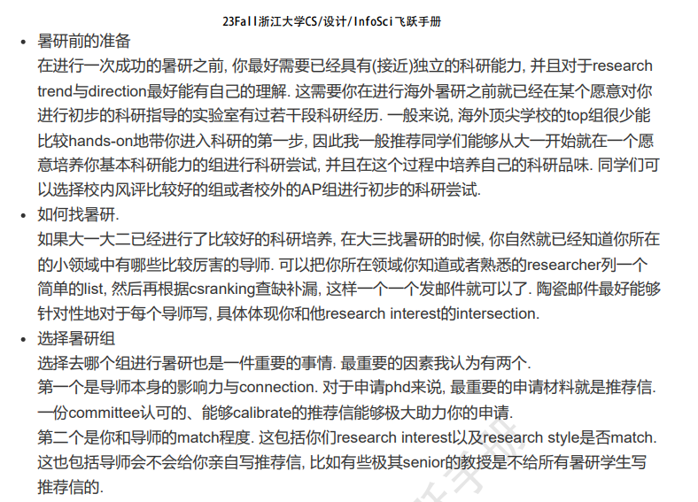
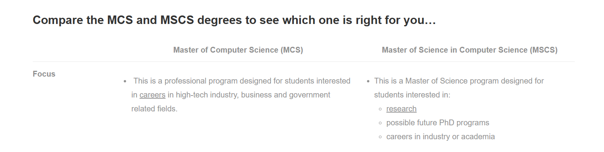
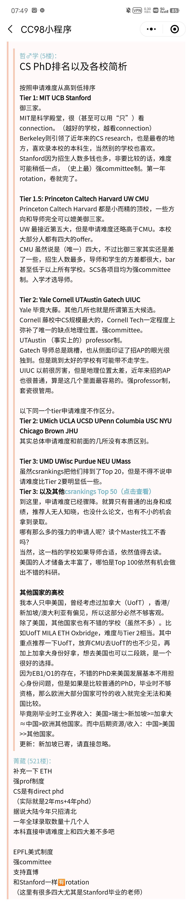
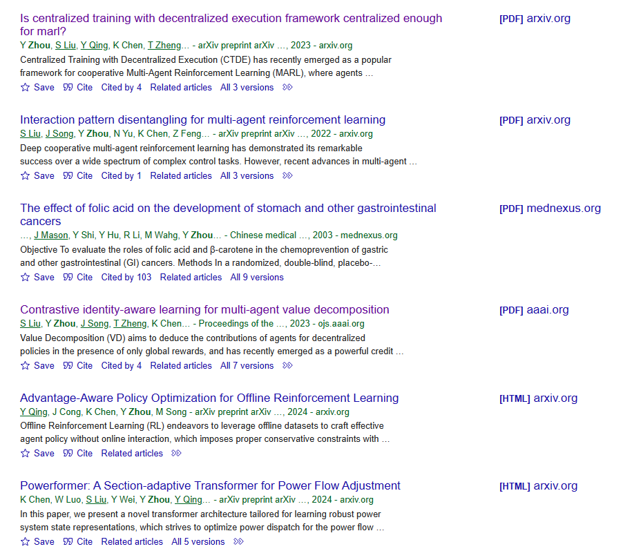

# 升学相关

[TOC]

怕，就输一辈子。一些争取资源的尝试。

## 简历

模板：

- [北美 CS Resume 英文模板](https://github.com/shengyuan-lu/CS-Resume-LaTeX-Template/tree/main?tab=readme-ov-file)：可以按照这个模板先写一份，其他 github 上也有 star 过
- [中文保研文书模板](https://github.com/yuezih/King-of-Pigeon)：包含内容比较多，简历、套磁信之类的都有

经验：

- [知乎-留学申请简历怎么写](https://zhuanlan.zhihu.com/p/27391723)
    1. 建议在写简历之前看看目标院校有没有特殊的简历要求
    2. 去目标院校看看教授的简历是怎么写的
- Q 的建议
    1. 现在正在做的项目可以写，算是研究经历
    2. OI 可以写连续两年省一，算是获奖经历
    3. 感觉皮艇出国交流可以算一个额外经历写一下
    4. 超算、CV、大二短学期的课程项目可以写

## 暑研

计划：

1. ~~先写好英文简历~~
2. ~~先发邮件问问 sml~~
3. ~~再发邮件问问吴飞，说明自己是图灵班 + 排名 + 预计有一篇 nips 二作投稿，想要线下暑研~~
4. 然后搜索别的院校 -> 实验室 -> 导师 ==todo==
    - UIUC 目标导师看 google scholar 和 github
    - Li Yunzhu 的 imitation learning 看看论文
    - Wang Shenlong 的 3d vision 看看论文
    - 看飞跃手册和学校排名，找其他学校
5. 做中文简历
6. 做面试 ppt
7. 搞一下个人网站，最好放 github pages 吧不用担心服务器过期
8. 看 difussion & GAN 简历上的东西得说得出来。后续还有半监督学习综述可以看看
9. ~~尝试联系飞跃手册上的刘嘉腾学长~~

资源：

- 公众号-研真清：留学相关信息、资源、机会
- [小红书经验帖](http://xhslink.com/pCvkME)
    1. 暑研最重要的目的是拿推荐信
    2. 2月到5月都可以尝试发暑研申请
    3. 如果自己套磁的话每周发 5-10 封
    4. 准备好面试 ppt，包含简历和科研经历
    5. 提前打听实验室氛围、给推荐信概率，可以搜索导师风评、发邮件问同专业其他学生或者实验室学生

经验：

- **飞跃手册耿晨**(p36)，真的很有用，还有一些推荐阅读之后看看 ==todo== 
- 刘嘉腾 MSCS(p62)，感觉科研经历跟我很像，可以参考以下，考虑 UIUC MSCS ==todo==
- MCS 和 MSCS 的区别 
- 北美学校排名 

我的想法：

- 首先未来去向上还是决定要出国
- 主申北美 phd 和便宜的 ms，目前很想去 uiuc，nus 和 ntu 做保底
- 暑研先冲北美，优先 on-site，remote 也可以，冲不到就呆国内安心做科研

### UIUC

信息：

- [all faculty](https://cs.illinois.edu/about/people/all-faculty)
    - [Heng Ji](https://cs.illinois.edu/about/people/faculty/hengji): 飞跃手册里学长暑研找的导师
    - [Alawini](https://alawini.web.illinois.edu/)：Teaching Assistant, 研究方向 AI 教育，可以看看
- [AI 领域](https://cs.illinois.edu/research/areas/artificial-intelligence)：有 faculty 和实验室这种的信息
    - [robotics 实验室](https://robotics.illinois.edu/people/)
        - [Wang ShenLong](https://robotics.illinois.edu/people/shenlong-wang/): 在做 3d vision 和 robotics 交叉，有个上交的同学在做 visiting student
        - [Li YunZhu](https://cs.illinois.edu/about/people/all-faculty/yunzhuli): PKU -> MIT -> Stanford，工作主要是在 robotics, CV 和 ML
    - [AI 实验室](https://ai.ncsa.illinois.edu/)
        - [Li Bo](https://aisecure.github.io/): AI 安全，博弈论，对抗机器学习。但是准备要去芝加哥大学了，所以还是算了

### 邮件联系

- 宋明黎：目前只让老师评价一下我的规划是否可行，之后还需要问问他能不能帮忙
    - sml 说可以给 uiuc 的暑研！但其实还没有保障，所以尽快把这件事搞定
    - 联系 ShenLong Wang 是
- 吴飞：表明想去北美，提出加微信聊聊
    - 加微信先把 sml 给的暑研跟他说，表明优先想去北美，问问北美能推荐什么学校 & 暑期课程是有什么要求
- 刘嘉腾：提出暑研相关的问题，4.8 还没回尝试问问学长或者 sml 要联系方式

### 感兴趣的方向

- ai4sci
- robotics [入门](https://zhuanlan.zhihu.com/p/143372318)
- 

## 找导师

计划：

1. 找找别的学校学院的官网，看导师信息，找找有没有心仪的导师
2. 看 csrankings 和小红书找海外导师

资源：

- google scholar
- arxiv
- 小红书收藏-海外博士招生信息

### 尝试搜索 Yihe Zhou

1. 首先在 google scholar 上搜索 "Yihe Zhou"，前几篇除了 medical 的都是他参与的文章 
2. 第一篇他是一作，比较好奇。所以怎么看文章发表在什么会议或者期刊上？
    - 有可能是在投或者没发到会议或者期刊，即便如此也可以发在 arxiv 上。顶会是论文质量的评价标准，但不是唯一标准，arxiv 上的被引量也是
3. 第四篇发在 AAAI 的他排在第二位，但是怎么看是共一还是二作？
    - 把文章下载下来，如果是共一的话肯定会有注释标明 "contributed equally" 的。他这篇就是共一

最终结果就是，Yihe Zhou 的成果，一篇 AAAI 共一，一篇一作在投，还有一些参与的工作。

## 夏令营

计划：

1. 找开夏令营的学院：北大、清华的计算机相关学院
2. 找历年夏令营的通知，看报名时间、线下时间
3. 找小道消息夏令营给 offer 的难度
4. 找对应学院的老师直接套磁

信息：

- 清华计算机学院