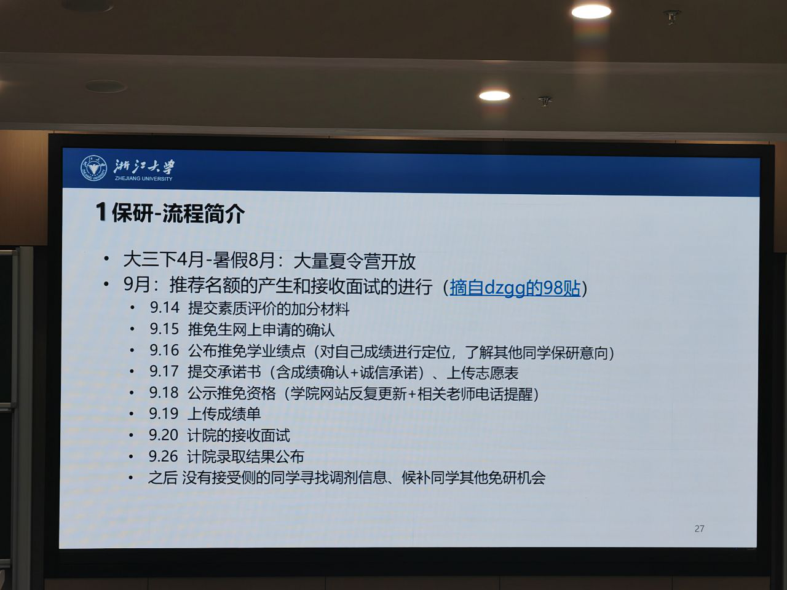
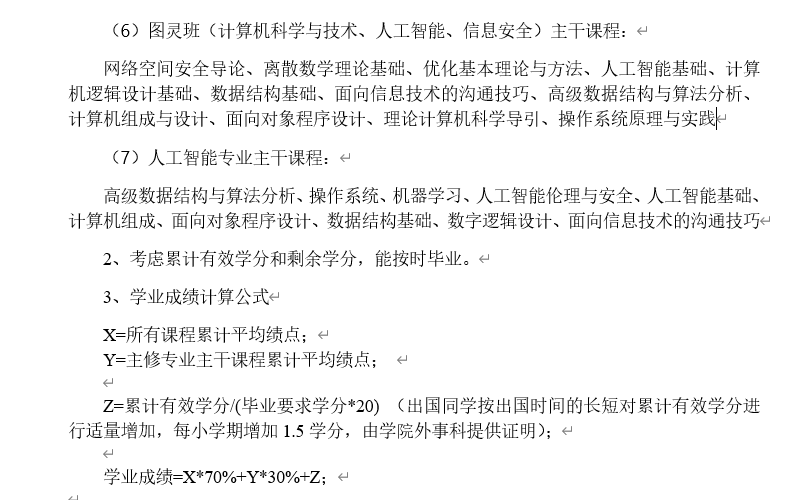

# 本科毕业出路经验分享

## 信息来源：宣兴琦

1. 保研
    - 推免 & 接收：保研了也不是一劳永逸了
    - 校内：成绩很重要，选导师还是按照绩点排名
    - 校外：绩点参考价值较小，竞赛和科研可能会影响较大，会有笔试和面试
2. 考研
    - 自律？能保研就保研，考研太考研人了
3. 出国
    - 推荐：早点跟导师搞好关系，找国内外的大牛写推荐会很有用
    - 语言：提前开始准备，考托福雅思

总结：准备保研就先把绩点搞上去，准备出国就一直保持语言的学习。

## 竺院年级大会

### 出国

1. 托福暑假改版，大部分项目要求 105+
1. 港新需要托福 & 雅思
1. CV 详细 / resume 一页
1. 大二暑假考托福+科研，大三暑假可以暑期实习 or 暑研？
1. 套磁（PhD）

### 保研

1. 保研绩点：70% 总绩点 + 30% 主修专业
1. 
1. 提前接触老师 + 感兴趣的研究方向
1. 图灵计科的主修专业 