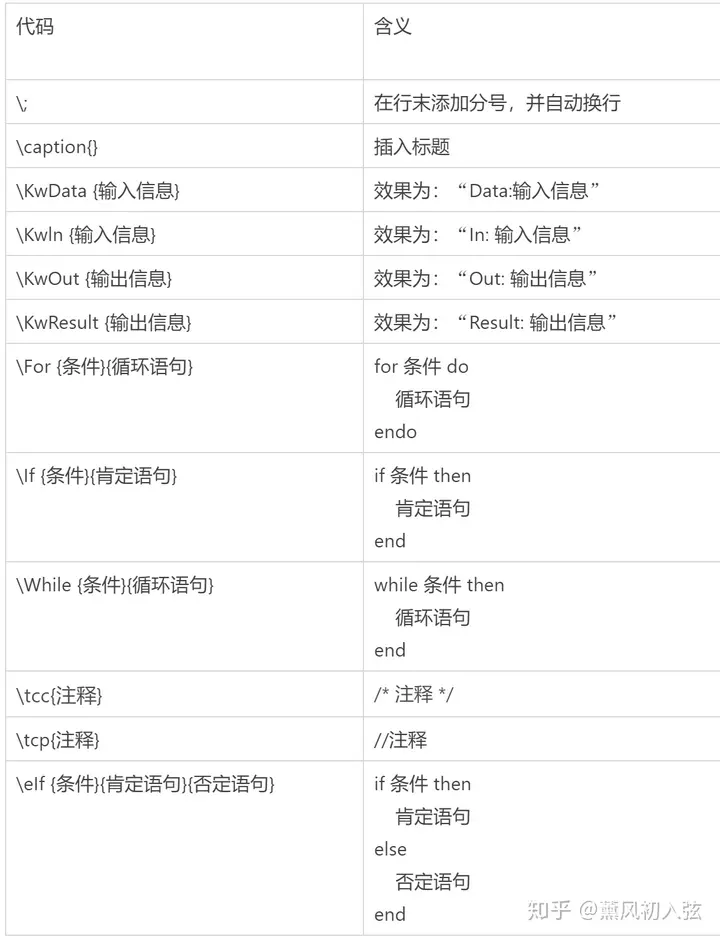

# $\LaTeX$ 学习笔记

[TOC]

## 语法

1. 优秀的入门文档：[一份其实很短的 LaTeX 入门文档 | 始终 (liam.page)](https://liam.page/2014/09/08/latex-introduction/)
2. 超简单版：[Latex基础语法 - 知乎 (zhihu.com)](https://zhuanlan.zhihu.com/p/52347414)
3. overleaf 的 30 min 入门：[Learn LaTeX in 30 minutes - Overleaf, Online LaTeX Editor](https://www.overleaf.com/learn/latex/Learn_LaTeX_in_30_minutes)
4. 参考数学符号：[mohu](http://mohu.org/info/symbols/symbols.htm)
5. 带目录的文档：[中文版Latex常用语法大全教程](https://blog.csdn.net/tianzong2019/article/details/106521432)

### 基本结构

```latex
\documentclass{article}

% 这里是导言区（% 后面是注释）

\begin{document}

This is the main content.

\end{document}
```

### 导言区

#### 文档类型

```latex
\documentclass{article}
```

其他文档类型：

1. article

2. report

3. book

4. 

#### 标题、作者、日期、摘要、目录

```latex
\title{My First LaTex Document}
\author{StarlightXYY}
\date{\today}


% 在正文中生成标题、作者、日期
\maketitle
% 在正文中编写摘要
\begin{abstract}
LaTex is an elegant typesetting tool.
\end{abstract}
% 在正文中生成目录
\tableofcontents
```

> 1. 注意 `article` 默认不会给标题和目录单独一页，需要用 `\newpage` 来翻页。
> 
> 2. 目录居中 `\begin{center} ... \end{center}`
> 

> 
> 4. 目录数字字体设置
>    
>    ```latex
>    % 前言和摘要可以设置成罗马数字
>    \pagenumbering{Roman}
>    % 正文的页码设置成阿拉伯数字
>    \pagenumbering{arabic}
>    ```

> 目录支持点击跳转的方法：
> 
> ```latex
> 
> ```

##### 目录起始页码设置

 
```latex
\setcounter{page}{0}
\thispagestyle{empty}
\newpage
%<---从这里开始是正文--->%
```

##### 修改目录的标题

```latex
\renewcommand*\contentsname{Contents}
```


#### 调用宏包

```latex

```

#### 支持中文

```latex
\usepackage{ctex}
```

### 正文区

#### 章节、段落

```latex
% in article
\section{}
\subsection{}
\subsubsection{}
\paragraph{}
\subparagraph{}
\subsubparagraph{}
% in report
\chapter{}
% in book
\part{}
```

##### 无数字 section 标题

无数字默认不加入目录中，需要手动设置

```latex
\addcontentsline{toc}{section}{Unnumbered Section}
\section*{Unnumbered Section}
```

##### 修改字体大小、加粗、斜体、颜色等样式

1. 修改字体大小的命令从小到大为：

```latex
\tiny{Hello!}
\scriptsize
\footnotesize
\small
\normalsize
\large
\Large
\LARGE
\huge
\Huge
```

2. 加粗

两种写法都可以

```latex
\textbf{Boldface Series Hello}
{\bfseries Boldface Series Hello}
```

3. 斜体

up是直立，it是斜体，sl伪斜体（字宽比斜体略大），小型大写是sc。两种写法都可以

```latex
\textup{Upright Shape Hello!}
\textit{Italic Shape Hello!}
\textsl{Slanted Shape Hello!}
\textsc{Small Caps Shape}

{\upshape Upright Shape Shape Hello!}
{\itshape Italic Shape Shape Hello!}
{\slshape Slanted  Shape Hello!}
{\scshape Small Caps Shape  Shape Hello!}
```

4. 字体样式

- 罗马字体，Roman Family，字体起始有装饰
- 无衬线字体：Sans Serif 字体起始无装饰
- 打字机字体:Typewriter Family字体宽度都相同

```latex
\textrm{Roman Family Hello Latex!}
\textsf{Sans Serif Family Hello Latex!}
\texttt{Typewriter Family Hello Latex!}

{\rmfamily Roman Family Hello Latex!}
{\sffamily Sans Serif Family  Hello Latex!}
{\ttfamily Typewriter Family  Hello Latex!}
```

#### 数学公式

##### 对齐

```latex
\usepackage{amsmath}

\begin{align}
\frac{|geo(p_k, p_j)-geo(q_k, q_j)|}{(geo(p_k, p_j)+geo(q_k, q_j))/2}>\epsilon_C\\
\frac{|rad(p_k, p_j)-rad(q_k, q_j)|}{(rad(p_k, p_j)+rad(q_k, q_j))/2}>\epsilon_C
\end{align}
```

`align` 会自动在公式后加编号，`align*` 不会

##### 矩阵

[可以看这个博客](https://zhuanlan.zhihu.com/p/266267223)


#### 插入图片

1. `\graphicspath{ {./images/} }` 图片的相对路径（关于主文件）或者绝对路径
1. `\includegraphics{universe}` *只需要包含图片名称*，不需要拓展名。The file name of the image should not contain white spaces nor multiple dots.
1. 图片放缩中，If only the width parameter is passed, the height will be *scaled to keep the aspect ratio*.
1. rotating unit is  degrees and direction is counter-clockwise.
1. figure 的参数


| Parameter      | Position |
| ----------- | ----------- |
| h  |  Place the float here, i.e., approximately at the same point it occurs in the source text (however, not exactly at the spot) |
| t  |  Position at the top of the page. |
| b  |  Position at the bottom of the page. |
| p  |  Put on a special page for floats only. |
| !  |  Override internal parameters LaTeX uses for determining "good" float positions. |
| H  |  Places the float at precisely the location in the LATEX code. Requires the float package, though may cause problems occasionally. This is somewhat equivalent to h!. |

1. wrapfigure 相当于拿一个 div 在 img 外面把他套住， `\centering` 比如是在 wrapfigure 位置确定的基础上进行居中。参数如下：

| Parameter |     | Position |
|--|--|--|
| r | R | right side of the text |
| l | L | left side of the text |
| i | I | inside edge–near the binding (in a twoside document) |
| o | O | outside edge–far from the binding |


举例：

```latex
\usepackage{graphicx}
\graphicspath{ {./images/} }

% basic use
\includegraphics{universe}
% changing size
\includegraphics[scale=1.5]{overleaf-logo}
\includegraphics[width=5cm, height=4cm]{overleaf-logo}
\includegraphics[width=\textwidth]{universe}
% rotating
\includegraphics[scale=1.2, angle=45]{overleaf-logo}
% positioning
\begin{figure}[t]
\includegraphics[width=8cm]{Plot}
\centering
\end{figure}
% wrap
\begin{wrapfigure}{r}{0.25\textwidth} %this figure will be at the right
    \centering
    \includegraphics[width=0.25\textwidth]{mesh}
\end{wrapfigure}
```

#### 插入列表

参考文档：[技术|LaTeX 排版（1）：列表 (linux.cn)](https://linux.cn/article-13112-1.html)

```latex
\begin{itemize} % 无序列表
    \item Fedora
\end{itemize}
\begin{enumerate} % 有序列表
    \item Item
\end{enumerate}
```

##### 修改列表样式

首先要导入包

```latex
\usepackage{enumerate}
\begin{enumerate}[i)]
    \item one
\end{enumerate}
\begin{enumerate}[(1)]
    \item one
\end{enumerate}
\begin{enumerate}[a.]
    \item one
\end{enumerate}
```

#### 插入代码

##### 方法一：使用 minted

> 相比于 listlings， minted 的代码高亮做的更好

[参考博客](https://blog.nowcoder.net/n/eee24339a6b641068d08d7dc7d8cd750?from=nowcoder_improve#:~:text=LaTeX%20%E4%BD%BF%E7%94%A8%20minted%20%E9%9C%80%E8%A6%81%E5%85%88%E5%AE%89%E8%A3%85%20pygments%20%EF%BC%8C%E8%BF%99%E6%98%AF%E4%B8%80%E4%B8%AA%20Python,%E7%9A%84%E5%BA%93%EF%BC%8C%E5%9C%A8%20Ubuntu%20%E4%B8%8A%E5%8F%AF%E4%BB%A5%E9%80%9A%E8%BF%87%E4%B8%8B%E5%88%97%E5%91%BD%E4%BB%A4%E5%AE%89%E8%A3%85%EF%BC%8C%201%20sudo%20apt-get%20install%20python-pygments)

> minted 官方文档在 Latex 文件夹下

1. 下载依赖： `pip install pygments`
2. 修改编译配置：`settings.json`，加入 `--shell-escape` 以使用外部工具，加入 `-8bit` 避免 tab 乱码
   ```json
   {
      "name": "xelatex",
      "command": "xelatex",
      "args": [
            "--shell-escape",
            "-8bit",
            "-synctex=1",
            "-interaction=nonstopmode",
            "-file-line-error",
            "%DOCFILE%" // %DOC% 改成 %DOCFILE% 则路径可以是中文，但只能访问 root 目录下的文件（好像）
      ]
   }
   ```
3. 引用包：minted 支持的代码高亮格式可以使用 `pygmentize -L styles` 进行查看
   ```latex
   \usepackage{xcolor} % 自定义时可能会用到颜色
   \usepackage{minted}
   \usemintedstyle{material} % 修改高亮主题
   ```
4. 使用
   - `pygmentize -L lexers` 查看支持的语言
   1. 代码块
      ```latex
      \begin{minted}{python}
      import numpy as np
      \end{minted}
      ```
   2. 行内代码
      ```latex
      \mintinline{python}{import numpy as np}
      ```
   3. 引用外部文件
      ```latex
      \inputminted{cpp}{./main.cpp}
      ```
5. 配置
   1. 单次配置：加中括号
      ```latex
      \mintinline{python}[bgcolor=bg,linenos]{import numpy as np}
      ```
   2. 全局配置
      ```latex
      % 行内代码
      \newmintinline{python}{bgcolor=bg,breaklines,breakanywhere,python3}
      \pythoninline{from numpy import sin,cos,tan,exp,pi}
      % 代码块
      \newminted{cpp}{linenos,bgcolor=bg}
      \begin{cppcode}
      \end{cppcode}
      % 引用外部文件
      \newmintedfile{python}{bgcolor=bg,breakanywhere,breaklines}
      \pythonfile{test.py}
      ```
   3. 常用配置参数
      - linenos:在代码前设置数字表示代码的第几行，为True或者False，默认不开启，开启使用[linenos=true]
      - mathescape:用来在代码段中插入公式。因为代码段中的所有文字都当做字符，不受latex语法控制，所以$\Sigma$这样的文字被当做不同字符而不是Latex公式，使用上面的参数就可以在输入公式的时候避免被当做字符。
      - breaklines:在minted环境中自动折断比较长的行，默认自动在供个字符折断。
      - bgcolor:设置代码的背景色
      - escapeinside:在escape制定的符号里面的内容不受minted环境影响，丽日escapeinside=|ex|表示||里面的内容不被当做minted的字符而是latex的公式
      - firstline:整数。显示的第一行默认为1，在插入代码的时候有时候为了方面一行行讲解代码，比如说从第5行代码起为xx功能，这时候可以指定这个。通常也同时在代码前的数字也修改为对应的行（firstnumber）
      - firstnumber:(auto|last|integer)指定代码前的数字标号。
      - frame:(none|leftline|topline|bottomline|lines|single)代码附近放置的分隔，比如topline将在代码顶端防止一行直线。
      - framerule:分隔线的宽度（默认为0.4pt）
      - framesep:分割线和代码的距离(默认为\fboxsep)
      - hightlightcolor（string）:为highlightlines设置颜色，使用xcolor预定义的颜色或者通过\definecolor指定的颜色设置代码高亮语法。
      - highlightlines(字符串)：高亮单行或者某几行例如highlightlines={1,3-4},高亮第一行和3,4行，如果linenos=true,则根据linenos前面的行制定。
      - lastline（整数）显示的末行
      - python3 为python指定Python3高亮
      - rulecolor(颜色命令)：分割线的颜色
      - showspace(bool)显示空格为小的U型
      - showtabs(bool)显示tab
      - spacecolor空白的颜色
      - tabcolor tab的颜色(默认为黑色)

##### 方法二：使用宏包 `listlings`

listlings 设置参考文档：[LaTeX listings 宏包使用说明 - 知乎 (zhihu.com)](https://zhuanlan.zhihu.com/p/261667944)

配置和美化 codeblock 参考 [overleaf 教程](https://www.overleaf.com/learn/latex/Code_listing)

```latex
%<--------------------导言区-------------------->%
\usepackage{listings}
\usepackage{xcolor} % 用于自己设置代码高亮
\lstset{
 basicstyle=\small\ttfamily,                          % 使用等宽字体    
 numbers=left,                                        % 在左侧显示行号
 numberstyle=\scriptsize\color{gray},                 % 设定行号格式
 numbersep=1em,                                       % 行号和代码的距离
 frame=none,                                          % 不显示背景边框
 backgroundcolor=\color[RGB]{245,245,244},            % 设定背景颜色
 breaklines=true,                                     % 代码超出宽度换行
 showstringspaces=false,                % 不显示字符串中的空格（下划线显示）
 tabsize=4                                            % tab 大小
}
%<--------------------正文区-------------------->%
\begin{lstlisting}
##include<bits/stdc++.h>
using namespace std;

int main()
{
    cout << "Hello World!" << endl;
    return 0;
}
\end{lstlisting}
```

> 其他设置：
> 
> ```latex
> keywordstyle=\color[RGB]{40,40,255},                 % 设定关键字颜色
> commentstyle=\it\color[RGB]{0,96,96},                % 设置代码注释的格式
> identifierstyle=\color{red}                          % 设置标识符格式（括号、标点）
> stringstyle=\rmfamily\slshape\color[RGB]{128,0,0},   % 设置字符串格式
> language=c++,                      % 设置语言(也可以在正文中的[]里说明)
> ```
> 
> 在注释中使用中文和公式：
> 
> ```latex
> extendedchars=true,   % 设置 escape 的代码用 latex 解析显示
> escapechar=\%,        % 设置被 % 包围的代码 escape
> texcl=true,           % 设置注释的代码用 latex 解析显示
> ```

#### 插入伪代码

[参考知乎文章](https://www.zhihu.com/tardis/zm/art/166418214?source_id=1005)

主要的语法都在这张表格里：



最常用的框架可以参考这个：

```latex
\def\SetClass{article}
\documentclass{\SetClass}
\usepackage[ruled,linesnumbered]{algorithm2e}
\begin{document}
\begin{algorithm}
\caption{Simulation-optimization heuristic}\label{algorithm}
\KwData{current period $t$, initial inventory $I_{t-1}$, initial capital $B_{t-1}$, demand samples}
\KwResult{Optimal order quantity $Q^{\ast}_{t}$}
$r\leftarrow t$\;
$\Delta B^{\ast}\leftarrow -\infty$\;
\While{$\Delta B\leq \Delta B^{\ast}$ and $r\leq T$}{$Q\leftarrow\arg\max_{Q\geq 0}\Delta B^{Q}_{t,r}(I_{t-1},B_{t-1})$\;
$\Delta B\leftarrow \Delta B^{Q}_{t,r}(I_{t-1},B_{t-1})/(r-t+1)$\;
\If{$\Delta B\geq \Delta B^{\ast}$}{$Q^{\ast}\leftarrow Q$\;
$\Delta B^{\ast}\leftarrow \Delta B$\;}
$r\leftarrow r+1$\;}
\end{algorithm}
\end{document}
```


#### 插入流程图

参考文档：

1. 比较详细的博客：[LaTeX画流程图 - 梧桐鹿 - 博客园 (cnblogs.com)](https://www.cnblogs.com/deer2021/p/15096624.html)

2. [[LaTeX 绘图] tikz 绘制流程图，概述和两个示例 - 知乎 (zhihu.com)](https://zhuanlan.zhihu.com/p/82435856)

基本使用：

1. `\node[形状、位置参数] (代号) {}`
   
   1. 形状：
      
      - default：长方形
      
      - `rounded corners`：常用作开始和结尾
      
      - `diamond`：常用作分支判断
   
   2. 位置：
      
      - `below=of some_name` ：在 some_name 下方默认距离
      
      - `right=30pt of some-name` 在 some_name 右边 30pt 的距离

2. `\graph{}` 可以用链的方式来表示 node 之间的关系
   
   1. `(choice) ->["Yes"left] (end)` 中括号内是连线上的注释，写在线的哪个位置

```latex
%<--------------------导言区-------------------->%
\usepackage{tikz}
\usetikzlibrary{graphs, positioning, quotes, shapes.geometric}
%<--------------------正文区-------------------->%

% 定义属性
\tikzstyle{startstop} = [rectangle,rounded corners, minimum width=3cm,minimum height=1cm,text centered,text width =3cm, draw=black,fill=red!30]
\tikzstyle{io} = [trapezium, trapezium left angle = 70,trapezium right angle=110,minimum width=3cm,minimum height=1cm,text centered,text width =3cm,draw=black,fill=blue!30]
\tikzstyle{process} = [rectangle,minimum width=3cm,minimum height=1cm,text centered,text width =3cm,draw=black,fill=orange!30]
\tikzstyle{decision} = [diamond,aspect = 3,text centered,draw=black,fill=green!30]
\tikzstyle{arrow} = [thick,->,>=stealth]
\tikzstyle{straightline} = [line width = 1pt,-]
\tikzstyle{point}=[coordinate]

% 画图
\begin{tikzpicture}[node distance=2cm]
  \node (start) [startstop] {开始};
  \node (input1) [io,below of=start] {输入聚类的个数 $k$ 和最大迭代次数 $n$ };
  \node (process1) [process,below of=input1] {初始化 $k$ 个聚类中心};
  \node (process2) [process,below of=process1] {分配各数据对象到距离最近的类中};
  \node (decision1) [decision,below of=process2,yshift=-0.5cm] {是否收敛或迭代次数达到 $n$ };
  \node (stop) [startstop,below of=decision1,node distance=3cm] {输出聚类结果};
  \node(point1)[point,left of=input1,node distance=5cm]{};

  \draw [arrow] (start) -- (input1);
  \draw [arrow] (input1) -- (process1);
  \draw [arrow] (process1) -- (process2);
  \draw [arrow] (process2) -- (decision1);
  \draw [arrow] (decision1) -- node[anchor=east] {是} (stop);
  \draw [straightline] (decision1) -|  (point1);
  \draw [arrow] (point1) -- node[anchor=south] {否} (input1);
\end{tikzpicture}

% 画图（用 graph 生成连线）
\begin{tikzpicture}[node distance=10pt]
  % 节点
  \node[draw, rounded corners]                        (start)   {Start};
  \node[draw, below=of start]                         (step 1)  {Step 1};
  \node[draw, below=of step 1]                        (step 2)  {Step 2};
  \node[draw, diamond, aspect=2, below=of step 2]     (choice)  {Choice};
  \node[draw, right=30pt of choice]                   (step x)  {Step X};
  \node[draw, rounded corners, below=20pt of choice]  (end)     {End};

  % 连线
  \graph{
    (start) -> (step 1) -> (step 2) -> (choice) ->["Yes"left] (end);
    (choice) ->["No"] (step x) ->[to path={|- (\tikztotarget)}] (step 2);
  };
\end{tikzpicture}
```

> 在 node 中显示多行文字：**设置文本宽度** + 换行符
> 
> ```latex
> \tikzstyle{multiple_line} = [text width=6cm];
> \node[multiple_line] (start) {Line1 \\ Line2 \\ Line3};
> ```

#### 插入表格

##### Excel2Latex 插件

[github repo](https://github.com/ivankokan/Excel2LaTeX)

使用方法是在打开 excel 之后再点击 `Excel2LaTeX.xla` 文件，在 excel 的顶部导航中会出现一个新的栏目。

在自动转换之后还需要加上包依赖和格式
1. 表格样式之间加上竖线
2. 每行之间加上横线
3. 多行的之间加上短横线 `\cline`
4. 如果表格太大就调整表格大小
5. 如果原文件已经包含 xcolor，只需要在方括号中加上 table 即可，不用重新包含

```latex
% 包依赖
\usepackage{multirow} % 多行
\usepackage{array} % 对齐
\usepackage{graphicx} % 表格自动调整大小
\usepackage[table]{xcolor} % 表格颜色

% 格式
\begin{tabular}{| c | c | c | c | c | c | c | c |} % 表格竖线的样式
\hline % 整行的横线
\cline{x-y} % 长度从第 x 列到第 y 列的横线
$(x+y)^n$ % 公式需要手动修改
\resizebox{\textwidth}{!}{} % 用这个包含 tabular，自动缩放大小防止越界
```

##### 基本语法

[overleaf 官方教程](https://www.overleaf.com/learn/latex/Tables#Creating_a_simple_table_in_LaTeX)

### 文末区

#### 脚注

```latex
%  最简单的使用方法
\footnote[number]{text for footnote}
% 先标记，后写内容，使文档结构更清晰
\footnotemark[number]
\footnotetext[number]{text for footnote}
```

[overleaf 教程](https://www.overleaf.com/learn/latex/Footnotes)

#### 参考文献

[参考知乎](https://zhuanlan.zhihu.com/p/265479955)

在文末建立参考文献表

```latex
\begin{thebibliography}{99}  

\bibitem{ref1} reference1
\bibitem{ref2} reference2
\bibitem{ref3} reference3
\bibitem{ref4} reference4

\end{thebibliography}
```

在文中引用

```latex
\cite{ref1}
\cite{ref1, ref5}
```

#### 索引

### 注意事项和常见错误

#### 空白区域

#### BibTex 报错 "I found no \citation commands---while reading file lab1_report.aux"

在导言区加入 `\usepackage[backend=bibtex]{biblatex}`

#### 特殊字符

`\## \$ \% \^{} \& \_ \{ \} \~{}` 需要加反斜杠。

`() [] : '"` 不用加反斜杠。


## 安装

1. [安装LaTex + 测试中文](https://zhuanlan.zhihu.com/p/56982388)
2. LATEX+VScode
   - [安装和配置](https://zhuanlan.zhihu.com/p/38178015)
   - **重点看这篇：**[配置文件解读](https://zhuanlan.zhihu.com/p/166523064)
3. [Overleaf：在线 LATEX编辑器](https://www.overleaf.com/project)

### 报错和解决办法

1. [Recipe terminated with fatal error: spawn xelatex ENOENT](https://blog.csdn.net/mengxt169/article/details/110126235)

### settings

1. 右下角错误弹窗：`latex-workshop.message.error.show`
2. 中文路径： `%DOCFILE%` 和 `%DOC%`
3. 自动编译：`latex-workshop.latex.autoBuild.run`
4. 清理中间文件：`latex-workshop.latex.autoClean.run`
5. 在右键菜单栏中显示正向查找：`latex-workshop.showContextMenu`
6. 反向查找：`latex-workshop.view.pdf.internal.synctex.keybinding`

### 操作

1. 编译：选择编译链->双击->左下角显示 √ 或者 × 
2. 正向搜索：右键菜单 或者 `ctrl+alt+J`
3. 反向搜索：双击 pdf 中的元素，反向定位到 tex 文件中（需要中间文件）