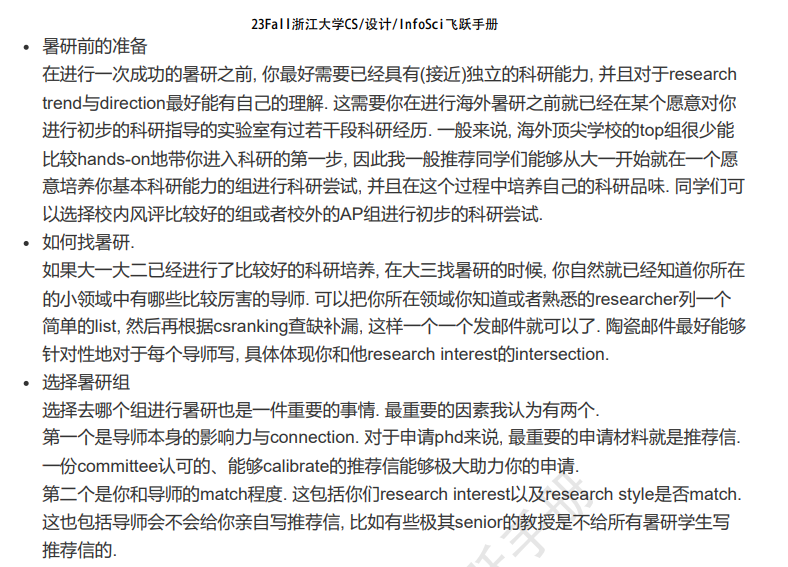
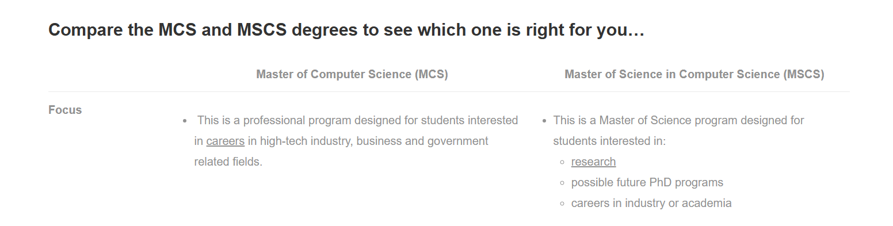
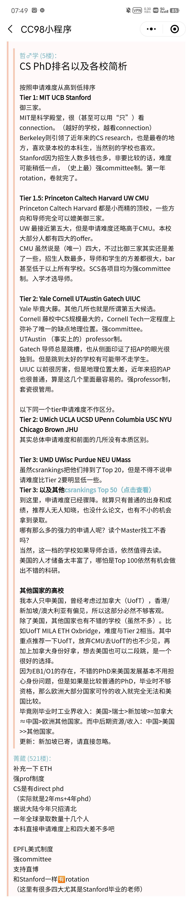
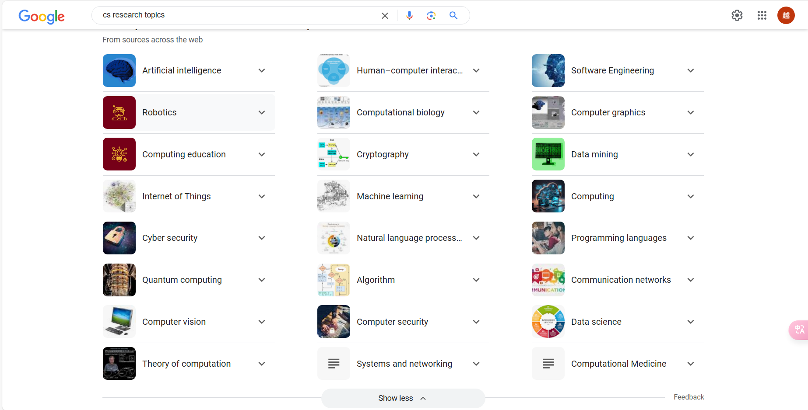
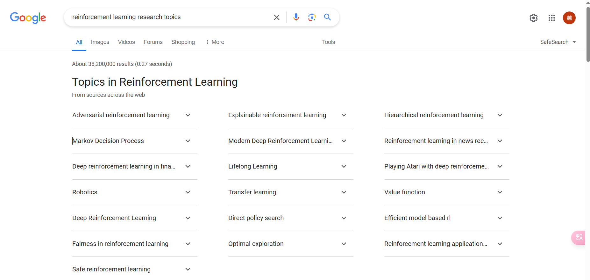
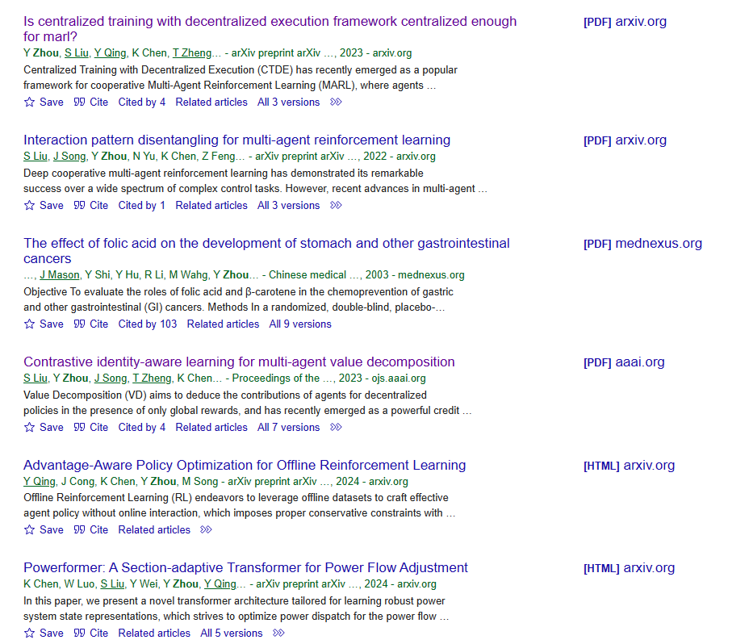

# 升学相关

[TOC]

怕，就输一辈子。一些争取资源的尝试。

## 简历

模板：

- [北美 CS Resume 英文模板](https://github.com/shengyuan-lu/CS-Resume-LaTeX-Template/tree/main?tab=readme-ov-file)：可以按照这个模板先写一份，其他 github 上也有 star 过
- [中文保研文书模板](https://github.com/yuezih/King-of-Pigeon)：包含内容比较多，简历、套磁信之类的都有

经验：

- [知乎-留学申请简历怎么写](https://zhuanlan.zhihu.com/p/27391723)
    1. 建议在写简历之前看看目标院校有没有特殊的简历要求
    2. 去目标院校看看教授的简历是怎么写的
- Q 的建议
    1. 现在正在做的项目可以写，算是研究经历
    2. OI 可以写连续两年省一，算是获奖经历
    3. 感觉皮艇出国交流可以算一个额外经历写一下
    4. 超算、CV、大二短学期的课程项目可以写

目前已经写了一个英文版 resume

## 暑研

### 整体计划 & todo

1. ~~先写好英文简历~~
2. ~~先发邮件问问 sml~~
3. ~~再发邮件问问吴飞，说明自己是图灵班 + 排名 + 预计有一篇 nips 二作投稿，想要线下暑研~~
4. 然后搜索别的院校 -> 实验室 -> 导师 ==todo==
    - ~~UIUC 目标导师看 google scholar 和 github~~
    - Li Yunzhu 的 imitation learning 看看论文
    - ~~Wang Shenlong 的 3d vision 看看论文~~
    - 看飞跃手册和学校排名，找其他学校
    - 看 UC 系，UCSD，UCLA，还有欧陆学校 ETH 和 EPFL，还有港的 MMLab，新的 NUS
    - ~~看 opencs.app 上的出国项目~~
5. 做**中文简历**，顺便可以做一个求职简历要是之后有活动可以去看看
6. 做**面试 ppt**
7. 搞一下**个人网站**，最好放 github pages 吧不用担心服务器过期
8. 看 difussion & GAN 简历上的东西得说得出来。后续还有半监督学习综述可以看看
9. ~~尝试联系飞跃手册上的刘嘉腾学长~~
    - 尝试联系**飞跃手册**上留下 QQ 微信的学长
10. 了解美国、欧洲、新加坡、香港的**签证**政策
11. 看看知乎的经验帖，链接放在下面了 & 看看一亩三分地有哪些有用的版块 
12. 了解 **国内院校**，比如浙大的 CAD 实验室，计院还有哪些比较厉害的导师
13. ~~找 zsy 了解北大的情况~~

我的想法：

- 首先未来去向上还是决定要出国
- 暑研先冲北美，冲不到就套国内导师，都不行就跟着 sml 慢慢沉淀
- 申请季冲北美，港新保底

### 一些信息 & 资源 & 知乎经验帖

资源：

- 公众号-研真清：留学相关信息、资源、机会
- [小红书经验帖](http://xhslink.com/pCvkME)
    1. 暑研最重要的目的是拿推荐信
    2. 2月到5月都可以尝试发暑研申请
    3. 如果自己套磁的话每周发 5-10 封
    4. 准备好面试 ppt，包含简历和科研经历
    5. 提前打听实验室氛围、给推荐信概率，可以搜索导师风评、发邮件问同专业其他学生或者实验室学生
- [Sun Wen](https://wensun.github.io/): 康奈尔做 RL 的，海投可以考虑一下
    - For undergraduate/MS students at Cornell and outside visitors: please send me your CV and (unofficial) transcript along with two paragraphs describing your research interests, research experience, and why you want to get invovled. Your chance of getting invovled is higher if the more of the followings hold true: you have a high GPA; you did quite well on courses related to math, statistics, machine learning, robotics, and NLP; you are able to commit 12+ hours per week on research; you have strong programming skills; you have experience on applications like natural language processing, robotics, and computer vision. 他这一段可以作为参考！在给教授写邮件的时候，怎么突出自己的优势，总结一下就是：
        1. GPA 高
        2. 数学、ML 等相关课程分数高
        3. 编程能力强
        4. 有相关项目或者研究经验
        5. 能够投入时间
- 

经验：

- [23fall一个cs phd的申请【关键词：转专业，美国计算机博士，信息安全，计算机系统】 - CC98论坛](https://www.cc98.org/topic/5543901)

- **飞跃手册耿晨**(p36)，真的很有用，还有一些推荐阅读之后看看 ==todo== 
- 刘嘉腾 MSCS(p62)，感觉科研经历跟我很像，可以参考以下，考虑 UIUC MSCS
- MCS 和 MSCS 的区别 
- 北美学校排名 

知乎经验帖：

- [21 fall 北美 CS PhD](https://zhuanlan.zhihu.com/p/350439006)
- [看下这个留学 app](https://zhuanlan.zhihu.com/p/20194964?group_id=622183961577963520): 好像可以辅助大概定位这种

### UIUC 搜集信息记录

信息：

- [all faculty](https://cs.illinois.edu/about/people/all-faculty)
    - [Heng Ji](https://cs.illinois.edu/about/people/faculty/hengji): 飞跃手册里学长暑研找的导师
    - [Alawini](https://alawini.web.illinois.edu/)：Teaching Assistant, 研究方向 AI 教育，可以看看
- [AI 领域](https://cs.illinois.edu/research/areas/artificial-intelligence)：有 faculty 和实验室这种的信息
    - [robotics 实验室](https://robotics.illinois.edu/people/)
        - [Wang ShenLong](https://robotics.illinois.edu/people/shenlong-wang/): 在做 3d vision 和 robotics 交叉，有个上交的同学在做 visiting student
        - [Li YunZhu](https://cs.illinois.edu/about/people/all-faculty/yunzhuli): PKU -> MIT -> Stanford，工作主要是在 robotics, CV 和 ML
        - [Zhao Han](https://hanzhaoml.github.io/): 王高昂老师推荐的导师，
    - [AI 实验室](https://ai.ncsa.illinois.edu/)
        - [Li Bo](https://aisecure.github.io/): AI 安全，博弈论，对抗机器学习。但是准备要去芝加哥大学了，所以还是算了
- 一些学长
    - [交大20夏鸿驰](https://xiahongchi.github.io/)
    - [交大20章俊一](https://www.junyi42.com/)

### UCLA 搜索信息记录

信息：

- [Research Areas | CS (ucla.edu)](https://www.cs.ucla.edu/research-areas/)：查看每个领域下的老师
  - CV
    - [Bolei Zhou](https://boleizhou.github.io/)：做 CV 和 machine autonomy 交叉，还有 trustworthy AI model
    - [Achuta Kadambi | UCLA Samueli School Of Engineering](https://samueli.ucla.edu/people/achuta-kadambi/): CV, computational imaging, robotics, medical devices, leader of [Visual Machines Group (ucla.edu)](http://visual.ee.ucla.edu/) 
  - AI
    - [Kai-Wei Chang (ucla.edu)](https://web.cs.ucla.edu/~kwchang/): NLP & multimodal
    - [Nanyun (Violet) Peng (vnpeng.net)](https://vnpeng.net/)：NLP robust & generalization
    - [Adnan Darwiche | UCLA Samueli School Of Engineering](https://samueli.ucla.edu/people/adnan-darwiche/): reasoning, 感觉真是做传统 ml 的
    - [Cho-Jui Hsieh (google.com)](https://sites.google.com/view/chohsieh-research/home)：ml 理论，模型压缩、并行计算
    - [Aditya Grover (aditya-grover.github.io)](https://aditya-grover.github.io/)：generative model & sequential decision making，跟 RL 还是有点关系的但是还是偏理论
    - [R. Korf's Home Page (ucla.edu)](https://web.cs.ucla.edu/~korf/)：search algorithm
- [Search For Faculty | UCLA Samueli School Of Engineering](https://samueli.ucla.edu/search-faculty/#cs)：所有老师，看看华人面孔

不太了解的方向：

- multimodal
- computational imaging
- reasoning & planning

看了 faculty 感觉 UCLA AI 方向的老师都偏传统，看了 csrankings 上 UCLA 是系统比较强，AI 比较一般，可以之后有空了再来看

### UW 搜索信息记录

信息：

- [Research & Innovation | Paul G. Allen School of Computer Science & Engineering (washington.edu)](https://www.cs.washington.edu/research)：查看 CSE 的所有领域
  - [Robotics | Computer Science & Engineering (washington.edu)](https://robotics.cs.washington.edu/)：robotics 分支，[Robotics | Computer Science & Engineering (washington.edu)](https://robotics.cs.washington.edu/urop/) 如何加入，但应该是只收本校，所以还是算了
    - Qualification 可以参考：Prospective researchers should have a strong programming background. We use Ubuntu and most of our code is either in Python or C++. They should be proficient with debugging code and comfortable with building large systems. Depending on the specific project, we may also be looking for students with experience in machine learning (or a strong foundation in probability, linear algebra, and optimization), computer vision, embedded programming, electronics, mechanical design, or controls.
  - [Machine Learning | Paul G. Allen School of Computer Science & Engineering (washington.edu)](https://www.cs.washington.edu/research/ml/people)：ML
  - [GRAIL: UW Graphics and Imaging Laboratory (washington.edu)](https://grail.cs.washington.edu/)：CV
  - [Automated Planning & Control | Paul G. Allen School of Computer Science & Engineering (washington.edu)](https://www.cs.washington.edu/research/ai/automated_planning_control/people)：传统 AI
  - [Simon Shaolei Du 杜少雷](https://simonshaoleidu.com/)：做 DL 和 RL 理论的
- [Research Areas | Information School | University of Washington (uw.edu)](https://ischool.uw.edu/research/areas)：信息学院，跟 CS 关系比较紧密

UW 感觉很大，但是老师感觉都太厉害了，都是老教授。

然后其他的学校可以多找几个老师投简历，选人上优先投新 ap，如果有华人学生也可以尝试联系一下。方向上主要还是 RL 和 CV 还有 robot learning。感觉邮件里不能说只看了一篇文章，至少看过 some of prof's works 好听一点。

### USC 搜索信息记录

- [Yue Wang](https://yuewang.xyz/)：CV & robotics, 多模态

### NUS 搜索信息记录

- research MS 20w 一年，PhD 全奖。香港 Mphil 和 PhD 也可以考虑
- [CS Research](https://www.comp.nus.edu.sg/cs/research/)
  - [Research Groups - NUS Computing](https://www.comp.nus.edu.sg/cs/research/ai/groups/)
    - [lv-nus.org](http://lv-nus.org/)
    - [Show Lab](https://sites.google.com/view/showlab/join-us)
    - [MapleCG](https://www.comp.nus.edu.sg/~lowkh/research.html#!)
    - [People | AdaComp (nus.edu.sg)](https://adacomp.comp.nus.edu.sg/people/)
    - [People – CVML @ NUS](https://cvml.comp.nus.edu.sg/people/)
  - [People - NUS Computing](https://www.comp.nus.edu.sg/cs/research/ai/people/)
    - [Bryan Low > Multi-Agent Planning, Learning, and Coordination Group (MapleCG) (nus.edu.sg)](https://www.comp.nus.edu.sg/~lowkh/research.html#!)：最近开始做联邦学习了，先往后稍稍
    - [Xinchao Wang (google.com)](https://sites.google.com/site/sitexinchaowang/)：LVLab
    - [Mike Z Shou](https://sites.google.com/view/showlab/join-us)
- 先找了三个，之后再说

### 邮件联系过程记录

- ~~宋明黎~~
    - 目前只让老师评价一下我的规划是否可行，之后还需要问问他能不能帮忙
    - sml 说可以给 uiuc 的暑研！但其实还没有保障，所以尽快把这件事搞定
    - 写个推荐信草稿让黎叔改改，然后火速投送 uiuc，不知道后面还要不要面试之类的，可能还有很多要准备
- ~~吴飞~~
    - 表明想去北美，提出加微信聊聊
    - 加微信先把 sml 给的暑研跟他说，表明优先想去北美，问问北美能推荐什么学校 & 暑期课程是有什么要求
    - 杨展是在吴飞实验室的，被推到 USC 吴飞认识的老师那里，但是进展不太顺利，感觉我去找吴飞希望就更渺茫了
- ~~刘嘉腾~~
    - 提出暑研相关的问题，4.8 还没回尝试问问学长或者 sml 要联系方式
- ~~杨展~~
    - 吴飞说之前帮他推到 USC 过，问问他现在的情况，以及签证
    - upd 他也没找好暑研，然后也不是特别坚定要出国
- ~~张小彬~~
    - 问下 24 届的出国人数，相关统计数据
    - 之后可以
- ~~潘昶皓~~
    - 问下出国的群，然后引出话题问问有哪些出国的人，以及有没有好的暑研，找有暑研的人聊一聊
    - 进入 CS 出国钉钉群，可以在里面找人聊天（确信）
- ~~王高昂~~
    - 宋明黎推荐的导师，国际校区，现在在 uiuc 交流
    - 要请他帮忙看一下简历，提一点建议，推荐一下导师，最后联系一下对方导师
    - 现在加了微信要语音聊天
    - 可以先给 Wang Shenlong 老师投简历 & 海投，后天（4.11）等王老师联系 Zhao Han 老师

### 感兴趣的方向

- ai4sci
- robotics [入门](https://zhuanlan.zhihu.com/p/143372318)
- ML
    - trustworthy machine learning: cs329T, 可解释、公平性、隐私性和鲁棒性
    - transfer learning
- CV
    - physical perception: 尝试做一个 face mesh 的小项目参考资料在 zotero 里, Wang ShenLon(UIUC)
    - 3D vision
- Data Mining:
    - Kaggle NLP-getting-started 了解 Data Mining，还有夏学期课的作业

- human-computer interaction
    - ubiquitous computing 普适计算: Annid K. Dey(UW)
- RL
    - RLHF
    - Sun Wen 的书

### 科研能力提升

大致方向：

- 目标方向看论文
    - 细看一天一篇，更重要的需要复现
    - 略看最多一个小时一篇，需要能一句话描述，可能写在 related work 里
- 目标是：**本科期间有一篇 AI 顶会**

---

实际工作：

- diffusion 方向尝试一下
    - 找个看论文 & 整理 & 笔记的软件
    - 看 diffusion 原论文
    - 复现学长说的那篇论文

### 推荐信 & 聊天内容（黎叔和王高昂老师）

尊敬的 xxx 老师：

我是浙江大学教授宋明黎，是胡越本科期间的科研导师。我了解到他准备申请到您的课题组进行暑研，特向您予以推荐。

胡越成绩优异，数理基础扎实，GPA 3.93/4。他从一年前加入我的实验室以来，表现出很强的求知欲和主观能动性，现在在我的硕士生周屹赫的带领下进行科研训练，正在不断地成长。通过科研训练，他已经相对熟悉理论学习、实验设计、数据分析等科研流程，相信即使在新的领域，他也能快速入门。

衷心希望您能给胡越同学一个交流学习的机会。

---

Dear Professor xxx,

I am Professor Song Mingli from Zhejiang University, serving as the research advisor of Hu Yue during his undergraduate studies. I have learned that he is preparing to apply to be a visiting student in your research group, and I am pleased to recommend him to you.

Hu Yue has achieved outstanding academic performance with a solid foundation in mathematics and science, maintaining a GPA of 3.93 out of 4. Since joining my laboratory a year ago, he has demonstrated a strong desire for knowledge and proactiveness. Currently, under the guidance of my master student, Zhou Yihe, he is undergoing research training in the field of Reinforcement Learning and showing continuous growth. Through this training, he has become relatively familiar with the research process, including theoretical study, experimental design, and data analysis. I believe that even in a new field, he will be able to quickly adapt and excel.

I sincerely hope that you can provide Hu Yue with an opportunity of exchanging and learning in your research group.

---

和王高昂老师聊天的准备内容：

1. 自我介绍：科研经历主要就是跟着黎叔的一个研究生做强化学习，论文的问题是离线强化学习遇到多解的情况，主要工作是找测试环境和造数据集。
2. 我的需求 or 规划：uiuc 找一段暑研，能要到一封推荐信，然后申请北美的 phd
3. 目标导师：看了推荐的
4. 寻求建议：简历的建议，未来规划的建议，暑研的帮助（王老师能帮我联系一下暑研吗？这样）

聊天的结果：还得靠自己海投找机会。Q 说 zw 的建议是当地时间周二到周四的上午 9 点投简历。感觉了解的还是太少了，经历也还是太少了，和老师聊根本聊不出东西来，只能嗯嗯嗯好好好。

### 套磁信 to 王申龙老师

Q 的模板：

Dear Prof.Sai Qian Zhang,

Hope this email finds you well. I will be finishing a bachelor degree in Computer Science and Technology at Zhejiang University next year. I would like to apply for an internship with your team and am looking forward to the opportunity.

I have read one of your papers, "FAST". I am impressed by the method of quantization from FP to BFP under stochastic rounding and its analysis, which l believe can be extended to other kinds of transformation of data. The hardware implementation of FAST also attracts me, especially systolic array operations. I have previously utilized Python code to achieve convolution and its gradient and the method in the paper must be much more efficient.

Attached are my resume and transcripts. Please let me know if there are any additional steps I need to take or if you require any further information from me.

Thank you for your time and consideration.

Sincerely，
Jia Jun Qin

---

感觉真的写的很好，论文套的套路是：一句话总结论文 -> 最感兴趣的点 -> 有什么拓展的想法 -> 我有什么相关经历（课程、项目）

我要写的主要内容：

1. 我看了你最近的几篇论文，有几篇关于 Neural Radiance Field 和 Physical Model 之间相互的转换的文章很感兴趣，特别是 "Video2Game" 这篇
2. 这篇中通过 shader MLP 等方法优化了 mesh 的渲染，使其优于 SOTA NeRF Baking 方法，非常吸引我
3. 我看到一些使用 GAN 做图像 3D 建模的论文，不知道能不能算是一个拓展的方向
4. 我曾经合作做过一些规模相对比较大的项目例如 MiniSQL，可能对我做这些较大的应用更有帮助。然后我也用 OpenCV 做过图像拼接、识别等任务，对 CV 有一些接触。也看到这是您的 visiting student 的作品，这对我有很大的鼓舞，让我想要尝试做一些有意义的工作。

然后后续其实还有不少可以看的：NeRF, NeRF baking, NeRF meshing, neural SDF, COLMAP, NGP, GAN in CV

---

标题： Inquiry about 2024 research internship opportunity - Yue Hu, Zhejiang University

Dear Prof. Shen Long Wang,

Hope this email finds you well. I will be finishing a bachelor's degree in Computer Science and Technology at Zhejiang University next year. I would like to apply for an internship with your team and am looking forward to the opportunity.

I have read some of your papers and am interested in some articles on the mutual transformation between Neural Radiance Field and Physical Models, especially "Video2Game". I'm impressed by the shader MLP used in the rendering procedure and other methods that make "Video2Game" surpass the SOTA NeRF baking methods. Also, I've read some papers using GAN to do 3D reconstruction on photos and wonder whether it could lead to further research.

Attached are my resume and transcripts. Please let me know if there are any additional steps I need to take or if you require any further information from me.

Thank you for your time and consideration.

Sincerely，
Yue Hu
2024.4.16

### 套磁信 to li YunZhu 老师

我想写的内容：

1. 我看了 RoboEXP 的论文，觉得 ACSG 很有创意，并且对 active perception 很感兴趣
2. 我有一些在游戏环境中的 RL 的经历，感觉可以用上

后续可以看的：active perception 在他的论文里有很多引用

---

标题： Inquiry about 2024 research internship opportunity - Yue Hu, Zhejiang University

Dear Prof. YunZhu Li,

Hope this email finds you well. I will be finishing a bachelor's degree in Computer Science and Technology at Zhejiang University next year. I would like to apply for an internship with your team and am looking forward to the opportunity.

I have read one of your papers "RoboEXP" and am impressed by the idea of ACSG, which adds action nodes to traditional scene graph. The field of active perception also attracts me and I have some research experience in RL that may be useful.

Attached are my resume and transcripts. Please let me know if there are any additional steps I need to take or if you require any further information from me.

Thank you for your time and consideration.

Sincerely，
Yue Hu
2024.4.23

### 套磁信 to Sun Wen

参考内容：他的要求

For undergraduate/MS students at Cornell and outside visitors: please send me your CV and (unofficial) transcript along with two paragraphs describing your research interests, research experience, and why you want to get invovled. Your chance of getting invovled is higher if the more of the followings hold true: you have a high GPA; you did quite well on courses related to math, statistics, machine learning, robotics, and NLP; you are able to commit 12+ hours per week on research; you have strong programming skills; you have experience on applications like natural language processing, robotics, and computer vision.

我想写的内容：

1. 我的研究经历：In my sophomor year, 先加入了一个 ML theory 小组，看了一点 offline RL 的内容。后来因为想要一点实操经验，所以跟一个学长写 offline MARL 的论文，学习了 easyRL 和随机过程，然后描述一下论文的问题和我的贡献。
2. 我的研究兴趣：对 RL fine-tuning LLM 感兴趣，看了你的一篇文章，RLGF 中依据 text generation 的性质提出 rollin 和 rollout 操作，从而优化 PPO 等 baseline 使其在 text generation 问题中有更好的结果。realy impressed
3. why I want to get involved: summer intern & further opportunity

后续可以继续看的内容：他的那本教材，RLHS，把 easyRL 里面的算法看完写点代码

---

标题： Inquiry about 2024 research internship opportunity - Yue Hu, Zhejiang University

Dear Prof. Wen Sun,

Hope this email finds you well. I will be finishing a bachelor's degree in Computer Science and Technology at Zhejiang University next year. I would like to apply for an internship with your team and am looking forward to the opportunity.

I have a keen interest in RL fine-tuning LLMs and I have read one of your works "Learning to Generate Better Than Your LLM". I'm impressed by RLGF which utilizes text generation problem's properties, proposes rollin and rollout operations and optimizes PPO and other baselines in this particular problem. The method CPI, which introduces exploration into PPO, is also inspiring. And I aspire to work on research like this.

As for my research experience, in my sophomor year I joined a ML theory group led by Prof. YuanYu Wan and Prof. MingLi Song, and read a few papers about offline RL. Later, due to the desire to have some practical experience, I began doing research on offline MARL with my senior fellow. Our work focuses on the decline in performance if there're multiple optimal trajectories in the offline dataset. During this period of time, I learned the basics of RL by the tutorial easyRL and stochastic process, and accuumlated coding experiences.

Attached are my resume and transcripts. Please let me know if there are any additional steps I need to take or if you require any further information from me.

Thank you for your time and consideration.

Sincerely，
Yue Hu
2024.4.23

### 套磁信 to ShaoLei Du

我想写的内容：

1. 论文其实没太看懂，还是别说了，主要说说我的研究经历，然后跟他的方向比较接近，想要跟着他学习学习

可以继续看的内容：MARL intro, 他的 paper 以及里面不太懂的东西

---

标题： Inquiry about 2024 research internship opportunity - Yue Hu, Zhejiang University

Dear Prof. Simon ShaoLei Du,

Hope this email finds you well. I will be finishing a bachelor's degree in Computer Science and Technology at Zhejiang University next year. I would like to apply for an internship with you and am looking forward to the opportunity.

I have a keen interest in Reinforcement Learning and some relevant research experiences. In my sophomor year I joined a ML theory group led by Prof. YuanYu Wan and Prof. MingLi Song, and read a few papers to have a basic idea of offline RL. Later, due to the desire to have some practical experience, I began doing research on offline MARL with my senior fellow. Our work focuses on the decline in performance if there're multiple optimal trajectories in the offline dataset. During this period of time, I learned the basics of RL by easyRL tutorial, took a stochastic process elective course, and accuumlated coding experiences. And I would really like your guidance in conducting some further research.

Attached are my resume and transcripts. Please let me know if there are any additional steps I need to take or if you require any further information from me.

Thank you for your time and consideration.

Sincerely，
Yue Hu
2024.4.23

### USC Wang Yue 填表

我想说的：

1. 看了你的 EmerNeRF，感觉 enable robotic intelligence with minimal human supervision 的方向很有意思，其中使用 static, dynamic, flow field 三种 field 来计算 feature 很 impressive

可以继续看的：CV 有哪些细分的方向？入门一些方向

I have read some of your papers. After reading "EmerNeRF", I find the direction of enabling robotic intelligence with minimal human supervision very intriguing and the use of static, dynamic, and flow field to compute features is quite impressive. I would like to apply for an internship with you and am looking forward to the opportunity.

### 和倪阿姨聊天

问题：

1. 关于倪阿姨的背景：之前在什么学校的什么学院的实验室工作？最开始是怎么去的美国的？怎么留下来的，大概经历了一个怎么样的流程？
2. 关于大学：学术氛围和国内相比？硕士毕业就业的竞争力？博士毕业就业的竞争力？硕士贵的话值不值得读？
3. 关于就业：实习和全职工作，现在形势怎么样？有北美工作经验之后回国就业会更轻松吗，和在国内积累工作经验相比呢？
4. 关于签证：只给一年签回不来的情况多吗？工签现在申请难度如何？
5. 关于生活：华人在美国的安全问题？
6. 关于规划：说说我的情况，现在比较倾向于先 master 再 phd 最后就业，请倪阿姨评价一下这个规划以及其间会遇到的困难

---

问题没怎么问，但是听到了一些东西：

1. 先确定择校方向，比如说想要去北美，就一条路深挖，不然多线并行很费精力
    - 对于我目前的情况，感觉主要精力可以放在北美。但是其他地方也要看一下，比如北大和新加坡还有本校，都需要了解信息
2. 最重要的问题是为什么要留学，最好的结果是能做自己的 dream job，其他问题都是次要问题
3. 结果大概率学校层次会比浙大低一点，但是只要不要低太多其实都是不亏的
    - 所以现在就按照原定计划继续努力就行。套磁，找关系，找暑研

---

如何找感兴趣的方向：

- 搜索 CS research topics，或者在 CSRankings 上找到大方向以及该方向的顶会 
    - 然后对于大方向继续搜索，例如搜索 AI research topics
    - 例如搜索 reinforcement learning research topics 
        - 然后去找**综述**看，或者看博客推荐的 paper，或者找**教科书**，或者有像 easy-rl 那样的**教学项目**
- 搜索 CS related majors

---

南卡州立教授的建议：

1. github 是门面，并且是作为 research 背景的证据，需要再做得丰富一点、好看一点。把做过的 project 放到 github 上，合作的最好不要放或者写上 co-developer，改个正常点的名字和头像
2. 材料、research interest 要根据教授的背景写
3. 暑研没必要去排名那么高的学校，先有再说

---

整理一下最新的计划问问倪阿姨的意见：

- 了解到的信息：一个学姐申请到了 24 fall 的 GT MSCS，两年期间可以自行选择上课、做 capstone project 或者写 thesis。和留学中介交流之后，中介表示我目前的条件可以目标北美 top10 学校的硕士项目。

- 主要目标：主要申北美 MS，目标 CS top10，或者 UIUC / GT / UCLA / UWISC 这些硕士项目中比较鼓励科研的。然后大四在国内找导师或者研究院的实习，研一在学校里找导师，这两年努力一下整点成果出来，研一暑假再申请 PhD。
- 其他选项：申请季北美硕博混申，top50 的 PhD 碰碰运气。去香港或者新加坡学校的 PhD。
- 存在的问题：MS 学费生活费开销大，MS+PhD 时间长

倪阿姨，我最近和留学中介还有一个最近刚拿到 offer 的学姐聊了，对目前的规划做了一些改动，请倪阿姨帮我提提意见。那个学姐是申请到了 24 fall 的 GT MSCS，她的这个项目两年期间可以自行选择上课、做 capstone project 或者写 thesis，就是比较自由也鼓励科研。和留学中介交流之后，中介表示我目前的条件可以目标北美 top10 学校的硕士项目。然后就是目前的暑研套磁还没有回音，感觉希望比较渺茫了。所以我现在的计划是，主要申北美 MS，目标 CS top10，或者 UIUC / GT / UCLA / UWISC 这些硕士项目中比较鼓励科研的。然后大四在国内找导师做科研或者研究院的实习，研一在学校里找导师，这两年努力一下整点成果出来，研一暑假再申请 PhD。总体目标还是想读个 PhD 回来的，请倪阿姨看看有什么建议。

倪阿姨的反馈：

1. 中介会给比较保守的建议，建议读好的研究生，给人看起来好看并且简单
   - 需要我对于 PhD 申请难度和 bg 要求有一个更准确的认知。现在已知北美 MS 可以当做保底了，基本看起来是比较稳地能申请到好的项目。PhD 不要放弃，继续调查
2. 可以看看 Duke CS PhD 背景，陆本，在哪里读的研究生，看看怎么申请到的 PhD
3. 有北美老师觉得申请是不难的，建议直接申请 PhD。可以同步进行，在申请 MS program 的同时也申请 PhD program。
   - 接受建议，先保留 PhD 的选项。后续需要做的还是一样的，积累科研经历，以及选一个不那么卷的方向，考虑一下 mlsys 和继续做 RL 偏 theory 的方向

感谢倪阿姨的留言！那我还是保留 PhD 的选项，我现在对 PhD 的申请难度还没有一个非常准确的认知，之后再多了解一点情况再跟倪阿姨交流。然后那位 Duke 的学长说计算机卷，申 PhD 不太好申感觉也是有道理的，我之前写的意向方向确实基本都挺卷的。我现在了解到 mlsys, ai4sci 还有偏理论一点的方向可能会稍微不那么卷一点，我之后也往这些方向看看。

### 英区导师搜寻

### 和泉泉 & 零号聊天

泉泉：

有用信息其实就是一点，就是 edu 邮箱可能老师不太会看，不回也正常。除了直接套导师之外，也可以尝试套一下导师手下的 phd，然后再让 phd 联系导师进组。

- [Siddhartha Srinivasa (goodrobot.ai)](https://goodrobot.ai/): 泉泉的导师

---

零号：

cv 方向，起步比较早，推荐了两篇论文可以看一下。

### 新航道

1. 精修 resume，research experience 重点说自己的贡献，自己解决了什么问题。博客 & github 项目是亮点，可以多说
2. 申请北美 ms 定位 US news top10，对语言要求高（最低T105,G323），
3. 北美博士有点悬，对于方向上的经验有要求
4. 文书暑假就可以开始了，ddl 是 12 月初，还可以找点经历
5. 实习也可以找，时间紧张，看看内推，新航道也会有一点机会，但是 research 更重要
6. 如果真出国了，就减少来去的次数，也可以 ms + 全职 + phd

### 其他信息

- 北美 MS 费用
  - [美国 MS.CS top50大学 费用 总结|一亩三分地研究生申请版 (1point3acres.com)](https://www.1point3acres.com/bbs/thread-292018-1-1.html)
  - [常见美国 CS Master 学费总结（自己查的，有错误一起来纠正一下吧）|一亩三分地研究生申请版 (1point3acres.com)](https://www.1point3acres.com/bbs/thread-708665-1-1.html)
  - 两年硕士总费用在 50w 到 60w
- 香港前三所 phd 水平
  - [香港前五所的Phd水平到底如何？ - 知乎 (zhihu.com)](https://www.zhihu.com/question/587641319)
  - [我的背景申港三或新二的PhD稳吗？ - 知乎 (zhihu.com)](https://www.zhihu.com/question/611130423)

## 找导师

计划：

1. 找找别的学校学院的官网，看导师信息，找找有没有心仪的导师
2. 看 csrankings 和小红书找海外导师

资源：

- google scholar
- arxiv
- 小红书收藏-海外博士招生信息

### 尝试搜索 Yihe Zhou

1. 首先在 google scholar 上搜索 "Yihe Zhou"，前几篇除了 medical 的都是他参与的文章 
2. 第一篇他是一作，比较好奇。所以怎么看文章发表在什么会议或者期刊上？
    - 有可能是在投或者没发到会议或者期刊，即便如此也可以发在 arxiv 上。顶会是论文质量的评价标准，但不是唯一标准，arxiv 上的被引量也是
3. 第四篇发在 AAAI 的他排在第二位，但是怎么看是共一还是二作？
    - 把文章下载下来，如果是共一的话肯定会有注释标明 "contributed equally" 的。他这篇就是共一

最终结果就是，Yihe Zhou 的成果，一篇 AAAI 共一，一篇一作在投，还有一些参与的工作。

## 夏令营

计划：

1. 找开夏令营的学院：北大、清华的计算机相关学院
2. 找历年夏令营的通知，看报名时间、线下时间
3. 找小道消息夏令营给 offer 的难度
4. 找对应学院的老师直接套磁

信息：

- 清华计算机学院

---

夏令营应该要五月份才会开始报，在这之前还是找导师套磁更重要

直接搜索“学院+夏令营”可以找到不少优质的经验帖，多看看。

### 北大计算机学院夏令营

去年的通知：[北京大学计算机学院关于举办2023年优秀大学生夏令营的通知-北京大学计算机学院 (pku.edu.cn)](https://cs.pku.edu.cn/info/1051/1296.htm)

准备材料和机考。发通知时间是 5.30，截止时间是 6.15

### 北大智能学院夏令营

去年的通知：[北京大学智能学院关于举办2023年优秀大学生夏令营的通知-北京大学智能学院 (pku.edu.cn)](https://www.cis.pku.edu.cn/info/1034/2720.htm)

发通知时间是 5.29，截止时间是 6.15。弱 com，提前联系导师

### 中科院自动化所夏令营

去年的通知：[中国科学院自动化研究所2023年“人工智能”大学生暑期学校招生通知- 中国科学院大学招生信息网 (ucas.edu.cn)](https://admission.ucas.edu.cn/showarticle/Article/f17d7cfd-4e6e-4470-be9d-f39e73c73b02/2f8da1bf-72d1-4bbb-89ca-f40a5823ae15)

参考经验帖：[中国科学院自动化所夏令营保研 经验贴 - 知乎 (zhihu.com)](https://zhuanlan.zhihu.com/p/143695455)

## 其他

### 计院升学经验分享

2019 软工 36/86 zzb华为联培，工程博士

[第一批zzb的前辈们现状如何 - CC98论坛](https://www.cc98.org/topic/5821260)，可以了解华为的联培项目！

---

（米）外推：

1. 夏令营（6-7），预推免（8-9）
2. 推免资格
3. 9.28/29 学信网确认录取

关注毕业要求

准备材料：

1. 专业排名，找张传华要签名版
2. 准备面试：15-20 页的 slides，个人情况（1-2 页），项目（8-10 页，目标，作用，成果），额外项目（蹭研究方向的简单方向）
3. 背景提升：了解目标方向的前沿进展
4. 准备夏令营：发邮件提前联系导师

本校保研可以等九月份再确定导师，本校直博最好参加夏令营。

---

本校保研：

1. 注意本硕博待遇不同，小导评价
2. 暑假放不放实习
3. ppt 板子，可以参考学术会议的 slides

---

香港直博

MMlab，提前批 & 暑研信息

果酱 or GPA -> 港府奖学金

---

[学长的语雀](https://www.yuque.com/oneko)

硕转博困难，terminal。欧陆 phd 比较放养，需要有明确的研究方向。下面是一些资源：

- [20级计院（专硕/学硕）上岸指北 关键词：cs，计科，保研，推免 - CC98论坛](https://www.cc98.org/topic/5710492)
- [19级计院保研（硕士）经验 - CC98论坛](https://www.cc98.org/topic/5415561)
- [CS-BAOYAN/CS-BAOYAN-2024 (github.com)](https://github.com/CS-BAOYAN/CS-BAOYAN-2024)
- [overleaf cv templates](https://www.overleaf.com/latex/templates/tagged/cv)
- 可以去知乎上找各种保研经验分享 [2023CS保研经验分享（清深、上交、南大LAMDA、同济、东南Palm等） - 知乎 (zhihu.com)](https://zhuanlan.zhihu.com/p/570722079)
- [Home - Open CS Application](https://opencs.app/)，北美申请季必备
    - [定位版块](https://www.1point3acres.com/bbs/forum-79-1.html)：一亩三分地上的求定位版块，可以看看别人的实力以及去向
- [Global CS (global-cs-application.github.io)](https://global-cs-application.github.io/)，欧陆 & 港新申请季
- [The GradCafe](https://www.thegradcafe.com/) 了解各种项目的毕业去向

### UW Annid K. Dey 讲座

routine is important, daily things are mostly not smart

dwellSense: 检测，不用去专门机构了在家就行；改变日常习惯，比如吃药准时且不会漏吃

challenge: interpretability, sparse dataset -> personalization, generalizability, fairness(work for not only white young male)

GLOBEM

data-driven, set a broad question and let data tell the most relative 