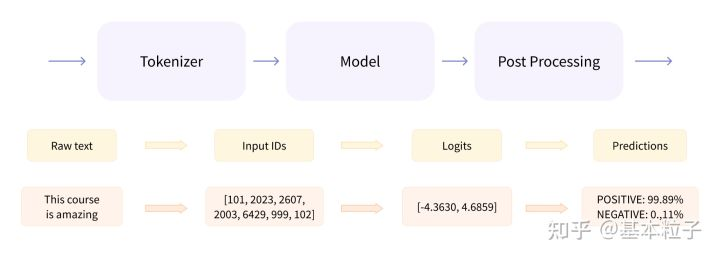

# Pytorch GPT-2

> 参考资料：
    1. [HuggingFace & transformers 介绍和使用方法](https://zhuanlan.zhihu.com/p/535100411)
    2. [HuggingFace 官方文档](https://huggingface.co/docs)
    3. [GPT2tokenizer 和 GPT2model 官方文档：查看 API](https://huggingface.co/docs/transformers/model_doc/gpt2)
    4. [总教程-GPT-2的完整训练过程](https://www.cnblogs.com/wwj99/p/12503545.html)
    5. [GPT-2 模型的使用（方法解释和使用实例）](https://blog.csdn.net/orangerfun/article/details/124138447) + [GPT-2 模型的使用（cnblog）](https://www.cnblogs.com/phyger/p/14188608.html)

## Hugging Face & Transformers

- HuggingFace
    - transformers
    - tokenizers
    - docs & classes & hub


- transformers
    - tokenizer
    - model
    - post processing



## tokenizer

### 原理

[介绍](https://cloud.tencent.com/developer/article/1865689)

### pytorch tokenizer 使用

1. 安装：`conda install transformers`
    - 校验：``


## 遇到的问题

### 1

问题：

```python
ValueError: not enough values to unpack (expected 3, got 2)
```

翻译：返回值只有两个，但是你想把这个返回值拆成三个，例如 `a, b, c = func(x)`

解决办法：查看函数文档，设置对应的变量接受函数值